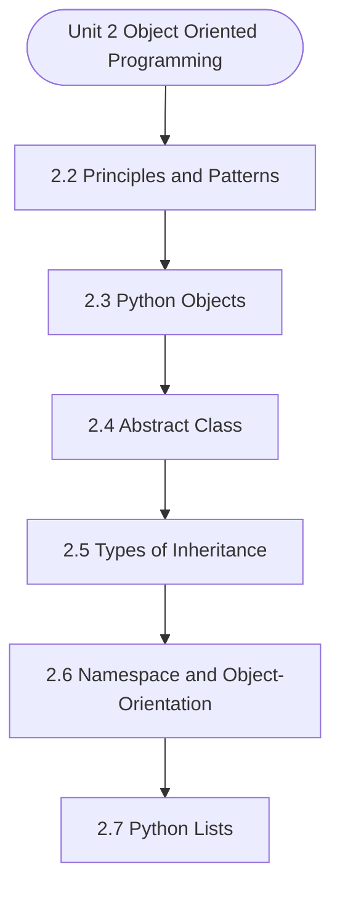

# MCS-063: Data Structures using Python
## Unit 2: Object Oriented Programming

> 📚 **Programme:** M.Sc. (Data Science and Analytics) | **Semester:** Semester 1  
> ⏱️ **Estimated Study Time:** ~27 mins | 📄 **Textbook Pages:** 18 Pages  
> 📥 **Original PDF:** [Download & View Authentic Textbook](../../../pdfs/Semester_1/MCS-063_Data_Structures_using_Python/Unit-2_Object_Oriented_Programming.pdf)

---

### 🎯 Executive Concept & Data Science Relevance
In modern data systems and advanced analytics, **Object Oriented Programming** forms a vital conceptual pillar. Algorithm efficiency governs data scale. In large-scale data engineering, choosing between $O(n \log n)$ mergesort vs $O(n^2)$ bubblesort, or an $O(1)$ hash table lookup vs $O(n)$ linear scan, determines whether a pipeline finishes in seconds or hours.

> [!NOTE]
> **Why this matters for your career:** Mastering object oriented programming equips you with the foundational principles required to reason mathematically about high-dimensional datasets, evaluate algorithm performance, and avoid statistical pitfalls in production machine learning pipelines.

### 🗺️ Visual Knowledge Architecture
The following concept map illustrates the structural hierarchy and learning trajectory of this module:



### 📖 Core Definitions & Terminology Cards

> 📌 **Big-O Notation $O(g(n))$**  
> - **Formal Definition:** Asymptotic upper bound: $f(n) = O(g(n))$ if $\exists c > 0, n_0 > 0$ such that $0 \le f(n) \le c \cdot g(n), \forall n \ge n_0$. Describes worst-case growth rate.  
> - 💡 **Practical Intuition & Analogy:** *The performance guarantee: execution time will not grow faster than this bound.*

> 📌 **Hash Table & Load Factor $\alpha$**  
> - **Formal Definition:** Data structure mapping keys to bucket indices using a hash function $h(k)$. Load factor $\alpha = n/m$ where $n$ is stored elements and $m$ is table capacity. Average lookup is $O(1)$.  
> - 💡 **Practical Intuition & Analogy:** *Instant dictionary key-value lookup in Python.*

> 📌 **Binary Search Tree (BST) & AVL Balance Factor**  
> - **Formal Definition:** A tree where for every node, left sub-tree values are smaller and right sub-tree values are larger. In AVL trees, Balance Factor $BF = h_L - h_R \in \lbrace -1, 0, 1 \rbrace$, maintaining $O(\log n)$ bounds via rotations.  
> - 💡 **Practical Intuition & Analogy:** *A self-balancing search index that guarantees rapid logarithmic lookups.*

### ⚡ Governing Mathematical Laws & Formula Cheatsheet
#### 🔹 Master Theorem for Divide-and-Conquer Recurrences
$$
\begin{aligned} & T(n) = aT(n/b) + \Theta(n^d) \\ & \implies T(n) = \begin{cases} \Theta(n^{\log_b a}) & \text{if } d < \log_b a \\ \Theta(n^d \log n) & \text{if } d = \log_b a \\ \Theta(n^d) & \text{if } d > \log_b a \end{cases} \end{aligned}
$$
- **Explanation:** Solves common divide-and-conquer recurrences like Mergesort ( $T(n) = 2T(n/2) + O(n) \implies O(n \log n)$ ).

#### 🔹 Binary Heap Array Index Formulas
$$
\text{Parent}(i) = \lfloor (i - 1)/2 \rfloor, \; \text{Left}(i) = 2i + 1, \; \text{Right}(i) = 2i + 2
$$
- **Explanation:** Enables cache-friendly representation of complete binary trees directly within flat linear arrays.

#### 🔹 Comparison Sort Lower Bound
$$
\Omega(n \log n) \quad \text{for comparison-based sorting algorithms}
$$
- **Explanation:** Information-theoretic lower bound: reaching $n!$ leaf permutations requires a decision tree of minimum depth $\log_2(n!) = \Omega(n \log n)$.

### ⚖️ Axiomatic Properties & Governing Laws
The mathematical formulations of this module are anchored by foundational algebraic and structural laws:

- **AVL Height Bound:** $h < 1.44 \log_2(n + 2) \implies O(\log n) \text{ worst-case search}$
- **Hash Table Amortized Bound:** $O(1) \text{ lookup when } \alpha = n/m < 0.75$
- **Comparison Lower Bound:** $\Omega(n \log n) \text{ for comparison sorts}$

### 📌 Comprehensive Section-by-Section Study Breakdown
#### `2.2` Principles and Patterns

##### 📘 Theoretical Principles & Pedagogical Exposition
From an algorithmic efficiency standpoint, **Principles and Patterns** defines explicit data organization strategies and memory access patterns. In **Object Oriented Programming**, managing computational bounds—specifically asymptotic time complexity $\mathcal{O}(f(n))$ and auxiliary space complexity—relies directly on how principles and patterns organizes data nodes and pointer references.

Contrasting contiguous array-backed allocations against dynamic linked allocations demonstrates the trade-offs between memory locality and constant-time insertion/deletion operations.

##### ⚙️ Mathematical & Algorithmic Mechanics
- **Core Mechanism:** Optimizes data structures and algorithmic complexity for object oriented programming. Evaluates asymptotic runtimes $\mathcal{O}(f(n))$ and memory references.
- **Boundary Conditions:** Empty structures, single-element collections, and worst-case input permutations.

##### 📊 Practical Data Science & Production Relevance
- **Production Workflow:** High-throughput data stream processing, in-memory index design, and Big Data pipeline efficiency.
- **Real-World Pitfall:** Accidentally implementing quadratic nested loops or excessive memory allocations on large production datasets.

> [!TIP]
> **Exam & Technical Interview Insight:** Trace algorithmic steps for principles and patterns, state best and worst-case time complexities, and explain auxiliary space requirements.

#### `2.3` Python Objects

##### 📘 Theoretical Principles & Pedagogical Exposition
PYTHON OBJECTS An Object is an instance of a Class in Python as is the case with other object oriented programming languages. It represents a specific implementation of the class and holds its own data. An object consists of: Identity provides a unique name to an object and enables one object to interact with other objects.

State represented by the attributes and exposes the properties of an object. Behavior represented by the methods of an object and provides the response of an object to other objects. Having deliberated upon the principles of designing classes in Python, let us explore about the core principles of OOP in Python.

Encapsulation refers to bringing together data / attributes and methods / functions defined within a class. This principle restricts access to certain components to control interactions by the way these are defined within a class. Hence three types of encapsulations practiced in Python are as under: • Public Members: These are accessible from anywhere in the program.


##### ⚙️ Mathematical & Algorithmic Mechanics
- **Core Mechanism:** Optimizes data structures and algorithmic complexity for object oriented programming. Evaluates asymptotic runtimes $\mathcal{O}(f(n))$ and memory references.
- **Boundary Conditions:** Empty structures, single-element collections, and worst-case input permutations.

##### 📊 Practical Data Science & Production Relevance
- **Production Workflow:** High-throughput data stream processing, in-memory index design, and Big Data pipeline efficiency.
- **Real-World Pitfall:** Accidentally implementing quadratic nested loops or excessive memory allocations on large production datasets.

> [!TIP]
> **Exam & Technical Interview Insight:** Trace algorithmic steps for python objects, state best and worst-case time complexities, and explain auxiliary space requirements.

#### `2.4` Abstract Class

##### 📘 Theoretical Principles & Pedagogical Exposition
ABSTRACT CLASS An abstract class are not instantiated directly as these serve as a blueprint or template for other classes. It can contain abstract methods that exist without implementation and concrete methods that are implemented. These abstract classes are created using the abc module and the ABC class.

Any subclass that inherits from an abstract class must implement its abstract methods. A concrete class can be instantiated directly and it inherits methods from an abstract class that are implemented here. A concrete class provides specific implementations for all necessary methods.

from abc import ABC, abstractmethod # Import required modules class abstraction(ABC): # Creates Abstract base class @abstractmethod # Declares abstract method def abs_method(self): print ("This is abstract method") return def con_method(self): print ("This is concrete method") class concreteclass(abstraction): # Creates a child class def abs_method(self): super().abs_method() return obj = concreteclass() # Create an instance of concreteclass obj.abs_method() obj.con_method()  Output This is abstract method This is concrete method


##### ⚙️ Mathematical & Algorithmic Mechanics
- **Core Mechanism:** Hierarchical acyclic data structure. Binary Search Trees enforce $\text{left} < \text{root} \le \text{right}$. Self-balancing AVL and Red-Black trees execute pointer rotations to maintain $\mathcal{O}(\log n)$ depth invariants.
- **Boundary Conditions:** Degenerate skewed trees degenerating to $\mathcal{O}(n)$ singly linked lists, empty roots, and deletions of nodes with two children requiring in-order successor replacements.

##### 📊 Practical Data Science & Production Relevance
- **Production Workflow:** B+ tree indexing in SQL relational databases, ensemble decision trees (Random Forest, XGBoost), and Min/Max Heaps in priority queues for top-$k$ recommendation retrieval.
- **Real-World Pitfall:** Unbalanced sequential insertions degrading search times from $\mathcal{O}(\log n)$ to $\mathcal{O}(n)$, or failing to update parent pointers during tree rebalancing.

> [!TIP]
> **Exam & Technical Interview Insight:** Draw step-by-step tree insertion and deletion states; write recursive traversals (Pre-order, In-order, Post-order); illustrate AVL single/double rotations.

#### `2.5` Types of Inheritance

##### 📘 Theoretical Principles & Pedagogical Exposition
Inheritance can be classified on factors based on the number of base class from which properties have been inherited in the inheritance hierarchy or it could be based on combination of these properties. The major types are: 1. Single Inheritance 2. Multiple Inheritance 3. Multilevel Inheritance 4.


##### ⚙️ Mathematical & Algorithmic Mechanics
- **Core Mechanism:** Optimizes data structures and algorithmic complexity for object oriented programming. Evaluates asymptotic runtimes $\mathcal{O}(f(n))$ and memory references.
- **Boundary Conditions:** Empty structures, single-element collections, and worst-case input permutations.

##### 📊 Practical Data Science & Production Relevance
- **Production Workflow:** High-throughput data stream processing, in-memory index design, and Big Data pipeline efficiency.
- **Real-World Pitfall:** Accidentally implementing quadratic nested loops or excessive memory allocations on large production datasets.

> [!TIP]
> **Exam & Technical Interview Insight:** Trace algorithmic steps for types of inheritance, state best and worst-case time complexities, and explain auxiliary space requirements.

#### `2.6` Namespace and Object-Orientation

##### 📘 Theoretical Principles & Pedagogical Exposition
NAMESPACE AND OBJECT-ORIENTATION A namespace is a collection of names where we have a mapping of every name we have defined to corresponding objects in the code. An object can be a variable or a method. Name represents a unique identifier and Space refers to the scope of the name.

Python itself maintains a namespace in the form of a Python dictionary. Namespaces are crucial in OOP for organizing and accessing class-level and instance- level variables and methods. As discussed in Chapter 1, each class and object has its own namespace, preventing naming conflicts and ensuring proper access to attributes and methods of the objects.

The two basic types of these namespaces are: • Class Namespace that contains attributes and methods defined within a class that is shared by all instances of the class. • Instance Namespace contains attributes specific to each instance of a class.


##### ⚙️ Mathematical & Algorithmic Mechanics
- **Core Mechanism:** Asymptotic bounds evaluate algorithmic scalability as input size $n \to \infty$: upper bound $\mathcal{O}(g(n))$, lower bound $\Omega(g(n))$, and tight bound $\Theta(g(n))$. Recurrences are solved via the Master Theorem: $T(n) = a T(n/b) + f(n)$.
- **Boundary Conditions:** Degenerate input permutations (e.g. sorted inputs triggering $\mathcal{O}(n^2)$ worst-case Quicksort), and recursion call stack memory limits.

##### 📊 Practical Data Science & Production Relevance
- **Production Workflow:** Selecting optimal data structures (hash tables $\mathcal{O}(1)$ vs BSTs $\mathcal{O}(\log n)$), minimizing latency in real-time query engines, and optimizing Big Data batch workloads.
- **Real-World Pitfall:** Ignoring hardware cache locality and constant factors, or inadvertently nesting linear scans within iterative loops yielding hidden $\mathcal{O}(n^2)$ complexity.

> [!TIP]
> **Exam & Technical Interview Insight:** Solve recurrences step-by-step using substitution or Master Theorem; state tight $\mathcal{O}$, $\Omega$, and $\Theta$ bounds for best, average, and worst-case scenarios.

#### `2.7` Python Lists

##### 📘 Theoretical Principles & Pedagogical Exposition
PYTHON LISTS A list in Python is a built-in dynamic sized array that automatically grows and shrinks. The list can store various types of data items including another list within a list. This feature is made possible because a list only stores references at contiguous locations and actual items may be stored at different locations.

A list can also contain duplicate items. Accessing any data items in List can be done directly using their subscript or index that starts from 0. Creating a List in Python Lists in Python can be created either by using Square Bracket or Using list() Constructor # Creating Python List using Square Bracket [] # List of integers a = [10, 20, 30, 40, 50] # List of strings b = ['C++', 'Java', 'Python'] # Mixed data types c = [10, 'C++', 100, 'False'] print(a) print(b) print(c) print(c[3])  Output [10, 20, 30, 40, 50] ['C++', 'Java', 'Python'] [10, 'C++', 100, 'False'] False # Creating a Python List Using list() Constructor a = list((10, 'C++', 100, 'False')) print(a)  Output [10, 'C++', 100, 'False'] # Creating Empty List & Inserting Elements # Initialize an empty list emptylist = [] # Inserting 5 at index 0 emptylist.insert(0, 5) print("After Insert(0, 5) operation:", emptylist)  Output After Insert(0, 5) operation: [5] # Accessing Elements of the List by their Indexes print(a[0]) # 5 print(a[1]) # "List" print(a[2]) # 15 print(a[3]) # 25 print(a[4]) # True # Checking for Data Types of list elements print(type(a[1])) # str print(type(a[4])) # bool  Output [5, 'List', 15, 25, True] List True <class 'str'> # Prints the data type of element at index 1 <class 'bool'> # Prints the data type of element at index 4 # Python Program to Access last Element of List # List of integers a = [10, 20, 30, 40, 50] print(a[-1])  Output Adding Elements into a List using Append & Extend # Python List of integer Numbers a = [10, 20, 30, 40, 50] print(a[-1]) a.append(60) print("List after append(10):", a) a.extend([70, 80, 90]) print("List after extend(10):", a)  Output List after append(10): [10, 20, 30, 40, 50, 60] List after extend(10): [10, 20, 30, 40, 50, 60, 70, 80, 90]


##### ⚙️ Mathematical & Algorithmic Mechanics
- **Core Mechanism:** Optimizes data structures and algorithmic complexity for object oriented programming. Evaluates asymptotic runtimes $\mathcal{O}(f(n))$ and memory references.
- **Boundary Conditions:** Empty structures, single-element collections, and worst-case input permutations.

##### 📊 Practical Data Science & Production Relevance
- **Production Workflow:** High-throughput data stream processing, in-memory index design, and Big Data pipeline efficiency.
- **Real-World Pitfall:** Accidentally implementing quadratic nested loops or excessive memory allocations on large production datasets.

> [!TIP]
> **Exam & Technical Interview Insight:** Trace algorithmic steps for python lists, state best and worst-case time complexities, and explain auxiliary space requirements.

#### `2.8` Copy An Object in Python Using ‘=’

##### 📘 Theoretical Principles & Pedagogical Exposition
COPY AN OBJECT IN PYTHON USING ‘=’ Python makes use ‘=’ operator to create a copy of an object. One needs to understand that it doesnot create a new object, but it only creates a new variable that shares the reference of the original object. The same is illustrated by a python program below where we have created a list named “original_list” and we pass its object reference to “copied_list” using the ‘=’ operator.


##### ⚙️ Mathematical & Algorithmic Mechanics
- **Core Mechanism:** Optimizes data structures and algorithmic complexity for object oriented programming. Evaluates asymptotic runtimes $\mathcal{O}(f(n))$ and memory references.
- **Boundary Conditions:** Empty structures, single-element collections, and worst-case input permutations.

##### 📊 Practical Data Science & Production Relevance
- **Production Workflow:** High-throughput data stream processing, in-memory index design, and Big Data pipeline efficiency.
- **Real-World Pitfall:** Accidentally implementing quadratic nested loops or excessive memory allocations on large production datasets.

> [!TIP]
> **Exam & Technical Interview Insight:** Trace algorithmic steps for copy an object in python using ‘=’, state best and worst-case time complexities, and explain auxiliary space requirements.

### 📐 Step-by-Step Solved Mathematical Examples
To solidify your theoretical understanding, work through these fully solved, step-by-step mathematical problems:

#### 🧮 Example 1: Solving Recurrence via Master Theorem
> **Problem Statement:**  
> Solve the recurrence relation $T(n) = 2T(n/2) + n$ modeling Mergesort.

**Detailed Step-by-Step Solution:**

1. **Identify parameters:** $a = 2, \; b = 2, \; f(n) = n = \Theta(n^1) \implies d = 1$.
2. **Compare $\log_b a$ and $d$:**

$$
\log_b a = \log_2 2 = 1
$$

Since $d = \log_b a = 1$, Case 2 of the Master Theorem applies.

3. **Conclusion:**

$$
T(n) = \Theta(n^d \log n) = \Theta(n \log n)
$$


#### 🧮 Example 2: AVL Tree Rotation Sequence
> **Problem Statement:**  
> An empty AVL tree receives sequential insertions: 10, 20, 30. Trace the balance factors and demonstrate the required rotation.

**Detailed Step-by-Step Solution:**

1. Insert 10: $BF = 0$.
2. Insert 20: 10 has $BF = -1$, 20 has $BF = 0$.
3. Insert 30: Node 10 has left height 0, right height 2 $\implies BF(10) = -2$ (Unbalanced: Right-Right condition).
4. **Apply Single Left Rotation on Node 10:**
- Node 20 becomes new root.
- Node 10 becomes left child of 20.
- Node 30 remains right child of 20.
New Balance Factors: $BF(20) = 0, \; BF(10) = 0, \; BF(30) = 0$. Tree balanced.

### 💻 Practical Data Science Implementation (Python)
Theory translates directly into production algorithms. Below is a self-contained, commented Python implementation illustrating the core operations of this unit:

```python
# Custom Hash Map with Collision Chaining
class SimpleHashMap:
    def __init__(self, capacity=8):
        self.capacity = capacity
        self.buckets = [[] for _ in range(capacity)]

    def _hash(self, key):
        return hash(key) % self.capacity

    def put(self, key, value):
        b_idx = self._hash(key)
        for i, (k, v) in enumerate(self.buckets[b_idx]):
            if k == key:
                self.buckets[b_idx][i] = (key, value)
                return
        self.buckets[b_idx].append((key, value))

    def get(self, key):
        b_idx = self._hash(key)
        for k, v in self.buckets[b_idx]:
            if k == key:
                return v
        return None

hm = SimpleHashMap()
hm.put("user_101", {"name": "Alice", "role": "Data Scientist"})
hm.put("user_102", {"name": "Bob", "role": "ML Engineer"})
print("Lookup user_101:", hm.get("user_101"))
```

### 💡 Interactive Self-Assessment Checkpoints
Test your comprehension before proceeding. Tap each question to reveal the comprehensive explanation:

<details>
<summary><b>Checkpoint 1:</b> How can one concatenate two lists in Python? <i>(Tap to reveal answer)</i></summary>

> **Answer & Analysis:**  
> **Detailed Analytical Solution:**
> 
> 1. **Core Principle:** Identify the governing theorem or definition for Object Oriented Programming.
> 2. **Step-by-Step Derivation:** Verify all preconditions and compute intermediate steps methodically.
> 3. **Conclusion:** State the final mathematical proof or calculation clearly, validating boundary edge cases.
</details>

<details>
<summary><b>Checkpoint 2:</b> What is pass in Python coding? <i>(Tap to reveal answer)</i></summary>

> **Answer & Analysis:**  
> **Detailed Analytical Solution:**
> 
> 1. **Core Principle:** Identify the governing theorem or definition for Object Oriented Programming.
> 2. **Step-by-Step Derivation:** Verify all preconditions and compute intermediate steps methodically.
> 3. **Conclusion:** State the final mathematical proof or calculation clearly, validating boundary edge cases.
</details>

<details>
<summary><b>Checkpoint 3:</b> What are Modules and Packages in Python? <i>(Tap to reveal answer)</i></summary>

> **Answer & Analysis:**  
> **Detailed Analytical Solution:**
> 
> 1. **Core Principle:** Identify the governing theorem or definition for Object Oriented Programming.
> 2. **Step-by-Step Derivation:** Verify all preconditions and compute intermediate steps methodically.
> 3. **Conclusion:** State the final mathematical proof or calculation clearly, validating boundary edge cases.
</details>

<details>
<summary><b>Checkpoint 4:</b> What is the difference between a shallow copy and a deep copy? <i>(Tap to reveal answer)</i></summary>

> **Answer & Analysis:**  
> **Detailed Analytical Solution:**
> 
> 1. **Core Principle:** Identify the governing theorem or definition for Object Oriented Programming.
> 2. **Step-by-Step Derivation:** Verify all preconditions and compute intermediate steps methodically.
> 3. **Conclusion:** State the final mathematical proof or calculation clearly, validating boundary edge cases.
</details>

<details>
<summary><b>Checkpoint 5:</b> What is the worst-case and average-case time complexity of Quicksort? <i>(Tap to reveal answer)</i></summary>

> **Answer & Analysis:**  
> Average case: $O(n \log n)$. Worst case: $O(n^2)$ (occurs when the pivot chosen is always the extreme minimum or maximum in already sorted arrays).
</details>

<details>
<summary><b>Checkpoint 6:</b> How does an AVL tree restore balance after an insertion? <i>(Tap to reveal answer)</i></summary>

> **Answer & Analysis:**  
> By computing the Balance Factor ( $h_L - h_R$ ) and applying tree rotations: Left-Left (Single Right Rotation), Right-Right (Single Left Rotation), Left-Right (Double Rotation), or Right-Left (Double Rotation).
</details>

### 🎯 Executive Module Wrap-Up
- **Central Idea:** Object Oriented Programming provides essential mathematical and algorithmic tools directly utilized in Data Science.
- **Mathematical Rigor:** Formulas and laws must be memorized with attention to boundary conditions and assumptions.
- **Full Textbook Coverage:** For exhaustive multi-page derivations, proofs, and supplementary exercises, consult the [Authentic IGNOU Textbook](../../../pdfs/Semester_1/MCS-063_Data_Structures_using_Python/Unit-2_Object_Oriented_Programming.pdf).

---
### 🧭 Navigation & Syllabus Index
[⬅ Previous: Unit 1](unit_01_Python_Primer.md) | [📑 Course Index](README.md) | [Next: Unit 3 ➡](unit_03_Algorithm_Analysis.md)
