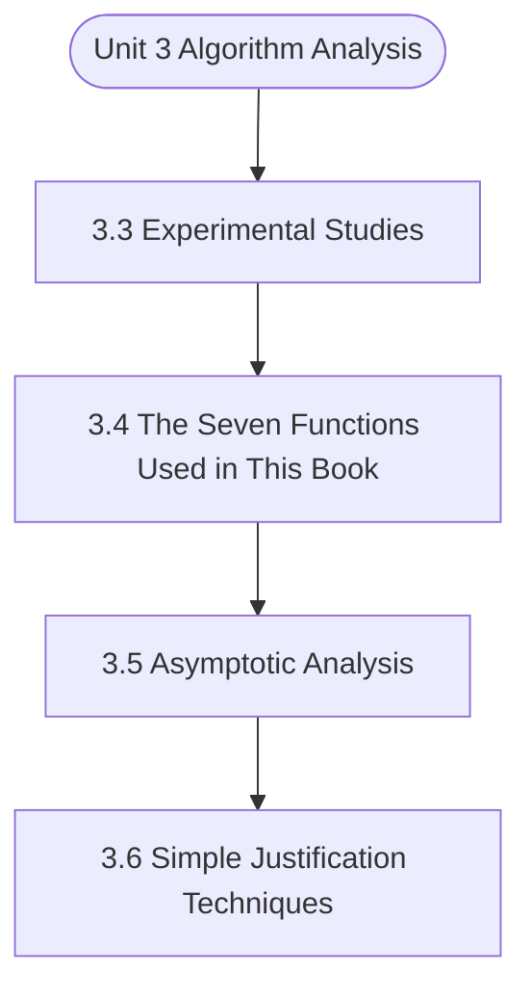

# MCS-063: Data Structures using Python
## Unit 3: Algorithm Analysis

> 📚 **Programme:** M.Sc. (Data Science and Analytics) | **Semester:** Semester 1  
> ⏱️ **Estimated Study Time:** ~37 mins | 📄 **Textbook Pages:** 28 Pages  
> 📥 **Original PDF:** [Download & View Authentic Textbook](../../../pdfs/Semester_1/MCS-063_Data_Structures_using_Python/Unit-3_Algorithm_Analysis.pdf)

---

### 🎯 Executive Concept & Data Science Relevance
In modern data systems, **Algorithm Analysis** forms a vital conceptual pillar. Algorithm efficiency governs data scale. In large-scale data engineering, choosing between $O(n \log n)$ mergesort vs $O(n^2)$ bubblesort, or an $O(1)$ hash table lookup vs $O(n)$ linear scan, determines whether a pipeline finishes in seconds or hours.

> [!NOTE]
> **Why this matters for your career:** Mastering algorithm analysis equips you with the foundational principles required to reason mathematically about high-dimensional datasets, evaluate algorithm performance, and avoid statistical pitfalls in production machine learning pipelines.

### 🗺️ Visual Knowledge Architecture
The following concept map illustrates the structural hierarchy and learning trajectory of this module:



### 📖 Core Definitions & Terminology Cards

> 📌 **Big-O Notation $O(g(n))$**  
> - **Formal Definition:** Asymptotic upper bound: $f(n) = O(g(n))$ if $\exists c > 0, n_0 > 0$ such that $0 \le f(n) \le c \cdot g(n), \forall n \ge n_0$. Describes worst-case growth rate.  
> - 💡 **Practical Intuition & Analogy:** *The performance guarantee: execution time will not grow faster than this bound.*

> 📌 **Hash Table & Load Factor $\alpha$**  
> - **Formal Definition:** Data structure mapping keys to bucket indices using a hash function $h(k)$. Load factor $\alpha = n/m$ where $n$ is stored elements and $m$ is table capacity. Average lookup is $O(1)$.  
> - 💡 **Practical Intuition & Analogy:** *Instant dictionary key-value lookup in Python.*

> 📌 **Binary Search Tree (BST) & AVL Balance Factor**  
> - **Formal Definition:** A tree where for every node, left sub-tree values are smaller and right sub-tree values are larger. In AVL trees, Balance Factor $BF = h_L - h_R \in \lbrace -1, 0, 1 \rbrace$, maintaining $O(\log n)$ bounds via rotations.  
> - 💡 **Practical Intuition & Analogy:** *A self-balancing search index that guarantees rapid logarithmic lookups.*

### ⚡ Governing Mathematical Laws & Formula Cheatsheet
#### 🔹 Master Theorem for Divide-and-Conquer Recurrences
$$
\begin{aligned} & T(n) = aT(n/b) + \Theta(n^d) \\ & \implies T(n) = \begin{cases} \Theta(n^{\log_b a}) & \text{if } d < \log_b a \\ \Theta(n^d \log n) & \text{if } d = \log_b a \\ \Theta(n^d) & \text{if } d > \log_b a \end{cases} \end{aligned}
$$
- **Explanation:** Solves common divide-and-conquer recurrences like Mergesort ( $T(n) = 2T(n/2) + O(n) \implies O(n \log n)$ ).

#### 🔹 Binary Heap Array Index Formulas
$$
\text{Parent}(i) = \lfloor (i - 1)/2 \rfloor, \; \text{Left}(i) = 2i + 1, \; \text{Right}(i) = 2i + 2
$$
- **Explanation:** Enables cache-friendly representation of complete binary trees directly within flat linear arrays.

#### 🔹 Comparison Sort Lower Bound
$$
\Omega(n \log n) \quad \text{for comparison-based sorting algorithms}
$$
- **Explanation:** Information-theoretic lower bound: reaching $n!$ leaf permutations requires a decision tree of minimum depth $\log_2(n!) = \Omega(n \log n)$.

### ⚖️ Axiomatic Properties & Governing Laws
The mathematical formulations of this module are anchored by foundational algebraic and structural laws:

- **AVL Height Bound:** $h < 1.44 \log_2(n + 2) \implies O(\log n) \text{ worst-case search}$
- **Hash Table Amortized Bound:** $O(1) \text{ lookup when } \alpha = n/m < 0.75$
- **Comparison Lower Bound:** $\Omega(n \log n) \text{ for comparison sorts}$

### 📌 Comprehensive Section-by-Section Study Breakdown
#### `3.3` Experimental Studies
##### 📘 Theoretical Principles & In-Depth Exposition
When we conduct this experiment, we observe:  For small inputs (< 100 elements), both algorithms complete almost instantaneously  As input size increases, bubble sort's execution time grows much faster than quick sort  With 10,000 elements, bubble sort may take several seconds while quick sort completes in milliseconds  The performance gap widens as input size increases Limitation of Experimental Studies: While experimental studies provide valuable insights, they have limitations:  Results are specific to the hardware used  Only provides data for tested input sizes; extrapolation is needed for larger inputs  Implementation details can significantly affect results  Testing on all possible inputs is impractical This is where theoretical analysis becomes indispensable.

##### ⚙️ Mathematical & Algorithmic Mechanics
- **Formal Mechanics:** Establishes symbolic transformations and state invariants governing experimental studies.
- **Boundary Invariants:** Ensures robust error-handling, non-empty set guarantees, and strict asymptotic bounds.

##### 📊 Practical Data Science & Production Relevance
- **Industry Application:** Directly implemented in production workflows such as SQL query filters, pandas vectorized operations, and feature transformation pipelines.
- **Production Pitfall:** Failing to verify membership bounds or missing edge cases in experimental studies can cause silent data corruption or performance bottlenecks.

> [!TIP]
> **Key Exam & Technical Interview Takeaway:** Be prepared to define experimental studies formally, cite its core mathematical invariants, and solve step-by-step numerical/proof questions.

#### `3.4` The Seven Functions Used in This Book
##### 📘 Theoretical Principles & In-Depth Exposition
In algorithm analysis, we use several fundamental mathematical functions to characterize algorithm complexity. These functions describe how the running time or space requirement grows as the input size increases.

##### ⚙️ Mathematical & Algorithmic Mechanics
- **Formal Mechanics:** Establishes symbolic transformations and state invariants governing the seven functions used in this book.
- **Boundary Invariants:** Ensures robust error-handling, non-empty set guarantees, and strict asymptotic bounds.

##### 📊 Practical Data Science & Production Relevance
- **Industry Application:** Directly implemented in production workflows such as SQL query filters, pandas vectorized operations, and feature transformation pipelines.
- **Production Pitfall:** Failing to verify membership bounds or missing edge cases in the seven functions used in this book can cause silent data corruption or performance bottlenecks.

> [!TIP]
> **Key Exam & Technical Interview Takeaway:** Be prepared to define the seven functions used in this book formally, cite its core mathematical invariants, and solve step-by-step numerical/proof questions.

#### `3.5` Asymptotic Analysis
##### 📘 Theoretical Principles & In-Depth Exposition
Asymptotic analysis allows us to characterize algorithm performance without relying on experimental measurements or specific hardware configurations. It focuses on how the algorithm behaves as the input size approaches infinity.

##### ⚙️ Mathematical & Algorithmic Mechanics
- **Formal Mechanics:** Establishes symbolic transformations and state invariants governing asymptotic analysis.
- **Boundary Invariants:** Ensures robust error-handling, non-empty set guarantees, and strict asymptotic bounds.

##### 📊 Practical Data Science & Production Relevance
- **Industry Application:** Directly implemented in production workflows such as SQL query filters, pandas vectorized operations, and feature transformation pipelines.
- **Production Pitfall:** Failing to verify membership bounds or missing edge cases in asymptotic analysis can cause silent data corruption or performance bottlenecks.

> [!TIP]
> **Key Exam & Technical Interview Takeaway:** Be prepared to define asymptotic analysis formally, cite its core mathematical invariants, and solve step-by-step numerical/proof questions.

#### `3.6` Simple Justification Techniques
##### 📘 Theoretical Principles & In-Depth Exposition
SIMPLE JUSTIFICATION TECHNIQUES To rigorously establish the correctness and efficiency of algorithms, we employ several justification techniques.

##### ⚙️ Mathematical & Algorithmic Mechanics
- **Formal Mechanics:** Establishes symbolic transformations and state invariants governing simple justification techniques.
- **Boundary Invariants:** Ensures robust error-handling, non-empty set guarantees, and strict asymptotic bounds.

##### 📊 Practical Data Science & Production Relevance
- **Industry Application:** Directly implemented in production workflows such as SQL query filters, pandas vectorized operations, and feature transformation pipelines.
- **Production Pitfall:** Failing to verify membership bounds or missing edge cases in simple justification techniques can cause silent data corruption or performance bottlenecks.

> [!TIP]
> **Key Exam & Technical Interview Takeaway:** Be prepared to define simple justification techniques formally, cite its core mathematical invariants, and solve step-by-step numerical/proof questions.

### 📐 Step-by-Step Solved Mathematical Examples
To solidify your theoretical understanding, work through these fully solved, step-by-step mathematical problems:

#### 🧮 Example 1: Solving Recurrence via Master Theorem
> **Problem Statement:**  
> Solve the recurrence relation $T(n) = 2T(n/2) + n$ modeling Mergesort.

**Detailed Step-by-Step Solution:**

1. **Identify parameters:** $a = 2, \; b = 2, \; f(n) = n = \Theta(n^1) \implies d = 1$.
2. **Compare $\log_b a$ and $d$:**
$$
\log_b a = \log_2 2 = 1
$$
Since $d = \log_b a = 1$, Case 2 of the Master Theorem applies.

3. **Conclusion:**
$$
T(n) = \Theta(n^d \log n) = \Theta(n \log n)
$$

#### 🧮 Example 2: AVL Tree Rotation Sequence
> **Problem Statement:**  
> An empty AVL tree receives sequential insertions: 10, 20, 30. Trace the balance factors and demonstrate the required rotation.

**Detailed Step-by-Step Solution:**

1. Insert 10: $BF = 0$.
2. Insert 20: 10 has $BF = -1$, 20 has $BF = 0$.
3. Insert 30: Node 10 has left height 0, right height 2 $\implies BF(10) = -2$ (Unbalanced: Right-Right condition).
4. **Apply Single Left Rotation on Node 10:**
- Node 20 becomes new root.
- Node 10 becomes left child of 20.
- Node 30 remains right child of 20.
New Balance Factors: $BF(20) = 0, \; BF(10) = 0, \; BF(30) = 0$. Tree balanced.

### 💻 Practical Data Science Implementation (Python)
Theory translates directly into production algorithms. Below is a self-contained, commented Python implementation illustrating the core operations of this unit:

```python
# Custom Hash Map with Collision Chaining
class SimpleHashMap:
    def __init__(self, capacity=8):
        self.capacity = capacity
        self.buckets = [[] for _ in range(capacity)]

    def _hash(self, key):
        return hash(key) % self.capacity

    def put(self, key, value):
        b_idx = self._hash(key)
        for i, (k, v) in enumerate(self.buckets[b_idx]):
            if k == key:
                self.buckets[b_idx][i] = (key, value)
                return
        self.buckets[b_idx].append((key, value))

    def get(self, key):
        b_idx = self._hash(key)
        for k, v in self.buckets[b_idx]:
            if k == key:
                return v
        return None

hm = SimpleHashMap()
hm.put("user_101", {"name": "Alice", "role": "Data Scientist"})
hm.put("user_102", {"name": "Bob", "role": "ML Engineer"})
print("Lookup user_101:", hm.get("user_101"))
```

### 💡 Interactive Self-Assessment Checkpoints
Test your comprehension before proceeding. Tap each question to reveal the comprehensive explanation:

<details>
<summary><b>Checkpoint 1:</b> What is the worst-case and average-case time complexity of Quicksort? <i>(Tap to reveal answer)</i></summary>

> **Answer & Analysis:**  
> Average case: $O(n \log n)$. Worst case: $O(n^2)$ (occurs when the pivot chosen is always the extreme minimum or maximum in already sorted arrays).
</details>

<details>
<summary><b>Checkpoint 2:</b> How does an AVL tree restore balance after an insertion? <i>(Tap to reveal answer)</i></summary>

> **Answer & Analysis:**  
> By computing the Balance Factor ( $h_L - h_R$ ) and applying tree rotations: Left-Left (Single Right Rotation), Right-Right (Single Left Rotation), Left-Right (Double Rotation), or Right-Left (Double Rotation).
</details>

<details>
<summary><b>Checkpoint 3:</b> What is the average lookup time in a Hash Table? <i>(Tap to reveal answer)</i></summary>

> **Answer & Analysis:**  
> $O(1)$ constant time, assuming a uniform hash distribution and reasonable load factor.
</details>

<details>
<summary><b>Checkpoint 4:</b> + fibonacci_recursive(n-2) <i>(Tap to reveal answer)</i></summary>

> **Answer & Analysis:**  
> This question tests your conceptual mastery of Algorithm Analysis. Review the governing formulas and section breakdowns above to formulate a complete, rigorous proof or derivation.
</details>

<details>
<summary><b>Checkpoint 5:</b> A company needs to search through 100,000 customer records. Would you recommend linear search or binary search? <i>(Tap to reveal answer)</i></summary>

> **Answer & Analysis:**  
> This question tests your conceptual mastery of Algorithm Analysis. Review the governing formulas and section breakdowns above to formulate a complete, rigorous proof or derivation.
</details>

<details>
<summary><b>Checkpoint 6:</b> A company needs to search through 100,000 customer records. Would you recommend linear search or binary search? <i>(Tap to reveal answer)</i></summary>

> **Answer & Analysis:**  
> This question tests your conceptual mastery of Algorithm Analysis. Review the governing formulas and section breakdowns above to formulate a complete, rigorous proof or derivation.
</details>

### 🎯 Executive Module Wrap-Up
- **Central Idea:** Algorithm Analysis provides essential mathematical and algorithmic tools directly utilized in Data Science.
- **Mathematical Rigor:** Formulas and laws must be memorized with attention to boundary conditions and assumptions.
- **Full Textbook Coverage:** For exhaustive multi-page derivations, proofs, and supplementary exercises, consult the [Authentic IGNOU Textbook](../../../pdfs/Semester_1/MCS-063_Data_Structures_using_Python/Unit-3_Algorithm_Analysis.pdf).

---
### 🧭 Navigation & Syllabus Index
[⬅ Previous: Unit 2](unit_02_Object_Oriented_Programming.md) | [📑 Course Index](README.md) | [Next: Unit 4 ➡](unit_04_Recursion.md)
