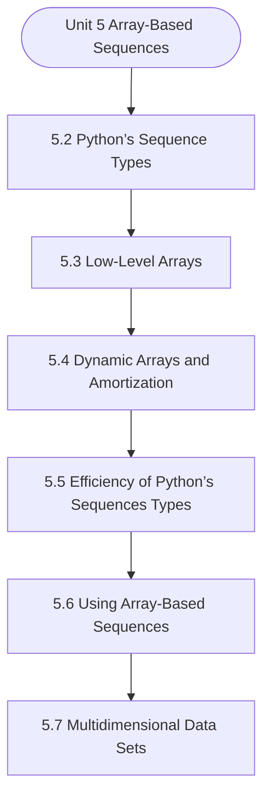

# MCS-063: Data Structures using Python
## Unit 5: Array-Based Sequences

> 📚 **Programme:** M.Sc. (Data Science and Analytics) | **Semester:** Semester 1  
> ⏱️ **Estimated Study Time:** ~23 mins | 📄 **Textbook Pages:** 19 Pages  
> 📥 **Original PDF:** [Download & View Authentic Textbook](../../../pdfs/Semester_1/MCS-063_Data_Structures_using_Python/Unit-5_Array-Based_Sequences.pdf)

---

### 🎯 Executive Concept & Data Science Relevance
In modern data systems and advanced analytics, **Array-Based Sequences** forms a vital conceptual pillar. Algorithm efficiency governs data scale. In large-scale data engineering, choosing between $O(n \log n)$ mergesort vs $O(n^2)$ bubblesort, or an $O(1)$ hash table lookup vs $O(n)$ linear scan, determines whether a pipeline finishes in seconds or hours.

> [!NOTE]
> **Why this matters for your career:** Mastering array-based sequences equips you with the foundational principles required to reason mathematically about high-dimensional datasets, evaluate algorithm performance, and avoid statistical pitfalls in production machine learning pipelines.

### 🗺️ Visual Knowledge Architecture
The following concept map illustrates the structural hierarchy and learning trajectory of this module:



### 📖 Core Definitions & Terminology Cards

> 📌 **Big-O Notation $O(g(n))$**  
> - **Formal Definition:** Asymptotic upper bound: $f(n) = O(g(n))$ if $\exists c > 0, n_0 > 0$ such that $0 \le f(n) \le c \cdot g(n), \forall n \ge n_0$. Describes worst-case growth rate.  
> - 💡 **Practical Intuition & Analogy:** *The performance guarantee: execution time will not grow faster than this bound.*

> 📌 **Hash Table & Load Factor $\alpha$**  
> - **Formal Definition:** Data structure mapping keys to bucket indices using a hash function $h(k)$. Load factor $\alpha = n/m$ where $n$ is stored elements and $m$ is table capacity. Average lookup is $O(1)$.  
> - 💡 **Practical Intuition & Analogy:** *Instant dictionary key-value lookup in Python.*

> 📌 **Binary Search Tree (BST) & AVL Balance Factor**  
> - **Formal Definition:** A tree where for every node, left sub-tree values are smaller and right sub-tree values are larger. In AVL trees, Balance Factor $BF = h_L - h_R \in \lbrace -1, 0, 1 \rbrace$, maintaining $O(\log n)$ bounds via rotations.  
> - 💡 **Practical Intuition & Analogy:** *A self-balancing search index that guarantees rapid logarithmic lookups.*

### ⚡ Governing Mathematical Laws & Formula Cheatsheet
#### 🔹 Master Theorem for Divide-and-Conquer Recurrences
$$
\begin{aligned} & T(n) = aT(n/b) + \Theta(n^d) \\ & \implies T(n) = \begin{cases} \Theta(n^{\log_b a}) & \text{if } d < \log_b a \\ \Theta(n^d \log n) & \text{if } d = \log_b a \\ \Theta(n^d) & \text{if } d > \log_b a \end{cases} \end{aligned}
$$
- **Explanation:** Solves common divide-and-conquer recurrences like Mergesort ( $T(n) = 2T(n/2) + O(n) \implies O(n \log n)$ ).

#### 🔹 Binary Heap Array Index Formulas
$$
\text{Parent}(i) = \lfloor (i - 1)/2 \rfloor, \; \text{Left}(i) = 2i + 1, \; \text{Right}(i) = 2i + 2
$$
- **Explanation:** Enables cache-friendly representation of complete binary trees directly within flat linear arrays.

#### 🔹 Comparison Sort Lower Bound
$$
\Omega(n \log n) \quad \text{for comparison-based sorting algorithms}
$$
- **Explanation:** Information-theoretic lower bound: reaching $n!$ leaf permutations requires a decision tree of minimum depth $\log_2(n!) = \Omega(n \log n)$.

### ⚖️ Axiomatic Properties & Governing Laws
The mathematical formulations of this module are anchored by foundational algebraic and structural laws:

- **AVL Height Bound:** $h < 1.44 \log_2(n + 2) \implies O(\log n) \text{ worst-case search}$
- **Hash Table Amortized Bound:** $O(1) \text{ lookup when } \alpha = n/m < 0.75$
- **Comparison Lower Bound:** $\Omega(n \log n) \text{ for comparison sorts}$

### 📌 Comprehensive Section-by-Section Study Breakdown
#### `5.2` Python’s Sequence Types

##### 📘 Theoretical Principles & Pedagogical Exposition
From an algorithmic efficiency standpoint, **Python’s Sequence Types** defines explicit data organization strategies and memory access patterns. In **Array-Based Sequences**, managing computational bounds—specifically asymptotic time complexity $\mathcal{O}(f(n))$ and auxiliary space complexity—relies directly on how python’s sequence types organizes data nodes and pointer references.

Contrasting contiguous array-backed allocations against dynamic linked allocations demonstrates the trade-offs between memory locality and constant-time insertion/deletion operations.

##### ⚙️ Mathematical & Algorithmic Mechanics
- **Core Mechanism:** Optimizes data structures and algorithmic complexity for array-based sequences. Evaluates asymptotic runtimes $\mathcal{O}(f(n))$ and memory references.
- **Boundary Conditions:** Empty structures, single-element collections, and worst-case input permutations.

##### 📊 Practical Data Science & Production Relevance
- **Production Workflow:** High-throughput data stream processing, in-memory index design, and Big Data pipeline efficiency.
- **Real-World Pitfall:** Accidentally implementing quadratic nested loops or excessive memory allocations on large production datasets.

> [!TIP]
> **Exam & Technical Interview Insight:** Trace algorithmic steps for python’s sequence types, state best and worst-case time complexities, and explain auxiliary space requirements.

#### `5.3` Low-Level Arrays

##### 📘 Theoretical Principles & Pedagogical Exposition
Arrays are crucial for understanding memory management and performance optimization in Python. Low-level arrays manage collection of items allowing for efficient access and manipulation. In Python, low-level arrays differ significantly from high-level lists. While lists are dynamic and can store heterogeneous data types, low-level arrays provide type-constrained, memory- efficient data storage.

An Array is a contiguous memory block storing elements of uniform type in which every element is present a fixed memory location. By leveraging array module and NumPy, developers can create memory-efficient, high- performance applications. Consider a real-world scenario: developing a scientific simulation requiring precise memory management for large numerical datasets.

High-level lists would consume excessive memory, whereas low-level arrays offer compact, efficient storage. We will discuss the implementation of low-level arrays using the array module in Python, their characteristics, and practical examples. Low-Level Arrays in Python Low-level arrays in Python can be implemented using the array module, which provides a space-optimal way to store homogeneous data types.


##### ⚙️ Mathematical & Algorithmic Mechanics
- **Core Mechanism:** Optimizes data structures and algorithmic complexity for array-based sequences. Evaluates asymptotic runtimes $\mathcal{O}(f(n))$ and memory references.
- **Boundary Conditions:** Empty structures, single-element collections, and worst-case input permutations.

##### 📊 Practical Data Science & Production Relevance
- **Production Workflow:** High-throughput data stream processing, in-memory index design, and Big Data pipeline efficiency.
- **Real-World Pitfall:** Accidentally implementing quadratic nested loops or excessive memory allocations on large production datasets.

> [!TIP]
> **Exam & Technical Interview Insight:** Trace algorithmic steps for low-level arrays, state best and worst-case time complexities, and explain auxiliary space requirements.

#### `5.4` Dynamic Arrays and Amortization

##### 📘 Theoretical Principles & Pedagogical Exposition
Dynamic Arrays in Python Dynamic arrays expand and shrink in size as elements are added or removed. In Python, lists serve as dynamic arrays, but understanding their underlying mechanics provides insight into their efficiency. A dynamic array allows elements to be added or removed dynamically, with automatic memory reallocation.

In Python, lists serve as the primary implementation of dynamic arrays. Mathematically, a dynamic array is an expandable element sequence with O(1) amortized time complexity for deletion and insert operations. When the array reaches its capacity, a new array of larger capacity is allocated, and the elements from the old array are copied to the new one.

Additional elements are accommodated due to the resizing process. Consider a real-world scenario where we need to store student records in a growing or shrinking collection. Traditional static arrays would require manual memory management, while Python's dynamic arrays handle this transparently.


##### ⚙️ Mathematical & Algorithmic Mechanics
- **Core Mechanism:** Optimizes data structures and algorithmic complexity for array-based sequences. Evaluates asymptotic runtimes $\mathcal{O}(f(n))$ and memory references.
- **Boundary Conditions:** Empty structures, single-element collections, and worst-case input permutations.

##### 📊 Practical Data Science & Production Relevance
- **Production Workflow:** High-throughput data stream processing, in-memory index design, and Big Data pipeline efficiency.
- **Real-World Pitfall:** Accidentally implementing quadratic nested loops or excessive memory allocations on large production datasets.

> [!TIP]
> **Exam & Technical Interview Insight:** Trace algorithmic steps for dynamic arrays and amortization, state best and worst-case time complexities, and explain auxiliary space requirements.

#### `5.5` Efficiency of Python’s Sequences Types

##### 📘 Theoretical Principles & Pedagogical Exposition
This chapter focuses on the performance aspects of Python’s sequence types, examining their time and space complexities, and providing insights into when to use each type effectively. Time Complexity Of Sequence Types Lists Python lists are dynamic arrays that allow for efficient element access and modification.

The following table summarizes the time complexities for common operations on lists: Operation Time Complexity Operation Time Complexity Access by index O(1) Append O(1) Insert at beginning O(n) Insert at end O(1) Remove from end O(1) Remove from beginning O(n) Example: python # Accessing an element my_list = [10, 20, 30, 40] print(my_list[2]) # Output: 30 # Appending an element my_list.append(50) print(my_list) # Output: [10, 20, 30, 40, 50] # Inserting at the beginning my_list.insert(0, 5) print(my_list) # Output: [5, 10, 20, 30, 40, 50] Tuples Tuples are immutable sequences that offer several performance advantages because of their fixed size.

The time complexities for tuple operations are as follows: Operation Time Complexity Access by index O(1) Search O(n) Example: Python # Creating a tuple my_tuple = (10, 20, 30) # Accessing an element print(my_tuple[1]) # Output: 20 Strings Strings in Python are immutable sequences of characters.


##### ⚙️ Mathematical & Algorithmic Mechanics
- **Core Mechanism:** Optimizes data structures and algorithmic complexity for array-based sequences. Evaluates asymptotic runtimes $\mathcal{O}(f(n))$ and memory references.
- **Boundary Conditions:** Empty structures, single-element collections, and worst-case input permutations.

##### 📊 Practical Data Science & Production Relevance
- **Production Workflow:** High-throughput data stream processing, in-memory index design, and Big Data pipeline efficiency.
- **Real-World Pitfall:** Accidentally implementing quadratic nested loops or excessive memory allocations on large production datasets.

> [!TIP]
> **Exam & Technical Interview Insight:** Trace algorithmic steps for efficiency of python’s sequences types, state best and worst-case time complexities, and explain auxiliary space requirements.

#### `5.6` Using Array-Based Sequences

##### 📘 Theoretical Principles & Pedagogical Exposition
Python, a versatile programming language, offers robust support for array- based sequences through its built-in list type and the powerful NumPy library. This chapter delves into the intricacies of using array-based sequences in Python, exploring their underlying principles, common operations, and real- world applications.

Python's Built-in List Python's list type is a highly flexible data structure for representing array-based sequences. It provides a dynamic and efficient way to store and manipulate collections of elements. Creating and Accessing Lists Lists can be created using square brackets [] and populated with elements of various data types: my_list = [1, 2, 3, "hello", 4.5] Elements within a list can be accessed using zero-based indexing: first_element = my_list[0] # Accesses the first element last_element = my_list[-1] # Accesses the last element List Operations Python's list type offers a rich set of operations for manipulating sequences: Appending Elements: my_list.append(6) # Adds 6 to the end of the list Inserting Elements: my_list.insert(2, "world") # Inserts "world" at index 2 Removing Elements: my_list.remove("hello") # Removes the first occurrence of "hello" Slicing: sublist = my_list[1:4] # Extracts a slice from index 1 to 3 Iterating: for element in my_list: print(element) NumPy Arrays For numerical computations and scientific applications, NumPy provides a powerful array object that is optimized for performance and efficiency.

NumPy arrays store elements of the same data type. Creating NumPy Arrays A sample code for NumPy arrays is given below - import numpy as np my_array = np.array([1, 2, 3, 4, 5]) NumPy Array Operations NumPy arrays support a wide range of operations, including: • Arithmetic Operations: Python array1 = np.array([1, 2, 3]) array2 = np.array([4, 5, 6]) result = array1 + array2 # Element-wise addition Matrix Operations: Python matrix1 = np.array([[1, 2], [3, 4]]) matrix2 = np.array([[5, 6], [7, 8]]) product = np.dot(matrix1, matrix2) # Matrix multiplication Universal Functions NumPy provides a rich set of universal functions (ufuncs) for element-wise operations on arrays.


##### ⚙️ Mathematical & Algorithmic Mechanics
- **Core Mechanism:** Optimizes data structures and algorithmic complexity for array-based sequences. Evaluates asymptotic runtimes $\mathcal{O}(f(n))$ and memory references.
- **Boundary Conditions:** Empty structures, single-element collections, and worst-case input permutations.

##### 📊 Practical Data Science & Production Relevance
- **Production Workflow:** High-throughput data stream processing, in-memory index design, and Big Data pipeline efficiency.
- **Real-World Pitfall:** Accidentally implementing quadratic nested loops or excessive memory allocations on large production datasets.

> [!TIP]
> **Exam & Technical Interview Insight:** Trace algorithmic steps for using array-based sequences, state best and worst-case time complexities, and explain auxiliary space requirements.

#### `5.7` Multidimensional Data Sets

##### 📘 Theoretical Principles & Pedagogical Exposition
In the previous sections, we explored the concept of one-dimensional data structures, such as lists and arrays. However, in many real-world applications, data is often multidimensional, requiring more complex structures to represent it efficiently. In this chapter, we will delve into multidimensional data sets in Python, focusing on their implementation using lists and the powerful NumPy library.

Multidimensional Data Structures Multidimensional data structures allow us to store data in more than one dimension. The most common type is the matrix, which is a two-dimensional array. In Python, we can represent multidimensional data using nested lists or by leveraging libraries like NumPy that provide optimized array operations.

Nested Lists A nested list is a list that contains other lists as its elements. This structure can be used to create a two-dimensional array. Example: Creating a Nested List # Creating a 2D nested list (matrix) matrix = [ [1, 2, 3], [4, 5, 6], [7, 8, 9] ] In this example, matrix is a two-dimensional list containing three rows and three columns.


##### ⚙️ Mathematical & Algorithmic Mechanics
- **Core Mechanism:** Optimizes data structures and algorithmic complexity for array-based sequences. Evaluates asymptotic runtimes $\mathcal{O}(f(n))$ and memory references.
- **Boundary Conditions:** Empty structures, single-element collections, and worst-case input permutations.

##### 📊 Practical Data Science & Production Relevance
- **Production Workflow:** High-throughput data stream processing, in-memory index design, and Big Data pipeline efficiency.
- **Real-World Pitfall:** Accidentally implementing quadratic nested loops or excessive memory allocations on large production datasets.

> [!TIP]
> **Exam & Technical Interview Insight:** Trace algorithmic steps for multidimensional data sets, state best and worst-case time complexities, and explain auxiliary space requirements.

### 📐 Step-by-Step Solved Mathematical Examples
To solidify your theoretical understanding, work through these fully solved, step-by-step mathematical problems:

#### 🧮 Example 1: Solving Recurrence via Master Theorem
> **Problem Statement:**  
> Solve the recurrence relation $T(n) = 2T(n/2) + n$ modeling Mergesort.

**Detailed Step-by-Step Solution:**

1. **Identify parameters:** $a = 2, \; b = 2, \; f(n) = n = \Theta(n^1) \implies d = 1$.
2. **Compare $\log_b a$ and $d$:**

$$
\log_b a = \log_2 2 = 1
$$

Since $d = \log_b a = 1$, Case 2 of the Master Theorem applies.

3. **Conclusion:**

$$
T(n) = \Theta(n^d \log n) = \Theta(n \log n)
$$


#### 🧮 Example 2: AVL Tree Rotation Sequence
> **Problem Statement:**  
> An empty AVL tree receives sequential insertions: 10, 20, 30. Trace the balance factors and demonstrate the required rotation.

**Detailed Step-by-Step Solution:**

1. Insert 10: $BF = 0$.
2. Insert 20: 10 has $BF = -1$, 20 has $BF = 0$.
3. Insert 30: Node 10 has left height 0, right height 2 $\implies BF(10) = -2$ (Unbalanced: Right-Right condition).
4. **Apply Single Left Rotation on Node 10:**
- Node 20 becomes new root.
- Node 10 becomes left child of 20.
- Node 30 remains right child of 20.
New Balance Factors: $BF(20) = 0, \; BF(10) = 0, \; BF(30) = 0$. Tree balanced.

### 💻 Practical Data Science Implementation (Python)
Theory translates directly into production algorithms. Below is a self-contained, commented Python implementation illustrating the core operations of this unit:

```python
# Custom Hash Map with Collision Chaining
class SimpleHashMap:
    def __init__(self, capacity=8):
        self.capacity = capacity
        self.buckets = [[] for _ in range(capacity)]

    def _hash(self, key):
        return hash(key) % self.capacity

    def put(self, key, value):
        b_idx = self._hash(key)
        for i, (k, v) in enumerate(self.buckets[b_idx]):
            if k == key:
                self.buckets[b_idx][i] = (key, value)
                return
        self.buckets[b_idx].append((key, value))

    def get(self, key):
        b_idx = self._hash(key)
        for k, v in self.buckets[b_idx]:
            if k == key:
                return v
        return None

hm = SimpleHashMap()
hm.put("user_101", {"name": "Alice", "role": "Data Scientist"})
hm.put("user_102", {"name": "Bob", "role": "ML Engineer"})
print("Lookup user_101:", hm.get("user_101"))
```

### 💡 Interactive Self-Assessment Checkpoints
Test your comprehension before proceeding. Tap each question to reveal the comprehensive explanation:

<details>
<summary><b>Checkpoint 1:</b> What is the worst-case and average-case time complexity of Quicksort? <i>(Tap to reveal answer)</i></summary>

> **Answer & Analysis:**  
> Average case: $O(n \log n)$. Worst case: $O(n^2)$ (occurs when the pivot chosen is always the extreme minimum or maximum in already sorted arrays).
</details>

<details>
<summary><b>Checkpoint 2:</b> How does an AVL tree restore balance after an insertion? <i>(Tap to reveal answer)</i></summary>

> **Answer & Analysis:**  
> By computing the Balance Factor ( $h_L - h_R$ ) and applying tree rotations: Left-Left (Single Right Rotation), Right-Right (Single Left Rotation), Left-Right (Double Rotation), or Right-Left (Double Rotation).
</details>

<details>
<summary><b>Checkpoint 3:</b> What is the average lookup time in a Hash Table? <i>(Tap to reveal answer)</i></summary>

> **Answer & Analysis:**  
> $O(1)$ constant time, assuming a uniform hash distribution and reasonable load factor.
</details>

### 🎯 Executive Module Wrap-Up
- **Central Idea:** Array-Based Sequences provides essential mathematical and algorithmic tools directly utilized in Data Science.
- **Mathematical Rigor:** Formulas and laws must be memorized with attention to boundary conditions and assumptions.
- **Full Textbook Coverage:** For exhaustive multi-page derivations, proofs, and supplementary exercises, consult the [Authentic IGNOU Textbook](../../../pdfs/Semester_1/MCS-063_Data_Structures_using_Python/Unit-5_Array-Based_Sequences.pdf).

---
### 🧭 Navigation & Syllabus Index
[⬅ Previous: Unit 4](unit_04_Recursion.md) | [📑 Course Index](README.md) | [Next: Unit 6 ➡](unit_06_Stacks,_Queues_and_Deques.md)
