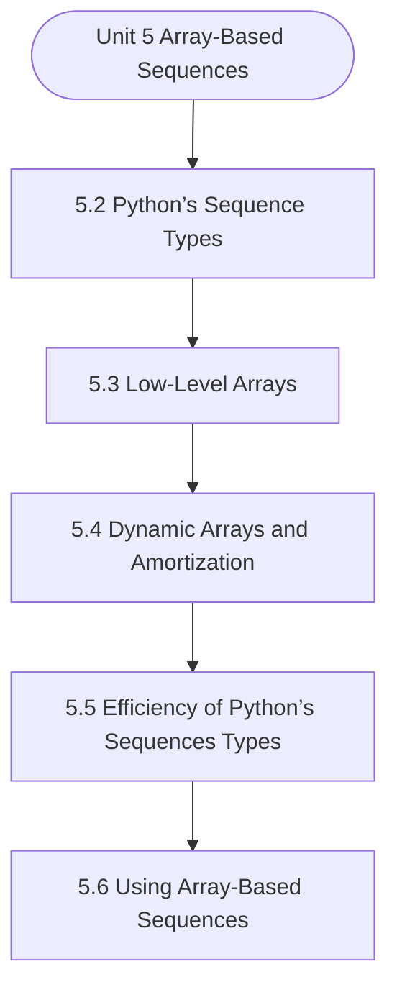

# MCS-063: Data Structures using Python
## Unit 5: Array-Based Sequences

> 📚 **Programme:** M.Sc. (Data Science and Analytics) | **Semester:** Semester 1  
> ⏱️ **Estimated Study Time:** ~23 mins | 📄 **Textbook Pages:** 19 Pages  
> 📥 **Original PDF:** [Download & View Textbook](../../../pdfs/Semester_1/MCS-063_Data_Structures_using_Python/Unit-5_Array-Based_Sequences.pdf)

---

### 🎯 Executive Concept & Data Science Relevance
In modern data systems, **Array-Based Sequences** forms a vital conceptual pillar. Algorithm efficiency governs data scale. In large-scale data engineering, choosing between $O(n \log n)$ mergesort vs $O(n^2)$ bubblesort, or an $O(1)$ hash table lookup vs $O(n)$ linear scan, determines whether a pipeline finishes in seconds or hours.

> [!NOTE]
> **Why this matters for your career:** Mastering array-based sequences equips you with the foundational principles required to reason mathematically about high-dimensional datasets, evaluate algorithm performance, and avoid statistical pitfalls in production machine learning pipelines.

### 🗺️ Visual Knowledge Architecture
The following concept map illustrates the structural hierarchy and learning trajectory of this module:

### 📖 Core Definitions & Terminology Cards

> 📌 **Big-O Notation $O(g(n))$**  
> - **Formal Definition:** Asymptotic upper bound: $f(n) = O(g(n))$ if $\exists c > 0, n_0 > 0$ such that $0 \le f(n) \le c \cdot g(n), \forall n \ge n_0$. Describes worst-case growth rate.  
> - 💡 **Practical Intuition & Analogy:** *The performance guarantee: execution time will not grow faster than this bound.*

> 📌 **Hash Table & Load Factor $\alpha$**  
> - **Formal Definition:** Data structure mapping keys to bucket indices using a hash function $h(k)$. Load factor $\alpha = n/m$ where $n$ is stored elements and $m$ is table capacity. Average lookup is $O(1)$.  
> - 💡 **Practical Intuition & Analogy:** *Instant dictionary key-value lookup in Python.*

> 📌 **Binary Search Tree (BST) & AVL Balance Factor**  
> - **Formal Definition:** A tree where for every node, left sub-tree values are smaller and right sub-tree values are larger. In AVL trees, Balance Factor $BF = h_L - h_R \in \lbrace -1, 0, 1 \rbrace$, maintaining $O(\log n)$ bounds via rotations.  
> - 💡 **Practical Intuition & Analogy:** *A self-balancing search index that guarantees rapid logarithmic lookups.*

### ⚡ Governing Mathematical Laws & Formula Cheatsheet
#### 🔹 Master Theorem for Divide-and-Conquer Recurrences
$$
\begin{aligned} & T(n) = aT(n/b) + \Theta(n^d) \\ & \implies T(n) = \begin{cases} \Theta(n^{\log_b a}) & \text{if } d < \log_b a \\ \Theta(n^d \log n) & \text{if } d = \log_b a \\ \Theta(n^d) & \text{if } d > \log_b a \end{cases} \end{aligned}
$$
- **Explanation:** Solves common divide-and-conquer recurrences like Mergesort ( $T(n) = 2T(n/2) + O(n) \implies O(n \log n)$ ).

#### 🔹 Binary Heap Array Index Formulas
$$
\text{Parent}(i) = \lfloor (i - 1)/2 \rfloor, \; \text{Left}(i) = 2i + 1, \; \text{Right}(i) = 2i + 2
$$
- **Explanation:** Enables cache-friendly representation of complete binary trees directly within flat linear arrays.

#### 🔹 Comparison Sort Lower Bound
$$
\Omega(n \log n) \quad \text{for comparison-based sorting algorithms}
$$
- **Explanation:** Information-theoretic lower bound: reaching $n!$ leaf permutations requires a decision tree of minimum depth $\log_2(n!) = \Omega(n \log n)$.

### 📌 Detailed Section-by-Section Study Breakdown
#### `5.2` Python’s Sequence Types
- **Core Concept:** Establishes theoretical foundations, axiomatic formulations, and properties of python’s sequence types.
- **Core Concept:** Analyzes standard algorithmic workflows and mathematical transformations relevant to array-based sequences.
- **Core Concept:** Applies computational bounds and optimization guarantees across data processing workflows.
- **Data Science Application:** Provides foundational structures used directly in statistical modeling, query execution, and machine learning pipelines.

> [!TIP]
> **Exam & Interview Tip:** Be prepared to state the formal definition of python’s sequence types and derive its primary equations step-by-step.

#### `5.3` Low-Level Arrays
- **Core Concept:** Arrays are crucial for understanding memory management and performance optimization in Python.
- **Core Concept:** Low-level arrays manage collection of items allowing for efficient access and manipulation.
- **Core Concept:** In Python, low-level arrays differ significantly from high-level lists.
- **Data Science Application:** Provides foundational structures used directly in statistical modeling, query execution, and machine learning pipelines.

> [!TIP]
> **Exam & Interview Tip:** Be prepared to state the formal definition of low-level arrays and derive its primary equations step-by-step.

#### `5.4` Dynamic Arrays and Amortization
- **Core Concept:** Dynamic Arrays in Python Dynamic arrays expand and shrink in size as elements are added or removed.
- **Core Concept:** In Python, lists serve as dynamic arrays, but understanding their underlying mechanics provides insight into their efficiency.
- **Core Concept:** A dynamic array allows elements to be added or removed dynamically, with automatic memory reallocation.
- **Data Science Application:** Provides foundational structures used directly in statistical modeling, query execution, and machine learning pipelines.

> [!TIP]
> **Exam & Interview Tip:** Be prepared to state the formal definition of dynamic arrays and amortization and derive its primary equations step-by-step.

#### `5.5` Efficiency of Python’s Sequences Types
- **Core Concept:** Time Complexity Of Sequence Types Lists Python lists are dynamic arrays that allow for efficient element access and modification.
- **Core Concept:** Tuples Tuples are more memory-efficient than lists because they no additional space is required for dynamic resizing.
- **Core Concept:** Strings 14 Strings also consume more memory due to their immutability and the need for additional
- **Data Science Application:** Provides foundational structures used directly in statistical modeling, query execution, and machine learning pipelines.

> [!TIP]
> **Exam & Interview Tip:** Be prepared to state the formal definition of efficiency of python’s sequences types and derive its primary equations step-by-step.

#### `5.6` Using Array-Based Sequences
- **Core Concept:** Python, a versatile programming language, offers robust support for array- based sequences through its built-in list type and the powerful NumPy library.
- **Core Concept:** Python's Built-in List Python's list type is a highly flexible data structure for representing array-based sequences.
- **Core Concept:** It provides a dynamic and efficient way to store and manipulate collections of elements.
- **Data Science Application:** Provides foundational structures used directly in statistical modeling, query execution, and machine learning pipelines.

> [!TIP]
> **Exam & Interview Tip:** Be prepared to state the formal definition of using array-based sequences and derive its primary equations step-by-step.

#### `5.7` Multidimensional Data Sets
- **Core Concept:** In the previous sections, we explored the concept of one-dimensional data structures, such as lists and arrays.
- **Core Concept:** However, in many real-world applications, data is often multidimensional, requiring more complex structures to represent it efficiently.
- **Core Concept:** Multidimensional Data Structures Multidimensional data structures allow us to store data in more than one dimension.
- **Data Science Application:** Provides foundational structures used directly in statistical modeling, query execution, and machine learning pipelines.

> [!TIP]
> **Exam & Interview Tip:** Be prepared to state the formal definition of multidimensional data sets and derive its primary equations step-by-step.

### 💡 Interactive Self-Assessment Checkpoints
Test your comprehension before proceeding. Tap each question to reveal the comprehensive explanation:

<b>Checkpoint 1:</b> What is the worst-case and average-case time complexity of Quicksort? <i>(Tap to reveal answer)</i>

> **Answer & Analysis:**  
> Average case: $O(n \log n)$. Worst case: $O(n^2)$ (occurs when the pivot chosen is always the extreme minimum or maximum in already sorted arrays).

<b>Checkpoint 2:</b> How does an AVL tree restore balance after an insertion? <i>(Tap to reveal answer)</i>

> **Answer & Analysis:**  
> By computing the Balance Factor ( $h_L - h_R$ ) and applying tree rotations: Left-Left (Single Right Rotation), Right-Right (Single Left Rotation), Left-Right (Double Rotation), or Right-Left (Double Rotation).

<b>Checkpoint 3:</b> What is the average lookup time in a Hash Table? <i>(Tap to reveal answer)</i>

> **Answer & Analysis:**  
> $O(1)$ constant time, assuming a uniform hash distribution and reasonable load factor.

### 🎯 Executive Module Wrap-Up
- **Central Idea:** Array-Based Sequences provides essential mathematical and algorithmic tools directly utilized in Data Science.
- **Mathematical Rigor:** Formulas and laws must be memorized with attention to boundary conditions and assumptions.
- **Full Textbook Coverage:** For exhaustive multi-page derivations, proofs, and supplementary exercises, consult the [Authentic IGNOU Textbook](../../../pdfs/Semester_1/MCS-063_Data_Structures_using_Python/Unit-5_Array-Based_Sequences.pdf).

---
### 🧭 Navigation & Syllabus Index
[⬅ Previous: Unit 4](unit_04_Recursion.md) | [📑 Course Index](README.md) | [Next: Unit 6 ➡](unit_06_Stacks,_Queues_and_Deques.md)
