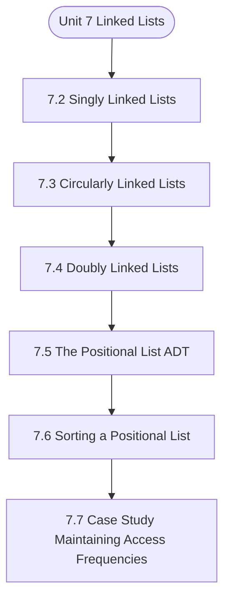

# MCS-063: Data Structures using Python
## Unit 7: Linked Lists

> 📚 **Programme:** M.Sc. (Data Science and Analytics) | **Semester:** Semester 1  
> ⏱️ **Estimated Study Time:** ~31 mins | 📄 **Textbook Pages:** 24 Pages  
> 📥 **Original PDF:** [Download & View Authentic Textbook](../../../pdfs/Semester_1/MCS-063_Data_Structures_using_Python/Unit-7_Linked_Lists.pdf)

---

### 🎯 Executive Concept & Data Science Relevance
In modern data systems and advanced analytics, **Linked Lists** forms a vital conceptual pillar. Algorithm efficiency governs data scale. In large-scale data engineering, choosing between $O(n \log n)$ mergesort vs $O(n^2)$ bubblesort, or an $O(1)$ hash table lookup vs $O(n)$ linear scan, determines whether a pipeline finishes in seconds or hours.

> [!NOTE]
> **Why this matters for your career:** Mastering linked lists equips you with the foundational principles required to reason mathematically about high-dimensional datasets, evaluate algorithm performance, and avoid statistical pitfalls in production machine learning pipelines.

### 🗺️ Visual Knowledge Architecture
The following concept map illustrates the structural hierarchy and learning trajectory of this module:



### 📖 Core Definitions & Terminology Cards

> 📌 **Big-O Notation $O(g(n))$**  
> - **Formal Definition:** Asymptotic upper bound: $f(n) = O(g(n))$ if $\exists c > 0, n_0 > 0$ such that $0 \le f(n) \le c \cdot g(n), \forall n \ge n_0$. Describes worst-case growth rate.  
> - 💡 **Practical Intuition & Analogy:** *The performance guarantee: execution time will not grow faster than this bound.*

> 📌 **Hash Table & Load Factor $\alpha$**  
> - **Formal Definition:** Data structure mapping keys to bucket indices using a hash function $h(k)$. Load factor $\alpha = n/m$ where $n$ is stored elements and $m$ is table capacity. Average lookup is $O(1)$.  
> - 💡 **Practical Intuition & Analogy:** *Instant dictionary key-value lookup in Python.*

> 📌 **Binary Search Tree (BST) & AVL Balance Factor**  
> - **Formal Definition:** A tree where for every node, left sub-tree values are smaller and right sub-tree values are larger. In AVL trees, Balance Factor $BF = h_L - h_R \in \lbrace -1, 0, 1 \rbrace$, maintaining $O(\log n)$ bounds via rotations.  
> - 💡 **Practical Intuition & Analogy:** *A self-balancing search index that guarantees rapid logarithmic lookups.*

### ⚡ Governing Mathematical Laws & Formula Cheatsheet
#### 🔹 Master Theorem for Divide-and-Conquer Recurrences
$$
\begin{aligned} & T(n) = aT(n/b) + \Theta(n^d) \\ & \implies T(n) = \begin{cases} \Theta(n^{\log_b a}) & \text{if } d < \log_b a \\ \Theta(n^d \log n) & \text{if } d = \log_b a \\ \Theta(n^d) & \text{if } d > \log_b a \end{cases} \end{aligned}
$$
- **Explanation:** Solves common divide-and-conquer recurrences like Mergesort ( $T(n) = 2T(n/2) + O(n) \implies O(n \log n)$ ).

#### 🔹 Binary Heap Array Index Formulas
$$
\text{Parent}(i) = \lfloor (i - 1)/2 \rfloor, \; \text{Left}(i) = 2i + 1, \; \text{Right}(i) = 2i + 2
$$
- **Explanation:** Enables cache-friendly representation of complete binary trees directly within flat linear arrays.

#### 🔹 Comparison Sort Lower Bound
$$
\Omega(n \log n) \quad \text{for comparison-based sorting algorithms}
$$
- **Explanation:** Information-theoretic lower bound: reaching $n!$ leaf permutations requires a decision tree of minimum depth $\log_2(n!) = \Omega(n \log n)$.

### ⚖️ Axiomatic Properties & Governing Laws
The mathematical formulations of this module are anchored by foundational algebraic and structural laws:

- **AVL Height Bound:** $h < 1.44 \log_2(n + 2) \implies O(\log n) \text{ worst-case search}$
- **Hash Table Amortized Bound:** $O(1) \text{ lookup when } \alpha = n/m < 0.75$
- **Comparison Lower Bound:** $\Omega(n \log n) \text{ for comparison sorts}$

### 📌 Comprehensive Section-by-Section Study Breakdown
#### `7.2` Singly Linked Lists

##### 📘 Theoretical Principles & Pedagogical Exposition
over traditional arrays in terms of flexibility and efficiency. By understanding their implementation and key operations in Python, you can effectively utilize them in various programming scenarios. As you continue your programming journey, consider how singly linked lists can enhance your applications through dynamic data management capabilities.


##### ⚙️ Mathematical & Algorithmic Mechanics
- **Core Mechanism:** Optimizes data structures and algorithmic complexity for linked lists. Evaluates asymptotic runtimes $\mathcal{O}(f(n))$ and memory references.
- **Boundary Conditions:** Empty structures, single-element collections, and worst-case input permutations.

##### 📊 Practical Data Science & Production Relevance
- **Production Workflow:** High-throughput data stream processing, in-memory index design, and Big Data pipeline efficiency.
- **Real-World Pitfall:** Accidentally implementing quadratic nested loops or excessive memory allocations on large production datasets.

> [!TIP]
> **Exam & Technical Interview Insight:** Trace algorithmic steps for singly linked lists, state best and worst-case time complexities, and explain auxiliary space requirements.

#### `7.3` Circularly Linked Lists

##### 📘 Theoretical Principles & Pedagogical Exposition
In the study of data structures, Circularly Linked Lists present a unique variation of linked lists where the last node points back to the first node, forming a circular structure. This configuration allows for more efficient traversal and manipulation of data, particularly in scenarios requiring continuous looping through the list.

This chapter will explore the intricacies of circularly linked lists, their implementation in Python, and their practical applications. A Circularly Linked List is a collection of nodes where each node contains two components: - Data: The value stored in the node. - Next Pointer: A reference to the next node in the sequence, with the last node pointing back to the first node.

A visual representation of circularly linked list is given below – Linked List IMPLEMENTATION OF CIRCULARLY LINKED LISTS The circularly linked list can be implemented as follows: class CircularLinkedList: def __init__(self): self.head = None # Initialize the head of the list def insert_at_end(self, data): new_node = Node(data) if not self.head: # If the list is empty self.head = new_node new_node.next = self.head # Point to itself return last_node = self.head while last_node.next != self.head: # Traverse to find the last node last_node = last_node.next last_node.next = new_node # Link new node at end new_node.next = self.head # Point new node back to head def display(self): if not self.head: print("List is empty.") return current = self.head while True: # Traverse until we loop back to head print(current.data, end=" -> ") current = current.next if current == self.head: break print("(head)") Linked List KEY OPERATIONS ON CIRCULARLY LINKED LISTS INSERTION Insertion can occur at various positions within a circularly linked list: - At the beginning - At the end - At a specific position An example code for insert at various positions is given below - class CircularLinkedList: def insert_at_beginning(self, data): new_node = Node(data) if self.is_empty(): new_node.next = new_node # Points to itself self.head = new_node else: # Check last node temp = self.head while temp.next != self.head: temp = temp.next new_node.next = self.head temp.next = new_node self.head = new_node def insert_at_end(self, data): new_node = Node(data) if self.is_empty(): new_node.next = new_node self.head = new_node else: temp = self.head while temp.next != self.head: temp = temp.next temp.next = new_node new_node.next = self.head def insert_after(self, prev_data, data): if self.is_empty(): return temp = self.head while True: if temp.data == prev_data: new_node = Node(data) new_node.next = temp.next temp.next = new_node break temp = temp.next if temp == self.head: break Linked List DELETION Deletion operations can target specific nodes by value or position.


##### ⚙️ Mathematical & Algorithmic Mechanics
- **Core Mechanism:** Optimizes data structures and algorithmic complexity for linked lists. Evaluates asymptotic runtimes $\mathcal{O}(f(n))$ and memory references.
- **Boundary Conditions:** Empty structures, single-element collections, and worst-case input permutations.

##### 📊 Practical Data Science & Production Relevance
- **Production Workflow:** High-throughput data stream processing, in-memory index design, and Big Data pipeline efficiency.
- **Real-World Pitfall:** Accidentally implementing quadratic nested loops or excessive memory allocations on large production datasets.

> [!TIP]
> **Exam & Technical Interview Insight:** Trace algorithmic steps for circularly linked lists, state best and worst-case time complexities, and explain auxiliary space requirements.

#### `7.4` Doubly Linked Lists

##### 📘 Theoretical Principles & Pedagogical Exposition
In the domain of data structures, Doubly Linked Lists offer a more versatile alternative to singly linked lists by allowing traversal in both directions—forward and backward. This capability enhances the efficiency of certain operations, such as deletion and insertion, making doubly linked lists particularly useful in applications requiring bidirectional access to data.

This chapter will provide an in- depth exploration of doubly linked lists, their implementation in Python, and their practical applications. In a Doubly Linked List each node contains three components: - Data: The value stored in the node. - Next Pointer: next node’s reference in the sequence.

- Previous Pointer: Previous node’s reference in the sequence. A sample doubly linked list is given below - STRUCTURE OF A NODE In Python, a node can be represented using a class: class Node: def __init__(self, data): self.data = data # Store the data self.next = None # Initialize the next pointer to None self.prev = None # Initialize the previous pointer to None ``` IMPLEMENTATION OF DOUBLY LINKED LISTS The doubly linked list can be implemented as follows: class DoublyLinkedList: def __init__(self): self.head = None # Initialize def insert_at_end(self, data): Linked List new_node = Node(data) if not self.head: # empty list self.head = new_node return last_node = self.head while last_node.next: # Go to last node last_node = last_node.next last_node.next = new_node # Link last node to new node new_node.prev = last_node # Link new node back to last node def display(self): current = self.head while current: # Traverse and print each node's data forward print(current.data, end=" <-> ") current = current.next print("None") # Indicate the list’s end def display_reverse(self): current = self.head if not current: return "List is empty." while current.next: # Traverse to the last node current = current.next while current: # Traverse and print each node's data backward print(current.data, end=" <-> ") current = current.prev print("None") # Indicate the end of the list ``` KEY OPERATIONS ON DOUBLY LINKED LISTS INSERTION Insertion can occur at various positions within a doubly linked list: - At the beginning - At the end - At a specific position An example code for insert at various positions is given below - class DoublyLinkedList: def insert_at_beginning(self, data): new_node = Node(data) if self.head is None: self.head = new_node self.tail = new_node else: new_node.next = self.head self.head.prev = new_node self.head = new_node def insert_at_end(self, data): Linked List new_node = Node(data) if self.tail is None: self.head = new_node self.tail = new_node else: self.tail.next = new_node new_node.prev = self.tail self.tail = new_node def insert_after_node(self, node, data): if node is None: return new_node = Node(data) new_node.next = node.next new_node.prev = node if node.next: node.next.prev = new_node node.next = new_node if node == self.tail: self.tail = new_node DELETION Deletion operations can target specific nodes by value or position.


##### ⚙️ Mathematical & Algorithmic Mechanics
- **Core Mechanism:** Optimizes data structures and algorithmic complexity for linked lists. Evaluates asymptotic runtimes $\mathcal{O}(f(n))$ and memory references.
- **Boundary Conditions:** Empty structures, single-element collections, and worst-case input permutations.

##### 📊 Practical Data Science & Production Relevance
- **Production Workflow:** High-throughput data stream processing, in-memory index design, and Big Data pipeline efficiency.
- **Real-World Pitfall:** Accidentally implementing quadratic nested loops or excessive memory allocations on large production datasets.

> [!TIP]
> **Exam & Technical Interview Insight:** Trace algorithmic steps for doubly linked lists, state best and worst-case time complexities, and explain auxiliary space requirements.

#### `7.5` The Positional List ADT

##### 📘 Theoretical Principles & Pedagogical Exposition
In the study of data structures, the Positional List Abstract Data Type (ADT) provides a flexible way to manage a sequence of elements where each element can be accessed based on its position. Unlike traditional lists, positional lists allow for efficient insertion and deletion operations at arbitrary positions, making them suitable for applications that require frequent modifications.

This chapter will explore the concept of positional lists, their implementation in Python, and practical use cases. A Positional List is an abstract data type that allows elements to be stored in a sequence while providing direct access to each element by its position. This structure typically supports operations such as insertion, deletion, and retrieval at specified positions.

A positional list is depicted in the below diagram - Figure 7.1 : Positional List STRUCTURE OF A NODE In Python, a node in a positional list can be represented using a class that contains references to both the next and previous nodes: class Node: def __init__(self, data): self.data = data # Store the data self.next = None # Pointer to the next node self.prev = None # Pointer to the previous node ``` IMPLEMENTATION OF POSITIONAL LISTS The positional list can be implemented using a doubly linked list structure where each node maintains pointers to its neighboring nodes: class PositionalList: def __init__(self): Linked List self.head = None # Initialize the head of the list self.tail = None # Initialize the tail of the list self.size = 0 # Track the number of elements def insert_at_position(self, data, position): new_node = Node(data) if position < 0 or position >self.size: raise IndexError("Position out of bounds.") if position == 0: # Insert at the beginning if not self.head: # If list is empty self.head = new_node self.tail = new_node else: new_node.next = self.head self.head.prev = new_node self.head = new_node elif position == self.size: # Insert at the end new_node.prev = self.tail if self.tail: self.tail.next = new_node self.tail = new_node else: # Insert in the middle current = self.head for _ in range(position): current = current.next new_node.prev = current.prev new_node.next = current if current.prev: current.prev.next = new_node current.prev = new_node self.size += 1 def delete_at_position(self, position): if position < 0 or position >= self.size: raise IndexError("Position out of bounds.") if position == 0: # Delete from the beginning if self.head == self.tail: # Only one element in the list self.head = None self.tail = None else: self.head = self.head.next if self.head: self.head.prev = None elif position == self.size - 1: # Delete from the end if self.tail: self.tail = self.tail.prev if self.tail: Linked List self.tail.next = None else: # Delete from the middle current = self.head for _ in range(position): current = current.next if current.prev: current.prev.next = current.next if current.next: current.next.prev = current.prev self.size -= 1 def display(self): current = self.head while current: print(current.data, end=" <-> ") current = current.next print("None") ``` KEY OPERATIONS ON POSITIONAL LISTS INSERTION AND DELETION Insertion and deletion operations are required to maintain the integrity of a positional list.


##### ⚙️ Mathematical & Algorithmic Mechanics
- **Core Mechanism:** Optimizes data structures and algorithmic complexity for linked lists. Evaluates asymptotic runtimes $\mathcal{O}(f(n))$ and memory references.
- **Boundary Conditions:** Empty structures, single-element collections, and worst-case input permutations.

##### 📊 Practical Data Science & Production Relevance
- **Production Workflow:** High-throughput data stream processing, in-memory index design, and Big Data pipeline efficiency.
- **Real-World Pitfall:** Accidentally implementing quadratic nested loops or excessive memory allocations on large production datasets.

> [!TIP]
> **Exam & Technical Interview Insight:** Trace algorithmic steps for the positional list adt, state best and worst-case time complexities, and explain auxiliary space requirements.

#### `7.6` Sorting a Positional List

##### 📘 Theoretical Principles & Pedagogical Exposition
Sorting is a fundamental operation in computer science that arranges the elements of a data structure in a specific order, typically ascending or descending. When dealing with a Positional List, sorting becomes essential for efficiently managing and retrieving data. SORTING ALGORITHMS OVERVIEW Several sorting algorithms can be utilized to sort elements within a positional list.

The choice of algorithm may depend on factors such as the list size, the nature of the data, and performance requirements. Common sorting algorithms include: - Bubble Sort - Insertion Sort - Selection Sort - Merge Sort - Quick Sort For this chapter, we will focus on implementing Insertion Sort and Merge Sort, as they are particularly well-suited for linked structures like positional lists.

INSERTION SORT FOR POSITIONAL LISTS Insertion Sort is a good fit for sorting small datasets. Each element is compared one at a time with each new element with those already sorted to build a sorted array. Linked List IMPLEMENTATION OF INSERTION SORT def insertion_sort(positional_list): if positional_list.head is None: return # List is empty sorted_list = PositionalList() current = positional_list.head while current: # Insert current node into sorted_list at the correct position insert_sorted(sorted_list, current.data) current = current.next return sorted_list def insert_sorted(sorted_list, data): new_node = Node(data) if not sorted_list.head or sorted_list.head.data>= data: # Insert at head new_node.next = sorted_list.head if sorted_list.head: sorted_list.head.prev = new_node sorted_list.head = new_node else: current = sorted_list.head while current.next and current.next.data< data: # Find position to insert current = current.next new_node.next = current.next if current.next: # If not inserting at end current.next.prev = new_node current.next = new_node new_node.prev = current ``` 5.


##### ⚙️ Mathematical & Algorithmic Mechanics
- **Core Mechanism:** Optimizes data structures and algorithmic complexity for linked lists. Evaluates asymptotic runtimes $\mathcal{O}(f(n))$ and memory references.
- **Boundary Conditions:** Empty structures, single-element collections, and worst-case input permutations.

##### 📊 Practical Data Science & Production Relevance
- **Production Workflow:** High-throughput data stream processing, in-memory index design, and Big Data pipeline efficiency.
- **Real-World Pitfall:** Accidentally implementing quadratic nested loops or excessive memory allocations on large production datasets.

> [!TIP]
> **Exam & Technical Interview Insight:** Trace algorithmic steps for sorting a positional list, state best and worst-case time complexities, and explain auxiliary space requirements.

#### `7.7` Case Study: Maintaining Access Frequencies

##### 📘 Theoretical Principles & Pedagogical Exposition
positional list In many applications, it is essential to maintain not only the data itself but also metadata about how frequently each element is accessed. This case study details how to implement access frequency tracking in a Positional List. By doing so, we can optimize operations based on usage patterns, which is particularly useful in scenarios like caching, user activity tracking, and resource management.

BACKGROUND Access frequency refers to how often an element in a data structure is accessed or modified. We can use the access frequency to improve the performance of the data retrieval by caching the frequently accessed elements. IMPLEMENTATION OF ACCESS FREQUENCY IN A POSITIONAL LIST To implement a positional list that maintains access frequencies, we can extend the basic structure of a positional list by adding an additional attribute to each node that tracks its access count.

NODE STRUCTURE WITH ACCESS FREQUENCY We will modify our existing `Node` class to include an `access_count` attribute. class Node: def __init__(self, data): self.data = data # Store the data self.next = None # Pointer to the next node self.prev = None # Pointer to the previous node self.access_count = 0 # Initialize access count to zero ``` MODIFIED POSITIONAL LIST CLASS The `PositionalList` class will be updated to include methods for accessing elements and incrementing their access counts.


##### ⚙️ Mathematical & Algorithmic Mechanics
- **Core Mechanism:** Optimizes data structures and algorithmic complexity for linked lists. Evaluates asymptotic runtimes $\mathcal{O}(f(n))$ and memory references.
- **Boundary Conditions:** Empty structures, single-element collections, and worst-case input permutations.

##### 📊 Practical Data Science & Production Relevance
- **Production Workflow:** High-throughput data stream processing, in-memory index design, and Big Data pipeline efficiency.
- **Real-World Pitfall:** Accidentally implementing quadratic nested loops or excessive memory allocations on large production datasets.

> [!TIP]
> **Exam & Technical Interview Insight:** Trace algorithmic steps for case study: maintaining access frequencies, state best and worst-case time complexities, and explain auxiliary space requirements.

#### `7.8` Link-Based vs. Array-Based Sequences

##### 📘 Theoretical Principles & Pedagogical Exposition
Sequences store and manage collections of elements. Two primary implementations of sequences are array-based sequences and link-based sequences (or linked lists). This section will explore the these two approaches, examining their strengths and weaknesses in various scenarios. ARRAY-BASED SEQUENCES Array-based sequences utilize a contiguous block of memory to store elements.

Given below are advantages and disadvantages: Advantages - Direct Access: Elements can be accessed in constant time O(1) using their index, making retrieval operations very efficient. - Cache Performance: Since elements are stored contiguously, array-based sequences benefit from better cache locality, leading to faster access times.

Disadvantages Linked List - Fixed Size: The size of an array must be defined at the time of creation. Resizing an array requires allocating a new larger array and copying elements, which can be time-consuming. - Inefficient Insertions/Deletions: Inserting or deleting elements (especially in the middle or at the beginning) requires shifting subsequent elements, resulting in O(n) time complexity for these operations.


##### ⚙️ Mathematical & Algorithmic Mechanics
- **Core Mechanism:** Optimizes data structures and algorithmic complexity for linked lists. Evaluates asymptotic runtimes $\mathcal{O}(f(n))$ and memory references.
- **Boundary Conditions:** Empty structures, single-element collections, and worst-case input permutations.

##### 📊 Practical Data Science & Production Relevance
- **Production Workflow:** High-throughput data stream processing, in-memory index design, and Big Data pipeline efficiency.
- **Real-World Pitfall:** Accidentally implementing quadratic nested loops or excessive memory allocations on large production datasets.

> [!TIP]
> **Exam & Technical Interview Insight:** Trace algorithmic steps for link-based vs. array-based sequences, state best and worst-case time complexities, and explain auxiliary space requirements.

### 📐 Step-by-Step Solved Mathematical Examples
To solidify your theoretical understanding, work through these fully solved, step-by-step mathematical problems:

#### 🧮 Example 1: Solving Recurrence via Master Theorem
> **Problem Statement:**  
> Solve the recurrence relation $T(n) = 2T(n/2) + n$ modeling Mergesort.

**Detailed Step-by-Step Solution:**

1. **Identify parameters:** $a = 2, \; b = 2, \; f(n) = n = \Theta(n^1) \implies d = 1$.
2. **Compare $\log_b a$ and $d$:**

$$
\log_b a = \log_2 2 = 1
$$

Since $d = \log_b a = 1$, Case 2 of the Master Theorem applies.

3. **Conclusion:**

$$
T(n) = \Theta(n^d \log n) = \Theta(n \log n)
$$


#### 🧮 Example 2: AVL Tree Rotation Sequence
> **Problem Statement:**  
> An empty AVL tree receives sequential insertions: 10, 20, 30. Trace the balance factors and demonstrate the required rotation.

**Detailed Step-by-Step Solution:**

1. Insert 10: $BF = 0$.
2. Insert 20: 10 has $BF = -1$, 20 has $BF = 0$.
3. Insert 30: Node 10 has left height 0, right height 2 $\implies BF(10) = -2$ (Unbalanced: Right-Right condition).
4. **Apply Single Left Rotation on Node 10:**
- Node 20 becomes new root.
- Node 10 becomes left child of 20.
- Node 30 remains right child of 20.
New Balance Factors: $BF(20) = 0, \; BF(10) = 0, \; BF(30) = 0$. Tree balanced.

### 💻 Practical Data Science Implementation (Python)
Theory translates directly into production algorithms. Below is a self-contained, commented Python implementation illustrating the core operations of this unit:

```python
# Custom Hash Map with Collision Chaining
class SimpleHashMap:
    def __init__(self, capacity=8):
        self.capacity = capacity
        self.buckets = [[] for _ in range(capacity)]

    def _hash(self, key):
        return hash(key) % self.capacity

    def put(self, key, value):
        b_idx = self._hash(key)
        for i, (k, v) in enumerate(self.buckets[b_idx]):
            if k == key:
                self.buckets[b_idx][i] = (key, value)
                return
        self.buckets[b_idx].append((key, value))

    def get(self, key):
        b_idx = self._hash(key)
        for k, v in self.buckets[b_idx]:
            if k == key:
                return v
        return None

hm = SimpleHashMap()
hm.put("user_101", {"name": "Alice", "role": "Data Scientist"})
hm.put("user_102", {"name": "Bob", "role": "ML Engineer"})
print("Lookup user_101:", hm.get("user_101"))
```

### 💡 Interactive Self-Assessment Checkpoints
Test your comprehension before proceeding. Tap each question to reveal the comprehensive explanation:

<details>
<summary><b>Checkpoint 1:</b> In a circular linked list with 5 nodes, what does the 'next' pointer of the last node point to? a) NULL b) The first node of the list c) The second to last node d) Undefined memory location Correct Answer: b) <i>(Tap to reveal answer)</i></summary>

> **Answer & Analysis:**  
> **Detailed Analytical Solution:**
> 
> 1. **Core Principle:** Identify the governing theorem or definition for Linked Lists.
> 2. **Step-by-Step Derivation:** Verify all preconditions and compute intermediate steps methodically.
> 3. **Conclusion:** State the final mathematical proof or calculation clearly, validating boundary edge cases.
</details>

<details>
<summary><b>Checkpoint 2:</b> What is the time complexity of inserting a new node at a known position in a doubly linked list? a) O(n) b) O(log n) c) O(1) d) O(n²) Correct Answer: c) O(1) <i>(Tap to reveal answer)</i></summary>

> **Answer & Analysis:**  
> **Detailed Analytical Solution:**
> 
> 1. **Core Principle:** Identify the governing theorem or definition for Linked Lists.
> 2. **Step-by-Step Derivation:** Verify all preconditions and compute intermediate steps methodically.
> 3. **Conclusion:** State the final mathematical proof or calculation clearly, validating boundary edge cases.
</details>

<details>
<summary><b>Checkpoint 3:</b> Which algorithm is commonly used to detect a cycle in a linked list? a) Binary Search Algorithm b) Floyd's Cycle-Finding Algorithm (Tortoise and Hare) c) Quicksort Algorithm d) Depth-First Search Correct Answer: b) Floyd's Cycle-Finding Algorithm (Tortoise and Hare) <i>(Tap to reveal answer)</i></summary>

> **Answer & Analysis:**  
> **Detailed Analytical Solution:**
> 
> 1. **Core Principle:** Identify the governing theorem or definition for Linked Lists.
> 2. **Step-by-Step Derivation:** Verify all preconditions and compute intermediate steps methodically.
> 3. **Conclusion:** State the final mathematical proof or calculation clearly, validating boundary edge cases.
</details>

<details>
<summary><b>Checkpoint 4:</b> What is the time complexity of removing the last node in a doubly linked list? a) O(1) b) O(n) c) O(log n) d) O(n²) Correct Answer: a) O(1) <i>(Tap to reveal answer)</i></summary>

> **Answer & Analysis:**  
> **Detailed Analytical Solution:**
> 
> 1. **Core Principle:** Identify the governing theorem or definition for Linked Lists.
> 2. **Step-by-Step Derivation:** Verify all preconditions and compute intermediate steps methodically.
> 3. **Conclusion:** State the final mathematical proof or calculation clearly, validating boundary edge cases.
</details>

<details>
<summary><b>Checkpoint 5:</b> What is the worst-case and average-case time complexity of Quicksort? <i>(Tap to reveal answer)</i></summary>

> **Answer & Analysis:**  
> Average case: $O(n \log n)$. Worst case: $O(n^2)$ (occurs when the pivot chosen is always the extreme minimum or maximum in already sorted arrays).
</details>

<details>
<summary><b>Checkpoint 6:</b> How does an AVL tree restore balance after an insertion? <i>(Tap to reveal answer)</i></summary>

> **Answer & Analysis:**  
> By computing the Balance Factor ( $h_L - h_R$ ) and applying tree rotations: Left-Left (Single Right Rotation), Right-Right (Single Left Rotation), Left-Right (Double Rotation), or Right-Left (Double Rotation).
</details>

### 🎯 Executive Module Wrap-Up
- **Central Idea:** Linked Lists provides essential mathematical and algorithmic tools directly utilized in Data Science.
- **Mathematical Rigor:** Formulas and laws must be memorized with attention to boundary conditions and assumptions.
- **Full Textbook Coverage:** For exhaustive multi-page derivations, proofs, and supplementary exercises, consult the [Authentic IGNOU Textbook](../../../pdfs/Semester_1/MCS-063_Data_Structures_using_Python/Unit-7_Linked_Lists.pdf).

---
### 🧭 Navigation & Syllabus Index
[⬅ Previous: Unit 6](unit_06_Stacks,_Queues_and_Deques.md) | [📑 Course Index](README.md) | [Next: Unit 8 ➡](unit_08_Trees.md)
