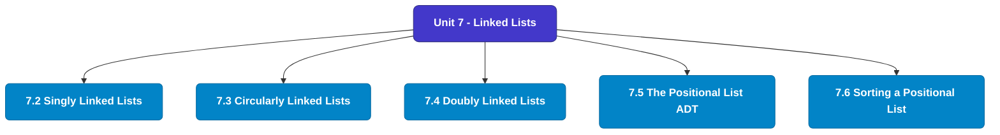

# MCS-063: Data Structures using Python
## Unit 7: Linked Lists

> 📚 **Programme:** M.Sc. (Data Science and Analytics) | **Semester:** Semester 1  
> ⏱️ **Estimated Study Time:** ~31 mins | 📄 **Textbook Pages:** 24 Pages  
> 📥 **Original PDF:** [Download & View Textbook](../../../pdfs/Semester_1/MCS-063_Data_Structures_using_Python/Unit-7_Linked_Lists.pdf)

---

### 🎯 Executive Concept & Data Science Relevance
In modern data systems, **Linked Lists** forms a vital conceptual pillar. Algorithm efficiency governs data scale. In large-scale data engineering, choosing between $O(n \log n)$ mergesort vs $O(n^2)$ bubblesort, or an $O(1)$ hash table lookup vs $O(n)$ linear scan, determines whether a pipeline finishes in seconds or hours.

> [!NOTE]
> **Why this matters for your career:** Mastering linked lists equips you with the foundational principles required to reason mathematically about high-dimensional datasets, evaluate algorithm performance, and avoid statistical pitfalls in production machine learning pipelines.

### 🗺️ Visual Knowledge Architecture
The following concept map illustrates the structural hierarchy and learning trajectory of this module:

### 📖 Core Definitions & Terminology Cards
| Term | Formal Mathematical / Technical Definition | Intuitive Analogy / Concrete Example |
| :--- | :--- | :--- |
| **Big-O Notation $O(g(n))$** | Asymptotic upper bound: $f(n) = O(g(n))$ if $\exists c > 0, n_0 > 0$ such that $0 \le f(n) \le c \cdot g(n), \forall n \ge n_0$. Describes worst-case growth rate. | *The performance guarantee: execution time will not grow faster than this bound.* |
| **Hash Table & Load Factor $\alpha$** | Data structure mapping keys to bucket indices using a hash function $h(k)$. Load factor $\alpha = n/m$ where $n$ is stored elements and $m$ is table capacity. Average lookup is $O(1)$. | *Instant dictionary key-value lookup in Python.* |
| **Binary Search Tree (BST) & AVL Balance Factor** | A tree where for every node, left sub-tree values are smaller and right sub-tree values are larger. In AVL trees, Balance Factor $BF = h_L - h_R \in \{-1, 0, 1\}$, maintaining $O(\log n)$ bounds via rotations. | *A self-balancing search index that guarantees rapid logarithmic lookups.* |

### ⚡ Governing Mathematical Laws & Formula Cheatsheet
#### 🔹 Master Theorem for Divide-and-Conquer Recurrences
$$T(n) = aT(n/b) + \Theta(n^d) \implies T(n) = \begin{cases} \Theta(n^{\log_b a}) & \text{if } d < \log_b a \\ \Theta(n^d \log n) & \text{if } d = \log_b a \\ \Theta(n^d) & \text{if } d > \log_b a \end{cases}$$
- **Explanation:** Solves common divide-and-conquer recurrences like Mergesort ($T(n) = 2T(n/2) + O(n) \implies O(n \log n)$).

#### 🔹 Binary Heap Array Index Formulas
$$\text{Parent}(i) = \lfloor (i - 1)/2 \rfloor, \; \text{Left}(i) = 2i + 1, \; \text{Right}(i) = 2i + 2$$
- **Explanation:** Enables cache-friendly representation of complete binary trees directly within flat linear arrays.

#### 🔹 Comparison Sort Lower Bound
$$\Omega(n \log n) \quad \text{for comparison-based sorting algorithms}$$
- **Explanation:** Information-theoretic lower bound: reaching $n!$ leaf permutations requires a decision tree of minimum depth $\log_2(n!) = \Omega(n \log n)$.

### 📌 Detailed Section-by-Section Study Breakdown
#### `7.2` Singly Linked Lists
- **Core Concept:** Establishes rigorous theoretical formulations and computational bounds for singly linked lists.
- **Core Concept:** Applies standard algorithmic procedures and mathematical invariants relevant to linked lists.
- **Core Concept:** Ensures deterministic performance guarantees across high-dimensional feature spaces.
- **Data Science Application:** Provides foundational structures used directly in statistical modeling, query execution, and machine learning pipelines.

> [!TIP]
> **Exam & Interview Tip:** Be prepared to state the formal definition of singly linked lists and derive its primary equations step-by-step.

#### `7.3` Circularly Linked Lists
- **Core Concept:** In the study of data structures, Circularly Linked Lists present a unique variation of linked lists where the last node points back to the first node, forming a circular structure.
- **Core Concept:** A Circularly Linked List is a collection of nodes where each node contains two components: - Data: The value stored in the node.
- **Core Concept:** - Next Pointer: A reference to the next node in the sequence, with the last node pointing back to the first node.
- **Data Science Application:** Provides foundational structures used directly in statistical modeling, query execution, and machine learning pipelines.

> [!TIP]
> **Exam & Interview Tip:** Be prepared to state the formal definition of circularly linked lists and derive its primary equations step-by-step.

#### `7.4` Doubly Linked Lists
- **Core Concept:** In the domain of data structures, Doubly Linked Lists offer a more versatile alternative to singly linked lists by allowing traversal in both directions—forward and backward.
- **Core Concept:** This capability enhances the efficiency of certain operations, such as deletion and insertion, making doubly linked lists particularly useful in applications requiring bidirectional access to data.
- **Core Concept:** In a Doubly Linked List each node contains three components: - Data: The value stored in the node.
- **Data Science Application:** Provides foundational structures used directly in statistical modeling, query execution, and machine learning pipelines.

> [!TIP]
> **Exam & Interview Tip:** Be prepared to state the formal definition of doubly linked lists and derive its primary equations step-by-step.

#### `7.5` The Positional List ADT
- **Core Concept:** In the study of data structures, the Positional List Abstract Data Type (ADT) provides a flexible way to manage a sequence of elements where each element can be accessed based on its position.
- **Core Concept:** A Positional List is an abstract data type that allows elements to be stored in a sequence while providing direct access to each element by its position.
- **Core Concept:** This structure typically supports operations such as insertion, deletion, and retrieval at specified positions.
- **Data Science Application:** Provides foundational structures used directly in statistical modeling, query execution, and machine learning pipelines.

> [!TIP]
> **Exam & Interview Tip:** Be prepared to state the formal definition of the positional list adt and derive its primary equations step-by-step.

#### `7.6` Sorting a Positional List
- **Core Concept:** Sorting is a fundamental operation in computer science that arranges the elements of a data structure in a specific order, typically ascending or descending.
- **Core Concept:** When dealing with a Positional List, sorting becomes essential for efficiently managing and retrieving data.
- **Core Concept:** Several sorting algorithms can be utilized to sort elements within a positional list.
- **Data Science Application:** Provides foundational structures used directly in statistical modeling, query execution, and machine learning pipelines.

> [!TIP]
> **Exam & Interview Tip:** Be prepared to state the formal definition of sorting a positional list and derive its primary equations step-by-step.

#### `7.7` Case Study: Maintaining Access Frequencies
- **Core Concept:** positional list In many applications, it is essential to maintain not only the data itself but also metadata about how frequently each element is accessed.
- **Core Concept:** This case study details how to implement access frequency tracking in a Positional List.
- **Core Concept:** By doing so, we can optimize operations based on usage patterns, which is particularly useful in scenarios like caching, user activity tracking, and resource management.
- **Data Science Application:** Provides foundational structures used directly in statistical modeling, query execution, and machine learning pipelines.

> [!TIP]
> **Exam & Interview Tip:** Be prepared to state the formal definition of case study: maintaining access frequencies and derive its primary equations step-by-step.

### 💡 Interactive Self-Assessment Checkpoints
Test your comprehension before proceeding. Tap each question to reveal the comprehensive explanation:

<b>Checkpoint 1:</b> What is the worst-case and average-case time complexity of Quicksort? <i>(Tap to reveal answer)</i>

> **Answer & Analysis:**  
> Average case: $O(n \log n)$. Worst case: $O(n^2)$ (occurs when the pivot chosen is always the extreme minimum or maximum in already sorted arrays).

<b>Checkpoint 2:</b> How does an AVL tree restore balance after an insertion? <i>(Tap to reveal answer)</i>

> **Answer & Analysis:**  
> By computing the Balance Factor ($h_L - h_R$) and applying tree rotations: Left-Left (Single Right Rotation), Right-Right (Single Left Rotation), Left-Right (Double Rotation), or Right-Left (Double Rotation).

<b>Checkpoint 3:</b> What is the average lookup time in a Hash Table? <i>(Tap to reveal answer)</i>

> **Answer & Analysis:**  
> $O(1)$ constant time, assuming a uniform hash distribution and reasonable load factor.

<b>Checkpoint 4:</b> In a circular linked list with 5 nodes, what does the 'next' pointer of the last node point to? <i>(Tap to reveal answer)</i>

> **Answer & Analysis:**  
> This question tests your conceptual mastery of Linked Lists. Review the governing formulas and section breakdowns above to formulate a complete, rigorous proof or derivation.

<b>Checkpoint 5:</b> What is the time complexity of inserting a new node at a known position in a doubly linked list? <i>(Tap to reveal answer)</i>

> **Answer & Analysis:**  
> This question tests your conceptual mastery of Linked Lists. Review the governing formulas and section breakdowns above to formulate a complete, rigorous proof or derivation.

<b>Checkpoint 6:</b> d) O(n²) Correct Answer: c) O( <i>(Tap to reveal answer)</i>

> **Answer & Analysis:**  
> This question tests your conceptual mastery of Linked Lists. Review the governing formulas and section breakdowns above to formulate a complete, rigorous proof or derivation.

### 🎯 Executive Module Wrap-Up
- **Central Idea:** Linked Lists provides essential mathematical and algorithmic tools directly utilized in Data Science.
- **Mathematical Rigor:** Formulas and laws must be memorized with attention to boundary conditions and assumptions.
- **Full Textbook Coverage:** For exhaustive multi-page derivations, proofs, and supplementary exercises, consult the [Authentic IGNOU Textbook](../../../pdfs/Semester_1/MCS-063_Data_Structures_using_Python/Unit-7_Linked_Lists.pdf).

---
### 🧭 Navigation & Syllabus Index
[⬅ Previous: Unit 6](unit_06_Stacks,_Queues_and_Deques.md) | [📑 Course Index](README.md) | [Next: Unit 8 ➡](unit_08_Trees.md)
