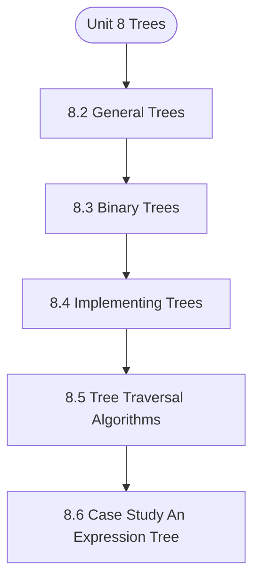

# MCS-063: Data Structures using Python
## Unit 8: Trees

> 📚 **Programme:** M.Sc. (Data Science and Analytics) | **Semester:** Semester 1  
> ⏱️ **Estimated Study Time:** ~18 mins | 📄 **Textbook Pages:** 16 Pages  
> 📥 **Original PDF:** [Download & View Authentic Textbook](../../../pdfs/Semester_1/MCS-063_Data_Structures_using_Python/Unit-8_Trees.pdf)

---

### 🎯 Executive Concept & Data Science Relevance
In modern data systems, **Trees** forms a vital conceptual pillar. Algorithm efficiency governs data scale. In large-scale data engineering, choosing between $O(n \log n)$ mergesort vs $O(n^2)$ bubblesort, or an $O(1)$ hash table lookup vs $O(n)$ linear scan, determines whether a pipeline finishes in seconds or hours.

> [!NOTE]
> **Why this matters for your career:** Mastering trees equips you with the foundational principles required to reason mathematically about high-dimensional datasets, evaluate algorithm performance, and avoid statistical pitfalls in production machine learning pipelines.

### 🗺️ Visual Knowledge Architecture
The following concept map illustrates the structural hierarchy and learning trajectory of this module:



### 📖 Core Definitions & Terminology Cards

> 📌 **Big-O Notation $O(g(n))$**  
> - **Formal Definition:** Asymptotic upper bound: $f(n) = O(g(n))$ if $\exists c > 0, n_0 > 0$ such that $0 \le f(n) \le c \cdot g(n), \forall n \ge n_0$. Describes worst-case growth rate.  
> - 💡 **Practical Intuition & Analogy:** *The performance guarantee: execution time will not grow faster than this bound.*

> 📌 **Hash Table & Load Factor $\alpha$**  
> - **Formal Definition:** Data structure mapping keys to bucket indices using a hash function $h(k)$. Load factor $\alpha = n/m$ where $n$ is stored elements and $m$ is table capacity. Average lookup is $O(1)$.  
> - 💡 **Practical Intuition & Analogy:** *Instant dictionary key-value lookup in Python.*

> 📌 **Binary Search Tree (BST) & AVL Balance Factor**  
> - **Formal Definition:** A tree where for every node, left sub-tree values are smaller and right sub-tree values are larger. In AVL trees, Balance Factor $BF = h_L - h_R \in \lbrace -1, 0, 1 \rbrace$, maintaining $O(\log n)$ bounds via rotations.  
> - 💡 **Practical Intuition & Analogy:** *A self-balancing search index that guarantees rapid logarithmic lookups.*

### ⚡ Governing Mathematical Laws & Formula Cheatsheet
#### 🔹 Master Theorem for Divide-and-Conquer Recurrences
$$
\begin{aligned} & T(n) = aT(n/b) + \Theta(n^d) \\ & \implies T(n) = \begin{cases} \Theta(n^{\log_b a}) & \text{if } d < \log_b a \\ \Theta(n^d \log n) & \text{if } d = \log_b a \\ \Theta(n^d) & \text{if } d > \log_b a \end{cases} \end{aligned}
$$
- **Explanation:** Solves common divide-and-conquer recurrences like Mergesort ( $T(n) = 2T(n/2) + O(n) \implies O(n \log n)$ ).

#### 🔹 Binary Heap Array Index Formulas
$$
\text{Parent}(i) = \lfloor (i - 1)/2 \rfloor, \; \text{Left}(i) = 2i + 1, \; \text{Right}(i) = 2i + 2
$$
- **Explanation:** Enables cache-friendly representation of complete binary trees directly within flat linear arrays.

#### 🔹 Comparison Sort Lower Bound
$$
\Omega(n \log n) \quad \text{for comparison-based sorting algorithms}
$$
- **Explanation:** Information-theoretic lower bound: reaching $n!$ leaf permutations requires a decision tree of minimum depth $\log_2(n!) = \Omega(n \log n)$.

### ⚖️ Axiomatic Properties & Governing Laws
The mathematical formulations of this module are anchored by foundational algebraic and structural laws:

- **AVL Height Bound:** $h < 1.44 \log_2(n + 2) \implies O(\log n) \text{ worst-case search}$
- **Hash Table Amortized Bound:** $O(1) \text{ lookup when } \alpha = n/m < 0.75$
- **Comparison Lower Bound:** $\Omega(n \log n) \text{ for comparison sorts}$

### 📌 Comprehensive Section-by-Section Study Breakdown
#### `8.2` General Trees
##### 📘 Theoretical Principles & In-Depth Exposition
understanding their implementation and traversal methods in Python, you can effectively utilize them in various applications ranging from file systems to organizational charts. As you continue your journey in programming, mastering general trees will enhance your ability to solve complex problems efficiently.

##### ⚙️ Mathematical & Algorithmic Mechanics
- **Formal Mechanics:** Establishes symbolic transformations and state invariants governing general trees.
- **Boundary Invariants:** Ensures robust error-handling, non-empty set guarantees, and strict asymptotic bounds.

##### 📊 Practical Data Science & Production Relevance
- **Industry Application:** Directly implemented in production workflows such as SQL query filters, pandas vectorized operations, and feature transformation pipelines.
- **Production Pitfall:** Failing to verify membership bounds or missing edge cases in general trees can cause silent data corruption or performance bottlenecks.

> [!TIP]
> **Key Exam & Technical Interview Takeaway:** Be prepared to define general trees formally, cite its core mathematical invariants, and solve step-by-step numerical/proof questions.

#### `8.3` Binary Trees
##### 📘 Theoretical Principles & In-Depth Exposition
In Binary tree data structure each node has left child node and right child node. This chapter will provide an in-depth exploration of binary trees, including their definition, implementation in Python, traversal techniques, practical applications, and best practices. BINARY TREES: DEFINITION AND STRUCTURE A node of binary tree consist of - - A data element.

- A reference to the left child (which is also a binary tree). - A reference to the right child (which is also a binary tree). A sample Binary tree is depicted in the following diagram Linked List Figure 8.1 : A Binary Tree TERMINOLOGY - Node: The primary element that references child nodes - Root: The main node in the tree without any parent - Leaf: A node without children.

- Height: The longest path’s length from the root node to a leaf node TYPES OF BINARY TREES Full Binary Tree A full binary tree has zero or two child nodes. It is sometimes also known as a proper Binary Tree. Complete Binary Tree A complete binary tree has nodes at all levels except the last level.

##### ⚙️ Mathematical & Algorithmic Mechanics
- **Formal Mechanics:** Establishes symbolic transformations and state invariants governing binary trees.
- **Boundary Invariants:** Ensures robust error-handling, non-empty set guarantees, and strict asymptotic bounds.

##### 📊 Practical Data Science & Production Relevance
- **Industry Application:** Directly implemented in production workflows such as SQL query filters, pandas vectorized operations, and feature transformation pipelines.
- **Production Pitfall:** Failing to verify membership bounds or missing edge cases in binary trees can cause silent data corruption or performance bottlenecks.

> [!TIP]
> **Key Exam & Technical Interview Takeaway:** Be prepared to define binary trees formally, cite its core mathematical invariants, and solve step-by-step numerical/proof questions.

#### `8.4` Implementing Trees
##### 📘 Theoretical Principles & In-Depth Exposition
IMPLEMENTING GENERAL TREES IN PYTHON To implement a general tree in Python, we can create a `Node` class to represent each node in the tree. Each node will hold data and a list of its children. class Node: def __init__(self, data): self.data = data self.children = [] def add_child(self, child_node): self.children.append(child_node) def __repr__(self): return f"Node({self.data})" ``` Linked List CREATING A GENERAL TREE To create a general tree, we can instantiate nodes and establish parent-child relationships using the `add_child` method.

# Create nodes root = Node("CEO") cto = Node("CTO") cfo = Node("CFO") dev1 = Node("Developer 1") dev2 = Node("Developer 2") # Build the tree root.add_child(cto) root.add_child(cfo) cto.add_child(dev1) cto.add_child(dev2) ``` IMPLEMENTING BINARY TREES IN PYTHON To implement a binary tree in Python, we can create a `Node` class to represent each node in the tree.

class Node: def __init__(self, data): self.data = data self.left = None self.right = None class BinaryTree: def __init__(self): self.root = None ``` CREATING A BINARY TREE To create a binary tree, we can instantiate nodes and establish parent-child relationships. # Create nodes root = Node(1) root.left = Node(2) root.right = Node(3) root.left.left = Node(4) root.left.right = Node(5) ``` BINARY TREE OPERATIONS Let us implement the basic operations that can be performed on a Binary Tree: class BinaryTree: def __init__(self): self.root = None # Initialize an empty tree Trees def insert(self, data): if not self.root: self.root = Node(data) return # Use queue for level order insertion queue = [self.root] while queue: node = queue.pop(0) if not node.left: node.left = Node(data) return else: queue.append(node.left) if not node.right: node.right = Node(data) return else: queue.append(node.right)

##### ⚙️ Mathematical & Algorithmic Mechanics
- **Formal Mechanics:** Establishes symbolic transformations and state invariants governing implementing trees.
- **Boundary Invariants:** Ensures robust error-handling, non-empty set guarantees, and strict asymptotic bounds.

##### 📊 Practical Data Science & Production Relevance
- **Industry Application:** Directly implemented in production workflows such as SQL query filters, pandas vectorized operations, and feature transformation pipelines.
- **Production Pitfall:** Failing to verify membership bounds or missing edge cases in implementing trees can cause silent data corruption or performance bottlenecks.

> [!TIP]
> **Key Exam & Technical Interview Takeaway:** Be prepared to define implementing trees formally, cite its core mathematical invariants, and solve step-by-step numerical/proof questions.

#### `8.5` Tree Traversal Algorithms
##### 📘 Theoretical Principles & In-Depth Exposition
We shall look at various traversal algorithms in this section. TREE TRAVERSAL: DEFINITION AND IMPORTANCE Tree traversal refers to the process of visiting all the nodes in a tree data structure in a systematic manner. The order in which nodes are visited can significantly affect the performance of operations such as searching and sorting.

TYPES OF TREE TRAVERSAL The main types of tree traversal algorithms are: - Depth-First Traversal: Visits nodes along a branch before backtracking. - Pre-order Traversal - In-order Traversal - Post-order Traversal - Breadth-First Traversal: In this method, we visit the nodes at current depth level before visiting the nodes at next level.

IMPLEMENTING TREE TRAVERSAL ALGORITHMS IN PYTHON To implement tree traversal algorithms, we will first define a binary tree structure using a `Node` class. class Node: def __init__(self, data): self.data = data self.left = None self.right = None ``` Linked List PRE-ORDER TRAVERSAL In pre-order traversal, root node is visited first followed by left subtree and then right subtree.

##### ⚙️ Mathematical & Algorithmic Mechanics
- **Formal Mechanics:** Establishes symbolic transformations and state invariants governing tree traversal algorithms.
- **Boundary Invariants:** Ensures robust error-handling, non-empty set guarantees, and strict asymptotic bounds.

##### 📊 Practical Data Science & Production Relevance
- **Industry Application:** Directly implemented in production workflows such as SQL query filters, pandas vectorized operations, and feature transformation pipelines.
- **Production Pitfall:** Failing to verify membership bounds or missing edge cases in tree traversal algorithms can cause silent data corruption or performance bottlenecks.

> [!TIP]
> **Key Exam & Technical Interview Takeaway:** Be prepared to define tree traversal algorithms formally, cite its core mathematical invariants, and solve step-by-step numerical/proof questions.

#### `8.6` Case Study: An Expression Tree
##### 📘 Theoretical Principles & In-Depth Exposition
In computer science, expression trees are a specialized form of binary trees used to represent expressions. Each internal node corresponds to an operator, while the leaf nodes represent operands. We can efficientlyevaluate expressions and is widely used in compilers and interpreters.

In this chapter, we will explore the concept of expression trees, their implementation in Python, and their practical applications. EXPRESSION TREES: DEFINITION AND STRUCTURE An expression tree is a binary tree where: - Each internal node represents an operator (e.g., +, -, *, /).

- Each leaf node represents an operand (e.g., constants or variables). TERMINOLOGY - Operator: A symbol that represents an operation (e.g., addition). - Operand: A value on which the operation is performed. - Subtree: A tree formed by a node and its descendants. IMPLEMENTING AN EXPRESSION TREE IN PYTHON To implement an expression tree in Python, we will define a `Node` class to represent each node in the tree.

##### ⚙️ Mathematical & Algorithmic Mechanics
- **Formal Mechanics:** Establishes symbolic transformations and state invariants governing case study: an expression tree.
- **Boundary Invariants:** Ensures robust error-handling, non-empty set guarantees, and strict asymptotic bounds.

##### 📊 Practical Data Science & Production Relevance
- **Industry Application:** Directly implemented in production workflows such as SQL query filters, pandas vectorized operations, and feature transformation pipelines.
- **Production Pitfall:** Failing to verify membership bounds or missing edge cases in case study: an expression tree can cause silent data corruption or performance bottlenecks.

> [!TIP]
> **Key Exam & Technical Interview Takeaway:** Be prepared to define case study: an expression tree formally, cite its core mathematical invariants, and solve step-by-step numerical/proof questions.

### 📐 Step-by-Step Solved Mathematical Examples
To solidify your theoretical understanding, work through these fully solved, step-by-step mathematical problems:

#### 🧮 Example 1: Solving Recurrence via Master Theorem
> **Problem Statement:**  
> Solve the recurrence relation $T(n) = 2T(n/2) + n$ modeling Mergesort.

**Detailed Step-by-Step Solution:**

1. **Identify parameters:** $a = 2, \; b = 2, \; f(n) = n = \Theta(n^1) \implies d = 1$.
2. **Compare $\log_b a$ and $d$:**
$$
\log_b a = \log_2 2 = 1
$$
Since $d = \log_b a = 1$, Case 2 of the Master Theorem applies.

3. **Conclusion:**
$$
T(n) = \Theta(n^d \log n) = \Theta(n \log n)
$$

#### 🧮 Example 2: AVL Tree Rotation Sequence
> **Problem Statement:**  
> An empty AVL tree receives sequential insertions: 10, 20, 30. Trace the balance factors and demonstrate the required rotation.

**Detailed Step-by-Step Solution:**

1. Insert 10: $BF = 0$.
2. Insert 20: 10 has $BF = -1$, 20 has $BF = 0$.
3. Insert 30: Node 10 has left height 0, right height 2 $\implies BF(10) = -2$ (Unbalanced: Right-Right condition).
4. **Apply Single Left Rotation on Node 10:**
- Node 20 becomes new root.
- Node 10 becomes left child of 20.
- Node 30 remains right child of 20.
New Balance Factors: $BF(20) = 0, \; BF(10) = 0, \; BF(30) = 0$. Tree balanced.

### 💻 Practical Data Science Implementation (Python)
Theory translates directly into production algorithms. Below is a self-contained, commented Python implementation illustrating the core operations of this unit:

```python
# Custom Hash Map with Collision Chaining
class SimpleHashMap:
    def __init__(self, capacity=8):
        self.capacity = capacity
        self.buckets = [[] for _ in range(capacity)]

    def _hash(self, key):
        return hash(key) % self.capacity

    def put(self, key, value):
        b_idx = self._hash(key)
        for i, (k, v) in enumerate(self.buckets[b_idx]):
            if k == key:
                self.buckets[b_idx][i] = (key, value)
                return
        self.buckets[b_idx].append((key, value))

    def get(self, key):
        b_idx = self._hash(key)
        for k, v in self.buckets[b_idx]:
            if k == key:
                return v
        return None

hm = SimpleHashMap()
hm.put("user_101", {"name": "Alice", "role": "Data Scientist"})
hm.put("user_102", {"name": "Bob", "role": "ML Engineer"})
print("Lookup user_101:", hm.get("user_101"))
```

### 💡 Interactive Self-Assessment Checkpoints
Test your comprehension before proceeding. Tap each question to reveal the comprehensive explanation:

<details>
<summary><b>Checkpoint 1:</b> What is the worst-case and average-case time complexity of Quicksort? <i>(Tap to reveal answer)</i></summary>

> **Answer & Analysis:**  
> Average case: $O(n \log n)$. Worst case: $O(n^2)$ (occurs when the pivot chosen is always the extreme minimum or maximum in already sorted arrays).
</details>

<details>
<summary><b>Checkpoint 2:</b> How does an AVL tree restore balance after an insertion? <i>(Tap to reveal answer)</i></summary>

> **Answer & Analysis:**  
> By computing the Balance Factor ( $h_L - h_R$ ) and applying tree rotations: Left-Left (Single Right Rotation), Right-Right (Single Left Rotation), Left-Right (Double Rotation), or Right-Left (Double Rotation).
</details>

<details>
<summary><b>Checkpoint 3:</b> What is the average lookup time in a Hash Table? <i>(Tap to reveal answer)</i></summary>

> **Answer & Analysis:**  
> $O(1)$ constant time, assuming a uniform hash distribution and reasonable load factor.
</details>

<details>
<summary><b>Checkpoint 4:</b> Question: A binary tree with 10 nodes has how many NULL links (empty child references)? <i>(Tap to reveal answer)</i></summary>

> **Answer & Analysis:**  
> This question tests your conceptual mastery of Trees. Review the governing formulas and section breakdowns above to formulate a complete, rigorous proof or derivation.
</details>

<details>
<summary><b>Checkpoint 5:</b> - 9 = 11 NULL references. <i>(Tap to reveal answer)</i></summary>

> **Answer & Analysis:**  
> This question tests your conceptual mastery of Trees. Review the governing formulas and section breakdowns above to formulate a complete, rigorous proof or derivation.
</details>

<details>
<summary><b>Checkpoint 6:</b> Question: Which type of binary tree has all internal nodes containing exactly two children? <i>(Tap to reveal answer)</i></summary>

> **Answer & Analysis:**  
> This question tests your conceptual mastery of Trees. Review the governing formulas and section breakdowns above to formulate a complete, rigorous proof or derivation.
</details>

### 🎯 Executive Module Wrap-Up
- **Central Idea:** Trees provides essential mathematical and algorithmic tools directly utilized in Data Science.
- **Mathematical Rigor:** Formulas and laws must be memorized with attention to boundary conditions and assumptions.
- **Full Textbook Coverage:** For exhaustive multi-page derivations, proofs, and supplementary exercises, consult the [Authentic IGNOU Textbook](../../../pdfs/Semester_1/MCS-063_Data_Structures_using_Python/Unit-8_Trees.pdf).

---
### 🧭 Navigation & Syllabus Index
[⬅ Previous: Unit 7](unit_07_Linked_Lists.md) | [📑 Course Index](README.md) | [Next: Unit 9 ➡](unit_09_Priority_Queues.md)
