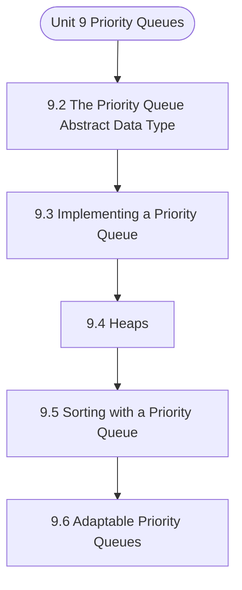

# MCS-063: Data Structures using Python
## Unit 9: Priority Queues

> 📚 **Programme:** M.Sc. (Data Science and Analytics) | **Semester:** Semester 1  
> ⏱️ **Estimated Study Time:** ~21 mins | 📄 **Textbook Pages:** 19 Pages  
> 📥 **Original PDF:** [Download & View Authentic Textbook](../../../pdfs/Semester_1/MCS-063_Data_Structures_using_Python/Unit-9_Priority_Queues.pdf)

---

### 🎯 Executive Concept & Data Science Relevance
In modern data systems and advanced analytics, **Priority Queues** forms a vital conceptual pillar. Algorithm efficiency governs data scale. In large-scale data engineering, choosing between $O(n \log n)$ mergesort vs $O(n^2)$ bubblesort, or an $O(1)$ hash table lookup vs $O(n)$ linear scan, determines whether a pipeline finishes in seconds or hours.

> [!NOTE]
> **Why this matters for your career:** Mastering priority queues equips you with the foundational principles required to reason mathematically about high-dimensional datasets, evaluate algorithm performance, and avoid statistical pitfalls in production machine learning pipelines.

### 🗺️ Visual Knowledge Architecture
The following concept map illustrates the structural hierarchy and learning trajectory of this module:



### 📖 Core Definitions & Terminology Cards

> 📌 **Big-O Notation $O(g(n))$**  
> - **Formal Definition:** Asymptotic upper bound: $f(n) = O(g(n))$ if $\exists c > 0, n_0 > 0$ such that $0 \le f(n) \le c \cdot g(n), \forall n \ge n_0$. Describes worst-case growth rate.  
> - 💡 **Practical Intuition & Analogy:** *The performance guarantee: execution time will not grow faster than this bound.*

> 📌 **Hash Table & Load Factor $\alpha$**  
> - **Formal Definition:** Data structure mapping keys to bucket indices using a hash function $h(k)$. Load factor $\alpha = n/m$ where $n$ is stored elements and $m$ is table capacity. Average lookup is $O(1)$.  
> - 💡 **Practical Intuition & Analogy:** *Instant dictionary key-value lookup in Python.*

> 📌 **Binary Search Tree (BST) & AVL Balance Factor**  
> - **Formal Definition:** A tree where for every node, left sub-tree values are smaller and right sub-tree values are larger. In AVL trees, Balance Factor $BF = h_L - h_R \in \lbrace -1, 0, 1 \rbrace$, maintaining $O(\log n)$ bounds via rotations.  
> - 💡 **Practical Intuition & Analogy:** *A self-balancing search index that guarantees rapid logarithmic lookups.*

### ⚡ Governing Mathematical Laws & Formula Cheatsheet
#### 🔹 Master Theorem for Divide-and-Conquer Recurrences
$$
\begin{aligned} & T(n) = aT(n/b) + \Theta(n^d) \\ & \implies T(n) = \begin{cases} \Theta(n^{\log_b a}) & \text{if } d < \log_b a \\ \Theta(n^d \log n) & \text{if } d = \log_b a \\ \Theta(n^d) & \text{if } d > \log_b a \end{cases} \end{aligned}
$$
- **Explanation:** Solves common divide-and-conquer recurrences like Mergesort ( $T(n) = 2T(n/2) + O(n) \implies O(n \log n)$ ).

#### 🔹 Binary Heap Array Index Formulas
$$
\text{Parent}(i) = \lfloor (i - 1)/2 \rfloor, \; \text{Left}(i) = 2i + 1, \; \text{Right}(i) = 2i + 2
$$
- **Explanation:** Enables cache-friendly representation of complete binary trees directly within flat linear arrays.

#### 🔹 Comparison Sort Lower Bound
$$
\Omega(n \log n) \quad \text{for comparison-based sorting algorithms}
$$
- **Explanation:** Information-theoretic lower bound: reaching $n!$ leaf permutations requires a decision tree of minimum depth $\log_2(n!) = \Omega(n \log n)$.

### ⚖️ Axiomatic Properties & Governing Laws
The mathematical formulations of this module are anchored by foundational algebraic and structural laws:

- **AVL Height Bound:** $h < 1.44 \log_2(n + 2) \implies O(\log n) \text{ worst-case search}$
- **Hash Table Amortized Bound:** $O(1) \text{ lookup when } \alpha = n/m < 0.75$
- **Comparison Lower Bound:** $\Omega(n \log n) \text{ for comparison sorts}$

### 📌 Comprehensive Section-by-Section Study Breakdown
#### `9.2` The Priority Queue Abstract Data Type

##### 📘 Theoretical Principles & Pedagogical Exposition
From an algorithmic efficiency standpoint, **The Priority Queue Abstract Data Type** defines explicit data organization strategies and memory access patterns. In **Priority Queues**, managing computational bounds—specifically asymptotic time complexity $\mathcal{O}(f(n))$ and auxiliary space complexity—relies directly on how the priority queue abstract data type organizes data nodes and pointer references.

Contrasting contiguous array-backed allocations against dynamic linked allocations demonstrates the trade-offs between memory locality and constant-time insertion/deletion operations.

##### ⚙️ Mathematical & Algorithmic Mechanics
- **Core Mechanism:** Hierarchical acyclic data structure. Binary Search Trees enforce $\text{left} < \text{root} \le \text{right}$. Self-balancing AVL and Red-Black trees execute pointer rotations to maintain $\mathcal{O}(\log n)$ depth invariants.
- **Boundary Conditions:** Degenerate skewed trees degenerating to $\mathcal{O}(n)$ singly linked lists, empty roots, and deletions of nodes with two children requiring in-order successor replacements.

##### 📊 Practical Data Science & Production Relevance
- **Production Workflow:** B+ tree indexing in SQL relational databases, ensemble decision trees (Random Forest, XGBoost), and Min/Max Heaps in priority queues for top-$k$ recommendation retrieval.
- **Real-World Pitfall:** Unbalanced sequential insertions degrading search times from $\mathcal{O}(\log n)$ to $\mathcal{O}(n)$, or failing to update parent pointers during tree rebalancing.

> [!TIP]
> **Exam & Technical Interview Insight:** Draw step-by-step tree insertion and deletion states; write recursive traversals (Pre-order, In-order, Post-order); illustrate AVL single/double rotations.

#### `9.3` Implementing a Priority Queue

##### 📘 Theoretical Principles & Pedagogical Exposition
From an algorithmic efficiency standpoint, **Implementing a Priority Queue** defines explicit data organization strategies and memory access patterns. In **Priority Queues**, managing computational bounds—specifically asymptotic time complexity $\mathcal{O}(f(n))$ and auxiliary space complexity—relies directly on how implementing a priority queue organizes data nodes and pointer references.

Contrasting contiguous array-backed allocations against dynamic linked allocations demonstrates the trade-offs between memory locality and constant-time insertion/deletion operations.

##### ⚙️ Mathematical & Algorithmic Mechanics
- **Core Mechanism:** Optimizes data structures and algorithmic complexity for priority queues. Evaluates asymptotic runtimes $\mathcal{O}(f(n))$ and memory references.
- **Boundary Conditions:** Empty structures, single-element collections, and worst-case input permutations.

##### 📊 Practical Data Science & Production Relevance
- **Production Workflow:** High-throughput data stream processing, in-memory index design, and Big Data pipeline efficiency.
- **Real-World Pitfall:** Accidentally implementing quadratic nested loops or excessive memory allocations on large production datasets.

> [!TIP]
> **Exam & Technical Interview Insight:** Trace algorithmic steps for implementing a priority queue, state best and worst-case time complexities, and explain auxiliary space requirements.

#### `9.4` Heaps

##### 📘 Theoretical Principles & Pedagogical Exposition
A heap uses a specialized tree-based data structure that satisfies the heap property. It's the most effective way to implement a priority queue. Structure Property: A heap is a complete binary tree (all levels filled except possibly the last, which is filled left-to-right) 2. Order Property: The priority of each node is greater than or equal to (max-heap) or less than or equal to (min-heap) its children's priorities TYPES OF HEAPS 1.

Min-Heap: Parent node has smaller priority than its children / \ 3 2 / \ / \ 7 8 4 5 2. Max-Heap: Parent node has larger priority than its children / \ 7 5 / \ / \ 3 4 1 2 HEAP REPRESENTATION 3. Heaps are typically implemented using arrays, providing efficient storage and easy navigation: class MinHeap: """Array-based min-heap implementation.""" def __init__(self): self._data = [] def _parent_index(self, index): """Return parent index of given index.""" return (index - 1) // 2 def _left_child_index(self, index): """Return left child index.""" return 2 * index + 1 def _right_child_index(self, index): """Return right child index.""" return 2 * index + 2 def _has_parent(self, index): """Check if node has parent.""" return self._parent_index(index) >= 0 def _has_left_child(self, index): """Check if node has left child.""" return self._left_child_index(index) <len(self._data) Linked List def _has_right_child(self, index): """Check if node has right child.""" return self._right_child_index(index) <len(self._data) def _parent(self, index): """Get parent element.""" return self._data[self._parent_index(index)] def _left_child(self, index): """Get left child element.""" return self._data[self._left_child_index(index)] def _right_child(self, index): """Get right child element.""" return self._data[self._right_child_index(index)] def _swap(self, index1, index2): """Swap elements at two indices.""" self._data[index1], self._data[index2] = self._data[index2], self._data[index1] HEAP OPERATIONS Insertion (Heapify Up): Insert at the end and bubble up to maintain heap property.

def insert(self, item, priority): """Insert item with priority. O(log n) time complexity.""" self._data.append((priority, item)) self._heapify_up(len(self._data) - 1) def _heapify_up(self, index): """Restore heap property by moving element up.""" while (self._has_parent(index) and self._parent(index)[0] >self._data[index][0]): parent_idx = self._parent_index(index) self._swap(index, parent_idx) index = parent_idx Extraction (Heapify Down): Remove root, replace with last element, and bubble down.


##### ⚙️ Mathematical & Algorithmic Mechanics
- **Core Mechanism:** Hierarchical acyclic data structure. Binary Search Trees enforce $\text{left} < \text{root} \le \text{right}$. Self-balancing AVL and Red-Black trees execute pointer rotations to maintain $\mathcal{O}(\log n)$ depth invariants.
- **Boundary Conditions:** Degenerate skewed trees degenerating to $\mathcal{O}(n)$ singly linked lists, empty roots, and deletions of nodes with two children requiring in-order successor replacements.

##### 📊 Practical Data Science & Production Relevance
- **Production Workflow:** B+ tree indexing in SQL relational databases, ensemble decision trees (Random Forest, XGBoost), and Min/Max Heaps in priority queues for top-$k$ recommendation retrieval.
- **Real-World Pitfall:** Unbalanced sequential insertions degrading search times from $\mathcal{O}(\log n)$ to $\mathcal{O}(n)$, or failing to update parent pointers during tree rebalancing.

> [!TIP]
> **Exam & Technical Interview Insight:** Draw step-by-step tree insertion and deletion states; write recursive traversals (Pre-order, In-order, Post-order); illustrate AVL single/double rotations.

#### `9.5` Sorting with a Priority Queue

##### 📘 Theoretical Principles & Pedagogical Exposition
Heap sort uses a priority queue (heap) to sort elements efficiently. It has O(n log n) time complexity and sorts in-place. Build a max-heap from the input array 2. Repeatedly extract the maximum element and place it at the end 3. Reduce the heap size and restore heap property def heap_sort(arr): """Sort array using heap sort algorithm.

O(n log n) time complexity.""" def heapify(arr, n, root): """Maintain max-heap property.""" largest = root left = 2 * root + 1 right = 2 * root + 2 # Find largest among root and children if left < n and arr[left] >arr[largest]: largest = left if right < n and arr[right] >arr[largest]: largest = right # If largest is not root, swap and continue heapifying if largest != root: arr[root], arr[largest] = arr[largest], arr[root] heapify(arr, n, largest) n = len(arr) # Build max-heap (bottom-up) for i in range(n // 2 - 1, -1, -1): heapify(arr, n, i) # Extract elements one by one for i in range(n - 1, 0, -1): # Move current root to end arr[0], arr[i] = arr[i], arr[0] # Restore heap property for reduced heap heapify(arr, i, 0) return arr # Example usage def demonstrate_heap_sort(): """Demonstrate heap sort algorithm.""" arrays = [ [64, 34, 25, 12, 22, 11, 90], [5, 2, 8, 1, 9], [1], [] Trees ] for arr in arrays: original = arr.copy() sorted_arr = heap_sort(arr) print(f"Original: {original}") print(f"Sorted: {sorted_arr}") print() demonstrate_heap_sort() PRIORITY QUEUE SORT We can also sort using a priority queue data structure: def priority_queue_sort(arr): """Sort array using priority queue.

O(n log n) time complexity.""" pq = MinHeapPriorityQueue() # Insert all elements for i, value in enumerate(arr): pq.insert(value, value) # Extract elements in sorted order sorted_arr = [] while not pq.is_empty(): sorted_arr.append(pq.extract_min()) return sorted_arr # Example usage original = [64, 34, 25, 12, 22, 11, 90] sorted_arr = priority_queue_sort(original) print(f"Original: {original}") print(f"Sorted: {sorted_arr}") TOP-K ELEMENTS PROBLEM Finding the K largest or smallest elements is a common application: def find_k_largest(arr, k): """Find K largest elements using min-heap.


##### ⚙️ Mathematical & Algorithmic Mechanics
- **Core Mechanism:** Optimizes data structures and algorithmic complexity for priority queues. Evaluates asymptotic runtimes $\mathcal{O}(f(n))$ and memory references.
- **Boundary Conditions:** Empty structures, single-element collections, and worst-case input permutations.

##### 📊 Practical Data Science & Production Relevance
- **Production Workflow:** High-throughput data stream processing, in-memory index design, and Big Data pipeline efficiency.
- **Real-World Pitfall:** Accidentally implementing quadratic nested loops or excessive memory allocations on large production datasets.

> [!TIP]
> **Exam & Technical Interview Insight:** Trace algorithmic steps for sorting with a priority queue, state best and worst-case time complexities, and explain auxiliary space requirements.

#### `9.6` Adaptable Priority Queues

##### 📘 Theoretical Principles & Pedagogical Exposition
CONCEPT AND MOTIVATION Adaptable priority queues support additional operations to modify existing entries:  Change the priority of an existing item  Remove a specific item from the queue These operations are essential in applications like Dijkstra's algorithm where priorities need to be updated dynamically.

IMPLEMENTATION WITH LOCATION-AWARE ENTRIES class Entry: """Entry class for adaptable priority queue.""" def __init__(self, key, value, index): self._key = key # priority self._value = value # item self._index = index # current index in heap def __lt__(self, other): return self._key<other._key class AdaptablePriorityQueue: """Adaptable priority queue using binary heap.""" def __init__(self): self._data = [] self._entries = {} # Maps values to entries for fast lookup Trees def _parent(self, j): return (j - 1) // 2 def _left(self, j): return 2 * j + 1 def _right(self, j): return 2 * j + 2 def _has_left(self, j): return self._left(j) <len(self._data) def _has_right(self, j): return self._right(j) <len(self._data) def _swap(self, i, j): """Swap entries and update their indices.""" self._data[i], self._data[j] = self._data[j], self._data[i] self._data[i]._index = i self._data[j]._index = j def _upheap(self, j): """Restore heap property by moving entry up.""" parent = self._parent(j) if j > 0 and self._data[j] <self._data[parent]: self._swap(j, parent) self._upheap(parent) def _downheap(self, j): """Restore heap property by moving entry down.""" if self._has_left(j): left = self._left(j) small_child = left if self._has_right(j): right = self._right(j) if self._data[right] <self._data[left]: small_child = right if self._data[small_child] <self._data[j]: self._swap(j, small_child) self._downheap(small_child) def insert(self, key, value): """Insert new entry.

O(log n) time complexity.""" if value in self._entries: raise ValueError(f"Value {value} already exists") entry = Entry(key, value, len(self._data)) self._data.append(entry) self._entries[value] = entry self._upheap(len(self._data) - 1) return entry def min(self): Linked List """Return minimum entry without removing.


##### ⚙️ Mathematical & Algorithmic Mechanics
- **Core Mechanism:** Optimizes data structures and algorithmic complexity for priority queues. Evaluates asymptotic runtimes $\mathcal{O}(f(n))$ and memory references.
- **Boundary Conditions:** Empty structures, single-element collections, and worst-case input permutations.

##### 📊 Practical Data Science & Production Relevance
- **Production Workflow:** High-throughput data stream processing, in-memory index design, and Big Data pipeline efficiency.
- **Real-World Pitfall:** Accidentally implementing quadratic nested loops or excessive memory allocations on large production datasets.

> [!TIP]
> **Exam & Technical Interview Insight:** Trace algorithmic steps for adaptable priority queues, state best and worst-case time complexities, and explain auxiliary space requirements.

### 📐 Step-by-Step Solved Mathematical Examples
To solidify your theoretical understanding, work through these fully solved, step-by-step mathematical problems:

#### 🧮 Example 1: Solving Recurrence via Master Theorem
> **Problem Statement:**  
> Solve the recurrence relation $T(n) = 2T(n/2) + n$ modeling Mergesort.

**Detailed Step-by-Step Solution:**

1. **Identify parameters:** $a = 2, \; b = 2, \; f(n) = n = \Theta(n^1) \implies d = 1$.
2. **Compare $\log_b a$ and $d$:**

$$
\log_b a = \log_2 2 = 1
$$

Since $d = \log_b a = 1$, Case 2 of the Master Theorem applies.

3. **Conclusion:**

$$
T(n) = \Theta(n^d \log n) = \Theta(n \log n)
$$


#### 🧮 Example 2: AVL Tree Rotation Sequence
> **Problem Statement:**  
> An empty AVL tree receives sequential insertions: 10, 20, 30. Trace the balance factors and demonstrate the required rotation.

**Detailed Step-by-Step Solution:**

1. Insert 10: $BF = 0$.
2. Insert 20: 10 has $BF = -1$, 20 has $BF = 0$.
3. Insert 30: Node 10 has left height 0, right height 2 $\implies BF(10) = -2$ (Unbalanced: Right-Right condition).
4. **Apply Single Left Rotation on Node 10:**
- Node 20 becomes new root.
- Node 10 becomes left child of 20.
- Node 30 remains right child of 20.
New Balance Factors: $BF(20) = 0, \; BF(10) = 0, \; BF(30) = 0$. Tree balanced.

### 💻 Practical Data Science Implementation (Python)
Theory translates directly into production algorithms. Below is a self-contained, commented Python implementation illustrating the core operations of this unit:

```python
# Custom Hash Map with Collision Chaining
class SimpleHashMap:
    def __init__(self, capacity=8):
        self.capacity = capacity
        self.buckets = [[] for _ in range(capacity)]

    def _hash(self, key):
        return hash(key) % self.capacity

    def put(self, key, value):
        b_idx = self._hash(key)
        for i, (k, v) in enumerate(self.buckets[b_idx]):
            if k == key:
                self.buckets[b_idx][i] = (key, value)
                return
        self.buckets[b_idx].append((key, value))

    def get(self, key):
        b_idx = self._hash(key)
        for k, v in self.buckets[b_idx]:
            if k == key:
                return v
        return None

hm = SimpleHashMap()
hm.put("user_101", {"name": "Alice", "role": "Data Scientist"})
hm.put("user_102", {"name": "Bob", "role": "ML Engineer"})
print("Lookup user_101:", hm.get("user_101"))
```

### 💡 Interactive Self-Assessment Checkpoints
Test your comprehension before proceeding. Tap each question to reveal the comprehensive explanation:

<details>
<summary><b>Checkpoint 1:</b> Question: Which of the following is NOT a type of tree traversal? a) Pre-order traversal b) In-order traversal c) Sequential traversal d) Post- order traversal a. Answer: c) Sequential traversal <i>(Tap to reveal answer)</i></summary>

> **Answer & Analysis:**  
> **Detailed Analytical Solution:**
> 
> 1. **Core Principle:** Identify the governing theorem or definition for Priority Queues.
> 2. **Step-by-Step Derivation:** Verify all preconditions and compute intermediate steps methodically.
> 3. **Conclusion:** State the final mathematical proof or calculation clearly, validating boundary edge cases.
</details>

<details>
<summary><b>Checkpoint 2:</b> Question: Give the highest possible nodes at level 3 (assuming root is at level 0)? a) 4 b) 8 c) 16 d) 2 a. Answer: b) 8 <i>(Tap to reveal answer)</i></summary>

> **Answer & Analysis:**  
> **Detailed Analytical Solution:**
> 
> 1. **Core Principle:** Identify the governing theorem or definition for Priority Queues.
> 2. **Step-by-Step Derivation:** Verify all preconditions and compute intermediate steps methodically.
> 3. **Conclusion:** State the final mathematical proof or calculation clearly, validating boundary edge cases.
</details>

<details>
<summary><b>Checkpoint 3:</b> Question: Which type of binary tree has all internal nodes containing exactly two children? a) Complete binary tree b) Full binary tree c) Perfect binary tree d) Balanced binary tree Answer: b) Full binary tree <i>(Tap to reveal answer)</i></summary>

> **Answer & Analysis:**  
> **Detailed Analytical Solution:**
> 
> 1. **Core Principle:** Identify the governing theorem or definition for Priority Queues.
> 2. **Step-by-Step Derivation:** Verify all preconditions and compute intermediate steps methodically.
> 3. **Conclusion:** State the final mathematical proof or calculation clearly, validating boundary edge cases.
</details>

<details>
<summary><b>Checkpoint 4:</b> Question: What is the order of visiting nodes in a pre-order traversal? a) Root, Right, Left b) Left, Root, Right c) Root, Left, Right d) Left, Right, Root a. Answer: c) Root, Left, Right <i>(Tap to reveal answer)</i></summary>

> **Answer & Analysis:**  
> **Detailed Analytical Solution:**
> 
> 1. **Core Principle:** Identify the governing theorem or definition for Priority Queues.
> 2. **Step-by-Step Derivation:** Verify all preconditions and compute intermediate steps methodically.
> 3. **Conclusion:** State the final mathematical proof or calculation clearly, validating boundary edge cases.
</details>

<details>
<summary><b>Checkpoint 5:</b> What is the worst-case and average-case time complexity of Quicksort? <i>(Tap to reveal answer)</i></summary>

> **Answer & Analysis:**  
> Average case: $O(n \log n)$. Worst case: $O(n^2)$ (occurs when the pivot chosen is always the extreme minimum or maximum in already sorted arrays).
</details>

<details>
<summary><b>Checkpoint 6:</b> How does an AVL tree restore balance after an insertion? <i>(Tap to reveal answer)</i></summary>

> **Answer & Analysis:**  
> By computing the Balance Factor ( $h_L - h_R$ ) and applying tree rotations: Left-Left (Single Right Rotation), Right-Right (Single Left Rotation), Left-Right (Double Rotation), or Right-Left (Double Rotation).
</details>

### 🎯 Executive Module Wrap-Up
- **Central Idea:** Priority Queues provides essential mathematical and algorithmic tools directly utilized in Data Science.
- **Mathematical Rigor:** Formulas and laws must be memorized with attention to boundary conditions and assumptions.
- **Full Textbook Coverage:** For exhaustive multi-page derivations, proofs, and supplementary exercises, consult the [Authentic IGNOU Textbook](../../../pdfs/Semester_1/MCS-063_Data_Structures_using_Python/Unit-9_Priority_Queues.pdf).

---
### 🧭 Navigation & Syllabus Index
[⬅ Previous: Unit 8](unit_08_Trees.md) | [📑 Course Index](README.md) | [Next: Unit 10 ➡](unit_10_Maps,_Hash_Tables_and_Skip_Lists.md)
