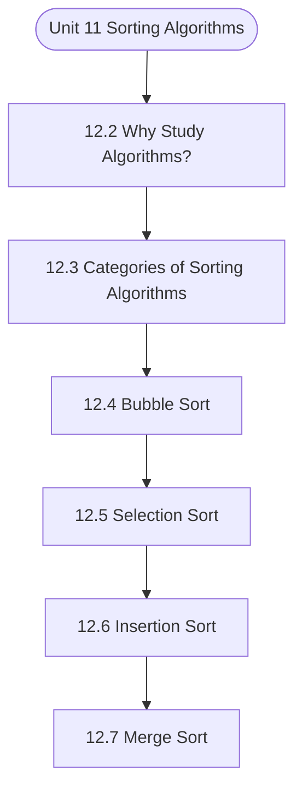

# MCS-063: Data Structures using Python
## Unit 11: Sorting Algorithms

> 📚 **Programme:** M.Sc. (Data Science and Analytics) | **Semester:** Semester 1  
> ⏱️ **Estimated Study Time:** ~20 mins | 📄 **Textbook Pages:** 19 Pages  
> 📥 **Original PDF:** [Download & View Authentic Textbook](../../../pdfs/Semester_1/MCS-063_Data_Structures_using_Python/Unit-12_Sorting_Algorithms.pdf)

---

### 🎯 Executive Concept & Data Science Relevance
In modern data systems and advanced analytics, **Sorting Algorithms** forms a vital conceptual pillar. Algorithm efficiency governs data scale. In large-scale data engineering, choosing between $O(n \log n)$ mergesort vs $O(n^2)$ bubblesort, or an $O(1)$ hash table lookup vs $O(n)$ linear scan, determines whether a pipeline finishes in seconds or hours.

> [!NOTE]
> **Why this matters for your career:** Mastering sorting algorithms equips you with the foundational principles required to reason mathematically about high-dimensional datasets, evaluate algorithm performance, and avoid statistical pitfalls in production machine learning pipelines.

### 🗺️ Visual Knowledge Architecture
The following concept map illustrates the structural hierarchy and learning trajectory of this module:



### 📖 Core Definitions & Terminology Cards

> 📌 **Big-O Notation $O(g(n))$**  
> - **Formal Definition:** Asymptotic upper bound: $f(n) = O(g(n))$ if $\exists c > 0, n_0 > 0$ such that $0 \le f(n) \le c \cdot g(n), \forall n \ge n_0$. Describes worst-case growth rate.  
> - 💡 **Practical Intuition & Analogy:** *The performance guarantee: execution time will not grow faster than this bound.*

> 📌 **Hash Table & Load Factor $\alpha$**  
> - **Formal Definition:** Data structure mapping keys to bucket indices using a hash function $h(k)$. Load factor $\alpha = n/m$ where $n$ is stored elements and $m$ is table capacity. Average lookup is $O(1)$.  
> - 💡 **Practical Intuition & Analogy:** *Instant dictionary key-value lookup in Python.*

> 📌 **Binary Search Tree (BST) & AVL Balance Factor**  
> - **Formal Definition:** A tree where for every node, left sub-tree values are smaller and right sub-tree values are larger. In AVL trees, Balance Factor $BF = h_L - h_R \in \lbrace -1, 0, 1 \rbrace$, maintaining $O(\log n)$ bounds via rotations.  
> - 💡 **Practical Intuition & Analogy:** *A self-balancing search index that guarantees rapid logarithmic lookups.*

### ⚡ Governing Mathematical Laws & Formula Cheatsheet
#### 🔹 Master Theorem for Divide-and-Conquer Recurrences
$$
\begin{aligned} & T(n) = aT(n/b) + \Theta(n^d) \\ & \implies T(n) = \begin{cases} \Theta(n^{\log_b a}) & \text{if } d < \log_b a \\ \Theta(n^d \log n) & \text{if } d = \log_b a \\ \Theta(n^d) & \text{if } d > \log_b a \end{cases} \end{aligned}
$$
- **Explanation:** Solves common divide-and-conquer recurrences like Mergesort ( $T(n) = 2T(n/2) + O(n) \implies O(n \log n)$ ).

#### 🔹 Binary Heap Array Index Formulas
$$
\text{Parent}(i) = \lfloor (i - 1)/2 \rfloor, \; \text{Left}(i) = 2i + 1, \; \text{Right}(i) = 2i + 2
$$
- **Explanation:** Enables cache-friendly representation of complete binary trees directly within flat linear arrays.

#### 🔹 Comparison Sort Lower Bound
$$
\Omega(n \log n) \quad \text{for comparison-based sorting algorithms}
$$
- **Explanation:** Information-theoretic lower bound: reaching $n!$ leaf permutations requires a decision tree of minimum depth $\log_2(n!) = \Omega(n \log n)$.

### ⚖️ Axiomatic Properties & Governing Laws
The mathematical formulations of this module are anchored by foundational algebraic and structural laws:

- **AVL Height Bound:** $h < 1.44 \log_2(n + 2) \implies O(\log n) \text{ worst-case search}$
- **Hash Table Amortized Bound:** $O(1) \text{ lookup when } \alpha = n/m < 0.75$
- **Comparison Lower Bound:** $\Omega(n \log n) \text{ for comparison sorts}$

### 📌 Comprehensive Section-by-Section Study Breakdown
#### `12.2` Why Study Algorithms?

##### 📘 Theoretical Principles & Pedagogical Exposition
From an algorithmic efficiency standpoint, **Why Study Algorithms?** defines explicit data organization strategies and memory access patterns. In **Sorting Algorithms**, managing computational bounds—specifically asymptotic time complexity $\mathcal{O}(f(n))$ and auxiliary space complexity—relies directly on how why study algorithms? organizes data nodes and pointer references.

Contrasting contiguous array-backed allocations against dynamic linked allocations demonstrates the trade-offs between memory locality and constant-time insertion/deletion operations.

##### ⚙️ Mathematical & Algorithmic Mechanics
- **Core Mechanism:** Asymptotic bounds evaluate algorithmic scalability as input size $n \to \infty$: upper bound $\mathcal{O}(g(n))$, lower bound $\Omega(g(n))$, and tight bound $\Theta(g(n))$. Recurrences are solved via the Master Theorem: $T(n) = a T(n/b) + f(n)$.
- **Boundary Conditions:** Degenerate input permutations (e.g. sorted inputs triggering $\mathcal{O}(n^2)$ worst-case Quicksort), and recursion call stack memory limits.

##### 📊 Practical Data Science & Production Relevance
- **Production Workflow:** Selecting optimal data structures (hash tables $\mathcal{O}(1)$ vs BSTs $\mathcal{O}(\log n)$), minimizing latency in real-time query engines, and optimizing Big Data batch workloads.
- **Real-World Pitfall:** Ignoring hardware cache locality and constant factors, or inadvertently nesting linear scans within iterative loops yielding hidden $\mathcal{O}(n^2)$ complexity.

> [!TIP]
> **Exam & Technical Interview Insight:** Solve recurrences step-by-step using substitution or Master Theorem; state tight $\mathcal{O}$, $\Omega$, and $\Theta$ bounds for best, average, and worst-case scenarios.

#### `12.3` Categories of Sorting Algorithms

##### 📘 Theoretical Principles & Pedagogical Exposition
From an algorithmic efficiency standpoint, **Categories of Sorting Algorithms** defines explicit data organization strategies and memory access patterns. In **Sorting Algorithms**, managing computational bounds—specifically asymptotic time complexity $\mathcal{O}(f(n))$ and auxiliary space complexity—relies directly on how categories of sorting algorithms organizes data nodes and pointer references.

Contrasting contiguous array-backed allocations against dynamic linked allocations demonstrates the trade-offs between memory locality and constant-time insertion/deletion operations.

##### ⚙️ Mathematical & Algorithmic Mechanics
- **Core Mechanism:** Asymptotic bounds evaluate algorithmic scalability as input size $n \to \infty$: upper bound $\mathcal{O}(g(n))$, lower bound $\Omega(g(n))$, and tight bound $\Theta(g(n))$. Recurrences are solved via the Master Theorem: $T(n) = a T(n/b) + f(n)$.
- **Boundary Conditions:** Degenerate input permutations (e.g. sorted inputs triggering $\mathcal{O}(n^2)$ worst-case Quicksort), and recursion call stack memory limits.

##### 📊 Practical Data Science & Production Relevance
- **Production Workflow:** Selecting optimal data structures (hash tables $\mathcal{O}(1)$ vs BSTs $\mathcal{O}(\log n)$), minimizing latency in real-time query engines, and optimizing Big Data batch workloads.
- **Real-World Pitfall:** Ignoring hardware cache locality and constant factors, or inadvertently nesting linear scans within iterative loops yielding hidden $\mathcal{O}(n^2)$ complexity.

> [!TIP]
> **Exam & Technical Interview Insight:** Solve recurrences step-by-step using substitution or Master Theorem; state tight $\mathcal{O}$, $\Omega$, and $\Theta$ bounds for best, average, and worst-case scenarios.

#### `12.4` Bubble Sort

##### 📘 Theoretical Principles & Pedagogical Exposition
Bubble sort is the simplest algorithm that works by comparing each pair of elements and swapping elements if they are in the wrong order. The algorithm continues iteration until no more swaps are required. Bubble sort is not suitable for large datasets due to its high time complexity.

Bubble sort does not require additional memory space, i.e., in-place and is stable sorting algorithm. Working of Bubble Sort 1. The array is sorted using multiple passes. The largest element goes to the end of array after first pass. The second largest element goes to second last position after second pass and so on.

In all passes, we compare all adjacent elements and swap of larger element is before the smaller element. Let’s understand this with help of an example: First Pass: i=0 i=1 i=2 Largest Element in Last (Sorted Array) Second Pass: i=0 i=1 i=2 Third Pass: i=0 Pseudocode of Bubble Sort def Bubblesort (A) for i in range (len(A)): for j in range (len(A)-1, I, -1): if (A[j] < A[j-1]): swap (A, j, j-1) Performance Analysis: Time Complexity Reason Worst Case O(n2) When array is arranged in descending order Average Case O(n2) Irrespective of order of elements Best Case O(n2) Already sorted array Space Complexity: Bubble sort does not require additional memory space i.e., space complexity is O(1).


##### ⚙️ Mathematical & Algorithmic Mechanics
- **Core Mechanism:** Asymptotic bounds evaluate algorithmic scalability as input size $n \to \infty$: upper bound $\mathcal{O}(g(n))$, lower bound $\Omega(g(n))$, and tight bound $\Theta(g(n))$. Recurrences are solved via the Master Theorem: $T(n) = a T(n/b) + f(n)$.
- **Boundary Conditions:** Degenerate input permutations (e.g. sorted inputs triggering $\mathcal{O}(n^2)$ worst-case Quicksort), and recursion call stack memory limits.

##### 📊 Practical Data Science & Production Relevance
- **Production Workflow:** Selecting optimal data structures (hash tables $\mathcal{O}(1)$ vs BSTs $\mathcal{O}(\log n)$), minimizing latency in real-time query engines, and optimizing Big Data batch workloads.
- **Real-World Pitfall:** Ignoring hardware cache locality and constant factors, or inadvertently nesting linear scans within iterative loops yielding hidden $\mathcal{O}(n^2)$ complexity.

> [!TIP]
> **Exam & Technical Interview Insight:** Solve recurrences step-by-step using substitution or Master Theorem; state tight $\mathcal{O}$, $\Omega$, and $\Theta$ bounds for best, average, and worst-case scenarios.

#### `12.5` Selection Sort

##### 📘 Theoretical Principles & Pedagogical Exposition
Selection sort works by repeatedly selecting the smallest element from the unsorted Sorted Array Sorted Array array and swapping it with the first unsorted element. The process continues till the array is sorted. The algorithm is easy to understand and does not require additional memory space for sorting.

But it does not preserve the relative order of elements with the same value i.e., unstable sorting algorithm. Working of Selection Sort 1. Find the minimum element in the unsorted array and swap it with element at current position. Repeat this process until all elements are in correct order i.e., the array is sorted.

Let’s understand this with the help of an example: Considering the given array as: 12 14 10 5 Step 01 Step 02 Step 03 Sorted Array Pseudocode of Selection Sort def Selectionsort (A): for i in range (len (A)): min = i for j in range (i+1, len (A)): if (A[j] < A[min]) min = j swap (A, min, j) Smallest element SWAP Current Position Sorted Current Position Smallest element SWAP Smallest element Current Position Performance Analysis Time Complexity Reason Worst Case O(n2) The time complexity is irrespective of order of the elements Average Case O(n2) Best Case O(n2) Space Complexity:It is an in-place sorting algorithm i.e., does not require additional memory space i.e., space complexity is O(1).


##### ⚙️ Mathematical & Algorithmic Mechanics
- **Core Mechanism:** Asymptotic bounds evaluate algorithmic scalability as input size $n \to \infty$: upper bound $\mathcal{O}(g(n))$, lower bound $\Omega(g(n))$, and tight bound $\Theta(g(n))$. Recurrences are solved via the Master Theorem: $T(n) = a T(n/b) + f(n)$.
- **Boundary Conditions:** Degenerate input permutations (e.g. sorted inputs triggering $\mathcal{O}(n^2)$ worst-case Quicksort), and recursion call stack memory limits.

##### 📊 Practical Data Science & Production Relevance
- **Production Workflow:** Selecting optimal data structures (hash tables $\mathcal{O}(1)$ vs BSTs $\mathcal{O}(\log n)$), minimizing latency in real-time query engines, and optimizing Big Data batch workloads.
- **Real-World Pitfall:** Ignoring hardware cache locality and constant factors, or inadvertently nesting linear scans within iterative loops yielding hidden $\mathcal{O}(n^2)$ complexity.

> [!TIP]
> **Exam & Technical Interview Insight:** Solve recurrences step-by-step using substitution or Master Theorem; state tight $\mathcal{O}$, $\Omega$, and $\Theta$ bounds for best, average, and worst-case scenarios.

#### `12.6` Insertion Sort

##### 📘 Theoretical Principles & Pedagogical Exposition
It is a simple sorting algorithm that divide the array into two parts i.e., sorted and unsorted. The algorithm works by iteratively inserting each element of unsorted list into the right place in the sorted list. Insertion sort is efficient for small data and is a stable and in-place algorithm.

Working of Insertion Sort: 1. The first element of the array is assured to be sorted. Compare the second element with the element in the sorted array if it is smaller than swap. Compare the third element with elements in the sorted array and put it in the correct position. Repeat the above steps with other elements until the array is sorted.

Let’s understand this with the help of an example: First Pass Unsorted Array Sorted Array Compare 12 with 13. As it is smaller, swap SWAP Sorted Array Second Pass Third Pass Fourth Pass Pseudocode def Insertionsort (A): for i in range (1, len (A)): temp = A[i] j = i while (j >0 and tmp< A[i-1]): A[j] = A[j-1] j = j -1 A[j] = temp Compare 14 with elements in sorted array & swap where required Compare 10 with elements in sorted array & swap where required Swap Performance Analysis: Time Complexity Reason Worst Case O(n2) When array is arranged in descending order Average Case O(n2) Irrespective of order of elements Best Case O(n) Already sorted array Space Complexity: It does not require any auxiliary space i.e.,O(1) space complexity.


##### ⚙️ Mathematical & Algorithmic Mechanics
- **Core Mechanism:** Asymptotic bounds evaluate algorithmic scalability as input size $n \to \infty$: upper bound $\mathcal{O}(g(n))$, lower bound $\Omega(g(n))$, and tight bound $\Theta(g(n))$. Recurrences are solved via the Master Theorem: $T(n) = a T(n/b) + f(n)$.
- **Boundary Conditions:** Degenerate input permutations (e.g. sorted inputs triggering $\mathcal{O}(n^2)$ worst-case Quicksort), and recursion call stack memory limits.

##### 📊 Practical Data Science & Production Relevance
- **Production Workflow:** Selecting optimal data structures (hash tables $\mathcal{O}(1)$ vs BSTs $\mathcal{O}(\log n)$), minimizing latency in real-time query engines, and optimizing Big Data batch workloads.
- **Real-World Pitfall:** Ignoring hardware cache locality and constant factors, or inadvertently nesting linear scans within iterative loops yielding hidden $\mathcal{O}(n^2)$ complexity.

> [!TIP]
> **Exam & Technical Interview Insight:** Solve recurrences step-by-step using substitution or Master Theorem; state tight $\mathcal{O}$, $\Omega$, and $\Theta$ bounds for best, average, and worst-case scenarios.

#### `12.7` Merge Sort

##### 📘 Theoretical Principles & Pedagogical Exposition
Merge sort is popular sorting algorithm that works on Divide and Conquer strategy. It works by recursively dividing i/p array into two halves, sorting both halves and merging them together to obtain sorted array. It is a stable and not in-place algorithm. Working of Merge Sort 1.

Divide the unsorted array into parts until it cannot be sub-divided- Divide 2. Conquer each sub-array created and sort them – Conquer Note – If an array contains single element, it is considered sorted. Merge the sorted sub-arrays into correct order. Let’s understand it with help of an example: Given Array:12 14 10 5 Pass 01:Split the array into equal halves Pass 02:Split the sub-arrays further into equal halves Pass 03: Sub-arrays cannot be divided further.

Therefore, we move to step 02 i.e., conquer, sort, and merge Pass 04: Conquer, sort , and merge Pseudocode of Merge Sort: def mergesort (X): mid = len (X)/2 leftpart = X [:mid] rightpart = X[mid:] mergesort (leftpart) mergersort (rightpart) while i<len (leftpart) and j <len (rightpart): if leftpart[i] <rightpart[j] X[k] = leftpart[i] i = i + 1 else X[k] = rightpart [j] j + =1 k = k + 1 while i<len (leftpart): X[k] = leftpart [j] j = j + 1 k = k + 1 Performance Analysis: Time Complexity Reason Worst Case O(n log n) When array is arranged in descending order Average Case O(n log n) Irrespective of order of elements Best Case O(n log n) Already sorted array Space Complexity: It is not an in-place sorting algorithm i.e., needs additional memory space of O(n).


##### ⚙️ Mathematical & Algorithmic Mechanics
- **Core Mechanism:** Asymptotic bounds evaluate algorithmic scalability as input size $n \to \infty$: upper bound $\mathcal{O}(g(n))$, lower bound $\Omega(g(n))$, and tight bound $\Theta(g(n))$. Recurrences are solved via the Master Theorem: $T(n) = a T(n/b) + f(n)$.
- **Boundary Conditions:** Degenerate input permutations (e.g. sorted inputs triggering $\mathcal{O}(n^2)$ worst-case Quicksort), and recursion call stack memory limits.

##### 📊 Practical Data Science & Production Relevance
- **Production Workflow:** Selecting optimal data structures (hash tables $\mathcal{O}(1)$ vs BSTs $\mathcal{O}(\log n)$), minimizing latency in real-time query engines, and optimizing Big Data batch workloads.
- **Real-World Pitfall:** Ignoring hardware cache locality and constant factors, or inadvertently nesting linear scans within iterative loops yielding hidden $\mathcal{O}(n^2)$ complexity.

> [!TIP]
> **Exam & Technical Interview Insight:** Solve recurrences step-by-step using substitution or Master Theorem; state tight $\mathcal{O}$, $\Omega$, and $\Theta$ bounds for best, average, and worst-case scenarios.

#### `12.8` Quick Sort

##### 📘 Theoretical Principles & Pedagogical Exposition
Quick sort works on divide and conquer strategy and is also known as partition exchange sort. Just like merge sort, it uses recursive calls to sort the array. The algorithm picks an element as a pivot and partitions the unsorted array around pivot with an aim of placing pivot in the correct position in the sorted array.

Further, quick sort is not a stable algorithm i.e., it does not preserve the relative order of same elements. It is in-place algorithm that do not require auxiliary space for sorting. Working of Quick Sort 1. Choose an element as pivot (leftmost element is usually taken as pivot).

Split the array into 2 parts such that elements smaller than pivot are placed in one part and elements greater than pivot are placed in another part. Repeat the same process on both sub-arrays. Let’s understand this with help of an example: 12 14 10 5 Step 01: Considering last element i.e.


##### ⚙️ Mathematical & Algorithmic Mechanics
- **Core Mechanism:** Asymptotic bounds evaluate algorithmic scalability as input size $n \to \infty$: upper bound $\mathcal{O}(g(n))$, lower bound $\Omega(g(n))$, and tight bound $\Theta(g(n))$. Recurrences are solved via the Master Theorem: $T(n) = a T(n/b) + f(n)$.
- **Boundary Conditions:** Degenerate input permutations (e.g. sorted inputs triggering $\mathcal{O}(n^2)$ worst-case Quicksort), and recursion call stack memory limits.

##### 📊 Practical Data Science & Production Relevance
- **Production Workflow:** Selecting optimal data structures (hash tables $\mathcal{O}(1)$ vs BSTs $\mathcal{O}(\log n)$), minimizing latency in real-time query engines, and optimizing Big Data batch workloads.
- **Real-World Pitfall:** Ignoring hardware cache locality and constant factors, or inadvertently nesting linear scans within iterative loops yielding hidden $\mathcal{O}(n^2)$ complexity.

> [!TIP]
> **Exam & Technical Interview Insight:** Solve recurrences step-by-step using substitution or Master Theorem; state tight $\mathcal{O}$, $\Omega$, and $\Theta$ bounds for best, average, and worst-case scenarios.

#### `12.9` Comparing Various Sorting Algorithms

##### 📘 Theoretical Principles & Pedagogical Exposition
In this section, we will discuss best, average, and worst case time complexity of various sorting algorithms. Refer to Table 1 for all information about space and time complexity of algorithms. Table 2Comparative Analysis of Various Sorting Algorithms Algorithm Worst Case Average Case Best Case Stable In-place Bubble Sort O(n2) O(n2) O(n) Yes Yes Selection Sort O(n2) O(n2) O(n2) No Yes Insertion Sort O(n2) O(n2) O(n) Yes Yes Merge Sort O(n logn) O(n logn) O(n logn) Yes No Quick Sort O(n2) O(n logn) O(n logn) No Yes


##### ⚙️ Mathematical & Algorithmic Mechanics
- **Core Mechanism:** Asymptotic bounds evaluate algorithmic scalability as input size $n \to \infty$: upper bound $\mathcal{O}(g(n))$, lower bound $\Omega(g(n))$, and tight bound $\Theta(g(n))$. Recurrences are solved via the Master Theorem: $T(n) = a T(n/b) + f(n)$.
- **Boundary Conditions:** Degenerate input permutations (e.g. sorted inputs triggering $\mathcal{O}(n^2)$ worst-case Quicksort), and recursion call stack memory limits.

##### 📊 Practical Data Science & Production Relevance
- **Production Workflow:** Selecting optimal data structures (hash tables $\mathcal{O}(1)$ vs BSTs $\mathcal{O}(\log n)$), minimizing latency in real-time query engines, and optimizing Big Data batch workloads.
- **Real-World Pitfall:** Ignoring hardware cache locality and constant factors, or inadvertently nesting linear scans within iterative loops yielding hidden $\mathcal{O}(n^2)$ complexity.

> [!TIP]
> **Exam & Technical Interview Insight:** Solve recurrences step-by-step using substitution or Master Theorem; state tight $\mathcal{O}$, $\Omega$, and $\Theta$ bounds for best, average, and worst-case scenarios.

### 📐 Step-by-Step Solved Mathematical Examples
To solidify your theoretical understanding, work through these fully solved, step-by-step mathematical problems:

#### 🧮 Example 1: Solving Recurrence via Master Theorem
> **Problem Statement:**  
> Solve the recurrence relation $T(n) = 2T(n/2) + n$ modeling Mergesort.

**Detailed Step-by-Step Solution:**

1. **Identify parameters:** $a = 2, \; b = 2, \; f(n) = n = \Theta(n^1) \implies d = 1$.
2. **Compare $\log_b a$ and $d$:**

$$
\log_b a = \log_2 2 = 1
$$

Since $d = \log_b a = 1$, Case 2 of the Master Theorem applies.

3. **Conclusion:**

$$
T(n) = \Theta(n^d \log n) = \Theta(n \log n)
$$


#### 🧮 Example 2: AVL Tree Rotation Sequence
> **Problem Statement:**  
> An empty AVL tree receives sequential insertions: 10, 20, 30. Trace the balance factors and demonstrate the required rotation.

**Detailed Step-by-Step Solution:**

1. Insert 10: $BF = 0$.
2. Insert 20: 10 has $BF = -1$, 20 has $BF = 0$.
3. Insert 30: Node 10 has left height 0, right height 2 $\implies BF(10) = -2$ (Unbalanced: Right-Right condition).
4. **Apply Single Left Rotation on Node 10:**
- Node 20 becomes new root.
- Node 10 becomes left child of 20.
- Node 30 remains right child of 20.
New Balance Factors: $BF(20) = 0, \; BF(10) = 0, \; BF(30) = 0$. Tree balanced.

### 💻 Practical Data Science Implementation (Python)
Theory translates directly into production algorithms. Below is a self-contained, commented Python implementation illustrating the core operations of this unit:

```python
# Custom Hash Map with Collision Chaining
class SimpleHashMap:
    def __init__(self, capacity=8):
        self.capacity = capacity
        self.buckets = [[] for _ in range(capacity)]

    def _hash(self, key):
        return hash(key) % self.capacity

    def put(self, key, value):
        b_idx = self._hash(key)
        for i, (k, v) in enumerate(self.buckets[b_idx]):
            if k == key:
                self.buckets[b_idx][i] = (key, value)
                return
        self.buckets[b_idx].append((key, value))

    def get(self, key):
        b_idx = self._hash(key)
        for k, v in self.buckets[b_idx]:
            if k == key:
                return v
        return None

hm = SimpleHashMap()
hm.put("user_101", {"name": "Alice", "role": "Data Scientist"})
hm.put("user_102", {"name": "Bob", "role": "ML Engineer"})
print("Lookup user_101:", hm.get("user_101"))
```

### 💡 Interactive Self-Assessment Checkpoints
Test your comprehension before proceeding. Tap each question to reveal the comprehensive explanation:

<details>
<summary><b>Checkpoint 1:</b> What is the worst-case and average-case time complexity of Quicksort? <i>(Tap to reveal answer)</i></summary>

> **Answer & Analysis:**  
> Average case: $O(n \log n)$. Worst case: $O(n^2)$ (occurs when the pivot chosen is always the extreme minimum or maximum in already sorted arrays).
</details>

<details>
<summary><b>Checkpoint 2:</b> How does an AVL tree restore balance after an insertion? <i>(Tap to reveal answer)</i></summary>

> **Answer & Analysis:**  
> By computing the Balance Factor ( $h_L - h_R$ ) and applying tree rotations: Left-Left (Single Right Rotation), Right-Right (Single Left Rotation), Left-Right (Double Rotation), or Right-Left (Double Rotation).
</details>

<details>
<summary><b>Checkpoint 3:</b> What is the average lookup time in a Hash Table? <i>(Tap to reveal answer)</i></summary>

> **Answer & Analysis:**  
> $O(1)$ constant time, assuming a uniform hash distribution and reasonable load factor.
</details>

### 🎯 Executive Module Wrap-Up
- **Central Idea:** Sorting Algorithms provides essential mathematical and algorithmic tools directly utilized in Data Science.
- **Mathematical Rigor:** Formulas and laws must be memorized with attention to boundary conditions and assumptions.
- **Full Textbook Coverage:** For exhaustive multi-page derivations, proofs, and supplementary exercises, consult the [Authentic IGNOU Textbook](../../../pdfs/Semester_1/MCS-063_Data_Structures_using_Python/Unit-12_Sorting_Algorithms.pdf).

---
### 🧭 Navigation & Syllabus Index
[⬅ Previous: Unit 10](unit_10_Maps,_Hash_Tables_and_Skip_Lists.md) | [📑 Course Index](README.md) | [Next: Unit 12 ➡](unit_12_Text_Processing.md)
