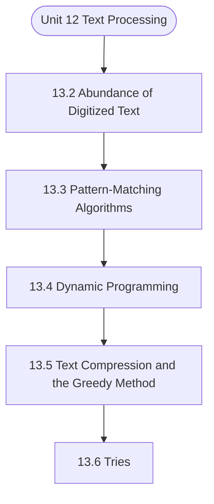

# MCS-063: Data Structures using Python
## Unit 12: Text Processing

> 📚 **Programme:** M.Sc. (Data Science and Analytics) | **Semester:** Semester 1  
> ⏱️ **Estimated Study Time:** ~51 mins | 📄 **Textbook Pages:** 41 Pages  
> 📥 **Original PDF:** [Download & View Authentic Textbook](../../../pdfs/Semester_1/MCS-063_Data_Structures_using_Python/Unit-13_Text_Processing.pdf)

---

### 🎯 Executive Concept & Data Science Relevance
In modern data systems, **Text Processing** forms a vital conceptual pillar. Algorithm efficiency governs data scale. In large-scale data engineering, choosing between $O(n \log n)$ mergesort vs $O(n^2)$ bubblesort, or an $O(1)$ hash table lookup vs $O(n)$ linear scan, determines whether a pipeline finishes in seconds or hours.

> [!NOTE]
> **Why this matters for your career:** Mastering text processing equips you with the foundational principles required to reason mathematically about high-dimensional datasets, evaluate algorithm performance, and avoid statistical pitfalls in production machine learning pipelines.

### 🗺️ Visual Knowledge Architecture
The following concept map illustrates the structural hierarchy and learning trajectory of this module:



### 📖 Core Definitions & Terminology Cards

> 📌 **Big-O Notation $O(g(n))$**  
> - **Formal Definition:** Asymptotic upper bound: $f(n) = O(g(n))$ if $\exists c > 0, n_0 > 0$ such that $0 \le f(n) \le c \cdot g(n), \forall n \ge n_0$. Describes worst-case growth rate.  
> - 💡 **Practical Intuition & Analogy:** *The performance guarantee: execution time will not grow faster than this bound.*

> 📌 **Hash Table & Load Factor $\alpha$**  
> - **Formal Definition:** Data structure mapping keys to bucket indices using a hash function $h(k)$. Load factor $\alpha = n/m$ where $n$ is stored elements and $m$ is table capacity. Average lookup is $O(1)$.  
> - 💡 **Practical Intuition & Analogy:** *Instant dictionary key-value lookup in Python.*

> 📌 **Binary Search Tree (BST) & AVL Balance Factor**  
> - **Formal Definition:** A tree where for every node, left sub-tree values are smaller and right sub-tree values are larger. In AVL trees, Balance Factor $BF = h_L - h_R \in \lbrace -1, 0, 1 \rbrace$, maintaining $O(\log n)$ bounds via rotations.  
> - 💡 **Practical Intuition & Analogy:** *A self-balancing search index that guarantees rapid logarithmic lookups.*

### ⚡ Governing Mathematical Laws & Formula Cheatsheet
#### 🔹 Master Theorem for Divide-and-Conquer Recurrences
$$
\begin{aligned} & T(n) = aT(n/b) + \Theta(n^d) \\ & \implies T(n) = \begin{cases} \Theta(n^{\log_b a}) & \text{if } d < \log_b a \\ \Theta(n^d \log n) & \text{if } d = \log_b a \\ \Theta(n^d) & \text{if } d > \log_b a \end{cases} \end{aligned}
$$
- **Explanation:** Solves common divide-and-conquer recurrences like Mergesort ( $T(n) = 2T(n/2) + O(n) \implies O(n \log n)$ ).

#### 🔹 Binary Heap Array Index Formulas
$$
\text{Parent}(i) = \lfloor (i - 1)/2 \rfloor, \; \text{Left}(i) = 2i + 1, \; \text{Right}(i) = 2i + 2
$$
- **Explanation:** Enables cache-friendly representation of complete binary trees directly within flat linear arrays.

#### 🔹 Comparison Sort Lower Bound
$$
\Omega(n \log n) \quad \text{for comparison-based sorting algorithms}
$$
- **Explanation:** Information-theoretic lower bound: reaching $n!$ leaf permutations requires a decision tree of minimum depth $\log_2(n!) = \Omega(n \log n)$.

### ⚖️ Axiomatic Properties & Governing Laws
The mathematical formulations of this module are anchored by foundational algebraic and structural laws:

- **AVL Height Bound:** $h < 1.44 \log_2(n + 2) \implies O(\log n) \text{ worst-case search}$
- **Hash Table Amortized Bound:** $O(1) \text{ lookup when } \alpha = n/m < 0.75$
- **Comparison Lower Bound:** $\Omega(n \log n) \text{ for comparison sorts}$

### 📌 Comprehensive Section-by-Section Study Breakdown
#### `13.2` Abundance of Digitized Text
##### 📘 Theoretical Principles & In-Depth Exposition
The section on **Abundance of Digitized Text** establishes rigorous theoretical foundations necessary for advanced computational modeling. It introduces formal mathematical structures and symbolic notations that guarantee consistency across proofs and algorithms.

In the broader scope of **Text Processing**, understanding abundance of digitized text is essential to formalizing data representations, verifying boundary constraints, and ensuring computational determinism across multidimensional feature spaces.

##### ⚙️ Mathematical & Algorithmic Mechanics
- **Formal Mechanics:** Establishes symbolic transformations and state invariants governing abundance of digitized text.
- **Boundary Invariants:** Ensures robust error-handling, non-empty set guarantees, and strict asymptotic bounds.

##### 📊 Practical Data Science & Production Relevance
- **Industry Application:** Directly implemented in production workflows such as SQL query filters, pandas vectorized operations, and feature transformation pipelines.
- **Production Pitfall:** Failing to verify membership bounds or missing edge cases in abundance of digitized text can cause silent data corruption or performance bottlenecks.

> [!TIP]
> **Key Exam & Technical Interview Takeaway:** Be prepared to define abundance of digitized text formally, cite its core mathematical invariants, and solve step-by-step numerical/proof questions.

#### `13.3` Pattern-Matching Algorithms
##### 📘 Theoretical Principles & In-Depth Exposition
Pattern matching is fundamental to text processing - finding all occurrences of a pattern string P within a text string T. Pattern Matching Visualization: Text: "ABAAABCDABABCABCABCDAB" Pattern: "ABCD" Matches: positions 5 and 17 T: A B A AA B C D A B A B C A B C A B C D A B P: A B C D A B C D 0 1 2 3 4 5 6 7 8 9101112131415161718192021 BRUTE FORCE ALGORITHM The simplest approach checks every possible position: Algorithm Explanation: The brute force pattern matching algorithm works like reading a book and looking for a specific word: 1.

Start at the beginning: Place your finger at the first character of the text 2. Try to match: Compare each character of the pattern with the text starting from your current position 3. If all characters match: You found the pattern! Record the position 4. If any character doesn't match: Move your finger one position forward in the text and try again 5.

Repeat: Continue this process until you reach the end of the text If you're looking for the word "HELLO" in a sentence. You start at the first letter, check if "H-E-L-L-O" matches the next 5 characters. If not, you move one letter forward and check again. This continues until you've checked every possible starting position.

##### ⚙️ Mathematical & Algorithmic Mechanics
- **Formal Mechanics:** Establishes symbolic transformations and state invariants governing pattern-matching algorithms.
- **Boundary Invariants:** Ensures robust error-handling, non-empty set guarantees, and strict asymptotic bounds.

##### 📊 Practical Data Science & Production Relevance
- **Industry Application:** Directly implemented in production workflows such as SQL query filters, pandas vectorized operations, and feature transformation pipelines.
- **Production Pitfall:** Failing to verify membership bounds or missing edge cases in pattern-matching algorithms can cause silent data corruption or performance bottlenecks.

> [!TIP]
> **Key Exam & Technical Interview Takeaway:** Be prepared to define pattern-matching algorithms formally, cite its core mathematical invariants, and solve step-by-step numerical/proof questions.

#### `13.4` Dynamic Programming
##### 📘 Theoretical Principles & In-Depth Exposition
Dynamic programming is particularly useful for text processing problems involving sequence alignment, edit distance, and longest common subsequences. EDIT DISTANCE (LEVENSHTEIN DISTANCE) The edit distance between two strings is the minimum number of operations (insert, delete, substitute) needed to transform one string into another.

Algorithm Explanation: The edit distance algorithm is like finding the cheapest way to transform one word into another using a limited set of operations: Linked List The Problem: How do you change "CAT" into "DOG" with the minimum number of edits? Available Operations: 1. Insert: Add a new character anywhere 2.

Delete: Remove any character 3. Substitute: Replace one character with another The Dynamic Programming Approach: 1. Build a table: Create a grid where rows represent characters of the first string and columns represent characters of the second string 2. Fill base cases: The first row and column represent the cost of transforming from/to an empty string (just insertions or deletions) 3.

##### ⚙️ Mathematical & Algorithmic Mechanics
- **Formal Mechanics:** Establishes symbolic transformations and state invariants governing dynamic programming.
- **Boundary Invariants:** Ensures robust error-handling, non-empty set guarantees, and strict asymptotic bounds.

##### 📊 Practical Data Science & Production Relevance
- **Industry Application:** Directly implemented in production workflows such as SQL query filters, pandas vectorized operations, and feature transformation pipelines.
- **Production Pitfall:** Failing to verify membership bounds or missing edge cases in dynamic programming can cause silent data corruption or performance bottlenecks.

> [!TIP]
> **Key Exam & Technical Interview Takeaway:** Be prepared to define dynamic programming formally, cite its core mathematical invariants, and solve step-by-step numerical/proof questions.

#### `13.5` Text Compression and the Greedy Method
##### 📘 Theoretical Principles & In-Depth Exposition
Text compression reduces storage space and transmission time. Greedy algorithms like Huffman coding provide optimal prefix-free codes. HUFFMAN CODING Huffman coding assigns shorter codes to more frequent characters. Huffman Coding Algorithm - High Level Steps  Step 1: Build Frequency Table  Count the frequency of each character in the input text  Create a frequency table mapping each character to its occurrence count  Step 2: Create Initial Priority Queue  Create a leaf node for each character with its frequency  Add all leaf nodes to a min-heap (priority queue) ordered by frequency  Step 3: Build Huffman Tree  While there's more than one node in the heap: o Extract the two nodes with lowest frequencies o Create a new internal node with these as children o Set the internal node's frequency as the sum of its children's frequencies o Add the internal node back to the heap  The remaining node becomes the root of the Huffman tree  Step 4: Generate Codes Linked List  Traverse the tree from root to each leaf  Assign '0' for left edges and '1' for right edges  The path from root to leaf becomes that character's binary code  More frequent characters end up with shorter codes  Step 5: Encode Text  Replace each character in the original text with its corresponding Huffman code  Concatenate all codes to create the compressed binary string  Step 6: Decode Text (when needed)  Traverse the Huffman tree bit by bit using the encoded string  When reaching a leaf node, output the character and return to root  Continue until all bits are processed  The algorithm uses a greedy approach to build an optimal prefix-free code where more frequent characters get shorter codes, resulting in overall compression.

Given below is the code implementation - import heapq from collections import defaultdict, Counter class HuffmanNode: """Node class for Huffman tree.""" def __init__(self, char=None, freq=0, left=None, right=None): self.char = char self.freq = freq self.left = left self.right = right def __lt__(self, other): """For heap comparison.""" return self.freq<other.freq def __repr__(self): if self.char: return f"HuffmanNode('{self.char}': {self.freq})" else: return f"HuffmanNode(internal: {self.freq})" class HuffmanCoding: """Huffman coding implementation for text compression.""" def __init__(self): self.codes = {} self.reverse_codes = {} self.root = None def build_frequency_table(self, text): """Build frequency table for characters in text.""" frequency = Counter(text) print(f"Character frequencies:") for char, freq in sorted(frequency.items()): print(f" '{char}': {freq}") Trees return frequency def build_huffman_tree(self, frequency): """Build Huffman tree using greedy algorithm.""" if len(frequency) == 1: # Special case: only one unique character char = list(frequency.keys())[0] self.root = HuffmanNode(char, frequency[char]) return self.root # Create priority queue with leaf nodes heap = [] for char, freq in frequency.items(): node = HuffmanNode(char, freq) heapq.heappush(heap, node) print(f"\nBuilding Huffman tree:") step = 1 # Build tree bottom-up while len(heap) > 1: # Extract two nodes with minimum frequency left = heapq.heappop(heap) right = heapq.heappop(heap) # Create internal node internal_freq = left.freq + right.freq internal_node = HuffmanNode(None, internal_freq, left, right) print(f"Step {step}: Merge {left} + {right} = {internal_node}") step += 1 # Add internal node back to heap heapq.heappush(heap, internal_node) self.root = heap[0] return self.root def generate_codes(self, node=None, code=""): """Generate Huffman codes for each character.""" if node is None: node = self.root if node.char: # Leaf node if code == "": # Single character case code = "0" self.codes[node.char] = code self.reverse_codes[code] = node.char print(f" '{node.char}': {code}") else: # Internal node if node.left: self.generate_codes(node.left, code + "0") if node.right: self.generate_codes(node.right, code + "1") Linked List def encode(self, text): """Encode text using Huffman codes.""" if not self.codes: frequency = self.build_frequency_table(text) self.build_huffman_tree(frequency) print(f"\nGenerated Huffman codes:") self.generate_codes() encoded = "" for char in text: encoded += self.codes[char] return encoded def decode(self, encoded_text): """Decode Huffman encoded text.""" if not self.reverse_codes: raise ValueError("No codes available for decoding") decoded = "" current_code = "" for bit in encoded_text: current_code += bit if current_code in self.reverse_codes: decoded += self.reverse_codes[current_code] current_code = "" if current_code: # Incomplete code raise ValueError(f"Incomplete code: {current_code}") return decoded def get_compression_stats(self, original_text, encoded_text): """Calculate compression statistics.""" original_bits = len(original_text) * 8 # Assuming 8 bits per character compressed_bits = len(encoded_text) compression_ratio = compressed_bits / original_bits space_saved = 1 - compression_ratio return { 'original_bits': original_bits, 'compressed_bits': compressed_bits, 'compression_ratio': compression_ratio, 'space_saved': space_saved, 'avg_bits_per_char': compressed_bits / len(original_text) } def display_tree(self, node=None, level=0, prefix="Root: "): """Display Huffman tree structure.""" if node is None: node = self.root Trees if node: if node.char: print(" " * (level * 4) + prefix + f"'{node.char}' (freq: {node.freq})") else: print(" " * (level * 4) + prefix + f"Internal (freq: {node.freq})") if node.left or node.right: self.display_tree(node.left, level + 1, "L--- ") self.display_tree(node.right, level + 1, "R--- ") def demonstrate_huffman_coding(): """Demonstrate Huffman coding algorithm.""" print("=== Huffman Coding Demonstration ===") # Test text with varying character frequencies text = "ABRACADABRA" print(f"Original text: '{text}'") print(f"Length: {len(text)} characters") # Create Huffman coder and encode huffman = HuffmanCoding() encoded = huffman.encode(text) print(f"\nHuffman tree structure:") huffman.display_tree() print(f"\nEncoded text: {encoded}") print(f"Encoded length: {len(encoded)} bits") # Decode and verify decoded = huffman.decode(encoded) print(f"Decoded text: '{decoded}'") print(f"Decoding successful: {decoded == text}") # Compression statistics stats = huffman.get_compression_stats(text, encoded) print(f"\nCompression Statistics:") print(f" Original size: {stats['original_bits']} bits") print(f" Compressed size: {stats['compressed_bits']} bits") print(f" Compression ratio: {stats['compression_ratio']:.3f}") print(f" Space saved: {stats['space_saved']:.1%}") print(f" Average bits per character: {stats['avg_bits_per_char']:.2f}") demonstrate_huffman_coding() RUN-LENGTH ENCODING Simple compression for data with many consecutive repeated values Run-Length Encoding Algorithm - High Level Steps Encoding Process Step 1: Initialize Variables  Start with the first character as the current character  Set count to 1  Create an empty result list Step 2: Scan Through Text Linked List  For each subsequent character in the input: o If it matches the current character: increment the count o If it's different: record the current character and its count, then reset for the new character Step 3: Record Final Run  After scanning all characters, don't forget to record the last character and its count Step 4: Format Output  Combine each character with its count (e.g., "A3B2C1")  Join all runs into the final encoded string Decoding Process Step 1: Initialize Parsing  Start at the beginning of the encoded string  Create an empty result list Step 2: Parse Character-Count Pairs  Read each character  Read the following digits to get the count (handle multi-digit numbers)  Repeat the character that many times Step 3: Reconstruct Text  Concatenate all repeated character sequences  Return the original text Key Characteristics  Best for: Data with many consecutive repeated characters  Compression efficiency: Depends on repetition patterns - can actually increase size if there are few repeats  Simple and fast: Linear time complexity O(n)  Lossless: Perfect reconstruction of original data The algorithm works by replacing runs of identical consecutive characters with a single character followed by the count of repetitions.

Sample implementation is given below - class RunLengthEncoding: """Run-Length Encoding implementation.""" @staticmethod def encode(text): """ Encode text using run-length encoding. Format: character followed by count """ if not text: return "" encoded = [] current_char = text[0] count = 1 print(f"Encoding text: '{text}'") print("Step-by-step encoding:") for i in range(1, len(text)): if text[i] == current_char: count += 1 Trees print(f" Position {i}: '{text[i]}' matches, count = {count}") else: # Different character found, record current run encoded.append(f"{current_char}{count}") print(f" Position {i}: '{text[i]}' differs, record '{current_char}{count}'") current_char = text[i] count = 1 # Don't forget the last run encoded.append(f"{current_char}{count}") print(f" End: record final run '{current_char}{count}'") result = ''.join(encoded) print(f"Encoded result: '{result}'") return result @staticmethod def decode(encoded_text): """ Decode run-length encoded text.

##### ⚙️ Mathematical & Algorithmic Mechanics
- **Formal Mechanics:** Establishes symbolic transformations and state invariants governing text compression and the greedy method.
- **Boundary Invariants:** Ensures robust error-handling, non-empty set guarantees, and strict asymptotic bounds.

##### 📊 Practical Data Science & Production Relevance
- **Industry Application:** Directly implemented in production workflows such as SQL query filters, pandas vectorized operations, and feature transformation pipelines.
- **Production Pitfall:** Failing to verify membership bounds or missing edge cases in text compression and the greedy method can cause silent data corruption or performance bottlenecks.

> [!TIP]
> **Key Exam & Technical Interview Takeaway:** Be prepared to define text compression and the greedy method formally, cite its core mathematical invariants, and solve step-by-step numerical/proof questions.

#### `13.6` Tries
##### 📘 Theoretical Principles & In-Depth Exposition
A trie (prefix tree) is a specialized tree data structure for storing strings, enabling efficient prefix-based operations. Trie Structure Visualization: Root / | \ \ A B C T / | | N Y O / | | T E P | S Words: "ANT", "BYE", "BYES", "TOP" Trie Data Structure - High Level Steps Insert Operation Step 1: Start at Root  Begin traversal from the root node of the trie Trees Step 2: Traverse Character by Character  For each character in the word: o If the character exists as a child: move to that child node o If the character doesn't exist: create a new child node and move to it Step 3: Mark End of Word  At the final character, mark the node as "end of word"  Increment word count and trie size Search Operation Step 1: Start at Root  Begin traversal from the root node Step 2: Follow Character Path  For each character in the target word: o If character exists as a child: move to that child node o If character doesn't exist: return false (word not found) Step 3: Verify Complete Word  After traversing all characters, check if current node is marked as "end of word"  Return true only if it's a complete word, not just a prefix Prefix Search Operation Step 1: Navigate to Prefix End  Follow the same path as search, but stop after the prefix characters Step 2: Check Existence  If all prefix characters found: return true  If any character missing: return false Delete Operation Step 1: Verify Word Exists  First search to confirm the word exists in the trie Step 2: Recursive Deletion  Traverse to the end of the word  Unmark "end of word" flag  Work backwards, deleting nodes that have no other children and aren't end of other words Step 3: Clean Up  Remove unnecessary nodes to keep trie structure minimal Get Words with Prefix Step 1: Navigate to Prefix Node  Traverse to the node representing the end of the prefix Step 2: Collect All Descendants  Recursively traverse all paths from that node  Build complete words by concatenating characters along each path  Add words to result list when reaching "end of word" nodes Key Characteristics  Time Complexity: O(m) for most operations, where m is word length  Space Efficient: Shared prefixes use same nodes  Fast Prefix Operations: Excellent for autocomplete and prefix matching  Ordered Storage: Can retrieve words in lexicographical order The trie efficiently stores strings by sharing common prefixes, making it ideal for applications like spell checkers, autocomplete systems, and IP routing tables.

The sample code is given below – class TrieNode: Linked List """Node class for Trie data structure.""" def __init__(self): """Initialize trie node.""" self.children = {} # Dictionary mapping characters to child nodes self.is_end_of_word = False # Marks end of a valid word self.word_count = 0 # Number of words ending at this node def __repr__(self): return f"TrieNode(children={list(self.children.keys())}, is_end={self.is_end_of_word})" class Trie: """Trie (Prefix Tree) implementation for string storage and retrieval.""" def __init__(self): """Initialize empty trie.""" self.root = TrieNode() self.size = 0 # Total number of words def insert(self, word): """ Insert a word into the trie.

Time Complexity: O(m) where m is length of word """ if not word: return current = self.root print(f"Inserting word: '{word}'") for i, char in enumerate(word): if char not in current.children: current.children[char] = TrieNode() print(f" Created new node for '{char}' at level {i+1}") else: print(f" Found existing node for '{char}' at level {i+1}") current = current.children[char] if not current.is_end_of_word: current.is_end_of_word = True self.size += 1 print(f" Marked end of word at '{word}'") else: print(f" Word '{word}' already exists") current.word_count += 1 def search(self, word): """ Search for a word in the trie.

##### ⚙️ Mathematical & Algorithmic Mechanics
- **Formal Mechanics:** Establishes symbolic transformations and state invariants governing tries.
- **Boundary Invariants:** Ensures robust error-handling, non-empty set guarantees, and strict asymptotic bounds.

##### 📊 Practical Data Science & Production Relevance
- **Industry Application:** Directly implemented in production workflows such as SQL query filters, pandas vectorized operations, and feature transformation pipelines.
- **Production Pitfall:** Failing to verify membership bounds or missing edge cases in tries can cause silent data corruption or performance bottlenecks.

> [!TIP]
> **Key Exam & Technical Interview Takeaway:** Be prepared to define tries formally, cite its core mathematical invariants, and solve step-by-step numerical/proof questions.

### 📐 Step-by-Step Solved Mathematical Examples
To solidify your theoretical understanding, work through these fully solved, step-by-step mathematical problems:

#### 🧮 Example 1: Solving Recurrence via Master Theorem
> **Problem Statement:**  
> Solve the recurrence relation $T(n) = 2T(n/2) + n$ modeling Mergesort.

**Detailed Step-by-Step Solution:**

1. **Identify parameters:** $a = 2, \; b = 2, \; f(n) = n = \Theta(n^1) \implies d = 1$.
2. **Compare $\log_b a$ and $d$:**
$$
\log_b a = \log_2 2 = 1
$$
Since $d = \log_b a = 1$, Case 2 of the Master Theorem applies.

3. **Conclusion:**
$$
T(n) = \Theta(n^d \log n) = \Theta(n \log n)
$$

#### 🧮 Example 2: AVL Tree Rotation Sequence
> **Problem Statement:**  
> An empty AVL tree receives sequential insertions: 10, 20, 30. Trace the balance factors and demonstrate the required rotation.

**Detailed Step-by-Step Solution:**

1. Insert 10: $BF = 0$.
2. Insert 20: 10 has $BF = -1$, 20 has $BF = 0$.
3. Insert 30: Node 10 has left height 0, right height 2 $\implies BF(10) = -2$ (Unbalanced: Right-Right condition).
4. **Apply Single Left Rotation on Node 10:**
- Node 20 becomes new root.
- Node 10 becomes left child of 20.
- Node 30 remains right child of 20.
New Balance Factors: $BF(20) = 0, \; BF(10) = 0, \; BF(30) = 0$. Tree balanced.

### 💻 Practical Data Science Implementation (Python)
Theory translates directly into production algorithms. Below is a self-contained, commented Python implementation illustrating the core operations of this unit:

```python
# Custom Hash Map with Collision Chaining
class SimpleHashMap:
    def __init__(self, capacity=8):
        self.capacity = capacity
        self.buckets = [[] for _ in range(capacity)]

    def _hash(self, key):
        return hash(key) % self.capacity

    def put(self, key, value):
        b_idx = self._hash(key)
        for i, (k, v) in enumerate(self.buckets[b_idx]):
            if k == key:
                self.buckets[b_idx][i] = (key, value)
                return
        self.buckets[b_idx].append((key, value))

    def get(self, key):
        b_idx = self._hash(key)
        for k, v in self.buckets[b_idx]:
            if k == key:
                return v
        return None

hm = SimpleHashMap()
hm.put("user_101", {"name": "Alice", "role": "Data Scientist"})
hm.put("user_102", {"name": "Bob", "role": "ML Engineer"})
print("Lookup user_101:", hm.get("user_101"))
```

### 💡 Interactive Self-Assessment Checkpoints
Test your comprehension before proceeding. Tap each question to reveal the comprehensive explanation:

<details>
<summary><b>Checkpoint 1:</b> What is the worst-case and average-case time complexity of Quicksort? <i>(Tap to reveal answer)</i></summary>

> **Answer & Analysis:**  
> Average case: $O(n \log n)$. Worst case: $O(n^2)$ (occurs when the pivot chosen is always the extreme minimum or maximum in already sorted arrays).
</details>

<details>
<summary><b>Checkpoint 2:</b> How does an AVL tree restore balance after an insertion? <i>(Tap to reveal answer)</i></summary>

> **Answer & Analysis:**  
> By computing the Balance Factor ( $h_L - h_R$ ) and applying tree rotations: Left-Left (Single Right Rotation), Right-Right (Single Left Rotation), Left-Right (Double Rotation), or Right-Left (Double Rotation).
</details>

<details>
<summary><b>Checkpoint 3:</b> What is the average lookup time in a Hash Table? <i>(Tap to reveal answer)</i></summary>

> **Answer & Analysis:**  
> $O(1)$ constant time, assuming a uniform hash distribution and reasonable load factor.
</details>

<details>
<summary><b>Checkpoint 4:</b> Question: What is the time complexity of the brute force pattern matching algorithm? <i>(Tap to reveal answer)</i></summary>

> **Answer & Analysis:**  
> This question tests your conceptual mastery of Text Processing. Review the governing formulas and section breakdowns above to formulate a complete, rigorous proof or derivation.
</details>

<details>
<summary><b>Checkpoint 5:</b> Question: What advantage does the KMP algorithm provide over brute force pattern matching? <i>(Tap to reveal answer)</i></summary>

> **Answer & Analysis:**  
> This question tests your conceptual mastery of Text Processing. Review the governing formulas and section breakdowns above to formulate a complete, rigorous proof or derivation.
</details>

<details>
<summary><b>Checkpoint 6:</b> Question: In dynamic programming for edit distance, what do the three operations represent? <i>(Tap to reveal answer)</i></summary>

> **Answer & Analysis:**  
> This question tests your conceptual mastery of Text Processing. Review the governing formulas and section breakdowns above to formulate a complete, rigorous proof or derivation.
</details>

### 🎯 Executive Module Wrap-Up
- **Central Idea:** Text Processing provides essential mathematical and algorithmic tools directly utilized in Data Science.
- **Mathematical Rigor:** Formulas and laws must be memorized with attention to boundary conditions and assumptions.
- **Full Textbook Coverage:** For exhaustive multi-page derivations, proofs, and supplementary exercises, consult the [Authentic IGNOU Textbook](../../../pdfs/Semester_1/MCS-063_Data_Structures_using_Python/Unit-13_Text_Processing.pdf).

---
### 🧭 Navigation & Syllabus Index
[⬅ Previous: Unit 11](unit_11_Sorting_Algorithms.md) | [📑 Course Index](README.md) | [Next: Unit 13 ➡](unit_13_Memory_Management_and_B-Trees.md)
