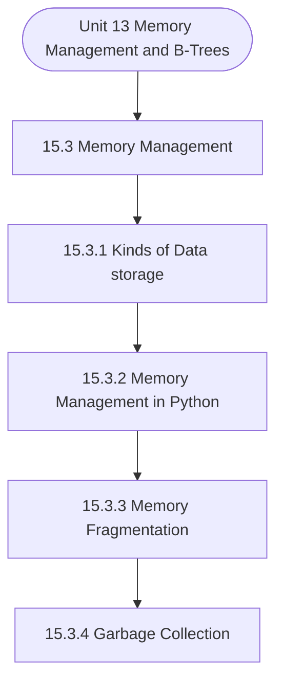

# MCS-063: Data Structures using Python
## Unit 13: Memory Management and B-Trees

> 📚 **Programme:** M.Sc. (Data Science and Analytics) | **Semester:** Semester 1  
> ⏱️ **Estimated Study Time:** ~48 mins | 📄 **Textbook Pages:** 23 Pages  
> 📥 **Original PDF:** [Download & View Authentic Textbook](../../../pdfs/Semester_1/MCS-063_Data_Structures_using_Python/Unit-15_Memory_Management_and_B-Trees.pdf)

---

### 🎯 Executive Concept & Data Science Relevance
In modern data systems, **Memory Management and B-Trees** forms a vital conceptual pillar. Algorithm efficiency governs data scale. In large-scale data engineering, choosing between $O(n \log n)$ mergesort vs $O(n^2)$ bubblesort, or an $O(1)$ hash table lookup vs $O(n)$ linear scan, determines whether a pipeline finishes in seconds or hours.

> [!NOTE]
> **Why this matters for your career:** Mastering memory management and b-trees equips you with the foundational principles required to reason mathematically about high-dimensional datasets, evaluate algorithm performance, and avoid statistical pitfalls in production machine learning pipelines.

### 🗺️ Visual Knowledge Architecture
The following concept map illustrates the structural hierarchy and learning trajectory of this module:



### 📖 Core Definitions & Terminology Cards

> 📌 **Big-O Notation $O(g(n))$**  
> - **Formal Definition:** Asymptotic upper bound: $f(n) = O(g(n))$ if $\exists c > 0, n_0 > 0$ such that $0 \le f(n) \le c \cdot g(n), \forall n \ge n_0$. Describes worst-case growth rate.  
> - 💡 **Practical Intuition & Analogy:** *The performance guarantee: execution time will not grow faster than this bound.*

> 📌 **Hash Table & Load Factor $\alpha$**  
> - **Formal Definition:** Data structure mapping keys to bucket indices using a hash function $h(k)$. Load factor $\alpha = n/m$ where $n$ is stored elements and $m$ is table capacity. Average lookup is $O(1)$.  
> - 💡 **Practical Intuition & Analogy:** *Instant dictionary key-value lookup in Python.*

> 📌 **Binary Search Tree (BST) & AVL Balance Factor**  
> - **Formal Definition:** A tree where for every node, left sub-tree values are smaller and right sub-tree values are larger. In AVL trees, Balance Factor $BF = h_L - h_R \in \lbrace -1, 0, 1 \rbrace$, maintaining $O(\log n)$ bounds via rotations.  
> - 💡 **Practical Intuition & Analogy:** *A self-balancing search index that guarantees rapid logarithmic lookups.*

### ⚡ Governing Mathematical Laws & Formula Cheatsheet
#### 🔹 Master Theorem for Divide-and-Conquer Recurrences
$$
\begin{aligned} & T(n) = aT(n/b) + \Theta(n^d) \\ & \implies T(n) = \begin{cases} \Theta(n^{\log_b a}) & \text{if } d < \log_b a \\ \Theta(n^d \log n) & \text{if } d = \log_b a \\ \Theta(n^d) & \text{if } d > \log_b a \end{cases} \end{aligned}
$$
- **Explanation:** Solves common divide-and-conquer recurrences like Mergesort ( $T(n) = 2T(n/2) + O(n) \implies O(n \log n)$ ).

#### 🔹 Binary Heap Array Index Formulas
$$
\text{Parent}(i) = \lfloor (i - 1)/2 \rfloor, \; \text{Left}(i) = 2i + 1, \; \text{Right}(i) = 2i + 2
$$
- **Explanation:** Enables cache-friendly representation of complete binary trees directly within flat linear arrays.

#### 🔹 Comparison Sort Lower Bound
$$
\Omega(n \log n) \quad \text{for comparison-based sorting algorithms}
$$
- **Explanation:** Information-theoretic lower bound: reaching $n!$ leaf permutations requires a decision tree of minimum depth $\log_2(n!) = \Omega(n \log n)$.

### ⚖️ Axiomatic Properties & Governing Laws
The mathematical formulations of this module are anchored by foundational algebraic and structural laws:

- **AVL Height Bound:** $h < 1.44 \log_2(n + 2) \implies O(\log n) \text{ worst-case search}$
- **Hash Table Amortized Bound:** $O(1) \text{ lookup when } \alpha = n/m < 0.75$
- **Comparison Lower Bound:** $\Omega(n \log n) \text{ for comparison sorts}$

### 📌 Comprehensive Section-by-Section Study Breakdown
#### `15.3` Memory Management
##### 📘 Theoretical Principles & In-Depth Exposition
Python uses an automatic memory-management system that handles allocation and deallocation. The main components are: 1. Memory Heap or Python Heap: In Python, all objects are created and stored in a common memory area known as the Python heap. Whenever a statement such as w = Widget ().

s executed—where Widget represents a user-defined class—a new object of that class is dynamically created and allocated space within the heap memory. The responsibility for requesting memory from the operating system, allocating space for objects, and efficiently managing the Python heap during program execution lies entirely with the Python interpreter.

This automatic memory management allows programmers to focus on program logic rather than low-level memory handling. Memory Manager: Memory Manager controls the allocation and release of memory blocks within the heap. This can be done with the help of Memory Fragmentation techniques.

##### ⚙️ Mathematical & Algorithmic Mechanics
- **Formal Mechanics:** Establishes symbolic transformations and state invariants governing memory management.
- **Boundary Invariants:** Ensures robust error-handling, non-empty set guarantees, and strict asymptotic bounds.

##### 📊 Practical Data Science & Production Relevance
- **Industry Application:** Directly implemented in production workflows such as SQL query filters, pandas vectorized operations, and feature transformation pipelines.
- **Production Pitfall:** Failing to verify membership bounds or missing edge cases in memory management can cause silent data corruption or performance bottlenecks.

> [!TIP]
> **Key Exam & Technical Interview Takeaway:** Be prepared to define memory management formally, cite its core mathematical invariants, and solve step-by-step numerical/proof questions.

#### `15.3.1` Kinds of Data storage
##### 📘 Theoretical Principles & In-Depth Exposition
The section on **Kinds of Data storage** establishes rigorous theoretical foundations necessary for advanced computational modeling. It introduces formal mathematical structures and symbolic notations that guarantee consistency across proofs and algorithms.

In the broader scope of **Memory Management and B-Trees**, understanding kinds of data storage is essential to formalizing data representations, verifying boundary constraints, and ensuring computational determinism across multidimensional feature spaces.

##### ⚙️ Mathematical & Algorithmic Mechanics
- **Formal Mechanics:** Establishes symbolic transformations and state invariants governing kinds of data storage.
- **Boundary Invariants:** Ensures robust error-handling, non-empty set guarantees, and strict asymptotic bounds.

##### 📊 Practical Data Science & Production Relevance
- **Industry Application:** Directly implemented in production workflows such as SQL query filters, pandas vectorized operations, and feature transformation pipelines.
- **Production Pitfall:** Failing to verify membership bounds or missing edge cases in kinds of data storage can cause silent data corruption or performance bottlenecks.

> [!TIP]
> **Key Exam & Technical Interview Takeaway:** Be prepared to define kinds of data storage formally, cite its core mathematical invariants, and solve step-by-step numerical/proof questions.

#### `15.3.2` Memory Management in Python
##### 📘 Theoretical Principles & In-Depth Exposition
Python uses an automatic memory-management system that handles allocation and deallocation. The main components are: 1. Memory Heap or Python Heap: In Python, all objects are created and stored in a common memory area known as the Python heap. Whenever a statement such as w = Widget ().

s executed—where Widget represents a user-defined class—a new object of that class is dynamically created and allocated space within the heap memory. The responsibility for requesting memory from the operating system, allocating space for objects, and efficiently managing the Python heap during program execution lies entirely with the Python interpreter.

This automatic memory management allows programmers to focus on program logic rather than low-level memory handling. Memory Manager: Memory Manager controls the allocation and release of memory blocks within the heap. This can be done with the help of Memory Fragmentation techniques.

##### ⚙️ Mathematical & Algorithmic Mechanics
- **Formal Mechanics:** Establishes symbolic transformations and state invariants governing memory management in python.
- **Boundary Invariants:** Ensures robust error-handling, non-empty set guarantees, and strict asymptotic bounds.

##### 📊 Practical Data Science & Production Relevance
- **Industry Application:** Directly implemented in production workflows such as SQL query filters, pandas vectorized operations, and feature transformation pipelines.
- **Production Pitfall:** Failing to verify membership bounds or missing edge cases in memory management in python can cause silent data corruption or performance bottlenecks.

> [!TIP]
> **Key Exam & Technical Interview Takeaway:** Be prepared to define memory management in python formally, cite its core mathematical invariants, and solve step-by-step numerical/proof questions.

#### `15.3.3` Memory Fragmentation
##### 📘 Theoretical Principles & In-Depth Exposition
In heap-based memory allocation, the available memory is organized into contiguous blocks and managed using a linked list structure known as the free list. As memory blocks are repeatedly allocated and released, the pattern of free space continuously changes, causing the unused memory to be split into disjoint holes separated by allocated regions.

This breaking up of free memory into separate holes is referred to as memory fragmentation. Fragmentation is of two types: internal fragmentation, which occurs when allocated memory contains unused space because the reserved block is larger than the actual requirement, and external fragmentation, which occurs when free memory is scattered into many small non-contiguous blocks across the heap, making large memory allocations difficult.

In figure1(a), it shows that allocated space to Process, P1 is 500 MB, But P1 utilizes only 25 MB Space and other space is wasted, cannot be used by another process. Figure 1(b) shows that if a process need 500MB, but this space is available but not as a continuous memory space. Memory Management and B-Trees In Python, fragmentation mainly arises due to frequent creation and deletion of objects, variable object sizes, and the dynamic resizing of data structures such as lists and dictionaries.

##### ⚙️ Mathematical & Algorithmic Mechanics
- **Formal Mechanics:** Establishes symbolic transformations and state invariants governing memory fragmentation.
- **Boundary Invariants:** Ensures robust error-handling, non-empty set guarantees, and strict asymptotic bounds.

##### 📊 Practical Data Science & Production Relevance
- **Industry Application:** Directly implemented in production workflows such as SQL query filters, pandas vectorized operations, and feature transformation pipelines.
- **Production Pitfall:** Failing to verify membership bounds or missing edge cases in memory fragmentation can cause silent data corruption or performance bottlenecks.

> [!TIP]
> **Key Exam & Technical Interview Takeaway:** Be prepared to define memory fragmentation formally, cite its core mathematical invariants, and solve step-by-step numerical/proof questions.

#### `15.3.4` Garbage Collection
##### 📘 Theoretical Principles & In-Depth Exposition
In programming languages such as C and C++, the responsibility of explicitly releasing memory occupied by objects lies with the programmer. This task is often neglected by beginners and can lead to serious memory-related errors, such as memory leaks and dangling pointers, even in the hands of experienced developers.

In contrast, the designers of Python shifted the entire responsibility of memory management to the Python interpreter. The automatic process through which unused or “stale” objects are identified, the memory occupied by them is released, and the reclaimed space is returned to the free list is known as garbage collection.

To enable automatic garbage collection, the system must first be able to identify those objects that are no longer needed. Since the Python interpreter cannot practically examine the full logical meaning of an arbitrary program, it applies a conservative reference-based rule to determine whether an object can be reclaimed.

##### ⚙️ Mathematical & Algorithmic Mechanics
- **Formal Mechanics:** Establishes symbolic transformations and state invariants governing garbage collection.
- **Boundary Invariants:** Ensures robust error-handling, non-empty set guarantees, and strict asymptotic bounds.

##### 📊 Practical Data Science & Production Relevance
- **Industry Application:** Directly implemented in production workflows such as SQL query filters, pandas vectorized operations, and feature transformation pipelines.
- **Production Pitfall:** Failing to verify membership bounds or missing edge cases in garbage collection can cause silent data corruption or performance bottlenecks.

> [!TIP]
> **Key Exam & Technical Interview Takeaway:** Be prepared to define garbage collection formally, cite its core mathematical invariants, and solve step-by-step numerical/proof questions.

#### `15.3.5` Reference Counting and Cycle Detection
##### 📘 Theoretical Principles & In-Depth Exposition
Each Python object maintains an integer known as its reference count, which indicates the total number of references to that object currently present in the system. Python relies primarily on this reference-counting mechanism to manage object lifetimes. The reference count is increased whenever a new reference to the object is created and decreased whenever an existing reference is redirected to another object.

When an object’s reference count reaches zero, the object is no longer considered live, and the memory allocated to it is automatically reclaimed. Maintaining a reference count for each object requires only constant additional space, O(1), per object, and the operations of incrementing and decrementing this count also take constant time, O(1), per update.

The Python interpreter provides a way for a running program to inspect an object’s reference count through the sys module, which includes the function getrefcount( ). This function returns an integer value representing the current number of references to the object passed as its argument.

##### ⚙️ Mathematical & Algorithmic Mechanics
- **Formal Mechanics:** Establishes symbolic transformations and state invariants governing reference counting and cycle detection.
- **Boundary Invariants:** Ensures robust error-handling, non-empty set guarantees, and strict asymptotic bounds.

##### 📊 Practical Data Science & Production Relevance
- **Industry Application:** Directly implemented in production workflows such as SQL query filters, pandas vectorized operations, and feature transformation pipelines.
- **Production Pitfall:** Failing to verify membership bounds or missing edge cases in reference counting and cycle detection can cause silent data corruption or performance bottlenecks.

> [!TIP]
> **Key Exam & Technical Interview Takeaway:** Be prepared to define reference counting and cycle detection formally, cite its core mathematical invariants, and solve step-by-step numerical/proof questions.

#### `15.4` Memory Hierarchies and Caching
##### 📘 Theoretical Principles & In-Depth Exposition
With the widespread adoption of compu software applications are required to han applications include online financial transa maintenance, and the analysis of custome many of these cases, the volume of data is often depends more on the time required t speed of the CPU.

##### ⚙️ Mathematical & Algorithmic Mechanics
- **Formal Mechanics:** Establishes symbolic transformations and state invariants governing memory hierarchies and caching.
- **Boundary Invariants:** Ensures robust error-handling, non-empty set guarantees, and strict asymptotic bounds.

##### 📊 Practical Data Science & Production Relevance
- **Industry Application:** Directly implemented in production workflows such as SQL query filters, pandas vectorized operations, and feature transformation pipelines.
- **Production Pitfall:** Failing to verify membership bounds or missing edge cases in memory hierarchies and caching can cause silent data corruption or performance bottlenecks.

> [!TIP]
> **Key Exam & Technical Interview Takeaway:** Be prepared to define memory hierarchies and caching formally, cite its core mathematical invariants, and solve step-by-step numerical/proof questions.

#### `15.4.1` The Memory Hierarchy
##### 📘 Theoretical Principles & In-Depth Exposition
Memory Hierarchy is the structured arran significantly in speed, capacity, cost, and this hierarchy is to provide the illusion system, even though physical limitations p having all three characteristics simultaneou Figure15. A view of memory hierarchy is shown in F 1.Registers: They are the nearest to the C operations.

Their access to CPU is faste expensive. 2.Cache – Small, high-speed memory loc access time for frequently used data. 3.Internal Memory (RAM) – It has a medi than register and cache memory. It is used 4.External Memory: They are the second long-term data retention but with slow acc or decreased based upon the requirement.

And Caching uting across all sectors of society, modern ndle extremely large volumes of data. Such action processing, database organization and ers’ purchasing behavior and preferences. In s so high that the overall system performance to access the data than on the raw processing ngement of various storage types that differ proximity to the CPU.

##### ⚙️ Mathematical & Algorithmic Mechanics
- **Formal Mechanics:** Establishes symbolic transformations and state invariants governing the memory hierarchy.
- **Boundary Invariants:** Ensures robust error-handling, non-empty set guarantees, and strict asymptotic bounds.

##### 📊 Practical Data Science & Production Relevance
- **Industry Application:** Directly implemented in production workflows such as SQL query filters, pandas vectorized operations, and feature transformation pipelines.
- **Production Pitfall:** Failing to verify membership bounds or missing edge cases in the memory hierarchy can cause silent data corruption or performance bottlenecks.

> [!TIP]
> **Key Exam & Technical Interview Takeaway:** Be prepared to define the memory hierarchy formally, cite its core mathematical invariants, and solve step-by-step numerical/proof questions.

### 📐 Step-by-Step Solved Mathematical Examples
To solidify your theoretical understanding, work through these fully solved, step-by-step mathematical problems:

#### 🧮 Example 1: Solving Recurrence via Master Theorem
> **Problem Statement:**  
> Solve the recurrence relation $T(n) = 2T(n/2) + n$ modeling Mergesort.

**Detailed Step-by-Step Solution:**

1. **Identify parameters:** $a = 2, \; b = 2, \; f(n) = n = \Theta(n^1) \implies d = 1$.
2. **Compare $\log_b a$ and $d$:**
$$
\log_b a = \log_2 2 = 1
$$
Since $d = \log_b a = 1$, Case 2 of the Master Theorem applies.

3. **Conclusion:**
$$
T(n) = \Theta(n^d \log n) = \Theta(n \log n)
$$

#### 🧮 Example 2: AVL Tree Rotation Sequence
> **Problem Statement:**  
> An empty AVL tree receives sequential insertions: 10, 20, 30. Trace the balance factors and demonstrate the required rotation.

**Detailed Step-by-Step Solution:**

1. Insert 10: $BF = 0$.
2. Insert 20: 10 has $BF = -1$, 20 has $BF = 0$.
3. Insert 30: Node 10 has left height 0, right height 2 $\implies BF(10) = -2$ (Unbalanced: Right-Right condition).
4. **Apply Single Left Rotation on Node 10:**
- Node 20 becomes new root.
- Node 10 becomes left child of 20.
- Node 30 remains right child of 20.
New Balance Factors: $BF(20) = 0, \; BF(10) = 0, \; BF(30) = 0$. Tree balanced.

### 💻 Practical Data Science Implementation (Python)
Theory translates directly into production algorithms. Below is a self-contained, commented Python implementation illustrating the core operations of this unit:

```python
# Custom Hash Map with Collision Chaining
class SimpleHashMap:
    def __init__(self, capacity=8):
        self.capacity = capacity
        self.buckets = [[] for _ in range(capacity)]

    def _hash(self, key):
        return hash(key) % self.capacity

    def put(self, key, value):
        b_idx = self._hash(key)
        for i, (k, v) in enumerate(self.buckets[b_idx]):
            if k == key:
                self.buckets[b_idx][i] = (key, value)
                return
        self.buckets[b_idx].append((key, value))

    def get(self, key):
        b_idx = self._hash(key)
        for k, v in self.buckets[b_idx]:
            if k == key:
                return v
        return None

hm = SimpleHashMap()
hm.put("user_101", {"name": "Alice", "role": "Data Scientist"})
hm.put("user_102", {"name": "Bob", "role": "ML Engineer"})
print("Lookup user_101:", hm.get("user_101"))
```

### 💡 Interactive Self-Assessment Checkpoints
Test your comprehension before proceeding. Tap each question to reveal the comprehensive explanation:

<details>
<summary><b>Checkpoint 1:</b> What is the worst-case and average-case time complexity of Quicksort? <i>(Tap to reveal answer)</i></summary>

> **Answer & Analysis:**  
> Average case: $O(n \log n)$. Worst case: $O(n^2)$ (occurs when the pivot chosen is always the extreme minimum or maximum in already sorted arrays).
</details>

<details>
<summary><b>Checkpoint 2:</b> How does an AVL tree restore balance after an insertion? <i>(Tap to reveal answer)</i></summary>

> **Answer & Analysis:**  
> By computing the Balance Factor ( $h_L - h_R$ ) and applying tree rotations: Left-Left (Single Right Rotation), Right-Right (Single Left Rotation), Left-Right (Double Rotation), or Right-Left (Double Rotation).
</details>

<details>
<summary><b>Checkpoint 3:</b> What is the average lookup time in a Hash Table? <i>(Tap to reveal answer)</i></summary>

> **Answer & Analysis:**  
> $O(1)$ constant time, assuming a uniform hash distribution and reasonable load factor.
</details>

<details>
<summary><b>Checkpoint 4:</b> What is the role of the garbage collector in Python? <i>(Tap to reveal answer)</i></summary>

> **Answer & Analysis:**  
> This question tests your conceptual mastery of Memory Management and B-Trees. Review the governing formulas and section breakdowns above to formulate a complete, rigorous proof or derivation.
</details>

<details>
<summary><b>Checkpoint 5:</b> How does caching improve performance? <i>(Tap to reveal answer)</i></summary>

> **Answer & Analysis:**  
> This question tests your conceptual mastery of Memory Management and B-Trees. Review the governing formulas and section breakdowns above to formulate a complete, rigorous proof or derivation.
</details>

<details>
<summary><b>Checkpoint 6:</b> Why is memory management important? <i>(Tap to reveal answer)</i></summary>

> **Answer & Analysis:**  
> This question tests your conceptual mastery of Memory Management and B-Trees. Review the governing formulas and section breakdowns above to formulate a complete, rigorous proof or derivation.
</details>

### 🎯 Executive Module Wrap-Up
- **Central Idea:** Memory Management and B-Trees provides essential mathematical and algorithmic tools directly utilized in Data Science.
- **Mathematical Rigor:** Formulas and laws must be memorized with attention to boundary conditions and assumptions.
- **Full Textbook Coverage:** For exhaustive multi-page derivations, proofs, and supplementary exercises, consult the [Authentic IGNOU Textbook](../../../pdfs/Semester_1/MCS-063_Data_Structures_using_Python/Unit-15_Memory_Management_and_B-Trees.pdf).

---
### 🧭 Navigation & Syllabus Index
[⬅ Previous: Unit 12](unit_12_Text_Processing.md) | [📑 Course Index](README.md)
