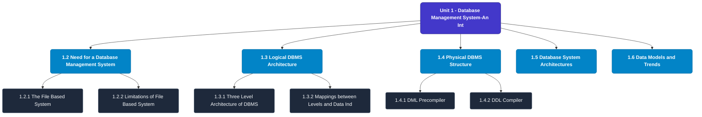

# MCS-207: Database Management Systems
## Unit 1: Database Management System-An Introduction

> 📚 **Programme:** M.Sc. (Data Science and Analytics) | **Semester:** Semester 1  
> ⏱️ **Estimated Study Time:** ~40 mins | 📄 **Textbook Pages:** 18 Pages  
> 📥 **Original PDF:** [Download & View Textbook](../../../pdfs/Semester_1/MCS-207_Database_Management_Systems/Unit-1_Database_Management_System-An_Introduction.pdf)

---

### 🎯 Executive Concept & Data Science Relevance
In modern data systems, **Database Management System-An Introduction** forms a vital conceptual pillar. Relational algebra and SQL form the query engine of every data warehouse (Snowflake, BigQuery, Postgres). Concurrency protocols and normalization ensure data integrity and ACID consistency across concurrent transaction streams.

> [!NOTE]
> **Why this matters for your career:** Mastering database management system-an introduction equips you with the foundational principles required to reason mathematically about high-dimensional datasets, evaluate algorithm performance, and avoid statistical pitfalls in production machine learning pipelines.

### 🗺️ Visual Knowledge Architecture
The following concept map illustrates the structural hierarchy and learning trajectory of this module:

### 📖 Core Definitions & Terminology Cards
| Term | Formal Mathematical / Technical Definition | Intuitive Analogy / Concrete Example |
| :--- | :--- | :--- |
| **Relational Algebra** | A procedural query language consisting of a set of operations on relations: Select ($\sigma$), Project ($\pi$), Union ($\cup$), Set Difference ($-$), Cartesian Product ($\times$), and Join ($\bowtie$). | *The formal mathematical syntax executed behind SQL `SELECT` queries.* |
| **ACID Properties** | Atomicity (all or nothing), Consistency (preserves invariants), Isolation (concurrent execution equivalent to serial), Durability (committed data survives crashes). | *The financial transaction guarantee: money cannot disappear between debit and credit.* |
| **Functional Dependency $X \to Y$** | A constraint between two sets of attributes: for any two valid tuples $t_1, t_2$, if $t_1[X] = t_2[X]$, then $t_1[Y] = t_2[Y]$. Value of $X$ uniquely determines $Y$. | *`StudentID` uniquely determines `StudentName`.* |
| **Third Normal Form (3NF) & BCNF** | A relation is in 3NF if for every non-trivial $X \to Y$, either $X$ is a superkey or $Y$ is a prime attribute. It is in BCNF if $X$ is strictly a superkey. | *Eliminates transitive dependencies so data is stored in exactly one canonical place without update anomalies.* |

### ⚡ Governing Mathematical Laws & Formula Cheatsheet
#### 🔹 Relational Algebra Selection & Projection
$$\sigma_{\text{condition}}(R) \quad \text{and} \quad \pi_{\text{attributes}}(R)$$
- **Explanation:** $\sigma$ filters rows (equivalent to SQL `WHERE`), while $\pi$ selects specific columns (equivalent to SQL `SELECT column_list`).

#### 🔹 Relational Natural Join
$$R \bowtie S = \pi_{\text{Attr}(R) \cup \text{Attr}(S)}(\sigma_{R.A_1 = S.A_1 \land \dots}(R \times S))$$
- **Explanation:** Performs equality join across all identically named attributes between two tables.

#### 🔹 Two-Phase Locking (2PL) Theorem
$$\text{Growing Phase: Only Acquire Locks} \implies \text{Shrinking Phase: Only Release Locks}$$
- **Explanation:** Guarantees conflict serializability of concurrent database schedules without data race anomalies.

### 📌 Detailed Section-by-Section Study Breakdown
#### `1.2` Need for a Database Management System
- **Core Concept:** Establishes rigorous theoretical formulations and computational bounds for need for a database management system.
- **Core Concept:** Applies standard algorithmic procedures and mathematical invariants relevant to database management system-an introduction.
- **Core Concept:** Ensures deterministic performance guarantees across high-dimensional feature spaces.
- **Data Science Application:** Provides foundational structures used directly in statistical modeling, query execution, and machine learning pipelines.

> [!TIP]
> **Exam & Interview Tip:** Be prepared to state the formal definition of need for a database management system and derive its primary equations step-by-step.

#### `1.2.1` The File Based System
- **Core Concept:** Establishes rigorous theoretical formulations and computational bounds for the file based system.
- **Core Concept:** Applies standard algorithmic procedures and mathematical invariants relevant to database management system-an introduction.
- **Core Concept:** Ensures deterministic performance guarantees across high-dimensional feature spaces.
- **Data Science Application:** Provides foundational structures used directly in statistical modeling, query execution, and machine learning pipelines.

> [!TIP]
> **Exam & Interview Tip:** Be prepared to state the formal definition of the file based system and derive its primary equations step-by-step.

#### `1.2.2` Limitations of File Based System
- **Core Concept:** File based systems required that several files should be opened for a particular system application.
- **Core Concept:** Several files may consist of duplicate data, which can result in several shortcomings.
- **Core Concept:** Some of these shortcomings are listed below: • Data isolation: Since the file system stores data in separate files, which may belong to different applications.
- **Data Science Application:** Provides foundational structures used directly in statistical modeling, query execution, and machine learning pipelines.

> [!TIP]
> **Exam & Interview Tip:** Be prepared to state the formal definition of limitations of file based system and derive its primary equations step-by-step.

#### `1.2.3` The Database Approach
- **Core Concept:** As discussed in the previous section, the file system has many weaknesses.
- **Core Concept:** Therefore, a new approach was proposed that eliminates the weaknesses of the file system.
- **Core Concept:** This approach, called the database approach, separated data from application programs.
- **Data Science Application:** Provides foundational structures used directly in statistical modeling, query execution, and machine learning pipelines.

> [!TIP]
> **Exam & Interview Tip:** Be prepared to state the formal definition of the database approach and derive its primary equations step-by-step.

#### `1.3` Logical DBMS Architecture
- **Core Concept:** As discussed in the previous section that most of the advantages of database systems are because of the creation of DBMS software.
- **Core Concept:** DBMSs must support many services and therefore are complex in nature.
- **Core Concept:** In addition, DBMSs are also required to store, manipulate and control a very large amount of data in a reliable manner.
- **Data Science Application:** Provides foundational structures used directly in statistical modeling, query execution, and machine learning pipelines.

> [!TIP]
> **Exam & Interview Tip:** Be prepared to state the formal definition of logical dbms architecture and derive its primary equations step-by-step.

#### `1.3.1` Three Level Architecture of DBMS
- **Core Concept:** The three-level database architecture of a database defines the three different levels of abstraction of data for different types of users of the database.
- **Core Concept:** The proposed architecture was designed and standardised by the American National Standards Institute (ANSI) and is also known as ANSI/SPARC architecture.
- **Core Concept:** As per this architecture, a database schema can be visualised at three different levels.
- **Data Science Application:** Provides foundational structures used directly in statistical modeling, query execution, and machine learning pipelines.

> [!TIP]
> **Exam & Interview Tip:** Be prepared to state the formal definition of three level architecture of dbms and derive its primary equations step-by-step.

### 💡 Interactive Self-Assessment Checkpoints
Test your comprehension before proceeding. Tap each question to reveal the comprehensive explanation:

<b>Checkpoint 1:</b> What does ACID stand for in database management? <i>(Tap to reveal answer)</i>

> **Answer & Analysis:**  
> Atomicity, Consistency, Isolation, and Durability.

<b>Checkpoint 2:</b> What is the difference between 3NF and BCNF? <i>(Tap to reveal answer)</i>

> **Answer & Analysis:**  
> In 3NF, for any non-trivial $X \to Y$, $X$ must be a superkey OR $Y$ must be a prime attribute. In BCNF (Boyce-Codd Normal Form), $X$ MUST strictly be a superkey (eliminating all dependencies on prime attributes).

<b>Checkpoint 3:</b> What is the relational algebra symbol for row selection and column projection? <i>(Tap to reveal answer)</i>

> **Answer & Analysis:**  
> Row selection: $\sigma$ (Sigma). Column projection: $\pi$ (Pi).

<b>Checkpoint 4:</b> What is a DBMS? ……………………………………………………………………………. ……………………………………………………………………………. <i>(Tap to reveal answer)</i>

> **Answer & Analysis:**  
> This question tests your conceptual mastery of Database Management System-An Introduction. Review the governing formulas and section breakdowns above to formulate a complete, rigorous proof or derivation.

<b>Checkpoint 5:</b> What are the advantages of a DBMS? ……………………………………………………………………………. …………………………………………………………………………….. <i>(Tap to reveal answer)</i>

> **Answer & Analysis:**  
> This question tests your conceptual mastery of Database Management System-An Introduction. Review the governing formulas and section breakdowns above to formulate a complete, rigorous proof or derivation.

<b>Checkpoint 6:</b> Compare and contrast the traditional File based system with Database approach. ……………………………………………………………………………. …………………………………………………………………………….. <i>(Tap to reveal answer)</i>

> **Answer & Analysis:**  
> This question tests your conceptual mastery of Database Management System-An Introduction. Review the governing formulas and section breakdowns above to formulate a complete, rigorous proof or derivation.

### 🎯 Executive Module Wrap-Up
- **Central Idea:** Database Management System-An Introduction provides essential mathematical and algorithmic tools directly utilized in Data Science.
- **Mathematical Rigor:** Formulas and laws must be memorized with attention to boundary conditions and assumptions.
- **Full Textbook Coverage:** For exhaustive multi-page derivations, proofs, and supplementary exercises, consult the [Authentic IGNOU Textbook](../../../pdfs/Semester_1/MCS-207_Database_Management_Systems/Unit-1_Database_Management_System-An_Introduction.pdf).

---
### 🧭 Navigation & Syllabus Index
[📑 Course Index](README.md) | [Next: Unit 2 ➡](unit_02_Relational_Database.md)
