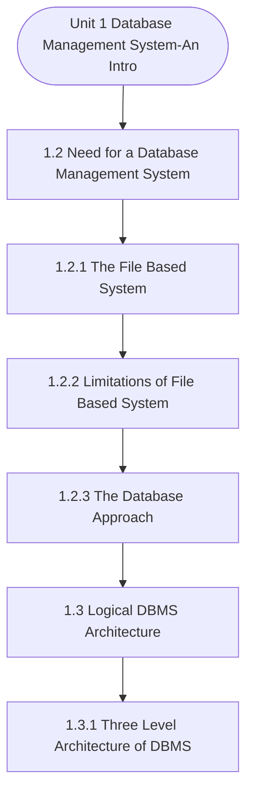

# MCS-207: Database Management Systems
## Unit 1: Database Management System-An Introduction

> 📚 **Programme:** M.Sc. (Data Science and Analytics) | **Semester:** Semester 1  
> ⏱️ **Estimated Study Time:** ~40 mins | 📄 **Textbook Pages:** 18 Pages  
> 📥 **Original PDF:** [Download & View Authentic Textbook](../../../pdfs/Semester_1/MCS-207_Database_Management_Systems/Unit-1_Database_Management_System-An_Introduction.pdf)

---

### 🎯 Executive Concept & Data Science Relevance
In modern data systems and advanced analytics, **Database Management System-An Introduction** forms a vital conceptual pillar. Relational algebra and SQL form the query engine of every data warehouse (Snowflake, BigQuery, Postgres). Concurrency protocols and normalization ensure data integrity and ACID consistency across concurrent transaction streams.

> [!NOTE]
> **Why this matters for your career:** Mastering database management system-an introduction equips you with the foundational principles required to reason mathematically about high-dimensional datasets, evaluate algorithm performance, and avoid statistical pitfalls in production machine learning pipelines.

### 🗺️ Visual Knowledge Architecture
The following concept map illustrates the structural hierarchy and learning trajectory of this module:



### 📖 Core Definitions & Terminology Cards

> 📌 **Relational Algebra**  
> - **Formal Definition:** A procedural query language consisting of a set of operations on relations: Select ( $\sigma$ ), Project ( $\pi$ ), Union ( $\cup$ ), Set Difference ( $-$ ), Cartesian Product ( $\times$ ), and Join ( $\bowtie$ ).  
> - 💡 **Practical Intuition & Analogy:** *The formal mathematical syntax executed behind SQL `SELECT` queries.*

> 📌 **ACID Properties**  
> - **Formal Definition:** Atomicity (all or nothing), Consistency (preserves invariants), Isolation (concurrent execution equivalent to serial), Durability (committed data survives crashes).  
> - 💡 **Practical Intuition & Analogy:** *The financial transaction guarantee: money cannot disappear between debit and credit.*

> 📌 **Functional Dependency $X \to Y$**  
> - **Formal Definition:** A constraint between two sets of attributes: for any two valid tuples $t_1, t_2$, if $t_1[X] = t_2[X]$, then $t_1[Y] = t_2[Y]$. Value of $X$ uniquely determines $Y$.  
> - 💡 **Practical Intuition & Analogy:** *`StudentID` uniquely determines `StudentName`.*

> 📌 **Third Normal Form (3NF) & BCNF**  
> - **Formal Definition:** A relation is in 3NF if for every non-trivial $X \to Y$, either $X$ is a superkey or $Y$ is a prime attribute. It is in BCNF if $X$ is strictly a superkey.  
> - 💡 **Practical Intuition & Analogy:** *Eliminates transitive dependencies so data is stored in exactly one canonical place without update anomalies.*

### ⚡ Governing Mathematical Laws & Formula Cheatsheet
#### 🔹 Relational Algebra Selection & Projection
$$
\sigma_{\text{condition}}(R) \quad \text{and} \quad \pi_{\text{attributes}}(R)
$$
- **Explanation:** $\sigma$ filters rows (equivalent to SQL `WHERE`), while $\pi$ selects specific columns (equivalent to SQL `SELECT column_list`).

#### 🔹 Relational Natural Join
$$
R \bowtie S = \pi_{\mathcal{A}(R) \cup \mathcal{A}(S)}\left(\sigma_{\text{match}}(R \times S)\right)
$$
- **Explanation:** Performs equality join across all identically named attributes between two tables.

#### 🔹 Two-Phase Locking (2PL) Theorem
$$
\text{Growing Phase: Only Acquire Locks} \implies \text{Shrinking Phase: Only Release Locks}
$$
- **Explanation:** Guarantees conflict serializability of concurrent database schedules without data race anomalies.

### ⚖️ Axiomatic Properties & Governing Laws
The mathematical formulations of this module are anchored by foundational algebraic and structural laws:

- **Armstrong's Reflexivity:** $Y \subseteq X \implies X \to Y$
- **Armstrong's Augmentation:** $X \to Y \implies XZ \to YZ$
- **Armstrong's Transitivity:** $X \to Y \land Y \to Z \implies X \to Z$

### 📌 Comprehensive Section-by-Section Study Breakdown
#### `1.2` Need for a Database Management System

##### 📘 Theoretical Principles & Pedagogical Exposition
File based systems required that several files should be opened for a particular system application. Several files may consist of duplicate data, which can result in several shortcomings. Some of these shortcomings are listed below: • Data isolation: Since the file system stores data in separate files, which may belong to different applications.

These files are not accessible to other applications and are difficult to share, especially when an application needs to use more than one file. Also, as the number of files can be very large for such systems, therefore, it would be difficult to search the relevant data from these files.

• Data Duplication: As stated earlier, a file system has different files for different applications, which may have overlapping data requirements. This will result in duplication of data, which can result in inconsistent data when duplicate data is updated. In addition, data duplication can also result in waste of storage.


##### ⚙️ Mathematical & Algorithmic Mechanics
- **Core Mechanism:** Organizes data into mathematical relations with schema constraints. Normalization (1NF $\to$ 2NF $\to$ 3NF $\to$ BCNF) decomposes relations using functional dependencies $X \to Y$ to eliminate insertion, update, and deletion anomalies. ACID guarantees are enforced via Two-Phase Locking (2PL) and Write-Ahead Logging (WAL).
- **Boundary Conditions:** NULL values violating primary key Entity Integrity, dangling foreign key references violating Referential Integrity, lossy table decompositions, and deadlocks in concurrent schedules.

##### 📊 Practical Data Science & Production Relevance
- **Production Workflow:** Production OLTP database schemas, enterprise data warehouse dimensional modeling, SQL query optimizer explain plans, and microservice distributed transactions.
- **Real-World Pitfall:** Over-normalizing analytical (OLAP) schemas causing costly multi-table joins, or selecting inappropriate transaction isolation levels leading to dirty or phantom reads.

> [!TIP]
> **Exam & Technical Interview Insight:** Determine candidate keys using attribute closures $X^+$; test whether a table satisfies 3NF or BCNF; verify lossless join and dependency preservation.

#### `1.2.1` The File Based System

##### 📘 Theoretical Principles & Pedagogical Exposition
In database architecture, **The File Based System** formalizes data persistence, relational integrity, and schema normalization. Within **Database Management System-An Introduction**, this section establishes formal guarantees that prevent data anomalies (insertion, update, and deletion anomalies) while ensuring ACID transaction compliance.

By anchoring schemas to mathematical relations, query optimizers can rewrite declarative SQL queries into optimal relational algebra execution trees without altering the result set.

##### ⚙️ Mathematical & Algorithmic Mechanics
- **Core Mechanism:** Organizes data into mathematical relations with schema constraints. Normalization (1NF $\to$ 2NF $\to$ 3NF $\to$ BCNF) decomposes relations using functional dependencies $X \to Y$ to eliminate insertion, update, and deletion anomalies. ACID guarantees are enforced via Two-Phase Locking (2PL) and Write-Ahead Logging (WAL).
- **Boundary Conditions:** NULL values violating primary key Entity Integrity, dangling foreign key references violating Referential Integrity, lossy table decompositions, and deadlocks in concurrent schedules.

##### 📊 Practical Data Science & Production Relevance
- **Production Workflow:** Production OLTP database schemas, enterprise data warehouse dimensional modeling, SQL query optimizer explain plans, and microservice distributed transactions.
- **Real-World Pitfall:** Over-normalizing analytical (OLAP) schemas causing costly multi-table joins, or selecting inappropriate transaction isolation levels leading to dirty or phantom reads.

> [!TIP]
> **Exam & Technical Interview Insight:** Determine candidate keys using attribute closures $X^+$; test whether a table satisfies 3NF or BCNF; verify lossless join and dependency preservation.

#### `1.2.2` Limitations of File Based System

##### 📘 Theoretical Principles & Pedagogical Exposition
File based systems required that several files should be opened for a particular system application. Several files may consist of duplicate data, which can result in several shortcomings. Some of these shortcomings are listed below: • Data isolation: Since the file system stores data in separate files, which may belong to different applications.

These files are not accessible to other applications and are difficult to share, especially when an application needs to use more than one file. Also, as the number of files can be very large for such systems, therefore, it would be difficult to search the relevant data from these files.

• Data Duplication: As stated earlier, a file system has different files for different applications, which may have overlapping data requirements. This will result in duplication of data, which can result in inconsistent data when duplicate data is updated. In addition, data duplication can also result in waste of storage.


##### ⚙️ Mathematical & Algorithmic Mechanics
- **Core Mechanism:** Derivatives compute instantaneous rates of change $f'(x) = \lim_{h \to 0} \frac{f(x+h) - f(x)}{h}$. Multivariable gradient vectors $\nabla f$ point in the direction of steepest ascent, with stationary critical points satisfying $\nabla f = 0$.
- **Boundary Conditions:** Discontinuities, non-differentiable sharp cusps (e.g. $|x|$ at $x=0$), vanishing gradients in saturating regions, and indefinite Hessian saddle points.

##### 📊 Practical Data Science & Production Relevance
- **Production Workflow:** Gradient descent parameter optimization $\theta_{t+1} = \theta_t - \eta \nabla L(\theta)$ across deep neural networks, backpropagation autograd engines, and marginal utility modeling.
- **Real-World Pitfall:** Selecting an overly aggressive learning rate $\eta$ causing objective divergence around sharp local minima, or getting trapped along flat plateau regions.

> [!TIP]
> **Exam & Technical Interview Insight:** Memorize the product rule, quotient rule, and multivariable chain rule; solve optimization problems by verifying local extrema using second derivative / Hessian tests.

#### `1.2.3` The Database Approach

##### 📘 Theoretical Principles & Pedagogical Exposition
As discussed in the previous section, the file system has many weaknesses. Therefore, a new approach was proposed that eliminates the weaknesses of the file system. This approach, called the database approach, separated data from application programs. The data in this approach is integrated from various applications and securely shared using a management system.

A database stores the integrated data of an organisation in a persistent manner. The following are some of the characteristics of the database approach: • The database can store data in a centralised database or a distributed database. • The data is managed by a database management system (DBMS) • It contains additional data about data, called metadata, which describes the structure and constraints on the stored data.

The metadata is stored in DBMS in a data dictionary or system catalog. • The database integrates the data of an organisation. This data is shared under the control of DBMS in a secure manner. • DBMS allows several basic operations related to data, such as creating a database structure, inserting and editing data in a database, enforcing security and constraints on data and allowing access to data to authorised users.


##### ⚙️ Mathematical & Algorithmic Mechanics
- **Core Mechanism:** Organizes data into mathematical relations with schema constraints. Normalization (1NF $\to$ 2NF $\to$ 3NF $\to$ BCNF) decomposes relations using functional dependencies $X \to Y$ to eliminate insertion, update, and deletion anomalies. ACID guarantees are enforced via Two-Phase Locking (2PL) and Write-Ahead Logging (WAL).
- **Boundary Conditions:** NULL values violating primary key Entity Integrity, dangling foreign key references violating Referential Integrity, lossy table decompositions, and deadlocks in concurrent schedules.

##### 📊 Practical Data Science & Production Relevance
- **Production Workflow:** Production OLTP database schemas, enterprise data warehouse dimensional modeling, SQL query optimizer explain plans, and microservice distributed transactions.
- **Real-World Pitfall:** Over-normalizing analytical (OLAP) schemas causing costly multi-table joins, or selecting inappropriate transaction isolation levels leading to dirty or phantom reads.

> [!TIP]
> **Exam & Technical Interview Insight:** Determine candidate keys using attribute closures $X^+$; test whether a table satisfies 3NF or BCNF; verify lossless join and dependency preservation.

#### `1.3` Logical DBMS Architecture

##### 📘 Theoretical Principles & Pedagogical Exposition
As discussed in the previous section that most of the advantages of database systems are because of the creation of DBMS software. DBMSs must support many services and therefore are complex in nature. In addition, DBMSs are also required to store, manipulate and control a very large amount of data in a reliable manner.

In this and subsequent section, we discuss the architecture of DBMS, which will help you with the processes and features of a DBMS. In this section, two different architectures, which deal with two different aspects of database management, are discussed. The first architecture is the logical architecture, Basic Concepts which defines the data organisation and access at different logical levels of a database.

The second architecture defines various components of a DBMS software. This architecture is referred to as physical database architecture.


##### ⚙️ Mathematical & Algorithmic Mechanics
- **Core Mechanism:** Organizes data into mathematical relations with schema constraints. Normalization (1NF $\to$ 2NF $\to$ 3NF $\to$ BCNF) decomposes relations using functional dependencies $X \to Y$ to eliminate insertion, update, and deletion anomalies. ACID guarantees are enforced via Two-Phase Locking (2PL) and Write-Ahead Logging (WAL).
- **Boundary Conditions:** NULL values violating primary key Entity Integrity, dangling foreign key references violating Referential Integrity, lossy table decompositions, and deadlocks in concurrent schedules.

##### 📊 Practical Data Science & Production Relevance
- **Production Workflow:** Production OLTP database schemas, enterprise data warehouse dimensional modeling, SQL query optimizer explain plans, and microservice distributed transactions.
- **Real-World Pitfall:** Over-normalizing analytical (OLAP) schemas causing costly multi-table joins, or selecting inappropriate transaction isolation levels leading to dirty or phantom reads.

> [!TIP]
> **Exam & Technical Interview Insight:** Determine candidate keys using attribute closures $X^+$; test whether a table satisfies 3NF or BCNF; verify lossless join and dependency preservation.

#### `1.3.1` Three Level Architecture of DBMS

##### 📘 Theoretical Principles & Pedagogical Exposition
The three-level database architecture of a database defines the three different levels of abstraction of data for different types of users of the database. The proposed architecture was designed and standardised by the American National Standards Institute (ANSI) and is also known as ANSI/SPARC architecture.

As per this architecture, a database schema can be visualised at three different levels. Figure 3 shows these three levels of this architecture. These levels are explained next. The External or View Level This level of abstraction provides a view of data for the users of a database system.

Typically, this abstraction is created based on access rights of the users. Different types of users can be allowed different external views of data, as shown in Figure 3. Users can have different views of data. This level hides the overall structure of a database system from external users.


##### ⚙️ Mathematical & Algorithmic Mechanics
- **Core Mechanism:** Organizes data into mathematical relations with schema constraints. Normalization (1NF $\to$ 2NF $\to$ 3NF $\to$ BCNF) decomposes relations using functional dependencies $X \to Y$ to eliminate insertion, update, and deletion anomalies. ACID guarantees are enforced via Two-Phase Locking (2PL) and Write-Ahead Logging (WAL).
- **Boundary Conditions:** NULL values violating primary key Entity Integrity, dangling foreign key references violating Referential Integrity, lossy table decompositions, and deadlocks in concurrent schedules.

##### 📊 Practical Data Science & Production Relevance
- **Production Workflow:** Production OLTP database schemas, enterprise data warehouse dimensional modeling, SQL query optimizer explain plans, and microservice distributed transactions.
- **Real-World Pitfall:** Over-normalizing analytical (OLAP) schemas causing costly multi-table joins, or selecting inappropriate transaction isolation levels leading to dirty or phantom reads.

> [!TIP]
> **Exam & Technical Interview Insight:** Determine candidate keys using attribute closures $X^+$; test whether a table satisfies 3NF or BCNF; verify lossless join and dependency preservation.

#### `1.3.2` Mappings between Levels and Data Independence

##### 📘 Theoretical Principles & Pedagogical Exposition
Independence The three level architecture defines a single database system across all the three levels. Therefore, different levels must map with each other. This mapping led to the concept of data independence, which was one of the major weaknesses in the file systems. This concept is explained next.

The first mapping is between the conceptual level and the external level. The external level is derived from the conceptual level. It is a part of the conceptual level, however, please note that these parts must be related else the database will lose database integrity. The advantage of this mapping is that an external user only needs to see the external level any change in the conceptual level will be hidden from the user.

For example, at the conceptual level, you may keep information about the name of a person using the data items like title, firstname and lastname. At the external level, you may just map it to a data item name field. Thus, there exists a mapping, which will map: name = title || firstname || lastname ( || is a concatenation operation) Suppose, at a later point you decide to add additional data item middlename in the conceptual level, then you just need to change your mapping and not the programs which are based on the external level.


##### ⚙️ Mathematical & Algorithmic Mechanics
- **Core Mechanism:** A function $f: A \to B$ maps each domain element to exactly one codomain element. Injections guarantee unique mappings ($f(a)=f(b) \implies a=b$); surjections cover the entire codomain; bijections admit two-sided inverses $f^{-1}: B \to A$.
- **Boundary Conditions:** Division by zero singularities, non-injective hash collisions in hash tables, and undefined out-of-domain evaluation.

##### 📊 Practical Data Science & Production Relevance
- **Production Workflow:** Feature transformations $X \mapsto \phi(X)$, hash functions in distributed partitions, non-linear activation functions (ReLU, Sigmoid, Softmax), and invertible normalizing flows.
- **Real-World Pitfall:** Applying inverse transformations to non-injective functions, creating multi-valued ambiguities or silent data destruction.

> [!TIP]
> **Exam & Technical Interview Insight:** In exams, demonstrate injectivity by showing $f(x_1) = f(x_2) \implies x_1 = x_2$, and surjectivity by expressing domain variable $x$ in terms of codomain target $y$.

#### `1.3.3` The Need of Three Level Architecture

##### 📘 Theoretical Principles & Pedagogical Exposition
Basic Concepts The three level architecture separates the data that is presented to the user from the data that is stored in the database physically. The basic objectives of three level architecture are: • It can support different views for different users. In case of change in any application, the views related to that application are required to change.

Thus, three level architecture ensures the independence of data and programs. • As stated above, due to independence of data and application programs, the applications need not deal with physical file organisation. Therefore, the application programs and users of a database are provided with a higher level of abstraction of data.

Thus, a user or application programs are not required to deal with conceptual schema and the physical schema of a database. In general, the Database Administrator (DBA) is responsible for creating and modifying the conceptual schema and physical schema using DDL.


##### ⚙️ Mathematical & Algorithmic Mechanics
- **Core Mechanism:** Organizes data into mathematical relations with schema constraints. Normalization (1NF $\to$ 2NF $\to$ 3NF $\to$ BCNF) decomposes relations using functional dependencies $X \to Y$ to eliminate insertion, update, and deletion anomalies. ACID guarantees are enforced via Two-Phase Locking (2PL) and Write-Ahead Logging (WAL).
- **Boundary Conditions:** NULL values violating primary key Entity Integrity, dangling foreign key references violating Referential Integrity, lossy table decompositions, and deadlocks in concurrent schedules.

##### 📊 Practical Data Science & Production Relevance
- **Production Workflow:** Production OLTP database schemas, enterprise data warehouse dimensional modeling, SQL query optimizer explain plans, and microservice distributed transactions.
- **Real-World Pitfall:** Over-normalizing analytical (OLAP) schemas causing costly multi-table joins, or selecting inappropriate transaction isolation levels leading to dirty or phantom reads.

> [!TIP]
> **Exam & Technical Interview Insight:** Determine candidate keys using attribute closures $X^+$; test whether a table satisfies 3NF or BCNF; verify lossless join and dependency preservation.

### 📐 Step-by-Step Solved Mathematical Examples
To solidify your theoretical understanding, work through these fully solved, step-by-step mathematical problems:

#### 🧮 Example 1: BCNF Normalization Decomposition
> **Problem Statement:**  
> Given relation $R(A, B, C, D)$ with functional dependencies $F = \lbrace A \to B, \; B \to C, \; C \to D \rbrace$. Find candidate keys, check if $R$ is in BCNF, and decompose if necessary.

**Detailed Step-by-Step Solution:**

1. **Candidate Key:** Closure $(A)^+ = \lbrace A, B, C, D \rbrace$. Thus $A$ is the sole candidate key.
2. **BCNF Test:**
- $A \to B$: $A$ is superkey (Passes BCNF).
- $B \to C$: $B$ is NOT a superkey (Violates BCNF).
- $C \to D$: $C$ is NOT a superkey (Violates BCNF).

3. **Decomposition:**
- Decompose on $B \to C$: $R_1(B, C)$ with $B \to C$ (In BCNF, key $B$), and $R_2(A, B, D)$ with $A \to B, B \to D$.
- In $R_2$, $B \to D$ violates BCNF ($B$ not superkey for $R_2$). Decompose $R_2$ into $R_{21}(B, D)$ and $R_{22}(A, B)$.

Final BCNF schema: $R_1(B, C), \; R_{21}(B, D), \; R_{22}(A, B)$ (Lossless and dependency preserving).

#### 🧮 Example 2: Relational Algebra to SQL Translation
> **Problem Statement:**  
> Express relational algebra query $\pi_{\text{name, salary}}(\sigma_{\text{dept}='Analytics' \land \text{salary} > 80000}(\text{Employees}))$ into standard SQL.

**Detailed Step-by-Step Solution:**

```sql
SELECT name, salary
FROM Employees
WHERE dept = 'Analytics' AND salary > 80000;
```

### 💻 Practical Data Science Implementation (Python)
Theory translates directly into production algorithms. Below is a self-contained, commented Python implementation illustrating the core operations of this unit:

```python
import pandas as pd

# Simulating Relational Algebra with Pandas
emp = pd.DataFrame({
    'emp_id': [1, 2, 3, 4],
    'name': ['Alice', 'Bob', 'Charlie', 'David'],
    'dept_id': [10, 10, 20, 30]
})

dept = pd.DataFrame({
    'dept_id': [10, 20, 40],
    'dept_name': ['Analytics', 'Engineering', 'HR']
})

# 1. Selection (Sigma): dept_id == 10
sel = emp[emp['dept_id'] == 10]

# 2. Projection (Pi): ['name', 'dept_id']
proj = sel[['name', 'dept_id']]

# 3. Natural Join (Bowtie): emp ⨝ dept
natural_join = pd.merge(emp, dept, on='dept_id', how='inner')

print("Natural Join Result:\n", natural_join[['name', 'dept_name']])
```

### 💡 Interactive Self-Assessment Checkpoints
Test your comprehension before proceeding. Tap each question to reveal the comprehensive explanation:

<details>
<summary><b>Checkpoint 1:</b> What is a DBMS? ……………………………………………………………………………. ……………………………………………………………………………. <i>(Tap to reveal answer)</i></summary>

> **Answer & Analysis:**  
> **Detailed Analytical Solution:**
> 
> 1. **Core Principle:** Identify the governing theorem or definition for Database Management System-An Introduction.
> 2. **Step-by-Step Derivation:** Verify all preconditions and compute intermediate steps methodically.
> 3. **Conclusion:** State the final mathematical proof or calculation clearly, validating boundary edge cases.
</details>

<details>
<summary><b>Checkpoint 2:</b> What are the advantages of a DBMS? ……………………………………………………………………………. …………………………………………………………………………….. <i>(Tap to reveal answer)</i></summary>

> **Answer & Analysis:**  
> **Detailed Analytical Solution:**
> 
> 1. **Core Principle:** Identify the governing theorem or definition for Database Management System-An Introduction.
> 2. **Step-by-Step Derivation:** Verify all preconditions and compute intermediate steps methodically.
> 3. **Conclusion:** State the final mathematical proof or calculation clearly, validating boundary edge cases.
</details>

<details>
<summary><b>Checkpoint 3:</b> Compare and contrast the traditional File based system with Database approach. ……………………………………………………………………………. …………………………………………………………………………….. <i>(Tap to reveal answer)</i></summary>

> **Answer & Analysis:**  
> **Detailed Analytical Solution:**
> 
> 1. **Core Principle:** Identify the governing theorem or definition for Database Management System-An Introduction.
> 2. **Step-by-Step Derivation:** Verify all preconditions and compute intermediate steps methodically.
> 3. **Conclusion:** State the final mathematical proof or calculation clearly, validating boundary edge cases.
</details>

<details>
<summary><b>Checkpoint 4:</b> What are the major components of Database Manager? ……………………………………………………………………………. ……………………………………………………………………………. …………………………………………………………….………………. <i>(Tap to reveal answer)</i></summary>

> **Answer & Analysis:**  
> **Detailed Analytical Solution:**
> 
> 1. **Core Principle:** Identify the governing theorem or definition for Database Management System-An Introduction.
> 2. **Step-by-Step Derivation:** Verify all preconditions and compute intermediate steps methodically.
> 3. **Conclusion:** State the final mathematical proof or calculation clearly, validating boundary edge cases.
</details>

<details>
<summary><b>Checkpoint 5:</b> What does ACID stand for in database management? <i>(Tap to reveal answer)</i></summary>

> **Answer & Analysis:**  
> Atomicity, Consistency, Isolation, and Durability.
</details>

<details>
<summary><b>Checkpoint 6:</b> What is the difference between 3NF and BCNF? <i>(Tap to reveal answer)</i></summary>

> **Answer & Analysis:**  
> In 3NF, for any non-trivial $X \to Y$, $X$ must be a superkey OR $Y$ must be a prime attribute. In BCNF (Boyce-Codd Normal Form), $X$ MUST strictly be a superkey (eliminating all dependencies on prime attributes).
</details>

### 🎯 Executive Module Wrap-Up
- **Central Idea:** Database Management System-An Introduction provides essential mathematical and algorithmic tools directly utilized in Data Science.
- **Mathematical Rigor:** Formulas and laws must be memorized with attention to boundary conditions and assumptions.
- **Full Textbook Coverage:** For exhaustive multi-page derivations, proofs, and supplementary exercises, consult the [Authentic IGNOU Textbook](../../../pdfs/Semester_1/MCS-207_Database_Management_Systems/Unit-1_Database_Management_System-An_Introduction.pdf).

---
### 🧭 Navigation & Syllabus Index
[📑 Course Index](README.md) | [Next: Unit 2 ➡](unit_02_Relational_Database.md)
