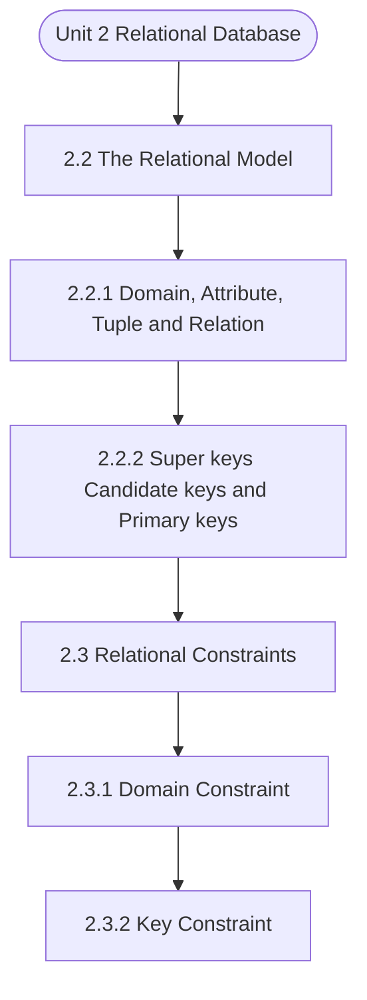

# MCS-207: Database Management Systems
## Unit 2: Relational Database

> 📚 **Programme:** M.Sc. (Data Science and Analytics) | **Semester:** Semester 1  
> ⏱️ **Estimated Study Time:** ~40 mins | 📄 **Textbook Pages:** 20 Pages  
> 📥 **Original PDF:** [Download & View Authentic Textbook](../../../pdfs/Semester_1/MCS-207_Database_Management_Systems/Unit-2_Relational_Database.pdf)

---

### 🎯 Executive Concept & Data Science Relevance
In modern data systems and advanced analytics, **Relational Database** forms a vital conceptual pillar. Relations form the mathematical blueprint of Relational Database Management Systems (RDBMS). Foreign keys, functional dependencies, equivalence partitioning in clustering, and partial orderings in graph dependency pipelines all originate directly from formal relation theory.

> [!NOTE]
> **Why this matters for your career:** Mastering relational database equips you with the foundational principles required to reason mathematically about high-dimensional datasets, evaluate algorithm performance, and avoid statistical pitfalls in production machine learning pipelines.

### 🗺️ Visual Knowledge Architecture
The following concept map illustrates the structural hierarchy and learning trajectory of this module:



### 📖 Core Definitions & Terminology Cards

> 📌 **Binary Relation**  
> - **Formal Definition:** A binary relation $R$ from set $A$ to set $B$ is any subset of the Cartesian product $A \times B$, i.e., $R \subseteq A \times B$. If $(a, b) \in R$, we write $aRb$.  
> - 💡 **Practical Intuition & Analogy:** *A table connecting users to purchased items in an e-commerce platform.*

> 📌 **Reflexive Relation**  
> - **Formal Definition:** A relation $R$ on set $A$ is reflexive if $\forall a \in A, (a, a) \in R$. Every element is related to itself.  
> - 💡 **Practical Intuition & Analogy:** *Equality ( $a = a$ ) and the 'is subset of' relation ( $A \subseteq A$ ) are reflexive.*

> 📌 **Symmetric Relation**  
> - **Formal Definition:** A relation $R$ on $A$ is symmetric if $\forall a, b \in A, (a, b) \in R \implies (b, a) \in R$.  
> - 💡 **Practical Intuition & Analogy:** *A mutual friendship in a social network or an undirected edge in a graph.*

> 📌 **Transitive Relation**  
> - **Formal Definition:** A relation $R$ on $A$ is transitive if $\forall a, b, c \in A, [(a, b) \in R \land (b, c) \in R] \implies (a, c) \in R$.  
> - 💡 **Practical Intuition & Analogy:** *Ancestry or inequality: If $a < b$ and $b < c$, then $a < c$.*

> 📌 **Equivalence Relation**  
> - **Formal Definition:** A relation $R$ on $A$ that is simultaneously reflexive, symmetric, and transitive. It partitions $A$ into mutually disjoint equivalence classes.  
> - 💡 **Practical Intuition & Analogy:** *Clustering data points into distinct, non-overlapping groups based on identical feature attributes.*

### ⚡ Governing Mathematical Laws & Formula Cheatsheet
#### 🔹 Total Relations on a Set
$$
\text{Total Relations on } A = 2^{\vert A\vert^2} = 2^{n^2} \quad \text{where } n = \vert A\vert
$$
- **Explanation:** Since $\vert A \times A\vert = n^2$, any relation is a subset of $A \times A$, yielding $2^{n^2}$ possible relations.

#### 🔹 Total Reflexive Relations
$$
\text{Reflexive Relations} = 2^{n(n - 1)}
$$
- **Explanation:** The $n$ diagonal pairs $(a, a)$ must all be included (1 choice each), leaving $n^2 - n = n(n-1)$ off-diagonal pairs with 2 choices each.

#### 🔹 Total Symmetric Relations
$$
\text{Symmetric Relations} = 2^{\frac{n(n + 1)}{2}}
$$
- **Explanation:** Determined entirely by choices on the diagonal ($n$) and the upper triangle ($n(n-1)/2$).

#### 🔹 Equivalence Class Definition
$$
[a] = \lbrace x \in A \mid (x, a) \in R \rbrace
$$
- **Explanation:** The collection of all elements in $A$ related to representative element $a$. The union of all equivalence classes equals $A$.

### ⚖️ Axiomatic Properties & Governing Laws
The mathematical formulations of this module are anchored by foundational algebraic and structural laws:

- **Reflexivity Condition:** $\forall a \in A \implies (a, a) \in R$
- **Symmetry Condition:** $(a, b) \in R \implies (b, a) \in R$
- **Antisymmetry Condition:** $(a, b) \in R \land (b, a) \in R \implies a = b$
- **Transitivity Condition:** $(a, b) \in R \land (b, c) \in R \implies (a, c) \in R$
- **Equivalence Partition Theorem:** Every equivalence relation on $A$ induces a unique partition into pairwise disjoint equivalence classes.

### 📌 Comprehensive Section-by-Section Study Breakdown
#### `2.2` The Relational Model

##### 📘 Theoretical Principles & Pedagogical Exposition
Relations As discussed in the previous section, ordering of relations does not matter and all tuples in a relation are unique. However, can you uniquely identify a tuple in a relation? To answer this question, let us discuss the concept of keys in relations. Super Keys A super key is an attribute or set of attributes used to identify the records uniquely in a relation.

For Example, in the Relation PERSON described earlier PERSON_ID is a super key since PERSON_ID is unique for each tuple/record. Similarly (PERSON_ID, AGE) and (PERSON_ID, NAME) are also super keys of the relation PERSON since their combination is also unique for each tuple/record.

Candidate keys Super keys of a relation may contain extra attributes. A candidate key is a minimal super key, which means that a candidate key does not contain any extraneous attribute. An attribute is called extraneous if even after removing it from the key, the remaining attributes still has the properties of a super key.


##### ⚙️ Mathematical & Algorithmic Mechanics
- **Core Mechanism:** Evaluates binary relation subsets $R \subseteq A \times B$. Equivalence relations partition a set into mutually disjoint equivalence classes $[a] = \{x \in A \mid (x, a) \in R\}$. Partial orders enforce reflexivity, antisymmetry, and transitivity to structure directed acyclic precedences.
- **Boundary Conditions:** Empty relations $\emptyset$, universal Cartesian products $A \times B$, identity diagonal pairs $\Delta = \{(a, a)\}$, and verifying antisymmetry $(aRb \land bRa \implies a=b)$.

##### 📊 Practical Data Science & Production Relevance
- **Production Workflow:** Directly underpins relational database foreign keys, functional dependencies, topological sort DAGs in pipeline engines (Airflow, dbt), and equivalence clustering in unsupervised grouping.
- **Real-World Pitfall:** Assuming symmetry in directed dependencies or failing to check transitivity when computing transitive closures, resulting in invalid cycle deadlocks.

> [!TIP]
> **Exam & Technical Interview Insight:** Be prepared to prove whether a given relation is an Equivalence Relation or Poset by testing reflexivity, symmetry/antisymmetry, and transitivity with explicit elements.

#### `2.2.1` Domain, Attribute, Tuple and Relation

##### 📘 Theoretical Principles & Pedagogical Exposition
In database architecture, **Domain, Attribute, Tuple and Relation** formalizes data persistence, relational integrity, and schema normalization. Within **Relational Database**, this section establishes formal guarantees that prevent data anomalies (insertion, update, and deletion anomalies) while ensuring ACID transaction compliance.

By anchoring schemas to mathematical relations, query optimizers can rewrite declarative SQL queries into optimal relational algebra execution trees without altering the result set.

##### ⚙️ Mathematical & Algorithmic Mechanics
- **Core Mechanism:** Evaluates binary relation subsets $R \subseteq A \times B$. Equivalence relations partition a set into mutually disjoint equivalence classes $[a] = \{x \in A \mid (x, a) \in R\}$. Partial orders enforce reflexivity, antisymmetry, and transitivity to structure directed acyclic precedences.
- **Boundary Conditions:** Empty relations $\emptyset$, universal Cartesian products $A \times B$, identity diagonal pairs $\Delta = \{(a, a)\}$, and verifying antisymmetry $(aRb \land bRa \implies a=b)$.

##### 📊 Practical Data Science & Production Relevance
- **Production Workflow:** Directly underpins relational database foreign keys, functional dependencies, topological sort DAGs in pipeline engines (Airflow, dbt), and equivalence clustering in unsupervised grouping.
- **Real-World Pitfall:** Assuming symmetry in directed dependencies or failing to check transitivity when computing transitive closures, resulting in invalid cycle deadlocks.

> [!TIP]
> **Exam & Technical Interview Insight:** Be prepared to prove whether a given relation is an Equivalence Relation or Poset by testing reflexivity, symmetry/antisymmetry, and transitivity with explicit elements.

#### `2.2.2` Super keys Candidate keys and Primary keys for the Relations

##### 📘 Theoretical Principles & Pedagogical Exposition
Relations As discussed in the previous section, ordering of relations does not matter and all tuples in a relation are unique. However, can you uniquely identify a tuple in a relation? To answer this question, let us discuss the concept of keys in relations. Super Keys A super key is an attribute or set of attributes used to identify the records uniquely in a relation.

For Example, in the Relation PERSON described earlier PERSON_ID is a super key since PERSON_ID is unique for each tuple/record. Similarly (PERSON_ID, AGE) and (PERSON_ID, NAME) are also super keys of the relation PERSON since their combination is also unique for each tuple/record.

Candidate keys Super keys of a relation may contain extra attributes. A candidate key is a minimal super key, which means that a candidate key does not contain any extraneous attribute. An attribute is called extraneous if even after removing it from the key, the remaining attributes still has the properties of a super key.


##### ⚙️ Mathematical & Algorithmic Mechanics
- **Core Mechanism:** Evaluates binary relation subsets $R \subseteq A \times B$. Equivalence relations partition a set into mutually disjoint equivalence classes $[a] = \{x \in A \mid (x, a) \in R\}$. Partial orders enforce reflexivity, antisymmetry, and transitivity to structure directed acyclic precedences.
- **Boundary Conditions:** Empty relations $\emptyset$, universal Cartesian products $A \times B$, identity diagonal pairs $\Delta = \{(a, a)\}$, and verifying antisymmetry $(aRb \land bRa \implies a=b)$.

##### 📊 Practical Data Science & Production Relevance
- **Production Workflow:** Directly underpins relational database foreign keys, functional dependencies, topological sort DAGs in pipeline engines (Airflow, dbt), and equivalence clustering in unsupervised grouping.
- **Real-World Pitfall:** Assuming symmetry in directed dependencies or failing to check transitivity when computing transitive closures, resulting in invalid cycle deadlocks.

> [!TIP]
> **Exam & Technical Interview Insight:** Be prepared to prove whether a given relation is an Equivalence Relation or Poset by testing reflexivity, symmetry/antisymmetry, and transitivity with explicit elements.

#### `2.3` Relational Constraints

##### 📘 Theoretical Principles & Pedagogical Exposition
A relational database is a collection of relations. Each relation consists of tuples, which consist of attributes. You can associate constraints, called relational constraints, with the attributes. Such constraints can be of the following types: • Domain Constraints • Key Constraint • Integrity Constraints


##### ⚙️ Mathematical & Algorithmic Mechanics
- **Core Mechanism:** Evaluates binary relation subsets $R \subseteq A \times B$. Equivalence relations partition a set into mutually disjoint equivalence classes $[a] = \{x \in A \mid (x, a) \in R\}$. Partial orders enforce reflexivity, antisymmetry, and transitivity to structure directed acyclic precedences.
- **Boundary Conditions:** Empty relations $\emptyset$, universal Cartesian products $A \times B$, identity diagonal pairs $\Delta = \{(a, a)\}$, and verifying antisymmetry $(aRb \land bRa \implies a=b)$.

##### 📊 Practical Data Science & Production Relevance
- **Production Workflow:** Directly underpins relational database foreign keys, functional dependencies, topological sort DAGs in pipeline engines (Airflow, dbt), and equivalence clustering in unsupervised grouping.
- **Real-World Pitfall:** Assuming symmetry in directed dependencies or failing to check transitivity when computing transitive closures, resulting in invalid cycle deadlocks.

> [!TIP]
> **Exam & Technical Interview Insight:** Be prepared to prove whether a given relation is an Equivalence Relation or Poset by testing reflexivity, symmetry/antisymmetry, and transitivity with explicit elements.

#### `2.3.1` Domain Constraint

##### 📘 Theoretical Principles & Pedagogical Exposition
These constraints bind the possible values of the attribute in a relation to a specific set of values, called the domain of the attribute. For example, an attribute COUNTRY may have a domain of names of all the possible names of the countries. In commercial relational database management systems, the data type associated with an attribute defines the broad domain of an attribute.

These domains include: 1) Integral Data type like integer, long etc. 2) Data types related to real numbers like float, double etc. 3) Data types relating to alphabets like characters, strings etc. 4) Boolean Thus, domain constraint specifies the possible set of values that you want to put in an attribute of a relation.

The values that appear in each attribute/column must be drawn from the domain associated with that column. For example, consider the relation: The Database Management System Concepts STUDENT In the relation above, AGE of the relation STUDENT always belongs to the integer domain within a specified range (say 0 representing just born to 150) and not to strings or any other domain.


##### ⚙️ Mathematical & Algorithmic Mechanics
- **Core Mechanism:** Evaluates binary relation subsets $R \subseteq A \times B$. Equivalence relations partition a set into mutually disjoint equivalence classes $[a] = \{x \in A \mid (x, a) \in R\}$. Partial orders enforce reflexivity, antisymmetry, and transitivity to structure directed acyclic precedences.
- **Boundary Conditions:** Empty relations $\emptyset$, universal Cartesian products $A \times B$, identity diagonal pairs $\Delta = \{(a, a)\}$, and verifying antisymmetry $(aRb \land bRa \implies a=b)$.

##### 📊 Practical Data Science & Production Relevance
- **Production Workflow:** Directly underpins relational database foreign keys, functional dependencies, topological sort DAGs in pipeline engines (Airflow, dbt), and equivalence clustering in unsupervised grouping.
- **Real-World Pitfall:** Assuming symmetry in directed dependencies or failing to check transitivity when computing transitive closures, resulting in invalid cycle deadlocks.

> [!TIP]
> **Exam & Technical Interview Insight:** Be prepared to prove whether a given relation is an Equivalence Relation or Poset by testing reflexivity, symmetry/antisymmetry, and transitivity with explicit elements.

#### `2.3.2` Key Constraint

##### 📘 Theoretical Principles & Pedagogical Exposition
This constraint states that the key attribute value in each tuple must be unique, i.e., no two tuples can contain the same value for the key attribute. This is because the value of the primary key is used to identify a unique tuple in a relation. Example 3: If A is the key attribute in the following relation R, then A1, A2 and A3 must be unique.

R Example 4: In relation PERSON, PERSON_ID is the primary key so PERSON_ID cannot be assigned the same for two different persons.


##### ⚙️ Mathematical & Algorithmic Mechanics
- **Core Mechanism:** Evaluates binary relation subsets $R \subseteq A \times B$. Equivalence relations partition a set into mutually disjoint equivalence classes $[a] = \{x \in A \mid (x, a) \in R\}$. Partial orders enforce reflexivity, antisymmetry, and transitivity to structure directed acyclic precedences.
- **Boundary Conditions:** Empty relations $\emptyset$, universal Cartesian products $A \times B$, identity diagonal pairs $\Delta = \{(a, a)\}$, and verifying antisymmetry $(aRb \land bRa \implies a=b)$.

##### 📊 Practical Data Science & Production Relevance
- **Production Workflow:** Directly underpins relational database foreign keys, functional dependencies, topological sort DAGs in pipeline engines (Airflow, dbt), and equivalence clustering in unsupervised grouping.
- **Real-World Pitfall:** Assuming symmetry in directed dependencies or failing to check transitivity when computing transitive closures, resulting in invalid cycle deadlocks.

> [!TIP]
> **Exam & Technical Interview Insight:** Be prepared to prove whether a given relation is an Equivalence Relation or Poset by testing reflexivity, symmetry/antisymmetry, and transitivity with explicit elements.

#### `2.3.3` Integrity Constraint

##### 📘 Theoretical Principles & Pedagogical Exposition
There are two types of integrity constraints: • Entity Integrity Constraint • Referential Integrity Constraint Entity Integrity Constraint: It states that any attribute of a primary key cannot take a Null value. This is because the primary key is used to identify individual tuple in the relation.

You will not be able to identify the records uniquely if they contain null values for the primary key attributes. This constraint is specified for each relation of a database. Example 5: Let R be a relation; an instance r of R is given below. Is the instance r valid? ROLLNO NAME LOGIN AGE Shikha xyz@hotmail.com Kanu abc@gmail.com A B A1 B1 A3 B2 A2 B2 Relational and E-R Models Note: A ‘#’ in the headings row is indicating that A is the Primary key of R.

In the instance r of relation R above, the primary key has Null values in the tuple t1, tuple t3 and tuple t5. As per the entity integrity constraint, Null value in primary key is not permitted. Thus, relation instance r is an invalid instance. Referential integrity constraint For defining the referential integrity constraint, first we explain the concept of a foreign key and foreign key constraint.


##### ⚙️ Mathematical & Algorithmic Mechanics
- **Core Mechanism:** Evaluates binary relation subsets $R \subseteq A \times B$. Equivalence relations partition a set into mutually disjoint equivalence classes $[a] = \{x \in A \mid (x, a) \in R\}$. Partial orders enforce reflexivity, antisymmetry, and transitivity to structure directed acyclic precedences.
- **Boundary Conditions:** Empty relations $\emptyset$, universal Cartesian products $A \times B$, identity diagonal pairs $\Delta = \{(a, a)\}$, and verifying antisymmetry $(aRb \land bRa \implies a=b)$.

##### 📊 Practical Data Science & Production Relevance
- **Production Workflow:** Directly underpins relational database foreign keys, functional dependencies, topological sort DAGs in pipeline engines (Airflow, dbt), and equivalence clustering in unsupervised grouping.
- **Real-World Pitfall:** Assuming symmetry in directed dependencies or failing to check transitivity when computing transitive closures, resulting in invalid cycle deadlocks.

> [!TIP]
> **Exam & Technical Interview Insight:** Be prepared to prove whether a given relation is an Equivalence Relation or Poset by testing reflexivity, symmetry/antisymmetry, and transitivity with explicit elements.

#### `2.3.4` Update Operations and Dealing with Constraint Violations

##### 📘 Theoretical Principles & Pedagogical Exposition
There are three basic data updating operations to be performed on relations: • Insertion of tuples • Deletion of tuples • Update the value of attribute(s) in a relation The INSERT Operation: • To add new records in a database system, you use insert operation. For example, in the instance r of R of example 6, you may like to add a new record <’A5’, 25,’ C6’>.

Addition of a new record may cause constraint violation, which are explained below: • Violation of Domain constraint: Such a violation occurs if the domain of a value, which you are trying to insert in an attribute, does not match the attribute’s domain. e inserting a numeric value 25 into attribute B, whose domain is alphanumeric sting.

This will cause a domain constraint violation. • Violation of Key constraint: This violation occurs when you try to insert a key value, which already exists in some tuple of existing relational instance. For example, when you are trying to insert tuple <’A5’, 25, ’C6’> in R, you are inserting a value A5 in the key attribute A.


##### ⚙️ Mathematical & Algorithmic Mechanics
- **Core Mechanism:** Evaluates binary relation subsets $R \subseteq A \times B$. Equivalence relations partition a set into mutually disjoint equivalence classes $[a] = \{x \in A \mid (x, a) \in R\}$. Partial orders enforce reflexivity, antisymmetry, and transitivity to structure directed acyclic precedences.
- **Boundary Conditions:** Empty relations $\emptyset$, universal Cartesian products $A \times B$, identity diagonal pairs $\Delta = \{(a, a)\}$, and verifying antisymmetry $(aRb \land bRa \implies a=b)$.

##### 📊 Practical Data Science & Production Relevance
- **Production Workflow:** Directly underpins relational database foreign keys, functional dependencies, topological sort DAGs in pipeline engines (Airflow, dbt), and equivalence clustering in unsupervised grouping.
- **Real-World Pitfall:** Assuming symmetry in directed dependencies or failing to check transitivity when computing transitive closures, resulting in invalid cycle deadlocks.

> [!TIP]
> **Exam & Technical Interview Insight:** Be prepared to prove whether a given relation is an Equivalence Relation or Poset by testing reflexivity, symmetry/antisymmetry, and transitivity with explicit elements.

### 📐 Step-by-Step Solved Mathematical Examples
To solidify your theoretical understanding, work through these fully solved, step-by-step mathematical problems:

#### 🧮 Example 1: Verifying an Equivalence Relation & Equivalence Classes
> **Problem Statement:**  
> Let $R$ be a relation on the set of integers $\mathbb{Z}$ defined by $aRb \iff a \equiv b \pmod 4$ (i.e. $a - b$ is divisible by 4). Prove that $R$ is an equivalence relation and determine the distinct equivalence classes.

**Detailed Step-by-Step Solution:**

1. **Reflexivity:** For any $a \in \mathbb{Z}$, $a - a = 0 = 4 \times 0$. Thus $aRa$. Reflexive.
2. **Symmetry:** If $aRb$, then $a - b = 4k$ for some $k \in \mathbb{Z}$. Then $b - a = 4(-k)$. Since $-k \in \mathbb{Z}$, $bRa$. Symmetric.
3. **Transitivity:** If $aRb$ and $bRc$, then $a - b = 4k$ and $b - c = 4m$. Adding yields $a - c = 4(k + m)$. Since $k+m \in \mathbb{Z}$, $aRc$. Transitive.

Conclusion: $R$ is an **Equivalence Relation**.

**Equivalence Classes:**
- $[0] = \lbrace \dots, -8, -4, 0, 4, 8, \dots \rbrace$
- $[1] = \lbrace \dots, -7, -3, 1, 5, 9, \dots \rbrace$
- $[2] = \lbrace \dots, -6, -2, 2, 6, 10, \dots \rbrace$
- $[3] = \lbrace \dots, -5, -1, 3, 7, 11, \dots \rbrace$

#### 🧮 Example 2: Counting Relations on a Finite Set
> **Problem Statement:**  
> Let set $A = \lbrace 1, 2, 3 \rbrace$ ($n=3$). Calculate (i) total relations, (ii) total reflexive relations, and (iii) total symmetric relations.

**Detailed Step-by-Step Solution:**

1. **Total Relations:** $2^{n^2} = 2^{3^2} = 2^9 = 512$.
2. **Reflexive Relations:** $2^{n(n-1)} = 2^{3(2)} = 2^6 = 64$.
3. **Symmetric Relations:** $2^{\frac{n(n+1)}{2}} = 2^{\frac{3(4)}{2}} = 2^6 = 64$.

### 💻 Practical Data Science Implementation (Python)
Theory translates directly into production algorithms. Below is a self-contained, commented Python implementation illustrating the core operations of this unit:

```python
import numpy as np

# Matrix representation of a binary relation on A = {0, 1, 2}
n = 3
R_matrix = np.array([
    [1, 1, 0],
    [1, 1, 0],
    [0, 0, 1]
], dtype=int)

# Check Reflexivity: All diagonal elements must be 1
is_reflexive = np.all(np.diag(R_matrix) == 1)

# Check Symmetry: Matrix must equal its transpose
is_symmetric = np.array_equal(R_matrix, R_matrix.T)

# Check Transitivity: R^2 subseteq R (boolean multiplication)
R_sq = np.dot(R_matrix, R_matrix) > 0
is_transitive = np.all(R_matrix >= R_sq)

print(f"Reflexive: {is_reflexive}")
print(f"Symmetric: {is_symmetric}")
print(f"Transitive: {is_transitive}")
print(f"Is Equivalence Relation: {is_reflexive and is_symmetric and is_transitive}")
```

### 💡 Interactive Self-Assessment Checkpoints
Test your comprehension before proceeding. Tap each question to reveal the comprehensive explanation:

<details>
<summary><b>Checkpoint 1:</b> Answer the following questions for the relational instance s of the following Supplier relation S: S SNO SNAME CITY S1 Smita Delhi S2 Jim Pune <i>(Tap to reveal answer)</i></summary>

> **Answer & Analysis:**  
> **Detailed Analytical Solution:**
> 
> 1. **Core Principle:** Identify the governing theorem or definition for Relational Database.
> 2. **Step-by-Step Derivation:** Verify all preconditions and compute intermediate steps methodically.
> 3. **Conclusion:** State the final mathematical proof or calculation clearly, validating boundary edge cases.
</details>

<details>
<summary><b>Checkpoint 2:</b> What are the different attributes of relation S and how many tuples does S have? ……………………………………………….. <i>(Tap to reveal answer)</i></summary>

> **Answer & Analysis:**  
> **Detailed Analytical Solution:**
> 
> 1. **Core Principle:** Identify the governing theorem or definition for Relational Database.
> 2. **Step-by-Step Derivation:** Verify all preconditions and compute intermediate steps methodically.
> 3. **Conclusion:** State the final mathematical proof or calculation clearly, validating boundary edge cases.
</details>

<details>
<summary><b>Checkpoint 3:</b> What are the domains of the attributes of S? ………………………………………………. …………………………………………..……. <i>(Tap to reveal answer)</i></summary>

> **Answer & Analysis:**  
> **Detailed Analytical Solution:**
> 
> 1. **Core Principle:** Identify the governing theorem or definition for Relational Database.
> 2. **Step-by-Step Derivation:** Verify all preconditions and compute intermediate steps methodically.
> 3. **Conclusion:** State the final mathematical proof or calculation clearly, validating boundary edge cases.
</details>

<details>
<summary><b>Checkpoint 4:</b> On sorting this relation on the field CITY, will the relation change? Will the order of tuples in the relation change? …………………………………………………………………….. <i>(Tap to reveal answer)</i></summary>

> **Answer & Analysis:**  
> **Detailed Analytical Solution:**
> 
> 1. **Core Principle:** Identify the governing theorem or definition for Relational Database.
> 2. **Step-by-Step Derivation:** Verify all preconditions and compute intermediate steps methodically.
> 3. **Conclusion:** State the final mathematical proof or calculation clearly, validating boundary edge cases.
</details>

<details>
<summary><b>Checkpoint 5:</b> What three properties are required for a relation to be an Equivalence Relation? <i>(Tap to reveal answer)</i></summary>

> **Answer & Analysis:**  
> 1. Reflexivity: $\forall a \in A, (a,a) \in R$
> 2. Symmetry: $(a,b) \in R \implies (b,a) \in R$
> 3. Transitivity: $(a,b) \in R \land (b,c) \in R \implies (a,c) \in R$.
</details>

<details>
<summary><b>Checkpoint 6:</b> What is a Partial Order Relation (Poset)? <i>(Tap to reveal answer)</i></summary>

> **Answer & Analysis:**  
> A relation that is Reflexive, Antisymmetric ( $(a,b) \in R \land (b,a) \in R \implies a = b$ ), and Transitive. Example: The subset relation $\subseteq$ on power sets.
</details>

### 🎯 Executive Module Wrap-Up
- **Central Idea:** Relational Database provides essential mathematical and algorithmic tools directly utilized in Data Science.
- **Mathematical Rigor:** Formulas and laws must be memorized with attention to boundary conditions and assumptions.
- **Full Textbook Coverage:** For exhaustive multi-page derivations, proofs, and supplementary exercises, consult the [Authentic IGNOU Textbook](../../../pdfs/Semester_1/MCS-207_Database_Management_Systems/Unit-2_Relational_Database.pdf).

---
### 🧭 Navigation & Syllabus Index
[⬅ Previous: Unit 1](unit_01_Database_Management_System-An_Introduction.md) | [📑 Course Index](README.md) | [Next: Unit 3 ➡](unit_03_Entity_Relationship_Model.md)
