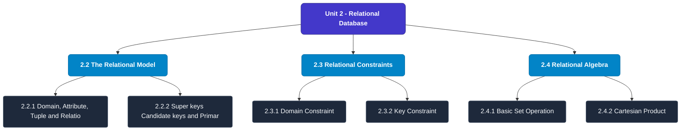

# MCS-207: Database Management Systems
## Unit 2: Relational Database

> 📚 **Programme:** M.Sc. (Data Science and Analytics) | **Semester:** Semester 1  
> ⏱️ **Estimated Study Time:** ~40 mins | 📄 **Textbook Pages:** 20 Pages  
> 📥 **Original PDF:** [Download & View Textbook](../../../pdfs/Semester_1/MCS-207_Database_Management_Systems/Unit-2_Relational_Database.pdf)

---

### 🎯 Executive Concept & Data Science Relevance
In modern data systems, **Relational Database** forms a vital conceptual pillar. Relations form the mathematical blueprint of Relational Database Management Systems (RDBMS). Foreign keys, functional dependencies, equivalence partitioning in clustering, and partial orderings in graph dependency pipelines all originate directly from formal relation theory.

> [!NOTE]
> **Why this matters for your career:** Mastering relational database equips you with the foundational principles required to reason mathematically about high-dimensional datasets, evaluate algorithm performance, and avoid statistical pitfalls in production machine learning pipelines.

### 🗺️ Visual Knowledge Architecture
The following concept map illustrates the structural hierarchy and learning trajectory of this module:

### 📖 Core Definitions & Terminology Cards
| Term | Formal Mathematical / Technical Definition | Intuitive Analogy / Concrete Example |
| :--- | :--- | :--- |
| **Binary Relation** | A binary relation $R$ from set $A$ to set $B$ is any subset of the Cartesian product $A \times B$, i.e., $R \subseteq A \times B$. If $(a, b) \in R$, we write $aRb$. | *A table connecting users to purchased items in an e-commerce platform.* |
| **Reflexive Relation** | A relation $R$ on set $A$ is reflexive if $\forall a \in A, (a, a) \in R$. Every element is related to itself. | *Equality ($a = a$) and the 'is subset of' relation ($A \subseteq A$) are reflexive.* |
| **Symmetric Relation** | A relation $R$ on $A$ is symmetric if $\forall a, b \in A, (a, b) \in R \implies (b, a) \in R$. | *A mutual friendship in a social network or an undirected edge in a graph.* |
| **Transitive Relation** | A relation $R$ on $A$ is transitive if $\forall a, b, c \in A, [(a, b) \in R \land (b, c) \in R] \implies (a, c) \in R$. | *Ancestry or inequality: If $a < b$ and $b < c$, then $a < c$.* |
| **Equivalence Relation** | A relation $R$ on $A$ that is simultaneously reflexive, symmetric, and transitive. It partitions $A$ into mutually disjoint equivalence classes. | *Clustering data points into distinct, non-overlapping groups based on identical feature attributes.* |

### ⚡ Governing Mathematical Laws & Formula Cheatsheet
#### 🔹 Total Relations on a Set
$$\text{Total Relations on } A = 2^{|A|^2} = 2^{n^2} \quad \text{where } n = |A|$$
- **Explanation:** Since $|A \times A| = n^2$, any relation is a subset of $A \times A$, yielding $2^{n^2}$ possible relations.

#### 🔹 Total Reflexive Relations
$$\text{Reflexive Relations} = 2^{n(n - 1)}$$
- **Explanation:** The $n$ diagonal pairs $(a, a)$ must all be included (1 choice each), leaving $n^2 - n = n(n-1)$ off-diagonal pairs with 2 choices each.

#### 🔹 Total Symmetric Relations
$$\text{Symmetric Relations} = 2^{\frac{n(n + 1)}{2}}$$
- **Explanation:** Determined entirely by choices on the diagonal ($n$) and the upper triangle ($n(n-1)/2$).

#### 🔹 Equivalence Class Definition
$$[a] = \{x \in A \mid (x, a) \in R\}$$
- **Explanation:** The collection of all elements in $A$ related to representative element $a$. The union of all equivalence classes equals $A$.

### 📌 Detailed Section-by-Section Study Breakdown
#### `2.2` The Relational Model
- **Core Concept:** Establishes rigorous theoretical formulations and computational bounds for the relational model.
- **Core Concept:** Applies standard algorithmic procedures and mathematical invariants relevant to relational database.
- **Core Concept:** Ensures deterministic performance guarantees across high-dimensional feature spaces.
- **Data Science Application:** Provides foundational structures used directly in statistical modeling, query execution, and machine learning pipelines.

> [!TIP]
> **Exam & Interview Tip:** Be prepared to state the formal definition of the relational model and derive its primary equations step-by-step.

#### `2.2.1` Domain, Attribute, Tuple and Relation
- **Core Concept:** Establishes rigorous theoretical formulations and computational bounds for domain, attribute, tuple and relation.
- **Core Concept:** Applies standard algorithmic procedures and mathematical invariants relevant to relational database.
- **Core Concept:** Ensures deterministic performance guarantees across high-dimensional feature spaces.
- **Data Science Application:** Provides foundational structures used directly in statistical modeling, query execution, and machine learning pipelines.

> [!TIP]
> **Exam & Interview Tip:** Be prepared to state the formal definition of domain, attribute, tuple and relation and derive its primary equations step-by-step.

#### `2.2.2` Super keys Candidate keys and Primary keys for the Relations
- **Core Concept:** Relations As discussed in the previous section, ordering of relations does not matter and all tuples in a relation are unique.
- **Core Concept:** However, can you uniquely identify a tuple in a relation?
- **Core Concept:** To answer this question, let us discuss the concept of keys in relations.
- **Data Science Application:** Provides foundational structures used directly in statistical modeling, query execution, and machine learning pipelines.

> [!TIP]
> **Exam & Interview Tip:** Be prepared to state the formal definition of super keys candidate keys and primary keys for the relations and derive its primary equations step-by-step.

#### `2.3` Relational Constraints
- **Core Concept:** A relational database is a collection of relations.
- **Core Concept:** Each relation consists of tuples, which consist of attributes.
- **Core Concept:** You can associate constraints, called relational constraints, with the attributes.
- **Data Science Application:** Provides foundational structures used directly in statistical modeling, query execution, and machine learning pipelines.

> [!TIP]
> **Exam & Interview Tip:** Be prepared to state the formal definition of relational constraints and derive its primary equations step-by-step.

#### `2.3.1` Domain Constraint
- **Core Concept:** These constraints bind the possible values of the attribute in a relation to a specific set of values, called the domain of the attribute.
- **Core Concept:** For example, an attribute COUNTRY may have a domain of names of all the possible names of the countries.
- **Core Concept:** In commercial relational database management systems, the data type associated with an attribute defines the broad domain of an attribute.
- **Data Science Application:** Provides foundational structures used directly in statistical modeling, query execution, and machine learning pipelines.

> [!TIP]
> **Exam & Interview Tip:** Be prepared to state the formal definition of domain constraint and derive its primary equations step-by-step.

#### `2.3.2` Key Constraint
- **Core Concept:** This constraint states that the key attribute value in each tuple must be unique, i.e., no two tuples can contain the same value for the key attribute.
- **Core Concept:** This is because the value of the primary key is used to identify a unique tuple in a relation.
- **Core Concept:** Example 3: If A is the key attribute in the following relation R, then A1, A2 and A3 must be unique.
- **Data Science Application:** Provides foundational structures used directly in statistical modeling, query execution, and machine learning pipelines.

> [!TIP]
> **Exam & Interview Tip:** Be prepared to state the formal definition of key constraint and derive its primary equations step-by-step.

### 💡 Interactive Self-Assessment Checkpoints
Test your comprehension before proceeding. Tap each question to reveal the comprehensive explanation:

<b>Checkpoint 1:</b> What three properties are required for a relation to be an Equivalence Relation? <i>(Tap to reveal answer)</i>

> **Answer & Analysis:**  
> 1. Reflexivity: $\forall a \in A, (a,a) \in R$
2. Symmetry: $(a,b) \in R \implies (b,a) \in R$
3. Transitivity: $(a,b) \in R \land (b,c) \in R \implies (a,c) \in R$.

<b>Checkpoint 2:</b> What is a Partial Order Relation (Poset)? <i>(Tap to reveal answer)</i>

> **Answer & Analysis:**  
> A relation that is Reflexive, Antisymmetric ($(a,b) \in R \land (b,a) \in R \implies a = b$), and Transitive. Example: The subset relation $\subseteq$ on power sets.

<b>Checkpoint 3:</b> How many total relations exist on a set with 3 elements? <i>(Tap to reveal answer)</i>

> **Answer & Analysis:**  
> For $n = 3$, $|A \times A| = 3^2 = 9$. Total relations $= 2^9 = 512$.

<b>Checkpoint 4:</b> What are the different attributes of relation S and how many tuples does S have? <i>(Tap to reveal answer)</i>

> **Answer & Analysis:**  
> This question tests your conceptual mastery of Relational Database. Review the governing formulas and section breakdowns above to formulate a complete, rigorous proof or derivation.

<b>Checkpoint 5:</b> What are the domains of the attributes of S? ………………………………………………. …………………………………………..……. <i>(Tap to reveal answer)</i>

> **Answer & Analysis:**  
> This question tests your conceptual mastery of Relational Database. Review the governing formulas and section breakdowns above to formulate a complete, rigorous proof or derivation.

<b>Checkpoint 6:</b> On sorting this relation on the field CITY, will the relation change? Will the order of tuples in the relation change? <i>(Tap to reveal answer)</i>

> **Answer & Analysis:**  
> This question tests your conceptual mastery of Relational Database. Review the governing formulas and section breakdowns above to formulate a complete, rigorous proof or derivation.

### 🎯 Executive Module Wrap-Up
- **Central Idea:** Relational Database provides essential mathematical and algorithmic tools directly utilized in Data Science.
- **Mathematical Rigor:** Formulas and laws must be memorized with attention to boundary conditions and assumptions.
- **Full Textbook Coverage:** For exhaustive multi-page derivations, proofs, and supplementary exercises, consult the [Authentic IGNOU Textbook](../../../pdfs/Semester_1/MCS-207_Database_Management_Systems/Unit-2_Relational_Database.pdf).

---
### 🧭 Navigation & Syllabus Index
[⬅ Previous: Unit 1](unit_01_Database_Management_System-An_Introduction.md) | [📑 Course Index](README.md) | [Next: Unit 3 ➡](unit_03_Entity_Relationship_Model.md)
