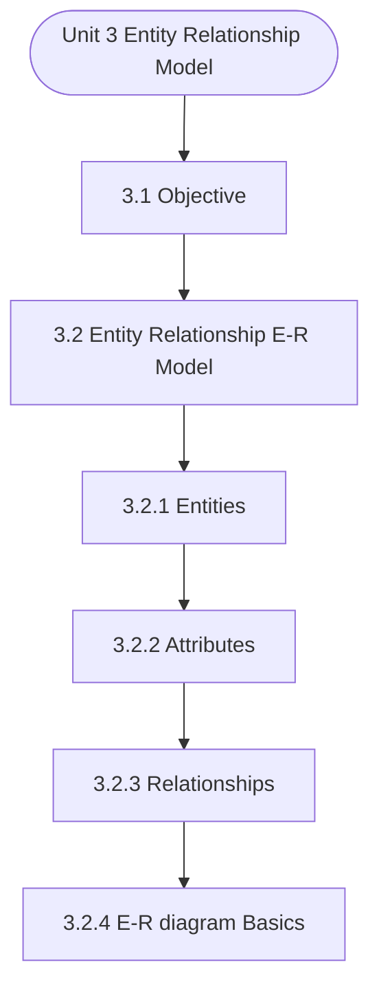

# MCS-207: Database Management Systems
## Unit 3: Entity Relationship Model

> 📚 **Programme:** M.Sc. (Data Science and Analytics) | **Semester:** Semester 1  
> ⏱️ **Estimated Study Time:** ~47 mins | 📄 **Textbook Pages:** 28 Pages  
> 📥 **Original PDF:** [Download & View Authentic Textbook](../../../pdfs/Semester_1/MCS-207_Database_Management_Systems/Unit-3_Entity_Relationship_Model.pdf)

---

### 🎯 Executive Concept & Data Science Relevance
In modern data systems and advanced analytics, **Entity Relationship Model** forms a vital conceptual pillar. Relations form the mathematical blueprint of Relational Database Management Systems (RDBMS). Foreign keys, functional dependencies, equivalence partitioning in clustering, and partial orderings in graph dependency pipelines all originate directly from formal relation theory.

> [!NOTE]
> **Why this matters for your career:** Mastering entity relationship model equips you with the foundational principles required to reason mathematically about high-dimensional datasets, evaluate algorithm performance, and avoid statistical pitfalls in production machine learning pipelines.

### 🗺️ Visual Knowledge Architecture
The following concept map illustrates the structural hierarchy and learning trajectory of this module:



### 📖 Core Definitions & Terminology Cards

> 📌 **Binary Relation**  
> - **Formal Definition:** A binary relation $R$ from set $A$ to set $B$ is any subset of the Cartesian product $A \times B$, i.e., $R \subseteq A \times B$. If $(a, b) \in R$, we write $aRb$.  
> - 💡 **Practical Intuition & Analogy:** *A table connecting users to purchased items in an e-commerce platform.*

> 📌 **Reflexive Relation**  
> - **Formal Definition:** A relation $R$ on set $A$ is reflexive if $\forall a \in A, (a, a) \in R$. Every element is related to itself.  
> - 💡 **Practical Intuition & Analogy:** *Equality ( $a = a$ ) and the 'is subset of' relation ( $A \subseteq A$ ) are reflexive.*

> 📌 **Symmetric Relation**  
> - **Formal Definition:** A relation $R$ on $A$ is symmetric if $\forall a, b \in A, (a, b) \in R \implies (b, a) \in R$.  
> - 💡 **Practical Intuition & Analogy:** *A mutual friendship in a social network or an undirected edge in a graph.*

> 📌 **Transitive Relation**  
> - **Formal Definition:** A relation $R$ on $A$ is transitive if $\forall a, b, c \in A, [(a, b) \in R \land (b, c) \in R] \implies (a, c) \in R$.  
> - 💡 **Practical Intuition & Analogy:** *Ancestry or inequality: If $a < b$ and $b < c$, then $a < c$.*

> 📌 **Equivalence Relation**  
> - **Formal Definition:** A relation $R$ on $A$ that is simultaneously reflexive, symmetric, and transitive. It partitions $A$ into mutually disjoint equivalence classes.  
> - 💡 **Practical Intuition & Analogy:** *Clustering data points into distinct, non-overlapping groups based on identical feature attributes.*

### ⚡ Governing Mathematical Laws & Formula Cheatsheet
#### 🔹 Total Relations on a Set
$$
\text{Total Relations on } A = 2^{\vert A\vert^2} = 2^{n^2} \quad \text{where } n = \vert A\vert
$$
- **Explanation:** Since $\vert A \times A\vert = n^2$, any relation is a subset of $A \times A$, yielding $2^{n^2}$ possible relations.

#### 🔹 Total Reflexive Relations
$$
\text{Reflexive Relations} = 2^{n(n - 1)}
$$
- **Explanation:** The $n$ diagonal pairs $(a, a)$ must all be included (1 choice each), leaving $n^2 - n = n(n-1)$ off-diagonal pairs with 2 choices each.

#### 🔹 Total Symmetric Relations
$$
\text{Symmetric Relations} = 2^{\frac{n(n + 1)}{2}}
$$
- **Explanation:** Determined entirely by choices on the diagonal ($n$) and the upper triangle ($n(n-1)/2$).

#### 🔹 Equivalence Class Definition
$$
[a] = \lbrace x \in A \mid (x, a) \in R \rbrace
$$
- **Explanation:** The collection of all elements in $A$ related to representative element $a$. The union of all equivalence classes equals $A$.

### ⚖️ Axiomatic Properties & Governing Laws
The mathematical formulations of this module are anchored by foundational algebraic and structural laws:

- **Reflexivity Condition:** $\forall a \in A \implies (a, a) \in R$
- **Symmetry Condition:** $(a, b) \in R \implies (b, a) \in R$
- **Antisymmetry Condition:** $(a, b) \in R \land (b, a) \in R \implies a = b$
- **Transitivity Condition:** $(a, b) \in R \land (b, c) \in R \implies (a, c) \in R$
- **Equivalence Partition Theorem:** Every equivalence relation on $A$ induces a unique partition into pairwise disjoint equivalence classes.

### 📌 Comprehensive Section-by-Section Study Breakdown
#### `3.1` Objective

##### 📘 Theoretical Principles & Pedagogical Exposition
In database architecture, **Objective** formalizes data persistence, relational integrity, and schema normalization. Within **Entity Relationship Model**, this section establishes formal guarantees that prevent data anomalies (insertion, update, and deletion anomalies) while ensuring ACID transaction compliance.

By anchoring schemas to mathematical relations, query optimizers can rewrite declarative SQL queries into optimal relational algebra execution trees without altering the result set.

##### ⚙️ Mathematical & Algorithmic Mechanics
- **Core Mechanism:** Evaluates binary relation subsets $R \subseteq A \times B$. Equivalence relations partition a set into mutually disjoint equivalence classes $[a] = \{x \in A \mid (x, a) \in R\}$. Partial orders enforce reflexivity, antisymmetry, and transitivity to structure directed acyclic precedences.
- **Boundary Conditions:** Empty relations $\emptyset$, universal Cartesian products $A \times B$, identity diagonal pairs $\Delta = \{(a, a)\}$, and verifying antisymmetry $(aRb \land bRa \implies a=b)$.

##### 📊 Practical Data Science & Production Relevance
- **Production Workflow:** Directly underpins relational database foreign keys, functional dependencies, topological sort DAGs in pipeline engines (Airflow, dbt), and equivalence clustering in unsupervised grouping.
- **Real-World Pitfall:** Assuming symmetry in directed dependencies or failing to check transitivity when computing transitive closures, resulting in invalid cycle deadlocks.

> [!TIP]
> **Exam & Technical Interview Insight:** Be prepared to prove whether a given relation is an Equivalence Relation or Poset by testing reflexivity, symmetry/antisymmetry, and transitivity with explicit elements.

#### `3.2` Entity Relationship (E-R) Model

##### 📘 Theoretical Principles & Pedagogical Exposition
Let us first define - What is an attribute? An attribute is an element of an entity, which can contain a representative value. In other words, an entity is represented by a set of attributes. For example, a Student entity set may consist of attributes - Roll no, student’s name, age, address, course, etc.

An entity will have a value for each of its attributes. For example, for a particular student, the following values can be assigned: Roll No: Name: Mohan Age: Address: Z-894, Maidan Garhi, Delhi. (H) Domains: Each simple attribute of an entity type contains a possible set of values that can be attached to it.

This is called the domain of an attribute. An attribute cannot contain a value outside this domain. EXAMPLE- for STUDENT entity Age has a specific domain, integer values say from 15 to 90. Types of attributes Attributes attached to an entity can be of various types. They are explained below: Simple: An attribute that cannot be further divided into smaller parts and represents the basic meaning is called a simple attribute.


##### ⚙️ Mathematical & Algorithmic Mechanics
- **Core Mechanism:** Evaluates binary relation subsets $R \subseteq A \times B$. Equivalence relations partition a set into mutually disjoint equivalence classes $[a] = \{x \in A \mid (x, a) \in R\}$. Partial orders enforce reflexivity, antisymmetry, and transitivity to structure directed acyclic precedences.
- **Boundary Conditions:** Empty relations $\emptyset$, universal Cartesian products $A \times B$, identity diagonal pairs $\Delta = \{(a, a)\}$, and verifying antisymmetry $(aRb \land bRa \implies a=b)$.

##### 📊 Practical Data Science & Production Relevance
- **Production Workflow:** Directly underpins relational database foreign keys, functional dependencies, topological sort DAGs in pipeline engines (Airflow, dbt), and equivalence clustering in unsupervised grouping.
- **Real-World Pitfall:** Assuming symmetry in directed dependencies or failing to check transitivity when computing transitive closures, resulting in invalid cycle deadlocks.

> [!TIP]
> **Exam & Technical Interview Insight:** Be prepared to prove whether a given relation is an Equivalence Relation or Poset by testing reflexivity, symmetry/antisymmetry, and transitivity with explicit elements.

#### `3.2.1` Entities

##### 📘 Theoretical Principles & Pedagogical Exposition
Student (Rollno, Name, Address) Faculty (Id, Name, Address, Basic_Sal) Department (D_No, D_Name) Course (Course_ID, Course_Name, Duration) Figure 3.4: Conversion of Strong Entities to relations II) For each weak entity type W in the E-R Diagram, you create another relation R that contains all simple attributes of W.

Further, you add the key attribute(s) of the owner entity set (say KP) of W in R. The primary key to this relation R is – <KP + Discriminator attribute of W> and foreign key is KP, which references the owner entity of W. For example, conversion of weak entity Guardian into relation is shown in Figure


##### ⚙️ Mathematical & Algorithmic Mechanics
- **Core Mechanism:** Evaluates binary relation subsets $R \subseteq A \times B$. Equivalence relations partition a set into mutually disjoint equivalence classes $[a] = \{x \in A \mid (x, a) \in R\}$. Partial orders enforce reflexivity, antisymmetry, and transitivity to structure directed acyclic precedences.
- **Boundary Conditions:** Empty relations $\emptyset$, universal Cartesian products $A \times B$, identity diagonal pairs $\Delta = \{(a, a)\}$, and verifying antisymmetry $(aRb \land bRa \implies a=b)$.

##### 📊 Practical Data Science & Production Relevance
- **Production Workflow:** Directly underpins relational database foreign keys, functional dependencies, topological sort DAGs in pipeline engines (Airflow, dbt), and equivalence clustering in unsupervised grouping.
- **Real-World Pitfall:** Assuming symmetry in directed dependencies or failing to check transitivity when computing transitive closures, resulting in invalid cycle deadlocks.

> [!TIP]
> **Exam & Technical Interview Insight:** Be prepared to prove whether a given relation is an Equivalence Relation or Poset by testing reflexivity, symmetry/antisymmetry, and transitivity with explicit elements.

#### `3.2.2` Attributes

##### 📘 Theoretical Principles & Pedagogical Exposition
Let us first define - What is an attribute? An attribute is an element of an entity, which can contain a representative value. In other words, an entity is represented by a set of attributes. For example, a Student entity set may consist of attributes - Roll no, student’s name, age, address, course, etc.

An entity will have a value for each of its attributes. For example, for a particular student, the following values can be assigned: Roll No: Name: Mohan Age: Address: Z-894, Maidan Garhi, Delhi. (H) Domains: Each simple attribute of an entity type contains a possible set of values that can be attached to it.

This is called the domain of an attribute. An attribute cannot contain a value outside this domain. EXAMPLE- for STUDENT entity Age has a specific domain, integer values say from 15 to 90. Types of attributes Attributes attached to an entity can be of various types. They are explained below: Simple: An attribute that cannot be further divided into smaller parts and represents the basic meaning is called a simple attribute.


##### ⚙️ Mathematical & Algorithmic Mechanics
- **Core Mechanism:** Evaluates binary relation subsets $R \subseteq A \times B$. Equivalence relations partition a set into mutually disjoint equivalence classes $[a] = \{x \in A \mid (x, a) \in R\}$. Partial orders enforce reflexivity, antisymmetry, and transitivity to structure directed acyclic precedences.
- **Boundary Conditions:** Empty relations $\emptyset$, universal Cartesian products $A \times B$, identity diagonal pairs $\Delta = \{(a, a)\}$, and verifying antisymmetry $(aRb \land bRa \implies a=b)$.

##### 📊 Practical Data Science & Production Relevance
- **Production Workflow:** Directly underpins relational database foreign keys, functional dependencies, topological sort DAGs in pipeline engines (Airflow, dbt), and equivalence clustering in unsupervised grouping.
- **Real-World Pitfall:** Assuming symmetry in directed dependencies or failing to check transitivity when computing transitive closures, resulting in invalid cycle deadlocks.

> [!TIP]
> **Exam & Technical Interview Insight:** Be prepared to prove whether a given relation is an Equivalence Relation or Poset by testing reflexivity, symmetry/antisymmetry, and transitivity with explicit elements.

#### `3.2.3` Relationships

##### 📘 Theoretical Principles & Pedagogical Exposition
First, let us define the term relationships, i.e. What Are Relationships? A relationship can be defined as: • a connection or set of associations, or • a rule for communication among entities: Example: In a COLLEGE database, the association between student and course entity set, i.e., in the statement “Student opts Course” opts is an example of a relationship between the two entities Student and Course.

Relationship Sets A relationship set is a set of relationships of the same type. For example, consider the relationship between two entity sets STUDENT and COURSE. Collection of all the instances of relationship opts forms a relationship set.


##### ⚙️ Mathematical & Algorithmic Mechanics
- **Core Mechanism:** Evaluates binary relation subsets $R \subseteq A \times B$. Equivalence relations partition a set into mutually disjoint equivalence classes $[a] = \{x \in A \mid (x, a) \in R\}$. Partial orders enforce reflexivity, antisymmetry, and transitivity to structure directed acyclic precedences.
- **Boundary Conditions:** Empty relations $\emptyset$, universal Cartesian products $A \times B$, identity diagonal pairs $\Delta = \{(a, a)\}$, and verifying antisymmetry $(aRb \land bRa \implies a=b)$.

##### 📊 Practical Data Science & Production Relevance
- **Production Workflow:** Directly underpins relational database foreign keys, functional dependencies, topological sort DAGs in pipeline engines (Airflow, dbt), and equivalence clustering in unsupervised grouping.
- **Real-World Pitfall:** Assuming symmetry in directed dependencies or failing to check transitivity when computing transitive closures, resulting in invalid cycle deadlocks.

> [!TIP]
> **Exam & Technical Interview Insight:** Be prepared to prove whether a given relation is an Equivalence Relation or Poset by testing reflexivity, symmetry/antisymmetry, and transitivity with explicit elements.

#### `3.2.4` E-R diagram Basics

##### 📘 Theoretical Principles & Pedagogical Exposition
The logical structure of a database is modeled using an E-R model, which is graphically represented with the help of an E-R diagram. Figure 3.1: Symbols of E-R diagrams


##### ⚙️ Mathematical & Algorithmic Mechanics
- **Core Mechanism:** Evaluates binary relation subsets $R \subseteq A \times B$. Equivalence relations partition a set into mutually disjoint equivalence classes $[a] = \{x \in A \mid (x, a) \in R\}$. Partial orders enforce reflexivity, antisymmetry, and transitivity to structure directed acyclic precedences.
- **Boundary Conditions:** Empty relations $\emptyset$, universal Cartesian products $A \times B$, identity diagonal pairs $\Delta = \{(a, a)\}$, and verifying antisymmetry $(aRb \land bRa \implies a=b)$.

##### 📊 Practical Data Science & Production Relevance
- **Production Workflow:** Directly underpins relational database foreign keys, functional dependencies, topological sort DAGs in pipeline engines (Airflow, dbt), and equivalence clustering in unsupervised grouping.
- **Real-World Pitfall:** Assuming symmetry in directed dependencies or failing to check transitivity when computing transitive closures, resulting in invalid cycle deadlocks.

> [!TIP]
> **Exam & Technical Interview Insight:** Be prepared to prove whether a given relation is an Equivalence Relation or Poset by testing reflexivity, symmetry/antisymmetry, and transitivity with explicit elements.

#### `3.2.5` More about Relationships

##### 📘 Theoretical Principles & Pedagogical Exposition
In this section, you will go through some of the important concepts, which are used for making good E-R models. Degree of a relationship set: The degree of a relationship set is the number of participating Entity sets. The relationship between two entities is called a binary relationship.

A relationship among three entities is called a ternary relationship. Similarly, a relationship among n entities is called an n-ary relationship. Cardinality of a relationship set: Cardinality specifies the number of instances of an entity associated with another entity participating in a relationship.

Based on the cardinality, binary relationships can be further classified into the following categories: • One-to-one: An entity in A is associated with at most one entity in B, and an entity in B is associated with at most one entity in A. For example, the relationship headedBy between college entity set and principal entity set would be one-to-one, as one college can have at most one principal; and one principal can be principal of only one college.


##### ⚙️ Mathematical & Algorithmic Mechanics
- **Core Mechanism:** Evaluates binary relation subsets $R \subseteq A \times B$. Equivalence relations partition a set into mutually disjoint equivalence classes $[a] = \{x \in A \mid (x, a) \in R\}$. Partial orders enforce reflexivity, antisymmetry, and transitivity to structure directed acyclic precedences.
- **Boundary Conditions:** Empty relations $\emptyset$, universal Cartesian products $A \times B$, identity diagonal pairs $\Delta = \{(a, a)\}$, and verifying antisymmetry $(aRb \land bRa \implies a=b)$.

##### 📊 Practical Data Science & Production Relevance
- **Production Workflow:** Directly underpins relational database foreign keys, functional dependencies, topological sort DAGs in pipeline engines (Airflow, dbt), and equivalence clustering in unsupervised grouping.
- **Real-World Pitfall:** Assuming symmetry in directed dependencies or failing to check transitivity when computing transitive closures, resulting in invalid cycle deadlocks.

> [!TIP]
> **Exam & Technical Interview Insight:** Be prepared to prove whether a given relation is an Equivalence Relation or Poset by testing reflexivity, symmetry/antisymmetry, and transitivity with explicit elements.

#### `3.2.6` Extended E-R Features

##### 📘 Theoretical Principles & Pedagogical Exposition
Although, the basic features of E-R diagrams are sufficient to design many database situations. However, with more complex relations and advanced database applications, it is required to use extended features of E-R models. The three such features are: • Generalisation • Specialisation, and • Aggregation TaughtBy Course Faculty N M WrittenBy Book Author N M We have explained them with the help of an example.

More details on them are available in the further readings. Example 1: A bank has an Account entity set. Any accounts of the bank can be one of two types: (1) Savings account and (2) Current account. The statement above represents a specialisation/ generalisation hierarchy. It can be shown as: Figure 3.2: Generalisation and Specialisation hierarchy Aggregation: One limitation of the E-R diagram is that they do not allow representation of relationships among relationships.

In such a case the relationship along with its entities are promoted (aggregated to form an aggregate entity which can be used for expressing the required relationships). A detailed discussion on aggregation is beyond the scope of this unit you can refer to the further readings for more detail.


##### ⚙️ Mathematical & Algorithmic Mechanics
- **Core Mechanism:** Evaluates binary relation subsets $R \subseteq A \times B$. Equivalence relations partition a set into mutually disjoint equivalence classes $[a] = \{x \in A \mid (x, a) \in R\}$. Partial orders enforce reflexivity, antisymmetry, and transitivity to structure directed acyclic precedences.
- **Boundary Conditions:** Empty relations $\emptyset$, universal Cartesian products $A \times B$, identity diagonal pairs $\Delta = \{(a, a)\}$, and verifying antisymmetry $(aRb \land bRa \implies a=b)$.

##### 📊 Practical Data Science & Production Relevance
- **Production Workflow:** Directly underpins relational database foreign keys, functional dependencies, topological sort DAGs in pipeline engines (Airflow, dbt), and equivalence clustering in unsupervised grouping.
- **Real-World Pitfall:** Assuming symmetry in directed dependencies or failing to check transitivity when computing transitive closures, resulting in invalid cycle deadlocks.

> [!TIP]
> **Exam & Technical Interview Insight:** Be prepared to prove whether a given relation is an Equivalence Relation or Poset by testing reflexivity, symmetry/antisymmetry, and transitivity with explicit elements.

### 📐 Step-by-Step Solved Mathematical Examples
To solidify your theoretical understanding, work through these fully solved, step-by-step mathematical problems:

#### 🧮 Example 1: Verifying an Equivalence Relation & Equivalence Classes
> **Problem Statement:**  
> Let $R$ be a relation on the set of integers $\mathbb{Z}$ defined by $aRb \iff a \equiv b \pmod 4$ (i.e. $a - b$ is divisible by 4). Prove that $R$ is an equivalence relation and determine the distinct equivalence classes.

**Detailed Step-by-Step Solution:**

1. **Reflexivity:** For any $a \in \mathbb{Z}$, $a - a = 0 = 4 \times 0$. Thus $aRa$. Reflexive.
2. **Symmetry:** If $aRb$, then $a - b = 4k$ for some $k \in \mathbb{Z}$. Then $b - a = 4(-k)$. Since $-k \in \mathbb{Z}$, $bRa$. Symmetric.
3. **Transitivity:** If $aRb$ and $bRc$, then $a - b = 4k$ and $b - c = 4m$. Adding yields $a - c = 4(k + m)$. Since $k+m \in \mathbb{Z}$, $aRc$. Transitive.

Conclusion: $R$ is an **Equivalence Relation**.

**Equivalence Classes:**
- $[0] = \lbrace \dots, -8, -4, 0, 4, 8, \dots \rbrace$
- $[1] = \lbrace \dots, -7, -3, 1, 5, 9, \dots \rbrace$
- $[2] = \lbrace \dots, -6, -2, 2, 6, 10, \dots \rbrace$
- $[3] = \lbrace \dots, -5, -1, 3, 7, 11, \dots \rbrace$

#### 🧮 Example 2: Counting Relations on a Finite Set
> **Problem Statement:**  
> Let set $A = \lbrace 1, 2, 3 \rbrace$ ($n=3$). Calculate (i) total relations, (ii) total reflexive relations, and (iii) total symmetric relations.

**Detailed Step-by-Step Solution:**

1. **Total Relations:** $2^{n^2} = 2^{3^2} = 2^9 = 512$.
2. **Reflexive Relations:** $2^{n(n-1)} = 2^{3(2)} = 2^6 = 64$.
3. **Symmetric Relations:** $2^{\frac{n(n+1)}{2}} = 2^{\frac{3(4)}{2}} = 2^6 = 64$.

### 💻 Practical Data Science Implementation (Python)
Theory translates directly into production algorithms. Below is a self-contained, commented Python implementation illustrating the core operations of this unit:

```python
import numpy as np

# Matrix representation of a binary relation on A = {0, 1, 2}
n = 3
R_matrix = np.array([
    [1, 1, 0],
    [1, 1, 0],
    [0, 0, 1]
], dtype=int)

# Check Reflexivity: All diagonal elements must be 1
is_reflexive = np.all(np.diag(R_matrix) == 1)

# Check Symmetry: Matrix must equal its transpose
is_symmetric = np.array_equal(R_matrix, R_matrix.T)

# Check Transitivity: R^2 subseteq R (boolean multiplication)
R_sq = np.dot(R_matrix, R_matrix) > 0
is_transitive = np.all(R_matrix >= R_sq)

print(f"Reflexive: {is_reflexive}")
print(f"Symmetric: {is_symmetric}")
print(f"Transitive: {is_transitive}")
print(f"Is Equivalence Relation: {is_reflexive and is_symmetric and is_transitive}")
```

### 💡 Interactive Self-Assessment Checkpoints
Test your comprehension before proceeding. Tap each question to reveal the comprehensive explanation:

<details>
<summary><b>Checkpoint 1:</b> Convert the E-R diagram created for question 2 above into a relational database. ………………………………………………………………………… ………………………………………………………………………… <i>(Tap to reveal answer)</i></summary>

> **Answer & Analysis:**  
> **Detailed Analytical Solution:**
> 
> 1. **Core Principle:** Identify the governing theorem or definition for Entity Relationship Model.
> 2. **Step-by-Step Derivation:** Verify all preconditions and compute intermediate steps methodically.
> 3. **Conclusion:** State the final mathematical proof or calculation clearly, validating boundary edge cases.
</details>

<details>
<summary><b>Checkpoint 2:</b> What is the use of the EER diagram? ………………………………………………………………………… ………………………………………………………………………… ………………………………………………………………………… <i>(Tap to reveal answer)</i></summary>

> **Answer & Analysis:**  
> **Detailed Analytical Solution:**
> 
> 1. **Core Principle:** Identify the governing theorem or definition for Entity Relationship Model.
> 2. **Step-by-Step Derivation:** Verify all preconditions and compute intermediate steps methodically.
> 3. **Conclusion:** State the final mathematical proof or calculation clearly, validating boundary edge cases.
</details>

<details>
<summary><b>Checkpoint 3:</b> What are the constraints used in EER diagrams? ………………………………………………………………………… ………………………………………………………………………… ………………………………………………………………………… <i>(Tap to reveal answer)</i></summary>

> **Answer & Analysis:**  
> **Detailed Analytical Solution:**
> 
> 1. **Core Principle:** Identify the governing theorem or definition for Entity Relationship Model.
> 2. **Step-by-Step Derivation:** Verify all preconditions and compute intermediate steps methodically.
> 3. **Conclusion:** State the final mathematical proof or calculation clearly, validating boundary edge cases.
</details>

<details>
<summary><b>Checkpoint 4:</b> How is an EER diagram converted into a relation? ………………………………………………………………………… ………………………………………………………………………… ………………………………………………………………………… <i>(Tap to reveal answer)</i></summary>

> **Answer & Analysis:**  
> **Detailed Analytical Solution:**
> 
> 1. **Core Principle:** Identify the governing theorem or definition for Entity Relationship Model.
> 2. **Step-by-Step Derivation:** Verify all preconditions and compute intermediate steps methodically.
> 3. **Conclusion:** State the final mathematical proof or calculation clearly, validating boundary edge cases.
</details>

<details>
<summary><b>Checkpoint 5:</b> What three properties are required for a relation to be an Equivalence Relation? <i>(Tap to reveal answer)</i></summary>

> **Answer & Analysis:**  
> 1. Reflexivity: $\forall a \in A, (a,a) \in R$
> 2. Symmetry: $(a,b) \in R \implies (b,a) \in R$
> 3. Transitivity: $(a,b) \in R \land (b,c) \in R \implies (a,c) \in R$.
</details>

<details>
<summary><b>Checkpoint 6:</b> What is a Partial Order Relation (Poset)? <i>(Tap to reveal answer)</i></summary>

> **Answer & Analysis:**  
> A relation that is Reflexive, Antisymmetric ( $(a,b) \in R \land (b,a) \in R \implies a = b$ ), and Transitive. Example: The subset relation $\subseteq$ on power sets.
</details>

### 🎯 Executive Module Wrap-Up
- **Central Idea:** Entity Relationship Model provides essential mathematical and algorithmic tools directly utilized in Data Science.
- **Mathematical Rigor:** Formulas and laws must be memorized with attention to boundary conditions and assumptions.
- **Full Textbook Coverage:** For exhaustive multi-page derivations, proofs, and supplementary exercises, consult the [Authentic IGNOU Textbook](../../../pdfs/Semester_1/MCS-207_Database_Management_Systems/Unit-3_Entity_Relationship_Model.pdf).

---
### 🧭 Navigation & Syllabus Index
[⬅ Previous: Unit 2](unit_02_Relational_Database.md) | [📑 Course Index](README.md) | [Next: Unit 4 ➡](unit_04_File_Organisation_in_DBMS.md)
