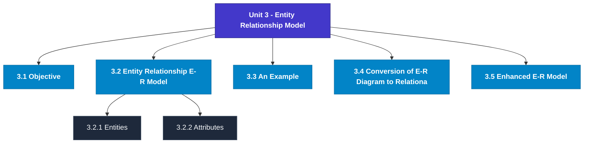

# MCS-207: Database Management Systems
## Unit 3: Entity Relationship Model

> 📚 **Programme:** M.Sc. (Data Science and Analytics) | **Semester:** Semester 1  
> ⏱️ **Estimated Study Time:** ~47 mins | 📄 **Textbook Pages:** 28 Pages  
> 📥 **Original PDF:** [Download & View Textbook](../../../pdfs/Semester_1/MCS-207_Database_Management_Systems/Unit-3_Entity_Relationship_Model.pdf)

---

### 🎯 Executive Concept & Data Science Relevance
In modern data systems, **Entity Relationship Model** forms a vital conceptual pillar. Relations form the mathematical blueprint of Relational Database Management Systems (RDBMS). Foreign keys, functional dependencies, equivalence partitioning in clustering, and partial orderings in graph dependency pipelines all originate directly from formal relation theory.

> [!NOTE]
> **Why this matters for your career:** Mastering entity relationship model equips you with the foundational principles required to reason mathematically about high-dimensional datasets, evaluate algorithm performance, and avoid statistical pitfalls in production machine learning pipelines.

### 🗺️ Visual Knowledge Architecture
The following concept map illustrates the structural hierarchy and learning trajectory of this module:

### 📖 Core Definitions & Terminology Cards
| Term | Formal Mathematical / Technical Definition | Intuitive Analogy / Concrete Example |
| :--- | :--- | :--- |
| **Binary Relation** | A binary relation $R$ from set $A$ to set $B$ is any subset of the Cartesian product $A \times B$, i.e., $R \subseteq A \times B$. If $(a, b) \in R$, we write $aRb$. | *A table connecting users to purchased items in an e-commerce platform.* |
| **Reflexive Relation** | A relation $R$ on set $A$ is reflexive if $\forall a \in A, (a, a) \in R$. Every element is related to itself. | *Equality ($a = a$) and the 'is subset of' relation ($A \subseteq A$) are reflexive.* |
| **Symmetric Relation** | A relation $R$ on $A$ is symmetric if $\forall a, b \in A, (a, b) \in R \implies (b, a) \in R$. | *A mutual friendship in a social network or an undirected edge in a graph.* |
| **Transitive Relation** | A relation $R$ on $A$ is transitive if $\forall a, b, c \in A, [(a, b) \in R \land (b, c) \in R] \implies (a, c) \in R$. | *Ancestry or inequality: If $a < b$ and $b < c$, then $a < c$.* |
| **Equivalence Relation** | A relation $R$ on $A$ that is simultaneously reflexive, symmetric, and transitive. It partitions $A$ into mutually disjoint equivalence classes. | *Clustering data points into distinct, non-overlapping groups based on identical feature attributes.* |

### ⚡ Governing Mathematical Laws & Formula Cheatsheet
#### 🔹 Total Relations on a Set

$$
\text{Total Relations on } A = 2^{\vert A\vert^2} = 2^{n^2} \quad \text{where } n = \vert A\vert
$$

- **Explanation:** Since $\vert A \times A \vert = n^2$, any relation is a subset of $A \times A$, yielding $2^{n^2}$ possible relations.

#### 🔹 Total Reflexive Relations

$$
\text{Reflexive Relations} = 2^{n(n - 1)}
$$

- **Explanation:** The $n$ diagonal pairs $(a, a)$ must all be included (1 choice each), leaving $n^2 - n = n(n-1)$ off-diagonal pairs with 2 choices each.

#### 🔹 Total Symmetric Relations

$$
\text{Symmetric Relations} = 2^{\frac{n(n + 1)}{2}}
$$

- **Explanation:** Determined entirely by choices on the diagonal ($n$) and the upper triangle ($n(n-1)/2$).

#### 🔹 Equivalence Class Definition

$$
[a] = \{x \in A \mid (x, a) \in R\}
$$

- **Explanation:** The collection of all elements in $A$ related to representative element $a$. The union of all equivalence classes equals $A$.

### 📌 Detailed Section-by-Section Study Breakdown
#### `3.1` Objective
- **Core Concept:** Establishes rigorous theoretical formulations and computational bounds for objective.
- **Core Concept:** Applies standard algorithmic procedures and mathematical invariants relevant to entity relationship model.
- **Core Concept:** Ensures deterministic performance guarantees across high-dimensional feature spaces.
- **Data Science Application:** Provides foundational structures used directly in statistical modeling, query execution, and machine learning pipelines.

> [!TIP]
> **Exam & Interview Tip:** Be prepared to state the formal definition of objective and derive its primary equations step-by-step.

#### `3.2` Entity Relationship (E-R) Model
- **Core Concept:** Establishes rigorous theoretical formulations and computational bounds for entity relationship (e-r) model.
- **Core Concept:** Applies standard algorithmic procedures and mathematical invariants relevant to entity relationship model.
- **Core Concept:** Ensures deterministic performance guarantees across high-dimensional feature spaces.
- **Data Science Application:** Provides foundational structures used directly in statistical modeling, query execution, and machine learning pipelines.

> [!TIP]
> **Exam & Interview Tip:** Be prepared to state the formal definition of entity relationship (e-r) model and derive its primary equations step-by-step.

#### `3.2.1` Entities
- **Core Concept:** Establishes rigorous theoretical formulations and computational bounds for entities.
- **Core Concept:** Applies standard algorithmic procedures and mathematical invariants relevant to entity relationship model.
- **Core Concept:** Ensures deterministic performance guarantees across high-dimensional feature spaces.
- **Data Science Application:** Provides foundational structures used directly in statistical modeling, query execution, and machine learning pipelines.

> [!TIP]
> **Exam & Interview Tip:** Be prepared to state the formal definition of entities and derive its primary equations step-by-step.

#### `3.2.2` Attributes
- **Core Concept:** Let us first define - What is an attribute?
- **Core Concept:** An attribute is an element of an entity, which can contain a representative value.
- **Core Concept:** In other words, an entity is represented by a set of attributes.
- **Data Science Application:** Provides foundational structures used directly in statistical modeling, query execution, and machine learning pipelines.

> [!TIP]
> **Exam & Interview Tip:** Be prepared to state the formal definition of attributes and derive its primary equations step-by-step.

#### `3.2.3` Relationships
- **Core Concept:** First, let us define the term relationships, i.e.
- **Core Concept:** Relationship Sets A relationship set is a set of relationships of the same type.
- **Core Concept:** For example, consider the relationship between two entity sets STUDENT and COURSE.
- **Data Science Application:** Provides foundational structures used directly in statistical modeling, query execution, and machine learning pipelines.

> [!TIP]
> **Exam & Interview Tip:** Be prepared to state the formal definition of relationships and derive its primary equations step-by-step.

#### `3.2.4` E-R diagram Basics
- **Core Concept:** The logical structure of a database is modeled using an E-R model, which is graphically represented with the help of an E-R diagram.
- **Core Concept:** Degree of a relationship set: The degree of a relationship set is the number of participating Entity sets.
- **Core Concept:** The relationship between two entities is called a binary relationship.
- **Data Science Application:** Provides foundational structures used directly in statistical modeling, query execution, and machine learning pipelines.

> [!TIP]
> **Exam & Interview Tip:** Be prepared to state the formal definition of e-r diagram basics and derive its primary equations step-by-step.

### 💡 Interactive Self-Assessment Checkpoints
Test your comprehension before proceeding. Tap each question to reveal the comprehensive explanation:

<b>Checkpoint 1:</b> What three properties are required for a relation to be an Equivalence Relation? <i>(Tap to reveal answer)</i>

> **Answer & Analysis:**  
> 1. Reflexivity: $\forall a \in A, (a,a) \in R$
2. Symmetry: $(a,b) \in R \implies (b,a) \in R$
3. Transitivity: $(a,b) \in R \land (b,c) \in R \implies (a,c) \in R$.

<b>Checkpoint 2:</b> What is a Partial Order Relation (Poset)? <i>(Tap to reveal answer)</i>

> **Answer & Analysis:**  
> A relation that is Reflexive, Antisymmetric ($(a,b) \in R \land (b,a) \in R \implies a = b$), and Transitive. Example: The subset relation $\subseteq$ on power sets.

<b>Checkpoint 3:</b> How many total relations exist on a set with 3 elements? <i>(Tap to reveal answer)</i>

> **Answer & Analysis:**  
> For $n = 3$, $\vert A \times A \vert = 3^2 = 9$. Total relations $= 2^9 = 512$.

<b>Checkpoint 4:</b> Convert the E-R diagram created for question 2 above into a relational database. ………………………………………………………………………… ………………………………………………………………………… <i>(Tap to reveal answer)</i>

> **Answer & Analysis:**  
> This question tests your conceptual mastery of Entity Relationship Model. Review the governing formulas and section breakdowns above to formulate a complete, rigorous proof or derivation.

<b>Checkpoint 5:</b> What is the use of the EER diagram? ………………………………………………………………………… ………………………………………………………………………… ………………………………………………………………………… <i>(Tap to reveal answer)</i>

> **Answer & Analysis:**  
> This question tests your conceptual mastery of Entity Relationship Model. Review the governing formulas and section breakdowns above to formulate a complete, rigorous proof or derivation.

<b>Checkpoint 6:</b> What are the constraints used in EER diagrams? ………………………………………………………………………… ………………………………………………………………………… ………………………………………………………………………… <i>(Tap to reveal answer)</i>

> **Answer & Analysis:**  
> This question tests your conceptual mastery of Entity Relationship Model. Review the governing formulas and section breakdowns above to formulate a complete, rigorous proof or derivation.

### 🎯 Executive Module Wrap-Up
- **Central Idea:** Entity Relationship Model provides essential mathematical and algorithmic tools directly utilized in Data Science.
- **Mathematical Rigor:** Formulas and laws must be memorized with attention to boundary conditions and assumptions.
- **Full Textbook Coverage:** For exhaustive multi-page derivations, proofs, and supplementary exercises, consult the [Authentic IGNOU Textbook](../../../pdfs/Semester_1/MCS-207_Database_Management_Systems/Unit-3_Entity_Relationship_Model.pdf).

---
### 🧭 Navigation & Syllabus Index
[⬅ Previous: Unit 2](unit_02_Relational_Database.md) | [📑 Course Index](README.md) | [Next: Unit 4 ➡](unit_04_File_Organisation_in_DBMS.md)
