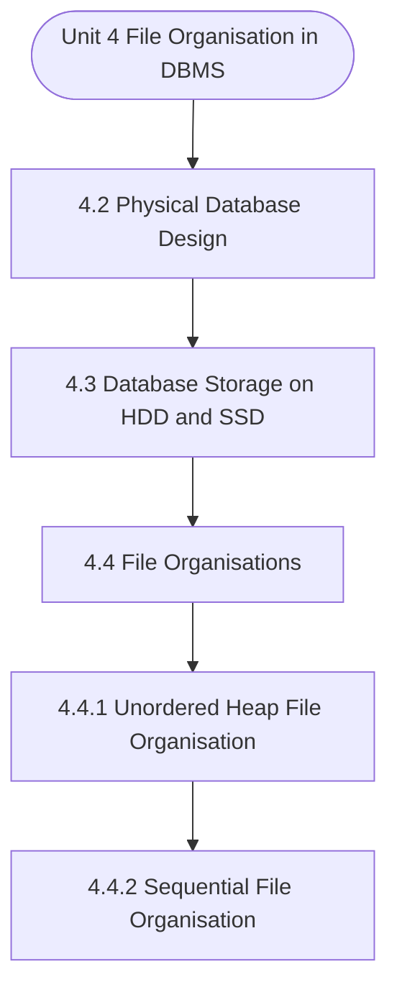

# MCS-207: Database Management Systems
## Unit 4: File Organisation in DBMS

> 📚 **Programme:** M.Sc. (Data Science and Analytics) | **Semester:** Semester 1  
> ⏱️ **Estimated Study Time:** ~56 mins | 📄 **Textbook Pages:** 27 Pages  
> 📥 **Original PDF:** [Download & View Authentic Textbook](../../../pdfs/Semester_1/MCS-207_Database_Management_Systems/Unit-4_File_Organisation_in_DBMS.pdf)

---

### 🎯 Executive Concept & Data Science Relevance
In modern data systems, **File Organisation in DBMS** forms a vital conceptual pillar. Relational algebra and SQL form the query engine of every data warehouse (Snowflake, BigQuery, Postgres). Concurrency protocols and normalization ensure data integrity and ACID consistency across concurrent transaction streams.

> [!NOTE]
> **Why this matters for your career:** Mastering file organisation in dbms equips you with the foundational principles required to reason mathematically about high-dimensional datasets, evaluate algorithm performance, and avoid statistical pitfalls in production machine learning pipelines.

### 🗺️ Visual Knowledge Architecture
The following concept map illustrates the structural hierarchy and learning trajectory of this module:



### 📖 Core Definitions & Terminology Cards

> 📌 **Relational Algebra**  
> - **Formal Definition:** A procedural query language consisting of a set of operations on relations: Select ( $\sigma$ ), Project ( $\pi$ ), Union ( $\cup$ ), Set Difference ( $-$ ), Cartesian Product ( $\times$ ), and Join ( $\bowtie$ ).  
> - 💡 **Practical Intuition & Analogy:** *The formal mathematical syntax executed behind SQL `SELECT` queries.*

> 📌 **ACID Properties**  
> - **Formal Definition:** Atomicity (all or nothing), Consistency (preserves invariants), Isolation (concurrent execution equivalent to serial), Durability (committed data survives crashes).  
> - 💡 **Practical Intuition & Analogy:** *The financial transaction guarantee: money cannot disappear between debit and credit.*

> 📌 **Functional Dependency $X \to Y$**  
> - **Formal Definition:** A constraint between two sets of attributes: for any two valid tuples $t_1, t_2$, if $t_1[X] = t_2[X]$, then $t_1[Y] = t_2[Y]$. Value of $X$ uniquely determines $Y$.  
> - 💡 **Practical Intuition & Analogy:** *`StudentID` uniquely determines `StudentName`.*

> 📌 **Third Normal Form (3NF) & BCNF**  
> - **Formal Definition:** A relation is in 3NF if for every non-trivial $X \to Y$, either $X$ is a superkey or $Y$ is a prime attribute. It is in BCNF if $X$ is strictly a superkey.  
> - 💡 **Practical Intuition & Analogy:** *Eliminates transitive dependencies so data is stored in exactly one canonical place without update anomalies.*

### ⚡ Governing Mathematical Laws & Formula Cheatsheet
#### 🔹 Relational Algebra Selection & Projection
$$
\sigma_{\text{condition}}(R) \quad \text{and} \quad \pi_{\text{attributes}}(R)
$$
- **Explanation:** $\sigma$ filters rows (equivalent to SQL `WHERE`), while $\pi$ selects specific columns (equivalent to SQL `SELECT column_list`).

#### 🔹 Relational Natural Join
$$
R \bowtie S = \pi_{\mathcal{A}(R) \cup \mathcal{A}(S)}\left(\sigma_{\text{match}}(R \times S)\right)
$$
- **Explanation:** Performs equality join across all identically named attributes between two tables.

#### 🔹 Two-Phase Locking (2PL) Theorem
$$
\text{Growing Phase: Only Acquire Locks} \implies \text{Shrinking Phase: Only Release Locks}
$$
- **Explanation:** Guarantees conflict serializability of concurrent database schedules without data race anomalies.

### ⚖️ Axiomatic Properties & Governing Laws
The mathematical formulations of this module are anchored by foundational algebraic and structural laws:

- **Armstrong's Reflexivity:** $Y \subseteq X \implies X \to Y$
- **Armstrong's Augmentation:** $X \to Y \implies XZ \to YZ$
- **Armstrong's Transitivity:** $X \to Y \land Y \to Z \implies X \to Z$

### 📌 Comprehensive Section-by-Section Study Breakdown
#### `4.2` Physical Database Design
##### 📘 Theoretical Principles & In-Depth Exposition
The section on **Physical Database Design** establishes rigorous theoretical foundations necessary for advanced computational modeling. It introduces formal mathematical structures and symbolic notations that guarantee consistency across proofs and algorithms.

In the broader scope of **File Organisation in DBMS**, understanding physical database design is essential to formalizing data representations, verifying boundary constraints, and ensuring computational determinism across multidimensional feature spaces.

##### ⚙️ Mathematical & Algorithmic Mechanics
- **Formal Mechanics:** Establishes symbolic transformations and state invariants governing physical database design.
- **Boundary Invariants:** Ensures robust error-handling, non-empty set guarantees, and strict asymptotic bounds.

##### 📊 Practical Data Science & Production Relevance
- **Industry Application:** Directly implemented in production workflows such as SQL query filters, pandas vectorized operations, and feature transformation pipelines.
- **Production Pitfall:** Failing to verify membership bounds or missing edge cases in physical database design can cause silent data corruption or performance bottlenecks.

> [!TIP]
> **Key Exam & Technical Interview Takeaway:** Be prepared to define physical database design formally, cite its core mathematical invariants, and solve step-by-step numerical/proof questions.

#### `4.3` Database Storage on HDD and SSD
##### 📘 Theoretical Principles & In-Depth Exposition
At this point, it is worthwhile to note the difference between the terms file Organisation and the access method. A file organisation refers to the organisation of the data records, which are part of a file, into a group of records that are placed in a block of secondary storage.

The file organisation also entails the access structures and interlinking of records. An access method is the way - how the data can be retrieved based on the file Organisation. Mostly the databases are stored persistently on HDD or SSD for the reasons given below: • The databases being very large may not fit completely in the main memory.

• Data of the database is to be stored permanently using non-volatile storage. • Primary storage is expensive, using secondary storage reduces the cost of the storage per unit. Each hard drive is usually composed of a set of disk platters. Each disk platter has a layer of magnetic material deposited on its surface.

##### ⚙️ Mathematical & Algorithmic Mechanics
- **Formal Mechanics:** Establishes symbolic transformations and state invariants governing database storage on hdd and ssd.
- **Boundary Invariants:** Ensures robust error-handling, non-empty set guarantees, and strict asymptotic bounds.

##### 📊 Practical Data Science & Production Relevance
- **Industry Application:** Directly implemented in production workflows such as SQL query filters, pandas vectorized operations, and feature transformation pipelines.
- **Production Pitfall:** Failing to verify membership bounds or missing edge cases in database storage on hdd and ssd can cause silent data corruption or performance bottlenecks.

> [!TIP]
> **Key Exam & Technical Interview Takeaway:** Be prepared to define database storage on hdd and ssd formally, cite its core mathematical invariants, and solve step-by-step numerical/proof questions.

#### `4.4` File Organisations
##### 📘 Theoretical Principles & In-Depth Exposition
File organisation is used to organise the content of a file on a secondary storage device. A good file organisation should support efficient data access and update operations on the content of a file, which is stored on the secondary storage. Data files are organised so as to facilitate access to records and to ensure their efficient storage.

A tradeoff between these two requirements generally exists: if rapid access is required, more storage space is required to make it possible. Selection of File Organisations is dependent on two factors, as shown below: • Typical DBMS applications may need to access a small subset of the data of a database at any given time.

• Whenever a portion of the data is needed by the DBMS; it is located on disk, copied to memory for processing, and rewritten to disk if the data was modified. A file of record is likely to be accessed and modified in a variety of ways, and different ways of arranging the records enable different operations over the file to be carried out efficiently.

##### ⚙️ Mathematical & Algorithmic Mechanics
- **Formal Mechanics:** Establishes symbolic transformations and state invariants governing file organisations.
- **Boundary Invariants:** Ensures robust error-handling, non-empty set guarantees, and strict asymptotic bounds.

##### 📊 Practical Data Science & Production Relevance
- **Industry Application:** Directly implemented in production workflows such as SQL query filters, pandas vectorized operations, and feature transformation pipelines.
- **Production Pitfall:** Failing to verify membership bounds or missing edge cases in file organisations can cause silent data corruption or performance bottlenecks.

> [!TIP]
> **Key Exam & Technical Interview Takeaway:** Be prepared to define file organisations formally, cite its core mathematical invariants, and solve step-by-step numerical/proof questions.

#### `4.4.1` Unordered Heap File Organisation
##### 📘 Theoretical Principles & In-Depth Exposition
Basically, these files are unordered files. It is the simplest and most basic type. These files consist of randomly ordered records. The records will have no particular ordering. The operations that you can perform on the records of a heap file are insert, retrieve and delete. The features of the heap file Organisation are: • New records can be inserted in any empty space that can accommodate them.

• When old records are deleted, the occupied space becomes empty and available for any new insertion. • If updated records grow, they may need to be relocated (moved) to a new empty space. Thus, this file organisation keeps a list of empty spaces. Advantages of heap files 1. This is a simple file Organisation.

Insertion is somehow efficient. Good for bulk-loading data into a table. Best if file scans are common or insertions are frequent. Disadvantages of heap files 1. Retrieval requires a linear search and is inefficient. Deletion can result in unused space/need for reorganisation.

##### ⚙️ Mathematical & Algorithmic Mechanics
- **Formal Mechanics:** Establishes symbolic transformations and state invariants governing unordered heap file organisation.
- **Boundary Invariants:** Ensures robust error-handling, non-empty set guarantees, and strict asymptotic bounds.

##### 📊 Practical Data Science & Production Relevance
- **Industry Application:** Directly implemented in production workflows such as SQL query filters, pandas vectorized operations, and feature transformation pipelines.
- **Production Pitfall:** Failing to verify membership bounds or missing edge cases in unordered heap file organisation can cause silent data corruption or performance bottlenecks.

> [!TIP]
> **Key Exam & Technical Interview Takeaway:** Be prepared to define unordered heap file organisation formally, cite its core mathematical invariants, and solve step-by-step numerical/proof questions.

#### `4.4.2` Sequential File Organisation
##### 📘 Theoretical Principles & In-Depth Exposition
In the sequential Organisation, records of the file are stored in sequence (or consecutively) by the primary key field values. In this organisation, the records can be accessed in the order of its primary key. This kind of file Organisation works well for tasks in which nearly every record of the file is required to be accessed, such as the payroll system.

Figure 4.2 shows this file organisation. File Organisation in DBMS Figure 4.2: Structure of sequential file A sequential file maintains the records in the logical sequence of its primary key values. Sequential files are inefficient for random access, however, are suitable for sequential access.

A sequential file can be stored on devices like magnetic tape that allow sequential access. On an average, to search a record in a sequential file would require looking into half of the records of the file. However, if a sequential file is stored on a disk (remember disks support direct access of its blocks) with keys stored separately from the rest of the record, then only those disk blocks are needed to be read that contains the desired record or records.

##### ⚙️ Mathematical & Algorithmic Mechanics
- **Formal Mechanics:** Establishes symbolic transformations and state invariants governing sequential file organisation.
- **Boundary Invariants:** Ensures robust error-handling, non-empty set guarantees, and strict asymptotic bounds.

##### 📊 Practical Data Science & Production Relevance
- **Industry Application:** Directly implemented in production workflows such as SQL query filters, pandas vectorized operations, and feature transformation pipelines.
- **Production Pitfall:** Failing to verify membership bounds or missing edge cases in sequential file organisation can cause silent data corruption or performance bottlenecks.

> [!TIP]
> **Key Exam & Technical Interview Takeaway:** Be prepared to define sequential file organisation formally, cite its core mathematical invariants, and solve step-by-step numerical/proof questions.

#### `4.4.3` Indexed (Indexed Sequential) File Organisation
##### 📘 Theoretical Principles & In-Depth Exposition
It organises the file like a large dictionary, i.e., records are stored in order of the key, but an index is kept which also permits a type of direct access. The records are stored sequentially by primary key values and there is an index built over the primary key field. To locate a record in a sequential file, which is not indexed sequential, on average, you may read about half the number of records.

Therefore, retrieval of a specific record in a sequential file is inefficient, especially if the file has a very large number of disk storage blocks. The use of index in a sequential file improves the query response time by adding an index, which is defined as a set of <index value, address> pair.

An index is a mechanism for faster search, as the size of the index is much smaller than the original file. Thus, an index may be contained entirely in the main memory of the computer. An indexed sequential file is a sequential file, which is stored in the order of its primary key, that contains an index on its primary key.

##### ⚙️ Mathematical & Algorithmic Mechanics
- **Formal Mechanics:** Establishes symbolic transformations and state invariants governing indexed (indexed sequential) file organisation.
- **Boundary Invariants:** Ensures robust error-handling, non-empty set guarantees, and strict asymptotic bounds.

##### 📊 Practical Data Science & Production Relevance
- **Industry Application:** Directly implemented in production workflows such as SQL query filters, pandas vectorized operations, and feature transformation pipelines.
- **Production Pitfall:** Failing to verify membership bounds or missing edge cases in indexed (indexed sequential) file organisation can cause silent data corruption or performance bottlenecks.

> [!TIP]
> **Key Exam & Technical Interview Takeaway:** Be prepared to define indexed (indexed sequential) file organisation formally, cite its core mathematical invariants, and solve step-by-step numerical/proof questions.

#### `4.4.4` Hashed File Organisation
##### 📘 Theoretical Principles & In-Depth Exposition
Hashed File Organisation Hashing is the most common form of purely random access to a file or database. It is also used as an optimisation technique to access columns that do not have an index. Hashing involves the use of a hash function. Input to a hash function is the value of the attribute or set of attributes of a record that are to be used for file organisation and the output is the block address or page address, where that record can be found.

##### ⚙️ Mathematical & Algorithmic Mechanics
- **Formal Mechanics:** Establishes symbolic transformations and state invariants governing hashed file organisation.
- **Boundary Invariants:** Ensures robust error-handling, non-empty set guarantees, and strict asymptotic bounds.

##### 📊 Practical Data Science & Production Relevance
- **Industry Application:** Directly implemented in production workflows such as SQL query filters, pandas vectorized operations, and feature transformation pipelines.
- **Production Pitfall:** Failing to verify membership bounds or missing edge cases in hashed file organisation can cause silent data corruption or performance bottlenecks.

> [!TIP]
> **Key Exam & Technical Interview Takeaway:** Be prepared to define hashed file organisation formally, cite its core mathematical invariants, and solve step-by-step numerical/proof questions.

#### `4.5` Indexes
##### 📘 Theoretical Principles & In-Depth Exposition
One of the terms used during the file organisation is the term index. In this section, let us define this term in more detail. Every printed book that you read, in general, has an index of keywords at the end. Notice that this index is a sorted list of keywords (index values) and page numbers (address) where the keyword can be found.

In databases also an index is defined in a similar way, as the <index value, address> pair. The basic advantage of having sorted index pages at the end of the book is that you can locate the description about a desired keyword in the book. You could have used the topic and subtopic listed in the table of contents, but it is not necessary that the given keyword can be found there; also, they are not in any sorted sequence.

If a keyword is not listed in index and table of contents, then you need to search each page of the book to find the required keyword, which is very cumbersome. Thus, an index at the back of the book helps in locating the required keyword references very easily in the book. The same is true for databases that have a very large number of records.

##### ⚙️ Mathematical & Algorithmic Mechanics
- **Formal Mechanics:** Establishes symbolic transformations and state invariants governing indexes.
- **Boundary Invariants:** Ensures robust error-handling, non-empty set guarantees, and strict asymptotic bounds.

##### 📊 Practical Data Science & Production Relevance
- **Industry Application:** Directly implemented in production workflows such as SQL query filters, pandas vectorized operations, and feature transformation pipelines.
- **Production Pitfall:** Failing to verify membership bounds or missing edge cases in indexes can cause silent data corruption or performance bottlenecks.

> [!TIP]
> **Key Exam & Technical Interview Takeaway:** Be prepared to define indexes formally, cite its core mathematical invariants, and solve step-by-step numerical/proof questions.

### 📐 Step-by-Step Solved Mathematical Examples
To solidify your theoretical understanding, work through these fully solved, step-by-step mathematical problems:

#### 🧮 Example 1: BCNF Normalization Decomposition
> **Problem Statement:**  
> Given relation $R(A, B, C, D)$ with functional dependencies $F = \lbrace A \to B, \; B \to C, \; C \to D \rbrace$. Find candidate keys, check if $R$ is in BCNF, and decompose if necessary.

**Detailed Step-by-Step Solution:**

1. **Candidate Key:** Closure $(A)^+ = \lbrace A, B, C, D \rbrace$. Thus $A$ is the sole candidate key.
2. **BCNF Test:**
- $A \to B$: $A$ is superkey (Passes BCNF).
- $B \to C$: $B$ is NOT a superkey (Violates BCNF).
- $C \to D$: $C$ is NOT a superkey (Violates BCNF).

3. **Decomposition:**
- Decompose on $B \to C$: $R_1(B, C)$ with $B \to C$ (In BCNF, key $B$), and $R_2(A, B, D)$ with $A \to B, B \to D$.
- In $R_2$, $B \to D$ violates BCNF ($B$ not superkey for $R_2$). Decompose $R_2$ into $R_{21}(B, D)$ and $R_{22}(A, B)$.

Final BCNF schema: $R_1(B, C), \; R_{21}(B, D), \; R_{22}(A, B)$ (Lossless and dependency preserving).

#### 🧮 Example 2: Relational Algebra to SQL Translation
> **Problem Statement:**  
> Express relational algebra query $\pi_{\text{name, salary}}(\sigma_{\text{dept}='Analytics' \land \text{salary} > 80000}(\text{Employees}))$ into standard SQL.

**Detailed Step-by-Step Solution:**

```sql
SELECT name, salary
FROM Employees
WHERE dept = 'Analytics' AND salary > 80000;
```

### 💻 Practical Data Science Implementation (Python)
Theory translates directly into production algorithms. Below is a self-contained, commented Python implementation illustrating the core operations of this unit:

```python
import pandas as pd

# Simulating Relational Algebra with Pandas
emp = pd.DataFrame({
    'emp_id': [1, 2, 3, 4],
    'name': ['Alice', 'Bob', 'Charlie', 'David'],
    'dept_id': [10, 10, 20, 30]
})

dept = pd.DataFrame({
    'dept_id': [10, 20, 40],
    'dept_name': ['Analytics', 'Engineering', 'HR']
})

# 1. Selection (Sigma): dept_id == 10
sel = emp[emp['dept_id'] == 10]

# 2. Projection (Pi): ['name', 'dept_id']
proj = sel[['name', 'dept_id']]

# 3. Natural Join (Bowtie): emp ⨝ dept
natural_join = pd.merge(emp, dept, on='dept_id', how='inner')

print("Natural Join Result:\n", natural_join[['name', 'dept_name']])
```

### 💡 Interactive Self-Assessment Checkpoints
Test your comprehension before proceeding. Tap each question to reveal the comprehensive explanation:

<details>
<summary><b>Checkpoint 1:</b> What does ACID stand for in database management? <i>(Tap to reveal answer)</i></summary>

> **Answer & Analysis:**  
> Atomicity, Consistency, Isolation, and Durability.
</details>

<details>
<summary><b>Checkpoint 2:</b> What is the difference between 3NF and BCNF? <i>(Tap to reveal answer)</i></summary>

> **Answer & Analysis:**  
> In 3NF, for any non-trivial $X \to Y$, $X$ must be a superkey OR $Y$ must be a prime attribute. In BCNF (Boyce-Codd Normal Form), $X$ MUST strictly be a superkey (eliminating all dependencies on prime attributes).
</details>

<details>
<summary><b>Checkpoint 3:</b> What is the relational algebra symbol for row selection and column projection? <i>(Tap to reveal answer)</i></summary>

> **Answer & Analysis:**  
> Row selection: $\sigma$ (Sigma). Column projection: $\pi$ (Pi).
</details>

<details>
<summary><b>Checkpoint 4:</b> List five operations on sequential file Organisation. Comment on the performance of each of these operations. …………………………………………………………………………………… …………………………………………………………………………………… <i>(Tap to reveal answer)</i></summary>

> **Answer & Analysis:**  
> This question tests your conceptual mastery of File Organisation in DBMS. Review the governing formulas and section breakdowns above to formulate a complete, rigorous proof or derivation.
</details>

<details>
<summary><b>Checkpoint 5:</b> What are Direct-Access systems? What can be the various strategies to achieve this? <i>(Tap to reveal answer)</i></summary>

> **Answer & Analysis:**  
> This question tests your conceptual mastery of File Organisation in DBMS. Review the governing formulas and section breakdowns above to formulate a complete, rigorous proof or derivation.
</details>

<details>
<summary><b>Checkpoint 6:</b> What is file organisation and what are the essential factors that are to be considered for a file organisation? <i>(Tap to reveal answer)</i></summary>

> **Answer & Analysis:**  
> This question tests your conceptual mastery of File Organisation in DBMS. Review the governing formulas and section breakdowns above to formulate a complete, rigorous proof or derivation.
</details>

### 🎯 Executive Module Wrap-Up
- **Central Idea:** File Organisation in DBMS provides essential mathematical and algorithmic tools directly utilized in Data Science.
- **Mathematical Rigor:** Formulas and laws must be memorized with attention to boundary conditions and assumptions.
- **Full Textbook Coverage:** For exhaustive multi-page derivations, proofs, and supplementary exercises, consult the [Authentic IGNOU Textbook](../../../pdfs/Semester_1/MCS-207_Database_Management_Systems/Unit-4_File_Organisation_in_DBMS.pdf).

---
### 🧭 Navigation & Syllabus Index
[⬅ Previous: Unit 3](unit_03_Entity_Relationship_Model.md) | [📑 Course Index](README.md) | [Next: Unit 5 ➡](unit_05_Database_Integrity,_Functional_Dependency_and_Norm.md)
