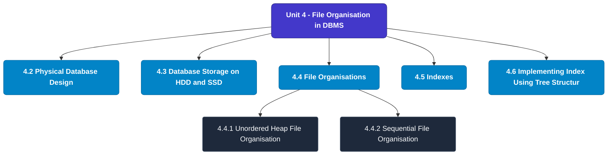

# MCS-207: Database Management Systems
## Unit 4: File Organisation in DBMS

> 📚 **Programme:** M.Sc. (Data Science and Analytics) | **Semester:** Semester 1  
> ⏱️ **Estimated Study Time:** ~56 mins | 📄 **Textbook Pages:** 27 Pages  
> 📥 **Original PDF:** [Download & View Textbook](../../../pdfs/Semester_1/MCS-207_Database_Management_Systems/Unit-4_File_Organisation_in_DBMS.pdf)

---

### 🎯 Executive Concept & Data Science Relevance
In modern data systems, **File Organisation in DBMS** forms a vital conceptual pillar. Relational algebra and SQL form the query engine of every data warehouse (Snowflake, BigQuery, Postgres). Concurrency protocols and normalization ensure data integrity and ACID consistency across concurrent transaction streams.

> [!NOTE]
> **Why this matters for your career:** Mastering file organisation in dbms equips you with the foundational principles required to reason mathematically about high-dimensional datasets, evaluate algorithm performance, and avoid statistical pitfalls in production machine learning pipelines.

### 🗺️ Visual Knowledge Architecture
The following concept map illustrates the structural hierarchy and learning trajectory of this module:

### 📖 Core Definitions & Terminology Cards
| Term | Formal Mathematical / Technical Definition | Intuitive Analogy / Concrete Example |
| :--- | :--- | :--- |
| **Relational Algebra** | A procedural query language consisting of a set of operations on relations: Select ($\sigma$), Project ($\pi$), Union ($\cup$), Set Difference ($-$), Cartesian Product ($\times$), and Join ($\bowtie$). | *The formal mathematical syntax executed behind SQL `SELECT` queries.* |
| **ACID Properties** | Atomicity (all or nothing), Consistency (preserves invariants), Isolation (concurrent execution equivalent to serial), Durability (committed data survives crashes). | *The financial transaction guarantee: money cannot disappear between debit and credit.* |
| **Functional Dependency $X \to Y$** | A constraint between two sets of attributes: for any two valid tuples $t_1, t_2$, if $t_1[X] = t_2[X]$, then $t_1[Y] = t_2[Y]$. Value of $X$ uniquely determines $Y$. | *`StudentID` uniquely determines `StudentName`.* |
| **Third Normal Form (3NF) & BCNF** | A relation is in 3NF if for every non-trivial $X \to Y$, either $X$ is a superkey or $Y$ is a prime attribute. It is in BCNF if $X$ is strictly a superkey. | *Eliminates transitive dependencies so data is stored in exactly one canonical place without update anomalies.* |

### ⚡ Governing Mathematical Laws & Formula Cheatsheet
#### 🔹 Relational Algebra Selection & Projection
$$\sigma_{\text{condition}}(R) \quad \text{and} \quad \pi_{\text{attributes}}(R)$$
- **Explanation:** $\sigma$ filters rows (equivalent to SQL `WHERE`), while $\pi$ selects specific columns (equivalent to SQL `SELECT column_list`).

#### 🔹 Relational Natural Join
$$R \bowtie S = \pi_{\text{Attr}(R) \cup \text{Attr}(S)}(\sigma_{R.A_1 = S.A_1 \land \dots}(R \times S))$$
- **Explanation:** Performs equality join across all identically named attributes between two tables.

#### 🔹 Two-Phase Locking (2PL) Theorem
$$\text{Growing Phase: Only Acquire Locks} \implies \text{Shrinking Phase: Only Release Locks}$$
- **Explanation:** Guarantees conflict serializability of concurrent database schedules without data race anomalies.

### 📌 Detailed Section-by-Section Study Breakdown
#### `4.2` Physical Database Design
- **Core Concept:** Establishes rigorous theoretical formulations and computational bounds for physical database design.
- **Core Concept:** Applies standard algorithmic procedures and mathematical invariants relevant to file organisation in dbms.
- **Core Concept:** Ensures deterministic performance guarantees across high-dimensional feature spaces.
- **Data Science Application:** Provides foundational structures used directly in statistical modeling, query execution, and machine learning pipelines.

> [!TIP]
> **Exam & Interview Tip:** Be prepared to state the formal definition of physical database design and derive its primary equations step-by-step.

#### `4.3` Database Storage on HDD and SSD
- **Core Concept:** At this point, it is worthwhile to note the difference between the terms file Organisation and the access method.
- **Core Concept:** A file organisation refers to the organisation of the data records, which are part of a file, into a group of records that are placed in a block of secondary storage.
- **Core Concept:** The file organisation also entails the access structures and interlinking of records.
- **Data Science Application:** Provides foundational structures used directly in statistical modeling, query execution, and machine learning pipelines.

> [!TIP]
> **Exam & Interview Tip:** Be prepared to state the formal definition of database storage on hdd and ssd and derive its primary equations step-by-step.

#### `4.4` File Organisations
- **Core Concept:** Notice that records with different key values can be placed in a Block based on the hashing function.
- **Core Concept:** To search the location of a record, you can apply the hashing function on the key value and then search the hashed block.
- **Core Concept:** For example, if you are searching for the location of key 29, then the record can be found in 29 mod 4 = Block 1, read this Block in the main memory and do a linear search on key value to locate the record in the main memory.
- **Data Science Application:** Provides foundational structures used directly in statistical modeling, query execution, and machine learning pipelines.

> [!TIP]
> **Exam & Interview Tip:** Be prepared to state the formal definition of file organisations and derive its primary equations step-by-step.

#### `4.4.1` Unordered Heap File Organisation
- **Core Concept:** Basically, these files are unordered files.
- **Core Concept:** These files consist of randomly ordered records.
- **Core Concept:** The records will have no particular ordering.
- **Data Science Application:** Provides foundational structures used directly in statistical modeling, query execution, and machine learning pipelines.

> [!TIP]
> **Exam & Interview Tip:** Be prepared to state the formal definition of unordered heap file organisation and derive its primary equations step-by-step.

#### `4.4.2` Sequential File Organisation
- **Core Concept:** In the sequential Organisation, records of the file are stored in sequence (or consecutively) by the primary key field values.
- **Core Concept:** In this organisation, the records can be accessed in the order of its primary key.
- **Core Concept:** This kind of file Organisation works well for tasks in which nearly every record of the file is required to be accessed, such as the payroll system.
- **Data Science Application:** Provides foundational structures used directly in statistical modeling, query execution, and machine learning pipelines.

> [!TIP]
> **Exam & Interview Tip:** Be prepared to state the formal definition of sequential file organisation and derive its primary equations step-by-step.

#### `4.4.3` Indexed (Indexed Sequential) File Organisation
- **Core Concept:** It organises the file like a large dictionary, i.e., records are stored in order of the key, but an index is kept which also permits a type of direct access.
- **Core Concept:** The records are stored sequentially by primary key values and there is an index built over the primary key field.
- **Core Concept:** To locate a record in a sequential file, which is not indexed sequential, on average, you may read about half the number of records.
- **Data Science Application:** Provides foundational structures used directly in statistical modeling, query execution, and machine learning pipelines.

> [!TIP]
> **Exam & Interview Tip:** Be prepared to state the formal definition of indexed (indexed sequential) file organisation and derive its primary equations step-by-step.

### 💡 Interactive Self-Assessment Checkpoints
Test your comprehension before proceeding. Tap each question to reveal the comprehensive explanation:

<b>Checkpoint 1:</b> What does ACID stand for in database management? <i>(Tap to reveal answer)</i>

> **Answer & Analysis:**  
> Atomicity, Consistency, Isolation, and Durability.

<b>Checkpoint 2:</b> What is the difference between 3NF and BCNF? <i>(Tap to reveal answer)</i>

> **Answer & Analysis:**  
> In 3NF, for any non-trivial $X \to Y$, $X$ must be a superkey OR $Y$ must be a prime attribute. In BCNF (Boyce-Codd Normal Form), $X$ MUST strictly be a superkey (eliminating all dependencies on prime attributes).

<b>Checkpoint 3:</b> What is the relational algebra symbol for row selection and column projection? <i>(Tap to reveal answer)</i>

> **Answer & Analysis:**  
> Row selection: $\sigma$ (Sigma). Column projection: $\pi$ (Pi).

<b>Checkpoint 4:</b> List five operations on sequential file Organisation. Comment on the performance of each of these operations. …………………………………………………………………………………… …………………………………………………………………………………… <i>(Tap to reveal answer)</i>

> **Answer & Analysis:**  
> This question tests your conceptual mastery of File Organisation in DBMS. Review the governing formulas and section breakdowns above to formulate a complete, rigorous proof or derivation.

<b>Checkpoint 5:</b> What are Direct-Access systems? What can be the various strategies to achieve this? <i>(Tap to reveal answer)</i>

> **Answer & Analysis:**  
> This question tests your conceptual mastery of File Organisation in DBMS. Review the governing formulas and section breakdowns above to formulate a complete, rigorous proof or derivation.

<b>Checkpoint 6:</b> What is file organisation and what are the essential factors that are to be considered for a file organisation? <i>(Tap to reveal answer)</i>

> **Answer & Analysis:**  
> This question tests your conceptual mastery of File Organisation in DBMS. Review the governing formulas and section breakdowns above to formulate a complete, rigorous proof or derivation.

### 🎯 Executive Module Wrap-Up
- **Central Idea:** File Organisation in DBMS provides essential mathematical and algorithmic tools directly utilized in Data Science.
- **Mathematical Rigor:** Formulas and laws must be memorized with attention to boundary conditions and assumptions.
- **Full Textbook Coverage:** For exhaustive multi-page derivations, proofs, and supplementary exercises, consult the [Authentic IGNOU Textbook](../../../pdfs/Semester_1/MCS-207_Database_Management_Systems/Unit-4_File_Organisation_in_DBMS.pdf).

---
### 🧭 Navigation & Syllabus Index
[⬅ Previous: Unit 3](unit_03_Entity_Relationship_Model.md) | [📑 Course Index](README.md) | [Next: Unit 5 ➡](unit_05_Database_Integrity,_Functional_Dependency_and_Norm.md)
