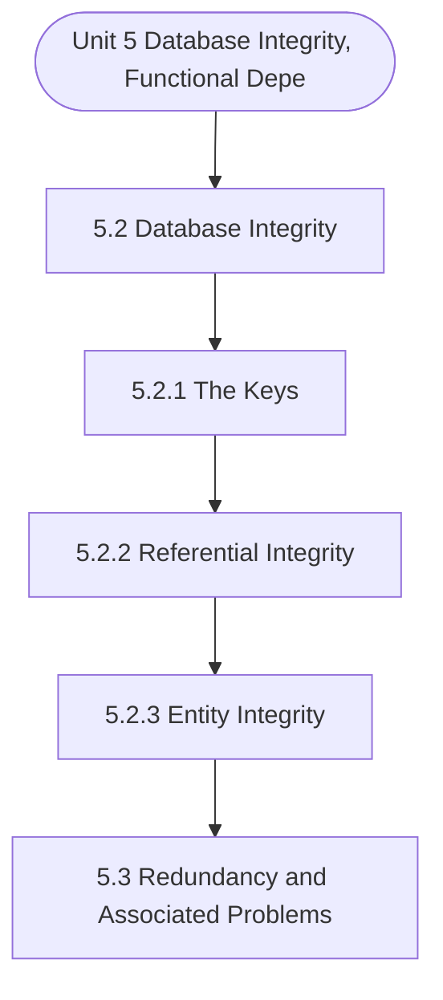

# MCS-207: Database Management Systems
## Unit 5: Database Integrity, Functional Dependency and Normalisation

> 📚 **Programme:** M.Sc. (Data Science and Analytics) | **Semester:** Semester 1  
> ⏱️ **Estimated Study Time:** ~55 mins | 📄 **Textbook Pages:** 26 Pages  
> 📥 **Original PDF:** [Download & View Textbook](../../../pdfs/Semester_1/MCS-207_Database_Management_Systems/Unit-5_Database_Integrity,_Functional_Dependency_and_Normalisation.pdf)

---

### 🎯 Executive Concept & Data Science Relevance
In modern data systems, **Database Integrity, Functional Dependency and Normalisation** forms a vital conceptual pillar. Functions are deterministic mappings between inputs and outputs. In machine learning, a predictive model is an approximating function $\hat{y} = f(\mathbf{x}; \mathbf{\theta})$. Understanding injective, surjective, and bijective mappings is essential for dimensionality reduction, autoencoders, and invertibility.

> [!NOTE]
> **Why this matters for your career:** Mastering database integrity, functional dependency and normalisation equips you with the foundational principles required to reason mathematically about high-dimensional datasets, evaluate algorithm performance, and avoid statistical pitfalls in production machine learning pipelines.

### 🗺️ Visual Knowledge Architecture
The following concept map illustrates the structural hierarchy and learning trajectory of this module:

### 📖 Core Definitions & Terminology Cards

> 📌 **Function (Mapping)**  
> - **Formal Definition:** A relation $f: A \to B$ that associates every element $x \in A$ with a unique element $y \in B$, written as $y = f(x)$. Set $A$ is the domain, $B$ is the codomain, and $f(A) \subseteq B$ is the range.  
> - 💡 **Practical Intuition & Analogy:** *A Python function that guarantees returning exactly one output for every valid input.*

> 📌 **Injective (One-to-One)**  
> - **Formal Definition:** A function $f: A \to B$ is injective if $f(x_1) = f(x_2) \implies x_1 = x_2$, or equivalently $x_1 \neq x_2 \implies f(x_1) \neq f(x_2)$. No two inputs share the same output.  
> - 💡 **Practical Intuition & Analogy:** *A cryptographic hash without collisions or a primary key assignment.*

> 📌 **Surjective (Onto)**  
> - **Formal Definition:** A function $f: A \to B$ is surjective if $\forall y \in B, \exists x \in A$ such that $f(x) = y$. The range equals the codomain: $f(A) = B$.  
> - 💡 **Practical Intuition & Analogy:** *Every possible category in the target space is covered by at least one training observation.*

> 📌 **Bijective (One-to-One & Onto)**  
> - **Formal Definition:** A function that is simultaneously injective and surjective. Guarantees a strict 1-to-1 correspondence between domain $A$ and codomain $B$.  
> - 💡 **Practical Intuition & Analogy:** *A perfectly reversible transformation, like converting Celsius to Fahrenheit.*

### ⚡ Governing Mathematical Laws & Formula Cheatsheet
#### 🔹 Function Invertibility Condition
$$
f^{-1}: B \to A \text{ exists if and only if } f \text{ is Bijective}
$$
- **Explanation:** If not injective, the inverse is multi-valued; if not surjective, the inverse is undefined on parts of $B$.

#### 🔹 Composition of Functions
$$
(g \circ f)(x) = g(f(x)) \quad \text{where } f: A \to B, \; g: B \to C
$$
- **Explanation:** Chaining sequential data transformations, such as scaling data then applying a classifier.

#### 🔹 Pigeonhole Principle
$$
\text{If } n > k \text{ items are placed into } k \text{ bins, at least one bin contains } \ge \lceil n/k \rceil \text{ items}
$$
- **Explanation:** Guarantees hash collisions when the number of records exceeds the hash table capacity.

### 📌 Detailed Section-by-Section Study Breakdown
#### `5.2` Database Integrity
- **Core Concept:** Establishes theoretical foundations, axiomatic formulations, and properties of database integrity.
- **Core Concept:** Analyzes standard algorithmic workflows and mathematical transformations relevant to database integrity, functional dependency and normalisation.
- **Core Concept:** Applies computational bounds and optimization guarantees across data processing workflows.
- **Data Science Application:** Provides foundational structures used directly in statistical modeling, query execution, and machine learning pipelines.

> [!TIP]
> **Exam & Interview Tip:** Be prepared to state the formal definition of database integrity and derive its primary equations step-by-step.

#### `5.2.1` The Keys
- **Core Concept:** Establishes theoretical foundations, axiomatic formulations, and properties of the keys.
- **Core Concept:** Analyzes standard algorithmic workflows and mathematical transformations relevant to database integrity, functional dependency and normalisation.
- **Core Concept:** Applies computational bounds and optimization guarantees across data processing workflows.
- **Data Science Application:** Provides foundational structures used directly in statistical modeling, query execution, and machine learning pipelines.

> [!TIP]
> **Exam & Interview Tip:** Be prepared to state the formal definition of the keys and derive its primary equations step-by-step.

#### `5.2.2` Referential Integrity
- **Core Concept:** It can be simply defined as: The database must not contain any unmatched foreign key values.
- **Core Concept:** For example, any value existing in the EMPID attribute in ASSIGNMENT relation must exist in the EMPLOYEE relation.
- **Core Concept:** If we want to add a tuple with EMPID value 104 in the ASSIGNMENT relation, it will cause violation of referential integrity constraint.
- **Data Science Application:** Provides foundational structures used directly in statistical modeling, query execution, and machine learning pipelines.

> [!TIP]
> **Exam & Interview Tip:** Be prepared to state the formal definition of referential integrity and derive its primary equations step-by-step.

#### `5.2.3` Entity Integrity
- **Core Concept:** Before describing the second type of integrity constraint, viz., Entity Integrity, you should be familiar with the concept of NULL.
- **Core Concept:** Basically, NULL is intended as a basis for dealing with the problem of missing information.
- **Core Concept:** This kind of situation is frequently encountered in the real world.
- **Data Science Application:** Provides foundational structures used directly in statistical modeling, query execution, and machine learning pipelines.

> [!TIP]
> **Exam & Interview Tip:** Be prepared to state the formal definition of entity integrity and derive its primary equations step-by-step.

#### `5.3` Redundancy and Associated Problems
- **Core Concept:** Let us consider the following relation STUDENT.
- **Core Concept:** Conceptually it is convenient to have all the information in one relation, as a single query to the database may produce complete information about a person.
- **Core Concept:** For example, the student, whose enrolment number is 050112345 has a name - Rohan and the student stays at an address “D-27, Main Road, Ranchi”.
- **Data Science Application:** Provides foundational structures used directly in statistical modeling, query execution, and machine learning pipelines.

> [!TIP]
> **Exam & Interview Tip:** Be prepared to state the formal definition of redundancy and associated problems and derive its primary equations step-by-step.

#### `5.4` Functional Dependencies
- **Core Concept:** The information is either single-valued or multi-valued.
- **Core Concept:** The enrolment number of a student and his/her date of birth are single-valued information; qualifications of a person or subjects that an instructor teaches are multi-valued facts.
- **Core Concept:** In this section, we will deal with single-valued facts, which forms the basis of the concept of functional dependency.
- **Data Science Application:** Provides foundational structures used directly in statistical modeling, query execution, and machine learning pipelines.

> [!TIP]
> **Exam & Interview Tip:** Be prepared to state the formal definition of functional dependencies and derive its primary equations step-by-step.

### 💡 Interactive Self-Assessment Checkpoints
Test your comprehension before proceeding. Tap each question to reveal the comprehensive explanation:

<b>Checkpoint 1:</b> What condition must a function satisfy to possess an inverse $f^{-1}$? <i>(Tap to reveal answer)</i>

> **Answer & Analysis:**  
> The function must be **Bijective** (both injective/one-to-one and surjective/onto).

<b>Checkpoint 2:</b> If $f(x) = 2x + 3$, find the inverse function $f^{-1}(x)$. <i>(Tap to reveal answer)</i>

> **Answer & Analysis:**  
> Let $y = 2x + 3 \implies y - 3 = 2x \implies x = \frac{y - 3}{2}$. Therefore, $f^{-1}(x) = \frac{x - 3}{2}$.

<b>Checkpoint 3:</b> Is the function $f(x) = x^2$ from $\mathbb{R} \to \mathbb{R}$ injective? Why? <i>(Tap to reveal answer)</i>

> **Answer & Analysis:**  
> No, because $f(-2) = 4$ and $f(2) = 4$. Distinct inputs produce identical outputs.

<b>Checkpoint 4:</b> Which of the relations S, P, J, SPJ has referential constraints? List those constraints. …………………………………………………………………………………… …………………………………………………………………………………… …………………………………………………………………………………… …………………………………………………………………………………… <i>(Tap to reveal answer)</i>

> **Answer & Analysis:**  
> This question tests your conceptual mastery of Database Integrity, Functional Dependency and Normalisation. Review the governing formulas and section breakdowns above to formulate a complete, rigorous proof or derivation.

<b>Checkpoint 5:</b> Identify the functional dependencies in the relation given in question 1. What are the candidate keys and which of these can be a primary key? <i>(Tap to reveal answer)</i>

> **Answer & Analysis:**  
> This question tests your conceptual mastery of Database Integrity, Functional Dependency and Normalisation. Review the governing formulas and section breakdowns above to formulate a complete, rigorous proof or derivation.

<b>Checkpoint 6:</b> Normalise the relation of problem 1. ……………………………………………………………………………. ……………………………………………………………………………. ……………………………………………………………………………. ………………………………………………………………………….…. <i>(Tap to reveal answer)</i>

> **Answer & Analysis:**  
> This question tests your conceptual mastery of Database Integrity, Functional Dependency and Normalisation. Review the governing formulas and section breakdowns above to formulate a complete, rigorous proof or derivation.

### 🎯 Executive Module Wrap-Up
- **Central Idea:** Database Integrity, Functional Dependency and Normalisation provides essential mathematical and algorithmic tools directly utilized in Data Science.
- **Mathematical Rigor:** Formulas and laws must be memorized with attention to boundary conditions and assumptions.
- **Full Textbook Coverage:** For exhaustive multi-page derivations, proofs, and supplementary exercises, consult the [Authentic IGNOU Textbook](../../../pdfs/Semester_1/MCS-207_Database_Management_Systems/Unit-5_Database_Integrity,_Functional_Dependency_and_Normalisation.pdf).

---
### 🧭 Navigation & Syllabus Index
[⬅ Previous: Unit 4](unit_04_File_Organisation_in_DBMS.md) | [📑 Course Index](README.md) | [Next: Unit 6 ➡](unit_06_Higher_Normal_Forms.md)
