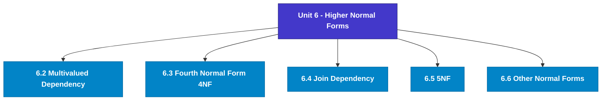

# MCS-207: Database Management Systems
## Unit 6: Higher Normal Forms

> 📚 **Programme:** M.Sc. (Data Science and Analytics) | **Semester:** Semester 1  
> ⏱️ **Estimated Study Time:** ~28 mins | 📄 **Textbook Pages:** 16 Pages  
> 📥 **Original PDF:** [Download & View Textbook](../../../pdfs/Semester_1/MCS-207_Database_Management_Systems/Unit-6_Higher_Normal_Forms.pdf)

---

### 🎯 Executive Concept & Data Science Relevance
In modern data systems, **Higher Normal Forms** forms a vital conceptual pillar. Relational algebra and SQL form the query engine of every data warehouse (Snowflake, BigQuery, Postgres). Concurrency protocols and normalization ensure data integrity and ACID consistency across concurrent transaction streams.

> [!NOTE]
> **Why this matters for your career:** Mastering higher normal forms equips you with the foundational principles required to reason mathematically about high-dimensional datasets, evaluate algorithm performance, and avoid statistical pitfalls in production machine learning pipelines.

### 🗺️ Visual Knowledge Architecture
The following concept map illustrates the structural hierarchy and learning trajectory of this module:

### 📖 Core Definitions & Terminology Cards
| Term | Formal Mathematical / Technical Definition | Intuitive Analogy / Concrete Example |
| :--- | :--- | :--- |
| **Relational Algebra** | A procedural query language consisting of a set of operations on relations: Select ($\sigma$), Project ($\pi$), Union ($\cup$), Set Difference ($-$), Cartesian Product ($\times$), and Join ($\bowtie$). | *The formal mathematical syntax executed behind SQL `SELECT` queries.* |
| **ACID Properties** | Atomicity (all or nothing), Consistency (preserves invariants), Isolation (concurrent execution equivalent to serial), Durability (committed data survives crashes). | *The financial transaction guarantee: money cannot disappear between debit and credit.* |
| **Functional Dependency $X \to Y$** | A constraint between two sets of attributes: for any two valid tuples $t_1, t_2$, if $t_1[X] = t_2[X]$, then $t_1[Y] = t_2[Y]$. Value of $X$ uniquely determines $Y$. | *`StudentID` uniquely determines `StudentName`.* |
| **Third Normal Form (3NF) & BCNF** | A relation is in 3NF if for every non-trivial $X \to Y$, either $X$ is a superkey or $Y$ is a prime attribute. It is in BCNF if $X$ is strictly a superkey. | *Eliminates transitive dependencies so data is stored in exactly one canonical place without update anomalies.* |

### ⚡ Governing Mathematical Laws & Formula Cheatsheet
#### 🔹 Relational Algebra Selection & Projection

$$
\sigma_{\text{condition}}(R) \quad \text{and} \quad \pi_{\text{attributes}}(R)
$$

- **Explanation:** $\sigma$ filters rows (equivalent to SQL `WHERE`), while $\pi$ selects specific columns (equivalent to SQL `SELECT column_list`).

#### 🔹 Relational Natural Join

$$
R \bowtie S = \pi_{\text{Attr}(R) \cup \text{Attr}(S)}(\sigma_{R.A_1 = S.A_1 \land \dots}(R \times S))
$$

- **Explanation:** Performs equality join across all identically named attributes between two tables.

#### 🔹 Two-Phase Locking (2PL) Theorem

$$
\text{Growing Phase: Only Acquire Locks} \implies \text{Shrinking Phase: Only Release Locks}
$$

- **Explanation:** Guarantees conflict serializability of concurrent database schedules without data race anomalies.

### 📌 Detailed Section-by-Section Study Breakdown
#### `6.2` Multivalued Dependency
- **Core Concept:** Establishes rigorous theoretical formulations and computational bounds for multivalued dependency.
- **Core Concept:** Applies standard algorithmic procedures and mathematical invariants relevant to higher normal forms.
- **Core Concept:** Ensures deterministic performance guarantees across high-dimensional feature spaces.
- **Data Science Application:** Provides foundational structures used directly in statistical modeling, query execution, and machine learning pipelines.

> [!TIP]
> **Exam & Interview Tip:** Be prepared to state the formal definition of multivalued dependency and derive its primary equations step-by-step.

#### `6.3` Fourth Normal Form (4NF)
- **Core Concept:** In this section, first we define the fourth normal form (4NF) and then present an example about how MVD can be used to decompose a relation to 4NF.
- **Core Concept:** A relation R is in 4NF if for all the multivalued dependencies (X ®® Y) any one of the following clauses holds: • the multivalued dependencies (X ®® Y) is trivial, • X is a candidate key for R.
- **Core Concept:** The dependency X®® ø or X ®® Y in a relation R (X, Y) is trivial, since they must hold for all R (X, Y).
- **Data Science Application:** Provides foundational structures used directly in statistical modeling, query execution, and machine learning pipelines.

> [!TIP]
> **Exam & Interview Tip:** Be prepared to state the formal definition of fourth normal form (4nf) and derive its primary equations step-by-step.

#### `6.4` Join Dependency
- **Core Concept:** The fifth normal form (5NF) (Project-Join normal form (PJNF)) deals with join-dependencies, which is a generalisation of the MVD.
- **Core Concept:** The aim of the fifth normal form is to have relations that cannot be decomposed further.
- **Core Concept:** A relation in 5NF cannot be constructed from several smaller relations.
- **Data Science Application:** Provides foundational structures used directly in statistical modeling, query execution, and machine learning pipelines.

> [!TIP]
> **Exam & Interview Tip:** Be prepared to state the formal definition of join dependency and derive its primary equations step-by-step.

#### `6.5` 5NF
- **Core Concept:** The researchers of database systems have found additional dependencies and normal forms.
- **Core Concept:** This section introduces the basic concept behind these forms.
- **Core Concept:** First, we define some additional types of dependencies.
- **Data Science Application:** Provides foundational structures used directly in statistical modeling, query execution, and machine learning pipelines.

> [!TIP]
> **Exam & Interview Tip:** Be prepared to state the formal definition of 5nf and derive its primary equations step-by-step.

#### `6.6` Other Normal Forms
- **Core Concept:** This unit explains the concept of multi-valued dependencies, which causes a relation to have data redundancy.
- **Core Concept:** This causes a relation to have data anomalies.
- **Core Concept:** MVD is a consequence of having a set of attributes in a relation that determines more than one multi-valued attribute, which are independent of each other.
- **Data Science Application:** Provides foundational structures used directly in statistical modeling, query execution, and machine learning pipelines.

> [!TIP]
> **Exam & Interview Tip:** Be prepared to state the formal definition of other normal forms and derive its primary equations step-by-step.

### 💡 Interactive Self-Assessment Checkpoints
Test your comprehension before proceeding. Tap each question to reveal the comprehensive explanation:

<b>Checkpoint 1:</b> What does ACID stand for in database management? <i>(Tap to reveal answer)</i>

> **Answer & Analysis:**  
> Atomicity, Consistency, Isolation, and Durability.

<b>Checkpoint 2:</b> What is the difference between 3NF and BCNF? <i>(Tap to reveal answer)</i>

> **Answer & Analysis:**  
> In 3NF, for any non-trivial $X \to Y$, $X$ must be a superkey OR $Y$ must be a prime attribute. In BCNF (Boyce-Codd Normal Form), $X$ MUST strictly be a superkey (eliminating all dependencies on prime attributes).

<b>Checkpoint 3:</b> What is the relational algebra symbol for row selection and column projection? <i>(Tap to reveal answer)</i>

> **Answer & Analysis:**  
> Row selection: $\sigma$ (Sigma). Column projection: $\pi$ (Pi).

<b>Checkpoint 4:</b> What are Multi-valued Dependencies? When can you say that a constraint X is multi-valued dependency? <i>(Tap to reveal answer)</i>

> **Answer & Analysis:**  
> This question tests your conceptual mastery of Higher Normal Forms. Review the governing formulas and section breakdowns above to formulate a complete, rigorous proof or derivation.

<b>Checkpoint 5:</b> Convert the following relation to 4NF relations. <i>(Tap to reveal answer)</i>

> **Answer & Analysis:**  
> This question tests your conceptual mastery of Higher Normal Forms. Review the governing formulas and section breakdowns above to formulate a complete, rigorous proof or derivation.

<b>Checkpoint 6:</b> What is join dependency? ………………………………………………………………………………………………………… ………………………………………………………………………………………………….. <i>(Tap to reveal answer)</i>

> **Answer & Analysis:**  
> This question tests your conceptual mastery of Higher Normal Forms. Review the governing formulas and section breakdowns above to formulate a complete, rigorous proof or derivation.

### 🎯 Executive Module Wrap-Up
- **Central Idea:** Higher Normal Forms provides essential mathematical and algorithmic tools directly utilized in Data Science.
- **Mathematical Rigor:** Formulas and laws must be memorized with attention to boundary conditions and assumptions.
- **Full Textbook Coverage:** For exhaustive multi-page derivations, proofs, and supplementary exercises, consult the [Authentic IGNOU Textbook](../../../pdfs/Semester_1/MCS-207_Database_Management_Systems/Unit-6_Higher_Normal_Forms.pdf).

---
### 🧭 Navigation & Syllabus Index
[⬅ Previous: Unit 5](unit_05_Database_Integrity,_Functional_Dependency_and_Norm.md) | [📑 Course Index](README.md) | [Next: Unit 7 ➡](unit_07_Structured_Query_Language.md)
