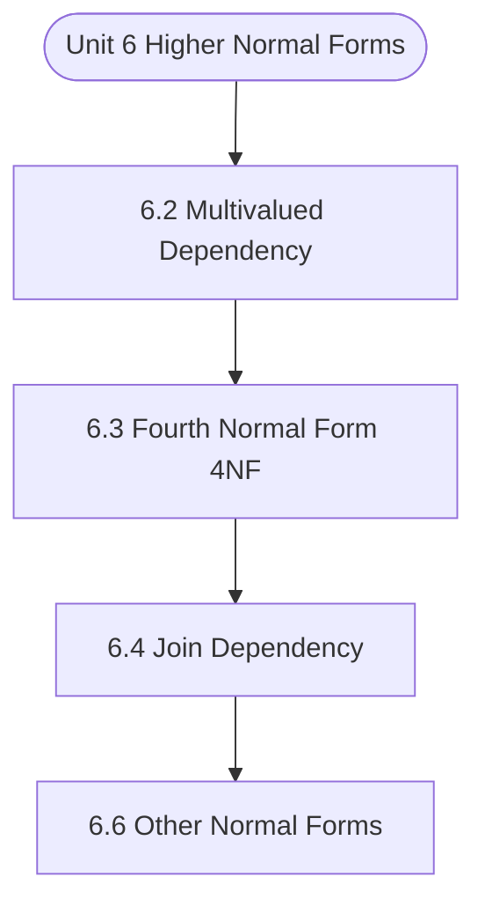

# MCS-207: Database Management Systems
## Unit 6: Higher Normal Forms

> 📚 **Programme:** M.Sc. (Data Science and Analytics) | **Semester:** Semester 1  
> ⏱️ **Estimated Study Time:** ~28 mins | 📄 **Textbook Pages:** 16 Pages  
> 📥 **Original PDF:** [Download & View Authentic Textbook](../../../pdfs/Semester_1/MCS-207_Database_Management_Systems/Unit-6_Higher_Normal_Forms.pdf)

---

### 🎯 Executive Concept & Data Science Relevance
In modern data systems, **Higher Normal Forms** forms a vital conceptual pillar. Relational algebra and SQL form the query engine of every data warehouse (Snowflake, BigQuery, Postgres). Concurrency protocols and normalization ensure data integrity and ACID consistency across concurrent transaction streams.

> [!NOTE]
> **Why this matters for your career:** Mastering higher normal forms equips you with the foundational principles required to reason mathematically about high-dimensional datasets, evaluate algorithm performance, and avoid statistical pitfalls in production machine learning pipelines.

### 🗺️ Visual Knowledge Architecture
The following concept map illustrates the structural hierarchy and learning trajectory of this module:



### 📖 Core Definitions & Terminology Cards

> 📌 **Relational Algebra**  
> - **Formal Definition:** A procedural query language consisting of a set of operations on relations: Select ( $\sigma$ ), Project ( $\pi$ ), Union ( $\cup$ ), Set Difference ( $-$ ), Cartesian Product ( $\times$ ), and Join ( $\bowtie$ ).  
> - 💡 **Practical Intuition & Analogy:** *The formal mathematical syntax executed behind SQL `SELECT` queries.*

> 📌 **ACID Properties**  
> - **Formal Definition:** Atomicity (all or nothing), Consistency (preserves invariants), Isolation (concurrent execution equivalent to serial), Durability (committed data survives crashes).  
> - 💡 **Practical Intuition & Analogy:** *The financial transaction guarantee: money cannot disappear between debit and credit.*

> 📌 **Functional Dependency $X \to Y$**  
> - **Formal Definition:** A constraint between two sets of attributes: for any two valid tuples $t_1, t_2$, if $t_1[X] = t_2[X]$, then $t_1[Y] = t_2[Y]$. Value of $X$ uniquely determines $Y$.  
> - 💡 **Practical Intuition & Analogy:** *`StudentID` uniquely determines `StudentName`.*

> 📌 **Third Normal Form (3NF) & BCNF**  
> - **Formal Definition:** A relation is in 3NF if for every non-trivial $X \to Y$, either $X$ is a superkey or $Y$ is a prime attribute. It is in BCNF if $X$ is strictly a superkey.  
> - 💡 **Practical Intuition & Analogy:** *Eliminates transitive dependencies so data is stored in exactly one canonical place without update anomalies.*

### ⚡ Governing Mathematical Laws & Formula Cheatsheet
#### 🔹 Relational Algebra Selection & Projection
$$
\sigma_{\text{condition}}(R) \quad \text{and} \quad \pi_{\text{attributes}}(R)
$$
- **Explanation:** $\sigma$ filters rows (equivalent to SQL `WHERE`), while $\pi$ selects specific columns (equivalent to SQL `SELECT column_list`).

#### 🔹 Relational Natural Join
$$
R \bowtie S = \pi_{\mathcal{A}(R) \cup \mathcal{A}(S)}\left(\sigma_{\text{match}}(R \times S)\right)
$$
- **Explanation:** Performs equality join across all identically named attributes between two tables.

#### 🔹 Two-Phase Locking (2PL) Theorem
$$
\text{Growing Phase: Only Acquire Locks} \implies \text{Shrinking Phase: Only Release Locks}
$$
- **Explanation:** Guarantees conflict serializability of concurrent database schedules without data race anomalies.

### ⚖️ Axiomatic Properties & Governing Laws
The mathematical formulations of this module are anchored by foundational algebraic and structural laws:

- **Armstrong's Reflexivity:** $Y \subseteq X \implies X \to Y$
- **Armstrong's Augmentation:** $X \to Y \implies XZ \to YZ$
- **Armstrong's Transitivity:** $X \to Y \land Y \to Z \implies X \to Z$

### 📌 Comprehensive Section-by-Section Study Breakdown
#### `6.2` Multivalued Dependency
##### 📘 Theoretical Principles & In-Depth Exposition
The section on **Multivalued Dependency** establishes rigorous theoretical foundations necessary for advanced computational modeling. It introduces formal mathematical structures and symbolic notations that guarantee consistency across proofs and algorithms.

In the broader scope of **Higher Normal Forms**, understanding multivalued dependency is essential to formalizing data representations, verifying boundary constraints, and ensuring computational determinism across multidimensional feature spaces.

##### ⚙️ Mathematical & Algorithmic Mechanics
- **Formal Mechanics:** Establishes symbolic transformations and state invariants governing multivalued dependency.
- **Boundary Invariants:** Ensures robust error-handling, non-empty set guarantees, and strict asymptotic bounds.

##### 📊 Practical Data Science & Production Relevance
- **Industry Application:** Directly implemented in production workflows such as SQL query filters, pandas vectorized operations, and feature transformation pipelines.
- **Production Pitfall:** Failing to verify membership bounds or missing edge cases in multivalued dependency can cause silent data corruption or performance bottlenecks.

> [!TIP]
> **Key Exam & Technical Interview Takeaway:** Be prepared to define multivalued dependency formally, cite its core mathematical invariants, and solve step-by-step numerical/proof questions.

#### `6.3` Fourth Normal Form (4NF)
##### 📘 Theoretical Principles & In-Depth Exposition
In this section, first we define the fourth normal form (4NF) and then present an example about how MVD can be used to decompose a relation to 4NF. A relation R is in 4NF if for all the multivalued dependencies (X ®® Y) any one of the following clauses holds: • the multivalued dependencies (X ®® Y) is trivial, • X is a candidate key for R.

The dependency X®® ø or X ®® Y in a relation R (X, Y) is trivial, since they must hold for all R (X, Y). In this case, R (X, Y) is in 4NF. Similarly, if in a relations R (A, B, C) with only three attributes, if a trivial MVD (A, B) ®® C holds, then R (A, B, C) is in 4NF. If a relation has more than one multivalued attribute, you should decompose it into the fourth normal form using the following rules of decomposition: For a relation R(X,Y,Z), if it contains two nontrivial MVDs X®®Y and X®®Z, then decompose the relation into R1 (X,Y) and R2 (X,Z) or more specifically, if there holds a non-trivial MVD in a relation R (X,Y,Z) of the form X ®®Y, such that X ∩Y=f, that is the set of attributes X and Y are disjoint, then R must be decomposed to R1 (X,Y) and R2 (X,Z), where Z represents all attributes other than those in X and Y.

Intuitively R is in 4NF if (1) All dependencies are a result of keys. (2) When multivalued dependencies exist, a relation should not contain two or more independent multivalued attributes. The decomposition of a relation to achieve 4NF would normally result in not only reduction of redundancies but also avoidance of anomalies.

##### ⚙️ Mathematical & Algorithmic Mechanics
- **Formal Mechanics:** Establishes symbolic transformations and state invariants governing fourth normal form (4nf).
- **Boundary Invariants:** Ensures robust error-handling, non-empty set guarantees, and strict asymptotic bounds.

##### 📊 Practical Data Science & Production Relevance
- **Industry Application:** Directly implemented in production workflows such as SQL query filters, pandas vectorized operations, and feature transformation pipelines.
- **Production Pitfall:** Failing to verify membership bounds or missing edge cases in fourth normal form (4nf) can cause silent data corruption or performance bottlenecks.

> [!TIP]
> **Key Exam & Technical Interview Takeaway:** Be prepared to define fourth normal form (4nf) formally, cite its core mathematical invariants, and solve step-by-step numerical/proof questions.

#### `6.4` Join Dependency
##### 📘 Theoretical Principles & In-Depth Exposition
As discussed in the previous section, a relation that suffers from insertion, update and deletion anomalies is decomposed using either FD or MVD. The normal forms require that a given relation R, if not in the given normal form, should be decomposed in two relations to meet the requirements of the normal form.

However, in some cases, a relation can have problems like redundancy leading to anomalies, yet it cannot be decomposed in two relations without loss of information. In such cases, it may be possible to decompose the relation in three or more relations. When does such a situation arise?

Such cases normally happen when a relation has at least three attributes such that all those values are totally independent of each other. It may also be the case when a ternary relationship exists among three entities. Following example explains this in detail. Consider a relation: ProjToolEmp (projectid, toolid, empid) There are no constraints on this relation that is: • Any project can use any tools • Any tool can be used by any employee • Any employee can work on any project • No employee would use all the tools • No employee would work on all the projects • No project uses all the tools • All three attributes are independent of each other Assume that the relation has the following relational instance: Tuple# projectid toolid empid P1 T1 E1 P2 T2 E2 P1 T2 E2 Figure 6.4: A ternary relation with all independent attributes The relation above does not have any FDs and MVDs since the attributes projectid, toolid and empid are independent; they are related to each other only by the pairings that have significant information in them.

##### ⚙️ Mathematical & Algorithmic Mechanics
- **Formal Mechanics:** Establishes symbolic transformations and state invariants governing join dependency.
- **Boundary Invariants:** Ensures robust error-handling, non-empty set guarantees, and strict asymptotic bounds.

##### 📊 Practical Data Science & Production Relevance
- **Industry Application:** Directly implemented in production workflows such as SQL query filters, pandas vectorized operations, and feature transformation pipelines.
- **Production Pitfall:** Failing to verify membership bounds or missing edge cases in join dependency can cause silent data corruption or performance bottlenecks.

> [!TIP]
> **Key Exam & Technical Interview Takeaway:** Be prepared to define join dependency formally, cite its core mathematical invariants, and solve step-by-step numerical/proof questions.

#### `6.5` 5NF
##### 📘 Theoretical Principles & In-Depth Exposition
The researchers of database systems have found additional dependencies and normal forms. This section introduces the basic concept behind these forms. First, we define some additional types of dependencies. Inclusion Dependency The inclusion dependency has been designed for two specific types of database constraints that are not defined by the concept of FD, MVD and Join dependency.

These two constraints are: • Foreign key constraints • Class/subclass relationships Please note that these constraints are between two relations. Therefore, it requires a new form of formal definition. We define it in the context of foreign key constraints. Consider two relations R1 and R2, which are related through a foreign key constraint such that a set of attributes in R1, say X, is the foreign key that references the relation R2 on a set of attributes, say Y.

Please note that attribute sets X and Y must have similar number of attributes and similar domains, so that foreign key constraint is applicable. The inclusion dependency for such a situation will be defined as follows: An inclusion dependency (denoted as R1.X < R2.Y) if the following relationship between the projections holds: 𝜋!(𝑟1) ⊆ 𝜋"(𝑟2) (1) Where r1 and r2 are the instances of relation R1 and R2 respectively at the same instance of time.

##### ⚙️ Mathematical & Algorithmic Mechanics
- **Formal Mechanics:** Establishes symbolic transformations and state invariants governing 5nf.
- **Boundary Invariants:** Ensures robust error-handling, non-empty set guarantees, and strict asymptotic bounds.

##### 📊 Practical Data Science & Production Relevance
- **Industry Application:** Directly implemented in production workflows such as SQL query filters, pandas vectorized operations, and feature transformation pipelines.
- **Production Pitfall:** Failing to verify membership bounds or missing edge cases in 5nf can cause silent data corruption or performance bottlenecks.

> [!TIP]
> **Key Exam & Technical Interview Takeaway:** Be prepared to define 5nf formally, cite its core mathematical invariants, and solve step-by-step numerical/proof questions.

#### `6.6` Other Normal Forms
##### 📘 Theoretical Principles & In-Depth Exposition
SUMMARY This unit explains the concept of multi-valued dependencies, which causes a relation to have data redundancy. This causes a relation to have data anomalies. MVD is a consequence of having a set of attributes in a relation that determines more than one multi-valued attribute, which are independent of each other.

MVD forms the basis of decomposition of a relation into 4NF relations. Further, certain relations do not have any FDs and MVDs but have anomalies. Such relations, in general, consist of more than two independent attributes. These relations contain join dependency, that is the relation has several projections, which can be joined losslessly to produce original relation.

The join dependency forms the basis for 5NF decomposition. The unit also discusses about the inclusion and template dependencies, which are designed to represent the constraints that cannot be assigned using FDs, MVDs and join dependencies. Finally, the unit introduces the concept of DKNF.

##### ⚙️ Mathematical & Algorithmic Mechanics
- **Formal Mechanics:** Establishes symbolic transformations and state invariants governing other normal forms.
- **Boundary Invariants:** Ensures robust error-handling, non-empty set guarantees, and strict asymptotic bounds.

##### 📊 Practical Data Science & Production Relevance
- **Industry Application:** Directly implemented in production workflows such as SQL query filters, pandas vectorized operations, and feature transformation pipelines.
- **Production Pitfall:** Failing to verify membership bounds or missing edge cases in other normal forms can cause silent data corruption or performance bottlenecks.

> [!TIP]
> **Key Exam & Technical Interview Takeaway:** Be prepared to define other normal forms formally, cite its core mathematical invariants, and solve step-by-step numerical/proof questions.

### 📐 Step-by-Step Solved Mathematical Examples
To solidify your theoretical understanding, work through these fully solved, step-by-step mathematical problems:

#### 🧮 Example 1: BCNF Normalization Decomposition
> **Problem Statement:**  
> Given relation $R(A, B, C, D)$ with functional dependencies $F = \lbrace A \to B, \; B \to C, \; C \to D \rbrace$. Find candidate keys, check if $R$ is in BCNF, and decompose if necessary.

**Detailed Step-by-Step Solution:**

1. **Candidate Key:** Closure $(A)^+ = \lbrace A, B, C, D \rbrace$. Thus $A$ is the sole candidate key.
2. **BCNF Test:**
- $A \to B$: $A$ is superkey (Passes BCNF).
- $B \to C$: $B$ is NOT a superkey (Violates BCNF).
- $C \to D$: $C$ is NOT a superkey (Violates BCNF).

3. **Decomposition:**
- Decompose on $B \to C$: $R_1(B, C)$ with $B \to C$ (In BCNF, key $B$), and $R_2(A, B, D)$ with $A \to B, B \to D$.
- In $R_2$, $B \to D$ violates BCNF ($B$ not superkey for $R_2$). Decompose $R_2$ into $R_{21}(B, D)$ and $R_{22}(A, B)$.

Final BCNF schema: $R_1(B, C), \; R_{21}(B, D), \; R_{22}(A, B)$ (Lossless and dependency preserving).

#### 🧮 Example 2: Relational Algebra to SQL Translation
> **Problem Statement:**  
> Express relational algebra query $\pi_{\text{name, salary}}(\sigma_{\text{dept}='Analytics' \land \text{salary} > 80000}(\text{Employees}))$ into standard SQL.

**Detailed Step-by-Step Solution:**

```sql
SELECT name, salary
FROM Employees
WHERE dept = 'Analytics' AND salary > 80000;
```

### 💻 Practical Data Science Implementation (Python)
Theory translates directly into production algorithms. Below is a self-contained, commented Python implementation illustrating the core operations of this unit:

```python
import pandas as pd

# Simulating Relational Algebra with Pandas
emp = pd.DataFrame({
    'emp_id': [1, 2, 3, 4],
    'name': ['Alice', 'Bob', 'Charlie', 'David'],
    'dept_id': [10, 10, 20, 30]
})

dept = pd.DataFrame({
    'dept_id': [10, 20, 40],
    'dept_name': ['Analytics', 'Engineering', 'HR']
})

# 1. Selection (Sigma): dept_id == 10
sel = emp[emp['dept_id'] == 10]

# 2. Projection (Pi): ['name', 'dept_id']
proj = sel[['name', 'dept_id']]

# 3. Natural Join (Bowtie): emp ⨝ dept
natural_join = pd.merge(emp, dept, on='dept_id', how='inner')

print("Natural Join Result:\n", natural_join[['name', 'dept_name']])
```

### 💡 Interactive Self-Assessment Checkpoints
Test your comprehension before proceeding. Tap each question to reveal the comprehensive explanation:

<details>
<summary><b>Checkpoint 1:</b> What does ACID stand for in database management? <i>(Tap to reveal answer)</i></summary>

> **Answer & Analysis:**  
> Atomicity, Consistency, Isolation, and Durability.
</details>

<details>
<summary><b>Checkpoint 2:</b> What is the difference between 3NF and BCNF? <i>(Tap to reveal answer)</i></summary>

> **Answer & Analysis:**  
> In 3NF, for any non-trivial $X \to Y$, $X$ must be a superkey OR $Y$ must be a prime attribute. In BCNF (Boyce-Codd Normal Form), $X$ MUST strictly be a superkey (eliminating all dependencies on prime attributes).
</details>

<details>
<summary><b>Checkpoint 3:</b> What is the relational algebra symbol for row selection and column projection? <i>(Tap to reveal answer)</i></summary>

> **Answer & Analysis:**  
> Row selection: $\sigma$ (Sigma). Column projection: $\pi$ (Pi).
</details>

<details>
<summary><b>Checkpoint 4:</b> What are Multi-valued Dependencies? When can you say that a constraint X is multi-valued dependency? <i>(Tap to reveal answer)</i></summary>

> **Answer & Analysis:**  
> This question tests your conceptual mastery of Higher Normal Forms. Review the governing formulas and section breakdowns above to formulate a complete, rigorous proof or derivation.
</details>

<details>
<summary><b>Checkpoint 5:</b> Convert the following relation to 4NF relations. <i>(Tap to reveal answer)</i></summary>

> **Answer & Analysis:**  
> This question tests your conceptual mastery of Higher Normal Forms. Review the governing formulas and section breakdowns above to formulate a complete, rigorous proof or derivation.
</details>

<details>
<summary><b>Checkpoint 6:</b> What is join dependency? ………………………………………………………………………………………………………… ………………………………………………………………………………………………….. <i>(Tap to reveal answer)</i></summary>

> **Answer & Analysis:**  
> This question tests your conceptual mastery of Higher Normal Forms. Review the governing formulas and section breakdowns above to formulate a complete, rigorous proof or derivation.
</details>

### 🎯 Executive Module Wrap-Up
- **Central Idea:** Higher Normal Forms provides essential mathematical and algorithmic tools directly utilized in Data Science.
- **Mathematical Rigor:** Formulas and laws must be memorized with attention to boundary conditions and assumptions.
- **Full Textbook Coverage:** For exhaustive multi-page derivations, proofs, and supplementary exercises, consult the [Authentic IGNOU Textbook](../../../pdfs/Semester_1/MCS-207_Database_Management_Systems/Unit-6_Higher_Normal_Forms.pdf).

---
### 🧭 Navigation & Syllabus Index
[⬅ Previous: Unit 5](unit_05_Database_Integrity,_Functional_Dependency_and_Norm.md) | [📑 Course Index](README.md) | [Next: Unit 7 ➡](unit_07_Structured_Query_Language.md)
