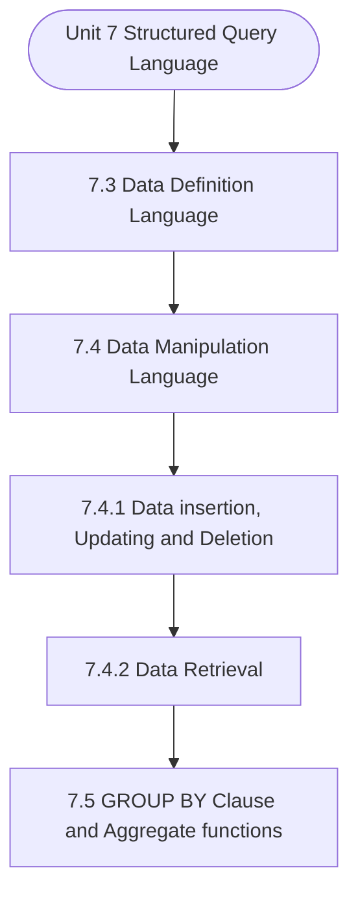

# MCS-207: Database Management Systems
## Unit 7: Structured Query Language

> 📚 **Programme:** M.Sc. (Data Science and Analytics) | **Semester:** Semester 1  
> ⏱️ **Estimated Study Time:** ~40 mins | 📄 **Textbook Pages:** 20 Pages  
> 📥 **Original PDF:** [Download & View Authentic Textbook](../../../pdfs/Semester_1/MCS-207_Database_Management_Systems/Unit-7_Structured_Query_Language.pdf)

---

### 🎯 Executive Concept & Data Science Relevance
In modern data systems, **Structured Query Language** forms a vital conceptual pillar. Relational algebra and SQL form the query engine of every data warehouse (Snowflake, BigQuery, Postgres). Concurrency protocols and normalization ensure data integrity and ACID consistency across concurrent transaction streams.

> [!NOTE]
> **Why this matters for your career:** Mastering structured query language equips you with the foundational principles required to reason mathematically about high-dimensional datasets, evaluate algorithm performance, and avoid statistical pitfalls in production machine learning pipelines.

### 🗺️ Visual Knowledge Architecture
The following concept map illustrates the structural hierarchy and learning trajectory of this module:



### 📖 Core Definitions & Terminology Cards

> 📌 **Relational Algebra**  
> - **Formal Definition:** A procedural query language consisting of a set of operations on relations: Select ( $\sigma$ ), Project ( $\pi$ ), Union ( $\cup$ ), Set Difference ( $-$ ), Cartesian Product ( $\times$ ), and Join ( $\bowtie$ ).  
> - 💡 **Practical Intuition & Analogy:** *The formal mathematical syntax executed behind SQL `SELECT` queries.*

> 📌 **ACID Properties**  
> - **Formal Definition:** Atomicity (all or nothing), Consistency (preserves invariants), Isolation (concurrent execution equivalent to serial), Durability (committed data survives crashes).  
> - 💡 **Practical Intuition & Analogy:** *The financial transaction guarantee: money cannot disappear between debit and credit.*

> 📌 **Functional Dependency $X \to Y$**  
> - **Formal Definition:** A constraint between two sets of attributes: for any two valid tuples $t_1, t_2$, if $t_1[X] = t_2[X]$, then $t_1[Y] = t_2[Y]$. Value of $X$ uniquely determines $Y$.  
> - 💡 **Practical Intuition & Analogy:** *`StudentID` uniquely determines `StudentName`.*

> 📌 **Third Normal Form (3NF) & BCNF**  
> - **Formal Definition:** A relation is in 3NF if for every non-trivial $X \to Y$, either $X$ is a superkey or $Y$ is a prime attribute. It is in BCNF if $X$ is strictly a superkey.  
> - 💡 **Practical Intuition & Analogy:** *Eliminates transitive dependencies so data is stored in exactly one canonical place without update anomalies.*

### ⚡ Governing Mathematical Laws & Formula Cheatsheet
#### 🔹 Relational Algebra Selection & Projection
$$
\sigma_{\text{condition}}(R) \quad \text{and} \quad \pi_{\text{attributes}}(R)
$$
- **Explanation:** $\sigma$ filters rows (equivalent to SQL `WHERE`), while $\pi$ selects specific columns (equivalent to SQL `SELECT column_list`).

#### 🔹 Relational Natural Join
$$
R \bowtie S = \pi_{\mathcal{A}(R) \cup \mathcal{A}(S)}\left(\sigma_{\text{match}}(R \times S)\right)
$$
- **Explanation:** Performs equality join across all identically named attributes between two tables.

#### 🔹 Two-Phase Locking (2PL) Theorem
$$
\text{Growing Phase: Only Acquire Locks} \implies \text{Shrinking Phase: Only Release Locks}
$$
- **Explanation:** Guarantees conflict serializability of concurrent database schedules without data race anomalies.

### ⚖️ Axiomatic Properties & Governing Laws
The mathematical formulations of this module are anchored by foundational algebraic and structural laws:

- **Armstrong's Reflexivity:** $Y \subseteq X \implies X \to Y$
- **Armstrong's Augmentation:** $X \to Y \implies XZ \to YZ$
- **Armstrong's Transitivity:** $X \to Y \land Y \to Z \implies X \to Z$

### 📌 Comprehensive Section-by-Section Study Breakdown
#### `7.3` Data Definition Language
##### 📘 Theoretical Principles & In-Depth Exposition
The section on **Data Definition Language** establishes rigorous theoretical foundations necessary for advanced computational modeling. It introduces formal mathematical structures and symbolic notations that guarantee consistency across proofs and algorithms.

In the broader scope of **Structured Query Language**, understanding data definition language is essential to formalizing data representations, verifying boundary constraints, and ensuring computational determinism across multidimensional feature spaces.

##### ⚙️ Mathematical & Algorithmic Mechanics
- **Formal Mechanics:** Establishes symbolic transformations and state invariants governing data definition language.
- **Boundary Invariants:** Ensures robust error-handling, non-empty set guarantees, and strict asymptotic bounds.

##### 📊 Practical Data Science & Production Relevance
- **Industry Application:** Directly implemented in production workflows such as SQL query filters, pandas vectorized operations, and feature transformation pipelines.
- **Production Pitfall:** Failing to verify membership bounds or missing edge cases in data definition language can cause silent data corruption or performance bottlenecks.

> [!TIP]
> **Key Exam & Technical Interview Takeaway:** Be prepared to define data definition language formally, cite its core mathematical invariants, and solve step-by-step numerical/proof questions.

#### `7.4` Data Manipulation Language
##### 📘 Theoretical Principles & In-Depth Exposition
Once you have created a database and database tables along with the necessary constraints, the next step is to insert data in the tables. While inserting the data in the tables, you may commit some mistakes or there may be the need of making certain changes in the data of the tables, therefore, you would be requiring SQL commands to INSERT, UPDATE and DELETE records in a database table.

These are Data manipulation language (DML) commands. These DML commands allow you to input and edit the data in the tables. Further, you would like to retrieve selected information from the database. In this section, first, we discuss the command to insert, update or delete the data followed by commands to retrieve information from the database.

You may please note that the changes made by the DML statements are made permanent only after these operations are COMMITTED. You will learn about

##### ⚙️ Mathematical & Algorithmic Mechanics
- **Formal Mechanics:** Establishes symbolic transformations and state invariants governing data manipulation language.
- **Boundary Invariants:** Ensures robust error-handling, non-empty set guarantees, and strict asymptotic bounds.

##### 📊 Practical Data Science & Production Relevance
- **Industry Application:** Directly implemented in production workflows such as SQL query filters, pandas vectorized operations, and feature transformation pipelines.
- **Production Pitfall:** Failing to verify membership bounds or missing edge cases in data manipulation language can cause silent data corruption or performance bottlenecks.

> [!TIP]
> **Key Exam & Technical Interview Takeaway:** Be prepared to define data manipulation language formally, cite its core mathematical invariants, and solve step-by-step numerical/proof questions.

#### `7.4.1` Data insertion, Updating and Deletion
##### 📘 Theoretical Principles & In-Depth Exposition
The DML commands are used for inputting and editing data in a database table. To insert data in a table, you may use the insert command, which is explained next. Inserting Data: The following command is used to insert a record into a table. The following two formats of insert commands are used: If you are inserting a record that had data for all the columns, then you can simply use the command format: INSERT INTO <name of the table> VALUES (v1, v2, v3, …); Please note that v1, v2, etc.

are the values that are to be inserted into the respective column of the database. For example, to insert data into the PROGRAMME table, you can use the following INSERT command: INSERT INTO PROGRAMME VALUES (“PGDCA”, “Postgraduate Diploma in Computer Applications”, 22000); Please note the following with respect to the insert command, given above: • The values inserted into the table would be PROGCODE as PGDCA; PROGNAME as Postgraduate Diploma in Computer Applications; and FEE as 22000.

• You can use parameters instead of actual values, for example, you can use INSERT INTO PROGRAMME VALUES (&1, &2, &3); These parameter values can be input at the time of execution of the query. • You can use a sub-query (which will be explained in the next unit) instead of the values given in the command in the (…).

##### ⚙️ Mathematical & Algorithmic Mechanics
- **Formal Mechanics:** Establishes symbolic transformations and state invariants governing data insertion, updating and deletion.
- **Boundary Invariants:** Ensures robust error-handling, non-empty set guarantees, and strict asymptotic bounds.

##### 📊 Practical Data Science & Production Relevance
- **Industry Application:** Directly implemented in production workflows such as SQL query filters, pandas vectorized operations, and feature transformation pipelines.
- **Production Pitfall:** Failing to verify membership bounds or missing edge cases in data insertion, updating and deletion can cause silent data corruption or performance bottlenecks.

> [!TIP]
> **Key Exam & Technical Interview Takeaway:** Be prepared to define data insertion, updating and deletion formally, cite its core mathematical invariants, and solve step-by-step numerical/proof questions.

#### `7.4.2` Data Retrieval
##### 📘 Theoretical Principles & In-Depth Exposition
One of the most popular features of any DBMS is the ad-hoc query facility, which requires data retrieval as per the need and access rights of the user. SELECT statement is one of the most used statements of DML, as it helps in the retrieval of requisite data. In this section, we discuss various clauses of this statement.

SELECT Statement: The following is the basic format of the select statement. SELECT <List of Column names or expressions to be displayed> FROM <List of Tables that contain the data, whose columns are in select> WHERE <Conditions for selection of records for display> ; The following are examples of the use of this statement for the retrieval of data from the two relations given in Figure 1.

Example 1: List the details of all the programmes of the University. For answering this query, are using one wildcard character (*), which represents all the columns of a table. Please note that in case, you have used * in an arithmetic expression in the SELECT clause, it will be treated as a multiplication sign.

##### ⚙️ Mathematical & Algorithmic Mechanics
- **Formal Mechanics:** Establishes symbolic transformations and state invariants governing data retrieval.
- **Boundary Invariants:** Ensures robust error-handling, non-empty set guarantees, and strict asymptotic bounds.

##### 📊 Practical Data Science & Production Relevance
- **Industry Application:** Directly implemented in production workflows such as SQL query filters, pandas vectorized operations, and feature transformation pipelines.
- **Production Pitfall:** Failing to verify membership bounds or missing edge cases in data retrieval can cause silent data corruption or performance bottlenecks.

> [!TIP]
> **Key Exam & Technical Interview Takeaway:** Be prepared to define data retrieval formally, cite its core mathematical invariants, and solve step-by-step numerical/proof questions.

#### `7.5` GROUP BY Clause and Aggregate functions
##### 📘 Theoretical Principles & In-Depth Exposition
In the previous section, you have gone through the concept of data manipulation language (DML). We have discussed the SELECT statement and its various clauses. In a database system, several queries require DBMS to produce information about a group. For example, you may be interested in finding the average marks of the group of PGDCA students vis-à-vis BCA students.

The SQL supports a GROUP BY clause for such cases. In addition, SQL also supports a number of functions that can find aggregate information for a group of records. These functions are required to find the sum, average, counting of records etc. These are called aggregate functions.

The following table defines some of the important aggregate functions used in SQL. count Used to count the number of records sum Finds the sum of the data of a column avg Finds the average of the data of a column max Finds the maximum value from the data of a column min Find the minimum value from the data of a column Figure 3: Some Aggregate functions in SQL Let us explain the use of these functions with the help of a few examples.

##### ⚙️ Mathematical & Algorithmic Mechanics
- **Formal Mechanics:** Establishes symbolic transformations and state invariants governing group by clause and aggregate functions.
- **Boundary Invariants:** Ensures robust error-handling, non-empty set guarantees, and strict asymptotic bounds.

##### 📊 Practical Data Science & Production Relevance
- **Industry Application:** Directly implemented in production workflows such as SQL query filters, pandas vectorized operations, and feature transformation pipelines.
- **Production Pitfall:** Failing to verify membership bounds or missing edge cases in group by clause and aggregate functions can cause silent data corruption or performance bottlenecks.

> [!TIP]
> **Key Exam & Technical Interview Takeaway:** Be prepared to define group by clause and aggregate functions formally, cite its core mathematical invariants, and solve step-by-step numerical/proof questions.

#### `7.6` Data Control Language
##### 📘 Theoretical Principles & In-Depth Exposition
The purpose of data control language (DCL) is to create users and assign access rights to them. In general, these commands are executed by a database administrator. The following are some of the most used DCL commands. Creating a new user: You can create a new user using the following command: CREATE USER < username for database user> IDENTIFIED BY < Password for the user> For example, you can create a new user with the username “PGDCA_Student” with the password “PGDCA123” CREATE USER PGDCA_Student IDENTIFIED BY PGDCA123 Use of GRANT Command: GRANT is used to give different kinds of accesses to a database user.

Block3 covers the basic aspects of the GRANT option. In general, SQL supports two kinds of access permissions: • The permissions that are at the system level. • The permissions at the level of an object, such as a table, record, column etc. The system-level permissions are, in general, specific to the DBMS environment, therefore, you may refer to the system documentation for details on such permissions.

In this section, we provide a basic introduction to object-level permissions with the help of examples. To give permission to get information from a table, the following SQL command may be used. GRANT SELECT ON STUDENT, PROGRAMME TO PGDCA_Student; To give permission for inserting and updating a record in the STUDENT table, you may use the following SQL command: GRANT INSERT, UPDATE ON STUDENT TO PGDCA_Student; In case you want to GRANT the SELECT access rights to more than one user on STUDENT table, then you may use the following command: GRANT SELECT ON STUDENT TO PGDCA_Student1, PGDCA_Student2; Use of REVOKE command: The REVOKE command is used to remove the access permissions that were granted to a user.

##### ⚙️ Mathematical & Algorithmic Mechanics
- **Formal Mechanics:** Establishes symbolic transformations and state invariants governing data control language.
- **Boundary Invariants:** Ensures robust error-handling, non-empty set guarantees, and strict asymptotic bounds.

##### 📊 Practical Data Science & Production Relevance
- **Industry Application:** Directly implemented in production workflows such as SQL query filters, pandas vectorized operations, and feature transformation pipelines.
- **Production Pitfall:** Failing to verify membership bounds or missing edge cases in data control language can cause silent data corruption or performance bottlenecks.

> [!TIP]
> **Key Exam & Technical Interview Takeaway:** Be prepared to define data control language formally, cite its core mathematical invariants, and solve step-by-step numerical/proof questions.

### 📐 Step-by-Step Solved Mathematical Examples
To solidify your theoretical understanding, work through these fully solved, step-by-step mathematical problems:

#### 🧮 Example 1: BCNF Normalization Decomposition
> **Problem Statement:**  
> Given relation $R(A, B, C, D)$ with functional dependencies $F = \lbrace A \to B, \; B \to C, \; C \to D \rbrace$. Find candidate keys, check if $R$ is in BCNF, and decompose if necessary.

**Detailed Step-by-Step Solution:**

1. **Candidate Key:** Closure $(A)^+ = \lbrace A, B, C, D \rbrace$. Thus $A$ is the sole candidate key.
2. **BCNF Test:**
- $A \to B$: $A$ is superkey (Passes BCNF).
- $B \to C$: $B$ is NOT a superkey (Violates BCNF).
- $C \to D$: $C$ is NOT a superkey (Violates BCNF).

3. **Decomposition:**
- Decompose on $B \to C$: $R_1(B, C)$ with $B \to C$ (In BCNF, key $B$), and $R_2(A, B, D)$ with $A \to B, B \to D$.
- In $R_2$, $B \to D$ violates BCNF ($B$ not superkey for $R_2$). Decompose $R_2$ into $R_{21}(B, D)$ and $R_{22}(A, B)$.

Final BCNF schema: $R_1(B, C), \; R_{21}(B, D), \; R_{22}(A, B)$ (Lossless and dependency preserving).

#### 🧮 Example 2: Relational Algebra to SQL Translation
> **Problem Statement:**  
> Express relational algebra query $\pi_{\text{name, salary}}(\sigma_{\text{dept}='Analytics' \land \text{salary} > 80000}(\text{Employees}))$ into standard SQL.

**Detailed Step-by-Step Solution:**

```sql
SELECT name, salary
FROM Employees
WHERE dept = 'Analytics' AND salary > 80000;
```

### 💻 Practical Data Science Implementation (Python)
Theory translates directly into production algorithms. Below is a self-contained, commented Python implementation illustrating the core operations of this unit:

```python
import pandas as pd

# Simulating Relational Algebra with Pandas
emp = pd.DataFrame({
    'emp_id': [1, 2, 3, 4],
    'name': ['Alice', 'Bob', 'Charlie', 'David'],
    'dept_id': [10, 10, 20, 30]
})

dept = pd.DataFrame({
    'dept_id': [10, 20, 40],
    'dept_name': ['Analytics', 'Engineering', 'HR']
})

# 1. Selection (Sigma): dept_id == 10
sel = emp[emp['dept_id'] == 10]

# 2. Projection (Pi): ['name', 'dept_id']
proj = sel[['name', 'dept_id']]

# 3. Natural Join (Bowtie): emp ⨝ dept
natural_join = pd.merge(emp, dept, on='dept_id', how='inner')

print("Natural Join Result:\n", natural_join[['name', 'dept_name']])
```

### 💡 Interactive Self-Assessment Checkpoints
Test your comprehension before proceeding. Tap each question to reveal the comprehensive explanation:

<details>
<summary><b>Checkpoint 1:</b> What does ACID stand for in database management? <i>(Tap to reveal answer)</i></summary>

> **Answer & Analysis:**  
> Atomicity, Consistency, Isolation, and Durability.
</details>

<details>
<summary><b>Checkpoint 2:</b> What is the difference between 3NF and BCNF? <i>(Tap to reveal answer)</i></summary>

> **Answer & Analysis:**  
> In 3NF, for any non-trivial $X \to Y$, $X$ must be a superkey OR $Y$ must be a prime attribute. In BCNF (Boyce-Codd Normal Form), $X$ MUST strictly be a superkey (eliminating all dependencies on prime attributes).
</details>

<details>
<summary><b>Checkpoint 3:</b> What is the relational algebra symbol for row selection and column projection? <i>(Tap to reveal answer)</i></summary>

> **Answer & Analysis:**  
> Row selection: $\sigma$ (Sigma). Column projection: $\pi$ (Pi).
</details>

<details>
<summary><b>Checkpoint 4:</b> List the advantages and disadvantages of using SQL. …………………………………………………………………………………….…………………… ……………………………………………………………….………………………………………… …………………………………………………………………………………….…………………… ……………………………………………………………….………………………………………… <i>(Tap to reveal answer)</i></summary>

> **Answer & Analysis:**  
> This question tests your conceptual mastery of Structured Query Language. Review the governing formulas and section breakdowns above to formulate a complete, rigorous proof or derivation.
</details>

<details>
<summary><b>Checkpoint 5:</b> • While booking the room the BookedFrom and BookedTo should follow the following relationship: Today’s Date <= BookedFrom <= BookedTo <i>(Tap to reveal answer)</i></summary>

> **Answer & Analysis:**  
> This question tests your conceptual mastery of Structured Query Language. Review the governing formulas and section breakdowns above to formulate a complete, rigorous proof or derivation.
</details>

<details>
<summary><b>Checkpoint 6:</b> Write the SQL commands to insert the following data in the STUDENT and PROGRAMME table. Highlight the errors, if any. <i>(Tap to reveal answer)</i></summary>

> **Answer & Analysis:**  
> This question tests your conceptual mastery of Structured Query Language. Review the governing formulas and section breakdowns above to formulate a complete, rigorous proof or derivation.
</details>

### 🎯 Executive Module Wrap-Up
- **Central Idea:** Structured Query Language provides essential mathematical and algorithmic tools directly utilized in Data Science.
- **Mathematical Rigor:** Formulas and laws must be memorized with attention to boundary conditions and assumptions.
- **Full Textbook Coverage:** For exhaustive multi-page derivations, proofs, and supplementary exercises, consult the [Authentic IGNOU Textbook](../../../pdfs/Semester_1/MCS-207_Database_Management_Systems/Unit-7_Structured_Query_Language.pdf).

---
### 🧭 Navigation & Syllabus Index
[⬅ Previous: Unit 6](unit_06_Higher_Normal_Forms.md) | [📑 Course Index](README.md) | [Next: Unit 8 ➡](unit_08_Structured_Query_Language_(Part-II).md)
