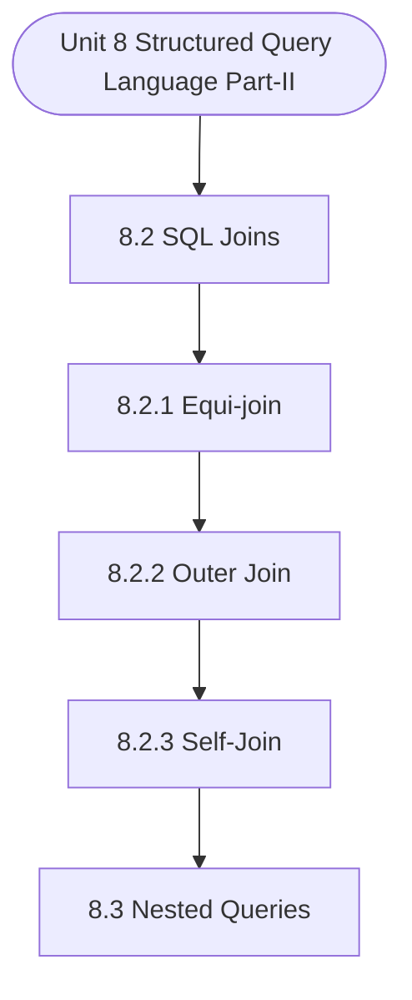

# MCS-207: Database Management Systems
## Unit 8: Structured Query Language (Part-II)

> 📚 **Programme:** M.Sc. (Data Science and Analytics) | **Semester:** Semester 1  
> ⏱️ **Estimated Study Time:** ~35 mins | 📄 **Textbook Pages:** 20 Pages  
> 📥 **Original PDF:** [Download & View Authentic Textbook](../../../pdfs/Semester_1/MCS-207_Database_Management_Systems/Unit-8_Structured_Query_Language_(Part-II).pdf)

---

### 🎯 Executive Concept & Data Science Relevance
In modern data systems, **Structured Query Language (Part-II)** forms a vital conceptual pillar. Relational algebra and SQL form the query engine of every data warehouse (Snowflake, BigQuery, Postgres). Concurrency protocols and normalization ensure data integrity and ACID consistency across concurrent transaction streams.

> [!NOTE]
> **Why this matters for your career:** Mastering structured query language (part-ii) equips you with the foundational principles required to reason mathematically about high-dimensional datasets, evaluate algorithm performance, and avoid statistical pitfalls in production machine learning pipelines.

### 🗺️ Visual Knowledge Architecture
The following concept map illustrates the structural hierarchy and learning trajectory of this module:



### 📖 Core Definitions & Terminology Cards

> 📌 **Relational Algebra**  
> - **Formal Definition:** A procedural query language consisting of a set of operations on relations: Select ( $\sigma$ ), Project ( $\pi$ ), Union ( $\cup$ ), Set Difference ( $-$ ), Cartesian Product ( $\times$ ), and Join ( $\bowtie$ ).  
> - 💡 **Practical Intuition & Analogy:** *The formal mathematical syntax executed behind SQL `SELECT` queries.*

> 📌 **ACID Properties**  
> - **Formal Definition:** Atomicity (all or nothing), Consistency (preserves invariants), Isolation (concurrent execution equivalent to serial), Durability (committed data survives crashes).  
> - 💡 **Practical Intuition & Analogy:** *The financial transaction guarantee: money cannot disappear between debit and credit.*

> 📌 **Functional Dependency $X \to Y$**  
> - **Formal Definition:** A constraint between two sets of attributes: for any two valid tuples $t_1, t_2$, if $t_1[X] = t_2[X]$, then $t_1[Y] = t_2[Y]$. Value of $X$ uniquely determines $Y$.  
> - 💡 **Practical Intuition & Analogy:** *`StudentID` uniquely determines `StudentName`.*

> 📌 **Third Normal Form (3NF) & BCNF**  
> - **Formal Definition:** A relation is in 3NF if for every non-trivial $X \to Y$, either $X$ is a superkey or $Y$ is a prime attribute. It is in BCNF if $X$ is strictly a superkey.  
> - 💡 **Practical Intuition & Analogy:** *Eliminates transitive dependencies so data is stored in exactly one canonical place without update anomalies.*

### ⚡ Governing Mathematical Laws & Formula Cheatsheet
#### 🔹 Relational Algebra Selection & Projection
$$
\sigma_{\text{condition}}(R) \quad \text{and} \quad \pi_{\text{attributes}}(R)
$$
- **Explanation:** $\sigma$ filters rows (equivalent to SQL `WHERE`), while $\pi$ selects specific columns (equivalent to SQL `SELECT column_list`).

#### 🔹 Relational Natural Join
$$
R \bowtie S = \pi_{\mathcal{A}(R) \cup \mathcal{A}(S)}\left(\sigma_{\text{match}}(R \times S)\right)
$$
- **Explanation:** Performs equality join across all identically named attributes between two tables.

#### 🔹 Two-Phase Locking (2PL) Theorem
$$
\text{Growing Phase: Only Acquire Locks} \implies \text{Shrinking Phase: Only Release Locks}
$$
- **Explanation:** Guarantees conflict serializability of concurrent database schedules without data race anomalies.

### ⚖️ Axiomatic Properties & Governing Laws
The mathematical formulations of this module are anchored by foundational algebraic and structural laws:

- **Armstrong's Reflexivity:** $Y \subseteq X \implies X \to Y$
- **Armstrong's Augmentation:** $X \to Y \implies XZ \to YZ$
- **Armstrong's Transitivity:** $X \to Y \land Y \to Z \implies X \to Z$

### 📌 Comprehensive Section-by-Section Study Breakdown
#### `8.2` SQL Joins
##### 📘 Theoretical Principles & In-Depth Exposition
Equi-join, as the name suggests, has equality as the joining condition. This means that the attributes that you are using to join would be checked for equality. Please note that the names of the joining columns in the two tables may be different. The following is an example of an equijoin operation: Example 1: Using the tables of Figure 1answer the query: List the ID, name of the client, and the order ids of all the clients who have placed an order.

You need to use the CLIENT and ORDER tables to answer this query, as the name of the clients are in the CLIENT table and the order id information is in the ORDER table. You may use equi-join operation for this query using the columns ClientNo in CLIENT and ClientNo in the ORDER table.

Though in this present example, both the columns have the same name, i.e. ClentID, equi-join operation does not require these names to be the same. SQL query for the query is presented below: Query Using equi-join: SELECT c.ClientID, c.ClientName, o.ClientID, o.OrderID FROM CLIENT c, ORDER o WHERE c.ClientID = o.ClientID; The result of the query, on the tables of Figure 1, will be: c.ClientID ClientName o.ClientID OrderID C001 ABCD C001 O001 C001 ABCD C001 O003 C002 BCDE C002 O002 C002 BCDE C002 O005 C003 CDEF C003 O004 The output of shows the ClientID of both the CLIENT and the ORDER tables.

##### ⚙️ Mathematical & Algorithmic Mechanics
- **Formal Mechanics:** Establishes symbolic transformations and state invariants governing sql joins.
- **Boundary Invariants:** Ensures robust error-handling, non-empty set guarantees, and strict asymptotic bounds.

##### 📊 Practical Data Science & Production Relevance
- **Industry Application:** Directly implemented in production workflows such as SQL query filters, pandas vectorized operations, and feature transformation pipelines.
- **Production Pitfall:** Failing to verify membership bounds or missing edge cases in sql joins can cause silent data corruption or performance bottlenecks.

> [!TIP]
> **Key Exam & Technical Interview Takeaway:** Be prepared to define sql joins formally, cite its core mathematical invariants, and solve step-by-step numerical/proof questions.

#### `8.2.1` Equi-join
##### 📘 Theoretical Principles & In-Depth Exposition
Equi-join, as the name suggests, has equality as the joining condition. This means that the attributes that you are using to join would be checked for equality. Please note that the names of the joining columns in the two tables may be different. The following is an example of an equijoin operation: Example 1: Using the tables of Figure 1answer the query: List the ID, name of the client, and the order ids of all the clients who have placed an order.

You need to use the CLIENT and ORDER tables to answer this query, as the name of the clients are in the CLIENT table and the order id information is in the ORDER table. You may use equi-join operation for this query using the columns ClientNo in CLIENT and ClientNo in the ORDER table.

Though in this present example, both the columns have the same name, i.e. ClentID, equi-join operation does not require these names to be the same. SQL query for the query is presented below: Query Using equi-join: SELECT c.ClientID, c.ClientName, o.ClientID, o.OrderID FROM CLIENT c, ORDER o WHERE c.ClientID = o.ClientID; The result of the query, on the tables of Figure 1, will be: c.ClientID ClientName o.ClientID OrderID C001 ABCD C001 O001 C001 ABCD C001 O003 C002 BCDE C002 O002 C002 BCDE C002 O005 C003 CDEF C003 O004 The output of shows the ClientID of both the CLIENT and the ORDER tables.

##### ⚙️ Mathematical & Algorithmic Mechanics
- **Formal Mechanics:** Establishes symbolic transformations and state invariants governing equi-join.
- **Boundary Invariants:** Ensures robust error-handling, non-empty set guarantees, and strict asymptotic bounds.

##### 📊 Practical Data Science & Production Relevance
- **Industry Application:** Directly implemented in production workflows such as SQL query filters, pandas vectorized operations, and feature transformation pipelines.
- **Production Pitfall:** Failing to verify membership bounds or missing edge cases in equi-join can cause silent data corruption or performance bottlenecks.

> [!TIP]
> **Key Exam & Technical Interview Takeaway:** Be prepared to define equi-join formally, cite its core mathematical invariants, and solve step-by-step numerical/proof questions.

#### `8.2.2` Outer Join
##### 📘 Theoretical Principles & In-Depth Exposition
Consider the situation that a new client has been added to the client table and the present state of the CLIENT table is: Table Name: CLIENT ClientID ClientName ClientAddress ClientPhone C001 ABCD 79, MGRoad C002 BCDE Raman Street C003 CDEF Vindyachal apatments 9999999993 C004 DEFG Maidan Road Further, assume that this new client has not issued any order.

Let us now issue the query of example 1 again on the present state of the database. You will find the result of the query will still be the same, as shown in example 1. So, we get no information about C004, in the result of the query. If the objective of the query was to show the list of all the clients and their OrderIDs, irrespective of the fact, that they have given zero or more orders, then how would you extract such information?

In effect, you want that all the records from the CLIENT table should participate in joining even if there is no joining row in the ORDER table. This requires the use of OUTER JOIN operation. Example 2: List all the clients and their orders (NULL in case no order is given by a client).

##### ⚙️ Mathematical & Algorithmic Mechanics
- **Formal Mechanics:** Establishes symbolic transformations and state invariants governing outer join.
- **Boundary Invariants:** Ensures robust error-handling, non-empty set guarantees, and strict asymptotic bounds.

##### 📊 Practical Data Science & Production Relevance
- **Industry Application:** Directly implemented in production workflows such as SQL query filters, pandas vectorized operations, and feature transformation pipelines.
- **Production Pitfall:** Failing to verify membership bounds or missing edge cases in outer join can cause silent data corruption or performance bottlenecks.

> [!TIP]
> **Key Exam & Technical Interview Takeaway:** Be prepared to define outer join formally, cite its core mathematical invariants, and solve step-by-step numerical/proof questions.

#### `8.2.3` Self-Join
##### 📘 Theoretical Principles & In-Depth Exposition
In the self-join operation, a table is joined with a copy of itself. This is very useful for queries, which draw information from within a column of a table. The following is an example of the self-join. Example 3: Find the pairs of similar priced items in the ITEM table. You may first simply inspect the ITEM table.

You will find that pairs -Pen and Paper Sheet; and Pencil and Sharpener, have the same price. How did you find this information? You compared the ItemPrice of each item with other ItemPrice. This inspection, in general, can be performed by join operation. Hence, you can answer the query using the following SQL command: SELECT i1.ItemName, i2.ItemName FROM ITEM i1, ITEM i2 WHERE i1.ItemPrice = i2.ItemPrice; Thus, you are joining the two tables on identical ItemPrice, and displaying the pair of names of the items that have similar prices.

However, you will get the following output of this SQL command: i1.ItemName i2.ItemName Pen Pen Pen Paper Sheet Pencil Pencil Pencil Sharpener Paper Sheet Paper Sheet Paper Sheet Pen Sharpener Sharpener Sharpener Pencil You may observe that the output of the command has many extra records like records with the same item, e.g.

##### ⚙️ Mathematical & Algorithmic Mechanics
- **Formal Mechanics:** Establishes symbolic transformations and state invariants governing self-join.
- **Boundary Invariants:** Ensures robust error-handling, non-empty set guarantees, and strict asymptotic bounds.

##### 📊 Practical Data Science & Production Relevance
- **Industry Application:** Directly implemented in production workflows such as SQL query filters, pandas vectorized operations, and feature transformation pipelines.
- **Production Pitfall:** Failing to verify membership bounds or missing edge cases in self-join can cause silent data corruption or performance bottlenecks.

> [!TIP]
> **Key Exam & Technical Interview Takeaway:** Be prepared to define self-join formally, cite its core mathematical invariants, and solve step-by-step numerical/proof questions.

#### `8.3` Nested Queries
##### 📘 Theoretical Principles & In-Depth Exposition
In the previous section, we discussed join queries, which are responsible for joining the data from two tables. Nested queries are used when the output of a query may be useful for the execution of another query. Thus, you can create a main query nest a sub-query in any of the clauses of this main query.

In this section, we discuss the basic type of nested queries and then a special type of nested subqueries called correlated subqueries.

##### ⚙️ Mathematical & Algorithmic Mechanics
- **Formal Mechanics:** Establishes symbolic transformations and state invariants governing nested queries.
- **Boundary Invariants:** Ensures robust error-handling, non-empty set guarantees, and strict asymptotic bounds.

##### 📊 Practical Data Science & Production Relevance
- **Industry Application:** Directly implemented in production workflows such as SQL query filters, pandas vectorized operations, and feature transformation pipelines.
- **Production Pitfall:** Failing to verify membership bounds or missing edge cases in nested queries can cause silent data corruption or performance bottlenecks.

> [!TIP]
> **Key Exam & Technical Interview Takeaway:** Be prepared to define nested queries formally, cite its core mathematical invariants, and solve step-by-step numerical/proof questions.

#### `8.3.1` Subqueries
##### 📘 Theoretical Principles & In-Depth Exposition
A sub-query is another SELECT statement that is used in the main SELECT statement. Please remember the following points about a subquery: • A sub-query is executed prior to the main query. Therefore, you can use the result of a sub-query in an expression of the main query. • A sub-query, on its execution, can return either a single value or a set of values or a relation.

Therefore, the result of the sub-query can be used in a comparison in the WHERE or HAVING clause or for comparison with a set operator; or even in the FROM clause when a relation is returned. • You can put a sub-query inside a sub-query. You can use a separate table in the main and sub-query.

• You should not use the ORDER BY clause in a sub-query, rather it should be used as the last clause of the main query. However, you can use the GROUP BY clause in the sub-query. • When you use sub-queries in the WHERE or HAVING clause of the main query, you may be required to use comparison or set operators.

##### ⚙️ Mathematical & Algorithmic Mechanics
- **Formal Mechanics:** Establishes symbolic transformations and state invariants governing subqueries.
- **Boundary Invariants:** Ensures robust error-handling, non-empty set guarantees, and strict asymptotic bounds.

##### 📊 Practical Data Science & Production Relevance
- **Industry Application:** Directly implemented in production workflows such as SQL query filters, pandas vectorized operations, and feature transformation pipelines.
- **Production Pitfall:** Failing to verify membership bounds or missing edge cases in subqueries can cause silent data corruption or performance bottlenecks.

> [!TIP]
> **Key Exam & Technical Interview Takeaway:** Be prepared to define subqueries formally, cite its core mathematical invariants, and solve step-by-step numerical/proof questions.

#### `8.3.2` Correlated Subqueries
##### 📘 Theoretical Principles & In-Depth Exposition
In many queries, the columns of the tables used in FROM clause are also used in the subquery. Such subqueries are called Correlated subqueries and generally are time-consuming queries. These queries are explained with the help of the following example. Example 11: List the client id and name of the clients, who have ordered ItemID I01 and ItemID I03, as part of a single order.

This query can be answered as a correlated query as follows: SELECT DISTINCT OrderID FROM ORDERDETAILS outer WHERE ORDERDETAILS.ItemID = “I01” AND EXISTS ( SELECT DISTINCT OrderID FROM ORDERDETAILS inner WHERE outer.OrderID=inner.OrderID AND outer.ItemID<inner.ItemID AND inner.ItemID = “I03” ); The execution of such a correlated query is time-consuming.

Since in these queries, the subquery is executed for each instance of the main query. For example, in the case of example 11, the main query will find that the order O003 fulfils the main clause. This will trigger the execution of the subquery, which will check that for the same value of order O003, there exists a record for item I03.

##### ⚙️ Mathematical & Algorithmic Mechanics
- **Formal Mechanics:** Establishes symbolic transformations and state invariants governing correlated subqueries.
- **Boundary Invariants:** Ensures robust error-handling, non-empty set guarantees, and strict asymptotic bounds.

##### 📊 Practical Data Science & Production Relevance
- **Industry Application:** Directly implemented in production workflows such as SQL query filters, pandas vectorized operations, and feature transformation pipelines.
- **Production Pitfall:** Failing to verify membership bounds or missing edge cases in correlated subqueries can cause silent data corruption or performance bottlenecks.

> [!TIP]
> **Key Exam & Technical Interview Takeaway:** Be prepared to define correlated subqueries formally, cite its core mathematical invariants, and solve step-by-step numerical/proof questions.

#### `8.4` Database Objects
##### 📘 Theoretical Principles & In-Depth Exposition
Database objects are useful concepts in a database system. In this section, we discuss four different types of objects, which are defined in many database management systems. Views are virtual tables, which may be used for implementing database security. In addition, they can also be used for database query optimisation.

Sequences are used to maintain an automatic sequence of numbers, which can be very useful for input of unique values in a column. Indexes are used to enhance the performance of a database system. The following sub-section discusses these concepts in detail.

##### ⚙️ Mathematical & Algorithmic Mechanics
- **Formal Mechanics:** Establishes symbolic transformations and state invariants governing database objects.
- **Boundary Invariants:** Ensures robust error-handling, non-empty set guarantees, and strict asymptotic bounds.

##### 📊 Practical Data Science & Production Relevance
- **Industry Application:** Directly implemented in production workflows such as SQL query filters, pandas vectorized operations, and feature transformation pipelines.
- **Production Pitfall:** Failing to verify membership bounds or missing edge cases in database objects can cause silent data corruption or performance bottlenecks.

> [!TIP]
> **Key Exam & Technical Interview Takeaway:** Be prepared to define database objects formally, cite its core mathematical invariants, and solve step-by-step numerical/proof questions.

### 📐 Step-by-Step Solved Mathematical Examples
To solidify your theoretical understanding, work through these fully solved, step-by-step mathematical problems:

#### 🧮 Example 1: BCNF Normalization Decomposition
> **Problem Statement:**  
> Given relation $R(A, B, C, D)$ with functional dependencies $F = \lbrace A \to B, \; B \to C, \; C \to D \rbrace$. Find candidate keys, check if $R$ is in BCNF, and decompose if necessary.

**Detailed Step-by-Step Solution:**

1. **Candidate Key:** Closure $(A)^+ = \lbrace A, B, C, D \rbrace$. Thus $A$ is the sole candidate key.
2. **BCNF Test:**
- $A \to B$: $A$ is superkey (Passes BCNF).
- $B \to C$: $B$ is NOT a superkey (Violates BCNF).
- $C \to D$: $C$ is NOT a superkey (Violates BCNF).

3. **Decomposition:**
- Decompose on $B \to C$: $R_1(B, C)$ with $B \to C$ (In BCNF, key $B$), and $R_2(A, B, D)$ with $A \to B, B \to D$.
- In $R_2$, $B \to D$ violates BCNF ($B$ not superkey for $R_2$). Decompose $R_2$ into $R_{21}(B, D)$ and $R_{22}(A, B)$.

Final BCNF schema: $R_1(B, C), \; R_{21}(B, D), \; R_{22}(A, B)$ (Lossless and dependency preserving).

#### 🧮 Example 2: Relational Algebra to SQL Translation
> **Problem Statement:**  
> Express relational algebra query $\pi_{\text{name, salary}}(\sigma_{\text{dept}='Analytics' \land \text{salary} > 80000}(\text{Employees}))$ into standard SQL.

**Detailed Step-by-Step Solution:**

```sql
SELECT name, salary
FROM Employees
WHERE dept = 'Analytics' AND salary > 80000;
```

### 💻 Practical Data Science Implementation (Python)
Theory translates directly into production algorithms. Below is a self-contained, commented Python implementation illustrating the core operations of this unit:

```python
import pandas as pd

# Simulating Relational Algebra with Pandas
emp = pd.DataFrame({
    'emp_id': [1, 2, 3, 4],
    'name': ['Alice', 'Bob', 'Charlie', 'David'],
    'dept_id': [10, 10, 20, 30]
})

dept = pd.DataFrame({
    'dept_id': [10, 20, 40],
    'dept_name': ['Analytics', 'Engineering', 'HR']
})

# 1. Selection (Sigma): dept_id == 10
sel = emp[emp['dept_id'] == 10]

# 2. Projection (Pi): ['name', 'dept_id']
proj = sel[['name', 'dept_id']]

# 3. Natural Join (Bowtie): emp ⨝ dept
natural_join = pd.merge(emp, dept, on='dept_id', how='inner')

print("Natural Join Result:\n", natural_join[['name', 'dept_name']])
```

### 💡 Interactive Self-Assessment Checkpoints
Test your comprehension before proceeding. Tap each question to reveal the comprehensive explanation:

<details>
<summary><b>Checkpoint 1:</b> What does ACID stand for in database management? <i>(Tap to reveal answer)</i></summary>

> **Answer & Analysis:**  
> Atomicity, Consistency, Isolation, and Durability.
</details>

<details>
<summary><b>Checkpoint 2:</b> What is the difference between 3NF and BCNF? <i>(Tap to reveal answer)</i></summary>

> **Answer & Analysis:**  
> In 3NF, for any non-trivial $X \to Y$, $X$ must be a superkey OR $Y$ must be a prime attribute. In BCNF (Boyce-Codd Normal Form), $X$ MUST strictly be a superkey (eliminating all dependencies on prime attributes).
</details>

<details>
<summary><b>Checkpoint 3:</b> What is the relational algebra symbol for row selection and column projection? <i>(Tap to reveal answer)</i></summary>

> **Answer & Analysis:**  
> Row selection: $\sigma$ (Sigma). Column projection: $\pi$ (Pi).
</details>

<details>
<summary><b>Checkpoint 4:</b> Find the list of items that have been purchased together. ………………………………………………………………………………………………………… ………………………………………………………………………………………………………… ………………………………………………………………………………………………………… <i>(Tap to reveal answer)</i></summary>

> **Answer & Analysis:**  
> This question tests your conceptual mastery of Structured Query Language (Part-II). Review the governing formulas and section breakdowns above to formulate a complete, rigorous proof or derivation.
</details>

<details>
<summary><b>Checkpoint 5:</b> What is a subquery? When would you like to use the sub-query? ………………………………………………………………………………………………………… ………………………………………………………………………………………………………… ………………………………………… <i>(Tap to reveal answer)</i></summary>

> **Answer & Analysis:**  
> This question tests your conceptual mastery of Structured Query Language (Part-II). Review the governing formulas and section breakdowns above to formulate a complete, rigorous proof or derivation.
</details>

<details>
<summary><b>Checkpoint 6:</b> Consider the following relations Schema given in question 2 above, and the following two SQL queries on this schema. What is the purpose of these two queries? <i>(Tap to reveal answer)</i></summary>

> **Answer & Analysis:**  
> This question tests your conceptual mastery of Structured Query Language (Part-II). Review the governing formulas and section breakdowns above to formulate a complete, rigorous proof or derivation.
</details>

### 🎯 Executive Module Wrap-Up
- **Central Idea:** Structured Query Language (Part-II) provides essential mathematical and algorithmic tools directly utilized in Data Science.
- **Mathematical Rigor:** Formulas and laws must be memorized with attention to boundary conditions and assumptions.
- **Full Textbook Coverage:** For exhaustive multi-page derivations, proofs, and supplementary exercises, consult the [Authentic IGNOU Textbook](../../../pdfs/Semester_1/MCS-207_Database_Management_Systems/Unit-8_Structured_Query_Language_(Part-II).pdf).

---
### 🧭 Navigation & Syllabus Index
[⬅ Previous: Unit 7](unit_07_Structured_Query_Language.md) | [📑 Course Index](README.md) | [Next: Unit 9 ➡](unit_09_Advanced_SQL.md)
