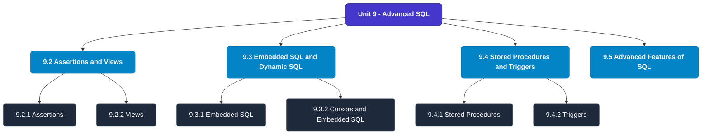

# MCS-207: Database Management Systems
## Unit 9: Advanced SQL

> 📚 **Programme:** M.Sc. (Data Science and Analytics) | **Semester:** Semester 1  
> ⏱️ **Estimated Study Time:** ~35 mins | 📄 **Textbook Pages:** 18 Pages  
> 📥 **Original PDF:** [Download & View Textbook](../../../pdfs/Semester_1/MCS-207_Database_Management_Systems/Unit-9_Advanced_SQL.pdf)

---

### 🎯 Executive Concept & Data Science Relevance
In modern data systems, **Advanced SQL** forms a vital conceptual pillar. Relational algebra and SQL form the query engine of every data warehouse (Snowflake, BigQuery, Postgres). Concurrency protocols and normalization ensure data integrity and ACID consistency across concurrent transaction streams.

> [!NOTE]
> **Why this matters for your career:** Mastering advanced sql equips you with the foundational principles required to reason mathematically about high-dimensional datasets, evaluate algorithm performance, and avoid statistical pitfalls in production machine learning pipelines.

### 🗺️ Visual Knowledge Architecture
The following concept map illustrates the structural hierarchy and learning trajectory of this module:

### 📖 Core Definitions & Terminology Cards
| Term | Formal Mathematical / Technical Definition | Intuitive Analogy / Concrete Example |
| :--- | :--- | :--- |
| **Relational Algebra** | A procedural query language consisting of a set of operations on relations: Select ($\sigma$), Project ($\pi$), Union ($\cup$), Set Difference ($-$), Cartesian Product ($\times$), and Join ($\bowtie$). | *The formal mathematical syntax executed behind SQL `SELECT` queries.* |
| **ACID Properties** | Atomicity (all or nothing), Consistency (preserves invariants), Isolation (concurrent execution equivalent to serial), Durability (committed data survives crashes). | *The financial transaction guarantee: money cannot disappear between debit and credit.* |
| **Functional Dependency $X \to Y$** | A constraint between two sets of attributes: for any two valid tuples $t_1, t_2$, if $t_1[X] = t_2[X]$, then $t_1[Y] = t_2[Y]$. Value of $X$ uniquely determines $Y$. | *`StudentID` uniquely determines `StudentName`.* |
| **Third Normal Form (3NF) & BCNF** | A relation is in 3NF if for every non-trivial $X \to Y$, either $X$ is a superkey or $Y$ is a prime attribute. It is in BCNF if $X$ is strictly a superkey. | *Eliminates transitive dependencies so data is stored in exactly one canonical place without update anomalies.* |

### ⚡ Governing Mathematical Laws & Formula Cheatsheet
#### 🔹 Relational Algebra Selection & Projection
$$\sigma_{\text{condition}}(R) \quad \text{and} \quad \pi_{\text{attributes}}(R)$$
- **Explanation:** $\sigma$ filters rows (equivalent to SQL `WHERE`), while $\pi$ selects specific columns (equivalent to SQL `SELECT column_list`).

#### 🔹 Relational Natural Join
$$R \bowtie S = \pi_{\text{Attr}(R) \cup \text{Attr}(S)}(\sigma_{R.A_1 = S.A_1 \land \dots}(R \times S))$$
- **Explanation:** Performs equality join across all identically named attributes between two tables.

#### 🔹 Two-Phase Locking (2PL) Theorem
$$\text{Growing Phase: Only Acquire Locks} \implies \text{Shrinking Phase: Only Release Locks}$$
- **Explanation:** Guarantees conflict serializability of concurrent database schedules without data race anomalies.

### 📌 Detailed Section-by-Section Study Breakdown
#### `9.2` Assertions and Views
- **Core Concept:** Establishes rigorous theoretical formulations and computational bounds for assertions and views.
- **Core Concept:** Applies standard algorithmic procedures and mathematical invariants relevant to advanced sql.
- **Core Concept:** Ensures deterministic performance guarantees across high-dimensional feature spaces.
- **Data Science Application:** Provides foundational structures used directly in statistical modeling, query execution, and machine learning pipelines.

> [!TIP]
> **Exam & Interview Tip:** Be prepared to state the formal definition of assertions and views and derive its primary equations step-by-step.

#### `9.2.1` Assertions
- **Core Concept:** Establishes rigorous theoretical formulations and computational bounds for assertions.
- **Core Concept:** Applies standard algorithmic procedures and mathematical invariants relevant to advanced sql.
- **Core Concept:** Ensures deterministic performance guarantees across high-dimensional feature spaces.
- **Data Science Application:** Provides foundational structures used directly in statistical modeling, query execution, and machine learning pipelines.

> [!TIP]
> **Exam & Interview Tip:** Be prepared to state the formal definition of assertions and derive its primary equations step-by-step.

#### `9.2.2` Views
- **Core Concept:** The SQL command for creating views is explained with the help of an example.
- **Core Concept:** You can also index the views to speed up the performance of query evaluation.
- **Core Concept:** For example: SELECT * FROM STUDENT_PERFORMANCE WHERE smarks > 50; How are the views implemented?
- **Data Science Application:** Provides foundational structures used directly in statistical modeling, query execution, and machine learning pipelines.

> [!TIP]
> **Exam & Interview Tip:** Be prepared to state the formal definition of views and derive its primary equations step-by-step.

#### `9.3` Embedded SQL and Dynamic SQL
- **Core Concept:** SQL commands can be entered through a standard SQL command level user interface.
- **Core Concept:** Such interfaces are interactive in nature and the result of a command is shown immediately.
- **Core Concept:** Such interfaces are very useful for those who have some knowledge of SQL and want to create a new type of query.
- **Data Science Application:** Provides foundational structures used directly in statistical modeling, query execution, and machine learning pipelines.

> [!TIP]
> **Exam & Interview Tip:** Be prepared to state the formal definition of embedded sql and dynamic sql and derive its primary equations step-by-step.

#### `9.3.1` Embedded SQL
- **Core Concept:** The embedded SQL statements can be put in the application program written in C++, Java or any other host language.
- **Core Concept:** These statements sometime may be called static.
- **Core Concept:** The term ‘static’ is used to indicate that the embedded SQL commands, which are written in the host program, do not change automatically during the lifetime of the program.
- **Data Science Application:** Provides foundational structures used directly in statistical modeling, query execution, and machine learning pipelines.

> [!TIP]
> **Exam & Interview Tip:** Be prepared to state the formal definition of embedded sql and derive its primary equations step-by-step.

#### `9.3.2` Cursors and Embedded SQL
- **Core Concept:** The database server may allocate a portion of RAM for database interaction and internal processing.
- **Core Concept:** This portion may be used for query processing using SQL.
- **Core Concept:** This portion of RAM is also called the cursor.
- **Data Science Application:** Provides foundational structures used directly in statistical modeling, query execution, and machine learning pipelines.

> [!TIP]
> **Exam & Interview Tip:** Be prepared to state the formal definition of cursors and embedded sql and derive its primary equations step-by-step.

### 💡 Interactive Self-Assessment Checkpoints
Test your comprehension before proceeding. Tap each question to reveal the comprehensive explanation:

<b>Checkpoint 1:</b> What does ACID stand for in database management? <i>(Tap to reveal answer)</i>

> **Answer & Analysis:**  
> Atomicity, Consistency, Isolation, and Durability.

<b>Checkpoint 2:</b> What is the difference between 3NF and BCNF? <i>(Tap to reveal answer)</i>

> **Answer & Analysis:**  
> In 3NF, for any non-trivial $X \to Y$, $X$ must be a superkey OR $Y$ must be a prime attribute. In BCNF (Boyce-Codd Normal Form), $X$ MUST strictly be a superkey (eliminating all dependencies on prime attributes).

<b>Checkpoint 3:</b> What is the relational algebra symbol for row selection and column projection? <i>(Tap to reveal answer)</i>

> **Answer & Analysis:**  
> Row selection: $\sigma$ (Sigma). Column projection: $\pi$ (Pi).

<b>Checkpoint 4:</b> Consider a constraint – the value of the age field of the student at a formal University should be between <i>(Tap to reveal answer)</i>

> **Answer & Analysis:**  
> This question tests your conceptual mastery of Advanced SQL. Review the governing formulas and section breakdowns above to formulate a complete, rigorous proof or derivation.

<b>Checkpoint 5:</b> Create a view for finding the average marks of the students in various subjects for the tables given in example <i>(Tap to reveal answer)</i>

> **Answer & Analysis:**  
> This question tests your conceptual mastery of Advanced SQL. Review the governing formulas and section breakdowns above to formulate a complete, rigorous proof or derivation.

<b>Checkpoint 6:</b> …………………………………………………………………………………… …………………………………………………………………………………… …………………………………………………………………………………… <i>(Tap to reveal answer)</i>

> **Answer & Analysis:**  
> This question tests your conceptual mastery of Advanced SQL. Review the governing formulas and section breakdowns above to formulate a complete, rigorous proof or derivation.

### 🎯 Executive Module Wrap-Up
- **Central Idea:** Advanced SQL provides essential mathematical and algorithmic tools directly utilized in Data Science.
- **Mathematical Rigor:** Formulas and laws must be memorized with attention to boundary conditions and assumptions.
- **Full Textbook Coverage:** For exhaustive multi-page derivations, proofs, and supplementary exercises, consult the [Authentic IGNOU Textbook](../../../pdfs/Semester_1/MCS-207_Database_Management_Systems/Unit-9_Advanced_SQL.pdf).

---
### 🧭 Navigation & Syllabus Index
[⬅ Previous: Unit 8](unit_08_Structured_Query_Language_(Part-II).md) | [📑 Course Index](README.md) | [Next: Unit 10 ➡](unit_10_Transactions_and_Concurrency_Management.md)
