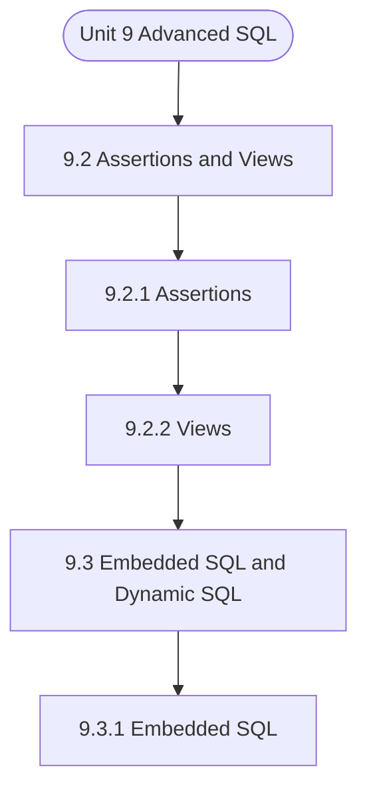

# MCS-207: Database Management Systems
## Unit 9: Advanced SQL

> 📚 **Programme:** M.Sc. (Data Science and Analytics) | **Semester:** Semester 1  
> ⏱️ **Estimated Study Time:** ~35 mins | 📄 **Textbook Pages:** 18 Pages  
> 📥 **Original PDF:** [Download & View Authentic Textbook](../../../pdfs/Semester_1/MCS-207_Database_Management_Systems/Unit-9_Advanced_SQL.pdf)

---

### 🎯 Executive Concept & Data Science Relevance
In modern data systems, **Advanced SQL** forms a vital conceptual pillar. Relational algebra and SQL form the query engine of every data warehouse (Snowflake, BigQuery, Postgres). Concurrency protocols and normalization ensure data integrity and ACID consistency across concurrent transaction streams.

> [!NOTE]
> **Why this matters for your career:** Mastering advanced sql equips you with the foundational principles required to reason mathematically about high-dimensional datasets, evaluate algorithm performance, and avoid statistical pitfalls in production machine learning pipelines.

### 🗺️ Visual Knowledge Architecture
The following concept map illustrates the structural hierarchy and learning trajectory of this module:



### 📖 Core Definitions & Terminology Cards

> 📌 **Relational Algebra**  
> - **Formal Definition:** A procedural query language consisting of a set of operations on relations: Select ( $\sigma$ ), Project ( $\pi$ ), Union ( $\cup$ ), Set Difference ( $-$ ), Cartesian Product ( $\times$ ), and Join ( $\bowtie$ ).  
> - 💡 **Practical Intuition & Analogy:** *The formal mathematical syntax executed behind SQL `SELECT` queries.*

> 📌 **ACID Properties**  
> - **Formal Definition:** Atomicity (all or nothing), Consistency (preserves invariants), Isolation (concurrent execution equivalent to serial), Durability (committed data survives crashes).  
> - 💡 **Practical Intuition & Analogy:** *The financial transaction guarantee: money cannot disappear between debit and credit.*

> 📌 **Functional Dependency $X \to Y$**  
> - **Formal Definition:** A constraint between two sets of attributes: for any two valid tuples $t_1, t_2$, if $t_1[X] = t_2[X]$, then $t_1[Y] = t_2[Y]$. Value of $X$ uniquely determines $Y$.  
> - 💡 **Practical Intuition & Analogy:** *`StudentID` uniquely determines `StudentName`.*

> 📌 **Third Normal Form (3NF) & BCNF**  
> - **Formal Definition:** A relation is in 3NF if for every non-trivial $X \to Y$, either $X$ is a superkey or $Y$ is a prime attribute. It is in BCNF if $X$ is strictly a superkey.  
> - 💡 **Practical Intuition & Analogy:** *Eliminates transitive dependencies so data is stored in exactly one canonical place without update anomalies.*

### ⚡ Governing Mathematical Laws & Formula Cheatsheet
#### 🔹 Relational Algebra Selection & Projection
$$
\sigma_{\text{condition}}(R) \quad \text{and} \quad \pi_{\text{attributes}}(R)
$$
- **Explanation:** $\sigma$ filters rows (equivalent to SQL `WHERE`), while $\pi$ selects specific columns (equivalent to SQL `SELECT column_list`).

#### 🔹 Relational Natural Join
$$
R \bowtie S = \pi_{\mathcal{A}(R) \cup \mathcal{A}(S)}\left(\sigma_{\text{match}}(R \times S)\right)
$$
- **Explanation:** Performs equality join across all identically named attributes between two tables.

#### 🔹 Two-Phase Locking (2PL) Theorem
$$
\text{Growing Phase: Only Acquire Locks} \implies \text{Shrinking Phase: Only Release Locks}
$$
- **Explanation:** Guarantees conflict serializability of concurrent database schedules without data race anomalies.

### ⚖️ Axiomatic Properties & Governing Laws
The mathematical formulations of this module are anchored by foundational algebraic and structural laws:

- **Armstrong's Reflexivity:** $Y \subseteq X \implies X \to Y$
- **Armstrong's Augmentation:** $X \to Y \implies XZ \to YZ$
- **Armstrong's Transitivity:** $X \to Y \land Y \to Z \implies X \to Z$

### 📌 Comprehensive Section-by-Section Study Breakdown
#### `9.2` Assertions and Views
##### 📘 Theoretical Principles & In-Depth Exposition
A view is a virtual table, which does not actually store data. Then what does it contain? A view is a query on the physical tables that store the data. The SQL command for creating views is explained with the help of an example. Example 2: A student’s database has the following tables: STUDENT (name, enrolmentno, dateofbirth) MARKS (enrolmentno, subjectcode, smarks) For the database above a view can be created for a teacher, who is allowed to view only the performance of the student in his/her subject, let us say MCS207.

CREATE VIEW SUBJECT_PERFORMANCE AS (SELECT s.enrolmentno, name, subjectcode, smarks FROM STUDENT s, MARKS m WHERE s.enrolmentno = m.enrolmentno AND subjectcode ‘MCS207’ ORDER BY s.enrolmentno; A view can be dropped using a DROP statement as: DROP VIEW SUBJECT_PERFORMANCE; The physical table, which stores the data on which the statement of the view is written, is referred to as the base table.

You can create views on two or more base tables by combining the data using JOIN. Thus, a view hides the logic of joining the tables from a user. You can also index the views to speed up the performance of query evaluation. Once a view has been created, it can be queried exactly like a base table.

##### ⚙️ Mathematical & Algorithmic Mechanics
- **Formal Mechanics:** Establishes symbolic transformations and state invariants governing assertions and views.
- **Boundary Invariants:** Ensures robust error-handling, non-empty set guarantees, and strict asymptotic bounds.

##### 📊 Practical Data Science & Production Relevance
- **Industry Application:** Directly implemented in production workflows such as SQL query filters, pandas vectorized operations, and feature transformation pipelines.
- **Production Pitfall:** Failing to verify membership bounds or missing edge cases in assertions and views can cause silent data corruption or performance bottlenecks.

> [!TIP]
> **Key Exam & Technical Interview Takeaway:** Be prepared to define assertions and views formally, cite its core mathematical invariants, and solve step-by-step numerical/proof questions.

#### `9.2.1` Assertions
##### 📘 Theoretical Principles & In-Depth Exposition
The section on **Assertions** establishes rigorous theoretical foundations necessary for advanced computational modeling. It introduces formal mathematical structures and symbolic notations that guarantee consistency across proofs and algorithms.

In the broader scope of **Advanced SQL**, understanding assertions is essential to formalizing data representations, verifying boundary constraints, and ensuring computational determinism across multidimensional feature spaces.

##### ⚙️ Mathematical & Algorithmic Mechanics
- **Formal Mechanics:** Establishes symbolic transformations and state invariants governing assertions.
- **Boundary Invariants:** Ensures robust error-handling, non-empty set guarantees, and strict asymptotic bounds.

##### 📊 Practical Data Science & Production Relevance
- **Industry Application:** Directly implemented in production workflows such as SQL query filters, pandas vectorized operations, and feature transformation pipelines.
- **Production Pitfall:** Failing to verify membership bounds or missing edge cases in assertions can cause silent data corruption or performance bottlenecks.

> [!TIP]
> **Key Exam & Technical Interview Takeaway:** Be prepared to define assertions formally, cite its core mathematical invariants, and solve step-by-step numerical/proof questions.

#### `9.2.2` Views
##### 📘 Theoretical Principles & In-Depth Exposition
A view is a virtual table, which does not actually store data. Then what does it contain? A view is a query on the physical tables that store the data. The SQL command for creating views is explained with the help of an example. Example 2: A student’s database has the following tables: STUDENT (name, enrolmentno, dateofbirth) MARKS (enrolmentno, subjectcode, smarks) For the database above a view can be created for a teacher, who is allowed to view only the performance of the student in his/her subject, let us say MCS207.

CREATE VIEW SUBJECT_PERFORMANCE AS (SELECT s.enrolmentno, name, subjectcode, smarks FROM STUDENT s, MARKS m WHERE s.enrolmentno = m.enrolmentno AND subjectcode ‘MCS207’ ORDER BY s.enrolmentno; A view can be dropped using a DROP statement as: DROP VIEW SUBJECT_PERFORMANCE; The physical table, which stores the data on which the statement of the view is written, is referred to as the base table.

You can create views on two or more base tables by combining the data using JOIN. Thus, a view hides the logic of joining the tables from a user. You can also index the views to speed up the performance of query evaluation. Once a view has been created, it can be queried exactly like a base table.

##### ⚙️ Mathematical & Algorithmic Mechanics
- **Formal Mechanics:** Establishes symbolic transformations and state invariants governing views.
- **Boundary Invariants:** Ensures robust error-handling, non-empty set guarantees, and strict asymptotic bounds.

##### 📊 Practical Data Science & Production Relevance
- **Industry Application:** Directly implemented in production workflows such as SQL query filters, pandas vectorized operations, and feature transformation pipelines.
- **Production Pitfall:** Failing to verify membership bounds or missing edge cases in views can cause silent data corruption or performance bottlenecks.

> [!TIP]
> **Key Exam & Technical Interview Takeaway:** Be prepared to define views formally, cite its core mathematical invariants, and solve step-by-step numerical/proof questions.

#### `9.3` Embedded SQL and Dynamic SQL
##### 📘 Theoretical Principles & In-Depth Exposition
SQL commands can be entered through a standard SQL command level user interface. Such interfaces are interactive in nature and the result of a command is shown immediately. Such interfaces are very useful for those who have some knowledge of SQL and want to create a new type of query.

However, in a database application where a naïve user wants to make standard queries, that too using GUI like interfaces, probably an application program needs to be developed. Such interfaces sometimes require the support of a programming language environment. Please note that SQL normally does not support a full programming paradigm (although the latest SQL has full API support), which allows it a full programming interface.

In fact, most of the application programs are seen through a programming interface, where SQL commands are put wherever database interactions are needed. Thus, SQL is embedded into programming languages like C, C++, JAVA, etc. Let us discuss the different forms of embedded SQL in more detail.

##### ⚙️ Mathematical & Algorithmic Mechanics
- **Formal Mechanics:** Establishes symbolic transformations and state invariants governing embedded sql and dynamic sql.
- **Boundary Invariants:** Ensures robust error-handling, non-empty set guarantees, and strict asymptotic bounds.

##### 📊 Practical Data Science & Production Relevance
- **Industry Application:** Directly implemented in production workflows such as SQL query filters, pandas vectorized operations, and feature transformation pipelines.
- **Production Pitfall:** Failing to verify membership bounds or missing edge cases in embedded sql and dynamic sql can cause silent data corruption or performance bottlenecks.

> [!TIP]
> **Key Exam & Technical Interview Takeaway:** Be prepared to define embedded sql and dynamic sql formally, cite its core mathematical invariants, and solve step-by-step numerical/proof questions.

#### `9.3.1` Embedded SQL
##### 📘 Theoretical Principles & In-Depth Exposition
The embedded SQL statements can be put in the application program written in C++, Java or any other host language. These statements sometime may be called static. Why are they called static? The term ‘static’ is used to indicate that the embedded SQL commands, which are written in the host program, do not change automatically during the lifetime of the program.

Thus, such queries are determined at the time of database application design. For example, a query statement embedded in C++ to determine the status of a booking of a ticket for a train will not change. However, this Database Design and Implementation query may be executed for many different tickets.

Please note that it will only change the input parameters to the query, which are ticket number, train number, date of boarding, etc., and not the query itself. But how is such embedding done? Let us explain this with the help of an example. Example 3: Write a C program segment that prints the details of a student whose enrolment number is given as input.

##### ⚙️ Mathematical & Algorithmic Mechanics
- **Formal Mechanics:** Establishes symbolic transformations and state invariants governing embedded sql.
- **Boundary Invariants:** Ensures robust error-handling, non-empty set guarantees, and strict asymptotic bounds.

##### 📊 Practical Data Science & Production Relevance
- **Industry Application:** Directly implemented in production workflows such as SQL query filters, pandas vectorized operations, and feature transformation pipelines.
- **Production Pitfall:** Failing to verify membership bounds or missing edge cases in embedded sql can cause silent data corruption or performance bottlenecks.

> [!TIP]
> **Key Exam & Technical Interview Takeaway:** Be prepared to define embedded sql formally, cite its core mathematical invariants, and solve step-by-step numerical/proof questions.

#### `9.3.2` Cursors and Embedded SQL
##### 📘 Theoretical Principles & In-Depth Exposition
Let us first define the term ‘cursor’. The database server may allocate a portion of RAM for database interaction and internal processing. This portion may be used for query processing using SQL. This portion of RAM is also called the cursor. What should be the size of memory for the query processing?

Ideally, the size of memory allotted for the query processing should be equal to the memory required to hold the query result. However, the available memory puts a constraint on the allotted size. Whenever a query results in several tuples, you can use a cursor to process the currently available tuples one by one.

Let us explain the use of the cursor with the help of an example: Since most of the commercial RDBMS architectures are client-server architectures, on the execution of an embedded SQL query, the resulting tuples are cached in the cursor. This operation is performed on the server.

##### ⚙️ Mathematical & Algorithmic Mechanics
- **Formal Mechanics:** Establishes symbolic transformations and state invariants governing cursors and embedded sql.
- **Boundary Invariants:** Ensures robust error-handling, non-empty set guarantees, and strict asymptotic bounds.

##### 📊 Practical Data Science & Production Relevance
- **Industry Application:** Directly implemented in production workflows such as SQL query filters, pandas vectorized operations, and feature transformation pipelines.
- **Production Pitfall:** Failing to verify membership bounds or missing edge cases in cursors and embedded sql can cause silent data corruption or performance bottlenecks.

> [!TIP]
> **Key Exam & Technical Interview Takeaway:** Be prepared to define cursors and embedded sql formally, cite its core mathematical invariants, and solve step-by-step numerical/proof questions.

#### `9.3.3` Dynamic SQL
##### 📘 Theoretical Principles & In-Depth Exposition
Dynamic SQL, unlike embedded SQL statements, is built at the run time and placed in a string in a host variable. The created SQL statements are then sent to the DBMS for processing. Dynamic SQL is generally slower than statically embedded SQL as they require complete processing including access plan generation during the run time.

However, they are more powerful than embedded SQL as they allow run-time application logic. The basic advantage of using dynamic embedded SQL is that you Database Design and Implementation need not compile and test a new program for a new query. Let us explain the use of dynamic SQL with the help of an example.

Example 5: Write a dynamic SQL interface that allows a student to get and modify permissible details about him/her. The student may ask for a subset of information also. Assume that the student database has the following relations. STUDENT (enrolno, name, dob) RESULT (enrolno, coursecode, marks) In the table above, a student has access rights for accessing information on his/her enrolment number, but s/he cannot update the data.

##### ⚙️ Mathematical & Algorithmic Mechanics
- **Formal Mechanics:** Establishes symbolic transformations and state invariants governing dynamic sql.
- **Boundary Invariants:** Ensures robust error-handling, non-empty set guarantees, and strict asymptotic bounds.

##### 📊 Practical Data Science & Production Relevance
- **Industry Application:** Directly implemented in production workflows such as SQL query filters, pandas vectorized operations, and feature transformation pipelines.
- **Production Pitfall:** Failing to verify membership bounds or missing edge cases in dynamic sql can cause silent data corruption or performance bottlenecks.

> [!TIP]
> **Key Exam & Technical Interview Takeaway:** Be prepared to define dynamic sql formally, cite its core mathematical invariants, and solve step-by-step numerical/proof questions.

#### `9.3.4` SQLJ
##### 📘 Theoretical Principles & In-Depth Exposition
Till now we have discussed embedding SQL in C, can you embed SQL statements into JAVA Program? For inserting SQL statements in JAVA, you use SQLJ. In SQLJ, a preprocessor called SQLJ translator translates the SQLJ source file to a JAVA source file. The JAVA file is compiled and run on the database.

The use of SQLJ improves the productivity and manageability of JAVA Code as: • The code becomes somewhat compact. • No run-time SQL syntax errors as SQL statements are checked at compile time. • It allows sharing of JAVA variables with SQL statements. Such sharing is not possible otherwise.

Advanced SQL SQLJ provides a standard form in which SQL statements can be embedded in the JAVA program. SQLJ statements always begin with a #sql keyword. These embedded SQL statements are of two categories – Declarations and Executable Statements. Declarations have the following syntax: #sql <modifier> context context_classname; The executable statements have the following syntax: #sql {SQL operation returning no output}; OR #sql result = {SQL operation returning output}; Example 6: Write a JAVA function to print the student details of the student table, for the students who have been admitted in 2023 or later and whose names are like ‘As’.

##### ⚙️ Mathematical & Algorithmic Mechanics
- **Formal Mechanics:** Establishes symbolic transformations and state invariants governing sqlj.
- **Boundary Invariants:** Ensures robust error-handling, non-empty set guarantees, and strict asymptotic bounds.

##### 📊 Practical Data Science & Production Relevance
- **Industry Application:** Directly implemented in production workflows such as SQL query filters, pandas vectorized operations, and feature transformation pipelines.
- **Production Pitfall:** Failing to verify membership bounds or missing edge cases in sqlj can cause silent data corruption or performance bottlenecks.

> [!TIP]
> **Key Exam & Technical Interview Takeaway:** Be prepared to define sqlj formally, cite its core mathematical invariants, and solve step-by-step numerical/proof questions.

### 📐 Step-by-Step Solved Mathematical Examples
To solidify your theoretical understanding, work through these fully solved, step-by-step mathematical problems:

#### 🧮 Example 1: BCNF Normalization Decomposition
> **Problem Statement:**  
> Given relation $R(A, B, C, D)$ with functional dependencies $F = \lbrace A \to B, \; B \to C, \; C \to D \rbrace$. Find candidate keys, check if $R$ is in BCNF, and decompose if necessary.

**Detailed Step-by-Step Solution:**

1. **Candidate Key:** Closure $(A)^+ = \lbrace A, B, C, D \rbrace$. Thus $A$ is the sole candidate key.
2. **BCNF Test:**
- $A \to B$: $A$ is superkey (Passes BCNF).
- $B \to C$: $B$ is NOT a superkey (Violates BCNF).
- $C \to D$: $C$ is NOT a superkey (Violates BCNF).

3. **Decomposition:**
- Decompose on $B \to C$: $R_1(B, C)$ with $B \to C$ (In BCNF, key $B$), and $R_2(A, B, D)$ with $A \to B, B \to D$.
- In $R_2$, $B \to D$ violates BCNF ($B$ not superkey for $R_2$). Decompose $R_2$ into $R_{21}(B, D)$ and $R_{22}(A, B)$.

Final BCNF schema: $R_1(B, C), \; R_{21}(B, D), \; R_{22}(A, B)$ (Lossless and dependency preserving).

#### 🧮 Example 2: Relational Algebra to SQL Translation
> **Problem Statement:**  
> Express relational algebra query $\pi_{\text{name, salary}}(\sigma_{\text{dept}='Analytics' \land \text{salary} > 80000}(\text{Employees}))$ into standard SQL.

**Detailed Step-by-Step Solution:**

```sql
SELECT name, salary
FROM Employees
WHERE dept = 'Analytics' AND salary > 80000;
```

### 💻 Practical Data Science Implementation (Python)
Theory translates directly into production algorithms. Below is a self-contained, commented Python implementation illustrating the core operations of this unit:

```python
import pandas as pd

# Simulating Relational Algebra with Pandas
emp = pd.DataFrame({
    'emp_id': [1, 2, 3, 4],
    'name': ['Alice', 'Bob', 'Charlie', 'David'],
    'dept_id': [10, 10, 20, 30]
})

dept = pd.DataFrame({
    'dept_id': [10, 20, 40],
    'dept_name': ['Analytics', 'Engineering', 'HR']
})

# 1. Selection (Sigma): dept_id == 10
sel = emp[emp['dept_id'] == 10]

# 2. Projection (Pi): ['name', 'dept_id']
proj = sel[['name', 'dept_id']]

# 3. Natural Join (Bowtie): emp ⨝ dept
natural_join = pd.merge(emp, dept, on='dept_id', how='inner')

print("Natural Join Result:\n", natural_join[['name', 'dept_name']])
```

### 💡 Interactive Self-Assessment Checkpoints
Test your comprehension before proceeding. Tap each question to reveal the comprehensive explanation:

<details>
<summary><b>Checkpoint 1:</b> What does ACID stand for in database management? <i>(Tap to reveal answer)</i></summary>

> **Answer & Analysis:**  
> Atomicity, Consistency, Isolation, and Durability.
</details>

<details>
<summary><b>Checkpoint 2:</b> What is the difference between 3NF and BCNF? <i>(Tap to reveal answer)</i></summary>

> **Answer & Analysis:**  
> In 3NF, for any non-trivial $X \to Y$, $X$ must be a superkey OR $Y$ must be a prime attribute. In BCNF (Boyce-Codd Normal Form), $X$ MUST strictly be a superkey (eliminating all dependencies on prime attributes).
</details>

<details>
<summary><b>Checkpoint 3:</b> What is the relational algebra symbol for row selection and column projection? <i>(Tap to reveal answer)</i></summary>

> **Answer & Analysis:**  
> Row selection: $\sigma$ (Sigma). Column projection: $\pi$ (Pi).
</details>

<details>
<summary><b>Checkpoint 4:</b> Consider a constraint – the value of the age field of the student at a formal University should be between <i>(Tap to reveal answer)</i></summary>

> **Answer & Analysis:**  
> This question tests your conceptual mastery of Advanced SQL. Review the governing formulas and section breakdowns above to formulate a complete, rigorous proof or derivation.
</details>

<details>
<summary><b>Checkpoint 5:</b> Create a view for finding the average marks of the students in various subjects for the tables given in example <i>(Tap to reveal answer)</i></summary>

> **Answer & Analysis:**  
> This question tests your conceptual mastery of Advanced SQL. Review the governing formulas and section breakdowns above to formulate a complete, rigorous proof or derivation.
</details>

<details>
<summary><b>Checkpoint 6:</b> …………………………………………………………………………………… …………………………………………………………………………………… …………………………………………………………………………………… <i>(Tap to reveal answer)</i></summary>

> **Answer & Analysis:**  
> This question tests your conceptual mastery of Advanced SQL. Review the governing formulas and section breakdowns above to formulate a complete, rigorous proof or derivation.
</details>

### 🎯 Executive Module Wrap-Up
- **Central Idea:** Advanced SQL provides essential mathematical and algorithmic tools directly utilized in Data Science.
- **Mathematical Rigor:** Formulas and laws must be memorized with attention to boundary conditions and assumptions.
- **Full Textbook Coverage:** For exhaustive multi-page derivations, proofs, and supplementary exercises, consult the [Authentic IGNOU Textbook](../../../pdfs/Semester_1/MCS-207_Database_Management_Systems/Unit-9_Advanced_SQL.pdf).

---
### 🧭 Navigation & Syllabus Index
[⬅ Previous: Unit 8](unit_08_Structured_Query_Language_(Part-II).md) | [📑 Course Index](README.md) | [Next: Unit 10 ➡](unit_10_Transactions_and_Concurrency_Management.md)
