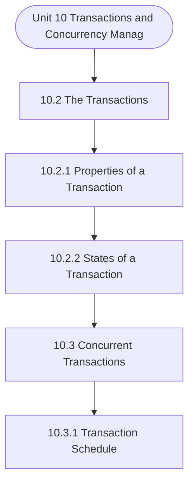

# MCS-207: Database Management Systems
## Unit 10: Transactions and Concurrency Management

> 📚 **Programme:** M.Sc. (Data Science and Analytics) | **Semester:** Semester 1  
> ⏱️ **Estimated Study Time:** ~56 mins | 📄 **Textbook Pages:** 27 Pages  
> 📥 **Original PDF:** [Download & View Authentic Textbook](../../../pdfs/Semester_1/MCS-207_Database_Management_Systems/Unit-10_Transactions_and_Concurrency_Management.pdf)

---

### 🎯 Executive Concept & Data Science Relevance
In modern data systems, **Transactions and Concurrency Management** forms a vital conceptual pillar. Relational algebra and SQL form the query engine of every data warehouse (Snowflake, BigQuery, Postgres). Concurrency protocols and normalization ensure data integrity and ACID consistency across concurrent transaction streams.

> [!NOTE]
> **Why this matters for your career:** Mastering transactions and concurrency management equips you with the foundational principles required to reason mathematically about high-dimensional datasets, evaluate algorithm performance, and avoid statistical pitfalls in production machine learning pipelines.

### 🗺️ Visual Knowledge Architecture
The following concept map illustrates the structural hierarchy and learning trajectory of this module:



### 📖 Core Definitions & Terminology Cards

> 📌 **Relational Algebra**  
> - **Formal Definition:** A procedural query language consisting of a set of operations on relations: Select ( $\sigma$ ), Project ( $\pi$ ), Union ( $\cup$ ), Set Difference ( $-$ ), Cartesian Product ( $\times$ ), and Join ( $\bowtie$ ).  
> - 💡 **Practical Intuition & Analogy:** *The formal mathematical syntax executed behind SQL `SELECT` queries.*

> 📌 **ACID Properties**  
> - **Formal Definition:** Atomicity (all or nothing), Consistency (preserves invariants), Isolation (concurrent execution equivalent to serial), Durability (committed data survives crashes).  
> - 💡 **Practical Intuition & Analogy:** *The financial transaction guarantee: money cannot disappear between debit and credit.*

> 📌 **Functional Dependency $X \to Y$**  
> - **Formal Definition:** A constraint between two sets of attributes: for any two valid tuples $t_1, t_2$, if $t_1[X] = t_2[X]$, then $t_1[Y] = t_2[Y]$. Value of $X$ uniquely determines $Y$.  
> - 💡 **Practical Intuition & Analogy:** *`StudentID` uniquely determines `StudentName`.*

> 📌 **Third Normal Form (3NF) & BCNF**  
> - **Formal Definition:** A relation is in 3NF if for every non-trivial $X \to Y$, either $X$ is a superkey or $Y$ is a prime attribute. It is in BCNF if $X$ is strictly a superkey.  
> - 💡 **Practical Intuition & Analogy:** *Eliminates transitive dependencies so data is stored in exactly one canonical place without update anomalies.*

### ⚡ Governing Mathematical Laws & Formula Cheatsheet
#### 🔹 Relational Algebra Selection & Projection
$$
\sigma_{\text{condition}}(R) \quad \text{and} \quad \pi_{\text{attributes}}(R)
$$
- **Explanation:** $\sigma$ filters rows (equivalent to SQL `WHERE`), while $\pi$ selects specific columns (equivalent to SQL `SELECT column_list`).

#### 🔹 Relational Natural Join
$$
R \bowtie S = \pi_{\mathcal{A}(R) \cup \mathcal{A}(S)}\left(\sigma_{\text{match}}(R \times S)\right)
$$
- **Explanation:** Performs equality join across all identically named attributes between two tables.

#### 🔹 Two-Phase Locking (2PL) Theorem
$$
\text{Growing Phase: Only Acquire Locks} \implies \text{Shrinking Phase: Only Release Locks}
$$
- **Explanation:** Guarantees conflict serializability of concurrent database schedules without data race anomalies.

### ⚖️ Axiomatic Properties & Governing Laws
The mathematical formulations of this module are anchored by foundational algebraic and structural laws:

- **Armstrong's Reflexivity:** $Y \subseteq X \implies X \to Y$
- **Armstrong's Augmentation:** $X \to Y \implies XZ \to YZ$
- **Armstrong's Transitivity:** $X \to Y \land Y \to Z \implies X \to Z$

### 📌 Comprehensive Section-by-Section Study Breakdown
#### `10.2` The Transactions
##### 📘 Theoretical Principles & In-Depth Exposition
A transaction has four basic properties. These are: • Atomicity • Consistency • Isolation • Durability These are also called the ACID properties of transactions. Atomicity: It defines a transaction to be a single unit of processing. In other words, either a transaction will be done completely or not at all.

For example, in the transaction of Example 2, the transaction is reading and writing more than one data items. The atomicity property requires either operations on both the data item to be performed or not at all. Consistency: This property ensures that complete transaction execution takes a database from one consistent state to another consistent state.

If a transaction fails even then the database should come back to a consistent state, i.e., either to the database state that was before the start of the transaction or the database state after the end of the transaction. 5,000/- from X to Y Start of transaction (The database may be in an End of transaction inconsistent state during execution of the transaction) Figure 1: A Transaction execution Isolation or Independence: The isolation property states that the updates of a transaction should not be visible till they are committed.

##### ⚙️ Mathematical & Algorithmic Mechanics
- **Formal Mechanics:** Establishes symbolic transformations and state invariants governing the transactions.
- **Boundary Invariants:** Ensures robust error-handling, non-empty set guarantees, and strict asymptotic bounds.

##### 📊 Practical Data Science & Production Relevance
- **Industry Application:** Directly implemented in production workflows such as SQL query filters, pandas vectorized operations, and feature transformation pipelines.
- **Production Pitfall:** Failing to verify membership bounds or missing edge cases in the transactions can cause silent data corruption or performance bottlenecks.

> [!TIP]
> **Key Exam & Technical Interview Takeaway:** Be prepared to define the transactions formally, cite its core mathematical invariants, and solve step-by-step numerical/proof questions.

#### `10.2.1` Properties of a Transaction
##### 📘 Theoretical Principles & In-Depth Exposition
A transaction has four basic properties. These are: • Atomicity • Consistency • Isolation • Durability These are also called the ACID properties of transactions. Atomicity: It defines a transaction to be a single unit of processing. In other words, either a transaction will be done completely or not at all.

For example, in the transaction of Example 2, the transaction is reading and writing more than one data items. The atomicity property requires either operations on both the data item to be performed or not at all. Consistency: This property ensures that complete transaction execution takes a database from one consistent state to another consistent state.

If a transaction fails even then the database should come back to a consistent state, i.e., either to the database state that was before the start of the transaction or the database state after the end of the transaction. 5,000/- from X to Y Start of transaction (The database may be in an End of transaction inconsistent state during execution of the transaction) Figure 1: A Transaction execution Isolation or Independence: The isolation property states that the updates of a transaction should not be visible till they are committed.

##### ⚙️ Mathematical & Algorithmic Mechanics
- **Formal Mechanics:** Establishes symbolic transformations and state invariants governing properties of a transaction.
- **Boundary Invariants:** Ensures robust error-handling, non-empty set guarantees, and strict asymptotic bounds.

##### 📊 Practical Data Science & Production Relevance
- **Industry Application:** Directly implemented in production workflows such as SQL query filters, pandas vectorized operations, and feature transformation pipelines.
- **Production Pitfall:** Failing to verify membership bounds or missing edge cases in properties of a transaction can cause silent data corruption or performance bottlenecks.

> [!TIP]
> **Key Exam & Technical Interview Takeaway:** Be prepared to define properties of a transaction formally, cite its core mathematical invariants, and solve step-by-step numerical/proof questions.

#### `10.2.2` States of a Transaction
##### 📘 Theoretical Principles & In-Depth Exposition
Consistent state X.balance = 5,000/- Y.balance = 25,000/- Consistent state X.balance = 5,000/- Y.balance = 20,000/- Inconsistent state X.balance = 10,000/- Y.balance = 20,000/- Execution A transaction can be in any one of the states during its execution. These states are displayed in Figure 2.

Figure 2: States of transaction execution A transaction is started by a program. When a transaction is scheduled for execution by the Processor, it moves to the Execute state; however, in case of any system error at that point, it may be moved into the Abort state. During its execution, a transaction changes the data values, which may move the database to an inconsistent state.

On successful completion of a transaction, it moves to the Commit state, where the durability feature of transaction ensures that the changes will not be lost. However, in case of an error in the execute state, the transaction goes to the Rollback state, where all the changes made by the transaction are undone.

##### ⚙️ Mathematical & Algorithmic Mechanics
- **Formal Mechanics:** Establishes symbolic transformations and state invariants governing states of a transaction.
- **Boundary Invariants:** Ensures robust error-handling, non-empty set guarantees, and strict asymptotic bounds.

##### 📊 Practical Data Science & Production Relevance
- **Industry Application:** Directly implemented in production workflows such as SQL query filters, pandas vectorized operations, and feature transformation pipelines.
- **Production Pitfall:** Failing to verify membership bounds or missing edge cases in states of a transaction can cause silent data corruption or performance bottlenecks.

> [!TIP]
> **Key Exam & Technical Interview Takeaway:** Be prepared to define states of a transaction formally, cite its core mathematical invariants, and solve step-by-step numerical/proof questions.

#### `10.3` Concurrent Transactions
##### 📘 Theoretical Principles & In-Depth Exposition
Almost all commercial DBMSs support multi-user environment, allowing multiple transactions to proceed simultaneously. The DBMS must ensure that two or more transactions do not get into each other's way, i.e., a transaction of one user does not affect the transactions of other users or even the other transactions issued by the same user.

Please note that concurrency related problems may occur in databases only if two transactions are contending for the same data item and at least one of the concurrent transactions wishes to update a data value in the database. In case the concurrent transactions only read the same data item and no updates are performed on these values, then they do NOT cause any concurrency related problem.

Now, let us first discuss why you need a mechanism to control concurrent transactions. This is explained next.

##### ⚙️ Mathematical & Algorithmic Mechanics
- **Formal Mechanics:** Establishes symbolic transformations and state invariants governing concurrent transactions.
- **Boundary Invariants:** Ensures robust error-handling, non-empty set guarantees, and strict asymptotic bounds.

##### 📊 Practical Data Science & Production Relevance
- **Industry Application:** Directly implemented in production workflows such as SQL query filters, pandas vectorized operations, and feature transformation pipelines.
- **Production Pitfall:** Failing to verify membership bounds or missing edge cases in concurrent transactions can cause silent data corruption or performance bottlenecks.

> [!TIP]
> **Key Exam & Technical Interview Takeaway:** Be prepared to define concurrent transactions formally, cite its core mathematical invariants, and solve step-by-step numerical/proof questions.

#### `10.3.1` Transaction Schedule
##### 📘 Theoretical Principles & In-Depth Exposition
Consider a banking application dealing with checking and saving accounts. A Banking Transaction T1 for Mr. Sharma moves Rs.100 from his checking account balance X to his savings account balance Y, using the transaction T1: Transaction T1: A:Read X Subtract Execute Start Commit Abort/ Rollback Write X B: Read Y Add 100 Write Y Let us suppose an auditor wants to know the total assets of Mr.

S/he executes the following transaction: Transaction T2: Read X Read Y Display X+Y Suppose both of these transactions are issued simultaneously, then the execution of these instructions can be mixed in many ways. This is also called the Schedule. Let us define this term in more detail.

Consider that a database system has n active transactions, namely T1, T2, …, Tn. Each of these transactions can be represented using a transaction program consisting of operations, as shown in Example 1 and Example 2. A schedule, say S, is defined as the sequential ordering of the operations of the ‘n’ interleaved transactions, where the sequence or order of operations of an individual transaction is maintained.

##### ⚙️ Mathematical & Algorithmic Mechanics
- **Formal Mechanics:** Establishes symbolic transformations and state invariants governing transaction schedule.
- **Boundary Invariants:** Ensures robust error-handling, non-empty set guarantees, and strict asymptotic bounds.

##### 📊 Practical Data Science & Production Relevance
- **Industry Application:** Directly implemented in production workflows such as SQL query filters, pandas vectorized operations, and feature transformation pipelines.
- **Production Pitfall:** Failing to verify membership bounds or missing edge cases in transaction schedule can cause silent data corruption or performance bottlenecks.

> [!TIP]
> **Key Exam & Technical Interview Takeaway:** Be prepared to define transaction schedule formally, cite its core mathematical invariants, and solve step-by-step numerical/proof questions.

#### `10.3.2` Problems of Concurrent Transactions
##### 📘 Theoretical Principles & In-Depth Exposition
Let us assume the following transactions (assuming there will not be errors in data while execution of transactions) Transaction T3 and T4: T3 reads the balance of account X and subtracts a withdrawal amount of Rs. 5000, whereas T4 reads the balance of account X and adds an amount of Rs.

3000 T3 T4 READ X READ X SUB 5000 ADD 3000 WRITE X WRITE X The possible problems in the concurrent execution of these transactions are: 1. Lost Update Anomaly: Suppose the two transactions T3 and T4 run concurrently, and they happen to be interleaved in the following way (assume the initial value of X as 10000): T3 T4 Value of X T3 T4 READ X READ X SUB 5000 ADD 3000 WRITE X WRITE X After the execution of both transactions, the value X is 13000, while the semantically correct value should be 8000.

The problem occurred as the update made by T3 has been overwritten by T4. The root cause of the problem was the fact that both the transactions had read the value of X as 10000. Thus, one of the two updates has been lost and we say that a lost update has occurred. There is one more way in which the lost updates can arise.

##### ⚙️ Mathematical & Algorithmic Mechanics
- **Formal Mechanics:** Establishes symbolic transformations and state invariants governing problems of concurrent transactions.
- **Boundary Invariants:** Ensures robust error-handling, non-empty set guarantees, and strict asymptotic bounds.

##### 📊 Practical Data Science & Production Relevance
- **Industry Application:** Directly implemented in production workflows such as SQL query filters, pandas vectorized operations, and feature transformation pipelines.
- **Production Pitfall:** Failing to verify membership bounds or missing edge cases in problems of concurrent transactions can cause silent data corruption or performance bottlenecks.

> [!TIP]
> **Key Exam & Technical Interview Takeaway:** Be prepared to define problems of concurrent transactions formally, cite its core mathematical invariants, and solve step-by-step numerical/proof questions.

#### `10.4` The Locking Protocol
##### 📘 Theoretical Principles & In-Depth Exposition
To control concurrency related problems, we use locking. A lock is basically a variable that is associated with a data item in the database. A lock can be placed by a transaction on a shared resource. A locked data item is available for the exclusive use of the transaction that has locked it.

Other transactions are locked out of that data item. When a transaction that has locked a data item does not desire to use it anymore, it should unlock the data item so that other transactions can use it. If a transaction tries to lock a data item already locked by some other transaction, it cannot do so and waits for the data item to be unlocked.

The component of DBMS that controls and manages the locking and unlocking of data items is called the Lock Manager. The locking mechanism helps us to convert a schedule into a serialisable schedule. We had defined what a schedule is, but what is a serialisable schedule?

##### ⚙️ Mathematical & Algorithmic Mechanics
- **Formal Mechanics:** Establishes symbolic transformations and state invariants governing the locking protocol.
- **Boundary Invariants:** Ensures robust error-handling, non-empty set guarantees, and strict asymptotic bounds.

##### 📊 Practical Data Science & Production Relevance
- **Industry Application:** Directly implemented in production workflows such as SQL query filters, pandas vectorized operations, and feature transformation pipelines.
- **Production Pitfall:** Failing to verify membership bounds or missing edge cases in the locking protocol can cause silent data corruption or performance bottlenecks.

> [!TIP]
> **Key Exam & Technical Interview Takeaway:** Be prepared to define the locking protocol formally, cite its core mathematical invariants, and solve step-by-step numerical/proof questions.

#### `10.4.1` Serialisable Schedule
##### 📘 Theoretical Principles & In-Depth Exposition
If the operations of two transactions conflict with each other, how to determine that no concurrency-related problems have occurred in the transaction execution? For this purpose, let us define the term – Schedule, Serial Schedule, interleaved schedule and Serializable Schedule. A schedule can be defined as a sequence of actions/operations of one or more transactions, as explained in section 10.3.1.

Figure 5 shows two schedules, viz. Schedule A and Schedule B. A serial schedule is one in which the actions/operations of one transaction are performed at a time. This is followed by the actions/operations of the next transaction and so on. For example, Schedule A and Schedule B of Figure 5 are serial schedules, as in no schedule operations of transactions T1 and Transaction T2 interleave with each other.

An interleaved schedule allows the interleaving of actions/operations of different transactions. For example, the schedule in Figure 6 is an interleaved schedule. The basic question here is: How will you find out that a given interleaved schedule has not resulted in concurrency-related problems?

##### ⚙️ Mathematical & Algorithmic Mechanics
- **Formal Mechanics:** Establishes symbolic transformations and state invariants governing serialisable schedule.
- **Boundary Invariants:** Ensures robust error-handling, non-empty set guarantees, and strict asymptotic bounds.

##### 📊 Practical Data Science & Production Relevance
- **Industry Application:** Directly implemented in production workflows such as SQL query filters, pandas vectorized operations, and feature transformation pipelines.
- **Production Pitfall:** Failing to verify membership bounds or missing edge cases in serialisable schedule can cause silent data corruption or performance bottlenecks.

> [!TIP]
> **Key Exam & Technical Interview Takeaway:** Be prepared to define serialisable schedule formally, cite its core mathematical invariants, and solve step-by-step numerical/proof questions.

### 📐 Step-by-Step Solved Mathematical Examples
To solidify your theoretical understanding, work through these fully solved, step-by-step mathematical problems:

#### 🧮 Example 1: BCNF Normalization Decomposition
> **Problem Statement:**  
> Given relation $R(A, B, C, D)$ with functional dependencies $F = \lbrace A \to B, \; B \to C, \; C \to D \rbrace$. Find candidate keys, check if $R$ is in BCNF, and decompose if necessary.

**Detailed Step-by-Step Solution:**

1. **Candidate Key:** Closure $(A)^+ = \lbrace A, B, C, D \rbrace$. Thus $A$ is the sole candidate key.
2. **BCNF Test:**
- $A \to B$: $A$ is superkey (Passes BCNF).
- $B \to C$: $B$ is NOT a superkey (Violates BCNF).
- $C \to D$: $C$ is NOT a superkey (Violates BCNF).

3. **Decomposition:**
- Decompose on $B \to C$: $R_1(B, C)$ with $B \to C$ (In BCNF, key $B$), and $R_2(A, B, D)$ with $A \to B, B \to D$.
- In $R_2$, $B \to D$ violates BCNF ($B$ not superkey for $R_2$). Decompose $R_2$ into $R_{21}(B, D)$ and $R_{22}(A, B)$.

Final BCNF schema: $R_1(B, C), \; R_{21}(B, D), \; R_{22}(A, B)$ (Lossless and dependency preserving).

#### 🧮 Example 2: Relational Algebra to SQL Translation
> **Problem Statement:**  
> Express relational algebra query $\pi_{\text{name, salary}}(\sigma_{\text{dept}='Analytics' \land \text{salary} > 80000}(\text{Employees}))$ into standard SQL.

**Detailed Step-by-Step Solution:**

```sql
SELECT name, salary
FROM Employees
WHERE dept = 'Analytics' AND salary > 80000;
```

### 💻 Practical Data Science Implementation (Python)
Theory translates directly into production algorithms. Below is a self-contained, commented Python implementation illustrating the core operations of this unit:

```python
import pandas as pd

# Simulating Relational Algebra with Pandas
emp = pd.DataFrame({
    'emp_id': [1, 2, 3, 4],
    'name': ['Alice', 'Bob', 'Charlie', 'David'],
    'dept_id': [10, 10, 20, 30]
})

dept = pd.DataFrame({
    'dept_id': [10, 20, 40],
    'dept_name': ['Analytics', 'Engineering', 'HR']
})

# 1. Selection (Sigma): dept_id == 10
sel = emp[emp['dept_id'] == 10]

# 2. Projection (Pi): ['name', 'dept_id']
proj = sel[['name', 'dept_id']]

# 3. Natural Join (Bowtie): emp ⨝ dept
natural_join = pd.merge(emp, dept, on='dept_id', how='inner')

print("Natural Join Result:\n", natural_join[['name', 'dept_name']])
```

### 💡 Interactive Self-Assessment Checkpoints
Test your comprehension before proceeding. Tap each question to reveal the comprehensive explanation:

<details>
<summary><b>Checkpoint 1:</b> What does ACID stand for in database management? <i>(Tap to reveal answer)</i></summary>

> **Answer & Analysis:**  
> Atomicity, Consistency, Isolation, and Durability.
</details>

<details>
<summary><b>Checkpoint 2:</b> What is the difference between 3NF and BCNF? <i>(Tap to reveal answer)</i></summary>

> **Answer & Analysis:**  
> In 3NF, for any non-trivial $X \to Y$, $X$ must be a superkey OR $Y$ must be a prime attribute. In BCNF (Boyce-Codd Normal Form), $X$ MUST strictly be a superkey (eliminating all dependencies on prime attributes).
</details>

<details>
<summary><b>Checkpoint 3:</b> What is the relational algebra symbol for row selection and column projection? <i>(Tap to reveal answer)</i></summary>

> **Answer & Analysis:**  
> Row selection: $\sigma$ (Sigma). Column projection: $\pi$ (Pi).
</details>

<details>
<summary><b>Checkpoint 4:</b> What is a transaction? What are its properties? Can a transaction update more than one data value? <i>(Tap to reveal answer)</i></summary>

> **Answer & Analysis:**  
> This question tests your conceptual mastery of Transactions and Concurrency Management. Review the governing formulas and section breakdowns above to formulate a complete, rigorous proof or derivation.
</details>

<details>
<summary><b>Checkpoint 5:</b> What are the anomalies of concurrent transactions? Can these problems occur in transactions which do not read the same data values? <i>(Tap to reveal answer)</i></summary>

> **Answer & Analysis:**  
> This question tests your conceptual mastery of Transactions and Concurrency Management. Review the governing formulas and section breakdowns above to formulate a complete, rigorous proof or derivation.
</details>

<details>
<summary><b>Checkpoint 6:</b> What is a Commit state? Can you rollback after the transaction commits? …………………………………………………………………………………… …………………………………………………………………………………… <i>(Tap to reveal answer)</i></summary>

> **Answer & Analysis:**  
> This question tests your conceptual mastery of Transactions and Concurrency Management. Review the governing formulas and section breakdowns above to formulate a complete, rigorous proof or derivation.
</details>

### 🎯 Executive Module Wrap-Up
- **Central Idea:** Transactions and Concurrency Management provides essential mathematical and algorithmic tools directly utilized in Data Science.
- **Mathematical Rigor:** Formulas and laws must be memorized with attention to boundary conditions and assumptions.
- **Full Textbook Coverage:** For exhaustive multi-page derivations, proofs, and supplementary exercises, consult the [Authentic IGNOU Textbook](../../../pdfs/Semester_1/MCS-207_Database_Management_Systems/Unit-10_Transactions_and_Concurrency_Management.pdf).

---
### 🧭 Navigation & Syllabus Index
[⬅ Previous: Unit 9](unit_09_Advanced_SQL.md) | [📑 Course Index](README.md) | [Next: Unit 11 ➡](unit_11_Database_Recovery_and_Security.md)
