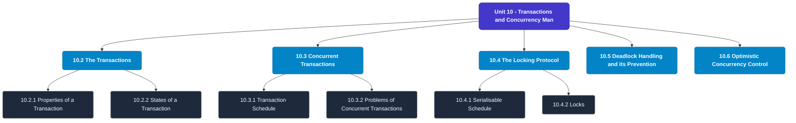

# MCS-207: Database Management Systems
## Unit 10: Transactions and Concurrency Management

> 📚 **Programme:** M.Sc. (Data Science and Analytics) | **Semester:** Semester 1  
> ⏱️ **Estimated Study Time:** ~56 mins | 📄 **Textbook Pages:** 27 Pages  
> 📥 **Original PDF:** [Download & View Textbook](../../../pdfs/Semester_1/MCS-207_Database_Management_Systems/Unit-10_Transactions_and_Concurrency_Management.pdf)

---

### 🎯 Executive Concept & Data Science Relevance
In modern data systems, **Transactions and Concurrency Management** forms a vital conceptual pillar. Relational algebra and SQL form the query engine of every data warehouse (Snowflake, BigQuery, Postgres). Concurrency protocols and normalization ensure data integrity and ACID consistency across concurrent transaction streams.

> [!NOTE]
> **Why this matters for your career:** Mastering transactions and concurrency management equips you with the foundational principles required to reason mathematically about high-dimensional datasets, evaluate algorithm performance, and avoid statistical pitfalls in production machine learning pipelines.

### 🗺️ Visual Knowledge Architecture
The following concept map illustrates the structural hierarchy and learning trajectory of this module:

### 📖 Core Definitions & Terminology Cards
| Term | Formal Mathematical / Technical Definition | Intuitive Analogy / Concrete Example |
| :--- | :--- | :--- |
| **Relational Algebra** | A procedural query language consisting of a set of operations on relations: Select ($\sigma$), Project ($\pi$), Union ($\cup$), Set Difference ($-$), Cartesian Product ($\times$), and Join ($\bowtie$). | *The formal mathematical syntax executed behind SQL `SELECT` queries.* |
| **ACID Properties** | Atomicity (all or nothing), Consistency (preserves invariants), Isolation (concurrent execution equivalent to serial), Durability (committed data survives crashes). | *The financial transaction guarantee: money cannot disappear between debit and credit.* |
| **Functional Dependency $X \to Y$** | A constraint between two sets of attributes: for any two valid tuples $t_1, t_2$, if $t_1[X] = t_2[X]$, then $t_1[Y] = t_2[Y]$. Value of $X$ uniquely determines $Y$. | *`StudentID` uniquely determines `StudentName`.* |
| **Third Normal Form (3NF) & BCNF** | A relation is in 3NF if for every non-trivial $X \to Y$, either $X$ is a superkey or $Y$ is a prime attribute. It is in BCNF if $X$ is strictly a superkey. | *Eliminates transitive dependencies so data is stored in exactly one canonical place without update anomalies.* |

### ⚡ Governing Mathematical Laws & Formula Cheatsheet
#### 🔹 Relational Algebra Selection & Projection
$$\sigma_{\text{condition}}(R) \quad \text{and} \quad \pi_{\text{attributes}}(R)$$
- **Explanation:** $\sigma$ filters rows (equivalent to SQL `WHERE`), while $\pi$ selects specific columns (equivalent to SQL `SELECT column_list`).

#### 🔹 Relational Natural Join
$$R \bowtie S = \pi_{\text{Attr}(R) \cup \text{Attr}(S)}(\sigma_{R.A_1 = S.A_1 \land \dots}(R \times S))$$
- **Explanation:** Performs equality join across all identically named attributes between two tables.

#### 🔹 Two-Phase Locking (2PL) Theorem
$$\text{Growing Phase: Only Acquire Locks} \implies \text{Shrinking Phase: Only Release Locks}$$
- **Explanation:** Guarantees conflict serializability of concurrent database schedules without data race anomalies.

### 📌 Detailed Section-by-Section Study Breakdown
#### `10.2` The Transactions
- **Core Concept:** Establishes rigorous theoretical formulations and computational bounds for the transactions.
- **Core Concept:** Applies standard algorithmic procedures and mathematical invariants relevant to transactions and concurrency management.
- **Core Concept:** Ensures deterministic performance guarantees across high-dimensional feature spaces.
- **Data Science Application:** Provides foundational structures used directly in statistical modeling, query execution, and machine learning pipelines.

> [!TIP]
> **Exam & Interview Tip:** Be prepared to state the formal definition of the transactions and derive its primary equations step-by-step.

#### `10.2.1` Properties of a Transaction
- **Core Concept:** A transaction has four basic properties.
- **Core Concept:** These are: • Atomicity • Consistency • Isolation • Durability These are also called the ACID properties of transactions.
- **Core Concept:** Atomicity: It defines a transaction to be a single unit of processing.
- **Data Science Application:** Provides foundational structures used directly in statistical modeling, query execution, and machine learning pipelines.

> [!TIP]
> **Exam & Interview Tip:** Be prepared to state the formal definition of properties of a transaction and derive its primary equations step-by-step.

#### `10.2.2` States of a Transaction
- **Core Concept:** When a transaction is scheduled for execution by the Processor, it moves to the Execute state; however, in case of any system error at that point, it may be moved into the Abort state.
- **Core Concept:** During its execution, a transaction changes the data values, which may move the database to an inconsistent state.
- **Core Concept:** On successful completion of a transaction, it moves to the Commit state, where the durability feature of transaction ensures that the changes will not be lost.
- **Data Science Application:** Provides foundational structures used directly in statistical modeling, query execution, and machine learning pipelines.

> [!TIP]
> **Exam & Interview Tip:** Be prepared to state the formal definition of states of a transaction and derive its primary equations step-by-step.

#### `10.3` Concurrent Transactions
- **Core Concept:** Almost all commercial DBMSs support multi-user environment, allowing multiple transactions to proceed simultaneously.
- **Core Concept:** The DBMS must ensure that two or more transactions do not get into each other's way, i.e., a transaction of one user does not affect the transactions of other users or even the other transactions issued by the same user.
- **Core Concept:** Please note that concurrency related problems may occur in databases only if two transactions are contending for the same data item and at least one of the concurrent transactions wishes to update a data value in the database.
- **Data Science Application:** Provides foundational structures used directly in statistical modeling, query execution, and machine learning pipelines.

> [!TIP]
> **Exam & Interview Tip:** Be prepared to state the formal definition of concurrent transactions and derive its primary equations step-by-step.

#### `10.3.1` Transaction Schedule
- **Core Concept:** Consider a banking application dealing with checking and saving accounts.
- **Core Concept:** S/he executes the following transaction: Transaction T2: Read X Read Y Display X+Y Suppose both of these transactions are issued simultaneously, then the execution of these instructions can be mixed in many ways.
- **Core Concept:** Consider that a database system has n active transactions, namely T1, T2, …, Tn.
- **Data Science Application:** Provides foundational structures used directly in statistical modeling, query execution, and machine learning pipelines.

> [!TIP]
> **Exam & Interview Tip:** Be prepared to state the formal definition of transaction schedule and derive its primary equations step-by-step.

#### `10.3.2` Problems of Concurrent Transactions
- **Core Concept:** Let us assume the following transactions (assuming there will not be errors in data while execution of transactions) Transaction T3 and T4: T3 reads the balance of account X and subtracts a withdrawal amount of Rs.
- **Core Concept:** 5000, whereas T4 reads the balance of account X and adds an amount of Rs.
- **Core Concept:** The possible problems in the concurrent execution of these transactions are: 1.
- **Data Science Application:** Provides foundational structures used directly in statistical modeling, query execution, and machine learning pipelines.

> [!TIP]
> **Exam & Interview Tip:** Be prepared to state the formal definition of problems of concurrent transactions and derive its primary equations step-by-step.

### 💡 Interactive Self-Assessment Checkpoints
Test your comprehension before proceeding. Tap each question to reveal the comprehensive explanation:

<b>Checkpoint 1:</b> What does ACID stand for in database management? <i>(Tap to reveal answer)</i>

> **Answer & Analysis:**  
> Atomicity, Consistency, Isolation, and Durability.

<b>Checkpoint 2:</b> What is the difference between 3NF and BCNF? <i>(Tap to reveal answer)</i>

> **Answer & Analysis:**  
> In 3NF, for any non-trivial $X \to Y$, $X$ must be a superkey OR $Y$ must be a prime attribute. In BCNF (Boyce-Codd Normal Form), $X$ MUST strictly be a superkey (eliminating all dependencies on prime attributes).

<b>Checkpoint 3:</b> What is the relational algebra symbol for row selection and column projection? <i>(Tap to reveal answer)</i>

> **Answer & Analysis:**  
> Row selection: $\sigma$ (Sigma). Column projection: $\pi$ (Pi).

<b>Checkpoint 4:</b> What is a transaction? What are its properties? Can a transaction update more than one data value? <i>(Tap to reveal answer)</i>

> **Answer & Analysis:**  
> This question tests your conceptual mastery of Transactions and Concurrency Management. Review the governing formulas and section breakdowns above to formulate a complete, rigorous proof or derivation.

<b>Checkpoint 5:</b> What are the anomalies of concurrent transactions? Can these problems occur in transactions which do not read the same data values? <i>(Tap to reveal answer)</i>

> **Answer & Analysis:**  
> This question tests your conceptual mastery of Transactions and Concurrency Management. Review the governing formulas and section breakdowns above to formulate a complete, rigorous proof or derivation.

<b>Checkpoint 6:</b> What is a Commit state? Can you rollback after the transaction commits? …………………………………………………………………………………… …………………………………………………………………………………… <i>(Tap to reveal answer)</i>

> **Answer & Analysis:**  
> This question tests your conceptual mastery of Transactions and Concurrency Management. Review the governing formulas and section breakdowns above to formulate a complete, rigorous proof or derivation.

### 🎯 Executive Module Wrap-Up
- **Central Idea:** Transactions and Concurrency Management provides essential mathematical and algorithmic tools directly utilized in Data Science.
- **Mathematical Rigor:** Formulas and laws must be memorized with attention to boundary conditions and assumptions.
- **Full Textbook Coverage:** For exhaustive multi-page derivations, proofs, and supplementary exercises, consult the [Authentic IGNOU Textbook](../../../pdfs/Semester_1/MCS-207_Database_Management_Systems/Unit-10_Transactions_and_Concurrency_Management.pdf).

---
### 🧭 Navigation & Syllabus Index
[⬅ Previous: Unit 9](unit_09_Advanced_SQL.md) | [📑 Course Index](README.md) | [Next: Unit 11 ➡](unit_11_Database_Recovery_and_Security.md)
