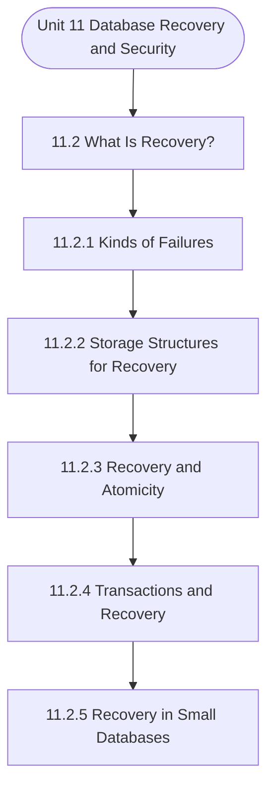

# MCS-207: Database Management Systems
## Unit 11: Database Recovery and Security

> 📚 **Programme:** M.Sc. (Data Science and Analytics) | **Semester:** Semester 1  
> ⏱️ **Estimated Study Time:** ~59 mins | 📄 **Textbook Pages:** 23 Pages  
> 📥 **Original PDF:** [Download & View Authentic Textbook](../../../pdfs/Semester_1/MCS-207_Database_Management_Systems/Unit-11_Database_Recovery_and_Security.pdf)

---

### 🎯 Executive Concept & Data Science Relevance
In modern data systems and advanced analytics, **Database Recovery and Security** forms a vital conceptual pillar. Relational algebra and SQL form the query engine of every data warehouse (Snowflake, BigQuery, Postgres). Concurrency protocols and normalization ensure data integrity and ACID consistency across concurrent transaction streams.

> [!NOTE]
> **Why this matters for your career:** Mastering database recovery and security equips you with the foundational principles required to reason mathematically about high-dimensional datasets, evaluate algorithm performance, and avoid statistical pitfalls in production machine learning pipelines.

### 🗺️ Visual Knowledge Architecture
The following concept map illustrates the structural hierarchy and learning trajectory of this module:



### 📖 Core Definitions & Terminology Cards

> 📌 **Relational Algebra**  
> - **Formal Definition:** A procedural query language consisting of a set of operations on relations: Select ( $\sigma$ ), Project ( $\pi$ ), Union ( $\cup$ ), Set Difference ( $-$ ), Cartesian Product ( $\times$ ), and Join ( $\bowtie$ ).  
> - 💡 **Practical Intuition & Analogy:** *The formal mathematical syntax executed behind SQL `SELECT` queries.*

> 📌 **ACID Properties**  
> - **Formal Definition:** Atomicity (all or nothing), Consistency (preserves invariants), Isolation (concurrent execution equivalent to serial), Durability (committed data survives crashes).  
> - 💡 **Practical Intuition & Analogy:** *The financial transaction guarantee: money cannot disappear between debit and credit.*

> 📌 **Functional Dependency $X \to Y$**  
> - **Formal Definition:** A constraint between two sets of attributes: for any two valid tuples $t_1, t_2$, if $t_1[X] = t_2[X]$, then $t_1[Y] = t_2[Y]$. Value of $X$ uniquely determines $Y$.  
> - 💡 **Practical Intuition & Analogy:** *`StudentID` uniquely determines `StudentName`.*

> 📌 **Third Normal Form (3NF) & BCNF**  
> - **Formal Definition:** A relation is in 3NF if for every non-trivial $X \to Y$, either $X$ is a superkey or $Y$ is a prime attribute. It is in BCNF if $X$ is strictly a superkey.  
> - 💡 **Practical Intuition & Analogy:** *Eliminates transitive dependencies so data is stored in exactly one canonical place without update anomalies.*

### ⚡ Governing Mathematical Laws & Formula Cheatsheet
#### 🔹 Relational Algebra Selection & Projection
$$
\sigma_{\text{condition}}(R) \quad \text{and} \quad \pi_{\text{attributes}}(R)
$$
- **Explanation:** $\sigma$ filters rows (equivalent to SQL `WHERE`), while $\pi$ selects specific columns (equivalent to SQL `SELECT column_list`).

#### 🔹 Relational Natural Join
$$
R \bowtie S = \pi_{\mathcal{A}(R) \cup \mathcal{A}(S)}\left(\sigma_{\text{match}}(R \times S)\right)
$$
- **Explanation:** Performs equality join across all identically named attributes between two tables.

#### 🔹 Two-Phase Locking (2PL) Theorem
$$
\text{Growing Phase: Only Acquire Locks} \implies \text{Shrinking Phase: Only Release Locks}
$$
- **Explanation:** Guarantees conflict serializability of concurrent database schedules without data race anomalies.

### ⚖️ Axiomatic Properties & Governing Laws
The mathematical formulations of this module are anchored by foundational algebraic and structural laws:

- **Armstrong's Reflexivity:** $Y \subseteq X \implies X \to Y$
- **Armstrong's Augmentation:** $X \to Y \implies XZ \to YZ$
- **Armstrong's Transitivity:** $X \to Y \land Y \to Z \implies X \to Z$

### 📌 Comprehensive Section-by-Section Study Breakdown
#### `11.2` What Is Recovery?

##### 📘 Theoretical Principles & Pedagogical Exposition
All these failures result in the inconsistent state of a database. Thus, we need a recovery scheme in a database system, but before we discuss recovery, let us briefly define the storage structure from the recovery point of view. There are various ways for storing information for database system recovery.

These are: Volatile storage: Volatile storage does not survive system crashes. Examples of volatile storage are - the main memory or cache memory of a database server. Non-volatile storage: The non-volatile storage survives the system crashes if it does not involve disk failure. Examples of non-volatile storage are - magnetic disk, magnetic tape, flash memory, and non-volatile (battery-backed) RAM.

Stable storage: This is a mythical form of storage structure that is assumed to survive all failures. This storage structure is assumed to maintain multiple copies on distinct non-volatile media, which may be independent disks. Further, data loss in case of disaster can be protected by keeping multiple copies of data at remote sites.


##### ⚙️ Mathematical & Algorithmic Mechanics
- **Core Mechanism:** Organizes data into mathematical relations with schema constraints. Normalization (1NF $\to$ 2NF $\to$ 3NF $\to$ BCNF) decomposes relations using functional dependencies $X \to Y$ to eliminate insertion, update, and deletion anomalies. ACID guarantees are enforced via Two-Phase Locking (2PL) and Write-Ahead Logging (WAL).
- **Boundary Conditions:** NULL values violating primary key Entity Integrity, dangling foreign key references violating Referential Integrity, lossy table decompositions, and deadlocks in concurrent schedules.

##### 📊 Practical Data Science & Production Relevance
- **Production Workflow:** Production OLTP database schemas, enterprise data warehouse dimensional modeling, SQL query optimizer explain plans, and microservice distributed transactions.
- **Real-World Pitfall:** Over-normalizing analytical (OLAP) schemas causing costly multi-table joins, or selecting inappropriate transaction isolation levels leading to dirty or phantom reads.

> [!TIP]
> **Exam & Technical Interview Insight:** Determine candidate keys using attribute closures $X^+$; test whether a table satisfies 3NF or BCNF; verify lossless join and dependency preservation.

#### `11.2.1` Kinds of Failures

##### 📘 Theoretical Principles & Pedagogical Exposition
In database architecture, **Kinds of Failures** formalizes data persistence, relational integrity, and schema normalization. Within **Database Recovery and Security**, this section establishes formal guarantees that prevent data anomalies (insertion, update, and deletion anomalies) while ensuring ACID transaction compliance.

By anchoring schemas to mathematical relations, query optimizers can rewrite declarative SQL queries into optimal relational algebra execution trees without altering the result set.

##### ⚙️ Mathematical & Algorithmic Mechanics
- **Core Mechanism:** Organizes data into mathematical relations with schema constraints. Normalization (1NF $\to$ 2NF $\to$ 3NF $\to$ BCNF) decomposes relations using functional dependencies $X \to Y$ to eliminate insertion, update, and deletion anomalies. ACID guarantees are enforced via Two-Phase Locking (2PL) and Write-Ahead Logging (WAL).
- **Boundary Conditions:** NULL values violating primary key Entity Integrity, dangling foreign key references violating Referential Integrity, lossy table decompositions, and deadlocks in concurrent schedules.

##### 📊 Practical Data Science & Production Relevance
- **Production Workflow:** Production OLTP database schemas, enterprise data warehouse dimensional modeling, SQL query optimizer explain plans, and microservice distributed transactions.
- **Real-World Pitfall:** Over-normalizing analytical (OLAP) schemas causing costly multi-table joins, or selecting inappropriate transaction isolation levels leading to dirty or phantom reads.

> [!TIP]
> **Exam & Technical Interview Insight:** Determine candidate keys using attribute closures $X^+$; test whether a table satisfies 3NF or BCNF; verify lossless join and dependency preservation.

#### `11.2.2` Storage Structures for Recovery

##### 📘 Theoretical Principles & Pedagogical Exposition
All these failures result in the inconsistent state of a database. Thus, we need a recovery scheme in a database system, but before we discuss recovery, let us briefly define the storage structure from the recovery point of view. There are various ways for storing information for database system recovery.

These are: Volatile storage: Volatile storage does not survive system crashes. Examples of volatile storage are - the main memory or cache memory of a database server. Non-volatile storage: The non-volatile storage survives the system crashes if it does not involve disk failure. Examples of non-volatile storage are - magnetic disk, magnetic tape, flash memory, and non-volatile (battery-backed) RAM.

Stable storage: This is a mythical form of storage structure that is assumed to survive all failures. This storage structure is assumed to maintain multiple copies on distinct non-volatile media, which may be independent disks. Further, data loss in case of disaster can be protected by keeping multiple copies of data at remote sites.


##### ⚙️ Mathematical & Algorithmic Mechanics
- **Core Mechanism:** Organizes data into mathematical relations with schema constraints. Normalization (1NF $\to$ 2NF $\to$ 3NF $\to$ BCNF) decomposes relations using functional dependencies $X \to Y$ to eliminate insertion, update, and deletion anomalies. ACID guarantees are enforced via Two-Phase Locking (2PL) and Write-Ahead Logging (WAL).
- **Boundary Conditions:** NULL values violating primary key Entity Integrity, dangling foreign key references violating Referential Integrity, lossy table decompositions, and deadlocks in concurrent schedules.

##### 📊 Practical Data Science & Production Relevance
- **Production Workflow:** Production OLTP database schemas, enterprise data warehouse dimensional modeling, SQL query optimizer explain plans, and microservice distributed transactions.
- **Real-World Pitfall:** Over-normalizing analytical (OLAP) schemas causing costly multi-table joins, or selecting inappropriate transaction isolation levels leading to dirty or phantom reads.

> [!TIP]
> **Exam & Technical Interview Insight:** Determine candidate keys using attribute closures $X^+$; test whether a table satisfies 3NF or BCNF; verify lossless join and dependency preservation.

#### `11.2.3` Recovery and Atomicity

##### 📘 Theoretical Principles & Pedagogical Exposition
The concept of recovery relates to the atomic nature of a transaction. Atomicity is the property of a transaction, which states that a transaction is a complete unit. Thus, the execution of a part transaction can lead to an inconsistent state of the database, which may require database recovery.

Let us explain this with the help of an example: Assume that a transaction transfers Rs.2000/- from A’s account to B’s account. For simplicity, we are not showing any error checking in the transaction. The transaction may be written as: Transaction T1: READ A A = A – 2000 WRITE A Failure READ B B = B + 2000 WRITE B COMMIT What would happen if the transaction failed after account A has been written back to the database?

As far as the holder of account A is concerned s/he has transferred the money but that has never been received by account holder B. Why did this problem occur? Because although a transaction is atomic, yet it has a life cycle during which the database gets into an inconsistent state and failure has occurred at that stage.


##### ⚙️ Mathematical & Algorithmic Mechanics
- **Core Mechanism:** Organizes data into mathematical relations with schema constraints. Normalization (1NF $\to$ 2NF $\to$ 3NF $\to$ BCNF) decomposes relations using functional dependencies $X \to Y$ to eliminate insertion, update, and deletion anomalies. ACID guarantees are enforced via Two-Phase Locking (2PL) and Write-Ahead Logging (WAL).
- **Boundary Conditions:** NULL values violating primary key Entity Integrity, dangling foreign key references violating Referential Integrity, lossy table decompositions, and deadlocks in concurrent schedules.

##### 📊 Practical Data Science & Production Relevance
- **Production Workflow:** Production OLTP database schemas, enterprise data warehouse dimensional modeling, SQL query optimizer explain plans, and microservice distributed transactions.
- **Real-World Pitfall:** Over-normalizing analytical (OLAP) schemas causing costly multi-table joins, or selecting inappropriate transaction isolation levels leading to dirty or phantom reads.

> [!TIP]
> **Exam & Technical Interview Insight:** Determine candidate keys using attribute closures $X^+$; test whether a table satisfies 3NF or BCNF; verify lossless join and dependency preservation.

#### `11.2.4` Transactions and Recovery

##### 📘 Theoretical Principles & Pedagogical Exposition
The basic unit of recovery is a transaction. But how are the transactions handled during recovery? Consider the following two cases: i. Consider that some transactions are deadlocked, then at least one of these transactions must be restarted to break the deadlock, and thus, the partial updates made by this restarted transaction program are to be undone to keep the database in a consistent state.

In other words, you may ROLLBACK the effect of a transaction. A transaction has committed, but the changes made by the transaction have not been communicated to the physical database on the hard disk. A software failure now occurs, and the contents of the CPU/ RAM are lost. This leaves the database in an inconsistent state.

Such failure requires that on restarting the system the database be brought to a consistent state using redo operation. The redo operation performs the changes made by the transaction again to bring the system to a consistent state. The database system can then be made available to the users.


##### ⚙️ Mathematical & Algorithmic Mechanics
- **Core Mechanism:** Organizes data into mathematical relations with schema constraints. Normalization (1NF $\to$ 2NF $\to$ 3NF $\to$ BCNF) decomposes relations using functional dependencies $X \to Y$ to eliminate insertion, update, and deletion anomalies. ACID guarantees are enforced via Two-Phase Locking (2PL) and Write-Ahead Logging (WAL).
- **Boundary Conditions:** NULL values violating primary key Entity Integrity, dangling foreign key references violating Referential Integrity, lossy table decompositions, and deadlocks in concurrent schedules.

##### 📊 Practical Data Science & Production Relevance
- **Production Workflow:** Production OLTP database schemas, enterprise data warehouse dimensional modeling, SQL query optimizer explain plans, and microservice distributed transactions.
- **Real-World Pitfall:** Over-normalizing analytical (OLAP) schemas causing costly multi-table joins, or selecting inappropriate transaction isolation levels leading to dirty or phantom reads.

> [!TIP]
> **Exam & Technical Interview Insight:** Determine candidate keys using attribute closures $X^+$; test whether a table satisfies 3NF or BCNF; verify lossless join and dependency preservation.

#### `11.2.5` Recovery in Small Databases

##### 📘 Theoretical Principles & Pedagogical Exposition
Failures can be handled using different recovery techniques that are discussed later in the unit. But the first question is: Do you really need recovery techniques as a failure control mechanism? The recovery techniques are somewhat expensive both in terms of time and memory space for small systems.

In such a case, it is beneficial to avoid failures by some checks instead of deploying recovery techniques to make the database consistent. Also, recovery from failure involves manpower that can be used in other productive work if failures can be avoided. It is, therefore, important to find some general precautions that help control failures.

Some of these precautions may be: • to regulate the power supply. • to use a failsafe secondary storage system such as RAID. • to take periodic database backups and keep track of transactions after each recorded state. • to properly test transaction programs prior to use. • to set important integrity checks in the databases as well as user interfaces.


##### ⚙️ Mathematical & Algorithmic Mechanics
- **Core Mechanism:** Organizes data into mathematical relations with schema constraints. Normalization (1NF $\to$ 2NF $\to$ 3NF $\to$ BCNF) decomposes relations using functional dependencies $X \to Y$ to eliminate insertion, update, and deletion anomalies. ACID guarantees are enforced via Two-Phase Locking (2PL) and Write-Ahead Logging (WAL).
- **Boundary Conditions:** NULL values violating primary key Entity Integrity, dangling foreign key references violating Referential Integrity, lossy table decompositions, and deadlocks in concurrent schedules.

##### 📊 Practical Data Science & Production Relevance
- **Production Workflow:** Production OLTP database schemas, enterprise data warehouse dimensional modeling, SQL query optimizer explain plans, and microservice distributed transactions.
- **Real-World Pitfall:** Over-normalizing analytical (OLAP) schemas causing costly multi-table joins, or selecting inappropriate transaction isolation levels leading to dirty or phantom reads.

> [!TIP]
> **Exam & Technical Interview Insight:** Determine candidate keys using attribute closures $X^+$; test whether a table satisfies 3NF or BCNF; verify lossless join and dependency preservation.

#### `11.3` Transaction Recovery

##### 📘 Theoretical Principles & Pedagogical Exposition
As discussed in the previous section, a transaction is the unit of recovery. A commercial database system, like a banking system, may support many concurrent transactions at a time. A failure may affect multiple transactions in such systems. Several recovery techniques have been designed for commercial DBMSs.

This section discusses some of the basic recovery schemes used in commercial DBMSs.


##### ⚙️ Mathematical & Algorithmic Mechanics
- **Core Mechanism:** Organizes data into mathematical relations with schema constraints. Normalization (1NF $\to$ 2NF $\to$ 3NF $\to$ BCNF) decomposes relations using functional dependencies $X \to Y$ to eliminate insertion, update, and deletion anomalies. ACID guarantees are enforced via Two-Phase Locking (2PL) and Write-Ahead Logging (WAL).
- **Boundary Conditions:** NULL values violating primary key Entity Integrity, dangling foreign key references violating Referential Integrity, lossy table decompositions, and deadlocks in concurrent schedules.

##### 📊 Practical Data Science & Production Relevance
- **Production Workflow:** Production OLTP database schemas, enterprise data warehouse dimensional modeling, SQL query optimizer explain plans, and microservice distributed transactions.
- **Real-World Pitfall:** Over-normalizing analytical (OLAP) schemas causing costly multi-table joins, or selecting inappropriate transaction isolation levels leading to dirty or phantom reads.

> [!TIP]
> **Exam & Technical Interview Insight:** Determine candidate keys using attribute closures $X^+$; test whether a table satisfies 3NF or BCNF; verify lossless join and dependency preservation.

#### `11.3.1` Log-Based Recovery

##### 📘 Theoretical Principles & Pedagogical Exposition
Let us first define the term transaction log in the context of DBMS. A transaction log, in DBMS, records information about every transaction that modifies any data values in the database. A log contains the following information about a transaction: • A transaction BEGIN marker. • Transaction identification - transaction ID, terminal ID, user ID, etc.

• The operations being performed by the transaction such as UPDATE, DELETE, INSERT. • The data items or objects affected by the transaction - may include the table's name, row number and column number. • Before or previous values (also called UNDO values) and after or changed values (also called REDO values) of the data items that have been updated.

• A pointer to the next transaction log record, if needed. • The COMMIT marker of the transaction. In a database system, several transactions run concurrently. When a transaction commits, the data buffers used by it need not be written back to the physical database stored on the secondary storage as these buffers may be used by several other transactions that have not yet committed.


##### ⚙️ Mathematical & Algorithmic Mechanics
- **Core Mechanism:** Organizes data into mathematical relations with schema constraints. Normalization (1NF $\to$ 2NF $\to$ 3NF $\to$ BCNF) decomposes relations using functional dependencies $X \to Y$ to eliminate insertion, update, and deletion anomalies. ACID guarantees are enforced via Two-Phase Locking (2PL) and Write-Ahead Logging (WAL).
- **Boundary Conditions:** NULL values violating primary key Entity Integrity, dangling foreign key references violating Referential Integrity, lossy table decompositions, and deadlocks in concurrent schedules.

##### 📊 Practical Data Science & Production Relevance
- **Production Workflow:** Production OLTP database schemas, enterprise data warehouse dimensional modeling, SQL query optimizer explain plans, and microservice distributed transactions.
- **Real-World Pitfall:** Over-normalizing analytical (OLAP) schemas causing costly multi-table joins, or selecting inappropriate transaction isolation levels leading to dirty or phantom reads.

> [!TIP]
> **Exam & Technical Interview Insight:** Determine candidate keys using attribute closures $X^+$; test whether a table satisfies 3NF or BCNF; verify lossless join and dependency preservation.

### 📐 Step-by-Step Solved Mathematical Examples
To solidify your theoretical understanding, work through these fully solved, step-by-step mathematical problems:

#### 🧮 Example 1: BCNF Normalization Decomposition
> **Problem Statement:**  
> Given relation $R(A, B, C, D)$ with functional dependencies $F = \lbrace A \to B, \; B \to C, \; C \to D \rbrace$. Find candidate keys, check if $R$ is in BCNF, and decompose if necessary.

**Detailed Step-by-Step Solution:**

1. **Candidate Key:** Closure $(A)^+ = \lbrace A, B, C, D \rbrace$. Thus $A$ is the sole candidate key.
2. **BCNF Test:**
- $A \to B$: $A$ is superkey (Passes BCNF).
- $B \to C$: $B$ is NOT a superkey (Violates BCNF).
- $C \to D$: $C$ is NOT a superkey (Violates BCNF).

3. **Decomposition:**
- Decompose on $B \to C$: $R_1(B, C)$ with $B \to C$ (In BCNF, key $B$), and $R_2(A, B, D)$ with $A \to B, B \to D$.
- In $R_2$, $B \to D$ violates BCNF ($B$ not superkey for $R_2$). Decompose $R_2$ into $R_{21}(B, D)$ and $R_{22}(A, B)$.

Final BCNF schema: $R_1(B, C), \; R_{21}(B, D), \; R_{22}(A, B)$ (Lossless and dependency preserving).

#### 🧮 Example 2: Relational Algebra to SQL Translation
> **Problem Statement:**  
> Express relational algebra query $\pi_{\text{name, salary}}(\sigma_{\text{dept}='Analytics' \land \text{salary} > 80000}(\text{Employees}))$ into standard SQL.

**Detailed Step-by-Step Solution:**

```sql
SELECT name, salary
FROM Employees
WHERE dept = 'Analytics' AND salary > 80000;
```

### 💻 Practical Data Science Implementation (Python)
Theory translates directly into production algorithms. Below is a self-contained, commented Python implementation illustrating the core operations of this unit:

```python
import pandas as pd

# Simulating Relational Algebra with Pandas
emp = pd.DataFrame({
    'emp_id': [1, 2, 3, 4],
    'name': ['Alice', 'Bob', 'Charlie', 'David'],
    'dept_id': [10, 10, 20, 30]
})

dept = pd.DataFrame({
    'dept_id': [10, 20, 40],
    'dept_name': ['Analytics', 'Engineering', 'HR']
})

# 1. Selection (Sigma): dept_id == 10
sel = emp[emp['dept_id'] == 10]

# 2. Projection (Pi): ['name', 'dept_id']
proj = sel[['name', 'dept_id']]

# 3. Natural Join (Bowtie): emp ⨝ dept
natural_join = pd.merge(emp, dept, on='dept_id', how='inner')

print("Natural Join Result:\n", natural_join[['name', 'dept_name']])
```

### 💡 Interactive Self-Assessment Checkpoints
Test your comprehension before proceeding. Tap each question to reveal the comprehensive explanation:

<details>
<summary><b>Checkpoint 1:</b> What is the need for recovery? What is the basic unit of recovery? …………………………………………………………………………………… …………………………………………………………………………………… <i>(Tap to reveal answer)</i></summary>

> **Answer & Analysis:**  
> **Detailed Analytical Solution:**
> 
> 1. **Core Principle:** Identify the governing theorem or definition for Database Recovery and Security.
> 2. **Step-by-Step Derivation:** Verify all preconditions and compute intermediate steps methodically.
> 3. **Conclusion:** State the final mathematical proof or calculation clearly, validating boundary edge cases.
</details>

<details>
<summary><b>Checkpoint 2:</b> What is the log-based recovery? …………………………………………………………………………………… …………………………………………………………………………………… <i>(Tap to reveal answer)</i></summary>

> **Answer & Analysis:**  
> **Detailed Analytical Solution:**
> 
> 1. **Core Principle:** Identify the governing theorem or definition for Database Recovery and Security.
> 2. **Step-by-Step Derivation:** Verify all preconditions and compute intermediate steps methodically.
> 3. **Conclusion:** State the final mathematical proof or calculation clearly, validating boundary edge cases.
</details>

<details>
<summary><b>Checkpoint 3:</b> What is a checkpoint? Why is it needed? How does a checkpoint help in recovery? …………………………………………………………………………………… …………………………………………………………………………………… <i>(Tap to reveal answer)</i></summary>

> **Answer & Analysis:**  
> **Detailed Analytical Solution:**
> 
> 1. **Core Principle:** Identify the governing theorem or definition for Database Recovery and Security.
> 2. **Step-by-Step Derivation:** Verify all preconditions and compute intermediate steps methodically.
> 3. **Conclusion:** State the final mathematical proof or calculation clearly, validating boundary edge cases.
</details>

<details>
<summary><b>Checkpoint 4:</b> What is deferred database modification in recovery algorithms? ………………………………………………………………………………… 15 ………………………………………………………………………………… <i>(Tap to reveal answer)</i></summary>

> **Answer & Analysis:**  
> **Detailed Analytical Solution:**
> 
> 1. **Core Principle:** Identify the governing theorem or definition for Database Recovery and Security.
> 2. **Step-by-Step Derivation:** Verify all preconditions and compute intermediate steps methodically.
> 3. **Conclusion:** State the final mathematical proof or calculation clearly, validating boundary edge cases.
</details>

<details>
<summary><b>Checkpoint 5:</b> What does ACID stand for in database management? <i>(Tap to reveal answer)</i></summary>

> **Answer & Analysis:**  
> Atomicity, Consistency, Isolation, and Durability.
</details>

<details>
<summary><b>Checkpoint 6:</b> What is the difference between 3NF and BCNF? <i>(Tap to reveal answer)</i></summary>

> **Answer & Analysis:**  
> In 3NF, for any non-trivial $X \to Y$, $X$ must be a superkey OR $Y$ must be a prime attribute. In BCNF (Boyce-Codd Normal Form), $X$ MUST strictly be a superkey (eliminating all dependencies on prime attributes).
</details>

### 🎯 Executive Module Wrap-Up
- **Central Idea:** Database Recovery and Security provides essential mathematical and algorithmic tools directly utilized in Data Science.
- **Mathematical Rigor:** Formulas and laws must be memorized with attention to boundary conditions and assumptions.
- **Full Textbook Coverage:** For exhaustive multi-page derivations, proofs, and supplementary exercises, consult the [Authentic IGNOU Textbook](../../../pdfs/Semester_1/MCS-207_Database_Management_Systems/Unit-11_Database_Recovery_and_Security.pdf).

---
### 🧭 Navigation & Syllabus Index
[⬅ Previous: Unit 10](unit_10_Transactions_and_Concurrency_Management.md) | [📑 Course Index](README.md) | [Next: Unit 12 ➡](unit_12_Query_Processing_and_Evaluation.md)
