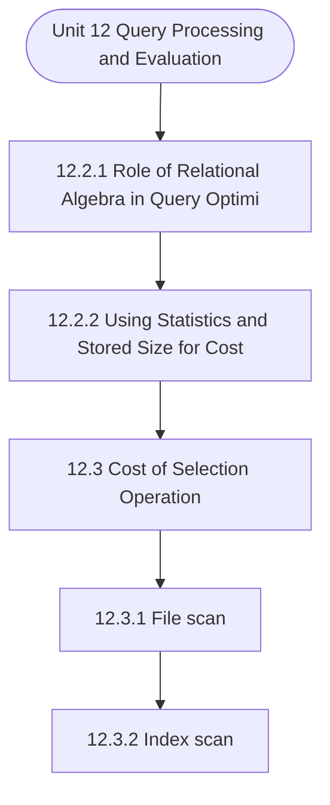

# MCS-207: Database Management Systems
## Unit 12: Query Processing and Evaluation

> 📚 **Programme:** M.Sc. (Data Science and Analytics) | **Semester:** Semester 1  
> ⏱️ **Estimated Study Time:** ~39 mins | 📄 **Textbook Pages:** 19 Pages  
> 📥 **Original PDF:** [Download & View Authentic Textbook](../../../pdfs/Semester_1/MCS-207_Database_Management_Systems/Unit-12_Query_Processing_and_Evaluation.pdf)

---

### 🎯 Executive Concept & Data Science Relevance
In modern data systems, **Query Processing and Evaluation** forms a vital conceptual pillar. Relational algebra and SQL form the query engine of every data warehouse (Snowflake, BigQuery, Postgres). Concurrency protocols and normalization ensure data integrity and ACID consistency across concurrent transaction streams.

> [!NOTE]
> **Why this matters for your career:** Mastering query processing and evaluation equips you with the foundational principles required to reason mathematically about high-dimensional datasets, evaluate algorithm performance, and avoid statistical pitfalls in production machine learning pipelines.

### 🗺️ Visual Knowledge Architecture
The following concept map illustrates the structural hierarchy and learning trajectory of this module:



### 📖 Core Definitions & Terminology Cards

> 📌 **Relational Algebra**  
> - **Formal Definition:** A procedural query language consisting of a set of operations on relations: Select ( $\sigma$ ), Project ( $\pi$ ), Union ( $\cup$ ), Set Difference ( $-$ ), Cartesian Product ( $\times$ ), and Join ( $\bowtie$ ).  
> - 💡 **Practical Intuition & Analogy:** *The formal mathematical syntax executed behind SQL `SELECT` queries.*

> 📌 **ACID Properties**  
> - **Formal Definition:** Atomicity (all or nothing), Consistency (preserves invariants), Isolation (concurrent execution equivalent to serial), Durability (committed data survives crashes).  
> - 💡 **Practical Intuition & Analogy:** *The financial transaction guarantee: money cannot disappear between debit and credit.*

> 📌 **Functional Dependency $X \to Y$**  
> - **Formal Definition:** A constraint between two sets of attributes: for any two valid tuples $t_1, t_2$, if $t_1[X] = t_2[X]$, then $t_1[Y] = t_2[Y]$. Value of $X$ uniquely determines $Y$.  
> - 💡 **Practical Intuition & Analogy:** *`StudentID` uniquely determines `StudentName`.*

> 📌 **Third Normal Form (3NF) & BCNF**  
> - **Formal Definition:** A relation is in 3NF if for every non-trivial $X \to Y$, either $X$ is a superkey or $Y$ is a prime attribute. It is in BCNF if $X$ is strictly a superkey.  
> - 💡 **Practical Intuition & Analogy:** *Eliminates transitive dependencies so data is stored in exactly one canonical place without update anomalies.*

### ⚡ Governing Mathematical Laws & Formula Cheatsheet
#### 🔹 Relational Algebra Selection & Projection
$$
\sigma_{\text{condition}}(R) \quad \text{and} \quad \pi_{\text{attributes}}(R)
$$
- **Explanation:** $\sigma$ filters rows (equivalent to SQL `WHERE`), while $\pi$ selects specific columns (equivalent to SQL `SELECT column_list`).

#### 🔹 Relational Natural Join
$$
R \bowtie S = \pi_{\mathcal{A}(R) \cup \mathcal{A}(S)}\left(\sigma_{\text{match}}(R \times S)\right)
$$
- **Explanation:** Performs equality join across all identically named attributes between two tables.

#### 🔹 Two-Phase Locking (2PL) Theorem
$$
\text{Growing Phase: Only Acquire Locks} \implies \text{Shrinking Phase: Only Release Locks}
$$
- **Explanation:** Guarantees conflict serializability of concurrent database schedules without data race anomalies.

### ⚖️ Axiomatic Properties & Governing Laws
The mathematical formulations of this module are anchored by foundational algebraic and structural laws:

- **Armstrong's Reflexivity:** $Y \subseteq X \implies X \to Y$
- **Armstrong's Augmentation:** $X \to Y \implies XZ \to YZ$
- **Armstrong's Transitivity:** $X \to Y \land Y \to Z \implies X \to Z$

### 📌 Comprehensive Section-by-Section Study Breakdown
#### `12.2.1` Role of Relational Algebra in Query Optimisation
##### 📘 Theoretical Principles & In-Depth Exposition
In order to optimise the evaluation of a query, first, you must define the query using relational algebra. A relational algebra expression may have many equivalent expressions. For example, the relational algebraic expression s (salary < 5000) (psalary (EMP)) is equivalent to psalary (ssalary < 5000 (EMP)).

This may result in generating many alternative ways of evaluating the query. Further, a relational algebraic expression can be evaluated in many different ways. A detailed evaluation strategy for an expression is known as an evaluation plan. For example, you can use an index on salary to find employees with salary < 5000, or you can perform a complete relation scan and discard employees with salary ³ 5000.

Both of these are separate evaluation plans. The basis of the selection of the best evaluation plan is the cost of these evaluation plans. Query Optimisation: The query optimisation selects the query evaluation plan with the lowest cost among the equivalent query evaluation plans.

##### ⚙️ Mathematical & Algorithmic Mechanics
- **Formal Mechanics:** Establishes symbolic transformations and state invariants governing role of relational algebra in query optimisation.
- **Boundary Invariants:** Ensures robust error-handling, non-empty set guarantees, and strict asymptotic bounds.

##### 📊 Practical Data Science & Production Relevance
- **Industry Application:** Directly implemented in production workflows such as SQL query filters, pandas vectorized operations, and feature transformation pipelines.
- **Production Pitfall:** Failing to verify membership bounds or missing edge cases in role of relational algebra in query optimisation can cause silent data corruption or performance bottlenecks.

> [!TIP]
> **Key Exam & Technical Interview Takeaway:** Be prepared to define role of relational algebra in query optimisation formally, cite its core mathematical invariants, and solve step-by-step numerical/proof questions.

#### `12.2.2` Using Statistics and Stored Size for Cost Estimation.
##### 📘 Theoretical Principles & In-Depth Exposition
The query cost is generally measured as the total elapsed time for answering the query. There are many factors that contribute to the cost in terms of elapsed time. These are the time of disk accesses, CPU time, and data communication time on the network. However, these times can be measured when the query is being executed.

Therefore, you may use statistics, like the number of records, number of blocks, number of attributes, possible number of different values for each attribute, etc., to estimate the cost. However, disk access is typically the predominant cost as disk transfer is very slow. In addition, disk accesses are relatively easier to estimate.

Therefore, the following disk access cost can be used to estimate the query cost: Number of seeks ´ average-seek-time; and Number of blocks read ´ average-block-read-time; and Number of blocks written ´ average-block-write-time. Please note that the cost of writing a block is higher than the cost of reading a block.

##### ⚙️ Mathematical & Algorithmic Mechanics
- **Formal Mechanics:** Establishes symbolic transformations and state invariants governing using statistics and stored size for cost estimation..
- **Boundary Invariants:** Ensures robust error-handling, non-empty set guarantees, and strict asymptotic bounds.

##### 📊 Practical Data Science & Production Relevance
- **Industry Application:** Directly implemented in production workflows such as SQL query filters, pandas vectorized operations, and feature transformation pipelines.
- **Production Pitfall:** Failing to verify membership bounds or missing edge cases in using statistics and stored size for cost estimation. can cause silent data corruption or performance bottlenecks.

> [!TIP]
> **Key Exam & Technical Interview Takeaway:** Be prepared to define using statistics and stored size for cost estimation. formally, cite its core mathematical invariants, and solve step-by-step numerical/proof questions.

#### `12.3` Cost of Selection Operation
##### 📘 Theoretical Principles & In-Depth Exposition
The selection operation can be performed in several ways. Let us discuss the algorithms and the related cost of performing selection operation.

##### ⚙️ Mathematical & Algorithmic Mechanics
- **Formal Mechanics:** Establishes symbolic transformations and state invariants governing cost of selection operation.
- **Boundary Invariants:** Ensures robust error-handling, non-empty set guarantees, and strict asymptotic bounds.

##### 📊 Practical Data Science & Production Relevance
- **Industry Application:** Directly implemented in production workflows such as SQL query filters, pandas vectorized operations, and feature transformation pipelines.
- **Production Pitfall:** Failing to verify membership bounds or missing edge cases in cost of selection operation can cause silent data corruption or performance bottlenecks.

> [!TIP]
> **Key Exam & Technical Interview Takeaway:** Be prepared to define cost of selection operation formally, cite its core mathematical invariants, and solve step-by-step numerical/proof questions.

#### `12.3.1` File scan
##### 📘 Theoretical Principles & In-Depth Exposition
File scan algorithms locate and retrieve records that fulfil a selection condition in a file. The following are the two basic file scan algorithms for selection operation: 1) Linear search: This algorithm scans each file block and tests all records to see whether their attributes match the selection condition.

The cost of this algorithm (in terms of block transfer): This algorithm would require reading all the blocks of the file, as it must test all the records for the specific condition. 𝑪𝒐𝒔𝒕𝑻𝒐 𝒇𝒊𝒏𝒅 𝒓𝒆𝒐𝒓𝒅𝒔 𝒕𝒉𝒂𝒕 𝒎𝒂𝒕𝒄𝒉 𝒂 𝒈𝒊𝒗𝒆𝒏 𝒄𝒓𝒊𝒕𝒆𝒓𝒊𝒂 = 𝑆𝑖𝑧𝑒 𝑜𝑓 𝑑𝑎𝑡𝑎𝑏𝑎𝑠𝑒 𝑖𝑛 𝑡𝑒𝑟𝑚𝑠 𝑜𝑓 𝑁𝑢𝑚𝑏𝑒𝑟 𝑜𝑓 𝑏𝑙𝑜𝑐𝑘𝑠 = 𝑁2.

𝑪𝒐𝒔𝒕 𝑭𝒊𝒏𝒅𝒊𝒏𝒈 𝒂 𝒔𝒑𝒆𝒄𝒊𝒇𝒊𝒄 𝒗𝒂𝒍𝒖𝒆 𝒐𝒇 𝒌𝒆𝒚 𝒂𝒕𝒕𝒓𝒊𝒃𝒖𝒕𝒆 = 𝐴𝑣𝑒𝑟𝑎𝑔𝑒 𝑛𝑢𝑚𝑏𝑒𝑟 𝑜𝑓 𝑏𝑙𝑜𝑐𝑘 𝑡𝑟𝑎𝑛𝑠𝑓𝑒𝑟 𝑓𝑜𝑟 𝑙𝑜𝑐𝑎𝑡𝑖𝑛𝑔 𝑡ℎ𝑒 𝑣𝑎𝑙𝑢𝑒 (𝑜𝑛 𝑎𝑛 𝑎𝑣𝑒𝑟𝑎𝑔𝑒 ℎ𝑎𝑙𝑓 𝑜𝑓 𝑡ℎ𝑒 𝑓𝑖𝑙𝑒 𝑛𝑒𝑒𝑑𝑠 𝑡𝑜 𝑏𝑒 𝑡𝑟𝑎𝑣𝑒𝑟𝑠𝑒𝑑) 𝑠𝑜 𝑡ℎ𝑒 𝑐𝑜𝑠𝑡 𝑖𝑠 = 𝑁2/2. Linear search can be applied regardless of selection condition or ordering of records in the file, or availability of indices.

##### ⚙️ Mathematical & Algorithmic Mechanics
- **Formal Mechanics:** Establishes symbolic transformations and state invariants governing file scan.
- **Boundary Invariants:** Ensures robust error-handling, non-empty set guarantees, and strict asymptotic bounds.

##### 📊 Practical Data Science & Production Relevance
- **Industry Application:** Directly implemented in production workflows such as SQL query filters, pandas vectorized operations, and feature transformation pipelines.
- **Production Pitfall:** Failing to verify membership bounds or missing edge cases in file scan can cause silent data corruption or performance bottlenecks.

> [!TIP]
> **Key Exam & Technical Interview Takeaway:** Be prepared to define file scan formally, cite its core mathematical invariants, and solve step-by-step numerical/proof questions.

#### `12.3.2` Index scan
##### 📘 Theoretical Principles & In-Depth Exposition
The index scan can be used for cases where the database contains an index on an attribute set that forms the search key. 1) (a) Scanning for equality condition on a Primary index: These kinds of searches try to find a specific key value using the primary index of a database system.

Since the search criteria include equality on the primary key, therefore, the output of this search would be just a single record or no record at all. The cost of the scan is defined as: Cost = The depth traversed in the index to locate the block pointer + 1 (for transfer of block consisting of desired primary key value).

(b) Hash key: It retrieves a single block directly, thus, the cost in the hash key organisation is given as: =Block transfer needed for finding hash target +1 2) Primary index-scan for comparison: Assuming that the relation is sorted on the attribute(s) that are being compared, (< , > etc.), then we need to locate the first record satisfying the condition after which the records are scanned forward or backwards as the condition may be, displaying all the records.

##### ⚙️ Mathematical & Algorithmic Mechanics
- **Formal Mechanics:** Establishes symbolic transformations and state invariants governing index scan.
- **Boundary Invariants:** Ensures robust error-handling, non-empty set guarantees, and strict asymptotic bounds.

##### 📊 Practical Data Science & Production Relevance
- **Industry Application:** Directly implemented in production workflows such as SQL query filters, pandas vectorized operations, and feature transformation pipelines.
- **Production Pitfall:** Failing to verify membership bounds or missing edge cases in index scan can cause silent data corruption or performance bottlenecks.

> [!TIP]
> **Key Exam & Technical Interview Takeaway:** Be prepared to define index scan formally, cite its core mathematical invariants, and solve step-by-step numerical/proof questions.

#### `12.3.3` Implementation of Complex Selections
##### 📘 Theoretical Principles & In-Depth Exposition
Conjunction: Conjunction is basically a set of AND conditions. Conjunctive selection using one index: In such case, select any algorithm given earlier on one or more conditions and then test remaining conditions on the selected tuples after fetching them into the memory buffer. Conjunctive selection using the multiple-key index: Use appropriate composite (multiple-key) index if they are available.

Disjunction: Disjunctions are basically a set of OR conditions. Disjunction using the union of identifiers is applicable if all conditions have available indices, otherwise, use linear scan. Use the corresponding index for each condition, take the union of all the obtained sets of record pointers, and eliminate duplicates, then fetch data from the file.

Negation: Use linear scan on file. However, if very few records are available in the result and an index is applicable on an attribute, which is being negated, then find the satisfying records using the index and fetch them from the file.

##### ⚙️ Mathematical & Algorithmic Mechanics
- **Formal Mechanics:** Establishes symbolic transformations and state invariants governing implementation of complex selections.
- **Boundary Invariants:** Ensures robust error-handling, non-empty set guarantees, and strict asymptotic bounds.

##### 📊 Practical Data Science & Production Relevance
- **Industry Application:** Directly implemented in production workflows such as SQL query filters, pandas vectorized operations, and feature transformation pipelines.
- **Production Pitfall:** Failing to verify membership bounds or missing edge cases in implementation of complex selections can cause silent data corruption or performance bottlenecks.

> [!TIP]
> **Key Exam & Technical Interview Takeaway:** Be prepared to define implementation of complex selections formally, cite its core mathematical invariants, and solve step-by-step numerical/proof questions.

#### `12.4` Cost of Sorting
##### 📘 Theoretical Principles & In-Depth Exposition
This section introduces the cost of query evaluation when it requires sorting of records. There are various methods that can be used in the following ways: 1) Use an existing applicable ordered index (e.g., B+ tree) to read the relation in sorted order. 2) Build an index on the relation, and then use the index to read the relation in sorted order.

(Options 1 and 2 may lead to one block access per tuple). 3) Techniques like quicksort can be used for relations that fit in the memory. 4) External sort-merge is a good choice for relations that do not fit in the memory. Once you decide on the sorting technique, you can find the cost of these algorithms to find the sorted file.

##### ⚙️ Mathematical & Algorithmic Mechanics
- **Formal Mechanics:** Establishes symbolic transformations and state invariants governing cost of sorting.
- **Boundary Invariants:** Ensures robust error-handling, non-empty set guarantees, and strict asymptotic bounds.

##### 📊 Practical Data Science & Production Relevance
- **Industry Application:** Directly implemented in production workflows such as SQL query filters, pandas vectorized operations, and feature transformation pipelines.
- **Production Pitfall:** Failing to verify membership bounds or missing edge cases in cost of sorting can cause silent data corruption or performance bottlenecks.

> [!TIP]
> **Key Exam & Technical Interview Takeaway:** Be prepared to define cost of sorting formally, cite its core mathematical invariants, and solve step-by-step numerical/proof questions.

#### `12.5` Cost of Join Operation
##### 📘 Theoretical Principles & In-Depth Exposition
There are several algorithms that can be used to implement joins: • Nested-loop join • Block nested-loop join • Indexed nested-loop join • Merge-join • Hash-join The choice of join algorithm is based on the cost estimates. We will elaborate on only a few of these algorithms in this section.

The following relations and related statistics will be used to elaborate those algorithms. MARKS (enrollno, subjectcode, marks): 20000 rows, 500 blocks STUDENT (enrollno, name, dob): 5000 rows, 200 blocks.

##### ⚙️ Mathematical & Algorithmic Mechanics
- **Formal Mechanics:** Establishes symbolic transformations and state invariants governing cost of join operation.
- **Boundary Invariants:** Ensures robust error-handling, non-empty set guarantees, and strict asymptotic bounds.

##### 📊 Practical Data Science & Production Relevance
- **Industry Application:** Directly implemented in production workflows such as SQL query filters, pandas vectorized operations, and feature transformation pipelines.
- **Production Pitfall:** Failing to verify membership bounds or missing edge cases in cost of join operation can cause silent data corruption or performance bottlenecks.

> [!TIP]
> **Key Exam & Technical Interview Takeaway:** Be prepared to define cost of join operation formally, cite its core mathematical invariants, and solve step-by-step numerical/proof questions.

### 📐 Step-by-Step Solved Mathematical Examples
To solidify your theoretical understanding, work through these fully solved, step-by-step mathematical problems:

#### 🧮 Example 1: BCNF Normalization Decomposition
> **Problem Statement:**  
> Given relation $R(A, B, C, D)$ with functional dependencies $F = \lbrace A \to B, \; B \to C, \; C \to D \rbrace$. Find candidate keys, check if $R$ is in BCNF, and decompose if necessary.

**Detailed Step-by-Step Solution:**

1. **Candidate Key:** Closure $(A)^+ = \lbrace A, B, C, D \rbrace$. Thus $A$ is the sole candidate key.
2. **BCNF Test:**
- $A \to B$: $A$ is superkey (Passes BCNF).
- $B \to C$: $B$ is NOT a superkey (Violates BCNF).
- $C \to D$: $C$ is NOT a superkey (Violates BCNF).

3. **Decomposition:**
- Decompose on $B \to C$: $R_1(B, C)$ with $B \to C$ (In BCNF, key $B$), and $R_2(A, B, D)$ with $A \to B, B \to D$.
- In $R_2$, $B \to D$ violates BCNF ($B$ not superkey for $R_2$). Decompose $R_2$ into $R_{21}(B, D)$ and $R_{22}(A, B)$.

Final BCNF schema: $R_1(B, C), \; R_{21}(B, D), \; R_{22}(A, B)$ (Lossless and dependency preserving).

#### 🧮 Example 2: Relational Algebra to SQL Translation
> **Problem Statement:**  
> Express relational algebra query $\pi_{\text{name, salary}}(\sigma_{\text{dept}='Analytics' \land \text{salary} > 80000}(\text{Employees}))$ into standard SQL.

**Detailed Step-by-Step Solution:**

```sql
SELECT name, salary
FROM Employees
WHERE dept = 'Analytics' AND salary > 80000;
```

### 💻 Practical Data Science Implementation (Python)
Theory translates directly into production algorithms. Below is a self-contained, commented Python implementation illustrating the core operations of this unit:

```python
import pandas as pd

# Simulating Relational Algebra with Pandas
emp = pd.DataFrame({
    'emp_id': [1, 2, 3, 4],
    'name': ['Alice', 'Bob', 'Charlie', 'David'],
    'dept_id': [10, 10, 20, 30]
})

dept = pd.DataFrame({
    'dept_id': [10, 20, 40],
    'dept_name': ['Analytics', 'Engineering', 'HR']
})

# 1. Selection (Sigma): dept_id == 10
sel = emp[emp['dept_id'] == 10]

# 2. Projection (Pi): ['name', 'dept_id']
proj = sel[['name', 'dept_id']]

# 3. Natural Join (Bowtie): emp ⨝ dept
natural_join = pd.merge(emp, dept, on='dept_id', how='inner')

print("Natural Join Result:\n", natural_join[['name', 'dept_name']])
```

### 💡 Interactive Self-Assessment Checkpoints
Test your comprehension before proceeding. Tap each question to reveal the comprehensive explanation:

<details>
<summary><b>Checkpoint 1:</b> What does ACID stand for in database management? <i>(Tap to reveal answer)</i></summary>

> **Answer & Analysis:**  
> Atomicity, Consistency, Isolation, and Durability.
</details>

<details>
<summary><b>Checkpoint 2:</b> What is the difference between 3NF and BCNF? <i>(Tap to reveal answer)</i></summary>

> **Answer & Analysis:**  
> In 3NF, for any non-trivial $X \to Y$, $X$ must be a superkey OR $Y$ must be a prime attribute. In BCNF (Boyce-Codd Normal Form), $X$ MUST strictly be a superkey (eliminating all dependencies on prime attributes).
</details>

<details>
<summary><b>Checkpoint 3:</b> What is the relational algebra symbol for row selection and column projection? <i>(Tap to reveal answer)</i></summary>

> **Answer & Analysis:**  
> Row selection: $\sigma$ (Sigma). Column projection: $\pi$ (Pi).
</details>

<details>
<summary><b>Checkpoint 4:</b> What are the basic steps in query processing? ………………………………………………………………………………… ………………………………………………………………………………… <i>(Tap to reveal answer)</i></summary>

> **Answer & Analysis:**  
> This question tests your conceptual mastery of Query Processing and Evaluation. Review the governing formulas and section breakdowns above to formulate a complete, rigorous proof or derivation.
</details>

<details>
<summary><b>Checkpoint 5:</b> How can the cost of a query be measured? ………………………………………………………………………………… ………………………………………………………………………………… <i>(Tap to reveal answer)</i></summary>

> **Answer & Analysis:**  
> This question tests your conceptual mastery of Query Processing and Evaluation. Review the governing formulas and section breakdowns above to formulate a complete, rigorous proof or derivation.
</details>

<details>
<summary><b>Checkpoint 6:</b> What are the various methods adopted for performing selection operation? ………………………………………………………………………………… ………………………………………………………………………………… <i>(Tap to reveal answer)</i></summary>

> **Answer & Analysis:**  
> This question tests your conceptual mastery of Query Processing and Evaluation. Review the governing formulas and section breakdowns above to formulate a complete, rigorous proof or derivation.
</details>

### 🎯 Executive Module Wrap-Up
- **Central Idea:** Query Processing and Evaluation provides essential mathematical and algorithmic tools directly utilized in Data Science.
- **Mathematical Rigor:** Formulas and laws must be memorized with attention to boundary conditions and assumptions.
- **Full Textbook Coverage:** For exhaustive multi-page derivations, proofs, and supplementary exercises, consult the [Authentic IGNOU Textbook](../../../pdfs/Semester_1/MCS-207_Database_Management_Systems/Unit-12_Query_Processing_and_Evaluation.pdf).

---
### 🧭 Navigation & Syllabus Index
[⬅ Previous: Unit 11](unit_11_Database_Recovery_and_Security.md) | [📑 Course Index](README.md) | [Next: Unit 13 ➡](unit_13_Object-Oriented_Database.md)
