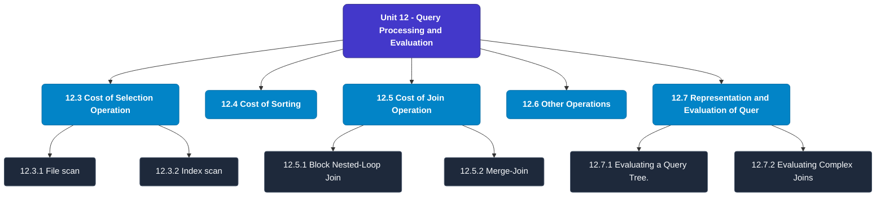

# MCS-207: Database Management Systems
## Unit 12: Query Processing and Evaluation

> 📚 **Programme:** M.Sc. (Data Science and Analytics) | **Semester:** Semester 1  
> ⏱️ **Estimated Study Time:** ~39 mins | 📄 **Textbook Pages:** 19 Pages  
> 📥 **Original PDF:** [Download & View Textbook](../../../pdfs/Semester_1/MCS-207_Database_Management_Systems/Unit-12_Query_Processing_and_Evaluation.pdf)

---

### 🎯 Executive Concept & Data Science Relevance
In modern data systems, **Query Processing and Evaluation** forms a vital conceptual pillar. Relational algebra and SQL form the query engine of every data warehouse (Snowflake, BigQuery, Postgres). Concurrency protocols and normalization ensure data integrity and ACID consistency across concurrent transaction streams.

> [!NOTE]
> **Why this matters for your career:** Mastering query processing and evaluation equips you with the foundational principles required to reason mathematically about high-dimensional datasets, evaluate algorithm performance, and avoid statistical pitfalls in production machine learning pipelines.

### 🗺️ Visual Knowledge Architecture
The following concept map illustrates the structural hierarchy and learning trajectory of this module:

### 📖 Core Definitions & Terminology Cards
| Term | Formal Mathematical / Technical Definition | Intuitive Analogy / Concrete Example |
| :--- | :--- | :--- |
| **Relational Algebra** | A procedural query language consisting of a set of operations on relations: Select ($\sigma$), Project ($\pi$), Union ($\cup$), Set Difference ($-$), Cartesian Product ($\times$), and Join ($\bowtie$). | *The formal mathematical syntax executed behind SQL `SELECT` queries.* |
| **ACID Properties** | Atomicity (all or nothing), Consistency (preserves invariants), Isolation (concurrent execution equivalent to serial), Durability (committed data survives crashes). | *The financial transaction guarantee: money cannot disappear between debit and credit.* |
| **Functional Dependency $X \to Y$** | A constraint between two sets of attributes: for any two valid tuples $t_1, t_2$, if $t_1[X] = t_2[X]$, then $t_1[Y] = t_2[Y]$. Value of $X$ uniquely determines $Y$. | *`StudentID` uniquely determines `StudentName`.* |
| **Third Normal Form (3NF) & BCNF** | A relation is in 3NF if for every non-trivial $X \to Y$, either $X$ is a superkey or $Y$ is a prime attribute. It is in BCNF if $X$ is strictly a superkey. | *Eliminates transitive dependencies so data is stored in exactly one canonical place without update anomalies.* |

### ⚡ Governing Mathematical Laws & Formula Cheatsheet
#### 🔹 Relational Algebra Selection & Projection
$$\sigma_{\text{condition}}(R) \quad \text{and} \quad \pi_{\text{attributes}}(R)$$
- **Explanation:** $\sigma$ filters rows (equivalent to SQL `WHERE`), while $\pi$ selects specific columns (equivalent to SQL `SELECT column_list`).

#### 🔹 Relational Natural Join
$$R \bowtie S = \pi_{\text{Attr}(R) \cup \text{Attr}(S)}(\sigma_{R.A_1 = S.A_1 \land \dots}(R \times S))$$
- **Explanation:** Performs equality join across all identically named attributes between two tables.

#### 🔹 Two-Phase Locking (2PL) Theorem
$$\text{Growing Phase: Only Acquire Locks} \implies \text{Shrinking Phase: Only Release Locks}$$
- **Explanation:** Guarantees conflict serializability of concurrent database schedules without data race anomalies.

### 📌 Detailed Section-by-Section Study Breakdown
#### `12.2.1` Role of Relational Algebra in Query Optimisation
- **Core Concept:** In order to optimise the evaluation of a query, first, you must define the query using relational algebra.
- **Core Concept:** A relational algebra expression may have many equivalent expressions.
- **Core Concept:** For example, the relational algebraic expression s (salary < 5000) (psalary (EMP)) is equivalent to psalary (ssalary < 5000 (EMP)).
- **Data Science Application:** Provides foundational structures used directly in statistical modeling, query execution, and machine learning pipelines.

> [!TIP]
> **Exam & Interview Tip:** Be prepared to state the formal definition of role of relational algebra in query optimisation and derive its primary equations step-by-step.

#### `12.2.2` Using Statistics and Stored Size for Cost Estimation.
- **Core Concept:** The query cost is generally measured as the total elapsed time for answering the query.
- **Core Concept:** There are many factors that contribute to the cost in terms of elapsed time.
- **Core Concept:** These are the time of disk accesses, CPU time, and data communication time on the network.
- **Data Science Application:** Provides foundational structures used directly in statistical modeling, query execution, and machine learning pipelines.

> [!TIP]
> **Exam & Interview Tip:** Be prepared to state the formal definition of using statistics and stored size for cost estimation. and derive its primary equations step-by-step.

#### `12.3` Cost of Selection Operation
- **Core Concept:** The selection operation can be performed in several ways.
- **Core Concept:** Let us discuss the algorithms and the related cost of performing selection operation.
- **Core Concept:** File scan File scan algorithms locate and retrieve records that fulfil a selection condition in a file.
- **Data Science Application:** Provides foundational structures used directly in statistical modeling, query execution, and machine learning pipelines.

> [!TIP]
> **Exam & Interview Tip:** Be prepared to state the formal definition of cost of selection operation and derive its primary equations step-by-step.

#### `12.3.1` File scan
- **Core Concept:** File scan algorithms locate and retrieve records that fulfil a selection condition in a file.
- **Core Concept:** The following are the two basic file scan algorithms for selection operation: 1) Linear search: This algorithm scans each file block and tests all records to see whether their attributes match the selection condition.
- **Core Concept:** The cost of this algorithm (in terms of block transfer): This algorithm would require reading all the blocks of the file, as it must test all the records for the specific condition.
- **Data Science Application:** Provides foundational structures used directly in statistical modeling, query execution, and machine learning pipelines.

> [!TIP]
> **Exam & Interview Tip:** Be prepared to state the formal definition of file scan and derive its primary equations step-by-step.

#### `12.3.2` Index scan
- **Core Concept:** The index scan can be used for cases where the database contains an index on an attribute set that forms the search key.
- **Core Concept:** 1) (a) Scanning for equality condition on a Primary index: These kinds of searches try to find a specific key value using the primary index of a database system.
- **Core Concept:** Since the search criteria include equality on the primary key, therefore, the output of this search would be just a single record or no record at all.
- **Data Science Application:** Provides foundational structures used directly in statistical modeling, query execution, and machine learning pipelines.

> [!TIP]
> **Exam & Interview Tip:** Be prepared to state the formal definition of index scan and derive its primary equations step-by-step.

#### `12.3.3` Implementation of Complex Selections
- **Core Concept:** Conjunction: Conjunction is basically a set of AND conditions.
- **Core Concept:** Conjunctive selection using one index: In such case, select any algorithm given earlier on one or more conditions and then test remaining conditions on the selected tuples after fetching them into the memory buffer.
- **Core Concept:** Conjunctive selection using the multiple-key index: Use appropriate composite (multiple-key) index if they are available.
- **Data Science Application:** Provides foundational structures used directly in statistical modeling, query execution, and machine learning pipelines.

> [!TIP]
> **Exam & Interview Tip:** Be prepared to state the formal definition of implementation of complex selections and derive its primary equations step-by-step.

### 💡 Interactive Self-Assessment Checkpoints
Test your comprehension before proceeding. Tap each question to reveal the comprehensive explanation:

<b>Checkpoint 1:</b> What does ACID stand for in database management? <i>(Tap to reveal answer)</i>

> **Answer & Analysis:**  
> Atomicity, Consistency, Isolation, and Durability.

<b>Checkpoint 2:</b> What is the difference between 3NF and BCNF? <i>(Tap to reveal answer)</i>

> **Answer & Analysis:**  
> In 3NF, for any non-trivial $X \to Y$, $X$ must be a superkey OR $Y$ must be a prime attribute. In BCNF (Boyce-Codd Normal Form), $X$ MUST strictly be a superkey (eliminating all dependencies on prime attributes).

<b>Checkpoint 3:</b> What is the relational algebra symbol for row selection and column projection? <i>(Tap to reveal answer)</i>

> **Answer & Analysis:**  
> Row selection: $\sigma$ (Sigma). Column projection: $\pi$ (Pi).

<b>Checkpoint 4:</b> What are the basic steps in query processing? ………………………………………………………………………………… ………………………………………………………………………………… <i>(Tap to reveal answer)</i>

> **Answer & Analysis:**  
> This question tests your conceptual mastery of Query Processing and Evaluation. Review the governing formulas and section breakdowns above to formulate a complete, rigorous proof or derivation.

<b>Checkpoint 5:</b> How can the cost of a query be measured? ………………………………………………………………………………… ………………………………………………………………………………… <i>(Tap to reveal answer)</i>

> **Answer & Analysis:**  
> This question tests your conceptual mastery of Query Processing and Evaluation. Review the governing formulas and section breakdowns above to formulate a complete, rigorous proof or derivation.

<b>Checkpoint 6:</b> What are the various methods adopted for performing selection operation? ………………………………………………………………………………… ………………………………………………………………………………… <i>(Tap to reveal answer)</i>

> **Answer & Analysis:**  
> This question tests your conceptual mastery of Query Processing and Evaluation. Review the governing formulas and section breakdowns above to formulate a complete, rigorous proof or derivation.

### 🎯 Executive Module Wrap-Up
- **Central Idea:** Query Processing and Evaluation provides essential mathematical and algorithmic tools directly utilized in Data Science.
- **Mathematical Rigor:** Formulas and laws must be memorized with attention to boundary conditions and assumptions.
- **Full Textbook Coverage:** For exhaustive multi-page derivations, proofs, and supplementary exercises, consult the [Authentic IGNOU Textbook](../../../pdfs/Semester_1/MCS-207_Database_Management_Systems/Unit-12_Query_Processing_and_Evaluation.pdf).

---
### 🧭 Navigation & Syllabus Index
[⬅ Previous: Unit 11](unit_11_Database_Recovery_and_Security.md) | [📑 Course Index](README.md) | [Next: Unit 13 ➡](unit_13_Object-Oriented_Database.md)
