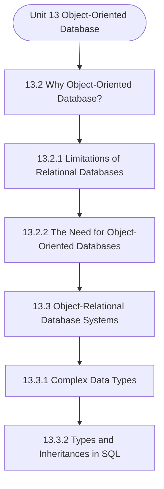

# MCS-207: Database Management Systems
## Unit 13: Object-Oriented Database

> 📚 **Programme:** M.Sc. (Data Science and Analytics) | **Semester:** Semester 1  
> ⏱️ **Estimated Study Time:** ~33 mins | 📄 **Textbook Pages:** 19 Pages  
> 📥 **Original PDF:** [Download & View Authentic Textbook](../../../pdfs/Semester_1/MCS-207_Database_Management_Systems/Unit-13_Object-Oriented_Database.pdf)

---

### 🎯 Executive Concept & Data Science Relevance
In modern data systems and advanced analytics, **Object-Oriented Database** forms a vital conceptual pillar. Relational algebra and SQL form the query engine of every data warehouse (Snowflake, BigQuery, Postgres). Concurrency protocols and normalization ensure data integrity and ACID consistency across concurrent transaction streams.

> [!NOTE]
> **Why this matters for your career:** Mastering object-oriented database equips you with the foundational principles required to reason mathematically about high-dimensional datasets, evaluate algorithm performance, and avoid statistical pitfalls in production machine learning pipelines.

### 🗺️ Visual Knowledge Architecture
The following concept map illustrates the structural hierarchy and learning trajectory of this module:



### 📖 Core Definitions & Terminology Cards

> 📌 **Relational Algebra**  
> - **Formal Definition:** A procedural query language consisting of a set of operations on relations: Select ( $\sigma$ ), Project ( $\pi$ ), Union ( $\cup$ ), Set Difference ( $-$ ), Cartesian Product ( $\times$ ), and Join ( $\bowtie$ ).  
> - 💡 **Practical Intuition & Analogy:** *The formal mathematical syntax executed behind SQL `SELECT` queries.*

> 📌 **ACID Properties**  
> - **Formal Definition:** Atomicity (all or nothing), Consistency (preserves invariants), Isolation (concurrent execution equivalent to serial), Durability (committed data survives crashes).  
> - 💡 **Practical Intuition & Analogy:** *The financial transaction guarantee: money cannot disappear between debit and credit.*

> 📌 **Functional Dependency $X \to Y$**  
> - **Formal Definition:** A constraint between two sets of attributes: for any two valid tuples $t_1, t_2$, if $t_1[X] = t_2[X]$, then $t_1[Y] = t_2[Y]$. Value of $X$ uniquely determines $Y$.  
> - 💡 **Practical Intuition & Analogy:** *`StudentID` uniquely determines `StudentName`.*

> 📌 **Third Normal Form (3NF) & BCNF**  
> - **Formal Definition:** A relation is in 3NF if for every non-trivial $X \to Y$, either $X$ is a superkey or $Y$ is a prime attribute. It is in BCNF if $X$ is strictly a superkey.  
> - 💡 **Practical Intuition & Analogy:** *Eliminates transitive dependencies so data is stored in exactly one canonical place without update anomalies.*

### ⚡ Governing Mathematical Laws & Formula Cheatsheet
#### 🔹 Relational Algebra Selection & Projection
$$
\sigma_{\text{condition}}(R) \quad \text{and} \quad \pi_{\text{attributes}}(R)
$$
- **Explanation:** $\sigma$ filters rows (equivalent to SQL `WHERE`), while $\pi$ selects specific columns (equivalent to SQL `SELECT column_list`).

#### 🔹 Relational Natural Join
$$
R \bowtie S = \pi_{\mathcal{A}(R) \cup \mathcal{A}(S)}\left(\sigma_{\text{match}}(R \times S)\right)
$$
- **Explanation:** Performs equality join across all identically named attributes between two tables.

#### 🔹 Two-Phase Locking (2PL) Theorem
$$
\text{Growing Phase: Only Acquire Locks} \implies \text{Shrinking Phase: Only Release Locks}
$$
- **Explanation:** Guarantees conflict serializability of concurrent database schedules without data race anomalies.

### ⚖️ Axiomatic Properties & Governing Laws
The mathematical formulations of this module are anchored by foundational algebraic and structural laws:

- **Armstrong's Reflexivity:** $Y \subseteq X \implies X \to Y$
- **Armstrong's Augmentation:** $X \to Y \implies XZ \to YZ$
- **Armstrong's Transitivity:** $X \to Y \land Y \to Z \implies X \to Z$

### 📌 Comprehensive Section-by-Section Study Breakdown
#### `13.2` Why Object-Oriented Database?

##### 📘 Theoretical Principles & Pedagogical Exposition
In database architecture, **Why Object-Oriented Database?** formalizes data persistence, relational integrity, and schema normalization. Within **Object-Oriented Database**, this section establishes formal guarantees that prevent data anomalies (insertion, update, and deletion anomalies) while ensuring ACID transaction compliance.

By anchoring schemas to mathematical relations, query optimizers can rewrite declarative SQL queries into optimal relational algebra execution trees without altering the result set.

##### ⚙️ Mathematical & Algorithmic Mechanics
- **Core Mechanism:** Organizes data into mathematical relations with schema constraints. Normalization (1NF $\to$ 2NF $\to$ 3NF $\to$ BCNF) decomposes relations using functional dependencies $X \to Y$ to eliminate insertion, update, and deletion anomalies. ACID guarantees are enforced via Two-Phase Locking (2PL) and Write-Ahead Logging (WAL).
- **Boundary Conditions:** NULL values violating primary key Entity Integrity, dangling foreign key references violating Referential Integrity, lossy table decompositions, and deadlocks in concurrent schedules.

##### 📊 Practical Data Science & Production Relevance
- **Production Workflow:** Production OLTP database schemas, enterprise data warehouse dimensional modeling, SQL query optimizer explain plans, and microservice distributed transactions.
- **Real-World Pitfall:** Over-normalizing analytical (OLAP) schemas causing costly multi-table joins, or selecting inappropriate transaction isolation levels leading to dirty or phantom reads.

> [!TIP]
> **Exam & Technical Interview Insight:** Determine candidate keys using attribute closures $X^+$; test whether a table satisfies 3NF or BCNF; verify lossless join and dependency preservation.

#### `13.2.1` Limitations of Relational Databases

##### 📘 Theoretical Principles & Pedagogical Exposition
In database architecture, **Limitations of Relational Databases** formalizes data persistence, relational integrity, and schema normalization. Within **Object-Oriented Database**, this section establishes formal guarantees that prevent data anomalies (insertion, update, and deletion anomalies) while ensuring ACID transaction compliance.

By anchoring schemas to mathematical relations, query optimizers can rewrite declarative SQL queries into optimal relational algebra execution trees without altering the result set.

##### ⚙️ Mathematical & Algorithmic Mechanics
- **Core Mechanism:** Evaluates binary relation subsets $R \subseteq A \times B$. Equivalence relations partition a set into mutually disjoint equivalence classes $[a] = \{x \in A \mid (x, a) \in R\}$. Partial orders enforce reflexivity, antisymmetry, and transitivity to structure directed acyclic precedences.
- **Boundary Conditions:** Empty relations $\emptyset$, universal Cartesian products $A \times B$, identity diagonal pairs $\Delta = \{(a, a)\}$, and verifying antisymmetry $(aRb \land bRa \implies a=b)$.

##### 📊 Practical Data Science & Production Relevance
- **Production Workflow:** Directly underpins relational database foreign keys, functional dependencies, topological sort DAGs in pipeline engines (Airflow, dbt), and equivalence clustering in unsupervised grouping.
- **Real-World Pitfall:** Assuming symmetry in directed dependencies or failing to check transitivity when computing transitive closures, resulting in invalid cycle deadlocks.

> [!TIP]
> **Exam & Technical Interview Insight:** Be prepared to prove whether a given relation is an Equivalence Relation or Poset by testing reflexivity, symmetry/antisymmetry, and transitivity with explicit elements.

#### `13.2.2` The Need for Object-Oriented Databases

##### 📘 Theoretical Principles & Pedagogical Exposition
In database architecture, **The Need for Object-Oriented Databases** formalizes data persistence, relational integrity, and schema normalization. Within **Object-Oriented Database**, this section establishes formal guarantees that prevent data anomalies (insertion, update, and deletion anomalies) while ensuring ACID transaction compliance.

By anchoring schemas to mathematical relations, query optimizers can rewrite declarative SQL queries into optimal relational algebra execution trees without altering the result set.

##### ⚙️ Mathematical & Algorithmic Mechanics
- **Core Mechanism:** Organizes data into mathematical relations with schema constraints. Normalization (1NF $\to$ 2NF $\to$ 3NF $\to$ BCNF) decomposes relations using functional dependencies $X \to Y$ to eliminate insertion, update, and deletion anomalies. ACID guarantees are enforced via Two-Phase Locking (2PL) and Write-Ahead Logging (WAL).
- **Boundary Conditions:** NULL values violating primary key Entity Integrity, dangling foreign key references violating Referential Integrity, lossy table decompositions, and deadlocks in concurrent schedules.

##### 📊 Practical Data Science & Production Relevance
- **Production Workflow:** Production OLTP database schemas, enterprise data warehouse dimensional modeling, SQL query optimizer explain plans, and microservice distributed transactions.
- **Real-World Pitfall:** Over-normalizing analytical (OLAP) schemas causing costly multi-table joins, or selecting inappropriate transaction isolation levels leading to dirty or phantom reads.

> [!TIP]
> **Exam & Technical Interview Insight:** Determine candidate keys using attribute closures $X^+$; test whether a table satisfies 3NF or BCNF; verify lossless join and dependency preservation.

#### `13.3` Object-Relational Database Systems

##### 📘 Theoretical Principles & Pedagogical Exposition
SYSTEMS Object-Relational Database Systems are the relational database systems that have been enhanced to include the features of object-oriented paradigm. This section provides details on how these newer features have been implemented in the SQL. Some of the basic object-oriented concepts that have been discussed in this section in the context of their inclusion into SQL standards include, the complex types, inheritance and object identity and reference types.


##### ⚙️ Mathematical & Algorithmic Mechanics
- **Core Mechanism:** Evaluates binary relation subsets $R \subseteq A \times B$. Equivalence relations partition a set into mutually disjoint equivalence classes $[a] = \{x \in A \mid (x, a) \in R\}$. Partial orders enforce reflexivity, antisymmetry, and transitivity to structure directed acyclic precedences.
- **Boundary Conditions:** Empty relations $\emptyset$, universal Cartesian products $A \times B$, identity diagonal pairs $\Delta = \{(a, a)\}$, and verifying antisymmetry $(aRb \land bRa \implies a=b)$.

##### 📊 Practical Data Science & Production Relevance
- **Production Workflow:** Directly underpins relational database foreign keys, functional dependencies, topological sort DAGs in pipeline engines (Airflow, dbt), and equivalence clustering in unsupervised grouping.
- **Real-World Pitfall:** Assuming symmetry in directed dependencies or failing to check transitivity when computing transitive closures, resulting in invalid cycle deadlocks.

> [!TIP]
> **Exam & Technical Interview Insight:** Be prepared to prove whether a given relation is an Equivalence Relation or Poset by testing reflexivity, symmetry/antisymmetry, and transitivity with explicit elements.

#### `13.3.1` Complex Data Types

##### 📘 Theoretical Principles & Pedagogical Exposition
In the previous section, we have used the term complex data types without defining it. Let us explain this with the help of a simple example. Consider a composite attribute Address. The Address of a person in an RDBMS can be represented using the following: House-no and apartment Locality City State Pin-code When using RDBMS, such information either needs to be represented as separate attributes, as shown above, or just one string separated by comma or semicolon.

The second approach is very inflexible, as it would require complex string related operations for extracting information. It also hides the details of an address; thus, it is not suitable. If you represent the attributes of the Address as separate attributes, then the problem would be with respect to writing queries.

For example, if you need to find the address of a person, you need to specify all the attributes that you have created for the Address Object Oriented Database Technologies + Object Oriented Programming • Inheritance • Encapsulation • Object Identity • Polymorphism Relational Database Features • Security • Integrity • Transactions • Concurrency • Recovery • Persistence viz., House-no, Locality….


##### ⚙️ Mathematical & Algorithmic Mechanics
- **Core Mechanism:** Organizes data into mathematical relations with schema constraints. Normalization (1NF $\to$ 2NF $\to$ 3NF $\to$ BCNF) decomposes relations using functional dependencies $X \to Y$ to eliminate insertion, update, and deletion anomalies. ACID guarantees are enforced via Two-Phase Locking (2PL) and Write-Ahead Logging (WAL).
- **Boundary Conditions:** NULL values violating primary key Entity Integrity, dangling foreign key references violating Referential Integrity, lossy table decompositions, and deadlocks in concurrent schedules.

##### 📊 Practical Data Science & Production Relevance
- **Production Workflow:** Production OLTP database schemas, enterprise data warehouse dimensional modeling, SQL query optimizer explain plans, and microservice distributed transactions.
- **Real-World Pitfall:** Over-normalizing analytical (OLAP) schemas causing costly multi-table joins, or selecting inappropriate transaction isolation levels leading to dirty or phantom reads.

> [!TIP]
> **Exam & Technical Interview Insight:** Determine candidate keys using attribute closures $X^+$; test whether a table satisfies 3NF or BCNF; verify lossless join and dependency preservation.

#### `13.3.2` Types and Inheritances in SQL

##### 📘 Theoretical Principles & Pedagogical Exposition
In the previous sub-section, we discussed the data type – Address. It is a good example of a structured type. In this section, let us give more examples for such types, using SQL. Consider the attribute: • Name – that includes given name, middle name and surname. • Address – that includes address details, city, state and pin code.

These types can be defined using SQL extensions, as given below: CREATE TYPE Name AS ( Given_name Char (20), Middle_name Char (15), Sur_name Char (20) ) FINAL This type/class cannot be inherited further due to the keyword FINAL. CREATE TYPE Address AS ( Add_det Char(20), City Char(20), State Char(20), Pincode Char(6) ) NOT FINAL You can use this class to create inherited classes, like Home_Address and Office_Address, as this type/class is NOT FINAL.

The FINAL and NOT FINAL keywords have the same meaning as you learned in JAVA, i.e., a FINAL class cannot be inherited further. These types can now be used to create a student class, which has data members and methods that work on objects of the student class, as follows: CREATE TYPE Student AS ( name Name, address Address, dob Date ) NOT FINAL METHOD ageinyears (givendate Date) RETURN INTERVAL YEAR; The method can be implemented separately using the following SQL Commands: CREATE INSTANCE METHOD (givendate Date) RETURN INTERVAL YEAR FOR Student begin Return (givendate – self.dob); end This method computes the age on a given date.


##### ⚙️ Mathematical & Algorithmic Mechanics
- **Core Mechanism:** Organizes data into mathematical relations with schema constraints. Normalization (1NF $\to$ 2NF $\to$ 3NF $\to$ BCNF) decomposes relations using functional dependencies $X \to Y$ to eliminate insertion, update, and deletion anomalies. ACID guarantees are enforced via Two-Phase Locking (2PL) and Write-Ahead Logging (WAL).
- **Boundary Conditions:** NULL values violating primary key Entity Integrity, dangling foreign key references violating Referential Integrity, lossy table decompositions, and deadlocks in concurrent schedules.

##### 📊 Practical Data Science & Production Relevance
- **Production Workflow:** Production OLTP database schemas, enterprise data warehouse dimensional modeling, SQL query optimizer explain plans, and microservice distributed transactions.
- **Real-World Pitfall:** Over-normalizing analytical (OLAP) schemas causing costly multi-table joins, or selecting inappropriate transaction isolation levels leading to dirty or phantom reads.

> [!TIP]
> **Exam & Technical Interview Insight:** Determine candidate keys using attribute closures $X^+$; test whether a table satisfies 3NF or BCNF; verify lossless join and dependency preservation.

#### `13.3.3` Additional Data Types of OOP in SQL

##### 📘 Theoretical Principles & Pedagogical Exposition
The object-oriented/relational database must support the data types that allow multi- valued attributes to be represented easily. Two such data types that exist in SQL are: • Arrays – stores information in an order and • Multisets – stores information in an unordered set. Let us explain this with the help of an example of a book database as introduced in the section13.3.1 A Book type can be represented using SQL as: CREATE TYPE Book AS ( ISBNNO Char (14), BOOK_TITLE Char (25), AUTHORS Char (25) ARRAY [5], PUBLISHED_BY Char (20), KEYWORDS Char (10) MULTISET ); Please note, the use of the type ARRAY.

Arrays not only allow authors to be represented but also allow the sequencing of the authors' names. Multiset allows a number of keywords without any ordering imposed on them. But how can you enter data and query such data types? The following SQL commands would help in defining such a situation.

But first, you need to create a table: CREATE TABLE library OF Book; INSERT INTO library VALUES(‘008-124476-x’, ‘Database Systems’, ARRAY [‘Silberschatz’, ‘Elmasri’], ‘XYZ Publication’, MULTISET [ ‘Database’, ‘Relational’, ‘Object Oriented’]) ; The command above would insert information on a hypothetical book into the database.


##### ⚙️ Mathematical & Algorithmic Mechanics
- **Core Mechanism:** Organizes data into mathematical relations with schema constraints. Normalization (1NF $\to$ 2NF $\to$ 3NF $\to$ BCNF) decomposes relations using functional dependencies $X \to Y$ to eliminate insertion, update, and deletion anomalies. ACID guarantees are enforced via Two-Phase Locking (2PL) and Write-Ahead Logging (WAL).
- **Boundary Conditions:** NULL values violating primary key Entity Integrity, dangling foreign key references violating Referential Integrity, lossy table decompositions, and deadlocks in concurrent schedules.

##### 📊 Practical Data Science & Production Relevance
- **Production Workflow:** Production OLTP database schemas, enterprise data warehouse dimensional modeling, SQL query optimizer explain plans, and microservice distributed transactions.
- **Real-World Pitfall:** Over-normalizing analytical (OLAP) schemas causing costly multi-table joins, or selecting inappropriate transaction isolation levels leading to dirty or phantom reads.

> [!TIP]
> **Exam & Technical Interview Insight:** Determine candidate keys using attribute closures $X^+$; test whether a table satisfies 3NF or BCNF; verify lossless join and dependency preservation.

#### `13.3.4` Object Identity and Reference Type Using SQL

##### 📘 Theoretical Principles & Pedagogical Exposition
Till now, we have created the tables, but what about the situation when we have attributes that draw a reference to another attribute in the same table? This is a referential constraint. Thus, an object-relational database system should address the following two concerns: • In relational databases, foreign keys are used to link the attributes in two different relations.

Can such keys be used in an object-relational database? • How will you identify the object that is being referenced? The following example will address the concerns stated above. Example: A library purchases books. Each book is given a unique book number called the catalogue number.

The library maintains a procurement table, which can be created using the following SQL command: CREATE TABLE procurement ( CATALOGUE_NO CHAR (5), ISBNNO REF (Book) SCOPE (library) ) ; The SQL statement given above would create a procurement table, which would assign two basic information to a newly purchased book – first, it will give the book a unique CATALOGUE_NO, and second, it will link this book to a specific record in the library table through an ISBNNO.


##### ⚙️ Mathematical & Algorithmic Mechanics
- **Core Mechanism:** Organizes data into mathematical relations with schema constraints. Normalization (1NF $\to$ 2NF $\to$ 3NF $\to$ BCNF) decomposes relations using functional dependencies $X \to Y$ to eliminate insertion, update, and deletion anomalies. ACID guarantees are enforced via Two-Phase Locking (2PL) and Write-Ahead Logging (WAL).
- **Boundary Conditions:** NULL values violating primary key Entity Integrity, dangling foreign key references violating Referential Integrity, lossy table decompositions, and deadlocks in concurrent schedules.

##### 📊 Practical Data Science & Production Relevance
- **Production Workflow:** Production OLTP database schemas, enterprise data warehouse dimensional modeling, SQL query optimizer explain plans, and microservice distributed transactions.
- **Real-World Pitfall:** Over-normalizing analytical (OLAP) schemas causing costly multi-table joins, or selecting inappropriate transaction isolation levels leading to dirty or phantom reads.

> [!TIP]
> **Exam & Technical Interview Insight:** Determine candidate keys using attribute closures $X^+$; test whether a table satisfies 3NF or BCNF; verify lossless join and dependency preservation.

### 📐 Step-by-Step Solved Mathematical Examples
To solidify your theoretical understanding, work through these fully solved, step-by-step mathematical problems:

#### 🧮 Example 1: BCNF Normalization Decomposition
> **Problem Statement:**  
> Given relation $R(A, B, C, D)$ with functional dependencies $F = \lbrace A \to B, \; B \to C, \; C \to D \rbrace$. Find candidate keys, check if $R$ is in BCNF, and decompose if necessary.

**Detailed Step-by-Step Solution:**

1. **Candidate Key:** Closure $(A)^+ = \lbrace A, B, C, D \rbrace$. Thus $A$ is the sole candidate key.
2. **BCNF Test:**
- $A \to B$: $A$ is superkey (Passes BCNF).
- $B \to C$: $B$ is NOT a superkey (Violates BCNF).
- $C \to D$: $C$ is NOT a superkey (Violates BCNF).

3. **Decomposition:**
- Decompose on $B \to C$: $R_1(B, C)$ with $B \to C$ (In BCNF, key $B$), and $R_2(A, B, D)$ with $A \to B, B \to D$.
- In $R_2$, $B \to D$ violates BCNF ($B$ not superkey for $R_2$). Decompose $R_2$ into $R_{21}(B, D)$ and $R_{22}(A, B)$.

Final BCNF schema: $R_1(B, C), \; R_{21}(B, D), \; R_{22}(A, B)$ (Lossless and dependency preserving).

#### 🧮 Example 2: Relational Algebra to SQL Translation
> **Problem Statement:**  
> Express relational algebra query $\pi_{\text{name, salary}}(\sigma_{\text{dept}='Analytics' \land \text{salary} > 80000}(\text{Employees}))$ into standard SQL.

**Detailed Step-by-Step Solution:**

```sql
SELECT name, salary
FROM Employees
WHERE dept = 'Analytics' AND salary > 80000;
```

### 💻 Practical Data Science Implementation (Python)
Theory translates directly into production algorithms. Below is a self-contained, commented Python implementation illustrating the core operations of this unit:

```python
import pandas as pd

# Simulating Relational Algebra with Pandas
emp = pd.DataFrame({
    'emp_id': [1, 2, 3, 4],
    'name': ['Alice', 'Bob', 'Charlie', 'David'],
    'dept_id': [10, 10, 20, 30]
})

dept = pd.DataFrame({
    'dept_id': [10, 20, 40],
    'dept_name': ['Analytics', 'Engineering', 'HR']
})

# 1. Selection (Sigma): dept_id == 10
sel = emp[emp['dept_id'] == 10]

# 2. Projection (Pi): ['name', 'dept_id']
proj = sel[['name', 'dept_id']]

# 3. Natural Join (Bowtie): emp ⨝ dept
natural_join = pd.merge(emp, dept, on='dept_id', how='inner')

print("Natural Join Result:\n", natural_join[['name', 'dept_name']])
```

### 💡 Interactive Self-Assessment Checkpoints
Test your comprehension before proceeding. Tap each question to reveal the comprehensive explanation:

<details>
<summary><b>Checkpoint 1:</b> What is the need for object-oriented databases? ………………………………………………………………………………………………………………………… ………………………………………………………………………………………………………………………… ………………………………………………………………………………………………………………………… <i>(Tap to reveal answer)</i></summary>

> **Answer & Analysis:**  
> **Detailed Analytical Solution:**
> 
> 1. **Core Principle:** Identify the governing theorem or definition for Object-Oriented Database.
> 2. **Step-by-Step Derivation:** Verify all preconditions and compute intermediate steps methodically.
> 3. **Conclusion:** State the final mathematical proof or calculation clearly, validating boundary edge cases.
</details>

<details>
<summary><b>Checkpoint 2:</b> How will you represent a complex data type? ………………………………………………………………………………………………………………………… ………………………………………………………………………………………………………………………… ………………………………………………………………………………………………………………………… <i>(Tap to reveal answer)</i></summary>

> **Answer & Analysis:**  
> **Detailed Analytical Solution:**
> 
> 1. **Core Principle:** Identify the governing theorem or definition for Object-Oriented Database.
> 2. **Step-by-Step Derivation:** Verify all preconditions and compute intermediate steps methodically.
> 3. **Conclusion:** State the final mathematical proof or calculation clearly, validating boundary edge cases.
</details>

<details>
<summary><b>Checkpoint 3:</b> Represent an address using SQL that has a method for locating pin-code information. ………………………………………………………………………………………………………………………… ………………………………………………………………………………………………………………………… ………………………………………………………………………………………………………………………… <i>(Tap to reveal answer)</i></summary>

> **Answer & Analysis:**  
> **Detailed Analytical Solution:**
> 
> 1. **Core Principle:** Identify the governing theorem or definition for Object-Oriented Database.
> 2. **Step-by-Step Derivation:** Verify all preconditions and compute intermediate steps methodically.
> 3. **Conclusion:** State the final mathematical proof or calculation clearly, validating boundary edge cases.
</details>

<details>
<summary><b>Checkpoint 4:</b> Create a table using the type created in question 3 above. ………………………………………………………………………………………………………………………… ………………………………………………………………………………………………………………………… ………………………………………………………………………………………………………………………… <i>(Tap to reveal answer)</i></summary>

> **Answer & Analysis:**  
> **Detailed Analytical Solution:**
> 
> 1. **Core Principle:** Identify the governing theorem or definition for Object-Oriented Database.
> 2. **Step-by-Step Derivation:** Verify all preconditions and compute intermediate steps methodically.
> 3. **Conclusion:** State the final mathematical proof or calculation clearly, validating boundary edge cases.
</details>

<details>
<summary><b>Checkpoint 5:</b> What does ACID stand for in database management? <i>(Tap to reveal answer)</i></summary>

> **Answer & Analysis:**  
> Atomicity, Consistency, Isolation, and Durability.
</details>

<details>
<summary><b>Checkpoint 6:</b> What is the difference between 3NF and BCNF? <i>(Tap to reveal answer)</i></summary>

> **Answer & Analysis:**  
> In 3NF, for any non-trivial $X \to Y$, $X$ must be a superkey OR $Y$ must be a prime attribute. In BCNF (Boyce-Codd Normal Form), $X$ MUST strictly be a superkey (eliminating all dependencies on prime attributes).
</details>

### 🎯 Executive Module Wrap-Up
- **Central Idea:** Object-Oriented Database provides essential mathematical and algorithmic tools directly utilized in Data Science.
- **Mathematical Rigor:** Formulas and laws must be memorized with attention to boundary conditions and assumptions.
- **Full Textbook Coverage:** For exhaustive multi-page derivations, proofs, and supplementary exercises, consult the [Authentic IGNOU Textbook](../../../pdfs/Semester_1/MCS-207_Database_Management_Systems/Unit-13_Object-Oriented_Database.pdf).

---
### 🧭 Navigation & Syllabus Index
[⬅ Previous: Unit 12](unit_12_Query_Processing_and_Evaluation.md) | [📑 Course Index](README.md) | [Next: Unit 14 ➡](unit_14_Data_Warehousing_and_Data_Mining.md)
