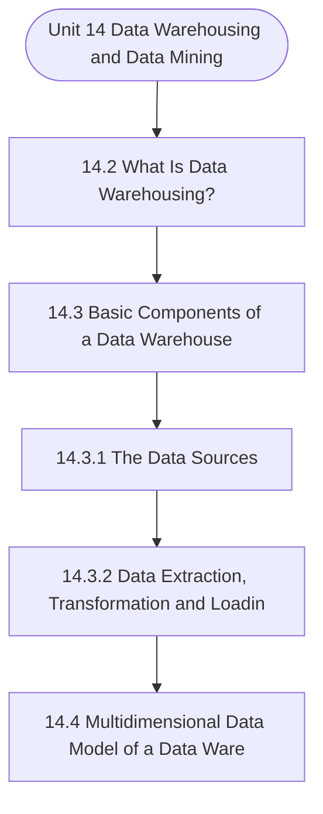

# MCS-207: Database Management Systems
## Unit 14: Data Warehousing and Data Mining

> 📚 **Programme:** M.Sc. (Data Science and Analytics) | **Semester:** Semester 1  
> ⏱️ **Estimated Study Time:** ~44 mins | 📄 **Textbook Pages:** 24 Pages  
> 📥 **Original PDF:** [Download & View Textbook](../../../pdfs/Semester_1/MCS-207_Database_Management_Systems/Unit-14_Data_Warehousing_and_Data_Mining.pdf)

---

### 🎯 Executive Concept & Data Science Relevance
In modern data systems, **Data Warehousing and Data Mining** forms a vital conceptual pillar. Relational algebra and SQL form the query engine of every data warehouse (Snowflake, BigQuery, Postgres). Concurrency protocols and normalization ensure data integrity and ACID consistency across concurrent transaction streams.

> [!NOTE]
> **Why this matters for your career:** Mastering data warehousing and data mining equips you with the foundational principles required to reason mathematically about high-dimensional datasets, evaluate algorithm performance, and avoid statistical pitfalls in production machine learning pipelines.

### 🗺️ Visual Knowledge Architecture
The following concept map illustrates the structural hierarchy and learning trajectory of this module:

### 📖 Core Definitions & Terminology Cards

> 📌 **Relational Algebra**  
> - **Formal Definition:** A procedural query language consisting of a set of operations on relations: Select ( $\sigma$ ), Project ( $\pi$ ), Union ( $\cup$ ), Set Difference ( $-$ ), Cartesian Product ( $\times$ ), and Join ( $\bowtie$ ).  
> - 💡 **Practical Intuition & Analogy:** *The formal mathematical syntax executed behind SQL `SELECT` queries.*

> 📌 **ACID Properties**  
> - **Formal Definition:** Atomicity (all or nothing), Consistency (preserves invariants), Isolation (concurrent execution equivalent to serial), Durability (committed data survives crashes).  
> - 💡 **Practical Intuition & Analogy:** *The financial transaction guarantee: money cannot disappear between debit and credit.*

> 📌 **Functional Dependency $X \to Y$**  
> - **Formal Definition:** A constraint between two sets of attributes: for any two valid tuples $t_1, t_2$, if $t_1[X] = t_2[X]$, then $t_1[Y] = t_2[Y]$. Value of $X$ uniquely determines $Y$.  
> - 💡 **Practical Intuition & Analogy:** *`StudentID` uniquely determines `StudentName`.*

> 📌 **Third Normal Form (3NF) & BCNF**  
> - **Formal Definition:** A relation is in 3NF if for every non-trivial $X \to Y$, either $X$ is a superkey or $Y$ is a prime attribute. It is in BCNF if $X$ is strictly a superkey.  
> - 💡 **Practical Intuition & Analogy:** *Eliminates transitive dependencies so data is stored in exactly one canonical place without update anomalies.*

### ⚡ Governing Mathematical Laws & Formula Cheatsheet
#### 🔹 Relational Algebra Selection & Projection
$$
\sigma_{\text{condition}}(R) \quad \text{and} \quad \pi_{\text{attributes}}(R)
$$
- **Explanation:** $\sigma$ filters rows (equivalent to SQL `WHERE`), while $\pi$ selects specific columns (equivalent to SQL `SELECT column_list`).

#### 🔹 Relational Natural Join
$$
R \bowtie S = \pi_{\text{Attr}(R) \cup \text{Attr}(S)}(\sigma_{R.A_1 = S.A_1 \land \dots}(R \times S))
$$
- **Explanation:** Performs equality join across all identically named attributes between two tables.

#### 🔹 Two-Phase Locking (2PL) Theorem
$$
\text{Growing Phase: Only Acquire Locks} \implies \text{Shrinking Phase: Only Release Locks}
$$
- **Explanation:** Guarantees conflict serializability of concurrent database schedules without data race anomalies.

### 📌 Detailed Section-by-Section Study Breakdown
#### `14.2` What Is Data Warehousing?
- **Core Concept:** Establishes theoretical foundations, axiomatic formulations, and properties of what is data warehousing?.
- **Core Concept:** Analyzes standard algorithmic workflows and mathematical transformations relevant to data warehousing and data mining.
- **Core Concept:** Applies computational bounds and optimization guarantees across data processing workflows.
- **Data Science Application:** Provides foundational structures used directly in statistical modeling, query execution, and machine learning pipelines.

> [!TIP]
> **Exam & Interview Tip:** Be prepared to state the formal definition of what is data warehousing? and derive its primary equations step-by-step.

#### `14.3` Basic Components of a Data Warehouse
- **Core Concept:** WAREHOUSE A data warehouse is defined as a subject-oriented, integrated, nonvolatile, time-variant collection, but how can we achieve such a collection?
- **Core Concept:** To answer this question, let us define the basic architecture that helps a data warehouse achieve the objectives stated above.
- **Core Concept:** We shall also discuss various processes that are performed by these components on the data.
- **Data Science Application:** Provides foundational structures used directly in statistical modeling, query execution, and machine learning pipelines.

> [!TIP]
> **Exam & Interview Tip:** Be prepared to state the formal definition of basic components of a data warehouse and derive its primary equations step-by-step.

#### `14.3.1` The Data Sources
- **Core Concept:** The data of the data warehouse can be obtained from many operational systems.
- **Core Concept:** A data warehouse interacts with the environment that provides most of the source data for the data warehouse.
- **Core Concept:** By the term environment, we mean traditionally developed database Reports The Reports are generated using the query and analysis tools.
- **Data Science Application:** Provides foundational structures used directly in statistical modeling, query execution, and machine learning pipelines.

> [!TIP]
> **Exam & Interview Tip:** Be prepared to state the formal definition of the data sources and derive its primary equations step-by-step.

#### `14.3.2` Data Extraction, Transformation and Loading (ETL)
- **Core Concept:** The first step in data warehousing is to perform data extraction, transformation, and loading of data into the data warehouse.
- **Core Concept:** This is called ETL, which is Extraction, Transformation, and Loading.
- **Core Concept:** ETL refers to the methods involved in accessing and manipulating data available in various sources and loading it into a target data warehouse.
- **Data Science Application:** Provides foundational structures used directly in statistical modeling, query execution, and machine learning pipelines.

> [!TIP]
> **Exam & Interview Tip:** Be prepared to state the formal definition of data extraction, transformation and loading (etl) and derive its primary equations step-by-step.

#### `14.4` Multidimensional Data Model of a Data Warehouse
- **Core Concept:** DATA WAREHOUSE A data warehouse is a huge collection of data.
- **Core Concept:** Such data may involve grouping of data on multiple attributes.
- **Core Concept:** • In the year 2003, BCA enrolment in Region RC-07 was 500.
- **Data Science Application:** Provides foundational structures used directly in statistical modeling, query execution, and machine learning pipelines.

> [!TIP]
> **Exam & Interview Tip:** Be prepared to state the formal definition of multidimensional data model of a data warehouse and derive its primary equations step-by-step.

#### `14.5` Data Mining Technology
- **Core Concept:** Data is growing at a phenomenal rate today and users expect more sophisticated information from data.
- **Core Concept:** There is a need for techniques and tools that can automatically generate useful information and knowledge from large volumes of data.
- **Core Concept:** Data mining is one such technique of generating hidden information from the large data.
- **Data Science Application:** Provides foundational structures used directly in statistical modeling, query execution, and machine learning pipelines.

> [!TIP]
> **Exam & Interview Tip:** Be prepared to state the formal definition of data mining technology and derive its primary equations step-by-step.

### 💡 Interactive Self-Assessment Checkpoints
Test your comprehension before proceeding. Tap each question to reveal the comprehensive explanation:

<b>Checkpoint 1:</b> What does ACID stand for in database management? <i>(Tap to reveal answer)</i>

> **Answer & Analysis:**  
> Atomicity, Consistency, Isolation, and Durability.

<b>Checkpoint 2:</b> What is the difference between 3NF and BCNF? <i>(Tap to reveal answer)</i>

> **Answer & Analysis:**  
> In 3NF, for any non-trivial $X \to Y$, $X$ must be a superkey OR $Y$ must be a prime attribute. In BCNF (Boyce-Codd Normal Form), $X$ MUST strictly be a superkey (eliminating all dependencies on prime attributes).

<b>Checkpoint 3:</b> What is the relational algebra symbol for row selection and column projection? <i>(Tap to reveal answer)</i>

> **Answer & Analysis:**  
> Row selection: $\sigma$ (Sigma). Column projection: $\pi$ (Pi).

<b>Checkpoint 4:</b> What is a Data Warehouse? …………………………………………………………………………………… <i>(Tap to reveal answer)</i>

> **Answer & Analysis:**  
> This question tests your conceptual mastery of Data Warehousing and Data Mining. Review the governing formulas and section breakdowns above to formulate a complete, rigorous proof or derivation.

<b>Checkpoint 5:</b> What are the characteristics of data in a data warehouse? …………………………………………………………………………………… …………………………………………………………………………………… …………………………………………………………………………………… <i>(Tap to reveal answer)</i>

> **Answer & Analysis:**  
> This question tests your conceptual mastery of Data Warehousing and Data Mining. Review the governing formulas and section breakdowns above to formulate a complete, rigorous proof or derivation.

<b>Checkpoint 6:</b> What is ETL? What are the different transformations that are needed during the ETL process? <i>(Tap to reveal answer)</i>

> **Answer & Analysis:**  
> This question tests your conceptual mastery of Data Warehousing and Data Mining. Review the governing formulas and section breakdowns above to formulate a complete, rigorous proof or derivation.

### 🎯 Executive Module Wrap-Up
- **Central Idea:** Data Warehousing and Data Mining provides essential mathematical and algorithmic tools directly utilized in Data Science.
- **Mathematical Rigor:** Formulas and laws must be memorized with attention to boundary conditions and assumptions.
- **Full Textbook Coverage:** For exhaustive multi-page derivations, proofs, and supplementary exercises, consult the [Authentic IGNOU Textbook](../../../pdfs/Semester_1/MCS-207_Database_Management_Systems/Unit-14_Data_Warehousing_and_Data_Mining.pdf).

---
### 🧭 Navigation & Syllabus Index
[⬅ Previous: Unit 13](unit_13_Object-Oriented_Database.md) | [📑 Course Index](README.md) | [Next: Unit 15 ➡](unit_15_NoSQL_Database.md)
