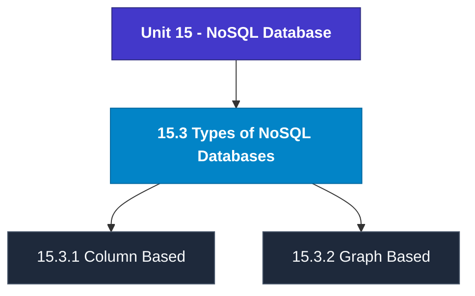

# MCS-207: Database Management Systems
## Unit 15: NoSQL Database

> 📚 **Programme:** M.Sc. (Data Science and Analytics) | **Semester:** Semester 1  
> ⏱️ **Estimated Study Time:** ~35 mins | 📄 **Textbook Pages:** 19 Pages  
> 📥 **Original PDF:** [Download & View Textbook](../../../pdfs/Semester_1/MCS-207_Database_Management_Systems/Unit-15_NoSQL_Database.pdf)

---

### 🎯 Executive Concept & Data Science Relevance
In modern data systems, **NoSQL Database** forms a vital conceptual pillar. Relational algebra and SQL form the query engine of every data warehouse (Snowflake, BigQuery, Postgres). Concurrency protocols and normalization ensure data integrity and ACID consistency across concurrent transaction streams.

> [!NOTE]
> **Why this matters for your career:** Mastering nosql database equips you with the foundational principles required to reason mathematically about high-dimensional datasets, evaluate algorithm performance, and avoid statistical pitfalls in production machine learning pipelines.

### 🗺️ Visual Knowledge Architecture
The following concept map illustrates the structural hierarchy and learning trajectory of this module:

### 📖 Core Definitions & Terminology Cards
| Term | Formal Mathematical / Technical Definition | Intuitive Analogy / Concrete Example |
| :--- | :--- | :--- |
| **Relational Algebra** | A procedural query language consisting of a set of operations on relations: Select ($\sigma$), Project ($\pi$), Union ($\cup$), Set Difference ($-$), Cartesian Product ($\times$), and Join ($\bowtie$). | *The formal mathematical syntax executed behind SQL `SELECT` queries.* |
| **ACID Properties** | Atomicity (all or nothing), Consistency (preserves invariants), Isolation (concurrent execution equivalent to serial), Durability (committed data survives crashes). | *The financial transaction guarantee: money cannot disappear between debit and credit.* |
| **Functional Dependency $X \to Y$** | A constraint between two sets of attributes: for any two valid tuples $t_1, t_2$, if $t_1[X] = t_2[X]$, then $t_1[Y] = t_2[Y]$. Value of $X$ uniquely determines $Y$. | *`StudentID` uniquely determines `StudentName`.* |
| **Third Normal Form (3NF) & BCNF** | A relation is in 3NF if for every non-trivial $X \to Y$, either $X$ is a superkey or $Y$ is a prime attribute. It is in BCNF if $X$ is strictly a superkey. | *Eliminates transitive dependencies so data is stored in exactly one canonical place without update anomalies.* |

### ⚡ Governing Mathematical Laws & Formula Cheatsheet
#### 🔹 Relational Algebra Selection & Projection

$$
\sigma_{\text{condition}}(R) \quad \text{and} \quad \pi_{\text{attributes}}(R)
$$

- **Explanation:** $\sigma$ filters rows (equivalent to SQL `WHERE`), while $\pi$ selects specific columns (equivalent to SQL `SELECT column_list`).

#### 🔹 Relational Natural Join

$$
R \bowtie S = \pi_{\text{Attr}(R) \cup \text{Attr}(S)}(\sigma_{R.A_1 = S.A_1 \land \dots}(R \times S))
$$

- **Explanation:** Performs equality join across all identically named attributes between two tables.

#### 🔹 Two-Phase Locking (2PL) Theorem

$$
\text{Growing Phase: Only Acquire Locks} \implies \text{Shrinking Phase: Only Release Locks}
$$

- **Explanation:** Guarantees conflict serializability of concurrent database schedules without data race anomalies.

### 📌 Detailed Section-by-Section Study Breakdown
#### `15.2.1` What is NoSQL
- **Core Concept:** Establishes rigorous theoretical formulations and computational bounds for what is nosql.
- **Core Concept:** Applies standard algorithmic procedures and mathematical invariants relevant to nosql database.
- **Core Concept:** Ensures deterministic performance guarantees across high-dimensional feature spaces.
- **Data Science Application:** Provides foundational structures used directly in statistical modeling, query execution, and machine learning pipelines.

> [!TIP]
> **Exam & Interview Tip:** Be prepared to state the formal definition of what is nosql and derive its primary equations step-by-step.

#### `15.2.2` Brief History of NoSQL Databases
- **Core Concept:** Establishes rigorous theoretical formulations and computational bounds for brief history of nosql databases.
- **Core Concept:** Applies standard algorithmic procedures and mathematical invariants relevant to nosql database.
- **Core Concept:** Ensures deterministic performance guarantees across high-dimensional feature spaces.
- **Data Science Application:** Provides foundational structures used directly in statistical modeling, query execution, and machine learning pipelines.

> [!TIP]
> **Exam & Interview Tip:** Be prepared to state the formal definition of brief history of nosql databases and derive its primary equations step-by-step.

#### `15.2.3` NoSQL Database Features
- **Core Concept:** Every NoSQL database comes with its own set of one-of-a-kind capabilities.
- **Core Concept:** • Unlike NoSQL databases, which have dynamic or flexible schema to manage unstructured data, SQL databases have a strict or static schema.
- **Core Concept:** • Structured data is stored using SQL, whereas both structured and unstructured data can be stored using NoSQL.
- **Data Science Application:** Provides foundational structures used directly in statistical modeling, query execution, and machine learning pipelines.

> [!TIP]
> **Exam & Interview Tip:** Be prepared to state the formal definition of nosql database features and derive its primary equations step-by-step.

#### `15.2.4` Difference between RDBMS and NoSQL
- **Core Concept:** • Unlike NoSQL databases, which have dynamic or flexible schema to manage unstructured data, SQL databases have a strict or static schema.
- **Core Concept:** • Structured data is stored using SQL, whereas both structured and unstructured data can be stored using NoSQL.
- **Core Concept:** • SQL databases are thought to be scalable in a vertical direction, whereas NoSQL databases are thought to be scalable in a horizontal direction.
- **Data Science Application:** Provides foundational structures used directly in statistical modeling, query execution, and machine learning pipelines.

> [!TIP]
> **Exam & Interview Tip:** Be prepared to state the formal definition of difference between rdbms and nosql and derive its primary equations step-by-step.

#### `15.3` Types of NoSQL Databases
- **Core Concept:** In this section, we will discuss the many classifications of NoSQL databases.
- **Core Concept:** There are typically four types of NoSQL databases: 1) Column-based: Instead of accumulating data in rows, this method organizes it all together into columns, which makes it easier to query large datasets.
- **Core Concept:** 2) Graph-based: These are systems that are utilized for the storage of information regarding networks, such as social relationships.
- **Data Science Application:** Provides foundational structures used directly in statistical modeling, query execution, and machine learning pipelines.

> [!TIP]
> **Exam & Interview Tip:** Be prepared to state the formal definition of types of nosql databases and derive its primary equations step-by-step.

#### `15.3.1` Column Based
- **Core Concept:** A column store, in contrast to a relational database, is arranged as a set of columns, rather than rows.
- **Core Concept:** This allows you to read only the columns you need for analysis, saving memory space that would otherwise be taken up by irrelevant information.
- **Core Concept:** Because columns are frequently of the same kind, they are able to take advantage of more efficient compression, which makes data reading even quicker.
- **Data Science Application:** Provides foundational structures used directly in statistical modeling, query execution, and machine learning pipelines.

> [!TIP]
> **Exam & Interview Tip:** Be prepared to state the formal definition of column based and derive its primary equations step-by-step.

### 💡 Interactive Self-Assessment Checkpoints
Test your comprehension before proceeding. Tap each question to reveal the comprehensive explanation:

<b>Checkpoint 1:</b> What does ACID stand for in database management? <i>(Tap to reveal answer)</i>

> **Answer & Analysis:**  
> Atomicity, Consistency, Isolation, and Durability.

<b>Checkpoint 2:</b> What is the difference between 3NF and BCNF? <i>(Tap to reveal answer)</i>

> **Answer & Analysis:**  
> In 3NF, for any non-trivial $X \to Y$, $X$ must be a superkey OR $Y$ must be a prime attribute. In BCNF (Boyce-Codd Normal Form), $X$ MUST strictly be a superkey (eliminating all dependencies on prime attributes).

<b>Checkpoint 3:</b> What is the relational algebra symbol for row selection and column projection? <i>(Tap to reveal answer)</i>

> **Answer & Analysis:**  
> Row selection: $\sigma$ (Sigma). Column projection: $\pi$ (Pi).

<b>Checkpoint 4:</b> What is NoSQL? …………………………………………………………………………… …………………………………………………………………………… …………….……………………………………………………………… <i>(Tap to reveal answer)</i>

> **Answer & Analysis:**  
> This question tests your conceptual mastery of NoSQL Database. Review the governing formulas and section breakdowns above to formulate a complete, rigorous proof or derivation.

<b>Checkpoint 5:</b> What are the features of NoSQL databases? …………………………………………………………………………… …………………………………………………………………………… ………..………………………….…………..……………………………. <i>(Tap to reveal answer)</i>

> **Answer & Analysis:**  
> This question tests your conceptual mastery of NoSQL Database. Review the governing formulas and section breakdowns above to formulate a complete, rigorous proof or derivation.

<b>Checkpoint 6:</b> Differentiate between the NoSQL and SQL. …………………………………………………………………………… …………………………………………………………………………… …………………………………………………………………………… <i>(Tap to reveal answer)</i>

> **Answer & Analysis:**  
> This question tests your conceptual mastery of NoSQL Database. Review the governing formulas and section breakdowns above to formulate a complete, rigorous proof or derivation.

### 🎯 Executive Module Wrap-Up
- **Central Idea:** NoSQL Database provides essential mathematical and algorithmic tools directly utilized in Data Science.
- **Mathematical Rigor:** Formulas and laws must be memorized with attention to boundary conditions and assumptions.
- **Full Textbook Coverage:** For exhaustive multi-page derivations, proofs, and supplementary exercises, consult the [Authentic IGNOU Textbook](../../../pdfs/Semester_1/MCS-207_Database_Management_Systems/Unit-15_NoSQL_Database.pdf).

---
### 🧭 Navigation & Syllabus Index
[⬅ Previous: Unit 14](unit_14_Data_Warehousing_and_Data_Mining.md) | [📑 Course Index](README.md) | [Next: Unit 16 ➡](unit_16_Emerging_Database_Models.md)
