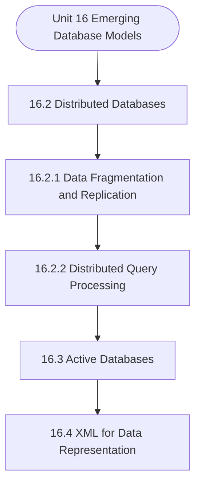

# MCS-207: Database Management Systems
## Unit 16: Emerging Database Models

> 📚 **Programme:** M.Sc. (Data Science and Analytics) | **Semester:** Semester 1  
> ⏱️ **Estimated Study Time:** ~39 mins | 📄 **Textbook Pages:** 20 Pages  
> 📥 **Original PDF:** [Download & View Authentic Textbook](../../../pdfs/Semester_1/MCS-207_Database_Management_Systems/Unit-16_Emerging_Database_Models.pdf)

---

### 🎯 Executive Concept & Data Science Relevance
In modern data systems, **Emerging Database Models** forms a vital conceptual pillar. Relational algebra and SQL form the query engine of every data warehouse (Snowflake, BigQuery, Postgres). Concurrency protocols and normalization ensure data integrity and ACID consistency across concurrent transaction streams.

> [!NOTE]
> **Why this matters for your career:** Mastering emerging database models equips you with the foundational principles required to reason mathematically about high-dimensional datasets, evaluate algorithm performance, and avoid statistical pitfalls in production machine learning pipelines.

### 🗺️ Visual Knowledge Architecture
The following concept map illustrates the structural hierarchy and learning trajectory of this module:



### 📖 Core Definitions & Terminology Cards

> 📌 **Relational Algebra**  
> - **Formal Definition:** A procedural query language consisting of a set of operations on relations: Select ( $\sigma$ ), Project ( $\pi$ ), Union ( $\cup$ ), Set Difference ( $-$ ), Cartesian Product ( $\times$ ), and Join ( $\bowtie$ ).  
> - 💡 **Practical Intuition & Analogy:** *The formal mathematical syntax executed behind SQL `SELECT` queries.*

> 📌 **ACID Properties**  
> - **Formal Definition:** Atomicity (all or nothing), Consistency (preserves invariants), Isolation (concurrent execution equivalent to serial), Durability (committed data survives crashes).  
> - 💡 **Practical Intuition & Analogy:** *The financial transaction guarantee: money cannot disappear between debit and credit.*

> 📌 **Functional Dependency $X \to Y$**  
> - **Formal Definition:** A constraint between two sets of attributes: for any two valid tuples $t_1, t_2$, if $t_1[X] = t_2[X]$, then $t_1[Y] = t_2[Y]$. Value of $X$ uniquely determines $Y$.  
> - 💡 **Practical Intuition & Analogy:** *`StudentID` uniquely determines `StudentName`.*

> 📌 **Third Normal Form (3NF) & BCNF**  
> - **Formal Definition:** A relation is in 3NF if for every non-trivial $X \to Y$, either $X$ is a superkey or $Y$ is a prime attribute. It is in BCNF if $X$ is strictly a superkey.  
> - 💡 **Practical Intuition & Analogy:** *Eliminates transitive dependencies so data is stored in exactly one canonical place without update anomalies.*

### ⚡ Governing Mathematical Laws & Formula Cheatsheet
#### 🔹 Relational Algebra Selection & Projection
$$
\sigma_{\text{condition}}(R) \quad \text{and} \quad \pi_{\text{attributes}}(R)
$$
- **Explanation:** $\sigma$ filters rows (equivalent to SQL `WHERE`), while $\pi$ selects specific columns (equivalent to SQL `SELECT column_list`).

#### 🔹 Relational Natural Join
$$
R \bowtie S = \pi_{\mathcal{A}(R) \cup \mathcal{A}(S)}\left(\sigma_{\text{match}}(R \times S)\right)
$$
- **Explanation:** Performs equality join across all identically named attributes between two tables.

#### 🔹 Two-Phase Locking (2PL) Theorem
$$
\text{Growing Phase: Only Acquire Locks} \implies \text{Shrinking Phase: Only Release Locks}
$$
- **Explanation:** Guarantees conflict serializability of concurrent database schedules without data race anomalies.

### ⚖️ Axiomatic Properties & Governing Laws
The mathematical formulations of this module are anchored by foundational algebraic and structural laws:

- **Armstrong's Reflexivity:** $Y \subseteq X \implies X \to Y$
- **Armstrong's Augmentation:** $X \to Y \implies XZ \to YZ$
- **Armstrong's Transitivity:** $X \to Y \land Y \to Z \implies X \to Z$

### 📌 Comprehensive Section-by-Section Study Breakdown
#### `16.2` Distributed Databases
##### 📘 Theoretical Principles & In-Depth Exposition
In a distributed database, as shown in Figure 2, all the data is not stored at all the database sites. In general, the data related to a particular site is stored on that site. For example, in Figure 2, data related to Regional Centre Chennai and Regional Centre Noida is stored at their respective sites.

The process of distributing data into different parts is called fragmentation. This kind of distribution of data facilitates faster query processing, as most of the queries at a site can be answered from the local data. In addition to fragmentation, the data is replicated at more than one site.

For example, in Figure 2, data of Regional Centre Noida is replicated at Regional Centre Noida and Regional Centre Delhi sites. This data replication helps improve the reliability and availability of the database, as the database would be available to users even if one of the replicated sites fails.

##### ⚙️ Mathematical & Algorithmic Mechanics
- **Formal Mechanics:** Establishes symbolic transformations and state invariants governing distributed databases.
- **Boundary Invariants:** Ensures robust error-handling, non-empty set guarantees, and strict asymptotic bounds.

##### 📊 Practical Data Science & Production Relevance
- **Industry Application:** Directly implemented in production workflows such as SQL query filters, pandas vectorized operations, and feature transformation pipelines.
- **Production Pitfall:** Failing to verify membership bounds or missing edge cases in distributed databases can cause silent data corruption or performance bottlenecks.

> [!TIP]
> **Key Exam & Technical Interview Takeaway:** Be prepared to define distributed databases formally, cite its core mathematical invariants, and solve step-by-step numerical/proof questions.

#### `16.2.1` Data Fragmentation and Replication
##### 📘 Theoretical Principles & In-Depth Exposition
In a distributed database, as shown in Figure 2, all the data is not stored at all the database sites. In general, the data related to a particular site is stored on that site. For example, in Figure 2, data related to Regional Centre Chennai and Regional Centre Noida is stored at their respective sites.

The process of distributing data into different parts is called fragmentation. This kind of distribution of data facilitates faster query processing, as most of the queries at a site can be answered from the local data. In addition to fragmentation, the data is replicated at more than one site.

For example, in Figure 2, data of Regional Centre Noida is replicated at Regional Centre Noida and Regional Centre Delhi sites. This data replication helps improve the reliability and availability of the database, as the database would be available to users even if one of the replicated sites fails.

##### ⚙️ Mathematical & Algorithmic Mechanics
- **Formal Mechanics:** Establishes symbolic transformations and state invariants governing data fragmentation and replication.
- **Boundary Invariants:** Ensures robust error-handling, non-empty set guarantees, and strict asymptotic bounds.

##### 📊 Practical Data Science & Production Relevance
- **Industry Application:** Directly implemented in production workflows such as SQL query filters, pandas vectorized operations, and feature transformation pipelines.
- **Production Pitfall:** Failing to verify membership bounds or missing edge cases in data fragmentation and replication can cause silent data corruption or performance bottlenecks.

> [!TIP]
> **Key Exam & Technical Interview Takeaway:** Be prepared to define data fragmentation and replication formally, cite its core mathematical invariants, and solve step-by-step numerical/proof questions.

#### `16.2.2` Distributed Query Processing
##### 📘 Theoretical Principles & In-Depth Exposition
A query in a distributed database management system is submitted at a site. This query is then converted to a relational algebraic query and optimised using local and global query optimisation processes. Local query optimisation is the same as that of a centralised DBMS; however, global query optimisation involves the selection of sites for query evaluation, cost of data communication, and cost of query processing.

The process of distributed query processing is explained with the help of the following example. Example: Consider a query submitted at the Headquarters seeking to find the Percentage of fee share of Regional Centre Noida in the financial year 2022-23. This query would require computing the fee collected by RC Noida to the total fee collected between the dates 01st April 2022 and 31st March 2023.

This query may consist of two subqueries: (a) Finding the total fee collected for the financial year 2022-23. (b) Finding the total fee collected at RC Noida in the financial year 2022-23. In addition, you may assume that the financial records are ordered chronologically. One of the possible ways of processing the queries would be to process both the sub-queries at the Headquarters.

##### ⚙️ Mathematical & Algorithmic Mechanics
- **Formal Mechanics:** Establishes symbolic transformations and state invariants governing distributed query processing.
- **Boundary Invariants:** Ensures robust error-handling, non-empty set guarantees, and strict asymptotic bounds.

##### 📊 Practical Data Science & Production Relevance
- **Industry Application:** Directly implemented in production workflows such as SQL query filters, pandas vectorized operations, and feature transformation pipelines.
- **Production Pitfall:** Failing to verify membership bounds or missing edge cases in distributed query processing can cause silent data corruption or performance bottlenecks.

> [!TIP]
> **Key Exam & Technical Interview Takeaway:** Be prepared to define distributed query processing formally, cite its core mathematical invariants, and solve step-by-step numerical/proof questions.

#### `16.3` Active Databases
##### 📘 Theoretical Principles & In-Depth Exposition
Active databases, as the name suggests, comprise dynamic actions on the occurrence of certain events. Such actions were part of the SQL 99 standard and are called triggers. Let us define the model that can be used for an active database: Active Database Model Consider the Student and Result relations given in Figure 3.

Student Enrollment No. Name Programme Cumulative Grade Point Average Status Result Enrollment No. CourseCode Grade Figure 3: An example Assuming that the Cumulative Grade Point Average is to be updated for each student when related data is created in the Result relation. The following events will cause a database action to be activated: Action Triggering Event: In the database of Figure 3, on updating the Result table, the Cumulative Grade Point Average (CGPA) of a Student needs to be updated, as well.

Assuming that once a Record is entered in the Result table, then it cannot be deleted, and only the Grade attribute can be modified in the Result relation, the following may be the events that may trigger the action of an update on CGPA for the Student relation: • Addition of a tuple in the Result relation • Modification of a Grade in the Result Relation.

##### ⚙️ Mathematical & Algorithmic Mechanics
- **Formal Mechanics:** Establishes symbolic transformations and state invariants governing active databases.
- **Boundary Invariants:** Ensures robust error-handling, non-empty set guarantees, and strict asymptotic bounds.

##### 📊 Practical Data Science & Production Relevance
- **Industry Application:** Directly implemented in production workflows such as SQL query filters, pandas vectorized operations, and feature transformation pipelines.
- **Production Pitfall:** Failing to verify membership bounds or missing edge cases in active databases can cause silent data corruption or performance bottlenecks.

> [!TIP]
> **Key Exam & Technical Interview Takeaway:** Be prepared to define active databases formally, cite its core mathematical invariants, and solve step-by-step numerical/proof questions.

#### `16.4` XML for Data Representation
##### 📘 Theoretical Principles & In-Depth Exposition
The eXtensible Markup Language (XML) is one of the popular data representation languages. It uses user-defined tags to represent a document. A typical XML document relating to the student's table, as shown in Figure 3, is shown below: <school> <class> <class_no>XII</class_no> <class_teacher>John</class_teacher> <student> <enrolmentNo>2301002297</enrolmentNo> <name>Ritesh Jain</name> <programme>PGDCA</programme> <cgpa>7.5</cgpa> <status>Pass</status> <result> <coursecode>BCS011</coursecode> <grade>A</grade> <coursecode>BCS013</coursecode> <grade>B+</grade> </result> </student> <student> <enrolmentNo>2301002301</enrolmentNo> <name>Amitesh</name> <programme>PGDCA</programme> <cgpa>8.5</cgpa> <status>Distinction</status> <result> <coursecode>BCS011</coursecode> <grade>A+</grade> <coursecode>BCS013</coursecode> <grade>A</grade> </result> </student> </class> </school> Figure 4: A sample XML document You may please observe that instead of using a separate table, in the XML document, the results of the students are merged along with the student information.

Thus, XML representation has the potential to store all the information about an entity in one place. Such a representation, though it may be useful for searching from a point of view as no join operation is required, may lead to redundancy of information. In addition to the use of tags, XML allows users to store attributes along with a tag.

For example, the enrolment number can be stored as an attribute of the student as: <student enrolmentNo = “2301002301”> <name> … </student> … The attribute may be useful for searching for information on the related field. Just like the database management system has a different schema, XML also can be used to validate the structure of the XML data.

##### ⚙️ Mathematical & Algorithmic Mechanics
- **Formal Mechanics:** Establishes symbolic transformations and state invariants governing xml for data representation.
- **Boundary Invariants:** Ensures robust error-handling, non-empty set guarantees, and strict asymptotic bounds.

##### 📊 Practical Data Science & Production Relevance
- **Industry Application:** Directly implemented in production workflows such as SQL query filters, pandas vectorized operations, and feature transformation pipelines.
- **Production Pitfall:** Failing to verify membership bounds or missing edge cases in xml for data representation can cause silent data corruption or performance bottlenecks.

> [!TIP]
> **Key Exam & Technical Interview Takeaway:** Be prepared to define xml for data representation formally, cite its core mathematical invariants, and solve step-by-step numerical/proof questions.

#### `16.5` Blockchain Databases
##### 📘 Theoretical Principles & In-Depth Exposition
Conceptually, blockchain is a paradigm of storage of data in a distributed manner, which may also protect data from fraudulent transactions and updates. Blockchain technology was used to store distributed ledgers and bitcoins. However, this technology is not limited to only these applications.

In this section, we will present some of the basic features of blockchain with the help of an example. However, to understand the principles of blockchain, you should study the paper "Bitcoin: A Peer-to-Peer Electronic Cash System" by Satoshi Nakamoto in 2008. Let us discuss the components of the blockchain technology.

A Blockchain will have the following components: 1. Distributed set of Authorised Nodes: The role of a node is to keep the ledger of data. A ledger consists of data logs, which are timestamped. A blockchain is a sequence of blocks of data, which is maintained at each of these authorised nodes.

##### ⚙️ Mathematical & Algorithmic Mechanics
- **Formal Mechanics:** Establishes symbolic transformations and state invariants governing blockchain databases.
- **Boundary Invariants:** Ensures robust error-handling, non-empty set guarantees, and strict asymptotic bounds.

##### 📊 Practical Data Science & Production Relevance
- **Industry Application:** Directly implemented in production workflows such as SQL query filters, pandas vectorized operations, and feature transformation pipelines.
- **Production Pitfall:** Failing to verify membership bounds or missing edge cases in blockchain databases can cause silent data corruption or performance bottlenecks.

> [!TIP]
> **Key Exam & Technical Interview Takeaway:** Be prepared to define blockchain databases formally, cite its core mathematical invariants, and solve step-by-step numerical/proof questions.

#### `16.6` Multimedia Database
##### 📘 Theoretical Principles & In-Depth Exposition
Multimedia data is an integration of textual, graphical, audio, video, and animation data. In general, multimedia data may include lengthy textual documents, pictures, drawings, digital audio clips, movies, and animations. A multimedia database should be able to store large multimedia data efficiently and provide the feature of querying the multimedia data.

Querying is a very interesting domain in the context of multimedia data, as most searches in such data require retrieval of data based on some content. For example, you may be interested in all the videos related to "Database Integrity and Normalization" from a multimedia database or videos of a particular presenter.

Please note that such queries would require indexing on the objects and related contents. How can you create these indexes? One way to create indexes would be to create a large amount of metadata for each object. This metadata should use standardised keywords, title, credentials of creators, summary information, etc.

##### ⚙️ Mathematical & Algorithmic Mechanics
- **Formal Mechanics:** Establishes symbolic transformations and state invariants governing multimedia database.
- **Boundary Invariants:** Ensures robust error-handling, non-empty set guarantees, and strict asymptotic bounds.

##### 📊 Practical Data Science & Production Relevance
- **Industry Application:** Directly implemented in production workflows such as SQL query filters, pandas vectorized operations, and feature transformation pipelines.
- **Production Pitfall:** Failing to verify membership bounds or missing edge cases in multimedia database can cause silent data corruption or performance bottlenecks.

> [!TIP]
> **Key Exam & Technical Interview Takeaway:** Be prepared to define multimedia database formally, cite its core mathematical invariants, and solve step-by-step numerical/proof questions.

#### `16.7` Use of Databases in Web Applications
##### 📘 Theoretical Principles & In-Depth Exposition
A database system is a persistent collection of an organisation's data, which is shared and integrated among various applications. Database technology supports non- redundant storage of data, which allows the following features: • Structured storage of data in the form of tables • Secure data insertion, modification, and deletion.

• Support for concurrent database transactions. • Easy but controlled access to data. These features are very useful for any web application, too. Therefore, many web applications use database management systems (DBMS) to store data and access it securely for display on the web. These DBMSs are normally managed on a separate server, called a database server, and communicate with the web server to store or retrieve data.

The web server then communicates this information through the relevant web pages to communicate with the web clients. For example, when you register on an eCommerce website, the information you fill in the registration form is stored in a registration database. This registration information is accessed when you log in again on that website.

##### ⚙️ Mathematical & Algorithmic Mechanics
- **Formal Mechanics:** Establishes symbolic transformations and state invariants governing use of databases in web applications.
- **Boundary Invariants:** Ensures robust error-handling, non-empty set guarantees, and strict asymptotic bounds.

##### 📊 Practical Data Science & Production Relevance
- **Industry Application:** Directly implemented in production workflows such as SQL query filters, pandas vectorized operations, and feature transformation pipelines.
- **Production Pitfall:** Failing to verify membership bounds or missing edge cases in use of databases in web applications can cause silent data corruption or performance bottlenecks.

> [!TIP]
> **Key Exam & Technical Interview Takeaway:** Be prepared to define use of databases in web applications formally, cite its core mathematical invariants, and solve step-by-step numerical/proof questions.

### 📐 Step-by-Step Solved Mathematical Examples
To solidify your theoretical understanding, work through these fully solved, step-by-step mathematical problems:

#### 🧮 Example 1: BCNF Normalization Decomposition
> **Problem Statement:**  
> Given relation $R(A, B, C, D)$ with functional dependencies $F = \lbrace A \to B, \; B \to C, \; C \to D \rbrace$. Find candidate keys, check if $R$ is in BCNF, and decompose if necessary.

**Detailed Step-by-Step Solution:**

1. **Candidate Key:** Closure $(A)^+ = \lbrace A, B, C, D \rbrace$. Thus $A$ is the sole candidate key.
2. **BCNF Test:**
- $A \to B$: $A$ is superkey (Passes BCNF).
- $B \to C$: $B$ is NOT a superkey (Violates BCNF).
- $C \to D$: $C$ is NOT a superkey (Violates BCNF).

3. **Decomposition:**
- Decompose on $B \to C$: $R_1(B, C)$ with $B \to C$ (In BCNF, key $B$), and $R_2(A, B, D)$ with $A \to B, B \to D$.
- In $R_2$, $B \to D$ violates BCNF ($B$ not superkey for $R_2$). Decompose $R_2$ into $R_{21}(B, D)$ and $R_{22}(A, B)$.

Final BCNF schema: $R_1(B, C), \; R_{21}(B, D), \; R_{22}(A, B)$ (Lossless and dependency preserving).

#### 🧮 Example 2: Relational Algebra to SQL Translation
> **Problem Statement:**  
> Express relational algebra query $\pi_{\text{name, salary}}(\sigma_{\text{dept}='Analytics' \land \text{salary} > 80000}(\text{Employees}))$ into standard SQL.

**Detailed Step-by-Step Solution:**

```sql
SELECT name, salary
FROM Employees
WHERE dept = 'Analytics' AND salary > 80000;
```

### 💻 Practical Data Science Implementation (Python)
Theory translates directly into production algorithms. Below is a self-contained, commented Python implementation illustrating the core operations of this unit:

```python
import pandas as pd

# Simulating Relational Algebra with Pandas
emp = pd.DataFrame({
    'emp_id': [1, 2, 3, 4],
    'name': ['Alice', 'Bob', 'Charlie', 'David'],
    'dept_id': [10, 10, 20, 30]
})

dept = pd.DataFrame({
    'dept_id': [10, 20, 40],
    'dept_name': ['Analytics', 'Engineering', 'HR']
})

# 1. Selection (Sigma): dept_id == 10
sel = emp[emp['dept_id'] == 10]

# 2. Projection (Pi): ['name', 'dept_id']
proj = sel[['name', 'dept_id']]

# 3. Natural Join (Bowtie): emp ⨝ dept
natural_join = pd.merge(emp, dept, on='dept_id', how='inner')

print("Natural Join Result:\n", natural_join[['name', 'dept_name']])
```

### 💡 Interactive Self-Assessment Checkpoints
Test your comprehension before proceeding. Tap each question to reveal the comprehensive explanation:

<details>
<summary><b>Checkpoint 1:</b> What does ACID stand for in database management? <i>(Tap to reveal answer)</i></summary>

> **Answer & Analysis:**  
> Atomicity, Consistency, Isolation, and Durability.
</details>

<details>
<summary><b>Checkpoint 2:</b> What is the difference between 3NF and BCNF? <i>(Tap to reveal answer)</i></summary>

> **Answer & Analysis:**  
> In 3NF, for any non-trivial $X \to Y$, $X$ must be a superkey OR $Y$ must be a prime attribute. In BCNF (Boyce-Codd Normal Form), $X$ MUST strictly be a superkey (eliminating all dependencies on prime attributes).
</details>

<details>
<summary><b>Checkpoint 3:</b> What is the relational algebra symbol for row selection and column projection? <i>(Tap to reveal answer)</i></summary>

> **Answer & Analysis:**  
> Row selection: $\sigma$ (Sigma). Column projection: $\pi$ (Pi).
</details>

<details>
<summary><b>Checkpoint 4:</b> How is DDBMS different from RDBMS? ………………………………………………………………………………… ………………………………………………………………………………… <i>(Tap to reveal answer)</i></summary>

> **Answer & Analysis:**  
> This question tests your conceptual mastery of Emerging Database Models. Review the governing formulas and section breakdowns above to formulate a complete, rigorous proof or derivation.
</details>

<details>
<summary><b>Checkpoint 5:</b> What is an active database? What is a triggering event? ………………………………………………………………………………… ………………………………………………………………………………… ………………………………………………………………………………… <i>(Tap to reveal answer)</i></summary>

> **Answer & Analysis:**  
> This question tests your conceptual mastery of Emerging Database Models. Review the governing formulas and section breakdowns above to formulate a complete, rigorous proof or derivation.
</details>

<details>
<summary><b>Checkpoint 6:</b> Create an XML document consisting of Marks of two students in at least one subject. Also, make the DTD for validating this XML document. ………………………………………………………………………………… ………………………………………………………………………………… <i>(Tap to reveal answer)</i></summary>

> **Answer & Analysis:**  
> This question tests your conceptual mastery of Emerging Database Models. Review the governing formulas and section breakdowns above to formulate a complete, rigorous proof or derivation.
</details>

### 🎯 Executive Module Wrap-Up
- **Central Idea:** Emerging Database Models provides essential mathematical and algorithmic tools directly utilized in Data Science.
- **Mathematical Rigor:** Formulas and laws must be memorized with attention to boundary conditions and assumptions.
- **Full Textbook Coverage:** For exhaustive multi-page derivations, proofs, and supplementary exercises, consult the [Authentic IGNOU Textbook](../../../pdfs/Semester_1/MCS-207_Database_Management_Systems/Unit-16_Emerging_Database_Models.pdf).

---
### 🧭 Navigation & Syllabus Index
[⬅ Previous: Unit 15](unit_15_NoSQL_Database.md) | [📑 Course Index](README.md)
