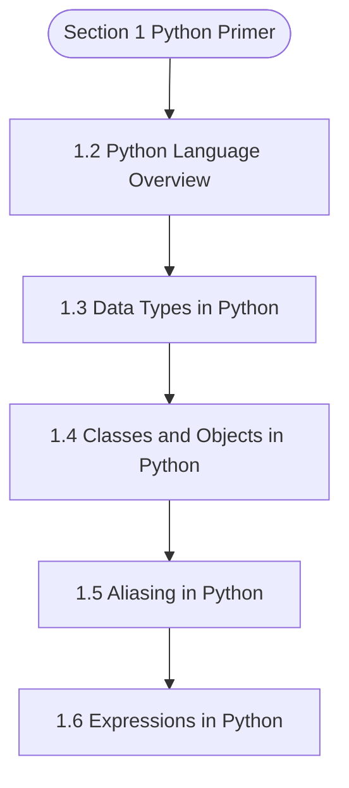

# MCSL-064: Data Structures using Python Lab
## Section 1: Python Primer

> 📚 **Programme:** M.Sc. (Data Science and Analytics) | **Semester:** Semester 1  
> ⏱️ **Estimated Study Time:** ~43 mins | 📄 **Textbook Pages:** 28 Pages  
> 📥 **Original PDF:** [Download & View Textbook](../../../pdfs/Semester_1/MCSL-064_Data_Structures_using_Python_Lab/Section-1_Python_Primer.pdf)

---

### 🎯 Executive Concept & Data Science Relevance
In modern data systems, **Python Primer** forms a vital conceptual pillar. Set theory is the fundamental bedrock of discrete mathematics, computer science, and data engineering. Relational database operations (SQL JOIN, UNION, INTERSECT), feature spaces, probability sample spaces, and categorical groupings are direct applications of set theory.

> [!NOTE]
> **Why this matters for your career:** Mastering python primer equips you with the foundational principles required to reason mathematically about high-dimensional datasets, evaluate algorithm performance, and avoid statistical pitfalls in production machine learning pipelines.

### 🗺️ Visual Knowledge Architecture
The following concept map illustrates the structural hierarchy and learning trajectory of this module:

### 📖 Core Definitions & Terminology Cards

> 📌 **Set**  
> - **Formal Definition:** A well-defined collection of distinct objects, denoted typically by uppercase letters $A, B, X$. Distinctness implies no duplicate elements, and well-defined means for any entity $x$, either $x \in A$ or $x \notin A$ is deterministically decidable.  
> - 💡 **Practical Intuition & Analogy:** *Think of a Python `set({1, 2, 3})` where duplicate elements are collapsed and lookup is based on unique membership.*

> 📌 **Cardinality $\vert A \vert$ or $n(A)$**  
> - **Formal Definition:** The total count of distinct elements in a finite set $A$. If $\vert A \vert = n$, the set contains exactly $n$ distinct members. For infinite sets, cardinality characterizes transfinite sizes (e.g. countable $\aleph_0$ vs uncountable $c$).  
> - 💡 **Practical Intuition & Analogy:** *The output of `len(my_set)` in programming.*

> 📌 **Power Set $\mathcal{P}(A)$**  
> - **Formal Definition:** The set of all possible subsets of $A$, including the empty set $\emptyset$ and $A$ itself: $\mathcal{P}(A) = \lbrace S \mid S \subseteq A \rbrace$. If $\vert A \vert = n$, then $\vert \mathcal{P}(A) \vert = 2^n$.  
> - 💡 **Practical Intuition & Analogy:** *In feature selection, evaluating all possible combinations of $n$ features requires searching through the power set of features ( $2^n$ candidate models ).*

> 📌 **Subset & Proper Subset**  
> - **Formal Definition:** A set $A$ is a subset of $B$ ( $A \subseteq B$ ) if $\forall x \in A \implies x \in B$. It is a proper subset ( $A \subset B$ ) if $A \subseteq B$ and $A \neq B$ (i.e. $\exists y \in B$ such that $y \notin A$).  
> - 💡 **Practical Intuition & Analogy:** *All Data Scientists are Analysts ( $A \subseteq B$ ), but not all Analysts are Data Scientists ( $A \subset B$ ).*

> 📌 **Universal Set $U$**  
> - **Formal Definition:** A designated superset containing all objects and entities under active consideration in a given problem or domain. Every set $X$ in that context satisfies $X \subseteq U$.  
> - 💡 **Practical Intuition & Analogy:** *The entire master database table or global population before applying any filter conditions.*

### ⚡ Governing Mathematical Laws & Formula Cheatsheet
#### 🔹 Power Set Cardinality Theorem
$$
\vert\mathcal{P}(A)\vert = 2^n \quad \text{where } n = \vert A\vert
$$
- **Explanation:** Proved by induction or combinatorics: each of the $n$ elements has exactly 2 binary choices (to be included or excluded from a subset).

#### 🔹 Principle of Inclusion-Exclusion (2 Sets)
$$
\vert A \cup B\vert = \vert A\vert + \vert B\vert - \vert A \cap B\vert
$$
- **Explanation:** Prevents double-counting the elements present in the intersection when calculating the total union size.

#### 🔹 Principle of Inclusion-Exclusion (3 Sets)
$$
\begin{aligned} \vert A \cup B \cup C\vert = & \;\vert A\vert + \vert B\vert + \vert C\vert \\ & - (\vert A \cap B\vert + \vert B \cap C\vert + \vert A \cap C\vert) \\ & + \vert A \cap B \cap C\vert \end{aligned}
$$
- **Explanation:** Alternates adding singletons, subtracting pairwise overlaps, and re-adding the three-way intersection.

#### 🔹 De Morgan's Laws for Sets
$$
(A \cup B)^c = A^c \cap B^c \quad \text{and} \quad (A \cap B)^c = A^c \cup B^c
$$
- **Explanation:** The complement of a union is the intersection of the complements, and vice versa. Fundamental to query optimization and boolean logic.

#### 🔹 Cartesian Product Cardinality
$$
\vert A \times B\vert = \vert A\vert \times \vert B\vert = \lbrace (a, b) \mid a \in A, b \in B \rbrace
$$
- **Explanation:** Basis of relational database `CROSS JOIN`, generating every ordered pair between two entities.

### 📌 Detailed Section-by-Section Study Breakdown
#### `1.2` Python Language Overview
- **Core Concept:** Establishes theoretical foundations, axiomatic formulations, and properties of python language overview.
- **Core Concept:** Analyzes standard algorithmic workflows and mathematical transformations relevant to python primer.
- **Core Concept:** Applies computational bounds and optimization guarantees across data processing workflows.
- **Data Science Application:** Provides foundational structures used directly in statistical modeling, query execution, and machine learning pipelines.

> [!TIP]
> **Exam & Interview Tip:** Be prepared to state the formal definition of python language overview and derive its primary equations step-by-step.

#### `1.3` Data Types in Python
- **Core Concept:** Establishes theoretical foundations, axiomatic formulations, and properties of data types in python.
- **Core Concept:** Analyzes standard algorithmic workflows and mathematical transformations relevant to python primer.
- **Core Concept:** Applies computational bounds and optimization guarantees across data processing workflows.
- **Data Science Application:** Provides foundational structures used directly in statistical modeling, query execution, and machine learning pipelines.

> [!TIP]
> **Exam & Interview Tip:** Be prepared to state the formal definition of data types in python and derive its primary equations step-by-step.

#### `1.4` Classes and Objects in Python
- **Core Concept:** Python is an object-oriented language and classes form the basis for all its data types.
- **Core Concept:** Classes are a means of bringing together data and functionality together.
- **Core Concept:** Each class encapsulates data and behaviour (methods) into a single entity.
- **Data Science Application:** Provides foundational structures used directly in statistical modeling, query execution, and machine learning pipelines.

> [!TIP]
> **Exam & Interview Tip:** Be prepared to state the formal definition of classes and objects in python and derive its primary equations step-by-step.

#### `1.5` Aliasing in Python
- **Core Concept:** Each identifier is associated with the memory address of the object to which it referring to.
- **Core Concept:** An identifier can be associated with one type of object initially and later it can be reassigned to another object that is of the same or different type.
- **Core Concept:** Modifying any one of the the list will affect the other.
- **Data Science Application:** Provides foundational structures used directly in statistical modeling, query execution, and machine learning pipelines.

> [!TIP]
> **Exam & Interview Tip:** Be prepared to state the formal definition of aliasing in python and derive its primary equations step-by-step.

#### `1.6` Expressions in Python
- **Core Concept:** Like in C or C++, a combination of operands and operators is called an expression.
- **Core Concept:** The expression produces some value or result after being interpreted by the Python interpreter.
- **Core Concept:** It combines operators, variables, literals, and function calls to produce a value.
- **Data Science Application:** Provides foundational structures used directly in statistical modeling, query execution, and machine learning pipelines.

> [!TIP]
> **Exam & Interview Tip:** Be prepared to state the formal definition of expressions in python and derive its primary equations step-by-step.

#### `1.7` Control Flow
- **Core Concept:** Program execution happens sequentially in Python wherein the Python interpreter reads a code written by you line by line from top to bottom with each statement interpreted from left to right and.
- **Core Concept:** The interpreter executes operations and functions in the order that it reads which is what the control flow signifies.
- **Core Concept:** Not every program shall follow this pattern since the program shall also encounter conditional statement and based on this outcome, the control gets transferred to the desired statement.
- **Data Science Application:** Provides foundational structures used directly in statistical modeling, query execution, and machine learning pipelines.

> [!TIP]
> **Exam & Interview Tip:** Be prepared to state the formal definition of control flow and derive its primary equations step-by-step.

### 💡 Interactive Self-Assessment Checkpoints
Test your comprehension before proceeding. Tap each question to reveal the comprehensive explanation:

<b>Checkpoint 1:</b> If a set $A$ has 5 elements, how many proper subsets does it possess? <i>(Tap to reveal answer)</i>

> **Answer & Analysis:**  
> A set with $n=5$ elements has total subsets $\vert\mathcal{P}(A)\vert = 2^5 = 32$. Proper subsets exclude the set itself, so the number of proper subsets is $2^n - 1 = 32 - 1 = 31$.

<b>Checkpoint 2:</b> What is the difference between $x \in A$ and $\lbrace x\rbrace \subseteq A$? <i>(Tap to reveal answer)</i>

> **Answer & Analysis:**  
> $x \in A$ denotes that element $x$ is a direct member of set $A$. In contrast, $\lbrace x\rbrace \subseteq A$ denotes that the singleton set containing $x$ is a subset of $A$.

<b>Checkpoint 3:</b> State De Morgan's Law for the complement of $(A \cap B)$. <i>(Tap to reveal answer)</i>

> **Answer & Analysis:**  
> $(A \cap B)^c = A^c \cup B^c$. The complement of the intersection is equal to the union of their individual complements.

<b>Checkpoint 4:</b> Explain Russell's Paradox in naive set theory. <i>(Tap to reveal answer)</i>

> **Answer & Analysis:**  
> Let $R = \lbrace X \mid X \notin X\rbrace$ be the set of all sets that do not contain themselves. If $R \in R$, then by definition $R \notin R$. If $R \notin R$, then by definition $R \in R$. This contradiction proves that naive unrestricted set comprehension leads to paradoxes, necessitating axiomatic set theory (ZFC).

<b>Checkpoint 5:</b> What operators does python support? <i>(Tap to reveal answer)</i>

> **Answer & Analysis:**  
> This question tests your conceptual mastery of Python Primer. Review the governing formulas and section breakdowns above to formulate a complete, rigorous proof or derivation.

<b>Checkpoint 6:</b> What are the common built-in data types in Python? <i>(Tap to reveal answer)</i>

> **Answer & Analysis:**  
> This question tests your conceptual mastery of Python Primer. Review the governing formulas and section breakdowns above to formulate a complete, rigorous proof or derivation.

### 🎯 Executive Module Wrap-Up
- **Central Idea:** Python Primer provides essential mathematical and algorithmic tools directly utilized in Data Science.
- **Mathematical Rigor:** Formulas and laws must be memorized with attention to boundary conditions and assumptions.
- **Full Textbook Coverage:** For exhaustive multi-page derivations, proofs, and supplementary exercises, consult the [Authentic IGNOU Textbook](../../../pdfs/Semester_1/MCSL-064_Data_Structures_using_Python_Lab/Section-1_Python_Primer.pdf).

---
### 🧭 Navigation & Syllabus Index
[📑 Course Index](README.md) | [Next: Section 2 ➡](unit_02_Data_Structures_Using_Python_Lab.md)
