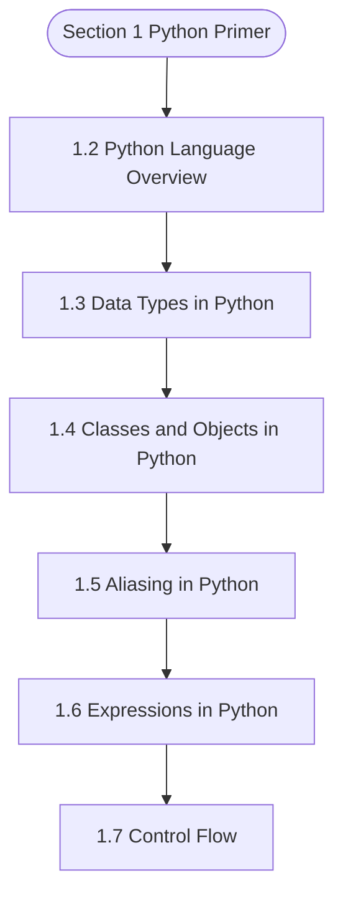

# MCSL-064: Data Structures using Python Lab
## Section 1: Python Primer

> 📚 **Programme:** M.Sc. (Data Science and Analytics) | **Semester:** Semester 1  
> ⏱️ **Estimated Study Time:** ~43 mins | 📄 **Textbook Pages:** 28 Pages  
> 📥 **Original PDF:** [Download & View Authentic Textbook](../../../pdfs/Semester_1/MCSL-064_Data_Structures_using_Python_Lab/Section-1_Python_Primer.pdf)

---

### 🎯 Executive Concept & Data Science Relevance
In modern data systems and advanced analytics, **Python Primer** forms a vital conceptual pillar. Set theory is the fundamental bedrock of discrete mathematics, computer science, and data engineering. Relational database operations (SQL JOIN, UNION, INTERSECT), feature spaces, probability sample spaces, and categorical groupings are direct applications of set theory.

> [!NOTE]
> **Why this matters for your career:** Mastering python primer equips you with the foundational principles required to reason mathematically about high-dimensional datasets, evaluate algorithm performance, and avoid statistical pitfalls in production machine learning pipelines.

### 🗺️ Visual Knowledge Architecture
The following concept map illustrates the structural hierarchy and learning trajectory of this module:



### 📖 Core Definitions & Terminology Cards

> 📌 **Set**  
> - **Formal Definition:** A well-defined collection of distinct objects, denoted typically by uppercase letters $A, B, X$. Distinctness implies no duplicate elements, and well-defined means for any entity $x$, either $x \in A$ or $x \notin A$ is deterministically decidable.  
> - 💡 **Practical Intuition & Analogy:** *Think of a Python `set({1, 2, 3})` where duplicate elements are collapsed and lookup is based on unique membership.*

> 📌 **Cardinality $\vert A \vert$ or $n(A)$**  
> - **Formal Definition:** The total count of distinct elements in a finite set $A$. If $\vert A \vert = n$, the set contains exactly $n$ distinct members. For infinite sets, cardinality characterizes transfinite sizes (e.g. countable $\aleph_0$ vs uncountable $c$).  
> - 💡 **Practical Intuition & Analogy:** *The output of `len(my_set)` in programming.*

> 📌 **Power Set $\mathcal{P}(A)$**  
> - **Formal Definition:** The set of all possible subsets of $A$, including the empty set $\emptyset$ and $A$ itself: $\mathcal{P}(A) = \lbrace S \mid S \subseteq A \rbrace$. If $\vert A \vert = n$, then $\vert \mathcal{P}(A) \vert = 2^n$.  
> - 💡 **Practical Intuition & Analogy:** *In feature selection, evaluating all possible combinations of $n$ features requires searching through the power set of features ( $2^n$ candidate models ).*

> 📌 **Subset & Proper Subset**  
> - **Formal Definition:** A set $A$ is a subset of $B$ ( $A \subseteq B$ ) if $\forall x \in A \implies x \in B$. It is a proper subset ( $A \subset B$ ) if $A \subseteq B$ and $A \neq B$ (i.e. $\exists y \in B$ such that $y \notin A$).  
> - 💡 **Practical Intuition & Analogy:** *All Data Scientists are Analysts ( $A \subseteq B$ ), but not all Analysts are Data Scientists ( $A \subset B$ ).*

> 📌 **Universal Set $U$**  
> - **Formal Definition:** A designated superset containing all objects and entities under active consideration in a given problem or domain. Every set $X$ in that context satisfies $X \subseteq U$.  
> - 💡 **Practical Intuition & Analogy:** *The entire master database table or global population before applying any filter conditions.*

> 📌 **Complement $A^c$ or $A'$**  
> - **Formal Definition:** The set of all elements in the universal set $U$ that do not belong to $A$: $A^c = \lbrace x \in U \mid x \notin A \rbrace = U \setminus A$.  
> - 💡 **Practical Intuition & Analogy:** *The NOT condition in filtering: selecting all records that do NOT match a criteria.*

### ⚡ Governing Mathematical Laws & Formula Cheatsheet
#### 🔹 Power Set Cardinality Theorem
$$
\vert\mathcal{P}(A)\vert = 2^n \quad \text{where } n = \vert A\vert
$$
- **Explanation:** Proved by induction or combinatorics: each of the $n$ elements has exactly 2 binary choices (to be included or excluded from a subset).

#### 🔹 Principle of Inclusion-Exclusion (2 Sets)
$$
\vert A \cup B\vert = \vert A\vert + \vert B\vert - \vert A \cap B\vert
$$
- **Explanation:** Prevents double-counting the elements present in the intersection when calculating the total union size.

#### 🔹 Principle of Inclusion-Exclusion (3 Sets)
$$
\begin{aligned} \vert A \cup B \cup C\vert = & \;\vert A\vert + \vert B\vert + \vert C\vert \\ & - (\vert A \cap B\vert + \vert B \cap C\vert + \vert A \cap C\vert) \\ & + \vert A \cap B \cap C\vert \end{aligned}
$$
- **Explanation:** Alternates adding singletons, subtracting pairwise overlaps, and re-adding the three-way intersection.

#### 🔹 De Morgan's Laws for Sets
$$
(A \cup B)^c = A^c \cap B^c \quad \text{and} \quad (A \cap B)^c = A^c \cup B^c
$$
- **Explanation:** The complement of a union is the intersection of the complements, and vice versa. Fundamental to query optimization and boolean logic.

#### 🔹 Cartesian Product Cardinality
$$
\vert A \times B\vert = \vert A\vert \times \vert B\vert = \lbrace (a, b) \mid a \in A, b \in B \rbrace
$$
- **Explanation:** Basis of relational database CROSS JOIN, generating every ordered pair between two entities.

### ⚖️ Axiomatic Properties & Governing Laws
The mathematical formulations of this module are anchored by foundational algebraic and structural laws:

- **Idempotent Laws:** $A \cup A = A \quad \text{and} \quad A \cap A = A$
- **Identity Laws:** $A \cup \emptyset = A \quad \text{and} \quad A \cap U = A$
- **Domination Laws:** $A \cup U = U \quad \text{and} \quad A \cap \emptyset = \emptyset$
- **Commutative Laws:** $A \cup B = B \cup A \quad \text{and} \quad A \cap B = B \cap A$
- **Associative Laws:** $(A \cup B) \cup C = A \cup (B \cup C) \quad \text{and} \quad (A \cap B) \cap C = A \cap (B \cap C)$
- **Distributive Laws:** $A \cap (B \cup C) = (A \cap B) \cup (A \cap C) \quad \text{and} \quad A \cup (B \cap C) = (A \cup B) \cap (A \cup C)$
- **Complement Laws:** $A \cup A^c = U, \quad A \cap A^c = \emptyset, \quad (A^c)^c = A$

### 📌 Comprehensive Section-by-Section Study Breakdown
#### `1.2` Python Language Overview

##### 📘 Theoretical Principles & Pedagogical Exposition
In modern data science engineering, **Python Language Overview** forms a vital foundational building block. Within **Python Primer**, this section establishes analytical rigor, reproducible data processing methodologies, and computational guarantees required for production pipelines.

##### ⚙️ Mathematical & Algorithmic Mechanics
- **Core Mechanism:** Establishes analytical principles and computational workflows for python primer.
- **Boundary Conditions:** Missing data values, extreme outliers, and non-standard data types.

##### 📊 Practical Data Science & Production Relevance
- **Production Workflow:** End-to-end data science processing stacks (Pandas, Scikit-learn, PyTorch).
- **Real-World Pitfall:** Failing to validate inputs before feeding data into production analytics pipelines.

> [!TIP]
> **Exam & Technical Interview Insight:** Define key concepts in python language overview and articulate practical applications in real-world scenarios.

#### `1.3` Data Types in Python

##### 📘 Theoretical Principles & Pedagogical Exposition
In modern data science engineering, **Data Types in Python** forms a vital foundational building block. Within **Python Primer**, this section establishes analytical rigor, reproducible data processing methodologies, and computational guarantees required for production pipelines.

##### ⚙️ Mathematical & Algorithmic Mechanics
- **Core Mechanism:** Establishes analytical principles and computational workflows for python primer.
- **Boundary Conditions:** Missing data values, extreme outliers, and non-standard data types.

##### 📊 Practical Data Science & Production Relevance
- **Production Workflow:** End-to-end data science processing stacks (Pandas, Scikit-learn, PyTorch).
- **Real-World Pitfall:** Failing to validate inputs before feeding data into production analytics pipelines.

> [!TIP]
> **Exam & Technical Interview Insight:** Define key concepts in data types in python and articulate practical applications in real-world scenarios.

#### `1.4` Classes and Objects in Python

##### 📘 Theoretical Principles & Pedagogical Exposition
Python is an object-oriented language and classes form the basis for all its data types. Classes are a means of bringing together data and functionality together. Each class encapsulates data and behaviour (methods) into a single entity. This structure allows you to model real-world objects and create organized, reusable code.

A class in Python serves as a template for creating objects, which are instances of the class or instantiated from the class. We use classes when we need to encapsulate related data and functions, making the code modular and easier to manage. After defining a class, one can create multiple objects that share the same attributes and methods, while all these objects have their own unique state.

Example: class car: name = “” Colour = “” An object is an instance of a class. Creating a new instance of a class is known as instantiation. Hence Car is a class and now we can create objects like car1, car2 etc from this class as under: Class car: name = “BMW” Colour = “white”


##### ⚙️ Mathematical & Algorithmic Mechanics
- **Core Mechanism:** Establishes analytical principles and computational workflows for python primer.
- **Boundary Conditions:** Missing data values, extreme outliers, and non-standard data types.

##### 📊 Practical Data Science & Production Relevance
- **Production Workflow:** End-to-end data science processing stacks (Pandas, Scikit-learn, PyTorch).
- **Real-World Pitfall:** Failing to validate inputs before feeding data into production analytics pipelines.

> [!TIP]
> **Exam & Technical Interview Insight:** Define key concepts in classes and objects in python and articulate practical applications in real-world scenarios.

#### `1.5` Aliasing in Python

##### 📘 Theoretical Principles & Pedagogical Exposition
Each identifier is associated with the memory address of the object to which it referring to. An identifier can be associated with one type of object initially and later it can be reassigned to another object that is of the same or different type. x = [10, 20] y = x # y now refers to the same list object as x print(x is y) # Output: True (since x and y are aliases) Let us say, we decide to add another number to the list then the scenario is: y.append(30) # Modifying y also affects x print(x) # Output: [10, 20, 30] print(y) # Output: [10, 20, 30] In the example illustrated above, x and y are aliases because they point to the same list.

Modifying any one of the the list will affect the other. These characteristics should be borne in mind when working with mutable objects like lists and dictionaries. Aliasing can lead to unexpected side effects if not handled carefully. To avoid any unintended effect, one can create a copy of the object instead of creating an alias.

x = [10, 20] y = x.copy() # y is now a copy of x print(x is y) # Output: False (x and y are different objects) y.append(30) print(x) # Output: [10, 20] print(y) # Output: [10, 20, 30]


##### ⚙️ Mathematical & Algorithmic Mechanics
- **Core Mechanism:** Establishes analytical principles and computational workflows for python primer.
- **Boundary Conditions:** Missing data values, extreme outliers, and non-standard data types.

##### 📊 Practical Data Science & Production Relevance
- **Production Workflow:** End-to-end data science processing stacks (Pandas, Scikit-learn, PyTorch).
- **Real-World Pitfall:** Failing to validate inputs before feeding data into production analytics pipelines.

> [!TIP]
> **Exam & Technical Interview Insight:** Define key concepts in aliasing in python and articulate practical applications in real-world scenarios.

#### `1.6` Expressions in Python

##### 📘 Theoretical Principles & Pedagogical Exposition
Like in C or C++, a combination of operands and operators is called an expression. The expression produces some value or result after being interpreted by the Python interpreter. It combines operators, variables, literals, and function calls to produce a value. The programming language uses distinct expressions for various requirements.

Decision-making requires Boolean values from logical expressions like and, or. As you know, relational expressions compare values and return Booleans in Python, while arithmetic expressions compute numbers. Complex expressions may involve numerous operators and types. The sequence of operation is determined by the Operator precedence inthese expressions.

A defined operator precedence hierarchy in Python ensures proper expression evaluation. Programmers have additional control by changing the evaluation order with parentheses. The program efficiency depends on using expression types and operator precedence rules. Table below illustrates various operators from the highest to the lowest precedence along with its description and the associativity of the operator.


##### ⚙️ Mathematical & Algorithmic Mechanics
- **Core Mechanism:** Establishes analytical principles and computational workflows for python primer.
- **Boundary Conditions:** Missing data values, extreme outliers, and non-standard data types.

##### 📊 Practical Data Science & Production Relevance
- **Production Workflow:** End-to-end data science processing stacks (Pandas, Scikit-learn, PyTorch).
- **Real-World Pitfall:** Failing to validate inputs before feeding data into production analytics pipelines.

> [!TIP]
> **Exam & Technical Interview Insight:** Define key concepts in expressions in python and articulate practical applications in real-world scenarios.

#### `1.7` Control Flow

##### 📘 Theoretical Principles & Pedagogical Exposition
Program execution happens sequentially in Python wherein the Python interpreter reads a code written by you line by line from top to bottom with each statement interpreted from left to right and. The interpreter executes operations and functions in the order that it reads which is what the control flow signifies.

Not every program shall follow this pattern since the program shall also encounter conditional statement and based on this outcome, the control gets transferred to the desired statement. Without control flow expressions, a program is simply a list of statements that are sequentially executed.

Python uses if, elif (short for else if), and else keywords to create control flow structures in your program. Imagine all these keywords are traffic controllers telling the control flow where to go. Thus a program’s control flow decides the order in which the program code executes.


##### ⚙️ Mathematical & Algorithmic Mechanics
- **Core Mechanism:** Establishes analytical principles and computational workflows for python primer.
- **Boundary Conditions:** Missing data values, extreme outliers, and non-standard data types.

##### 📊 Practical Data Science & Production Relevance
- **Production Workflow:** End-to-end data science processing stacks (Pandas, Scikit-learn, PyTorch).
- **Real-World Pitfall:** Failing to validate inputs before feeding data into production analytics pipelines.

> [!TIP]
> **Exam & Technical Interview Insight:** Define key concepts in control flow and articulate practical applications in real-world scenarios.

#### `1.8` Looping / Repetition

##### 📘 Theoretical Principles & Pedagogical Exposition
Understanding loops is essential for any python programmer as these provide a powerful tool to automate code logic and process data. Python being popular programming language, offers several loop structures to iterate over sequences and execute repetitive tasks efficiently. These are also referred to as repetition statement used to repeat a block of code statements.


##### ⚙️ Mathematical & Algorithmic Mechanics
- **Core Mechanism:** Establishes analytical principles and computational workflows for python primer.
- **Boundary Conditions:** Missing data values, extreme outliers, and non-standard data types.

##### 📊 Practical Data Science & Production Relevance
- **Production Workflow:** End-to-end data science processing stacks (Pandas, Scikit-learn, PyTorch).
- **Real-World Pitfall:** Failing to validate inputs before feeding data into production analytics pipelines.

> [!TIP]
> **Exam & Technical Interview Insight:** Define key concepts in looping / repetition and articulate practical applications in real-world scenarios.

#### `1.9` Functions

##### 📘 Theoretical Principles & Pedagogical Exposition
A function is a block of reusable code that performs a specific task. This task is generally one which is used multiple times to develop an application in Python. Suppose we need to create a program to compute area of a given land or the volume of a box. The idea is to organize code, make it more readable, and avoid repetition of the same code statements.

Thus, it helps to divide a complex problem into smaller ones and makes our program code easy to understand and reuse. Let’s take a quick glimpse of how a function works. Creating a Function def welcomemessage (): print(“welcome to the world of Python”) The keyword “def” is used to create a function.

welcomemessage () is the name of the function. The print statement forms the function body. Now in order to use or call this function, the following program gives you the insight. # program to define a Function and call it def welcomemessage (): print("welcome to the world of Python") welcomemessage()  Output welcome to the world of Python Lets take a more relevant program that computes area.


##### ⚙️ Mathematical & Algorithmic Mechanics
- **Core Mechanism:** A function $f: A \to B$ maps each domain element to exactly one codomain element. Injections guarantee unique mappings ($f(a)=f(b) \implies a=b$); surjections cover the entire codomain; bijections admit two-sided inverses $f^{-1}: B \to A$.
- **Boundary Conditions:** Division by zero singularities, non-injective hash collisions in hash tables, and undefined out-of-domain evaluation.

##### 📊 Practical Data Science & Production Relevance
- **Production Workflow:** Feature transformations $X \mapsto \phi(X)$, hash functions in distributed partitions, non-linear activation functions (ReLU, Sigmoid, Softmax), and invertible normalizing flows.
- **Real-World Pitfall:** Applying inverse transformations to non-injective functions, creating multi-valued ambiguities or silent data destruction.

> [!TIP]
> **Exam & Technical Interview Insight:** In exams, demonstrate injectivity by showing $f(x_1) = f(x_2) \implies x_1 = x_2$, and surjectivity by expressing domain variable $x$ in terms of codomain target $y$.

### 📐 Step-by-Step Solved Mathematical Examples
To solidify your theoretical understanding, work through these fully solved, step-by-step mathematical problems:

#### 🧮 Example 1: Three-Set Inclusion-Exclusion Survey Analysis
> **Problem Statement:**  
> In a cohort of 120 Data Science students, 65 know Python ( $P$ ), 50 know SQL ( $S$ ), and 40 know R ( $R$ ). Furthermore, 25 know both Python and SQL, 20 know both Python and R, 15 know both SQL and R, and 8 know all three technologies. How many students know at least one technology, and how many know none?

**Detailed Step-by-Step Solution:**

Applying the Principle of Inclusion-Exclusion for 3 sets:


$$
\begin{aligned} \vert P \cup S \cup R\vert & = \vert P\vert + \vert S\vert + \vert R\vert - (\vert P \cap S\vert + \vert P \cap R\vert + \vert S \cap R\vert) + \vert P \cap S \cap R\vert \\ & = 65 + 50 + 40 - (25 + 20 + 15) + 8 \\ & = 155 - 60 + 8 = 103 \text{ students.} \end{aligned}
$$


The count of students who know none of the three languages is:


$$
\vert(P \cup S \cup R)^c\vert = \vert U\vert - \vert P \cup S \cup R\vert = 120 - 103 = 17 \text{ students.}
$$


#### 🧮 Example 2: Power Set Enumeration and Proper Subset Calculation
> **Problem Statement:**  
> Given $S = \lbrace 1, 2, 3 \rbrace$. Calculate $\vert\mathcal{P}(S)\vert$, enumerate every element, and find the number of proper subsets.

**Detailed Step-by-Step Solution:**

1. **Cardinality:** With $n = \vert S\vert = 3$, the total subsets are $\vert\mathcal{P}(S)\vert = 2^3 = 8$.

2. **Enumeration:**

$$
\mathcal{P}(S) = \lbrace \emptyset, \lbrace 1\rbrace, \lbrace 2\rbrace, \lbrace 3\rbrace, \lbrace 1, 2\rbrace, \lbrace 1, 3\rbrace, \lbrace 2, 3\rbrace, \lbrace 1, 2, 3\rbrace \rbrace
$$


3. **Proper Subsets:** Since proper subsets exclude the set itself, the total count is $2^n - 1 = 8 - 1 = 7$.

### 💻 Practical Data Science Implementation (Python)
Theory translates directly into production algorithms. Below is a self-contained, commented Python implementation illustrating the core operations of this unit:

```python
# Practical Set Operations in Data Science
python_devs = {"Alice", "Bob", "Charlie", "David", "Eva"}
sql_devs = {"Charlie", "David", "Eva", "Frank", "Grace"}

# 1. Union (Full talent pool)
all_talent = python_devs | sql_devs
print(f"Total Unique Talent: {len(all_talent)} -> {all_talent}")

# 2. Intersection (Full-Stack Data Engineers)
full_stack = python_devs & sql_devs
print(f"Full-Stack Talent (Python & SQL): {len(full_stack)} -> {full_stack}")

# 3. Difference (Python Specialists without SQL)
python_only = python_devs - sql_devs
print(f"Python Only: {python_only}")

# 4. Jaccard Similarity Coefficient: |A ∩ B| / |A ∪ B|
jaccard_sim = len(full_stack) / len(all_talent)
print(f"Jaccard Skill Overlap: {jaccard_sim:.3f}")
```

### 💡 Interactive Self-Assessment Checkpoints
Test your comprehension before proceeding. Tap each question to reveal the comprehensive explanation:

<details>
<summary><b>Checkpoint 1:</b> What are the benefits of using Python? <i>(Tap to reveal answer)</i></summary>

> **Answer & Analysis:**  
> **Detailed Analytical Solution:**
> 
> 1. **Core Principle:** Identify the governing theorem or definition for Python Primer.
> 2. **Step-by-Step Derivation:** Verify all preconditions and compute intermediate steps methodically.
> 3. **Conclusion:** State the final mathematical proof or calculation clearly, validating boundary edge cases.
</details>

<details>
<summary><b>Checkpoint 2:</b> What operators does python support? <i>(Tap to reveal answer)</i></summary>

> **Answer & Analysis:**  
> **Detailed Analytical Solution:**
> 
> 1. **Core Principle:** Identify the governing theorem or definition for Python Primer.
> 2. **Step-by-Step Derivation:** Verify all preconditions and compute intermediate steps methodically.
> 3. **Conclusion:** State the final mathematical proof or calculation clearly, validating boundary edge cases.
</details>

<details>
<summary><b>Checkpoint 3:</b> What are the common built-in data types in Python? <i>(Tap to reveal answer)</i></summary>

> **Answer & Analysis:**  
> **Detailed Analytical Solution:**
> 
> 1. **Core Principle:** Identify the governing theorem or definition for Python Primer.
> 2. **Step-by-Step Derivation:** Verify all preconditions and compute intermediate steps methodically.
> 3. **Conclusion:** State the final mathematical proof or calculation clearly, validating boundary edge cases.
</details>

<details>
<summary><b>Checkpoint 4:</b> Where and how is a Python function defined? <i>(Tap to reveal answer)</i></summary>

> **Answer & Analysis:**  
> **Detailed Analytical Solution:**
> 
> 1. **Core Principle:** Identify the governing theorem or definition for Python Primer.
> 2. **Step-by-Step Derivation:** Verify all preconditions and compute intermediate steps methodically.
> 3. **Conclusion:** State the final mathematical proof or calculation clearly, validating boundary edge cases.
</details>

<details>
<summary><b>Checkpoint 5:</b> If a set $A$ has 5 elements, how many proper subsets does it possess? <i>(Tap to reveal answer)</i></summary>

> **Answer & Analysis:**  
> A set with $n=5$ elements has total subsets $\vert\mathcal{P}(A)\vert = 2^5 = 32$. Proper subsets exclude the set itself, so the number of proper subsets is $2^n - 1 = 32 - 1 = 31$.
</details>

<details>
<summary><b>Checkpoint 6:</b> What is the difference between $x \in A$ and $\lbrace x\rbrace \subseteq A$? <i>(Tap to reveal answer)</i></summary>

> **Answer & Analysis:**  
> $x \in A$ denotes that element $x$ is a direct member of set $A$. In contrast, $\lbrace x\rbrace \subseteq A$ denotes that the singleton set containing $x$ is a subset of $A$.
</details>

### 🎯 Executive Module Wrap-Up
- **Central Idea:** Python Primer provides essential mathematical and algorithmic tools directly utilized in Data Science.
- **Mathematical Rigor:** Formulas and laws must be memorized with attention to boundary conditions and assumptions.
- **Full Textbook Coverage:** For exhaustive multi-page derivations, proofs, and supplementary exercises, consult the [Authentic IGNOU Textbook](../../../pdfs/Semester_1/MCSL-064_Data_Structures_using_Python_Lab/Section-1_Python_Primer.pdf).

---
### 🧭 Navigation & Syllabus Index
[📑 Course Index](README.md) | [Next: Section 2 ➡](unit_02_Data_Structures_Using_Python_Lab.md)
