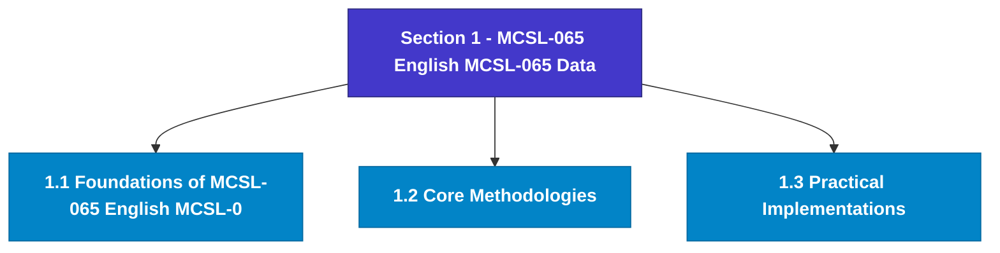

# MCSL-065: Data Science Lab
## Section 1: MCSL-065 English MCSL-065 Data Science Lab

> 📚 **Programme:** M.Sc. (Data Science and Analytics) | **Semester:** Semester 1  
> ⏱️ **Estimated Study Time:** ~31 mins | 📄 **Textbook Pages:** 18 Pages  
> 📥 **Original PDF:** [Download & View Textbook](../../../pdfs/Semester_1/MCSL-065_Data_Science_Lab/MCSL-065_English_MCSL-065_Data_Science_Lab.pdf)

---

### 🎯 Executive Concept & Data Science Relevance
In modern data systems, **MCSL-065 English MCSL-065 Data Science Lab** forms a vital conceptual pillar. Set theory is the fundamental bedrock of all discrete mathematics, computer science, and data engineering. Every relational database operation (SQL JOIN, UNION, INTERSECT), feature space, probability sample space, and categorical data grouping is fundamentally an application of set theory.

> [!NOTE]
> **Why this matters for your career:** Mastering mcsl-065 english mcsl-065 data science lab equips you with the foundational principles required to reason mathematically about high-dimensional datasets, evaluate algorithm performance, and avoid statistical pitfalls in production machine learning pipelines.

### 🗺️ Visual Knowledge Architecture
The following concept map illustrates the structural hierarchy and learning trajectory of this module:

### 📖 Core Definitions & Terminology Cards
| Term | Formal Mathematical / Technical Definition | Intuitive Analogy / Concrete Example |
| :--- | :--- | :--- |
| **Set** | A well-defined collection of distinct objects, denoted typically by uppercase letters $A, B, X$. Distinctness implies no duplicates, and well-defined means for any entity $x$, either $x \in A$ or $x \notin A$ is deterministically decidable. | *Think of a Python `set({1, 2, 3})` where duplicate elements are collapsed and lookup is based on unique membership.* |
| **Cardinality $\vert A \vert$ or $n(A)$** | The total count of distinct elements in a finite set $A$. If $\vert A \vert = n$, the set contains exactly $n$ distinct members. For infinite sets, cardinality describes transfinite sizes (e.g. countable $\aleph_0$ vs uncountable $c$). | *The output of `len(my_set)` in programming.* |
| **Power Set $\mathcal{P}(A)$** | The set of all possible subsets of $A$, including the empty set $\emptyset$ and $A$ itself: $\mathcal{P}(A) = \{S \mid S \subseteq A\}$. If $\vert A \vert = n$, then $\vert \mathcal{P}(A) \vert = 2^n$. | *In feature selection, evaluating all possible combinations of $n$ features requires searching through the power set of features ($2^n$ candidate models).* |
| **Subset & Proper Subset** | A set $A$ is a subset of $B$ ($A \subseteq B$) if $\forall x \in A \implies x \in B$. It is a proper subset ($A \subset B$) if $A \subseteq B$ and $A \neq B$ (i.e. $\exists y \in B$ such that $y \notin A$). | *All Data Scientists are Analysts ($A \subseteq B$), but not all Analysts are Data Scientists ($A \subset B$).* |
| **Universal Set $U$** | A designated superset containing all objects and entities under active consideration in a given problem or domain. Every set $X$ in that context satisfies $X \subseteq U$. | *The entire master database table or global population before applying any filter conditions.* |

### ⚡ Governing Mathematical Laws & Formula Cheatsheet
#### 🔹 Power Set Cardinality Theorem

$$
\vert\mathcal{P}(A)\vert = 2^n \quad \text{where } n = \vert A\vert
$$

- **Explanation:** Proved by induction or combinatorics: each of the $n$ elements has exactly 2 binary choices (to be included or excluded from a subset).

#### 🔹 Principle of Inclusion-Exclusion (2 Sets)

$$
\vert A \cup B\vert = \vert A\vert + \vert B\vert - \vert A \cap B\vert
$$

- **Explanation:** Prevents double-counting the elements present in the intersection when calculating the total union size.

#### 🔹 Principle of Inclusion-Exclusion (3 Sets)

$$
\vert A \cup B \cup C\vert = \vert A\vert + \vert B\vert + \vert C\vert - (\vert A \cap B\vert + \vert B \cap C\vert + \vert A \cap C\vert) + \vert A \cap B \cap C\vert
$$

- **Explanation:** Alternates adding singletons, subtracting pairwise overlaps, and re-adding the three-way intersection.

#### 🔹 De Morgan's Laws for Sets

$$
(A \cup B)^c = A^c \cap B^c \quad \text{and} \quad (A \cap B)^c = A^c \cup B^c
$$

- **Explanation:** The complement of a union is the intersection of the complements, and vice versa. Fundamental to query optimization and boolean logic.

#### 🔹 Cartesian Product Cardinality

$$
\vert A \times B\vert = \vert A\vert \times \vert B\vert = \{(a, b) \mid a \in A, b \in B\}
$$

- **Explanation:** Basis of relational database `CROSS JOIN`, generating every ordered pair between two entities.

### 📌 Detailed Section-by-Section Study Breakdown
#### `1.1` Foundational Principles of MCSL-065 English MCSL-065 Data Science Lab
- **Core Concept:** This enables the students to effectively summarize and communicate the data-driven insights, which is a core requirement in both academic research and industry analytics.
- **Core Concept:** Session 1-5 are based on units 8, 9 and 10, of MCS-062 having focus on the use of Microsoft Excel as a practical tool for conducting descriptive and inferential statistics.
- **Core Concept:** Students will apply their theoretical knowledge to perform frequency analysis, calculate measures of central tendency and dispersion, and execute hypothesis testing procedures including t-tests, ANOVA, and regression analysis.
- **Data Science Application:** Provides foundational structures used directly in statistical modeling, query execution, and machine learning pipelines.

> [!TIP]
> **Exam & Interview Tip:** Be prepared to state the formal definition of foundational principles of mcsl-065 english mcsl-065 data science lab and derive its primary equations step-by-step.

#### `1.2` Core Analytical Methodologies
- **Core Concept:** After completing this lab course, you will be able to: • Visualize data using various plot types to interpret and communicate insights.
- **Core Concept:** • Perform descriptive statistical analysis.
- **Core Concept:** • Apply inferential statistics and forecasting techniques.
- **Data Science Application:** Provides foundational structures used directly in statistical modeling, query execution, and machine learning pipelines.

> [!TIP]
> **Exam & Interview Tip:** Be prepared to state the formal definition of core analytical methodologies and derive its primary equations step-by-step.

#### `1.3` Practical Application in Data Science
- **Core Concept:** • Students should attempt all problems/assignments, given in the session wise list.
- **Core Concept:** • For each GUI-based task assigned in the respective session you should add comments for better readability of the steps involved in the execution.
- **Core Concept:** • For each programming related task assigned in the respective session you should add comments above each function in the code, including the main function.
- **Data Science Application:** Provides foundational structures used directly in statistical modeling, query execution, and machine learning pipelines.

> [!TIP]
> **Exam & Interview Tip:** Be prepared to state the formal definition of practical application in data science and derive its primary equations step-by-step.

### 💡 Interactive Self-Assessment Checkpoints
Test your comprehension before proceeding. Tap each question to reveal the comprehensive explanation:

<b>Checkpoint 1:</b> If a set $A$ has 5 elements, how many proper subsets does it possess? <i>(Tap to reveal answer)</i>

> **Answer & Analysis:**  
> A set with $n=5$ elements has total subsets $\vert\mathcal{P}(A)\vert = 2^5 = 32$. Proper subsets exclude the set itself, so the number of proper subsets is $2^n - 1 = 32 - 1 = 31$.

<b>Checkpoint 2:</b> What is the difference between $x \in A$ and $\{x\} \subseteq A$? <i>(Tap to reveal answer)</i>

> **Answer & Analysis:**  
> $x \in A$ denotes that element $x$ is a direct member of set $A$. In contrast, $\{x\} \subseteq A$ denotes that the singleton set containing $x$ is a subset of $A$.

<b>Checkpoint 3:</b> State De Morgan's Law for the complement of $(A \cap B)$. <i>(Tap to reveal answer)</i>

> **Answer & Analysis:**  
> $(A \cap B)^c = A^c \cup B^c$. The complement of the intersection is equal to the union of their individual complements.

<b>Checkpoint 4:</b> Explain Russell's Paradox in naive set theory. <i>(Tap to reveal answer)</i>

> **Answer & Analysis:**  
> Let $R = \{X \mid X \notin X\}$ be the set of all sets that do not contain themselves. If $R \in R$, then by definition $R \notin R$. If $R \notin R$, then by definition $R \in R$. This contradiction proves that naive unrestricted set comprehension leads to paradoxes, necessitating axiomatic set theory (ZFC).

### 🎯 Executive Module Wrap-Up
- **Central Idea:** MCSL-065 English MCSL-065 Data Science Lab provides essential mathematical and algorithmic tools directly utilized in Data Science.
- **Mathematical Rigor:** Formulas and laws must be memorized with attention to boundary conditions and assumptions.
- **Full Textbook Coverage:** For exhaustive multi-page derivations, proofs, and supplementary exercises, consult the [Authentic IGNOU Textbook](../../../pdfs/Semester_1/MCSL-065_Data_Science_Lab/MCSL-065_English_MCSL-065_Data_Science_Lab.pdf).

---
### 🧭 Navigation & Syllabus Index
[📑 Course Index](README.md)
