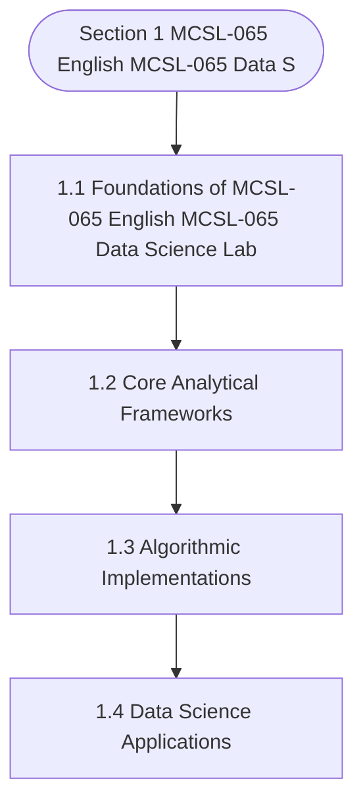

# MCSL-065: Data Science Lab
## Section 1: MCSL-065 English MCSL-065 Data Science Lab

> 📚 **Programme:** M.Sc. (Data Science and Analytics) | **Semester:** Semester 1  
> ⏱️ **Estimated Study Time:** ~31 mins | 📄 **Textbook Pages:** 18 Pages  
> 📥 **Original PDF:** [Download & View Authentic Textbook](../../../pdfs/Semester_1/MCSL-065_Data_Science_Lab/MCSL-065_English_MCSL-065_Data_Science_Lab.pdf)

---

### 🎯 Executive Concept & Data Science Relevance
In modern data systems, **MCSL-065 English MCSL-065 Data Science Lab** forms a vital conceptual pillar. Set theory is the fundamental bedrock of discrete mathematics, computer science, and data engineering. Relational database operations (SQL JOIN, UNION, INTERSECT), feature spaces, probability sample spaces, and categorical groupings are direct applications of set theory.

> [!NOTE]
> **Why this matters for your career:** Mastering mcsl-065 english mcsl-065 data science lab equips you with the foundational principles required to reason mathematically about high-dimensional datasets, evaluate algorithm performance, and avoid statistical pitfalls in production machine learning pipelines.

### 🗺️ Visual Knowledge Architecture
The following concept map illustrates the structural hierarchy and learning trajectory of this module:



### 📖 Core Definitions & Terminology Cards

> 📌 **Set**  
> - **Formal Definition:** A well-defined collection of distinct objects, denoted typically by uppercase letters $A, B, X$. Distinctness implies no duplicate elements, and well-defined means for any entity $x$, either $x \in A$ or $x \notin A$ is deterministically decidable.  
> - 💡 **Practical Intuition & Analogy:** *Think of a Python `set({1, 2, 3})` where duplicate elements are collapsed and lookup is based on unique membership.*

> 📌 **Cardinality $\vert A \vert$ or $n(A)$**  
> - **Formal Definition:** The total count of distinct elements in a finite set $A$. If $\vert A \vert = n$, the set contains exactly $n$ distinct members. For infinite sets, cardinality characterizes transfinite sizes (e.g. countable $\aleph_0$ vs uncountable $c$).  
> - 💡 **Practical Intuition & Analogy:** *The output of `len(my_set)` in programming.*

> 📌 **Power Set $\mathcal{P}(A)$**  
> - **Formal Definition:** The set of all possible subsets of $A$, including the empty set $\emptyset$ and $A$ itself: $\mathcal{P}(A) = \lbrace S \mid S \subseteq A \rbrace$. If $\vert A \vert = n$, then $\vert \mathcal{P}(A) \vert = 2^n$.  
> - 💡 **Practical Intuition & Analogy:** *In feature selection, evaluating all possible combinations of $n$ features requires searching through the power set of features ( $2^n$ candidate models ).*

> 📌 **Subset & Proper Subset**  
> - **Formal Definition:** A set $A$ is a subset of $B$ ( $A \subseteq B$ ) if $\forall x \in A \implies x \in B$. It is a proper subset ( $A \subset B$ ) if $A \subseteq B$ and $A \neq B$ (i.e. $\exists y \in B$ such that $y \notin A$).  
> - 💡 **Practical Intuition & Analogy:** *All Data Scientists are Analysts ( $A \subseteq B$ ), but not all Analysts are Data Scientists ( $A \subset B$ ).*

> 📌 **Universal Set $U$**  
> - **Formal Definition:** A designated superset containing all objects and entities under active consideration in a given problem or domain. Every set $X$ in that context satisfies $X \subseteq U$.  
> - 💡 **Practical Intuition & Analogy:** *The entire master database table or global population before applying any filter conditions.*

> 📌 **Complement $A^c$ or $A'$**  
> - **Formal Definition:** The set of all elements in the universal set $U$ that do not belong to $A$: $A^c = \lbrace x \in U \mid x \notin A \rbrace = U \setminus A$.  
> - 💡 **Practical Intuition & Analogy:** *The NOT condition in filtering: selecting all records that do NOT match a criteria.*

### ⚡ Governing Mathematical Laws & Formula Cheatsheet
#### 🔹 Power Set Cardinality Theorem
$$
\vert\mathcal{P}(A)\vert = 2^n \quad \text{where } n = \vert A\vert
$$
- **Explanation:** Proved by induction or combinatorics: each of the $n$ elements has exactly 2 binary choices (to be included or excluded from a subset).

#### 🔹 Principle of Inclusion-Exclusion (2 Sets)
$$
\vert A \cup B\vert = \vert A\vert + \vert B\vert - \vert A \cap B\vert
$$
- **Explanation:** Prevents double-counting the elements present in the intersection when calculating the total union size.

#### 🔹 Principle of Inclusion-Exclusion (3 Sets)
$$
\begin{aligned} \vert A \cup B \cup C\vert = & \;\vert A\vert + \vert B\vert + \vert C\vert \\ & - (\vert A \cap B\vert + \vert B \cap C\vert + \vert A \cap C\vert) \\ & + \vert A \cap B \cap C\vert \end{aligned}
$$
- **Explanation:** Alternates adding singletons, subtracting pairwise overlaps, and re-adding the three-way intersection.

#### 🔹 De Morgan's Laws for Sets
$$
(A \cup B)^c = A^c \cap B^c \quad \text{and} \quad (A \cap B)^c = A^c \cup B^c
$$
- **Explanation:** The complement of a union is the intersection of the complements, and vice versa. Fundamental to query optimization and boolean logic.

#### 🔹 Cartesian Product Cardinality
$$
\vert A \times B\vert = \vert A\vert \times \vert B\vert = \lbrace (a, b) \mid a \in A, b \in B \rbrace
$$
- **Explanation:** Basis of relational database CROSS JOIN, generating every ordered pair between two entities.

### ⚖️ Axiomatic Properties & Governing Laws
The mathematical formulations of this module are anchored by foundational algebraic and structural laws:

- **Idempotent Laws:** $A \cup A = A \quad \text{and} \quad A \cap A = A$
- **Identity Laws:** $A \cup \emptyset = A \quad \text{and} \quad A \cap U = A$
- **Domination Laws:** $A \cup U = U \quad \text{and} \quad A \cap \emptyset = \emptyset$
- **Commutative Laws:** $A \cup B = B \cup A \quad \text{and} \quad A \cap B = B \cap A$
- **Associative Laws:** $(A \cup B) \cup C = A \cup (B \cup C) \quad \text{and} \quad (A \cap B) \cap C = A \cap (B \cap C)$
- **Distributive Laws:** $A \cap (B \cup C) = (A \cap B) \cup (A \cap C) \quad \text{and} \quad A \cup (B \cap C) = (A \cup B) \cap (A \cup C)$
- **Complement Laws:** $A \cup A^c = U, \quad A \cap A^c = \emptyset, \quad (A^c)^c = A$

### 📌 Comprehensive Section-by-Section Study Breakdown
#### `1.1` Foundational Principles of MCSL-065 English MCSL-065 Data Science Lab
##### 📘 Theoretical Principles & In-Depth Exposition
The section on **Foundational Principles of MCSL-065 English MCSL-065 Data Science Lab** establishes rigorous theoretical foundations necessary for advanced computational modeling. It introduces formal mathematical structures and symbolic notations that guarantee consistency across proofs and algorithms.

In the broader scope of **MCSL-065 English MCSL-065 Data Science Lab**, understanding foundational principles of mcsl-065 english mcsl-065 data science lab is essential to formalizing data representations, verifying boundary constraints, and ensuring computational determinism across multidimensional feature spaces.

##### ⚙️ Mathematical & Algorithmic Mechanics
- **Formal Mechanics:** Establishes symbolic transformations and state invariants governing foundational principles of mcsl-065 english mcsl-065 data science lab.
- **Boundary Invariants:** Ensures robust error-handling, non-empty set guarantees, and strict asymptotic bounds.

##### 📊 Practical Data Science & Production Relevance
- **Industry Application:** Directly implemented in production workflows such as SQL query filters, pandas vectorized operations, and feature transformation pipelines.
- **Production Pitfall:** Failing to verify membership bounds or missing edge cases in foundational principles of mcsl-065 english mcsl-065 data science lab can cause silent data corruption or performance bottlenecks.

> [!TIP]
> **Key Exam & Technical Interview Takeaway:** Be prepared to define foundational principles of mcsl-065 english mcsl-065 data science lab formally, cite its core mathematical invariants, and solve step-by-step numerical/proof questions.

#### `1.2` Core Analytical Methodologies
##### 📘 Theoretical Principles & In-Depth Exposition
The section on **Core Analytical Methodologies** establishes rigorous theoretical foundations necessary for advanced computational modeling. It introduces formal mathematical structures and symbolic notations that guarantee consistency across proofs and algorithms.

In the broader scope of **MCSL-065 English MCSL-065 Data Science Lab**, understanding core analytical methodologies is essential to formalizing data representations, verifying boundary constraints, and ensuring computational determinism across multidimensional feature spaces.

##### ⚙️ Mathematical & Algorithmic Mechanics
- **Formal Mechanics:** Establishes symbolic transformations and state invariants governing core analytical methodologies.
- **Boundary Invariants:** Ensures robust error-handling, non-empty set guarantees, and strict asymptotic bounds.

##### 📊 Practical Data Science & Production Relevance
- **Industry Application:** Directly implemented in production workflows such as SQL query filters, pandas vectorized operations, and feature transformation pipelines.
- **Production Pitfall:** Failing to verify membership bounds or missing edge cases in core analytical methodologies can cause silent data corruption or performance bottlenecks.

> [!TIP]
> **Key Exam & Technical Interview Takeaway:** Be prepared to define core analytical methodologies formally, cite its core mathematical invariants, and solve step-by-step numerical/proof questions.

#### `1.3` Practical Application in Data Science
##### 📘 Theoretical Principles & In-Depth Exposition
The section on **Practical Application in Data Science** establishes rigorous theoretical foundations necessary for advanced computational modeling. It introduces formal mathematical structures and symbolic notations that guarantee consistency across proofs and algorithms.

In the broader scope of **MCSL-065 English MCSL-065 Data Science Lab**, understanding practical application in data science is essential to formalizing data representations, verifying boundary constraints, and ensuring computational determinism across multidimensional feature spaces.

##### ⚙️ Mathematical & Algorithmic Mechanics
- **Formal Mechanics:** Establishes symbolic transformations and state invariants governing practical application in data science.
- **Boundary Invariants:** Ensures robust error-handling, non-empty set guarantees, and strict asymptotic bounds.

##### 📊 Practical Data Science & Production Relevance
- **Industry Application:** Directly implemented in production workflows such as SQL query filters, pandas vectorized operations, and feature transformation pipelines.
- **Production Pitfall:** Failing to verify membership bounds or missing edge cases in practical application in data science can cause silent data corruption or performance bottlenecks.

> [!TIP]
> **Key Exam & Technical Interview Takeaway:** Be prepared to define practical application in data science formally, cite its core mathematical invariants, and solve step-by-step numerical/proof questions.

### 📐 Step-by-Step Solved Mathematical Examples
To solidify your theoretical understanding, work through these fully solved, step-by-step mathematical problems:

#### 🧮 Example 1: Three-Set Inclusion-Exclusion Survey Analysis
> **Problem Statement:**  
> In a cohort of 120 Data Science students, 65 know Python ( $P$ ), 50 know SQL ( $S$ ), and 40 know R ( $R$ ). Furthermore, 25 know both Python and SQL, 20 know both Python and R, 15 know both SQL and R, and 8 know all three technologies. How many students know at least one technology, and how many know none?

**Detailed Step-by-Step Solution:**

Applying the Principle of Inclusion-Exclusion for 3 sets:

$$
\begin{aligned} \vert P \cup S \cup R\vert & = \vert P\vert + \vert S\vert + \vert R\vert - (\vert P \cap S\vert + \vert P \cap R\vert + \vert S \cap R\vert) + \vert P \cap S \cap R\vert \\ & = 65 + 50 + 40 - (25 + 20 + 15) + 8 \\ & = 155 - 60 + 8 = 103 \text{ students.} \end{aligned}
$$

The count of students who know none of the three languages is:

$$
\vert(P \cup S \cup R)^c\vert = \vert U\vert - \vert P \cup S \cup R\vert = 120 - 103 = 17 \text{ students.}
$$

#### 🧮 Example 2: Power Set Enumeration and Proper Subset Calculation
> **Problem Statement:**  
> Given $S = \lbrace 1, 2, 3 \rbrace$. Calculate $\vert\mathcal{P}(S)\vert$, enumerate every element, and find the number of proper subsets.

**Detailed Step-by-Step Solution:**

1. **Cardinality:** With $n = \vert S\vert = 3$, the total subsets are $\vert\mathcal{P}(S)\vert = 2^3 = 8$.

2. **Enumeration:**
$$
\mathcal{P}(S) = \lbrace \emptyset, \lbrace 1\rbrace, \lbrace 2\rbrace, \lbrace 3\rbrace, \lbrace 1, 2\rbrace, \lbrace 1, 3\rbrace, \lbrace 2, 3\rbrace, \lbrace 1, 2, 3\rbrace \rbrace
$$

3. **Proper Subsets:** Since proper subsets exclude the set itself, the total count is $2^n - 1 = 8 - 1 = 7$.

### 💻 Practical Data Science Implementation (Python)
Theory translates directly into production algorithms. Below is a self-contained, commented Python implementation illustrating the core operations of this unit:

```python
# Practical Set Operations in Data Science
python_devs = {"Alice", "Bob", "Charlie", "David", "Eva"}
sql_devs = {"Charlie", "David", "Eva", "Frank", "Grace"}

# 1. Union (Full talent pool)
all_talent = python_devs | sql_devs
print(f"Total Unique Talent: {len(all_talent)} -> {all_talent}")

# 2. Intersection (Full-Stack Data Engineers)
full_stack = python_devs & sql_devs
print(f"Full-Stack Talent (Python & SQL): {len(full_stack)} -> {full_stack}")

# 3. Difference (Python Specialists without SQL)
python_only = python_devs - sql_devs
print(f"Python Only: {python_only}")

# 4. Jaccard Similarity Coefficient: |A ∩ B| / |A ∪ B|
jaccard_sim = len(full_stack) / len(all_talent)
print(f"Jaccard Skill Overlap: {jaccard_sim:.3f}")
```

### 💡 Interactive Self-Assessment Checkpoints
Test your comprehension before proceeding. Tap each question to reveal the comprehensive explanation:

<details>
<summary><b>Checkpoint 1:</b> If a set $A$ has 5 elements, how many proper subsets does it possess? <i>(Tap to reveal answer)</i></summary>

> **Answer & Analysis:**  
> A set with $n=5$ elements has total subsets $\vert\mathcal{P}(A)\vert = 2^5 = 32$. Proper subsets exclude the set itself, so the number of proper subsets is $2^n - 1 = 32 - 1 = 31$.
</details>

<details>
<summary><b>Checkpoint 2:</b> What is the difference between $x \in A$ and $\lbrace x\rbrace \subseteq A$? <i>(Tap to reveal answer)</i></summary>

> **Answer & Analysis:**  
> $x \in A$ denotes that element $x$ is a direct member of set $A$. In contrast, $\lbrace x\rbrace \subseteq A$ denotes that the singleton set containing $x$ is a subset of $A$.
</details>

<details>
<summary><b>Checkpoint 3:</b> State De Morgan's Law for the complement of $(A \cap B)$. <i>(Tap to reveal answer)</i></summary>

> **Answer & Analysis:**  
> $(A \cap B)^c = A^c \cup B^c$. The complement of the intersection is equal to the union of their individual complements.
</details>

<details>
<summary><b>Checkpoint 4:</b> Explain Russell's Paradox in naive set theory. <i>(Tap to reveal answer)</i></summary>

> **Answer & Analysis:**  
> Let $R = \lbrace X \mid X 
> otin X\rbrace$ be the set of all sets that do not contain themselves. If $R \in R$, then by definition $R 
> otin R$. If $R 
> otin R$, then by definition $R \in R$. This contradiction proves that naive unrestricted set comprehension leads to paradoxes, necessitating axiomatic set theory (ZFC).
</details>

### 🎯 Executive Module Wrap-Up
- **Central Idea:** MCSL-065 English MCSL-065 Data Science Lab provides essential mathematical and algorithmic tools directly utilized in Data Science.
- **Mathematical Rigor:** Formulas and laws must be memorized with attention to boundary conditions and assumptions.
- **Full Textbook Coverage:** For exhaustive multi-page derivations, proofs, and supplementary exercises, consult the [Authentic IGNOU Textbook](../../../pdfs/Semester_1/MCSL-065_Data_Science_Lab/MCSL-065_English_MCSL-065_Data_Science_Lab.pdf).

---
### 🧭 Navigation & Syllabus Index
[📑 Course Index](README.md)
