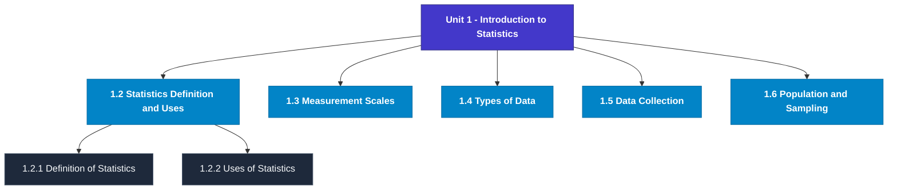

# MCS-066: Mathematical Foundations - II
## Unit 1: Introduction to Statistics

> 📚 **Programme:** M.Sc. (Data Science and Analytics) | **Semester:** Semester 2  
> ⏱️ **Estimated Study Time:** ~51 mins | 📄 **Textbook Pages:** 24 Pages  
> 📥 **Original PDF:** [Download & View Textbook](../../../pdfs/Semester_2/MCS-066_Mathematical_Foundations_-_II/Unit-1_Introduction_to_Statistics.pdf)

---

### 🎯 Executive Concept & Data Science Relevance
In modern data systems, **Introduction to Statistics** forms a vital conceptual pillar. Descriptive statistics provide quantitative summaries of dataset properties. Measures of central tendency identify typical values, while measures of dispersion quantify data spread, uncertainty, and variability—critical for feature normalization and anomaly detection.

> [!NOTE]
> **Why this matters for your career:** Mastering introduction to statistics equips you with the foundational principles required to reason mathematically about high-dimensional datasets, evaluate algorithm performance, and avoid statistical pitfalls in production machine learning pipelines.

### 🗺️ Visual Knowledge Architecture
The following concept map illustrates the structural hierarchy and learning trajectory of this module:

### 📖 Core Definitions & Terminology Cards
| Term | Formal Mathematical / Technical Definition | Intuitive Analogy / Concrete Example |
| :--- | :--- | :--- |
| **Arithmetic Mean $\bar{x}$ or $\mu$** | The sum of all observations divided by the total number of observations: $\bar{x} = \frac{1}{n}\sum_{i=1}^n x_i$. Sensitive to extreme outliers. | *The center of mass or balance point of the distribution.* |
| **Median** | The physical middle value separating the higher half from the lower half of an ordered dataset. Robust against outliers. | *The 50th percentile value where exactly half the data lies above and half below.* |
| **Standard Deviation $\sigma$ or $s$** | The square root of variance, measuring average dispersion in original units: $s = \sqrt{\frac{1}{n-1}\sum (x_i - \bar{x})^2}$. | *The typical distance data points deviate from the mean.* |
| **Coefficient of Variation ($CV$)** | Relative dispersion measure expressed as a percentage: $CV = \frac{\sigma}{\mu} \times 100\%$. Enables comparison across different measurement scales. | *Comparing stock volatility across assets priced at $10 vs $1,000.* |

### ⚡ Governing Mathematical Laws & Formula Cheatsheet
#### 🔹 Sample Variance Formula (Bessel's Correction)

$$
s^2 = \frac{1}{n - 1} \sum_{i=1}^n (x_i - \bar{x})^2 = \frac{\sum x_i^2 - \frac{(\sum x_i)^2}{n}}{n - 1}
$$

- **Explanation:** Using $n-1$ in the denominator corrects for downward sample bias, yielding an unbiased estimator of population variance $\sigma^2$.

#### 🔹 Interquartile Range (IQR) & Outlier Bounds

$$
\text{IQR} = Q_3 - Q_1, \quad \text{Outliers} < Q_1 - 1.5(\text{IQR}) \;\lor\; > Q_3 + 1.5(\text{IQR})
$$

- **Explanation:** Standard Tukey boxplot rule for identifying extreme data points robustly.

#### 🔹 Pearson's First Coefficient of Skewness

$$
Sk_1 = \frac{\text{Mean} - \text{Mode}}{\sigma} \quad \text{or} \quad Sk_2 = \frac{3(\text{Mean} - \text{Median})}{\sigma}
$$

- **Explanation:** Measures asymmetry: Positive skew means mean > median (right tail); negative skew means mean < median (left tail).

### 📌 Detailed Section-by-Section Study Breakdown
#### `1.2` Statistics: Definition and Uses
- **Core Concept:** Establishes rigorous theoretical formulations and computational bounds for statistics: definition and uses.
- **Core Concept:** Applies standard algorithmic procedures and mathematical invariants relevant to introduction to statistics.
- **Core Concept:** Ensures deterministic performance guarantees across high-dimensional feature spaces.
- **Data Science Application:** Provides foundational structures used directly in statistical modeling, query execution, and machine learning pipelines.

> [!TIP]
> **Exam & Interview Tip:** Be prepared to state the formal definition of statistics: definition and uses and derive its primary equations step-by-step.

#### `1.2.1` Definition of Statistics
- **Core Concept:** Statistics is a very old science, and it has developed through the ages.
- **Core Concept:** So, it is not surprising that through its long journey, its definitions given by different authors vary.
- **Core Concept:** Let us briefly define some of the applications of statistics.
- **Data Science Application:** Provides foundational structures used directly in statistical modeling, query execution, and machine learning pipelines.

> [!TIP]
> **Exam & Interview Tip:** Be prepared to state the formal definition of definition of statistics and derive its primary equations step-by-step.

#### `1.2.2` Uses of Statistics
- **Core Concept:** In present times, statistics is regarded as a science having sound techniques of handling huge data and providing valuable conclusions.
- **Core Concept:** Let us briefly define some of the applications of statistics.
- **Core Concept:** • Statistics and Industry: Statistics plays an important role in quality control and production engineering.
- **Data Science Application:** Provides foundational structures used directly in statistical modeling, query execution, and machine learning pipelines.

> [!TIP]
> **Exam & Interview Tip:** Be prepared to state the formal definition of uses of statistics and derive its primary equations step-by-step.

#### `1.2.3` Limitations of Statistics
- **Core Concept:** In the previous sub-section of this unit, you have seen a wide range of applications of statistics.
- **Core Concept:** Statistics also have its own limitations; some of them are described as follows: (1) Indirect Approach Towards Qualitative Characteristic: Science of statistics basically deals with numerical data.
- **Core Concept:** Therefore, statistical tools are applicable only for quantitative measures.
- **Data Science Application:** Provides foundational structures used directly in statistical modeling, query execution, and machine learning pipelines.

> [!TIP]
> **Exam & Interview Tip:** Be prepared to state the formal definition of limitations of statistics and derive its primary equations step-by-step.

#### `1.3` Measurement Scales
- **Core Concept:** Two words, “counting” and “measurement”, are very frequently used by everybody.
- **Core Concept:** Also, if you want to know the height of a man, you can easily measure it.
- **Core Concept:** But, in Statistics, act of counting and measurement is divided into four levels of measurement scales known as 1.
- **Data Science Application:** Provides foundational structures used directly in statistical modeling, query execution, and machine learning pipelines.

> [!TIP]
> **Exam & Interview Tip:** Be prepared to state the formal definition of measurement scales and derive its primary equations step-by-step.

#### `1.4` Types of Data
- **Core Concept:** Data plays the role of raw material for any statistical investigation.
- **Core Concept:** In fact, data are said to be quantitative data if a numerical quantity (which exactly measures the characteristic under study) is associated with each observation.
- **Core Concept:** Generally, interval or ratio scales are used as a measurement scale in case of quantitative data.
- **Data Science Application:** Provides foundational structures used directly in statistical modeling, query execution, and machine learning pipelines.

> [!TIP]
> **Exam & Interview Tip:** Be prepared to state the formal definition of types of data and derive its primary equations step-by-step.

### 💡 Interactive Self-Assessment Checkpoints
Test your comprehension before proceeding. Tap each question to reveal the comprehensive explanation:

<b>Checkpoint 1:</b> Why is sample variance divided by $n-1$ instead of $n$? <i>(Tap to reveal answer)</i>

> **Answer & Analysis:**  
> Dividing by $n-1$ applies **Bessel's correction**, which removes downward bias caused by using the sample mean $\bar{x}$ instead of the true population mean $\mu$.

<b>Checkpoint 2:</b> Which measure of central tendency is most robust to extreme outliers? <i>(Tap to reveal answer)</i>

> **Answer & Analysis:**  
> The **Median**, because it depends on positional rank rather than magnitude summation.

<b>Checkpoint 3:</b> In a right-skewed (positively skewed) distribution, what is the order of Mean, Median, and Mode? <i>(Tap to reveal answer)</i>

> **Answer & Analysis:**  
> $\text{Mode} < \text{Median} < \text{Mean}$.

<b>Checkpoint 4:</b> Is machine learning or deep learning an application of statistics? <i>(Tap to reveal answer)</i>

> **Answer & Analysis:**  
> This question tests your conceptual mastery of Introduction to Statistics. Review the governing formulas and section breakdowns above to formulate a complete, rigorous proof or derivation.

<b>Checkpoint 5:</b> At a picnic spot in India, 1000 tourists visit over a period of 7 days. Each tourist is asked the name of the country in which he/she was born. <i>(Tap to reveal answer)</i>

> **Answer & Analysis:**  
> This question tests your conceptual mastery of Introduction to Statistics. Review the governing formulas and section breakdowns above to formulate a complete, rigorous proof or derivation.

<b>Checkpoint 6:</b> Answer the following questions: (i) Which scale is at the lowest level? <i>(Tap to reveal answer)</i>

> **Answer & Analysis:**  
> This question tests your conceptual mastery of Introduction to Statistics. Review the governing formulas and section breakdowns above to formulate a complete, rigorous proof or derivation.

### 🎯 Executive Module Wrap-Up
- **Central Idea:** Introduction to Statistics provides essential mathematical and algorithmic tools directly utilized in Data Science.
- **Mathematical Rigor:** Formulas and laws must be memorized with attention to boundary conditions and assumptions.
- **Full Textbook Coverage:** For exhaustive multi-page derivations, proofs, and supplementary exercises, consult the [Authentic IGNOU Textbook](../../../pdfs/Semester_2/MCS-066_Mathematical_Foundations_-_II/Unit-1_Introduction_to_Statistics.pdf).

---
### 🧭 Navigation & Syllabus Index
[📑 Course Index](README.md) | [Next: Unit 2 ➡](unit_02_Describing_Data_Sets_and_Measures_of_Central_Tende.md)
