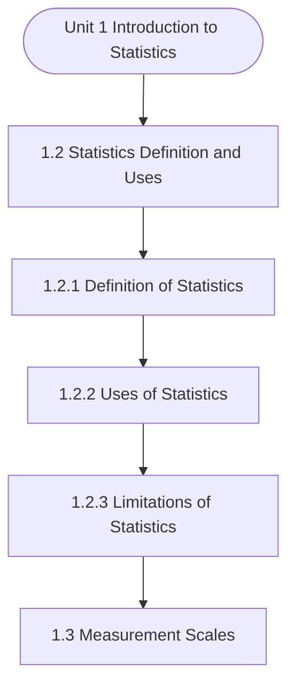

# MCS-066: Mathematical Foundations - II
## Unit 1: Introduction to Statistics

> 📚 **Programme:** M.Sc. (Data Science and Analytics) | **Semester:** Semester 2  
> ⏱️ **Estimated Study Time:** ~51 mins | 📄 **Textbook Pages:** 24 Pages  
> 📥 **Original PDF:** [Download & View Authentic Textbook](../../../pdfs/Semester_2/MCS-066_Mathematical_Foundations_-_II/Unit-1_Introduction_to_Statistics.pdf)

---

### 🎯 Executive Concept & Data Science Relevance
In modern data systems, **Introduction to Statistics** forms a vital conceptual pillar. Descriptive statistics provide quantitative summaries of dataset properties. Measures of central tendency identify typical values, while measures of dispersion quantify data spread, uncertainty, and variability—critical for feature normalization and anomaly detection.

> [!NOTE]
> **Why this matters for your career:** Mastering introduction to statistics equips you with the foundational principles required to reason mathematically about high-dimensional datasets, evaluate algorithm performance, and avoid statistical pitfalls in production machine learning pipelines.

### 🗺️ Visual Knowledge Architecture
The following concept map illustrates the structural hierarchy and learning trajectory of this module:



### 📖 Core Definitions & Terminology Cards

> 📌 **Arithmetic Mean $\bar{x}$ or $\mu$**  
> - **Formal Definition:** The sum of all observations divided by the total number of observations: $\bar{x} = \frac{1}{n}\sum_{i=1}^n x_i$. Sensitive to extreme outliers.  
> - 💡 **Practical Intuition & Analogy:** *The center of mass or balance point of the distribution.*

> 📌 **Median**  
> - **Formal Definition:** The physical middle value separating the higher half from the lower half of an ordered dataset. Robust against outliers.  
> - 💡 **Practical Intuition & Analogy:** *The 50th percentile value where exactly half the data lies above and half below.*

> 📌 **Standard Deviation $\sigma$ or $s$**  
> - **Formal Definition:** The square root of variance, measuring average dispersion in original units: $s = \sqrt{\frac{1}{n-1}\sum (x_i - \bar{x})^2}$.  
> - 💡 **Practical Intuition & Analogy:** *The typical distance data points deviate from the mean.*

> 📌 **Coefficient of Variation ($CV$)**  
> - **Formal Definition:** Relative dispersion measure expressed as a percentage: $CV = \frac{\sigma}{\mu} \times 100\%$. Enables comparison across different measurement scales.  
> - 💡 **Practical Intuition & Analogy:** *Comparing stock volatility across assets priced at 10 USD vs 1,000 USD.*

### ⚡ Governing Mathematical Laws & Formula Cheatsheet
#### 🔹 Sample Variance Formula (Bessel's Correction)
$$
\begin{aligned} s^2 & = \frac{1}{n - 1} \sum_{i=1}^n (x_i - \bar{x})^2 \\ & = \frac{\sum x_i^2 - \frac{(\sum x_i)^2}{n}}{n - 1} \end{aligned}
$$
- **Explanation:** Using $n-1$ in the denominator corrects for downward sample bias, yielding an unbiased estimator of population variance $\sigma^2$.

#### 🔹 Interquartile Range (IQR) & Outlier Bounds
$$
\text{IQR} = Q_3 - Q_1, \quad \text{Outliers} < Q_1 - 1.5(\text{IQR}) \;\lor\; > Q_3 + 1.5(\text{IQR})
$$
- **Explanation:** Standard Tukey boxplot rule for identifying extreme data points robustly.

#### 🔹 Pearson's First Coefficient of Skewness
$$
Sk_1 = \frac{\text{Mean} - \text{Mode}}{\sigma} \quad \text{or} \quad Sk_2 = \frac{3(\text{Mean} - \text{Median})}{\sigma}
$$
- **Explanation:** Measures asymmetry: Positive skew means mean > median (right tail); negative skew means mean < median (left tail).

### ⚖️ Axiomatic Properties & Governing Laws
The mathematical formulations of this module are anchored by foundational algebraic and structural laws:

- **Variance Scaling Rule:** $\text{Var}(aX + b) = a^2 \text{Var}(X)$
- **Standard Deviation Scaling:** $\sigma(aX + b) = \vert a\vert \sigma(X)$
- **Empirical Rule (Normal Distribution):** 68% within $\mu \pm 1\sigma$, 95% within $\mu \pm 2\sigma$, 99.7% within $\mu \pm 3\sigma$

### 📌 Comprehensive Section-by-Section Study Breakdown
#### `1.2` Statistics: Definition and Uses
##### 📘 Theoretical Principles & In-Depth Exposition
Statistics is a very old science, and it has developed through the ages. So, it is not surprising that through its long journey, its definitions given by different authors vary. We will present the most recent and broader definitions of Statistics: “Statistics is a branch of science which deals with the collection, classification, tabulation, analysis and interpretation of data.”

##### ⚙️ Mathematical & Algorithmic Mechanics
- **Formal Mechanics:** Establishes symbolic transformations and state invariants governing statistics: definition and uses.
- **Boundary Invariants:** Ensures robust error-handling, non-empty set guarantees, and strict asymptotic bounds.

##### 📊 Practical Data Science & Production Relevance
- **Industry Application:** Directly implemented in production workflows such as SQL query filters, pandas vectorized operations, and feature transformation pipelines.
- **Production Pitfall:** Failing to verify membership bounds or missing edge cases in statistics: definition and uses can cause silent data corruption or performance bottlenecks.

> [!TIP]
> **Key Exam & Technical Interview Takeaway:** Be prepared to define statistics: definition and uses formally, cite its core mathematical invariants, and solve step-by-step numerical/proof questions.

#### `1.2.1` Definition of Statistics
##### 📘 Theoretical Principles & In-Depth Exposition
Statistics is a very old science, and it has developed through the ages. So, it is not surprising that through its long journey, its definitions given by different authors vary. We will present the most recent and broader definitions of Statistics: “Statistics is a branch of science which deals with the collection, classification, tabulation, analysis and interpretation of data.”

##### ⚙️ Mathematical & Algorithmic Mechanics
- **Formal Mechanics:** Establishes symbolic transformations and state invariants governing definition of statistics.
- **Boundary Invariants:** Ensures robust error-handling, non-empty set guarantees, and strict asymptotic bounds.

##### 📊 Practical Data Science & Production Relevance
- **Industry Application:** Directly implemented in production workflows such as SQL query filters, pandas vectorized operations, and feature transformation pipelines.
- **Production Pitfall:** Failing to verify membership bounds or missing edge cases in definition of statistics can cause silent data corruption or performance bottlenecks.

> [!TIP]
> **Key Exam & Technical Interview Takeaway:** Be prepared to define definition of statistics formally, cite its core mathematical invariants, and solve step-by-step numerical/proof questions.

#### `1.2.2` Uses of Statistics
##### 📘 Theoretical Principles & In-Depth Exposition
In present times, statistics is regarded as a science having sound techniques of handling huge data and providing valuable conclusions. Today, statistical methods find their application in almost every sphere of human activity, such as economics, commerce, management, information technology, education, planning, banking, insurance sector, medical science, biology, industrial, agriculture, market research, etc.

Let us briefly define some of the applications of statistics. • Statistics and Industry: Statistics plays an important role in quality control and production engineering. For example, various control charts are used to maintain a certain quality level and different inspection plans are used in production engineering.

You may find the average life of some products, such as an electric bulb, using Statistical methods. • Biology and Statistics: Professor Karl Pearson has stated that the whole doctrine of heredity rests on statistical basis. This is generally said that the height of the child is associated with the height of the father.

##### ⚙️ Mathematical & Algorithmic Mechanics
- **Formal Mechanics:** Establishes symbolic transformations and state invariants governing uses of statistics.
- **Boundary Invariants:** Ensures robust error-handling, non-empty set guarantees, and strict asymptotic bounds.

##### 📊 Practical Data Science & Production Relevance
- **Industry Application:** Directly implemented in production workflows such as SQL query filters, pandas vectorized operations, and feature transformation pipelines.
- **Production Pitfall:** Failing to verify membership bounds or missing edge cases in uses of statistics can cause silent data corruption or performance bottlenecks.

> [!TIP]
> **Key Exam & Technical Interview Takeaway:** Be prepared to define uses of statistics formally, cite its core mathematical invariants, and solve step-by-step numerical/proof questions.

#### `1.2.3` Limitations of Statistics
##### 📘 Theoretical Principles & In-Depth Exposition
In the previous sub-section of this unit, you have seen a wide range of applications of statistics. Statistics also have its own limitations; some of them are described as follows: (1) Indirect Approach Towards Qualitative Characteristic: Science of statistics basically deals with numerical data.

Therefore, statistical tools are applicable only for quantitative measures. But many times, characteristic under study is qualitative in nature, such as honesty, beauty, intelligence, boldness, drinking, smoking, etc. So, any statistical tool cannot be directly applied on these types of characteristics.

However, study of these types of characteristics can be made possible by first converting the characteristic under study into numerical figures based on some uniform criteria. For example, intelligence can be converted into numerical figures with the help of the marks obtained by the individuals in a common test.

##### ⚙️ Mathematical & Algorithmic Mechanics
- **Formal Mechanics:** Establishes symbolic transformations and state invariants governing limitations of statistics.
- **Boundary Invariants:** Ensures robust error-handling, non-empty set guarantees, and strict asymptotic bounds.

##### 📊 Practical Data Science & Production Relevance
- **Industry Application:** Directly implemented in production workflows such as SQL query filters, pandas vectorized operations, and feature transformation pipelines.
- **Production Pitfall:** Failing to verify membership bounds or missing edge cases in limitations of statistics can cause silent data corruption or performance bottlenecks.

> [!TIP]
> **Key Exam & Technical Interview Takeaway:** Be prepared to define limitations of statistics formally, cite its core mathematical invariants, and solve step-by-step numerical/proof questions.

#### `1.3` Measurement Scales
##### 📘 Theoretical Principles & In-Depth Exposition
Two words, “counting” and “measurement”, are very frequently used by everybody. For example, if you want to know the number of pages in a notebook, you can easily count them. Also, if you want to know the height of a man, you can easily measure it. But, in Statistics, act of counting and measurement is divided into four levels of measurement scales known as 1.

Ratio Scale Let us discuss these scales of measurement one by one: Nominal Scale The word nominal has come from this Latin word, i.e. In Latin, ‘Nomen’ means name. Therefore, under nominal scale, we divide the objects under study into two or more categories by giving them unique names.

The classification of objects into at least two or more categories is done in such a way that (a) Each object takes place only in one category, i.e. each object falls in a unique category, i.e. it either belongs to a category or not. Mathematically, we may use the symbol (“=”, “ ”) if an object falls in a category or not.

##### ⚙️ Mathematical & Algorithmic Mechanics
- **Formal Mechanics:** Establishes symbolic transformations and state invariants governing measurement scales.
- **Boundary Invariants:** Ensures robust error-handling, non-empty set guarantees, and strict asymptotic bounds.

##### 📊 Practical Data Science & Production Relevance
- **Industry Application:** Directly implemented in production workflows such as SQL query filters, pandas vectorized operations, and feature transformation pipelines.
- **Production Pitfall:** Failing to verify membership bounds or missing edge cases in measurement scales can cause silent data corruption or performance bottlenecks.

> [!TIP]
> **Key Exam & Technical Interview Takeaway:** Be prepared to define measurement scales formally, cite its core mathematical invariants, and solve step-by-step numerical/proof questions.

#### `1.4` Types of Data
##### 📘 Theoretical Principles & In-Depth Exposition
Data plays the role of raw material for any statistical investigation. Data can be defined in a single sentence as: “The values of different objects collected in a survey or recorded values of an experiment over a time period taken together constitute what we call data in Statistics” Each value in the data is known as an observation.

Statistical data based on the characteristic, nature of the characteristic, level of measurement, time, and ways of obtaining it may be classified as follows: Introduction to Statistics Quantitative data basedon thecharacteristic Qualitative data Discrete data basedon natureof thecharacteristic Continuous data Nominal data Ordinal data basedon level Intervaldata Ratiodata •   •  •   •  •   •  •   •  of measurement TimeSeries data basedon timecomponent CrossSectional data Primary data basedon the waysof obtaining thedata Secondary data •   •  •   •  Quantitative data basedon thecharacteristic Qualitative data Discrete data basedon natureof thecharacteristic Continuous data Nominal data Ordinal data basedon level Intervaldata Ratiodata •   •  •   •  •   •  •   •  of measurement TimeSeries data basedon timecomponent CrossSectional data Primary data basedon the waysof obtaining thedata Secondary data •   •  •   •  Let us discuss different types of data one by one: Quantitative Data As the name quantitative itself suggests that it is related to quantity.

In fact, data are said to be quantitative data if a numerical quantity (which exactly measures the characteristic under study) is associated with each observation. Generally, interval or ratio scales are used as a measurement scale in case of quantitative data. Data based on the following characteristics generally gives quantitative type of data, such as weight, height, age, length, area, volume, money, temperature, humidity, size, etc.

##### ⚙️ Mathematical & Algorithmic Mechanics
- **Formal Mechanics:** Establishes symbolic transformations and state invariants governing types of data.
- **Boundary Invariants:** Ensures robust error-handling, non-empty set guarantees, and strict asymptotic bounds.

##### 📊 Practical Data Science & Production Relevance
- **Industry Application:** Directly implemented in production workflows such as SQL query filters, pandas vectorized operations, and feature transformation pipelines.
- **Production Pitfall:** Failing to verify membership bounds or missing edge cases in types of data can cause silent data corruption or performance bottlenecks.

> [!TIP]
> **Key Exam & Technical Interview Takeaway:** Be prepared to define types of data formally, cite its core mathematical invariants, and solve step-by-step numerical/proof questions.

#### `1.5` Data Collection
##### 📘 Theoretical Principles & In-Depth Exposition
The data collection is performed to create primary data. There are a number of methods of collection of primary data depending upon many factors such as geographical area of the field, money available, time period, accuracy needed, literacy of the respondents/informants, etc. Here we will discuss briefly only the following commonly used methods.

(1) Direct Personal Investigation Method (2) Telephone Method (3) Indirect Oral Interviews Method (4) Local Correspondents Method (5) Mailed Questionnaire Method Let us discuss these methods briefly. Introduction to Statistics (1) Direct Personal Investigation Method In this method, the investigator personally contacts the informants and collects the related data through face to face interviews of the informants.

Due to face to face meeting of investigator and informants data collected under this method has maximum degree of accuracy. But the degree of accuracy depends upon the sincerity, honesty, unbiasedness and expertness of the investigator, because it is the investigator who ultimately gives the final shape to the information provided by the informants.

##### ⚙️ Mathematical & Algorithmic Mechanics
- **Formal Mechanics:** Establishes symbolic transformations and state invariants governing data collection.
- **Boundary Invariants:** Ensures robust error-handling, non-empty set guarantees, and strict asymptotic bounds.

##### 📊 Practical Data Science & Production Relevance
- **Industry Application:** Directly implemented in production workflows such as SQL query filters, pandas vectorized operations, and feature transformation pipelines.
- **Production Pitfall:** Failing to verify membership bounds or missing edge cases in data collection can cause silent data corruption or performance bottlenecks.

> [!TIP]
> **Key Exam & Technical Interview Takeaway:** Be prepared to define data collection formally, cite its core mathematical invariants, and solve step-by-step numerical/proof questions.

#### `1.6` Population and Sampling
##### 📘 Theoretical Principles & In-Depth Exposition
One of the important considerations while collecting primary data is identifying the population and collecting a representative sample from this population. In this section, we briefly discuss population and sampling. Population: Population literally means a well-defined group (collection or bunch) of some objects (units or elements).

Examples of populations and its units are: a city with some clear-cut territory having its dwellers as units (elements) or having houses as its units; a hospital with indoor patients as units or its doctors as units; a library with its employees as units or books as its units; a school with enrolled students as units; and so on.

Thus, population is the collection or group of individuals /items /units/ observations under study. The total number of elements/items/units/observations in a population is known as its size and generally denoted by N. Sample: A finite subset of units of a population is called a “sample” and the number of units belonging to the sample is called the sample size.

##### ⚙️ Mathematical & Algorithmic Mechanics
- **Formal Mechanics:** Establishes symbolic transformations and state invariants governing population and sampling.
- **Boundary Invariants:** Ensures robust error-handling, non-empty set guarantees, and strict asymptotic bounds.

##### 📊 Practical Data Science & Production Relevance
- **Industry Application:** Directly implemented in production workflows such as SQL query filters, pandas vectorized operations, and feature transformation pipelines.
- **Production Pitfall:** Failing to verify membership bounds or missing edge cases in population and sampling can cause silent data corruption or performance bottlenecks.

> [!TIP]
> **Key Exam & Technical Interview Takeaway:** Be prepared to define population and sampling formally, cite its core mathematical invariants, and solve step-by-step numerical/proof questions.

### 📐 Step-by-Step Solved Mathematical Examples
To solidify your theoretical understanding, work through these fully solved, step-by-step mathematical problems:

#### 🧮 Example 1: Sample Variance and Standard Deviation Computation
> **Problem Statement:**  
> Given sample observations: $X = \lbrace 4, 8, 6, 5, 7 \rbrace$. Compute sample mean $\bar{x}$, sample variance $s^2$, and standard deviation $s$ step-by-step.

**Detailed Step-by-Step Solution:**

1. **Mean:** $\bar{x} = \frac{4 + 8 + 6 + 5 + 7}{5} = \frac{30}{5} = 6$.

2. **Squared deviations:**
- $(4 - 6)^2 = (-2)^2 = 4$
- $(8 - 6)^2 = 2^2 = 4$
- $(6 - 6)^2 = 0^2 = 0$
- $(5 - 6)^2 = (-1)^2 = 1$
- $(7 - 6)^2 = 1^2 = 1$
Sum of squared deviations $= 4 + 4 + 0 + 1 + 1 = 10$.

3. **Sample Variance with Bessel's Correction ($n-1 = 4$):**
$$
s^2 = \frac{10}{5 - 1} = \frac{10}{4} = 2.5
$$

4. **Standard Deviation:** $s = \sqrt{2.5} \approx 1.581$.

#### 🧮 Example 2: Tukey's IQR Outlier Detection Rule
> **Problem Statement:**  
> A customer spend dataset has $Q_1 = 30$ and $Q_3 = 70$. Determine whether transactions of $135$ and $25$ are classified as outliers.

**Detailed Step-by-Step Solution:**

1. **IQR:** $\text{IQR} = Q_3 - Q_1 = 70 - 30 = 40$.
2. **Lower Bound:** $Q_1 - 1.5(\text{IQR}) = 30 - 1.5(40) = 30 - 60 = -30$.
3. **Upper Bound:** $Q_3 + 1.5(\text{IQR}) = 70 + 1.5(40) = 70 + 60 = 130$.

Conclusion:
- Spend of 135 exceeds Upper Bound ($135 > 130$): **Classified as Outlier**.
- Spend of 25 is within $[-30, 130]$: **Normal observation**.

### 💻 Practical Data Science Implementation (Python)
Theory translates directly into production algorithms. Below is a self-contained, commented Python implementation illustrating the core operations of this unit:

```python
import numpy as np
import pandas as pd

# Statistical profiling on production dataset
data = np.array([12, 15, 18, 22, 25, 29, 34, 45, 95])

mean_val = np.mean(data)
median_val = np.median(data)
std_val = np.std(data, ddof=1) # Bessel's correction

q1, q3 = np.percentile(data, [25, 75])
iqr = q3 - q1
outlier_upper = q3 + 1.5 * iqr

outliers = data[data > outlier_upper]

print(f"Mean: {mean_val:.2f} | Median: {median_val:.2f} | Std: {std_val:.2f}")
print(f"IQR: {iqr:.2f} | Upper Bound: {outlier_upper:.2f}")
print(f"Detected Outliers: {outliers}")
```

### 💡 Interactive Self-Assessment Checkpoints
Test your comprehension before proceeding. Tap each question to reveal the comprehensive explanation:

<details>
<summary><b>Checkpoint 1:</b> Why is sample variance divided by $n-1$ instead of $n$? <i>(Tap to reveal answer)</i></summary>

> **Answer & Analysis:**  
> Dividing by $n-1$ applies **Bessel's correction**, which removes downward bias caused by using the sample mean $\bar{x}$ instead of the true population mean $\mu$.
</details>

<details>
<summary><b>Checkpoint 2:</b> Which measure of central tendency is most robust to extreme outliers? <i>(Tap to reveal answer)</i></summary>

> **Answer & Analysis:**  
> The **Median**, because it depends on positional rank rather than magnitude summation.
</details>

<details>
<summary><b>Checkpoint 3:</b> In a right-skewed (positively skewed) distribution, what is the order of Mean, Median, and Mode? <i>(Tap to reveal answer)</i></summary>

> **Answer & Analysis:**  
> $\text{Mode} < \text{Median} < \text{Mean}$.
</details>

<details>
<summary><b>Checkpoint 4:</b> Is machine learning or deep learning an application of statistics? <i>(Tap to reveal answer)</i></summary>

> **Answer & Analysis:**  
> This question tests your conceptual mastery of Introduction to Statistics. Review the governing formulas and section breakdowns above to formulate a complete, rigorous proof or derivation.
</details>

<details>
<summary><b>Checkpoint 5:</b> At a picnic spot in India, 1000 tourists visit over a period of 7 days. Each tourist is asked the name of the country in which he/she was born. <i>(Tap to reveal answer)</i></summary>

> **Answer & Analysis:**  
> This question tests your conceptual mastery of Introduction to Statistics. Review the governing formulas and section breakdowns above to formulate a complete, rigorous proof or derivation.
</details>

<details>
<summary><b>Checkpoint 6:</b> Answer the following questions: (i) Which scale is at the lowest level? <i>(Tap to reveal answer)</i></summary>

> **Answer & Analysis:**  
> This question tests your conceptual mastery of Introduction to Statistics. Review the governing formulas and section breakdowns above to formulate a complete, rigorous proof or derivation.
</details>

### 🎯 Executive Module Wrap-Up
- **Central Idea:** Introduction to Statistics provides essential mathematical and algorithmic tools directly utilized in Data Science.
- **Mathematical Rigor:** Formulas and laws must be memorized with attention to boundary conditions and assumptions.
- **Full Textbook Coverage:** For exhaustive multi-page derivations, proofs, and supplementary exercises, consult the [Authentic IGNOU Textbook](../../../pdfs/Semester_2/MCS-066_Mathematical_Foundations_-_II/Unit-1_Introduction_to_Statistics.pdf).

---
### 🧭 Navigation & Syllabus Index
[📑 Course Index](README.md) | [Next: Unit 2 ➡](unit_02_Describing_Data_Sets_and_Measures_of_Central_Tende.md)
