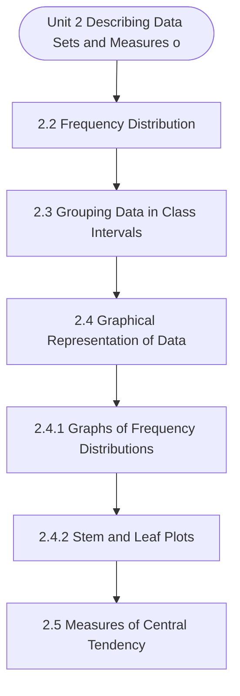

# MCS-066: Mathematical Foundations - II
## Unit 2: Describing Data Sets and Measures of Central Tendencies

> 📚 **Programme:** M.Sc. (Data Science and Analytics) | **Semester:** Semester 2  
> ⏱️ **Estimated Study Time:** ~78 mins | 📄 **Textbook Pages:** 42 Pages  
> 📥 **Original PDF:** [Download & View Authentic Textbook](../../../pdfs/Semester_2/MCS-066_Mathematical_Foundations_-_II/Unit-2_Describing_Data_Sets_and_Measures_of_Central_Tendencies.pdf)

---

### 🎯 Executive Concept & Data Science Relevance
In modern data systems and advanced analytics, **Describing Data Sets and Measures of Central Tendencies** forms a vital conceptual pillar. Set theory is the fundamental bedrock of discrete mathematics, computer science, and data engineering. Relational database operations (SQL JOIN, UNION, INTERSECT), feature spaces, probability sample spaces, and categorical groupings are direct applications of set theory.

> [!NOTE]
> **Why this matters for your career:** Mastering describing data sets and measures of central tendencies equips you with the foundational principles required to reason mathematically about high-dimensional datasets, evaluate algorithm performance, and avoid statistical pitfalls in production machine learning pipelines.

### 🗺️ Visual Knowledge Architecture
The following concept map illustrates the structural hierarchy and learning trajectory of this module:



### 📖 Core Definitions & Terminology Cards

> 📌 **Set**  
> - **Formal Definition:** A well-defined collection of distinct objects, denoted typically by uppercase letters $A, B, X$. Distinctness implies no duplicate elements, and well-defined means for any entity $x$, either $x \in A$ or $x \notin A$ is deterministically decidable.  
> - 💡 **Practical Intuition & Analogy:** *Think of a Python `set({1, 2, 3})` where duplicate elements are collapsed and lookup is based on unique membership.*

> 📌 **Cardinality $\vert A \vert$ or $n(A)$**  
> - **Formal Definition:** The total count of distinct elements in a finite set $A$. If $\vert A \vert = n$, the set contains exactly $n$ distinct members. For infinite sets, cardinality characterizes transfinite sizes (e.g. countable $\aleph_0$ vs uncountable $c$).  
> - 💡 **Practical Intuition & Analogy:** *The output of `len(my_set)` in programming.*

> 📌 **Power Set $\mathcal{P}(A)$**  
> - **Formal Definition:** The set of all possible subsets of $A$, including the empty set $\emptyset$ and $A$ itself: $\mathcal{P}(A) = \lbrace S \mid S \subseteq A \rbrace$. If $\vert A \vert = n$, then $\vert \mathcal{P}(A) \vert = 2^n$.  
> - 💡 **Practical Intuition & Analogy:** *In feature selection, evaluating all possible combinations of $n$ features requires searching through the power set of features ( $2^n$ candidate models ).*

> 📌 **Subset & Proper Subset**  
> - **Formal Definition:** A set $A$ is a subset of $B$ ( $A \subseteq B$ ) if $\forall x \in A \implies x \in B$. It is a proper subset ( $A \subset B$ ) if $A \subseteq B$ and $A \neq B$ (i.e. $\exists y \in B$ such that $y \notin A$).  
> - 💡 **Practical Intuition & Analogy:** *All Data Scientists are Analysts ( $A \subseteq B$ ), but not all Analysts are Data Scientists ( $A \subset B$ ).*

> 📌 **Universal Set $U$**  
> - **Formal Definition:** A designated superset containing all objects and entities under active consideration in a given problem or domain. Every set $X$ in that context satisfies $X \subseteq U$.  
> - 💡 **Practical Intuition & Analogy:** *The entire master database table or global population before applying any filter conditions.*

> 📌 **Complement $A^c$ or $A'$**  
> - **Formal Definition:** The set of all elements in the universal set $U$ that do not belong to $A$: $A^c = \lbrace x \in U \mid x \notin A \rbrace = U \setminus A$.  
> - 💡 **Practical Intuition & Analogy:** *The NOT condition in filtering: selecting all records that do NOT match a criteria.*

### ⚡ Governing Mathematical Laws & Formula Cheatsheet
#### 🔹 Power Set Cardinality Theorem
$$
\vert\mathcal{P}(A)\vert = 2^n \quad \text{where } n = \vert A\vert
$$
- **Explanation:** Proved by induction or combinatorics: each of the $n$ elements has exactly 2 binary choices (to be included or excluded from a subset).

#### 🔹 Principle of Inclusion-Exclusion (2 Sets)
$$
\vert A \cup B\vert = \vert A\vert + \vert B\vert - \vert A \cap B\vert
$$
- **Explanation:** Prevents double-counting the elements present in the intersection when calculating the total union size.

#### 🔹 Principle of Inclusion-Exclusion (3 Sets)
$$
\begin{aligned} \vert A \cup B \cup C\vert = & \;\vert A\vert + \vert B\vert + \vert C\vert \\ & - (\vert A \cap B\vert + \vert B \cap C\vert + \vert A \cap C\vert) \\ & + \vert A \cap B \cap C\vert \end{aligned}
$$
- **Explanation:** Alternates adding singletons, subtracting pairwise overlaps, and re-adding the three-way intersection.

#### 🔹 De Morgan's Laws for Sets
$$
(A \cup B)^c = A^c \cap B^c \quad \text{and} \quad (A \cap B)^c = A^c \cup B^c
$$
- **Explanation:** The complement of a union is the intersection of the complements, and vice versa. Fundamental to query optimization and boolean logic.

#### 🔹 Cartesian Product Cardinality
$$
\vert A \times B\vert = \vert A\vert \times \vert B\vert = \lbrace (a, b) \mid a \in A, b \in B \rbrace
$$
- **Explanation:** Basis of relational database CROSS JOIN, generating every ordered pair between two entities.

### ⚖️ Axiomatic Properties & Governing Laws
The mathematical formulations of this module are anchored by foundational algebraic and structural laws:

- **Idempotent Laws:** $A \cup A = A \quad \text{and} \quad A \cap A = A$
- **Identity Laws:** $A \cup \emptyset = A \quad \text{and} \quad A \cap U = A$
- **Domination Laws:** $A \cup U = U \quad \text{and} \quad A \cap \emptyset = \emptyset$
- **Commutative Laws:** $A \cup B = B \cup A \quad \text{and} \quad A \cap B = B \cap A$
- **Associative Laws:** $(A \cup B) \cup C = A \cup (B \cup C) \quad \text{and} \quad (A \cap B) \cap C = A \cap (B \cap C)$
- **Distributive Laws:** $A \cap (B \cup C) = (A \cap B) \cup (A \cap C) \quad \text{and} \quad A \cup (B \cap C) = (A \cup B) \cap (A \cup C)$
- **Complement Laws:** $A \cup A^c = U, \quad A \cap A^c = \emptyset, \quad (A^c)^c = A$

### 📌 Comprehensive Section-by-Section Study Breakdown
#### `2.2` Frequency Distribution

##### 📘 Theoretical Principles & Pedagogical Exposition
Similarly, the number of observations corresponding to the value of more than the lower class limit of a given class is called more than cumulative frequency and the corresponding cumulative frequency distribution is called ‘more than’ cumulative frequency distribution. Following is an example, wherein ‘less than’ and ‘more than’ cumulative frequency distributions have been obtained.

Example 2: For the following frequency distribution of marks of 50 students in a subject, form both types of cumulative frequency distributions. Solution: Cumulative frequency distributions are formed as given in the following table: Given Frequency Distribution Less Than Cumulative Frequency Distribution More Than Cumulative Frequency Distribution Classes No.

of Students Marks Less than No. of students Marks More than No of students 0-10 10-20 20-30 30-40 40-50 Total Class (Marks) 0-10 10-20 20-30 30-40 40-50 No.


##### ⚙️ Mathematical & Algorithmic Mechanics
- **Core Mechanism:** Probability distributions characterize probability mass (PMF) or density (PDF). The Central Limit Theorem (CLT) establishes that the sample mean of $n$ independent, identically distributed random variables converges to Gaussian $\mathcal{N}(\mu, \sigma^2/n)$ as $n \to \infty$.
- **Boundary Conditions:** Cauchy distributions violating CLT due to undefined variance, extreme skewness in small samples ($n < 30$), and fat-tailed catastrophic risk events.

##### 📊 Practical Data Science & Production Relevance
- **Production Workflow:** Standardizing features via Z-score normalization, anomaly detection using Gaussian Mixture Models, calculating $p$-values in hypothesis testing, and Monte Carlo simulation.
- **Real-World Pitfall:** Assuming Gaussian normality for heavy-tailed operational metrics (e.g. web server latency or stock returns), severely underestimating extreme tail probabilities.

> [!TIP]
> **Exam & Technical Interview Insight:** Compute probabilities by standardizing to the standard normal distribution $Z = \frac{X - \mu}{\sigma}$; recognize when to approximate Binomial with Poisson or Normal.

#### `2.3` Grouping Data in Class Intervals

##### 📘 Theoretical Principles & Pedagogical Exposition
To make data understandable, data are divided into number of homogeneous groups or subgroups. In classification, according to class intervals, the observations are arranged systematically into a number of groups called classes. Such classification is most popular in practice. But before this discussion we have to define some terms which will be used in the above classification.

(i) Class Limits: The class limits are the lowest and the highest values of a class. For example, let us take the class 10-20. The lowest value of this class is 10 and the highest 20. The two boundaries of a class are known as the lower limit and upper limit of the class. (ii) Class Intervals: The class interval of a class is the difference between the upper class limit and the lower class limit.

For example, in the class 10-20 the class interval is 10 (i.e. This is valid in the case of exclusive method discussed in this section later. If the inclusive frequency distribution (discussed later in this section) is given then first it is converted to exclusive form and then class interval is calculated.


##### ⚙️ Mathematical & Algorithmic Mechanics
- **Core Mechanism:** Applies statistical and probabilistic modeling for describing data sets and measures of central tendencies. Formulates parameter estimation, variance reduction, and data distribution validation.
- **Boundary Conditions:** Small sample size limitations, extreme skewness, and violating underlying distribution assumptions.

##### 📊 Practical Data Science & Production Relevance
- **Production Workflow:** Production metric experimentation, automated anomaly detection, and data validation pipelines.
- **Real-World Pitfall:** Confusing correlation with causation or overlooking selection bias in data collection samples.

> [!TIP]
> **Exam & Technical Interview Insight:** State the governing formulas for grouping data in class intervals, compute summary statistics, and interpret numerical findings accurately.

#### `2.4` Graphical Representation of Data

##### 📘 Theoretical Principles & Pedagogical Exposition
A graphical presentation is a geometric image of a set of data. Graphical presentation is done for both frequency distributions and time series. One of the important features of graphs is that if a person once sees the graphs, the figure representing the graphs is kept in his/her brain for a long time.

They also help us in studying cause and effect relationship between two variables. The graph of a frequency distribution presents the huge data in an interesting and effective manner and brings to light the salient features of the data at a glance. Let us see some advantages of graphical presentation.

Advantages of Graphical Presentation The following are some advantages of the graphical presentation: • It simplifies the complexity of data and makes it readily understandable. • It attracts attention of people. • It saves time and efforts to understand the facts. • It makes comparison easy.


##### ⚙️ Mathematical & Algorithmic Mechanics
- **Core Mechanism:** Graph $G = (V, E)$ represented via Adjacency Matrix $\mathcal{O}(V^2)$ or Adjacency List $\mathcal{O}(V + E)$. BFS discovers shortest paths on unweighted graphs; Dijkstra greedily extracts minimum-distance vertices using priority queues; DFS detects cycles and topological orderings.
- **Boundary Conditions:** Disconnected subgraphs, negative weight cycles (violating Dijkstra preconditions), self-loops, and dense graph edge explosions $|E| \approx |V|^2$.

##### 📊 Practical Data Science & Production Relevance
- **Production Workflow:** Social network connection graphs, Graph Neural Networks (GNNs), dependency DAG resolution in build compilers, and routing optimization in supply chain logistics.
- **Real-World Pitfall:** Invoking Dijkstra's algorithm on graphs with negative edge weights instead of Bellman-Ford, resulting in erroneous distance derivations.

> [!TIP]
> **Exam & Technical Interview Insight:** Trace Dijkstra's algorithm or Kruskal's/Prim's MST algorithm table step-by-step; show vertex distance updates and predecessor pointers at each iteration.

#### `2.4.1` Graphs of Frequency Distributions

##### 📘 Theoretical Principles & Pedagogical Exposition
The graphical presentation of frequency distributions is drawn for discrete as well as continuous frequency distributions. Let us first consider the frequency distribution of a discrete variable. Frequency Bar Diagram: To represent a discrete frequency distribution graphically, we take two rectangular axes of coordinates, the horizontal axis for the variable and the vertical axis for the frequency.

The different values of the variable are then located as points on the horizontal axis. At each of these points, a perpendicular bar is drawn to present the corresponding frequency. Such a diagram is called a ‘Frequency Bar Diagram’. For example, if we take the frequency distribution for the number of peas per pod for 198 pods as given in Table 2.3: Table 2.3: A Sample Frequency Distribution No of peas per pod Frequency (number of pods) Then, the frequency bar diagram is shown in Fig.

2.1: the Peas for 198 Pods. Note 1: O represents origin and choice of scale used along horizontal and vertical axes depends upon given data. Now, we take the case of frequency distribution of a continuous variable. The following are the most commonly used graphs for continuous frequency distributions: (i) Histogram (ii) Frequency Polygon (iii) Frequency Curve (iv) Cumulative Frequency Curve or Ogives Let us discuss these one by one: (i) Histogram In previous example, we have discussed how a graph is drawn for discrete frequency distribution.


##### ⚙️ Mathematical & Algorithmic Mechanics
- **Core Mechanism:** Graph $G = (V, E)$ represented via Adjacency Matrix $\mathcal{O}(V^2)$ or Adjacency List $\mathcal{O}(V + E)$. BFS discovers shortest paths on unweighted graphs; Dijkstra greedily extracts minimum-distance vertices using priority queues; DFS detects cycles and topological orderings.
- **Boundary Conditions:** Disconnected subgraphs, negative weight cycles (violating Dijkstra preconditions), self-loops, and dense graph edge explosions $|E| \approx |V|^2$.

##### 📊 Practical Data Science & Production Relevance
- **Production Workflow:** Social network connection graphs, Graph Neural Networks (GNNs), dependency DAG resolution in build compilers, and routing optimization in supply chain logistics.
- **Real-World Pitfall:** Invoking Dijkstra's algorithm on graphs with negative edge weights instead of Bellman-Ford, resulting in erroneous distance derivations.

> [!TIP]
> **Exam & Technical Interview Insight:** Trace Dijkstra's algorithm or Kruskal's/Prim's MST algorithm table step-by-step; show vertex distance updates and predecessor pointers at each iteration.

#### `2.4.2` Stem and Leaf Plots

##### 📘 Theoretical Principles & Pedagogical Exposition
A stem-and-leaf display is very similar to a histogram but shows more information. The stem-and-leaf display summarises the shape of a set of data and provides the details regarding individual values. A stem-and-leaf display quickly summarises data while maintaining the individual data points.

Now a day’s use of stem-and-leaf displays is increasing, so let us formally define it in the next paragraph with some examples. It has a vertical line of numbers obtained after removing the last digits (i.e. unit digits) from the given numbers called starting parts and for each starting part there is a horizontal line of numbers, i.e.

the digits at the unit places of the given numbers called leaves. And each complete horizontal line including starting part and leaves is known as stem. The data displayed like this is nothing but known as stem-and-leaf display. The distance between the lowest values that are recorded in two consecutive stems is known as stem width or category interval, which plays very important role in stem-and-leaf displays.


##### ⚙️ Mathematical & Algorithmic Mechanics
- **Core Mechanism:** Applies statistical and probabilistic modeling for describing data sets and measures of central tendencies. Formulates parameter estimation, variance reduction, and data distribution validation.
- **Boundary Conditions:** Small sample size limitations, extreme skewness, and violating underlying distribution assumptions.

##### 📊 Practical Data Science & Production Relevance
- **Production Workflow:** Production metric experimentation, automated anomaly detection, and data validation pipelines.
- **Real-World Pitfall:** Confusing correlation with causation or overlooking selection bias in data collection samples.

> [!TIP]
> **Exam & Technical Interview Insight:** State the governing formulas for stem and leaf plots, compute summary statistics, and interpret numerical findings accurately.

#### `2.5` Measures of Central Tendency

##### 📘 Theoretical Principles & Pedagogical Exposition
According to Professor Bowley, averages are “statistical constants which enable us to comprehend in a single effort the significance of the whole”. They throw light as to how the values are concentrated in the central part of the distribution. For this reason they are also called the measures of central tendency, an average is a single value which is considered as the most representative for a given set of data.

Measures of central tendency show the tendency of some central value around which data tend to cluster. Why use the Measure of Central Tendency? The following are two main reasons for studying an average: 1. To get a single representative: A Measure of central tendency enables us to get a single value from the mass of data and also provides an idea about the entire data.

For example, it is impossible to remember the height measurements of all students in a class. But if the average height is obtained, we get a single value that represents the entire class. To facilitate comparison: Measures of central tendency enable us to compare two or more populations by reducing the mass of data in a single figure.


##### ⚙️ Mathematical & Algorithmic Mechanics
- **Core Mechanism:** Applies statistical and probabilistic modeling for describing data sets and measures of central tendencies. Formulates parameter estimation, variance reduction, and data distribution validation.
- **Boundary Conditions:** Small sample size limitations, extreme skewness, and violating underlying distribution assumptions.

##### 📊 Practical Data Science & Production Relevance
- **Production Workflow:** Production metric experimentation, automated anomaly detection, and data validation pipelines.
- **Real-World Pitfall:** Confusing correlation with causation or overlooking selection bias in data collection samples.

> [!TIP]
> **Exam & Technical Interview Insight:** State the governing formulas for measures of central tendency, compute summary statistics, and interpret numerical findings accurately.

#### `2.5.1` Mean

##### 📘 Theoretical Principles & Pedagogical Exposition
Arithmetic mean (also called mean) is defined as the sum of all the observations divided by the number of observations. Arithmetic mean (AM) may be calculated for the following two types of data: 1. For Ungrouped Data For ungrouped data, arithmetic mean may be computed by applying any of the following methods: (1) Direct Method Mathematically, if x1, x2,…, xn are the n observations then their mean is n ) x .

x x x ( X n + + + + = n x X n i i  = = If fi is the frequency of xi (i=1, 2,…, k), the formula for arithmetic mean would be ( ) ( ) k k k f ... x f x f X + + + + + + =   = = = k i i k i i i f x f X (2) Short-cut Method The arithmetic mean can also be calculated by taking deviations from any arbitrary point “A”, in which the formula shall be n d A X n i i  = + = where, di = xi − A If fi is the frequency of xi (i=1, 2,…, k), the formula for arithmetic mean would be Describing Data Sets and Measures of Central Tendency , f d f A X k i i k i i i   = = + = A x d , where i i − = Here, k is the number of distinct observations in the distribution.

Note: Usually, the shortcut method is used when data values are large. Example 7: Calculate mean of the weights of five students by using shortcut method. 54, 56, 70, 45, 50 (in kg) Solution: For shortcut method, we use following formula n d A X i  + = , where di = xi - A If 50 is taken as the assumed value A in the given data in then, for the calculation of di we prepare following table: We have A = 50 then, n d A X n i i  = + = = 50 + 25 = 50 + 5= 55 2 For Grouped Data Direct Method If fi is the frequency of xi (i =1, 2,…, k) where xi is the mid value of the ith class interval, the formula for arithmetic mean would be ( ) ( ) k k k f ...


##### ⚙️ Mathematical & Algorithmic Mechanics
- **Core Mechanism:** Applies statistical and probabilistic modeling for describing data sets and measures of central tendencies. Formulates parameter estimation, variance reduction, and data distribution validation.
- **Boundary Conditions:** Small sample size limitations, extreme skewness, and violating underlying distribution assumptions.

##### 📊 Practical Data Science & Production Relevance
- **Production Workflow:** Production metric experimentation, automated anomaly detection, and data validation pipelines.
- **Real-World Pitfall:** Confusing correlation with causation or overlooking selection bias in data collection samples.

> [!TIP]
> **Exam & Technical Interview Insight:** State the governing formulas for mean, compute summary statistics, and interpret numerical findings accurately.

#### `2.5.2` Median

##### 📘 Theoretical Principles & Pedagogical Exposition
Median is that value of the variable which divides the whole distribution into two equal parts. Here, it may be noted that the data should be arranged in ascending or descending order of magnitude. When the number of observations is odd then the median is the middle value of the data.

For even number of observations, there will be two middle values. So we take the arithmetic mean of these two middle values. Number of the observations below and above the median, are same. Median is not affected by extremely large or extremely small values (as it corresponds to the middle value) and it is also not affected by open end class intervals.

In such situations, it is preferable in comparison to mean. It is also useful when the distribution is skewed (asymmetric). Skewness will be discussed in the next unit. Median for Ungrouped Data Mathematically, if x1, x2,…, xn are the n observations then for obtaining the median first of all we have to arrange these n values either in ascending order or in descending order.


##### ⚙️ Mathematical & Algorithmic Mechanics
- **Core Mechanism:** Applies statistical and probabilistic modeling for describing data sets and measures of central tendencies. Formulates parameter estimation, variance reduction, and data distribution validation.
- **Boundary Conditions:** Small sample size limitations, extreme skewness, and violating underlying distribution assumptions.

##### 📊 Practical Data Science & Production Relevance
- **Production Workflow:** Production metric experimentation, automated anomaly detection, and data validation pipelines.
- **Real-World Pitfall:** Confusing correlation with causation or overlooking selection bias in data collection samples.

> [!TIP]
> **Exam & Technical Interview Insight:** State the governing formulas for median, compute summary statistics, and interpret numerical findings accurately.

### 📐 Step-by-Step Solved Mathematical Examples
To solidify your theoretical understanding, work through these fully solved, step-by-step mathematical problems:

#### 🧮 Example 1: Three-Set Inclusion-Exclusion Survey Analysis
> **Problem Statement:**  
> In a cohort of 120 Data Science students, 65 know Python ( $P$ ), 50 know SQL ( $S$ ), and 40 know R ( $R$ ). Furthermore, 25 know both Python and SQL, 20 know both Python and R, 15 know both SQL and R, and 8 know all three technologies. How many students know at least one technology, and how many know none?

**Detailed Step-by-Step Solution:**

Applying the Principle of Inclusion-Exclusion for 3 sets:


$$
\begin{aligned} \vert P \cup S \cup R\vert & = \vert P\vert + \vert S\vert + \vert R\vert - (\vert P \cap S\vert + \vert P \cap R\vert + \vert S \cap R\vert) + \vert P \cap S \cap R\vert \\ & = 65 + 50 + 40 - (25 + 20 + 15) + 8 \\ & = 155 - 60 + 8 = 103 \text{ students.} \end{aligned}
$$


The count of students who know none of the three languages is:


$$
\vert(P \cup S \cup R)^c\vert = \vert U\vert - \vert P \cup S \cup R\vert = 120 - 103 = 17 \text{ students.}
$$


#### 🧮 Example 2: Power Set Enumeration and Proper Subset Calculation
> **Problem Statement:**  
> Given $S = \lbrace 1, 2, 3 \rbrace$. Calculate $\vert\mathcal{P}(S)\vert$, enumerate every element, and find the number of proper subsets.

**Detailed Step-by-Step Solution:**

1. **Cardinality:** With $n = \vert S\vert = 3$, the total subsets are $\vert\mathcal{P}(S)\vert = 2^3 = 8$.

2. **Enumeration:**

$$
\mathcal{P}(S) = \lbrace \emptyset, \lbrace 1\rbrace, \lbrace 2\rbrace, \lbrace 3\rbrace, \lbrace 1, 2\rbrace, \lbrace 1, 3\rbrace, \lbrace 2, 3\rbrace, \lbrace 1, 2, 3\rbrace \rbrace
$$


3. **Proper Subsets:** Since proper subsets exclude the set itself, the total count is $2^n - 1 = 8 - 1 = 7$.

### 💻 Practical Data Science Implementation (Python)
Theory translates directly into production algorithms. Below is a self-contained, commented Python implementation illustrating the core operations of this unit:

```python
# Practical Set Operations in Data Science
python_devs = {"Alice", "Bob", "Charlie", "David", "Eva"}
sql_devs = {"Charlie", "David", "Eva", "Frank", "Grace"}

# 1. Union (Full talent pool)
all_talent = python_devs | sql_devs
print(f"Total Unique Talent: {len(all_talent)} -> {all_talent}")

# 2. Intersection (Full-Stack Data Engineers)
full_stack = python_devs & sql_devs
print(f"Full-Stack Talent (Python & SQL): {len(full_stack)} -> {full_stack}")

# 3. Difference (Python Specialists without SQL)
python_only = python_devs - sql_devs
print(f"Python Only: {python_only}")

# 4. Jaccard Similarity Coefficient: |A ∩ B| / |A ∪ B|
jaccard_sim = len(full_stack) / len(all_talent)
print(f"Jaccard Skill Overlap: {jaccard_sim:.3f}")
```

### 💡 Interactive Self-Assessment Checkpoints
Test your comprehension before proceeding. Tap each question to reveal the comprehensive explanation:

<details>
<summary><b>Checkpoint 1:</b> 1 Find arithmetic mean of the distribution of marks given below: Marks 0-10 10-20 20-30 30-40 40-50 No. of students 6 9 17 10 8 <i>(Tap to reveal answer)</i></summary>

> **Answer & Analysis:**  
> **Detailed Analytical Solution:**
> 
> 1. **Core Principle:** Identify the governing theorem or definition for Describing Data Sets and Measures of Central Tendencies.
> 2. **Step-by-Step Derivation:** Verify all preconditions and compute intermediate steps methodically.
> 3. **Conclusion:** State the final mathematical proof or calculation clearly, validating boundary edge cases.
</details>

<details>
<summary><b>Checkpoint 2:</b> Find the missing frequency when median is given as Rs 50. Expenditure (Rs) 0-20 20-40 40-60 60-80 80-100 No. of families 5 15 30 -- 8 3 In an asymmetrical distribution the mode and mean are 35.4 and 38.6 respectively. Calculate the median. <i>(Tap to reveal answer)</i></summary>

> **Answer & Analysis:**  
> **Step-by-Step Property Verification:**
> 
> 1. **Reflexivity:** Check if $(x, x) \in R$ for all elements $x \in X$. If even one diagonal pair is absent, the relation is not reflexive.
> 2. **Symmetry:** For every pair $(a, b) \in R$, verify if $(b, a) \in R$. If any directed pair lacks its reverse, the relation is not symmetric.
> 3. **Transitivity:** For all pairs $(a, b) \in R$ and $(b, c) \in R$, check if $(a, c) \in R$. If this chain is broken anywhere, the relation is not transitive.
</details>

<details>
<summary><b>Checkpoint 3:</b> 1 Histogram of the given data is given below: Profit (Cr) Tally Mark Frequency 0-14 15-29 30-44 45-59 60-74 75-89 90-104 |||| | |||| |||| |||| |||| | |||| |||| |||| |||| |||| |||| || ||| 06 04 16 10 14 07 03 Total 60 Profit (Cr) Tally Mark Frequency 0-14.5 <i>(Tap to reveal answer)</i></summary>

> **Answer & Analysis:**  
> **Detailed Analytical Solution:**
> 
> 1. **Core Principle:** Identify the governing theorem or definition for Describing Data Sets and Measures of Central Tendencies.
> 2. **Step-by-Step Derivation:** Verify all preconditions and compute intermediate steps methodically.
> 3. **Conclusion:** State the final mathematical proof or calculation clearly, validating boundary edge cases.
</details>

<details>
<summary><b>Checkpoint 4:</b> If a set $A$ has 5 elements, how many proper subsets does it possess? <i>(Tap to reveal answer)</i></summary>

> **Answer & Analysis:**  
> A set with $n=5$ elements has total subsets $\vert\mathcal{P}(A)\vert = 2^5 = 32$. Proper subsets exclude the set itself, so the number of proper subsets is $2^n - 1 = 32 - 1 = 31$.
</details>

<details>
<summary><b>Checkpoint 5:</b> What is the difference between $x \in A$ and $\lbrace x\rbrace \subseteq A$? <i>(Tap to reveal answer)</i></summary>

> **Answer & Analysis:**  
> $x \in A$ denotes that element $x$ is a direct member of set $A$. In contrast, $\lbrace x\rbrace \subseteq A$ denotes that the singleton set containing $x$ is a subset of $A$.
</details>

<details>
<summary><b>Checkpoint 6:</b> State De Morgan's Law for the complement of $(A \cap B)$. <i>(Tap to reveal answer)</i></summary>

> **Answer & Analysis:**  
> $(A \cap B)^c = A^c \cup B^c$. The complement of the intersection is equal to the union of their individual complements.
</details>

### 🎯 Executive Module Wrap-Up
- **Central Idea:** Describing Data Sets and Measures of Central Tendencies provides essential mathematical and algorithmic tools directly utilized in Data Science.
- **Mathematical Rigor:** Formulas and laws must be memorized with attention to boundary conditions and assumptions.
- **Full Textbook Coverage:** For exhaustive multi-page derivations, proofs, and supplementary exercises, consult the [Authentic IGNOU Textbook](../../../pdfs/Semester_2/MCS-066_Mathematical_Foundations_-_II/Unit-2_Describing_Data_Sets_and_Measures_of_Central_Tendencies.pdf).

---
### 🧭 Navigation & Syllabus Index
[⬅ Previous: Unit 1](unit_01_Introduction_to_Statistics.md) | [📑 Course Index](README.md) | [Next: Unit 3 ➡](unit_03_Measures_of_Dispersion.md)
