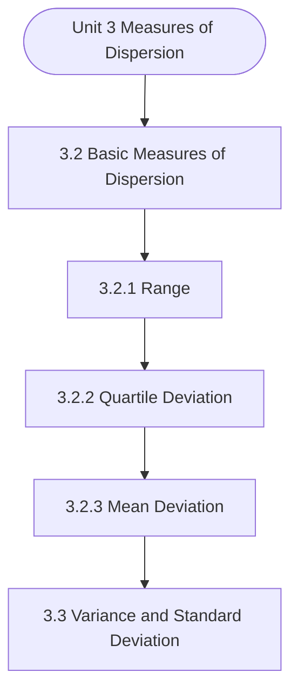

# MCS-066: Mathematical Foundations - II
## Unit 3: Measures of Dispersion

> 📚 **Programme:** M.Sc. (Data Science and Analytics) | **Semester:** Semester 2  
> ⏱️ **Estimated Study Time:** ~40 mins | 📄 **Textbook Pages:** 24 Pages  
> 📥 **Original PDF:** [Download & View Authentic Textbook](../../../pdfs/Semester_2/MCS-066_Mathematical_Foundations_-_II/Unit-3_Measures_of_Dispersion.pdf)

---

### 🎯 Executive Concept & Data Science Relevance
In modern data systems, **Measures of Dispersion** forms a vital conceptual pillar. Descriptive statistics provide quantitative summaries of dataset properties. Measures of central tendency identify typical values, while measures of dispersion quantify data spread, uncertainty, and variability—critical for feature normalization and anomaly detection.

> [!NOTE]
> **Why this matters for your career:** Mastering measures of dispersion equips you with the foundational principles required to reason mathematically about high-dimensional datasets, evaluate algorithm performance, and avoid statistical pitfalls in production machine learning pipelines.

### 🗺️ Visual Knowledge Architecture
The following concept map illustrates the structural hierarchy and learning trajectory of this module:



### 📖 Core Definitions & Terminology Cards

> 📌 **Arithmetic Mean $\bar{x}$ or $\mu$**  
> - **Formal Definition:** The sum of all observations divided by the total number of observations: $\bar{x} = \frac{1}{n}\sum_{i=1}^n x_i$. Sensitive to extreme outliers.  
> - 💡 **Practical Intuition & Analogy:** *The center of mass or balance point of the distribution.*

> 📌 **Median**  
> - **Formal Definition:** The physical middle value separating the higher half from the lower half of an ordered dataset. Robust against outliers.  
> - 💡 **Practical Intuition & Analogy:** *The 50th percentile value where exactly half the data lies above and half below.*

> 📌 **Standard Deviation $\sigma$ or $s$**  
> - **Formal Definition:** The square root of variance, measuring average dispersion in original units: $s = \sqrt{\frac{1}{n-1}\sum (x_i - \bar{x})^2}$.  
> - 💡 **Practical Intuition & Analogy:** *The typical distance data points deviate from the mean.*

> 📌 **Coefficient of Variation ($CV$)**  
> - **Formal Definition:** Relative dispersion measure expressed as a percentage: $CV = \frac{\sigma}{\mu} \times 100\%$. Enables comparison across different measurement scales.  
> - 💡 **Practical Intuition & Analogy:** *Comparing stock volatility across assets priced at 10 USD vs 1,000 USD.*

### ⚡ Governing Mathematical Laws & Formula Cheatsheet
#### 🔹 Sample Variance Formula (Bessel's Correction)
$$
\begin{aligned} s^2 & = \frac{1}{n - 1} \sum_{i=1}^n (x_i - \bar{x})^2 \\ & = \frac{\sum x_i^2 - \frac{(\sum x_i)^2}{n}}{n - 1} \end{aligned}
$$
- **Explanation:** Using $n-1$ in the denominator corrects for downward sample bias, yielding an unbiased estimator of population variance $\sigma^2$.

#### 🔹 Interquartile Range (IQR) & Outlier Bounds
$$
\text{IQR} = Q_3 - Q_1, \quad \text{Outliers} < Q_1 - 1.5(\text{IQR}) \;\lor\; > Q_3 + 1.5(\text{IQR})
$$
- **Explanation:** Standard Tukey boxplot rule for identifying extreme data points robustly.

#### 🔹 Pearson's First Coefficient of Skewness
$$
Sk_1 = \frac{\text{Mean} - \text{Mode}}{\sigma} \quad \text{or} \quad Sk_2 = \frac{3(\text{Mean} - \text{Median})}{\sigma}
$$
- **Explanation:** Measures asymmetry: Positive skew means mean > median (right tail); negative skew means mean < median (left tail).

### ⚖️ Axiomatic Properties & Governing Laws
The mathematical formulations of this module are anchored by foundational algebraic and structural laws:

- **Variance Scaling Rule:** $\text{Var}(aX + b) = a^2 \text{Var}(X)$
- **Standard Deviation Scaling:** $\sigma(aX + b) = \vert a\vert \sigma(X)$
- **Empirical Rule (Normal Distribution):** 68% within $\mu \pm 1\sigma$, 95% within $\mu \pm 2\sigma$, 99.7% within $\mu \pm 3\sigma$

### 📌 Comprehensive Section-by-Section Study Breakdown
#### `3.2` Basic Measures of Dispersion
##### 📘 Theoretical Principles & In-Depth Exposition
Range is the simplest measure of dispersion. It is defined as the difference between the maximum value of the variable and the minimum value of the variable in the distribution. Its merit lies in its simplicity. The demerit is that it is a crude measure because it is using only the maximum and the minimum observations of variable.

However, it still finds applications in Order Statistics and Statistical Quality Control. It can be defined as Min Max X X R − = where, Max X : Maximum value of variable and Min X : Minimum value of variable. Example 1: Find the range of the distribution 6, 8, 2, 10, 15, 5, 1, 13.

Solution: For the given distribution, the maximum value of variable is 15 and the minimum value of variable is 1. Hence range = 15 -1 = 14. Note: Range is the simplest measure of dispersion as it can be obtained from the largest and the smallest observations. It is used in statistical quality control.

##### ⚙️ Mathematical & Algorithmic Mechanics
- **Formal Mechanics:** Establishes symbolic transformations and state invariants governing basic measures of dispersion.
- **Boundary Invariants:** Ensures robust error-handling, non-empty set guarantees, and strict asymptotic bounds.

##### 📊 Practical Data Science & Production Relevance
- **Industry Application:** Directly implemented in production workflows such as SQL query filters, pandas vectorized operations, and feature transformation pipelines.
- **Production Pitfall:** Failing to verify membership bounds or missing edge cases in basic measures of dispersion can cause silent data corruption or performance bottlenecks.

> [!TIP]
> **Key Exam & Technical Interview Takeaway:** Be prepared to define basic measures of dispersion formally, cite its core mathematical invariants, and solve step-by-step numerical/proof questions.

#### `3.2.1` Range
##### 📘 Theoretical Principles & In-Depth Exposition
Range is the simplest measure of dispersion. It is defined as the difference between the maximum value of the variable and the minimum value of the variable in the distribution. Its merit lies in its simplicity. The demerit is that it is a crude measure because it is using only the maximum and the minimum observations of variable.

However, it still finds applications in Order Statistics and Statistical Quality Control. It can be defined as Min Max X X R − = where, Max X : Maximum value of variable and Min X : Minimum value of variable. Example 1: Find the range of the distribution 6, 8, 2, 10, 15, 5, 1, 13.

Solution: For the given distribution, the maximum value of variable is 15 and the minimum value of variable is 1. Hence range = 15 -1 = 14. Note: Range is the simplest measure of dispersion as it can be obtained from the largest and the smallest observations. It is used in statistical quality control.

##### ⚙️ Mathematical & Algorithmic Mechanics
- **Formal Mechanics:** Establishes symbolic transformations and state invariants governing range.
- **Boundary Invariants:** Ensures robust error-handling, non-empty set guarantees, and strict asymptotic bounds.

##### 📊 Practical Data Science & Production Relevance
- **Industry Application:** Directly implemented in production workflows such as SQL query filters, pandas vectorized operations, and feature transformation pipelines.
- **Production Pitfall:** Failing to verify membership bounds or missing edge cases in range can cause silent data corruption or performance bottlenecks.

> [!TIP]
> **Key Exam & Technical Interview Takeaway:** Be prepared to define range formally, cite its core mathematical invariants, and solve step-by-step numerical/proof questions.

#### `3.2.2` Quartile Deviation
##### 📘 Theoretical Principles & In-Depth Exposition
You have already studied in about Q1 and Q3, the first quartile and the third Descriptive Statistics semi-interquartile range which is also known as Quartile Deviation (QD) is given by Quartile Deviation (QD) = (Q3 – Q1) / 2 Relative measure of Q.D. known as Coefficient of Q.D. and is defined as Q Q Q Q QD of Cofficient + − = Example 2: For the following data, find the quartile deviation: Class Interval 0-10 10-20 20-30 30-40 40-50 Frequency Solution: We have N/4 = 28/4 = 7 and 7th observation falls in the class 10-20.

This is the first quartile class. Similarly, 3N/4 = 21 and 21st observation falls in the interval 30-40. This is the third quartile class. Class Interval Frequency Cumulative Frequency 0-10 10-20 20-30 30-40 40-50 Using the formulae of first quartile and third quartile we found Q1 = 10 + ( ) 7 −  10 = 18 Q3 = 30 + ( ) 21− 10 = 36.67 Hence Quartile Deviation = (36.67-18)/2 = 9.335

##### ⚙️ Mathematical & Algorithmic Mechanics
- **Formal Mechanics:** Establishes symbolic transformations and state invariants governing quartile deviation.
- **Boundary Invariants:** Ensures robust error-handling, non-empty set guarantees, and strict asymptotic bounds.

##### 📊 Practical Data Science & Production Relevance
- **Industry Application:** Directly implemented in production workflows such as SQL query filters, pandas vectorized operations, and feature transformation pipelines.
- **Production Pitfall:** Failing to verify membership bounds or missing edge cases in quartile deviation can cause silent data corruption or performance bottlenecks.

> [!TIP]
> **Key Exam & Technical Interview Takeaway:** Be prepared to define quartile deviation formally, cite its core mathematical invariants, and solve step-by-step numerical/proof questions.

#### `3.2.3` Mean Deviation
##### 📘 Theoretical Principles & In-Depth Exposition
Mean deviation is defined as average of the sum of the absolute values of deviation from any arbitrary value viz. mean, median, mode, etc. It is often suggested to calculate it from the median because it gives least value when measured from the median. The deviation of an observation xi from the assumed mean A is defined as (xi – A).

Therefore, the mean deviation can be defined as  = − = n i i A x n D M The quantity xi – Ais minimum when A is median. We accordingly define mean deviation from mean as MD= n x x n i i  = − Measures of Dispersion and from the median as MD = n median x n i i  = − For frequency distribution, the formula will be MD =   = = − k i i k i i i f x x f MD =   = = − k i i k i i i f median x f where, all symbols have usual meanings.

Example 3: Find mean deviation for the given data 1, 2, 3, 4, 5, 6, 7 Solution: First of all we find Mean x = = + + + + + + = Then, we will find ,2 ,1 ,1 ,2 ,3 : x xi − So, x xi = −  Therefore, .1 MD = = Example 4: Find mean deviation from mean for the following data: x 1 2 3 4 5 6 7 f 3 5 8 12 10 7 5 Solution: First of all we have to calculate the mean from the given data x f f x x x − x x f −

##### ⚙️ Mathematical & Algorithmic Mechanics
- **Formal Mechanics:** Establishes symbolic transformations and state invariants governing mean deviation.
- **Boundary Invariants:** Ensures robust error-handling, non-empty set guarantees, and strict asymptotic bounds.

##### 📊 Practical Data Science & Production Relevance
- **Industry Application:** Directly implemented in production workflows such as SQL query filters, pandas vectorized operations, and feature transformation pipelines.
- **Production Pitfall:** Failing to verify membership bounds or missing edge cases in mean deviation can cause silent data corruption or performance bottlenecks.

> [!TIP]
> **Key Exam & Technical Interview Takeaway:** Be prepared to define mean deviation formally, cite its core mathematical invariants, and solve step-by-step numerical/proof questions.

#### `3.3` Variance and Standard Deviation
##### 📘 Theoretical Principles & In-Depth Exposition
In this section, we discuss one of the most used measures of dispersion and certain related measures. We will first discuss the variance, followed by the standard deviation and the root mean square variation.

##### ⚙️ Mathematical & Algorithmic Mechanics
- **Formal Mechanics:** Establishes symbolic transformations and state invariants governing variance and standard deviation.
- **Boundary Invariants:** Ensures robust error-handling, non-empty set guarantees, and strict asymptotic bounds.

##### 📊 Practical Data Science & Production Relevance
- **Industry Application:** Directly implemented in production workflows such as SQL query filters, pandas vectorized operations, and feature transformation pipelines.
- **Production Pitfall:** Failing to verify membership bounds or missing edge cases in variance and standard deviation can cause silent data corruption or performance bottlenecks.

> [!TIP]
> **Key Exam & Technical Interview Takeaway:** Be prepared to define variance and standard deviation formally, cite its core mathematical invariants, and solve step-by-step numerical/proof questions.

#### `3.3.1` Variance
##### 📘 Theoretical Principles & In-Depth Exposition
Variance is the average of the square of deviations of the values taken from mean. Taking a square of the deviation is a better technique to get rid of negative deviations. Variance is defined as Var(x) = σ2 = ( )  = − n i i x x n and for a frequency distribution, the formula is σ2 = ( )  = − k i i i x x f N where, all symbols have their usual meanings.

Descriptive Statistics It should be noted that sum of squares of deviations is least when deviations are measured from the mean. This means (xi – A)2 is least when A = Mean. Example 6: Calculate the variance for the data given in Example 3. Solution: We have ( ) x x n i i = −  = Therefore, ( ) ( )  = =  = − = n i i x x n x Var Example 7: For the data given in Example 2, compute the variance.

Solution: We have the following data: Class Mid Value Frequency (f) ( ) x x f − 0-10

##### ⚙️ Mathematical & Algorithmic Mechanics
- **Formal Mechanics:** Establishes symbolic transformations and state invariants governing variance.
- **Boundary Invariants:** Ensures robust error-handling, non-empty set guarantees, and strict asymptotic bounds.

##### 📊 Practical Data Science & Production Relevance
- **Industry Application:** Directly implemented in production workflows such as SQL query filters, pandas vectorized operations, and feature transformation pipelines.
- **Production Pitfall:** Failing to verify membership bounds or missing edge cases in variance can cause silent data corruption or performance bottlenecks.

> [!TIP]
> **Key Exam & Technical Interview Takeaway:** Be prepared to define variance formally, cite its core mathematical invariants, and solve step-by-step numerical/proof questions.

#### `3.3.2` Standard Deviation
##### 📘 Theoretical Principles & In-Depth Exposition
Standard deviation (SD) is defined as the positive square root of variance. The formula is SD = ( ) n x x n i i  = − and for a frequency distribution the formula is SD = ( )   = = − k i i k i i i f x x f where, all symbols have usual meanings. SD, MD and variance cannot be negative.

Descriptive Statistics Example 9: Find the SD for the data in Example 2. Solution: In the Example 7, we have already found the Variance = 145.408 So SD = + . (145.408) = Note: Standard deviation is a rigidly defined measure that utilises all the observations. It is amenable to algebraic treatment and get rid of negative deviations by squaring.

It is the most popular measure of dispersion. However, in cases where mean is not a suitable average, like when open ended classes are present, variance may not be the coveted measure of dispersion In such cases quartile deviation may be used Remark: SD is algebraically more amenable than MD.

##### ⚙️ Mathematical & Algorithmic Mechanics
- **Formal Mechanics:** Establishes symbolic transformations and state invariants governing standard deviation.
- **Boundary Invariants:** Ensures robust error-handling, non-empty set guarantees, and strict asymptotic bounds.

##### 📊 Practical Data Science & Production Relevance
- **Industry Application:** Directly implemented in production workflows such as SQL query filters, pandas vectorized operations, and feature transformation pipelines.
- **Production Pitfall:** Failing to verify membership bounds or missing edge cases in standard deviation can cause silent data corruption or performance bottlenecks.

> [!TIP]
> **Key Exam & Technical Interview Takeaway:** Be prepared to define standard deviation formally, cite its core mathematical invariants, and solve step-by-step numerical/proof questions.

#### `3.3.3` Root Mean Square Deviation
##### 📘 Theoretical Principles & In-Depth Exposition
As we have discussed in the last sub-section, standard deviation is the positive square root of the average of the squares of deviations taken from the mean. If we take the deviations from assumed mean then it is called Root Mean Square Deviation and it is defined as RMSD = ( ) n A x n i i  = − where, A is the assumed mean.

For a frequency distribution, the formula is RMSD = ( )   = = − k i i k i i i f A x f When assumed mean is equal to the actual mean x A .e.i x = root mean square deviation will be equal to the standard deviation.

##### ⚙️ Mathematical & Algorithmic Mechanics
- **Formal Mechanics:** Establishes symbolic transformations and state invariants governing root mean square deviation.
- **Boundary Invariants:** Ensures robust error-handling, non-empty set guarantees, and strict asymptotic bounds.

##### 📊 Practical Data Science & Production Relevance
- **Industry Application:** Directly implemented in production workflows such as SQL query filters, pandas vectorized operations, and feature transformation pipelines.
- **Production Pitfall:** Failing to verify membership bounds or missing edge cases in root mean square deviation can cause silent data corruption or performance bottlenecks.

> [!TIP]
> **Key Exam & Technical Interview Takeaway:** Be prepared to define root mean square deviation formally, cite its core mathematical invariants, and solve step-by-step numerical/proof questions.

### 📐 Step-by-Step Solved Mathematical Examples
To solidify your theoretical understanding, work through these fully solved, step-by-step mathematical problems:

#### 🧮 Example 1: Sample Variance and Standard Deviation Computation
> **Problem Statement:**  
> Given sample observations: $X = \lbrace 4, 8, 6, 5, 7 \rbrace$. Compute sample mean $\bar{x}$, sample variance $s^2$, and standard deviation $s$ step-by-step.

**Detailed Step-by-Step Solution:**

1. **Mean:** $\bar{x} = \frac{4 + 8 + 6 + 5 + 7}{5} = \frac{30}{5} = 6$.

2. **Squared deviations:**
- $(4 - 6)^2 = (-2)^2 = 4$
- $(8 - 6)^2 = 2^2 = 4$
- $(6 - 6)^2 = 0^2 = 0$
- $(5 - 6)^2 = (-1)^2 = 1$
- $(7 - 6)^2 = 1^2 = 1$
Sum of squared deviations $= 4 + 4 + 0 + 1 + 1 = 10$.

3. **Sample Variance with Bessel's Correction ($n-1 = 4$):**
$$
s^2 = \frac{10}{5 - 1} = \frac{10}{4} = 2.5
$$

4. **Standard Deviation:** $s = \sqrt{2.5} \approx 1.581$.

#### 🧮 Example 2: Tukey's IQR Outlier Detection Rule
> **Problem Statement:**  
> A customer spend dataset has $Q_1 = 30$ and $Q_3 = 70$. Determine whether transactions of $135$ and $25$ are classified as outliers.

**Detailed Step-by-Step Solution:**

1. **IQR:** $\text{IQR} = Q_3 - Q_1 = 70 - 30 = 40$.
2. **Lower Bound:** $Q_1 - 1.5(\text{IQR}) = 30 - 1.5(40) = 30 - 60 = -30$.
3. **Upper Bound:** $Q_3 + 1.5(\text{IQR}) = 70 + 1.5(40) = 70 + 60 = 130$.

Conclusion:
- Spend of 135 exceeds Upper Bound ($135 > 130$): **Classified as Outlier**.
- Spend of 25 is within $[-30, 130]$: **Normal observation**.

### 💻 Practical Data Science Implementation (Python)
Theory translates directly into production algorithms. Below is a self-contained, commented Python implementation illustrating the core operations of this unit:

```python
import numpy as np
import pandas as pd

# Statistical profiling on production dataset
data = np.array([12, 15, 18, 22, 25, 29, 34, 45, 95])

mean_val = np.mean(data)
median_val = np.median(data)
std_val = np.std(data, ddof=1) # Bessel's correction

q1, q3 = np.percentile(data, [25, 75])
iqr = q3 - q1
outlier_upper = q3 + 1.5 * iqr

outliers = data[data > outlier_upper]

print(f"Mean: {mean_val:.2f} | Median: {median_val:.2f} | Std: {std_val:.2f}")
print(f"IQR: {iqr:.2f} | Upper Bound: {outlier_upper:.2f}")
print(f"Detected Outliers: {outliers}")
```

### 💡 Interactive Self-Assessment Checkpoints
Test your comprehension before proceeding. Tap each question to reveal the comprehensive explanation:

<details>
<summary><b>Checkpoint 1:</b> Why is sample variance divided by $n-1$ instead of $n$? <i>(Tap to reveal answer)</i></summary>

> **Answer & Analysis:**  
> Dividing by $n-1$ applies **Bessel's correction**, which removes downward bias caused by using the sample mean $\bar{x}$ instead of the true population mean $\mu$.
</details>

<details>
<summary><b>Checkpoint 2:</b> Which measure of central tendency is most robust to extreme outliers? <i>(Tap to reveal answer)</i></summary>

> **Answer & Analysis:**  
> The **Median**, because it depends on positional rank rather than magnitude summation.
</details>

<details>
<summary><b>Checkpoint 3:</b> In a right-skewed (positively skewed) distribution, what is the order of Mean, Median, and Mode? <i>(Tap to reveal answer)</i></summary>

> **Answer & Analysis:**  
> $\text{Mode} < \text{Median} < \text{Mean}$.
</details>

<details>
<summary><b>Checkpoint 4:</b> Calculate range for the following frequency distribution: Class <i>(Tap to reveal answer)</i></summary>

> **Answer & Analysis:**  
> This question tests your conceptual mastery of Measures of Dispersion. Review the governing formulas and section breakdowns above to formulate a complete, rigorous proof or derivation.
</details>

<details>
<summary><b>Checkpoint 5:</b> Calculate the Quartile Deviation for the following data: Class <i>(Tap to reveal answer)</i></summary>

> **Answer & Analysis:**  
> This question tests your conceptual mastery of Measures of Dispersion. Review the governing formulas and section breakdowns above to formulate a complete, rigorous proof or derivation.
</details>

<details>
<summary><b>Checkpoint 6:</b> Find mean deviation for the following distribution: Class <i>(Tap to reveal answer)</i></summary>

> **Answer & Analysis:**  
> This question tests your conceptual mastery of Measures of Dispersion. Review the governing formulas and section breakdowns above to formulate a complete, rigorous proof or derivation.
</details>

### 🎯 Executive Module Wrap-Up
- **Central Idea:** Measures of Dispersion provides essential mathematical and algorithmic tools directly utilized in Data Science.
- **Mathematical Rigor:** Formulas and laws must be memorized with attention to boundary conditions and assumptions.
- **Full Textbook Coverage:** For exhaustive multi-page derivations, proofs, and supplementary exercises, consult the [Authentic IGNOU Textbook](../../../pdfs/Semester_2/MCS-066_Mathematical_Foundations_-_II/Unit-3_Measures_of_Dispersion.pdf).

---
### 🧭 Navigation & Syllabus Index
[⬅ Previous: Unit 2](unit_02_Describing_Data_Sets_and_Measures_of_Central_Tende.md) | [📑 Course Index](README.md) | [Next: Unit 4 ➡](unit_04_Basics_of_Probability.md)
