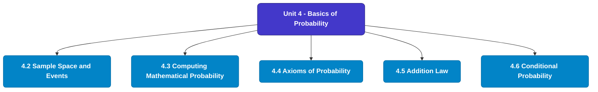

# MCS-066: Mathematical Foundations - II
## Unit 4: Basics of Probability

> 📚 **Programme:** M.Sc. (Data Science and Analytics) | **Semester:** Semester 2  
> ⏱️ **Estimated Study Time:** ~76 mins | 📄 **Textbook Pages:** 36 Pages  
> 📥 **Original PDF:** [Download & View Textbook](../../../pdfs/Semester_2/MCS-066_Mathematical_Foundations_-_II/Unit-4_Basics_of_Probability.pdf)

---

### 🎯 Executive Concept & Data Science Relevance
In modern data systems, **Basics of Probability** forms a vital conceptual pillar. Probability is the mathematical calculus of uncertainty. Every machine learning classification model outputs a conditional probability $P(Y=c \mid X=\mathbf{x})$, and Bayesian modeling updates prior beliefs based on empirical evidence.

> [!NOTE]
> **Why this matters for your career:** Mastering basics of probability equips you with the foundational principles required to reason mathematically about high-dimensional datasets, evaluate algorithm performance, and avoid statistical pitfalls in production machine learning pipelines.

### 🗺️ Visual Knowledge Architecture
The following concept map illustrates the structural hierarchy and learning trajectory of this module:

### 📖 Core Definitions & Terminology Cards
| Term | Formal Mathematical / Technical Definition | Intuitive Analogy / Concrete Example |
| :--- | :--- | :--- |
| **Conditional Probability $P(A \mid B)$** | The probability of event $A$ occurring given that event $B$ has already occurred: $P(A \mid B) = \frac{P(A \cap B)}{P(B)}$, defined for $P(B) > 0$. | *Updating the likelihood of fraud given that a transaction occurred in an unusual country.* |
| **Independent Events** | Events $A$ and $B$ are independent if the occurrence of one does not affect the other: $P(A \cap B) = P(A)P(B)$, or equivalently $P(A \mid B) = P(A)$. | *Coin tosses: Getting heads on flip 1 gives zero information about flip 2.* |
| **Random Variable $X$** | A real-valued function $X: \Omega \to \mathbb{R}$ mapping outcomes of a random sample space $\Omega$ to real numbers. Can be discrete or continuous. | *Counting customer website visits per hour or measuring response latency in milliseconds.* |
| **Mathematical Expectation $E[X]$** | The probability-weighted average value of a random variable: $E[X] = \sum x_i P(X = x_i)$ for discrete, or $\int_{-\infty}^\infty x f(x)dx$ for continuous. | *Long-run average payout of a game of chance.* |

### ⚡ Governing Mathematical Laws & Formula Cheatsheet
#### 🔹 Bayes' Theorem
$$P(B_i \mid A) = \frac{P(A \mid B_i) P(B_i)}{\sum_{j=1}^k P(A \mid B_j) P(B_j)} = \frac{P(A \mid B_i) P(B_i)}{P(A)}$$
- **Explanation:** Calculates posterior probability by multiplying prior probability by likelihood, normalized by marginal evidence.

#### 🔹 Variance of a Random Variable
$$\text{Var}(X) = E[X^2] - (E[X])^2$$
- **Explanation:** Measures spread around the expected value. For constants: $\text{Var}(aX + b) = a^2 \text{Var}(X)$.

#### 🔹 Binomial Distribution PMF
$$P(X = k) = \binom{n}{k} p^k (1 - p)^{n - k}, \quad E[X] = np, \; \text{Var}(X) = np(1 - p)$$
- **Explanation:** Models $k$ successes in $n$ independent Bernoulli trials with success probability $p$.

#### 🔹 Poisson Distribution PMF
$$P(X = k) = \frac{\lambda^k e^{-\lambda}}{k!}, \quad E[X] = \lambda, \; \text{Var}(X) = \lambda$$
- **Explanation:** Models counts of rare independent events occurring in a fixed interval at constant average rate $\lambda$.

#### 🔹 Normal (Gaussian) Distribution PDF
$$f(x) = \frac{1}{\sigma \sqrt{2\pi}} e^{-\frac{1}{2}\left(\frac{x - \mu}{\sigma}\right)^2}, \quad Z = \frac{X - \mu}{\sigma} \sim \mathcal{N}(0, 1)$$
- **Explanation:** Symmetric bell-shaped curve governed entirely by mean $\mu$ and standard deviation $\sigma$.

### 📌 Detailed Section-by-Section Study Breakdown
#### `4.2` Sample Space and Events
- **Core Concept:** Establishes rigorous theoretical formulations and computational bounds for sample space and events.
- **Core Concept:** Applies standard algorithmic procedures and mathematical invariants relevant to basics of probability.
- **Core Concept:** Ensures deterministic performance guarantees across high-dimensional feature spaces.
- **Data Science Application:** Provides foundational structures used directly in statistical modeling, query execution, and machine learning pipelines.

> [!TIP]
> **Exam & Interview Tip:** Be prepared to state the formal definition of sample space and events and derive its primary equations step-by-step.

#### `4.3` Computing Mathematical Probability
- **Core Concept:** Let there be ‘n’ exhaustive cases in a random experiment which are mutually exclusive as well as equally likely.
- **Core Concept:** Also, since 0  m  n, therefore 0  P(A)  1 …(3) Remark: Probability of an impossible event is always zero and that of certain event is 1, e.g.
- **Core Concept:** probability of getting 7 when we throw a die is zero, as getting 7 here is an impossible event and probability of getting either of the six faces is 1, as it is a certain event.
- **Data Science Application:** Provides foundational structures used directly in statistical modeling, query execution, and machine learning pipelines.

> [!TIP]
> **Exam & Interview Tip:** Be prepared to state the formal definition of computing mathematical probability and derive its primary equations step-by-step.

#### `4.4` Axioms of Probability
- **Core Concept:** The axioms are fundamental to probability and provide us with an approach to probability, i.e., an axiomatic approach to probability.
- **Core Concept:** is any finite or infinite sequence of disjoint events in S, then P(A1 or A2 or...or An) = P(A1) + P(A2) +...+ P(An) Now, let us give some results using probability function.
- **Core Concept:** But before taking up these results, we discuss some statements with their meanings in terms of set theory.
- **Data Science Application:** Provides foundational structures used directly in statistical modeling, query execution, and machine learning pipelines.

> [!TIP]
> **Exam & Interview Tip:** Be prepared to state the formal definition of axioms of probability and derive its primary equations step-by-step.

#### `4.5` Addition Law
- **Core Concept:** The result can similarly be extended for more than 3 events.
- **Core Concept:** Applications of the Addition Theorem of Probability Example 15: 25 lottery tickets are marked with first 25 numerals.
- **Core Concept:** Find the probability that it is a multiple of 5 or 7.
- **Data Science Application:** Provides foundational structures used directly in statistical modeling, query execution, and machine learning pipelines.

> [!TIP]
> **Exam & Interview Tip:** Be prepared to state the formal definition of addition law and derive its primary equations step-by-step.

#### `4.6` Conditional Probability
- **Core Concept:** We have discussed earlier that P(A) represents the probability of happening event A for which the number of exhaustive cases is the number of elements in the sample space S.
- **Core Concept:** P(A) dealt earlier was the unconditional probability.
- **Core Concept:** Here, we are going to deal with conditional probability.
- **Data Science Application:** Provides foundational structures used directly in statistical modeling, query execution, and machine learning pipelines.

> [!TIP]
> **Exam & Interview Tip:** Be prepared to state the formal definition of conditional probability and derive its primary equations step-by-step.

#### `4.7` Independent Events
- **Core Concept:** Now, if we do not replace the card back and draw the next card.
- **Core Concept:** Then, the probability of drawing the second card ‘a card of spades’ given that the first card was spades would be 12/51 and it is the conditional probability.
- **Core Concept:** Now, if the first card had been replaced back then this conditional probability would have been 13/52.
- **Data Science Application:** Provides foundational structures used directly in statistical modeling, query execution, and machine learning pipelines.

> [!TIP]
> **Exam & Interview Tip:** Be prepared to state the formal definition of independent events and derive its primary equations step-by-step.

### 💡 Interactive Self-Assessment Checkpoints
Test your comprehension before proceeding. Tap each question to reveal the comprehensive explanation:

<b>Checkpoint 1:</b> State Bayes' Theorem formula for event hypothesis $H$ given evidence $E$. <i>(Tap to reveal answer)</i>

> **Answer & Analysis:**  
> $$P(H \mid E) = \frac{P(E \mid H)P(H)}{P(E)}$$

<b>Checkpoint 2:</b> What is the expected value and variance of a Binomial distribution $B(n, p)$? <i>(Tap to reveal answer)</i>

> **Answer & Analysis:**  
> Mean $E[X] = np$, and Variance $\text{Var}(X) = np(1 - p)$.

<b>Checkpoint 3:</b> If $E[X] = 5$ and $E[X^2] = 34$, what is $\text{Var}(X)$? <i>(Tap to reveal answer)</i>

> **Answer & Analysis:**  
> $\text{Var}(X) = E[X^2] - (E[X])^2 = 34 - 5^2 = 34 - 25 = 9$.

<b>Checkpoint 4:</b> Write the sample space if we draw a card from a pack of 52 playing cards. <i>(Tap to reveal answer)</i>

> **Answer & Analysis:**  
> This question tests your conceptual mastery of Basics of Probability. Review the governing formulas and section breakdowns above to formulate a complete, rigorous proof or derivation.

<b>Checkpoint 5:</b> If a die and a coin are tossed simultaneously, write the event of getting (i) head and prime number (ii) tail and an even number (iii) head and multiple of <i>(Tap to reveal answer)</i>

> **Answer & Analysis:**  
> This question tests your conceptual mastery of Basics of Probability. Review the governing formulas and section breakdowns above to formulate a complete, rigorous proof or derivation.

<b>Checkpoint 6:</b> If two coins are tossed, then find the probability of getting. (i) At least one head (ii) head and tail (iii) At most one head <i>(Tap to reveal answer)</i>

> **Answer & Analysis:**  
> This question tests your conceptual mastery of Basics of Probability. Review the governing formulas and section breakdowns above to formulate a complete, rigorous proof or derivation.

### 🎯 Executive Module Wrap-Up
- **Central Idea:** Basics of Probability provides essential mathematical and algorithmic tools directly utilized in Data Science.
- **Mathematical Rigor:** Formulas and laws must be memorized with attention to boundary conditions and assumptions.
- **Full Textbook Coverage:** For exhaustive multi-page derivations, proofs, and supplementary exercises, consult the [Authentic IGNOU Textbook](../../../pdfs/Semester_2/MCS-066_Mathematical_Foundations_-_II/Unit-4_Basics_of_Probability.pdf).

---
### 🧭 Navigation & Syllabus Index
[⬅ Previous: Unit 3](unit_03_Measures_of_Dispersion.md) | [📑 Course Index](README.md) | [Next: Unit 5 ➡](unit_05_Random_Variables_and_Expectation.md)
