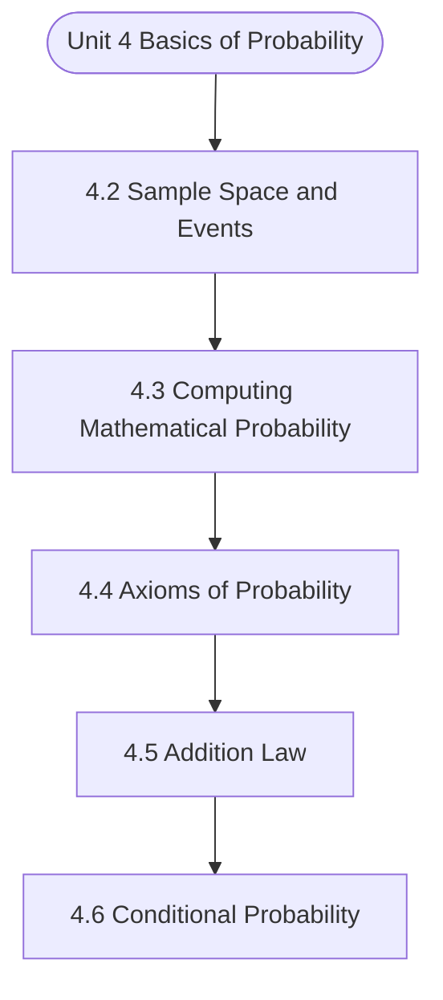

# MCS-066: Mathematical Foundations - II
## Unit 4: Basics of Probability

> 📚 **Programme:** M.Sc. (Data Science and Analytics) | **Semester:** Semester 2  
> ⏱️ **Estimated Study Time:** ~76 mins | 📄 **Textbook Pages:** 36 Pages  
> 📥 **Original PDF:** [Download & View Authentic Textbook](../../../pdfs/Semester_2/MCS-066_Mathematical_Foundations_-_II/Unit-4_Basics_of_Probability.pdf)

---

### 🎯 Executive Concept & Data Science Relevance
In modern data systems, **Basics of Probability** forms a vital conceptual pillar. Probability is the mathematical calculus of uncertainty. Every machine learning classification model outputs a conditional probability $P(Y=c \mid X=\mathbf{x})$, and Bayesian modeling updates prior beliefs based on empirical evidence.

> [!NOTE]
> **Why this matters for your career:** Mastering basics of probability equips you with the foundational principles required to reason mathematically about high-dimensional datasets, evaluate algorithm performance, and avoid statistical pitfalls in production machine learning pipelines.

### 🗺️ Visual Knowledge Architecture
The following concept map illustrates the structural hierarchy and learning trajectory of this module:



### 📖 Core Definitions & Terminology Cards

> 📌 **Conditional Probability $P(A \mid B)$**  
> - **Formal Definition:** The probability of event $A$ occurring given that event $B$ has already occurred: $P(A \mid B) = \frac{P(A \cap B)}{P(B)}$, defined for $P(B) > 0$.  
> - 💡 **Practical Intuition & Analogy:** *Updating the likelihood of fraud given that a transaction occurred in an unusual country.*

> 📌 **Independent Events**  
> - **Formal Definition:** Events $A$ and $B$ are independent if the occurrence of one does not affect the other: $P(A \cap B) = P(A)P(B)$, or equivalently $P(A \mid B) = P(A)$.  
> - 💡 **Practical Intuition & Analogy:** *Coin tosses: Getting heads on flip 1 gives zero information about flip 2.*

> 📌 **Random Variable $X$**  
> - **Formal Definition:** A real-valued function $X: \Omega \to \mathbb{R}$ mapping outcomes of a random sample space $\Omega$ to real numbers. Can be discrete or continuous.  
> - 💡 **Practical Intuition & Analogy:** *Counting customer website visits per hour or measuring response latency in milliseconds.*

> 📌 **Mathematical Expectation $E[X]$**  
> - **Formal Definition:** The probability-weighted average value of a random variable: $E[X] = \sum x_i P(X = x_i)$ for discrete, or $\int_{-\infty}^\infty x f(x)dx$ for continuous.  
> - 💡 **Practical Intuition & Analogy:** *Long-run average payout of a game of chance.*

### ⚡ Governing Mathematical Laws & Formula Cheatsheet
#### 🔹 Bayes' Theorem
$$
P(B_i \mid A) = \frac{P(A \mid B_i) P(B_i)}{\sum_{j=1}^k P(A \mid B_j) P(B_j)} = \frac{P(A \mid B_i) P(B_i)}{P(A)}
$$
- **Explanation:** Calculates posterior probability by multiplying prior probability by likelihood, normalized by marginal evidence.

#### 🔹 Variance of a Random Variable
$$
\text{Var}(X) = E[X^2] - (E[X])^2
$$
- **Explanation:** Measures spread around the expected value. For constants: $\text{Var}(aX + b) = a^2 \text{Var}(X)$.

#### 🔹 Binomial Distribution PMF
$$
\begin{aligned} P(X = k) & = \binom{n}{k} p^k (1 - p)^{n - k} \\ E[X] & = np, \quad \text{Var}(X) = np(1 - p) \end{aligned}
$$
- **Explanation:** Models $k$ successes in $n$ independent Bernoulli trials with success probability $p$.

#### 🔹 Poisson Distribution PMF
$$
\begin{aligned} P(X = k) & = \frac{\lambda^k e^{-\lambda}}{k!} \\ E[X] & = \lambda, \quad \text{Var}(X) = \lambda \end{aligned}
$$
- **Explanation:** Models counts of rare independent events occurring in a fixed interval at constant average rate $\lambda$.

#### 🔹 Normal (Gaussian) Distribution PDF
$$
\begin{aligned} f(x) & = \frac{1}{\sigma \sqrt{2\pi}} e^{-\frac{1}{2}\left(\frac{x - \mu}{\sigma}\right)^2} \\ Z & = \frac{X - \mu}{\sigma} \sim \mathcal{N}(0, 1) \end{aligned}
$$
- **Explanation:** Symmetric bell-shaped curve governed entirely by mean $\mu$ and standard deviation $\sigma$.

### ⚖️ Axiomatic Properties & Governing Laws
The mathematical formulations of this module are anchored by foundational algebraic and structural laws:

- **Law of Total Probability:** $P(A) = \sum_{i=1}^k P(A \mid B_i) P(B_i)$
- **Linearity of Expectation:** $E[aX + bY] = aE[X] + bE[Y] \quad (\text{always holds})$
- **Variance of Sum:** $\text{Var}(X + Y) = \text{Var}(X) + \text{Var}(Y) + 2\text{Cov}(X, Y)$

### 📌 Comprehensive Section-by-Section Study Breakdown
#### `4.2` Sample Space and Events
##### 📘 Theoretical Principles & In-Depth Exposition
The section on **Sample Space and Events** establishes rigorous theoretical foundations necessary for advanced computational modeling. It introduces formal mathematical structures and symbolic notations that guarantee consistency across proofs and algorithms.

In the broader scope of **Basics of Probability**, understanding sample space and events is essential to formalizing data representations, verifying boundary constraints, and ensuring computational determinism across multidimensional feature spaces.

##### ⚙️ Mathematical & Algorithmic Mechanics
- **Formal Mechanics:** Establishes symbolic transformations and state invariants governing sample space and events.
- **Boundary Invariants:** Ensures robust error-handling, non-empty set guarantees, and strict asymptotic bounds.

##### 📊 Practical Data Science & Production Relevance
- **Industry Application:** Directly implemented in production workflows such as SQL query filters, pandas vectorized operations, and feature transformation pipelines.
- **Production Pitfall:** Failing to verify membership bounds or missing edge cases in sample space and events can cause silent data corruption or performance bottlenecks.

> [!TIP]
> **Key Exam & Technical Interview Takeaway:** Be prepared to define sample space and events formally, cite its core mathematical invariants, and solve step-by-step numerical/proof questions.

#### `4.3` Computing Mathematical Probability
##### 📘 Theoretical Principles & In-Depth Exposition
PROBABILITY Let there be ‘n’ exhaustive cases in a random experiment which are mutually exclusive as well as equally likely. Let ‘m’ out of them be favourable for the happening of an event A (say), then the probability of happening event A (denoted by P (A)) is defined as: 𝑃(𝐴) = 𝑁𝑢𝑚𝑏𝑒𝑟 𝑜𝑓 𝑓𝑎𝑣𝑜𝑢𝑟𝑎𝑏𝑙𝑒 𝑐𝑎𝑠𝑒𝑠 𝑓𝑜𝑟 𝑒𝑣𝑒𝑛𝑡 𝐴 𝑁𝑢𝑚𝑏𝑒𝑟 𝑜𝑓 𝑒𝑥ℎ𝑎𝑢𝑠𝑡𝑖𝑣𝑒 𝑐𝑎𝑠𝑒𝑠 = 𝑚 𝑛 …(1) Probability of non-happening of the event A is denoted by 𝑃 (𝐴̅) and is defined as: 𝑃(𝐴̅) = 𝑁𝑢𝑚𝑏𝑒𝑟 𝑜𝑓 𝑓𝑎𝑣𝑜𝑢𝑟𝑎𝑏𝑙𝑒 𝑐𝑎𝑠𝑒𝑠 𝑓𝑜𝑟 𝑒𝑣𝑒𝑛𝑡 𝐴̅ 𝑁𝑢𝑚𝑏𝑒𝑟 𝑜𝑓 𝑒𝑥ℎ𝑎𝑢𝑠𝑡𝑖𝑣𝑒 𝑐𝑎𝑠𝑒𝑠 = 𝑛−𝑚 𝑛 = 1 − 𝑚 𝑛 So, 𝑃(𝐴̅) = 1 − 𝑃(𝐴) Or 𝑃(𝐴) + 𝑃(𝐴̅) = 1 …(2) Therefore, we conclude that the sum of the probabilities of happening an event and that of its complementary event is 1.

Also, since 0  m  n, therefore 0  P(A)  1 …(3) Remark: Probability of an impossible event is always zero and that of certain event is 1, e.g. probability of getting 7 when we throw a die is zero, as getting 7 here is an impossible event and probability of getting either of the six faces is 1, as it is a certain event.

This definition of probability fails if (i) The cases are not equally likely, e.g. probability of a candidate passing a test is not defined, as passing or failing in a test are not equally likely cases (ii) The number of exhaustive cases is indefinitely large, e.g. probability of drawing an integer say 2, from the set of integers i.e., ..., -3, -2, -1, 0, 1, 2, 3, ...} by definition, is 1/ = 0.

##### ⚙️ Mathematical & Algorithmic Mechanics
- **Formal Mechanics:** Establishes symbolic transformations and state invariants governing computing mathematical probability.
- **Boundary Invariants:** Ensures robust error-handling, non-empty set guarantees, and strict asymptotic bounds.

##### 📊 Practical Data Science & Production Relevance
- **Industry Application:** Directly implemented in production workflows such as SQL query filters, pandas vectorized operations, and feature transformation pipelines.
- **Production Pitfall:** Failing to verify membership bounds or missing edge cases in computing mathematical probability can cause silent data corruption or performance bottlenecks.

> [!TIP]
> **Key Exam & Technical Interview Takeaway:** Be prepared to define computing mathematical probability formally, cite its core mathematical invariants, and solve step-by-step numerical/proof questions.

#### `4.4` Axioms of Probability
##### 📘 Theoretical Principles & In-Depth Exposition
The axioms are fundamental to probability and provide us with an approach to probability, i.e., an axiomatic approach to probability. It defines the probability function as follows: Definition: Let S be a sample space for a random experiment and A be an event which is subset of S, then P(A) is called probability function if it satisfies the following axioms: (i) P(A) is real and P(A) 0 (ii) P(S) = 1 (iii) If A1, A2, ...

is any finite or infinite sequence of disjoint events in S, then P(A1 or A2 or...or An) = P(A1) + P(A2) +...+ P(An) Now, let us give some results using probability function. But before taking up these results, we discuss some statements with their meanings in terms of set theory.

If A and B are two events, then in terms of set theory, we write: i) ‘At least one of the events A or B occurs’ as 𝐴∪𝐵 ii) ‘Both the events A and B occurs’ as 𝐴∩𝐵 iii) ‘Neither A nor B occurs’ as 𝐴̅ ∩𝐵̅ Probability and Distributions iv) ‘Event A occurs and B does not occur’ as 𝐴∩𝐵̅ v) ‘Exactly one of the events A or B occurs’ as (𝐴̅ ∩𝐵) ∪(𝐴∩𝐵̅) vi) ‘Not more than one of the events A or B occurs’ as (𝐴̅ ∩𝐵) ∪(𝐴∩𝐵̅) ) ∪(𝐴̅ ∩𝐵̅) Similarly, you can write the meanings in terms of set theory for such statement in case of three or more events e.g.

##### ⚙️ Mathematical & Algorithmic Mechanics
- **Formal Mechanics:** Establishes symbolic transformations and state invariants governing axioms of probability.
- **Boundary Invariants:** Ensures robust error-handling, non-empty set guarantees, and strict asymptotic bounds.

##### 📊 Practical Data Science & Production Relevance
- **Industry Application:** Directly implemented in production workflows such as SQL query filters, pandas vectorized operations, and feature transformation pipelines.
- **Production Pitfall:** Failing to verify membership bounds or missing edge cases in axioms of probability can cause silent data corruption or performance bottlenecks.

> [!TIP]
> **Key Exam & Technical Interview Takeaway:** Be prepared to define axioms of probability formally, cite its core mathematical invariants, and solve step-by-step numerical/proof questions.

#### `4.5` Addition Law
##### 📘 Theoretical Principles & In-Depth Exposition
Addition Theorem on Probability for Two Events Statement Let S be the sample space of a random experiment, and events A and B S  then P(A B) P(A) P(B) P(A B)  = + −  Proof: From the Venn diagram, we have A  B = ( ) A A B    ( ) ( ) ( ) P A B P A P A B  = +  Byaxiom(iii) Aand A B are mutuallydisjoint        ฀ ( ) P(A) P(B) P A B = + −  [Refer to section 4.4] Hence proved Corollary: If events A and B are mutually exclusive events, then P(A B) P(A) P(B)  = + .

[This is known as the addition theorem for mutually exclusive events] Proof: For any two events A and B, we know that P(A B) P(A) P(B)  = + −P(A B)  Now, if the events A and B are mutually exclusive then A B  =  Also, we know that probability of impossible event is zero i.e. P(A B) P( )  = = .

Hence, P(A B) P(A) P(B)  = + Basics of Probability Similarly, for three non-mutually exclusive events A, B and C, we have ( ) ( ) ( ) ( ) ( ) ( ) ( ) P A B C P A P B P C P A B P A C P B C   = + + −  −  −  ( ) P A B C +   and for three mutually exclusive events A, B and C, we have ( ) ( ) ( ) ( ) P A B C P A P B P C   = + + .

##### ⚙️ Mathematical & Algorithmic Mechanics
- **Formal Mechanics:** Establishes symbolic transformations and state invariants governing addition law.
- **Boundary Invariants:** Ensures robust error-handling, non-empty set guarantees, and strict asymptotic bounds.

##### 📊 Practical Data Science & Production Relevance
- **Industry Application:** Directly implemented in production workflows such as SQL query filters, pandas vectorized operations, and feature transformation pipelines.
- **Production Pitfall:** Failing to verify membership bounds or missing edge cases in addition law can cause silent data corruption or performance bottlenecks.

> [!TIP]
> **Key Exam & Technical Interview Takeaway:** Be prepared to define addition law formally, cite its core mathematical invariants, and solve step-by-step numerical/proof questions.

#### `4.6` Conditional Probability
##### 📘 Theoretical Principles & In-Depth Exposition
We have discussed earlier that P(A) represents the probability of happening event A for which the number of exhaustive cases is the number of elements in the sample space S. P(A) dealt earlier was the unconditional probability. Here, we are going to deal with conditional probability.

Let us start with taking the following example: Suppose a card is drawn at random from a pack of 52 playing cards. Let A be the event of drawing a black colour face card. Then A = {Js, Qs, Ks, Jc, Qc, Kc} and hence P(A) = 6/52 = 3/26. Let B be the event of drawing a card of spade i.e.

B = {1s, 2s, 3s, 4s, 5s, 6s, 7s, 8s, 9s, 10s, Js, Qs, Ks}. If after a card is drawn from the pack of cards, we are given the information that card of spade has been drawn i.e., B has happened, then the probability of event Basics of Probability A will no more be 3/26 because here in this case, we have the information that the card drawn is of spade (i.e.

##### ⚙️ Mathematical & Algorithmic Mechanics
- **Formal Mechanics:** Establishes symbolic transformations and state invariants governing conditional probability.
- **Boundary Invariants:** Ensures robust error-handling, non-empty set guarantees, and strict asymptotic bounds.

##### 📊 Practical Data Science & Production Relevance
- **Industry Application:** Directly implemented in production workflows such as SQL query filters, pandas vectorized operations, and feature transformation pipelines.
- **Production Pitfall:** Failing to verify membership bounds or missing edge cases in conditional probability can cause silent data corruption or performance bottlenecks.

> [!TIP]
> **Key Exam & Technical Interview Takeaway:** Be prepared to define conditional probability formally, cite its core mathematical invariants, and solve step-by-step numerical/proof questions.

#### `4.7` Independent Events
##### 📘 Theoretical Principles & In-Depth Exposition
Before defining the independent events, let us again consider the concept of conditional probability, taking the following example: Suppose we draw a card from a pack of 52 playing cards, then probability of drawing a card of spades is 13/52. Now, if we do not replace the card back and draw the next card.

Then, the probability of drawing the second card ‘a card of spades’ given that the first card was spades would be 12/51 and it is the conditional probability. Now, if the first card had been replaced back then this conditional probability would have been 13/52. So, if sampling is done without replacement, the probability of second draw and that of subsequent draws made following the same way is affected but if it is done with replacement, then the probability of second draw and subsequent draws made following the same way remains unaltered.

In the example above, if the next draw is made with replacement, then the draw is not affected by the preceding draws. Let us now define independent events. Independent Events Events are said to be independent if happening or non-happening of any one event is not affected by the happening or non-happening of other events.

##### ⚙️ Mathematical & Algorithmic Mechanics
- **Formal Mechanics:** Establishes symbolic transformations and state invariants governing independent events.
- **Boundary Invariants:** Ensures robust error-handling, non-empty set guarantees, and strict asymptotic bounds.

##### 📊 Practical Data Science & Production Relevance
- **Industry Application:** Directly implemented in production workflows such as SQL query filters, pandas vectorized operations, and feature transformation pipelines.
- **Production Pitfall:** Failing to verify membership bounds or missing edge cases in independent events can cause silent data corruption or performance bottlenecks.

> [!TIP]
> **Key Exam & Technical Interview Takeaway:** Be prepared to define independent events formally, cite its core mathematical invariants, and solve step-by-step numerical/proof questions.

#### `4.8` Bayes’ Theorem
##### 📘 Theoretical Principles & In-Depth Exposition
One of the important theorems of probability that is useful in data science is known as Bayes’ theorem, given by Thomas Bayes, a British Mathematician.. Statement: Let S be the sample space and E1, E2, …, En be n mutually exclusive and exhaustive events with P(Ei)  0; i = 1, 2, .., n.

Let A be any event which is a sub-set of E1  E2  …  En (i.e. at least one of the events E1, E2, …, En ) with P(A) > 0 [Notice that up to this line the statement is the same as that of law of total probability], then ( ) ( ) ( ) ( ) i i i P E P A E P E A ,i 1,2,...,n P A   = = where P(A) = P(E1) P(AE1) + P(E2) P(AE2) + … +P(En) P(AEn).

Probability and Distributions Applications Of Bayes’ Theorem Example 25(a): There are two bags. First bag contains 5 red, 6 white balls and the second bag contains 3 red, 4 white balls. One bag is selected at random and a ball is drawn from it. What is the probability that it is (i) red, (ii) white.

##### ⚙️ Mathematical & Algorithmic Mechanics
- **Formal Mechanics:** Establishes symbolic transformations and state invariants governing bayes’ theorem.
- **Boundary Invariants:** Ensures robust error-handling, non-empty set guarantees, and strict asymptotic bounds.

##### 📊 Practical Data Science & Production Relevance
- **Industry Application:** Directly implemented in production workflows such as SQL query filters, pandas vectorized operations, and feature transformation pipelines.
- **Production Pitfall:** Failing to verify membership bounds or missing edge cases in bayes’ theorem can cause silent data corruption or performance bottlenecks.

> [!TIP]
> **Key Exam & Technical Interview Takeaway:** Be prepared to define bayes’ theorem formally, cite its core mathematical invariants, and solve step-by-step numerical/proof questions.

### 📐 Step-by-Step Solved Mathematical Examples
To solidify your theoretical understanding, work through these fully solved, step-by-step mathematical problems:

#### 🧮 Example 1: Bayes' Theorem in Rare Event Detection
> **Problem Statement:**  
> A medical diagnostic test for a disease has Sensitivity $P(+ \mid D) = 0.95$ and Specificity $P(- \mid D^c) = 0.90$. The disease prevalence in population is $P(D) = 0.01$. If a patient tests positive, what is the probability they actually have the disease?

**Detailed Step-by-Step Solution:**

1. **Identify components:**
- Prior: $P(D) = 0.01 \implies P(D^c) = 0.99$
- Likelihood: $P(+ \mid D) = 0.95$
- False Positive Rate: $P(+ \mid D^c) = 1 - 0.90 = 0.10$

2. **Total Probability of testing positive:**
$$
P(+) = P(+ \mid D)P(D) + P(+ \mid D^c)P(D^c) = (0.95)(0.01) + (0.10)(0.99) = 0.0095 + 0.0990 = 0.1085
$$

3. **Posterior Probability via Bayes' Theorem:**
$$
P(D \mid +) = \frac{P(+ \mid D)P(D)}{P(+)} = \frac{0.0095}{0.1085} \approx 0.08755 \implies 8.76\%
$$

Insight: Despite 95% sensitivity, because the disease is rare, a positive test only implies an 8.76% probability of disease (Base Rate Fallacy).

#### 🧮 Example 2: Binomial Distribution Probability Calculation
> **Problem Statement:**  
> An automated testing suite runs $n = 5$ independent integration tests. Each test has failure rate $p = 0.1$. Calculate the probability that exactly 1 test fails.

**Detailed Step-by-Step Solution:**

$$
\begin{aligned} P(X = 1) & = \binom{5}{1} (0.1)^1 (0.9)^{5-1} \\ & = 5 \times 0.1 \times (0.9)^4 \\ & = 0.5 \times 0.6561 = 0.32805 \implies 32.81\% \end{aligned}
$$

### 💻 Practical Data Science Implementation (Python)
Theory translates directly into production algorithms. Below is a self-contained, commented Python implementation illustrating the core operations of this unit:

```python
import scipy.stats as stats

# Bayes Theorem Calculator
def bayes_posterior(prior, sensitivity, specificity):
    false_positive_rate = 1.0 - specificity
    p_evidence = (sensitivity * prior) + (false_positive_rate * (1 - prior))
    posterior = (sensitivity * prior) / p_evidence
    return posterior

prior_fraud = 0.02
sens = 0.98
spec = 0.95

p_fraud_given_flag = bayes_posterior(prior_fraud, sens, spec)
print(f"P(Fraud | System Flag): {p_fraud_given_flag * 100:.2f}%")
```

### 💡 Interactive Self-Assessment Checkpoints
Test your comprehension before proceeding. Tap each question to reveal the comprehensive explanation:

<details>
<summary><b>Checkpoint 1:</b> State Bayes' Theorem formula for event hypothesis $H$ given evidence $E$. <i>(Tap to reveal answer)</i></summary>

> **Answer & Analysis:**  
> $P(H \mid E) = \frac{P(E \mid H)P(H)}{P(E)}$
</details>

<details>
<summary><b>Checkpoint 2:</b> What is the expected value and variance of a Binomial distribution $B(n, p)$? <i>(Tap to reveal answer)</i></summary>

> **Answer & Analysis:**  
> Mean $E[X] = np$, and Variance $\text{Var}(X) = np(1 - p)$.
</details>

<details>
<summary><b>Checkpoint 3:</b> If $E[X] = 5$ and $E[X^2] = 34$, what is $\text{Var}(X)$? <i>(Tap to reveal answer)</i></summary>

> **Answer & Analysis:**  
> $\text{Var}(X) = E[X^2] - (E[X])^2 = 34 - 5^2 = 34 - 25 = 9$.
</details>

<details>
<summary><b>Checkpoint 4:</b> Write the sample space if we draw a card from a pack of 52 playing cards. <i>(Tap to reveal answer)</i></summary>

> **Answer & Analysis:**  
> This question tests your conceptual mastery of Basics of Probability. Review the governing formulas and section breakdowns above to formulate a complete, rigorous proof or derivation.
</details>

<details>
<summary><b>Checkpoint 5:</b> If a die and a coin are tossed simultaneously, write the event of getting (i) head and prime number (ii) tail and an even number (iii) head and multiple of <i>(Tap to reveal answer)</i></summary>

> **Answer & Analysis:**  
> This question tests your conceptual mastery of Basics of Probability. Review the governing formulas and section breakdowns above to formulate a complete, rigorous proof or derivation.
</details>

<details>
<summary><b>Checkpoint 6:</b> If two coins are tossed, then find the probability of getting. (i) At least one head (ii) head and tail (iii) At most one head <i>(Tap to reveal answer)</i></summary>

> **Answer & Analysis:**  
> This question tests your conceptual mastery of Basics of Probability. Review the governing formulas and section breakdowns above to formulate a complete, rigorous proof or derivation.
</details>

### 🎯 Executive Module Wrap-Up
- **Central Idea:** Basics of Probability provides essential mathematical and algorithmic tools directly utilized in Data Science.
- **Mathematical Rigor:** Formulas and laws must be memorized with attention to boundary conditions and assumptions.
- **Full Textbook Coverage:** For exhaustive multi-page derivations, proofs, and supplementary exercises, consult the [Authentic IGNOU Textbook](../../../pdfs/Semester_2/MCS-066_Mathematical_Foundations_-_II/Unit-4_Basics_of_Probability.pdf).

---
### 🧭 Navigation & Syllabus Index
[⬅ Previous: Unit 3](unit_03_Measures_of_Dispersion.md) | [📑 Course Index](README.md) | [Next: Unit 5 ➡](unit_05_Random_Variables_and_Expectation.md)
