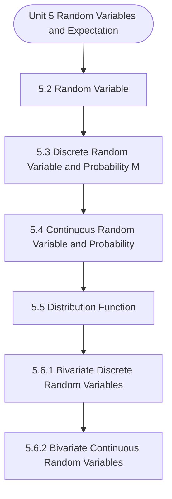

# MCS-066: Mathematical Foundations - II
## Unit 5: Random Variables and Expectation

> 📚 **Programme:** M.Sc. (Data Science and Analytics) | **Semester:** Semester 2  
> ⏱️ **Estimated Study Time:** ~80 mins | 📄 **Textbook Pages:** 38 Pages  
> 📥 **Original PDF:** [Download & View Authentic Textbook](../../../pdfs/Semester_2/MCS-066_Mathematical_Foundations_-_II/Unit-5_Random_Variables_and_Expectation.pdf)

---

### 🎯 Executive Concept & Data Science Relevance
In modern data systems and advanced analytics, **Random Variables and Expectation** forms a vital conceptual pillar. Probability is the mathematical calculus of uncertainty. Every machine learning classification model outputs a conditional probability $P(Y=c \mid X=\mathbf{x})$, and Bayesian modeling updates prior beliefs based on empirical evidence.

> [!NOTE]
> **Why this matters for your career:** Mastering random variables and expectation equips you with the foundational principles required to reason mathematically about high-dimensional datasets, evaluate algorithm performance, and avoid statistical pitfalls in production machine learning pipelines.

### 🗺️ Visual Knowledge Architecture
The following concept map illustrates the structural hierarchy and learning trajectory of this module:



### 📖 Core Definitions & Terminology Cards

> 📌 **Conditional Probability $P(A \mid B)$**  
> - **Formal Definition:** The probability of event $A$ occurring given that event $B$ has already occurred: $P(A \mid B) = \frac{P(A \cap B)}{P(B)}$, defined for $P(B) > 0$.  
> - 💡 **Practical Intuition & Analogy:** *Updating the likelihood of fraud given that a transaction occurred in an unusual country.*

> 📌 **Independent Events**  
> - **Formal Definition:** Events $A$ and $B$ are independent if the occurrence of one does not affect the other: $P(A \cap B) = P(A)P(B)$, or equivalently $P(A \mid B) = P(A)$.  
> - 💡 **Practical Intuition & Analogy:** *Coin tosses: Getting heads on flip 1 gives zero information about flip 2.*

> 📌 **Random Variable $X$**  
> - **Formal Definition:** A real-valued function $X: \Omega \to \mathbb{R}$ mapping outcomes of a random sample space $\Omega$ to real numbers. Can be discrete or continuous.  
> - 💡 **Practical Intuition & Analogy:** *Counting customer website visits per hour or measuring response latency in milliseconds.*

> 📌 **Mathematical Expectation $E[X]$**  
> - **Formal Definition:** The probability-weighted average value of a random variable: $E[X] = \sum x_i P(X = x_i)$ for discrete, or $\int_{-\infty}^\infty x f(x)dx$ for continuous.  
> - 💡 **Practical Intuition & Analogy:** *Long-run average payout of a game of chance.*

### ⚡ Governing Mathematical Laws & Formula Cheatsheet
#### 🔹 Bayes' Theorem
$$
P(B_i \mid A) = \frac{P(A \mid B_i) P(B_i)}{\sum_{j=1}^k P(A \mid B_j) P(B_j)} = \frac{P(A \mid B_i) P(B_i)}{P(A)}
$$
- **Explanation:** Calculates posterior probability by multiplying prior probability by likelihood, normalized by marginal evidence.

#### 🔹 Variance of a Random Variable
$$
\text{Var}(X) = E[X^2] - (E[X])^2
$$
- **Explanation:** Measures spread around the expected value. For constants: $\text{Var}(aX + b) = a^2 \text{Var}(X)$.

#### 🔹 Binomial Distribution PMF
$$
\begin{aligned} P(X = k) & = \binom{n}{k} p^k (1 - p)^{n - k} \\ E[X] & = np, \quad \text{Var}(X) = np(1 - p) \end{aligned}
$$
- **Explanation:** Models $k$ successes in $n$ independent Bernoulli trials with success probability $p$.

#### 🔹 Poisson Distribution PMF
$$
\begin{aligned} P(X = k) & = \frac{\lambda^k e^{-\lambda}}{k!} \\ E[X] & = \lambda, \quad \text{Var}(X) = \lambda \end{aligned}
$$
- **Explanation:** Models counts of rare independent events occurring in a fixed interval at constant average rate $\lambda$.

#### 🔹 Normal (Gaussian) Distribution PDF
$$
\begin{aligned} f(x) & = \frac{1}{\sigma \sqrt{2\pi}} e^{-\frac{1}{2}\left(\frac{x - \mu}{\sigma}\right)^2} \\ Z & = \frac{X - \mu}{\sigma} \sim \mathcal{N}(0, 1) \end{aligned}
$$
- **Explanation:** Symmetric bell-shaped curve governed entirely by mean $\mu$ and standard deviation $\sigma$.

### ⚖️ Axiomatic Properties & Governing Laws
The mathematical formulations of this module are anchored by foundational algebraic and structural laws:

- **Law of Total Probability:** $P(A) = \sum_{i=1}^k P(A \mid B_i) P(B_i)$
- **Linearity of Expectation:** $E[aX + bY] = aE[X] + bE[Y] \quad (\text{always holds})$
- **Variance of Sum:** $\text{Var}(X + Y) = \text{Var}(X) + \text{Var}(Y) + 2\text{Cov}(X, Y)$

### 📌 Comprehensive Section-by-Section Study Breakdown
#### `5.2` Random Variable

##### 📘 Theoretical Principles & Pedagogical Exposition
Expectation Observe that a probability can be assigned to the event that X assumes a particular value. It can also be observed that the sum of the probabilities corresponding to different values of X is one. So, a random variable can be defined as below: Definition: A random variable is a real-valued function whose domain is a set of possible outcomes of a random experiment and range is a sub-set of the set of real numbers and has the following properties: i) Each particular value of the random variable can be assigned some probability ii) Uniting all the probabilities associated with all the different values of the random variable gives the value 1(unity).

Remark 1: We shall denote random variables by capital letters like X, Y, Z, etc. for random variable.


##### ⚙️ Mathematical & Algorithmic Mechanics
- **Core Mechanism:** Probability measure satisfying Kolmogorov axioms: $P(S)=1, P(A) \ge 0$, and countable additivity. Bayes' Theorem computes posterior probability: $P(A \mid B) = \frac{P(B \mid A)P(A)}{P(B)}$. Variance measures dispersion: $\text{Var}(X) = \mathbb{E}[X^2] - (\mathbb{E}[X])^2$.
- **Boundary Conditions:** Zero probability conditioning events ($P(B) = 0$), distinguishing mutually exclusive events ($A \cap B = \emptyset$) from independent events ($P(A \cap B) = P(A)P(B)$), and heavy-tailed infinite variance.

##### 📊 Practical Data Science & Production Relevance
- **Production Workflow:** A/B test statistical significance, Naive Bayes spam classifiers, Bayesian hyperparameter optimization, and stochastic risk quantification in financial algorithms.
- **Real-World Pitfall:** Confusing conditional probability $P(A \mid B)$ with $P(B \mid A)$ (the Prosecutor's Fallacy), or falsely assuming independence between correlated feature variables.

> [!TIP]
> **Exam & Technical Interview Insight:** Calculate conditional probabilities using the Law of Total Probability and Bayes' Theorem; calculate expectation $\mathbb{E}[X]$ and variance for discrete and continuous random variables.

#### `5.3` Discrete Random Variable and Probability Mass Function

##### 📘 Theoretical Principles & Pedagogical Exposition
DISCRETE RANDOM VARIABLE AND PROBABILITY MASS FUNCTION Discrete Random Variable A random variable is said to be discrete if it has either a finite or a countable number of values. Countable number of values means the values which can be arranged in a sequence, i.e. the values which have one-to-one correspondence with the set of natural numbers, i.e., on the basis of three or four successive known terms, we can catch a rule and hence can write the subsequent terms.

For example, suppose X is a random variable taking the values say 2, 5, 8, 11, … then we can write the fifth, sixth, … values, because the values have one-to-one correspondence with the set of natural numbers and have the general term as 3n −1, i.e. on taking n = 1, 2, 3, 4, 5, … we have 2, 5, 8, 11, 14,….

So, X in this example is a discrete random variable. The number of students present each day in a class during an academic session is an example of discrete random variable as the number cannot take a fractional value. Probability Mass Function Let X be a r.v. which takes the values x1, x2, ...


##### ⚙️ Mathematical & Algorithmic Mechanics
- **Core Mechanism:** A function $f: A \to B$ maps each domain element to exactly one codomain element. Injections guarantee unique mappings ($f(a)=f(b) \implies a=b$); surjections cover the entire codomain; bijections admit two-sided inverses $f^{-1}: B \to A$.
- **Boundary Conditions:** Division by zero singularities, non-injective hash collisions in hash tables, and undefined out-of-domain evaluation.

##### 📊 Practical Data Science & Production Relevance
- **Production Workflow:** Feature transformations $X \mapsto \phi(X)$, hash functions in distributed partitions, non-linear activation functions (ReLU, Sigmoid, Softmax), and invertible normalizing flows.
- **Real-World Pitfall:** Applying inverse transformations to non-injective functions, creating multi-valued ambiguities or silent data destruction.

> [!TIP]
> **Exam & Technical Interview Insight:** In exams, demonstrate injectivity by showing $f(x_1) = f(x_2) \implies x_1 = x_2$, and surjectivity by expressing domain variable $x$ in terms of codomain target $y$.

#### `5.4` Continuous Random Variable and Probability Density Function

##### 📘 Theoretical Principles & Pedagogical Exposition
CONTINUOUS RANDOM VARIABLE AND PROBABILITY DENSITY FUNCTION In Sec. 5.3 of this unit, we have defined the discrete random variable as a random variable having countable number of values, i.e. whose values can be arranged in a sequence. But, if a random variable is such that its values cannot be arranged in a sequence, it is called continuous random variable.

Temperature of a city at various points of time during a day is an example of continuous random variable as the temperature takes uncountable values, i.e. it can take fractional values also. So, a random variable is said to be continuous if it can take all possible real (i.e. integer as well as fractional) values between two certain limits.

For example, let us denote the variable, “Difference between the rainfall (in cm) of a city and that of another city on every rainy day in a rainy season”, by X, then X here is a continuous random variable as it can take any real value between two certain limits. It can be noticed that for a continuous random variable, the chance of occurrence of a particular value of the variable is very small, so instead of specifying the probability of taking a particular value by the variable, we specify the probability of its lying within an interval.


##### ⚙️ Mathematical & Algorithmic Mechanics
- **Core Mechanism:** A function $f: A \to B$ maps each domain element to exactly one codomain element. Injections guarantee unique mappings ($f(a)=f(b) \implies a=b$); surjections cover the entire codomain; bijections admit two-sided inverses $f^{-1}: B \to A$.
- **Boundary Conditions:** Division by zero singularities, non-injective hash collisions in hash tables, and undefined out-of-domain evaluation.

##### 📊 Practical Data Science & Production Relevance
- **Production Workflow:** Feature transformations $X \mapsto \phi(X)$, hash functions in distributed partitions, non-linear activation functions (ReLU, Sigmoid, Softmax), and invertible normalizing flows.
- **Real-World Pitfall:** Applying inverse transformations to non-injective functions, creating multi-valued ambiguities or silent data destruction.

> [!TIP]
> **Exam & Technical Interview Insight:** In exams, demonstrate injectivity by showing $f(x_1) = f(x_2) \implies x_1 = x_2$, and surjectivity by expressing domain variable $x$ in terms of codomain target $y$.

#### `5.5` Distribution Function

##### 📘 Theoretical Principles & Pedagogical Exposition
A function F defined for all values of a random variable X by F( x ) = P[X  x ] is called the distribution function. It is also known as the cumulative distribution function (c.d.f.) of X since it is the cumulative probability of X up to and including the value x. As X can take any real value, therefore the domain of the distribution function is set of real numbers and as F(x) is a probability value, therefore the range of the distribution function is [0, 1].

Remark 3: Here, X denotes the random variable and x represents a particular value of random variable. F( x ) may also be written as FX( x ), which means that it is a distribution function of random variable X. Discrete Distribution Function Distribution function of a discrete random variable is said to be discrete distribution function or cumulative distribution function (c.d.f.).

Let X be a discrete random variable taking the values x1, x2, x3, … with respective probabilities p1, p2, p3, … Then F( ix ) = P[X  ix ] = P[X = 1x ] + P[X = x ] + … + P[X = ix ] = p1 + p2 + ... The distribution function of X, in this case, is given as in the following table: X F(x) x1 p1 x2 p1 + p2 x3 p1 + p2 + p3 … … xi p1 + p2 + p3 +…+pi The value of F(x) corresponding to the last value of the random variable X is always 1, as it is the sum of all the probabilities.


##### ⚙️ Mathematical & Algorithmic Mechanics
- **Core Mechanism:** A function $f: A \to B$ maps each domain element to exactly one codomain element. Injections guarantee unique mappings ($f(a)=f(b) \implies a=b$); surjections cover the entire codomain; bijections admit two-sided inverses $f^{-1}: B \to A$.
- **Boundary Conditions:** Division by zero singularities, non-injective hash collisions in hash tables, and undefined out-of-domain evaluation.

##### 📊 Practical Data Science & Production Relevance
- **Production Workflow:** Feature transformations $X \mapsto \phi(X)$, hash functions in distributed partitions, non-linear activation functions (ReLU, Sigmoid, Softmax), and invertible normalizing flows.
- **Real-World Pitfall:** Applying inverse transformations to non-injective functions, creating multi-valued ambiguities or silent data destruction.

> [!TIP]
> **Exam & Technical Interview Insight:** In exams, demonstrate injectivity by showing $f(x_1) = f(x_2) \implies x_1 = x_2$, and surjectivity by expressing domain variable $x$ in terms of codomain target $y$.

#### `5.6.1` Bivariate Discrete Random Variables

##### 📘 Theoretical Principles & Pedagogical Exposition
Definition: Let X and Y be two discrete random variables defined on the sample space S of a random experiment then the function (X, Y) defined on the same sample space is called a two-dimensional discrete random variable. In other words, (X, Y) is a two-dimensional random variable if the possible values of (X, Y) are finite or countably infinite.

Here, each value of X and Y is represented as a point ( x, y) in the xy-plane. As an illustration, let us consider the following example: Let three balls b1, b2, b3 be placed randomly in three cells. The possible outcomes of placing the three balls in three cells are shown in Table 5.1.

Table 5.1: Possible Outcomes of Placing the Three Balls in Three Cells Arrangement Number Placement of the Balls in Cell 1 Cell 2 Cell 3 b1 b2 b3 b1 b3 b2 b2 b1 b3 b2 b3 b1 b3 b1 b2 b3 b2 b1 b1,b2 b3 - b1,b2 - b3 - b1,b2 b3 b1,b3 b2 - b1,b3 - b2 - b1,b3 b2 b2,b3 b1 - b2,b3 - b1 - b2,b3 b1 b1 b2,b3 - b1 - b2,b3 - b1 b2,b3 b2 b3,b1 - b2 - b3,b1 - b2 b3,b1 b3 b1,b2 - b3 - b1,b2 - b3 b1,b2 Random Variables Expectation b1,b2,b3 - - - b1,b2,b3 - - - b1,b2,b3 Now, let X denote the number of balls in Cell 1 and Y be the number of cells occupied.


##### ⚙️ Mathematical & Algorithmic Mechanics
- **Core Mechanism:** Probability measure satisfying Kolmogorov axioms: $P(S)=1, P(A) \ge 0$, and countable additivity. Bayes' Theorem computes posterior probability: $P(A \mid B) = \frac{P(B \mid A)P(A)}{P(B)}$. Variance measures dispersion: $\text{Var}(X) = \mathbb{E}[X^2] - (\mathbb{E}[X])^2$.
- **Boundary Conditions:** Zero probability conditioning events ($P(B) = 0$), distinguishing mutually exclusive events ($A \cap B = \emptyset$) from independent events ($P(A \cap B) = P(A)P(B)$), and heavy-tailed infinite variance.

##### 📊 Practical Data Science & Production Relevance
- **Production Workflow:** A/B test statistical significance, Naive Bayes spam classifiers, Bayesian hyperparameter optimization, and stochastic risk quantification in financial algorithms.
- **Real-World Pitfall:** Confusing conditional probability $P(A \mid B)$ with $P(B \mid A)$ (the Prosecutor's Fallacy), or falsely assuming independence between correlated feature variables.

> [!TIP]
> **Exam & Technical Interview Insight:** Calculate conditional probabilities using the Law of Total Probability and Bayes' Theorem; calculate expectation $\mathbb{E}[X]$ and variance for discrete and continuous random variables.

#### `5.6.2` Bivariate Continuous Random Variables

##### 📘 Theoretical Principles & Pedagogical Exposition
Definition: If X and Y are continuous random variables defined on the sample space S of a random experiment, then (X, Y) defined on the same sample space S is called bivariate continuous random variable if (X, Y) assigns a point in xy-plane defined on the sample space S. Notice that it (unlike discrete random Probability and Distributions variable) assumes values in some non-countable set.

Some examples of bivariate continuous random variables are: 1. A gun is aimed at a certain point (say origin of the coordinate system). Because of the random factors, suppose the actual hit point is any point (X, Y) in a circle of radius unity about the origin. Then (X, Y) assumes all the values in the circle ( )   x, y : x y +  i.e.

(X, Y) assumes all values corresponding to each and every point in the circular region as shown in Fig. Here, (X, Y) is bivariate continuous random variable. Assuming all values in the rectangle, represented as (X, Y) ( )   x, y :a x b,c y d     is a bivariate continuous random variable.


##### ⚙️ Mathematical & Algorithmic Mechanics
- **Core Mechanism:** Probability measure satisfying Kolmogorov axioms: $P(S)=1, P(A) \ge 0$, and countable additivity. Bayes' Theorem computes posterior probability: $P(A \mid B) = \frac{P(B \mid A)P(A)}{P(B)}$. Variance measures dispersion: $\text{Var}(X) = \mathbb{E}[X^2] - (\mathbb{E}[X])^2$.
- **Boundary Conditions:** Zero probability conditioning events ($P(B) = 0$), distinguishing mutually exclusive events ($A \cap B = \emptyset$) from independent events ($P(A \cap B) = P(A)P(B)$), and heavy-tailed infinite variance.

##### 📊 Practical Data Science & Production Relevance
- **Production Workflow:** A/B test statistical significance, Naive Bayes spam classifiers, Bayesian hyperparameter optimization, and stochastic risk quantification in financial algorithms.
- **Real-World Pitfall:** Confusing conditional probability $P(A \mid B)$ with $P(B \mid A)$ (the Prosecutor's Fallacy), or falsely assuming independence between correlated feature variables.

> [!TIP]
> **Exam & Technical Interview Insight:** Calculate conditional probabilities using the Law of Total Probability and Bayes' Theorem; calculate expectation $\mathbb{E}[X]$ and variance for discrete and continuous random variables.

#### `5.8` Moments and Other Measures in Terms of Expectations

##### 📘 Theoretical Principles & Pedagogical Exposition
OF EXPECTATIONS In this section, we present basic definitions of the moments and other measures for a random variable in terms of expectations in the following section


##### ⚙️ Mathematical & Algorithmic Mechanics
- **Core Mechanism:** Probability measure satisfying Kolmogorov axioms: $P(S)=1, P(A) \ge 0$, and countable additivity. Bayes' Theorem computes posterior probability: $P(A \mid B) = \frac{P(B \mid A)P(A)}{P(B)}$. Variance measures dispersion: $\text{Var}(X) = \mathbb{E}[X^2] - (\mathbb{E}[X])^2$.
- **Boundary Conditions:** Zero probability conditioning events ($P(B) = 0$), distinguishing mutually exclusive events ($A \cap B = \emptyset$) from independent events ($P(A \cap B) = P(A)P(B)$), and heavy-tailed infinite variance.

##### 📊 Practical Data Science & Production Relevance
- **Production Workflow:** A/B test statistical significance, Naive Bayes spam classifiers, Bayesian hyperparameter optimization, and stochastic risk quantification in financial algorithms.
- **Real-World Pitfall:** Confusing conditional probability $P(A \mid B)$ with $P(B \mid A)$ (the Prosecutor's Fallacy), or falsely assuming independence between correlated feature variables.

> [!TIP]
> **Exam & Technical Interview Insight:** Calculate conditional probabilities using the Law of Total Probability and Bayes' Theorem; calculate expectation $\mathbb{E}[X]$ and variance for discrete and continuous random variables.

#### `5.8.1` Moments

##### 📘 Theoretical Principles & Pedagogical Exposition
The moments for probability distributions for the rth order moment about any point ‘A’ of a random variable X having probability mass function   ( ) i i i P X x p x p = = = is defined as ( ) n r i i ' i 1 r n i i 1 p x A p = = − =   ( ) n n r i i i i 1 i 1 p x A p = =   = − =       ฀ The above formula is valid if X is a discrete random variable.

But, if X is a continuous random variable having probability density function f(x), then rth order moment about A is defined as ( ) ( ) r ' r x A f x dx.  − = −  So, rth order moment about any point ‘A’ of a random variable X is defined as ( ) ( ) ( ) r i i i ' r r p x A , if X is a discreter.v.

x A f x dx, if X is a continousr.v  −  −  =   −    = E(X − A)r Similarly, rth order moment about mean () i.e. rth order central moment is defined as Probability and Distributions ( ) ( ) ( ) r i i i r r p x , if Xisa discreter.v. x f x dx, if Xisa continousr.v  −  −  =   −    = ( ) ( ) r r E X E X E X   − = −  


##### ⚙️ Mathematical & Algorithmic Mechanics
- **Core Mechanism:** Probability measure satisfying Kolmogorov axioms: $P(S)=1, P(A) \ge 0$, and countable additivity. Bayes' Theorem computes posterior probability: $P(A \mid B) = \frac{P(B \mid A)P(A)}{P(B)}$. Variance measures dispersion: $\text{Var}(X) = \mathbb{E}[X^2] - (\mathbb{E}[X])^2$.
- **Boundary Conditions:** Zero probability conditioning events ($P(B) = 0$), distinguishing mutually exclusive events ($A \cap B = \emptyset$) from independent events ($P(A \cap B) = P(A)P(B)$), and heavy-tailed infinite variance.

##### 📊 Practical Data Science & Production Relevance
- **Production Workflow:** A/B test statistical significance, Naive Bayes spam classifiers, Bayesian hyperparameter optimization, and stochastic risk quantification in financial algorithms.
- **Real-World Pitfall:** Confusing conditional probability $P(A \mid B)$ with $P(B \mid A)$ (the Prosecutor's Fallacy), or falsely assuming independence between correlated feature variables.

> [!TIP]
> **Exam & Technical Interview Insight:** Calculate conditional probabilities using the Law of Total Probability and Bayes' Theorem; calculate expectation $\mathbb{E}[X]$ and variance for discrete and continuous random variables.

### 📐 Step-by-Step Solved Mathematical Examples
To solidify your theoretical understanding, work through these fully solved, step-by-step mathematical problems:

#### 🧮 Example 1: Bayes' Theorem in Rare Event Detection
> **Problem Statement:**  
> A medical diagnostic test for a disease has Sensitivity $P(+ \mid D) = 0.95$ and Specificity $P(- \mid D^c) = 0.90$. The disease prevalence in population is $P(D) = 0.01$. If a patient tests positive, what is the probability they actually have the disease?

**Detailed Step-by-Step Solution:**

1. **Identify components:**
- Prior: $P(D) = 0.01 \implies P(D^c) = 0.99$
- Likelihood: $P(+ \mid D) = 0.95$
- False Positive Rate: $P(+ \mid D^c) = 1 - 0.90 = 0.10$

2. **Total Probability of testing positive:**

$$
P(+) = P(+ \mid D)P(D) + P(+ \mid D^c)P(D^c) = (0.95)(0.01) + (0.10)(0.99) = 0.0095 + 0.0990 = 0.1085
$$


3. **Posterior Probability via Bayes' Theorem:**

$$
P(D \mid +) = \frac{P(+ \mid D)P(D)}{P(+)} = \frac{0.0095}{0.1085} \approx 0.08755 \implies 8.76\%
$$


Insight: Despite 95% sensitivity, because the disease is rare, a positive test only implies an 8.76% probability of disease (Base Rate Fallacy).

#### 🧮 Example 2: Binomial Distribution Probability Calculation
> **Problem Statement:**  
> An automated testing suite runs $n = 5$ independent integration tests. Each test has failure rate $p = 0.1$. Calculate the probability that exactly 1 test fails.

**Detailed Step-by-Step Solution:**


$$
\begin{aligned} P(X = 1) & = \binom{5}{1} (0.1)^1 (0.9)^{5-1} \\ & = 5 \times 0.1 \times (0.9)^4 \\ & = 0.5 \times 0.6561 = 0.32805 \implies 32.81\% \end{aligned}
$$


### 💻 Practical Data Science Implementation (Python)
Theory translates directly into production algorithms. Below is a self-contained, commented Python implementation illustrating the core operations of this unit:

```python
import scipy.stats as stats

# Bayes Theorem Calculator
def bayes_posterior(prior, sensitivity, specificity):
    false_positive_rate = 1.0 - specificity
    p_evidence = (sensitivity * prior) + (false_positive_rate * (1 - prior))
    posterior = (sensitivity * prior) / p_evidence
    return posterior

prior_fraud = 0.02
sens = 0.98
spec = 0.95

p_fraud_given_flag = bayes_posterior(prior_fraud, sens, spec)
print(f"P(Fraud | System Flag): {p_fraud_given_flag * 100:.2f}%")
```

### 💡 Interactive Self-Assessment Checkpoints
Test your comprehension before proceeding. Tap each question to reveal the comprehensive explanation:

<details>
<summary><b>Checkpoint 1:</b> 2 bad articles are mixed with 5 good ones. Find the probability distribution of the number of bad articles, if 2 articles are drawn at random. ………………………………………………………………………… ………………………………………………………………………… 145 Random Variables Expectation <i>(Tap to reveal answer)</i></summary>

> **Answer & Analysis:**  
> **Detailed Analytical Solution:**
> 
> 1. **Core Principle:** Identify the governing theorem or definition for Random Variables and Expectation.
> 2. **Step-by-Step Derivation:** Verify all preconditions and compute intermediate steps methodically.
> 3. **Conclusion:** State the final mathematical proof or calculation clearly, validating boundary edge cases.
</details>

<details>
<summary><b>Checkpoint 2:</b> Given the probability distribution: Let Y = X2 + 2X. Find the probability distribution of Y. ………………………………………………………………………… ………………………………………………………………………… <i>(Tap to reveal answer)</i></summary>

> **Answer & Analysis:**  
> **Detailed Analytical Solution:**
> 
> 1. **Core Principle:** Identify the governing theorem or definition for Random Variables and Expectation.
> 2. **Step-by-Step Derivation:** Verify all preconditions and compute intermediate steps methodically.
> 3. **Conclusion:** State the final mathematical proof or calculation clearly, validating boundary edge cases.
</details>

<details>
<summary><b>Checkpoint 3:</b> An urn contains 3 white and 4 red balls. 3 balls are drawn one by one with replacement. Find the probability distribution of the number of red balls drawn. ………………………………………………………………………… ………………………………………………………………………… <i>(Tap to reveal answer)</i></summary>

> **Answer & Analysis:**  
> **Detailed Analytical Solution:**
> 
> 1. **Core Principle:** Identify the governing theorem or definition for Random Variables and Expectation.
> 2. **Step-by-Step Derivation:** Verify all preconditions and compute intermediate steps methodically.
> 3. **Conclusion:** State the final mathematical proof or calculation clearly, validating boundary edge cases.
</details>

<details>
<summary><b>Checkpoint 4:</b> A random variable X has the following probability distribution: X 0 1 2 3 4 5 6 7 8 p( x ) k 3k 5k 7k 9k 11k 13k 15k 17k (i) Determine the value of k. (ii) Find the distribution function of X. ………………………………………………………………………… ………………………………………………………………………… <i>(Tap to reveal answer)</i></summary>

> **Answer & Analysis:**  
> **Detailed Analytical Solution:**
> 
> 1. **Core Principle:** Identify the governing theorem or definition for Random Variables and Expectation.
> 2. **Step-by-Step Derivation:** Verify all preconditions and compute intermediate steps methodically.
> 3. **Conclusion:** State the final mathematical proof or calculation clearly, validating boundary edge cases.
</details>

<details>
<summary><b>Checkpoint 5:</b> State Bayes' Theorem formula for event hypothesis $H$ given evidence $E$. <i>(Tap to reveal answer)</i></summary>

> **Answer & Analysis:**  
> $P(H \mid E) = \frac{P(E \mid H)P(H)}{P(E)}$
</details>

<details>
<summary><b>Checkpoint 6:</b> What is the expected value and variance of a Binomial distribution $B(n, p)$? <i>(Tap to reveal answer)</i></summary>

> **Answer & Analysis:**  
> Mean $E[X] = np$, and Variance $\text{Var}(X) = np(1 - p)$.
</details>

### 🎯 Executive Module Wrap-Up
- **Central Idea:** Random Variables and Expectation provides essential mathematical and algorithmic tools directly utilized in Data Science.
- **Mathematical Rigor:** Formulas and laws must be memorized with attention to boundary conditions and assumptions.
- **Full Textbook Coverage:** For exhaustive multi-page derivations, proofs, and supplementary exercises, consult the [Authentic IGNOU Textbook](../../../pdfs/Semester_2/MCS-066_Mathematical_Foundations_-_II/Unit-5_Random_Variables_and_Expectation.pdf).

---
### 🧭 Navigation & Syllabus Index
[⬅ Previous: Unit 4](unit_04_Basics_of_Probability.md) | [📑 Course Index](README.md) | [Next: Unit 6 ➡](unit_06_Discrete_Probability_Distributions.md)
