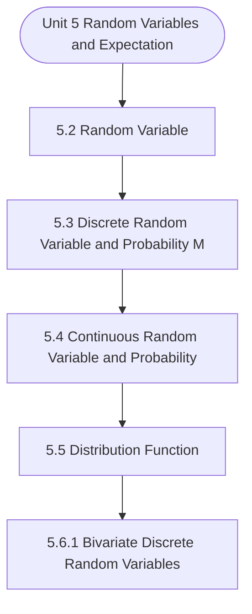

# MCS-066: Mathematical Foundations - II
## Unit 5: Random Variables and Expectation

> 📚 **Programme:** M.Sc. (Data Science and Analytics) | **Semester:** Semester 2  
> ⏱️ **Estimated Study Time:** ~80 mins | 📄 **Textbook Pages:** 38 Pages  
> 📥 **Original PDF:** [Download & View Textbook](../../../pdfs/Semester_2/MCS-066_Mathematical_Foundations_-_II/Unit-5_Random_Variables_and_Expectation.pdf)

---

### 🎯 Executive Concept & Data Science Relevance
In modern data systems, **Random Variables and Expectation** forms a vital conceptual pillar. Probability is the mathematical calculus of uncertainty. Every machine learning classification model outputs a conditional probability $P(Y=c \mid X=\mathbf{x})$, and Bayesian modeling updates prior beliefs based on empirical evidence.

> [!NOTE]
> **Why this matters for your career:** Mastering random variables and expectation equips you with the foundational principles required to reason mathematically about high-dimensional datasets, evaluate algorithm performance, and avoid statistical pitfalls in production machine learning pipelines.

### 🗺️ Visual Knowledge Architecture
The following concept map illustrates the structural hierarchy and learning trajectory of this module:

### 📖 Core Definitions & Terminology Cards

> 📌 **Conditional Probability $P(A \mid B)$**  
> - **Formal Definition:** The probability of event $A$ occurring given that event $B$ has already occurred: $P(A \mid B) = \frac{P(A \cap B)}{P(B)}$, defined for $P(B) > 0$.  
> - 💡 **Practical Intuition & Analogy:** *Updating the likelihood of fraud given that a transaction occurred in an unusual country.*

> 📌 **Independent Events**  
> - **Formal Definition:** Events $A$ and $B$ are independent if the occurrence of one does not affect the other: $P(A \cap B) = P(A)P(B)$, or equivalently $P(A \mid B) = P(A)$.  
> - 💡 **Practical Intuition & Analogy:** *Coin tosses: Getting heads on flip 1 gives zero information about flip 2.*

> 📌 **Random Variable $X$**  
> - **Formal Definition:** A real-valued function $X: \Omega \to \mathbb{R}$ mapping outcomes of a random sample space $\Omega$ to real numbers. Can be discrete or continuous.  
> - 💡 **Practical Intuition & Analogy:** *Counting customer website visits per hour or measuring response latency in milliseconds.*

> 📌 **Mathematical Expectation $E[X]$**  
> - **Formal Definition:** The probability-weighted average value of a random variable: $E[X] = \sum x_i P(X = x_i)$ for discrete, or $\int_{-\infty}^\infty x f(x)dx$ for continuous.  
> - 💡 **Practical Intuition & Analogy:** *Long-run average payout of a game of chance.*

### ⚡ Governing Mathematical Laws & Formula Cheatsheet
#### 🔹 Bayes' Theorem
$$
P(B_i \mid A) = \frac{P(A \mid B_i) P(B_i)}{\sum_{j=1}^k P(A \mid B_j) P(B_j)} = \frac{P(A \mid B_i) P(B_i)}{P(A)}
$$
- **Explanation:** Calculates posterior probability by multiplying prior probability by likelihood, normalized by marginal evidence.

#### 🔹 Variance of a Random Variable
$$
\text{Var}(X) = E[X^2] - (E[X])^2
$$
- **Explanation:** Measures spread around the expected value. For constants: $\text{Var}(aX + b) = a^2 \text{Var}(X)$.

#### 🔹 Binomial Distribution PMF
$$
\begin{aligned} P(X = k) & = \binom{n}{k} p^k (1 - p)^{n - k} \\ E[X] & = np, \quad \text{Var}(X) = np(1 - p) \end{aligned}
$$
- **Explanation:** Models $k$ successes in $n$ independent Bernoulli trials with success probability $p$.

#### 🔹 Poisson Distribution PMF
$$
\begin{aligned} P(X = k) & = \frac{\lambda^k e^{-\lambda}}{k!} \\ E[X] & = \lambda, \quad \text{Var}(X) = \lambda \end{aligned}
$$
- **Explanation:** Models counts of rare independent events occurring in a fixed interval at constant average rate $\lambda$.

#### 🔹 Normal (Gaussian) Distribution PDF
$$
\begin{aligned} f(x) & = \frac{1}{\sigma \sqrt{2\pi}} e^{-\frac{1}{2}\left(\frac{x - \mu}{\sigma}\right)^2} \\ Z & = \frac{X - \mu}{\sigma} \sim \mathcal{N}(0, 1) \end{aligned}
$$
- **Explanation:** Symmetric bell-shaped curve governed entirely by mean $\mu$ and standard deviation $\sigma$.

### 📌 Detailed Section-by-Section Study Breakdown
#### `5.2` Random Variable
- **Core Concept:** Establishes theoretical foundations, axiomatic formulations, and properties of random variable.
- **Core Concept:** Analyzes standard algorithmic workflows and mathematical transformations relevant to random variables and expectation.
- **Core Concept:** Applies computational bounds and optimization guarantees across data processing workflows.
- **Data Science Application:** Provides foundational structures used directly in statistical modeling, query execution, and machine learning pipelines.

> [!TIP]
> **Exam & Interview Tip:** Be prepared to state the formal definition of random variable and derive its primary equations step-by-step.

#### `5.3` Discrete Random Variable and Probability Mass Function
- **Core Concept:** the values which have one-to-one correspondence with the set of natural numbers, i.e., on the basis of three or four successive known terms, we can catch a rule and hence can write the subsequent terms.
- **Core Concept:** on taking n = 1, 2, 3, 4, 5, … we have 2, 5, 8, 11, 14,….
- **Core Concept:** So, X in this example is a discrete random variable.
- **Data Science Application:** Provides foundational structures used directly in statistical modeling, query execution, and machine learning pipelines.

> [!TIP]
> **Exam & Interview Tip:** Be prepared to state the formal definition of discrete random variable and probability mass function and derive its primary equations step-by-step.

#### `5.4` Continuous Random Variable and Probability Density Function
- **Core Concept:** whose values can be arranged in a sequence.
- **Core Concept:** But, if a random variable is such that its values cannot be arranged in a sequence, it is called continuous random variable.
- **Core Concept:** So, a random variable is said to be continuous if it can take all possible real (i.e.
- **Data Science Application:** Provides foundational structures used directly in statistical modeling, query execution, and machine learning pipelines.

> [!TIP]
> **Exam & Interview Tip:** Be prepared to state the formal definition of continuous random variable and probability density function and derive its primary equations step-by-step.

#### `5.5` Distribution Function
- **Core Concept:** A function F defined for all values of a random variable X by F( x ) = P[X  x ] is called the distribution function.
- **Core Concept:** It is also known as the cumulative distribution function (c.d.f.) of X since it is the cumulative probability of X up to and including the value x.
- **Core Concept:** As X can take any real value, therefore the domain of the distribution function is set of real numbers and as F(x) is a probability value, therefore the range of the distribution function is [0, 1].
- **Data Science Application:** Provides foundational structures used directly in statistical modeling, query execution, and machine learning pipelines.

> [!TIP]
> **Exam & Interview Tip:** Be prepared to state the formal definition of distribution function and derive its primary equations step-by-step.

#### `5.6.1` Bivariate Discrete Random Variables
- **Core Concept:** Definition: Let X and Y be two discrete random variables defined on the sample space S of a random experiment then the function (X, Y) defined on the same sample space is called a two-dimensional discrete random variable.
- **Core Concept:** In other words, (X, Y) is a two-dimensional random variable if the possible values of (X, Y) are finite or countably infinite.
- **Core Concept:** Here, each value of X and Y is represented as a point ( x, y) in the xy-plane.
- **Data Science Application:** Provides foundational structures used directly in statistical modeling, query execution, and machine learning pipelines.

> [!TIP]
> **Exam & Interview Tip:** Be prepared to state the formal definition of bivariate discrete random variables and derive its primary equations step-by-step.

#### `5.6.2` Bivariate Continuous Random Variables
- **Core Concept:** Some examples of bivariate continuous random variables are: 1.
- **Core Concept:** A gun is aimed at a certain point (say origin of the coordinate system).
- **Core Concept:** Because of the random factors, suppose the actual hit point is any point (X, Y) in a circle of radius unity about the origin.
- **Data Science Application:** Provides foundational structures used directly in statistical modeling, query execution, and machine learning pipelines.

> [!TIP]
> **Exam & Interview Tip:** Be prepared to state the formal definition of bivariate continuous random variables and derive its primary equations step-by-step.

### 💡 Interactive Self-Assessment Checkpoints
Test your comprehension before proceeding. Tap each question to reveal the comprehensive explanation:

<b>Checkpoint 1:</b> State Bayes' Theorem formula for event hypothesis $H$ given evidence $E$. <i>(Tap to reveal answer)</i>

> **Answer & Analysis:**  
> $P(H \mid E) = \frac{P(E \mid H)P(H)}{P(E)}$

<b>Checkpoint 2:</b> What is the expected value and variance of a Binomial distribution $B(n, p)$? <i>(Tap to reveal answer)</i>

> **Answer & Analysis:**  
> Mean $E[X] = np$, and Variance $\text{Var}(X) = np(1 - p)$.

<b>Checkpoint 3:</b> If $E[X] = 5$ and $E[X^2] = 34$, what is $\text{Var}(X)$? <i>(Tap to reveal answer)</i>

> **Answer & Analysis:**  
> $\text{Var}(X) = E[X^2] - (E[X])^2 = 34 - 5^2 = 34 - 25 = 9$.

<b>Checkpoint 4:</b> 2 bad articles are mixed with 5 good ones. Find the probability distribution of the number of bad articles, if <i>(Tap to reveal answer)</i>

> **Answer & Analysis:**  
> This question tests your conceptual mastery of Random Variables and Expectation. Review the governing formulas and section breakdowns above to formulate a complete, rigorous proof or derivation.

<b>Checkpoint 5:</b> Given the probability distribution: Let Y = X <i>(Tap to reveal answer)</i>

> **Answer & Analysis:**  
> This question tests your conceptual mastery of Random Variables and Expectation. Review the governing formulas and section breakdowns above to formulate a complete, rigorous proof or derivation.

<b>Checkpoint 6:</b> An urn contains 3 white and 4 red balls. 3 balls are drawn one by one with replacement. Find the probability distribution of the number of red balls drawn. ………………………………………………………………………… ………………………………………………………………………… <i>(Tap to reveal answer)</i>

> **Answer & Analysis:**  
> This question tests your conceptual mastery of Random Variables and Expectation. Review the governing formulas and section breakdowns above to formulate a complete, rigorous proof or derivation.

### 🎯 Executive Module Wrap-Up
- **Central Idea:** Random Variables and Expectation provides essential mathematical and algorithmic tools directly utilized in Data Science.
- **Mathematical Rigor:** Formulas and laws must be memorized with attention to boundary conditions and assumptions.
- **Full Textbook Coverage:** For exhaustive multi-page derivations, proofs, and supplementary exercises, consult the [Authentic IGNOU Textbook](../../../pdfs/Semester_2/MCS-066_Mathematical_Foundations_-_II/Unit-5_Random_Variables_and_Expectation.pdf).

---
### 🧭 Navigation & Syllabus Index
[⬅ Previous: Unit 4](unit_04_Basics_of_Probability.md) | [📑 Course Index](README.md) | [Next: Unit 6 ➡](unit_06_Discrete_Probability_Distributions.md)
