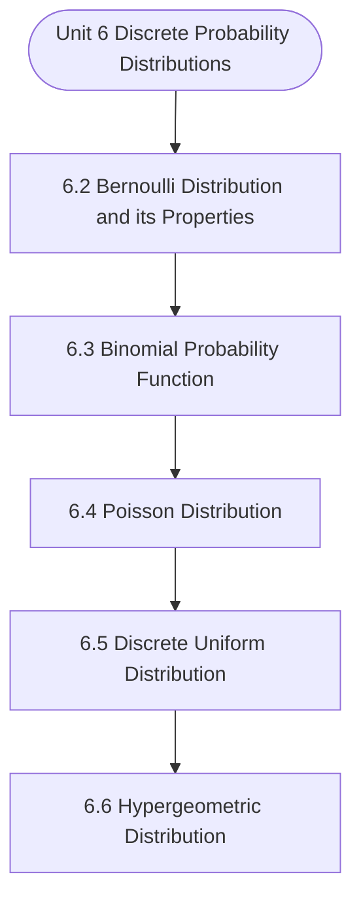

# MCS-066: Mathematical Foundations - II
## Unit 6: Discrete Probability Distributions

> 📚 **Programme:** M.Sc. (Data Science and Analytics) | **Semester:** Semester 2  
> ⏱️ **Estimated Study Time:** ~58 mins | 📄 **Textbook Pages:** 26 Pages  
> 📥 **Original PDF:** [Download & View Authentic Textbook](../../../pdfs/Semester_2/MCS-066_Mathematical_Foundations_-_II/Unit-6_Discrete_Probability_Distributions.pdf)

---

### 🎯 Executive Concept & Data Science Relevance
In modern data systems, **Discrete Probability Distributions** forms a vital conceptual pillar. Probability is the mathematical calculus of uncertainty. Every machine learning classification model outputs a conditional probability $P(Y=c \mid X=\mathbf{x})$, and Bayesian modeling updates prior beliefs based on empirical evidence.

> [!NOTE]
> **Why this matters for your career:** Mastering discrete probability distributions equips you with the foundational principles required to reason mathematically about high-dimensional datasets, evaluate algorithm performance, and avoid statistical pitfalls in production machine learning pipelines.

### 🗺️ Visual Knowledge Architecture
The following concept map illustrates the structural hierarchy and learning trajectory of this module:



### 📖 Core Definitions & Terminology Cards

> 📌 **Conditional Probability $P(A \mid B)$**  
> - **Formal Definition:** The probability of event $A$ occurring given that event $B$ has already occurred: $P(A \mid B) = \frac{P(A \cap B)}{P(B)}$, defined for $P(B) > 0$.  
> - 💡 **Practical Intuition & Analogy:** *Updating the likelihood of fraud given that a transaction occurred in an unusual country.*

> 📌 **Independent Events**  
> - **Formal Definition:** Events $A$ and $B$ are independent if the occurrence of one does not affect the other: $P(A \cap B) = P(A)P(B)$, or equivalently $P(A \mid B) = P(A)$.  
> - 💡 **Practical Intuition & Analogy:** *Coin tosses: Getting heads on flip 1 gives zero information about flip 2.*

> 📌 **Random Variable $X$**  
> - **Formal Definition:** A real-valued function $X: \Omega \to \mathbb{R}$ mapping outcomes of a random sample space $\Omega$ to real numbers. Can be discrete or continuous.  
> - 💡 **Practical Intuition & Analogy:** *Counting customer website visits per hour or measuring response latency in milliseconds.*

> 📌 **Mathematical Expectation $E[X]$**  
> - **Formal Definition:** The probability-weighted average value of a random variable: $E[X] = \sum x_i P(X = x_i)$ for discrete, or $\int_{-\infty}^\infty x f(x)dx$ for continuous.  
> - 💡 **Practical Intuition & Analogy:** *Long-run average payout of a game of chance.*

### ⚡ Governing Mathematical Laws & Formula Cheatsheet
#### 🔹 Bayes' Theorem
$$
P(B_i \mid A) = \frac{P(A \mid B_i) P(B_i)}{\sum_{j=1}^k P(A \mid B_j) P(B_j)} = \frac{P(A \mid B_i) P(B_i)}{P(A)}
$$
- **Explanation:** Calculates posterior probability by multiplying prior probability by likelihood, normalized by marginal evidence.

#### 🔹 Variance of a Random Variable
$$
\text{Var}(X) = E[X^2] - (E[X])^2
$$
- **Explanation:** Measures spread around the expected value. For constants: $\text{Var}(aX + b) = a^2 \text{Var}(X)$.

#### 🔹 Binomial Distribution PMF
$$
\begin{aligned} P(X = k) & = \binom{n}{k} p^k (1 - p)^{n - k} \\ E[X] & = np, \quad \text{Var}(X) = np(1 - p) \end{aligned}
$$
- **Explanation:** Models $k$ successes in $n$ independent Bernoulli trials with success probability $p$.

#### 🔹 Poisson Distribution PMF
$$
\begin{aligned} P(X = k) & = \frac{\lambda^k e^{-\lambda}}{k!} \\ E[X] & = \lambda, \quad \text{Var}(X) = \lambda \end{aligned}
$$
- **Explanation:** Models counts of rare independent events occurring in a fixed interval at constant average rate $\lambda$.

#### 🔹 Normal (Gaussian) Distribution PDF
$$
\begin{aligned} f(x) & = \frac{1}{\sigma \sqrt{2\pi}} e^{-\frac{1}{2}\left(\frac{x - \mu}{\sigma}\right)^2} \\ Z & = \frac{X - \mu}{\sigma} \sim \mathcal{N}(0, 1) \end{aligned}
$$
- **Explanation:** Symmetric bell-shaped curve governed entirely by mean $\mu$ and standard deviation $\sigma$.

### ⚖️ Axiomatic Properties & Governing Laws
The mathematical formulations of this module are anchored by foundational algebraic and structural laws:

- **Law of Total Probability:** $P(A) = \sum_{i=1}^k P(A \mid B_i) P(B_i)$
- **Linearity of Expectation:** $E[aX + bY] = aE[X] + bE[Y] \quad (\text{always holds})$
- **Variance of Sum:** $\text{Var}(X + Y) = \text{Var}(X) + \text{Var}(Y) + 2\text{Cov}(X, Y)$

### 📌 Comprehensive Section-by-Section Study Breakdown
#### `6.2` Bernoulli Distribution and its Properties
##### 📘 Theoretical Principles & In-Depth Exposition
The section on **Bernoulli Distribution and its Properties** establishes rigorous theoretical foundations necessary for advanced computational modeling. It introduces formal mathematical structures and symbolic notations that guarantee consistency across proofs and algorithms.

In the broader scope of **Discrete Probability Distributions**, understanding bernoulli distribution and its properties is essential to formalizing data representations, verifying boundary constraints, and ensuring computational determinism across multidimensional feature spaces.

##### ⚙️ Mathematical & Algorithmic Mechanics
- **Formal Mechanics:** Establishes symbolic transformations and state invariants governing bernoulli distribution and its properties.
- **Boundary Invariants:** Ensures robust error-handling, non-empty set guarantees, and strict asymptotic bounds.

##### 📊 Practical Data Science & Production Relevance
- **Industry Application:** Directly implemented in production workflows such as SQL query filters, pandas vectorized operations, and feature transformation pipelines.
- **Production Pitfall:** Failing to verify membership bounds or missing edge cases in bernoulli distribution and its properties can cause silent data corruption or performance bottlenecks.

> [!TIP]
> **Key Exam & Technical Interview Takeaway:** Be prepared to define bernoulli distribution and its properties formally, cite its core mathematical invariants, and solve step-by-step numerical/proof questions.

#### `6.3` Binomial Probability Function
##### 📘 Theoretical Principles & In-Depth Exposition
Here, is this section, we will discuss binomial distribution which was discovered by J. Bernoulli (1654-1705) and was first published eight years after his death i.e. in 1713 and is also known as “Bernoulli distribution for n trials”. Binomial distribution is applicable for a random experiment comprising a finite number (n) of independent Bernoulli trials having the constant probability of success for each trial.

Before defining binomial distribution, let us consider the following example: Suppose a man fires 3 times independently to hit a target. Let p be the probability of hitting the target (success) for each trial and ( ) q p = − be the probability of his failure. Let S denote the success and F the failure.

Let X be the number of successes in 3 trials, P[X = 0] = Probability that target is not hit at all in any trial = P [Failure in each of the three trials] ( ) P F F F =   = ( ) ( ) ( ) P F .P F .P F [฀trials are independent] q.q.q = q = This can be written as   3 0 P X C p q − = = Probability and Distributions [฀ 3 0 C 1, p 1, q q − = = = .

##### ⚙️ Mathematical & Algorithmic Mechanics
- **Formal Mechanics:** Establishes symbolic transformations and state invariants governing binomial probability function.
- **Boundary Invariants:** Ensures robust error-handling, non-empty set guarantees, and strict asymptotic bounds.

##### 📊 Practical Data Science & Production Relevance
- **Industry Application:** Directly implemented in production workflows such as SQL query filters, pandas vectorized operations, and feature transformation pipelines.
- **Production Pitfall:** Failing to verify membership bounds or missing edge cases in binomial probability function can cause silent data corruption or performance bottlenecks.

> [!TIP]
> **Key Exam & Technical Interview Takeaway:** Be prepared to define binomial probability function formally, cite its core mathematical invariants, and solve step-by-step numerical/proof questions.

#### `6.4` Poisson Distribution
##### 📘 Theoretical Principles & In-Depth Exposition
In case of binomial distributions, as discussed in the last section, we deal with events whose occurrences and non-occurrences are almost equally important. However, there may be events which do not occur as outcomes of a definite number of trials of an experiment but occur rarely at random points of time and for such events our interest lies only in the number of occurrences and not in its non-occurrences.

Examples of such events are: i) Our interest may lie in how many printing mistakes are there on each page of a book but we are not interested in counting the number of words without any printing mistake. ii) In production where control of quality is the major concern, it often requires counting the number of defects (and not the non-defects) per item.

iii) One may intend to know the number of accidents during a particular time interval. Under such situations, binomial distribution cannot be applied as the value of n is not definite and the probability of occurrence is very small. Other such situations can be thought of yourself.

##### ⚙️ Mathematical & Algorithmic Mechanics
- **Formal Mechanics:** Establishes symbolic transformations and state invariants governing poisson distribution.
- **Boundary Invariants:** Ensures robust error-handling, non-empty set guarantees, and strict asymptotic bounds.

##### 📊 Practical Data Science & Production Relevance
- **Industry Application:** Directly implemented in production workflows such as SQL query filters, pandas vectorized operations, and feature transformation pipelines.
- **Production Pitfall:** Failing to verify membership bounds or missing edge cases in poisson distribution can cause silent data corruption or performance bottlenecks.

> [!TIP]
> **Key Exam & Technical Interview Takeaway:** Be prepared to define poisson distribution formally, cite its core mathematical invariants, and solve step-by-step numerical/proof questions.

#### `6.5` Discrete Uniform Distribution
##### 📘 Theoretical Principles & In-Depth Exposition
Discrete uniform distribution can be conceived in practice if under the given experimental conditions, the different values of the random variable are equally likely. For example, the number on an unbiased die when thrown may be 1 or 2 or 3 or 4 or 5 or 6. These values of random variable, “the number on an unbiased die when thrown” are equally likely and for such an experiment, the discrete uniform distribution is appropriate.

Definition: A random variable X is said to have a discrete uniform (rectangular) distribution if it takes any positive integer value from 1 to n, and its probability mass function is given by   for x 1, 2, ...,n P X x n 0, otherwise.  =  = =   where n is called the parameter of the distribution.

For example, the random variable X, “the number on the unbiased die when thrown”, takes on the positive integer values from 1 to 6 follows discrete uniform distribution having the probability mass function.   1 , for x 1, 2, 3, 4, 5, 6. P X x 0 , otherwise.  =  = =   Mean and Variance of the Distribution Mean = E(X) = ( ) n x 1 x p x = n x 1 x.

##### ⚙️ Mathematical & Algorithmic Mechanics
- **Formal Mechanics:** Establishes symbolic transformations and state invariants governing discrete uniform distribution.
- **Boundary Invariants:** Ensures robust error-handling, non-empty set guarantees, and strict asymptotic bounds.

##### 📊 Practical Data Science & Production Relevance
- **Industry Application:** Directly implemented in production workflows such as SQL query filters, pandas vectorized operations, and feature transformation pipelines.
- **Production Pitfall:** Failing to verify membership bounds or missing edge cases in discrete uniform distribution can cause silent data corruption or performance bottlenecks.

> [!TIP]
> **Key Exam & Technical Interview Takeaway:** Be prepared to define discrete uniform distribution formally, cite its core mathematical invariants, and solve step-by-step numerical/proof questions.

#### `6.6` Hypergeometric Distribution
##### 📘 Theoretical Principles & In-Depth Exposition
In a discrete uniform probability distribution, the probability distribution is obtained for the possible outcomes in a single trial, however, if there are more than one but finite trials with only two possible outcomes in each trial, we apply some other distribution. One such distribution which is applicable in such a situation is binomial distribution.

The binomial distribution deals with finite and independent trials, each of which has exactly two possible outcomes (Success or Failure) with constant probability of success in each trial. For example, if we again consider the example of drawing ticket randomly from an urn containing 10 tickets bearing numbers from 1 to 10.

Then, the probability that the drawn ticket bears an odd number is 5 = . If we replace the ticket back, then the probability of drawing a ticket bearing an odd number is again 5 = . So, if we draw ticket again and again with replacement, trials become independent and X   P X x = Expected/Theoretical frequencies ( ) f x N.P[X x] 120.P[X x] = = = =  =  =  =  =  =  = Probability and Distributions probability of getting an odd number is same in each trial.

##### ⚙️ Mathematical & Algorithmic Mechanics
- **Formal Mechanics:** Establishes symbolic transformations and state invariants governing hypergeometric distribution.
- **Boundary Invariants:** Ensures robust error-handling, non-empty set guarantees, and strict asymptotic bounds.

##### 📊 Practical Data Science & Production Relevance
- **Industry Application:** Directly implemented in production workflows such as SQL query filters, pandas vectorized operations, and feature transformation pipelines.
- **Production Pitfall:** Failing to verify membership bounds or missing edge cases in hypergeometric distribution can cause silent data corruption or performance bottlenecks.

> [!TIP]
> **Key Exam & Technical Interview Takeaway:** Be prepared to define hypergeometric distribution formally, cite its core mathematical invariants, and solve step-by-step numerical/proof questions.

### 📐 Step-by-Step Solved Mathematical Examples
To solidify your theoretical understanding, work through these fully solved, step-by-step mathematical problems:

#### 🧮 Example 1: Bayes' Theorem in Rare Event Detection
> **Problem Statement:**  
> A medical diagnostic test for a disease has Sensitivity $P(+ \mid D) = 0.95$ and Specificity $P(- \mid D^c) = 0.90$. The disease prevalence in population is $P(D) = 0.01$. If a patient tests positive, what is the probability they actually have the disease?

**Detailed Step-by-Step Solution:**

1. **Identify components:**
- Prior: $P(D) = 0.01 \implies P(D^c) = 0.99$
- Likelihood: $P(+ \mid D) = 0.95$
- False Positive Rate: $P(+ \mid D^c) = 1 - 0.90 = 0.10$

2. **Total Probability of testing positive:**
$$
P(+) = P(+ \mid D)P(D) + P(+ \mid D^c)P(D^c) = (0.95)(0.01) + (0.10)(0.99) = 0.0095 + 0.0990 = 0.1085
$$

3. **Posterior Probability via Bayes' Theorem:**
$$
P(D \mid +) = \frac{P(+ \mid D)P(D)}{P(+)} = \frac{0.0095}{0.1085} \approx 0.08755 \implies 8.76\%
$$

Insight: Despite 95% sensitivity, because the disease is rare, a positive test only implies an 8.76% probability of disease (Base Rate Fallacy).

#### 🧮 Example 2: Binomial Distribution Probability Calculation
> **Problem Statement:**  
> An automated testing suite runs $n = 5$ independent integration tests. Each test has failure rate $p = 0.1$. Calculate the probability that exactly 1 test fails.

**Detailed Step-by-Step Solution:**

$$
\begin{aligned} P(X = 1) & = \binom{5}{1} (0.1)^1 (0.9)^{5-1} \\ & = 5 \times 0.1 \times (0.9)^4 \\ & = 0.5 \times 0.6561 = 0.32805 \implies 32.81\% \end{aligned}
$$

### 💻 Practical Data Science Implementation (Python)
Theory translates directly into production algorithms. Below is a self-contained, commented Python implementation illustrating the core operations of this unit:

```python
import scipy.stats as stats

# Bayes Theorem Calculator
def bayes_posterior(prior, sensitivity, specificity):
    false_positive_rate = 1.0 - specificity
    p_evidence = (sensitivity * prior) + (false_positive_rate * (1 - prior))
    posterior = (sensitivity * prior) / p_evidence
    return posterior

prior_fraud = 0.02
sens = 0.98
spec = 0.95

p_fraud_given_flag = bayes_posterior(prior_fraud, sens, spec)
print(f"P(Fraud | System Flag): {p_fraud_given_flag * 100:.2f}%")
```

### 💡 Interactive Self-Assessment Checkpoints
Test your comprehension before proceeding. Tap each question to reveal the comprehensive explanation:

<details>
<summary><b>Checkpoint 1:</b> State Bayes' Theorem formula for event hypothesis $H$ given evidence $E$. <i>(Tap to reveal answer)</i></summary>

> **Answer & Analysis:**  
> $P(H \mid E) = \frac{P(E \mid H)P(H)}{P(E)}$
</details>

<details>
<summary><b>Checkpoint 2:</b> What is the expected value and variance of a Binomial distribution $B(n, p)$? <i>(Tap to reveal answer)</i></summary>

> **Answer & Analysis:**  
> Mean $E[X] = np$, and Variance $\text{Var}(X) = np(1 - p)$.
</details>

<details>
<summary><b>Checkpoint 3:</b> If $E[X] = 5$ and $E[X^2] = 34$, what is $\text{Var}(X)$? <i>(Tap to reveal answer)</i></summary>

> **Answer & Analysis:**  
> $\text{Var}(X) = E[X^2] - (E[X])^2 = 34 - 5^2 = 34 - 25 = 9$.
</details>

<details>
<summary><b>Checkpoint 4:</b> The probability of a man hitting a target <i>(Tap to reveal answer)</i></summary>

> **Answer & Analysis:**  
> This question tests your conceptual mastery of Discrete Probability Distributions. Review the governing formulas and section breakdowns above to formulate a complete, rigorous proof or derivation.
</details>

<details>
<summary><b>Checkpoint 5:</b> A policeman fires 6 bullets on a dacoit. The probability that the dacoit will be killed by a bullet is <i>(Tap to reveal answer)</i></summary>

> **Answer & Analysis:**  
> This question tests your conceptual mastery of Discrete Probability Distributions. Review the governing formulas and section breakdowns above to formulate a complete, rigorous proof or derivation.
</details>

<details>
<summary><b>Checkpoint 6:</b> 6. What is the probability that the dacoit is still alive? <i>(Tap to reveal answer)</i></summary>

> **Answer & Analysis:**  
> This question tests your conceptual mastery of Discrete Probability Distributions. Review the governing formulas and section breakdowns above to formulate a complete, rigorous proof or derivation.
</details>

### 🎯 Executive Module Wrap-Up
- **Central Idea:** Discrete Probability Distributions provides essential mathematical and algorithmic tools directly utilized in Data Science.
- **Mathematical Rigor:** Formulas and laws must be memorized with attention to boundary conditions and assumptions.
- **Full Textbook Coverage:** For exhaustive multi-page derivations, proofs, and supplementary exercises, consult the [Authentic IGNOU Textbook](../../../pdfs/Semester_2/MCS-066_Mathematical_Foundations_-_II/Unit-6_Discrete_Probability_Distributions.pdf).

---
### 🧭 Navigation & Syllabus Index
[⬅ Previous: Unit 5](unit_05_Random_Variables_and_Expectation.md) | [📑 Course Index](README.md) | [Next: Unit 7 ➡](unit_07_Continuous_Probability_Distributions_and_Exact_Sam.md)
