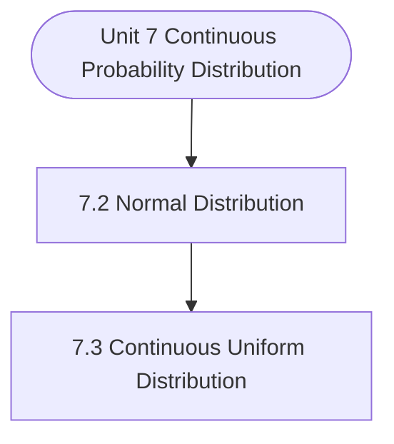

# MCS-066: Mathematical Foundations - II
## Unit 7: Continuous Probability Distributions and Exact Sampling Distributions

> 📚 **Programme:** M.Sc. (Data Science and Analytics) | **Semester:** Semester 2  
> ⏱️ **Estimated Study Time:** ~48 mins | 📄 **Textbook Pages:** 26 Pages  
> 📥 **Original PDF:** [Download & View Authentic Textbook](../../../pdfs/Semester_2/MCS-066_Mathematical_Foundations_-_II/Unit-7_Continuous_Probability_Distributions_and_Exact_Sampling_Distributions.pdf)

---

### 🎯 Executive Concept & Data Science Relevance
In modern data systems and advanced analytics, **Continuous Probability Distributions and Exact Sampling Distributions** forms a vital conceptual pillar. Statistical inference bridges sample data to population reality. In A/B testing, feature significance testing, and model benchmarking, hypothesis tests determine whether performance gains are statistically significant or merely random fluctuations.

> [!NOTE]
> **Why this matters for your career:** Mastering continuous probability distributions and exact sampling distributions equips you with the foundational principles required to reason mathematically about high-dimensional datasets, evaluate algorithm performance, and avoid statistical pitfalls in production machine learning pipelines.

### 🗺️ Visual Knowledge Architecture
The following concept map illustrates the structural hierarchy and learning trajectory of this module:



### 📖 Core Definitions & Terminology Cards

> 📌 **Central Limit Theorem (CLT)**  
> - **Formal Definition:** For any population with mean $\mu$ and finite variance $\sigma^2$, the sampling distribution of sample mean $\bar{X}$ approaches a Normal distribution $\mathcal{N}(\mu, \sigma^2/n)$ as sample size $n \to \infty$, regardless of population shape.  
> - 💡 **Practical Intuition & Analogy:** *Averages of independent random variables always look Gaussian in large samples ( $n \ge 30$ ).*

> 📌 **Standard Error (SE)**  
> - **Formal Definition:** The standard deviation of the sampling distribution of a statistic: $\text{SE}(\bar{X}) = \frac{\sigma}{\sqrt{n}}$ (or $\frac{s}{\sqrt{n}}$ when $\sigma$ is unknown).  
> - 💡 **Practical Intuition & Analogy:** *Uncertainty of your sample estimate: larger sample sizes dramatically reduce estimation error.*

> 📌 **Null ($H_0$) and Alternative ($H_1$) Hypotheses**  
> - **Formal Definition:** $H_0$ represents the baseline status quo of no effect or no difference. $H_1$ represents the research claim of a true non-zero effect.  
> - 💡 **Practical Intuition & Analogy:** *In a courtroom: $H_0$ is presumed innocent; $H_1$ is guilty upon convincing evidence.*

> 📌 **Type I Error ( $\alpha$ ) and Type II Error ( $\beta$ )**  
> - **Formal Definition:** Type I error is rejecting true $H_0$ (false positive, rate $\alpha$). Type II error is failing to reject false $H_0$ (false negative, rate $\beta$). Statistical power is $1 - \beta$.  
> - 💡 **Practical Intuition & Analogy:** *Type I: Innocent person convicted. Type II: Guilty person acquitted.*

### ⚡ Governing Mathematical Laws & Formula Cheatsheet
#### 🔹 Confidence Interval for Population Mean
$$
\bar{x} \pm z_{\alpha/2} \left(\frac{\sigma}{\sqrt{n}}\right) \quad \text{or} \quad \bar{x} \pm t_{\alpha/2, n-1} \left(\frac{s}{\sqrt{n}}\right)
$$
- **Explanation:** Interval providing $1-\alpha$ confidence of containing true population parameter $\mu$.

#### 🔹 One-Sample Z-Test Statistic
$$
Z = \frac{\bar{x} - \mu_0}{\sigma / \sqrt{n}} \sim \mathcal{N}(0, 1)
$$
- **Explanation:** Used when population standard deviation $\sigma$ is known and sample size is large.

#### 🔹 One-Sample Student's t-Test Statistic
$$
t = \frac{\bar{x} - \mu_0}{s / \sqrt{n}} \sim t_{n-1}
$$
- **Explanation:** Used when population $\sigma$ is unknown and estimated using sample standard deviation $s$.

#### 🔹 Chi-Square Test of Independence Statistic
$$
\chi^2 = \sum_{i=1}^r \sum_{j=1}^c \frac{(O_{ij} - E_{ij})^2}{E_{ij}} \quad \text{where } E_{ij} = \frac{R_i \times C_j}{N}
$$
- **Explanation:** Tests whether two categorical attributes are statistically independent, with degrees of freedom $(r-1)(c-1)$.

#### 🔹 One-Way ANOVA F-Ratio Statistic
$$
F = \frac{\text{MS}_{\text{between}}}{\text{MS}_{\text{within}}} = \frac{\text{SSB} / (k - 1)}{\text{SSW} / (N - k)}
$$
- **Explanation:** Compares variance between $k$ group means against variance within groups to test equality of multiple population means.

### ⚖️ Axiomatic Properties & Governing Laws
The mathematical formulations of this module are anchored by foundational algebraic and structural laws:

- **Decision Rule:** $p\text{-value} < \alpha \implies \text{Reject } H_0$
- **Degrees of Freedom (t-Test):** $df = n - 1$
- **Degrees of Freedom (Chi-Square):** $df = (r - 1)(c - 1)$

### 📌 Comprehensive Section-by-Section Study Breakdown
#### `7.2` Normal Distribution

##### 📘 Theoretical Principles & Pedagogical Exposition
can be used as an approximation to most of the other distributions and hence is most important probability distribution in statistical analysis. Theory of estimation of population parameters and testing of hypotheses on the basis of sample statistics (to be discussed in the next unit) have also been developed using the concept of normal distribution as most of the sampling distributions tend to normality for large samples.

Normal distribution has become widely and uncritically accepted on the basis of much practical work. As a result, it holds a central position in Statistics. Let us now take some examples of writing the probability function of normal distribution when mean and variance are specified, and vice-versa.

Example 1: (i) If X ~ N (40, 25) then write down the p.d.f. of X (ii) If X ~ N (−36, 20) then write down the p.d.f. of X (iii) If X ~ N (0, 2) then write down the p.d.f. of X Solution: (i) Here we are given X ~ N (40, 25) in usual notations, we have =   0always  ฀ Now, the p.d.f.


##### ⚙️ Mathematical & Algorithmic Mechanics
- **Core Mechanism:** Probability measure satisfying Kolmogorov axioms: $P(S)=1, P(A) \ge 0$, and countable additivity. Bayes' Theorem computes posterior probability: $P(A \mid B) = \frac{P(B \mid A)P(A)}{P(B)}$. Variance measures dispersion: $\text{Var}(X) = \mathbb{E}[X^2] - (\mathbb{E}[X])^2$.
- **Boundary Conditions:** Zero probability conditioning events ($P(B) = 0$), distinguishing mutually exclusive events ($A \cap B = \emptyset$) from independent events ($P(A \cap B) = P(A)P(B)$), and heavy-tailed infinite variance.

##### 📊 Practical Data Science & Production Relevance
- **Production Workflow:** A/B test statistical significance, Naive Bayes spam classifiers, Bayesian hyperparameter optimization, and stochastic risk quantification in financial algorithms.
- **Real-World Pitfall:** Confusing conditional probability $P(A \mid B)$ with $P(B \mid A)$ (the Prosecutor's Fallacy), or falsely assuming independence between correlated feature variables.

> [!TIP]
> **Exam & Technical Interview Insight:** Calculate conditional probabilities using the Law of Total Probability and Bayes' Theorem; calculate expectation $\mathbb{E}[X]$ and variance for discrete and continuous random variables.

#### `7.3` Continuous Uniform Distribution

##### 📘 Theoretical Principles & Pedagogical Exposition
The uniform (or rectangular) distribution is a very simple distribution. It provides a useful model for a few random phenomena like having random number from the interval [0, 1], then one is thinking of the value of a uniformly distributed random variable over the interval [0, 1].

Definition: A random variable X is said to follow a continuous uniform (rectangular) distribution over an interval (a, b) if its probability density function is given by ( ) for a x b f x b a 0, otherwise     = −   The distribution is called uniform distribution since it assumes a constant (uniform) value for all x in (a, b).

If we draw the graph of y = f(x) over x-axis and between the ordinates x = a and x = b (say), it describes a rectangle as shown in Fig. 7.2 A uniform variate X on the interval (a, b) is written as X ~ U[a, b] Cumulative Distribution Function The cumulative distribution function of the uniform random variate over the interval (a, b) is given by: ( ) for x a x a F x for a x b b a for x b    −  =    −    On plotting its graph, we have a b Y b a − a b X Probability and Distributions Mean and Variance of Uniform Distribution Mean = a b + and Variance = ( ) b a − .


##### ⚙️ Mathematical & Algorithmic Mechanics
- **Core Mechanism:** Probability measure satisfying Kolmogorov axioms: $P(S)=1, P(A) \ge 0$, and countable additivity. Bayes' Theorem computes posterior probability: $P(A \mid B) = \frac{P(B \mid A)P(A)}{P(B)}$. Variance measures dispersion: $\text{Var}(X) = \mathbb{E}[X^2] - (\mathbb{E}[X])^2$.
- **Boundary Conditions:** Zero probability conditioning events ($P(B) = 0$), distinguishing mutually exclusive events ($A \cap B = \emptyset$) from independent events ($P(A \cap B) = P(A)P(B)$), and heavy-tailed infinite variance.

##### 📊 Practical Data Science & Production Relevance
- **Production Workflow:** A/B test statistical significance, Naive Bayes spam classifiers, Bayesian hyperparameter optimization, and stochastic risk quantification in financial algorithms.
- **Real-World Pitfall:** Confusing conditional probability $P(A \mid B)$ with $P(B \mid A)$ (the Prosecutor's Fallacy), or falsely assuming independence between correlated feature variables.

> [!TIP]
> **Exam & Technical Interview Insight:** Calculate conditional probabilities using the Law of Total Probability and Bayes' Theorem; calculate expectation $\mathbb{E}[X]$ and variance for discrete and continuous random variables.

### 📐 Step-by-Step Solved Mathematical Examples
To solidify your theoretical understanding, work through these fully solved, step-by-step mathematical problems:

#### 🧮 Example 1: One-Sample t-Test for Page Latency Benchmark
> **Problem Statement:**  
> An engineering team claims server latency is at most $\mu_0 = 200\text{ms}$. A sample of $n = 25$ runs yields sample mean $\bar{x} = 210\text{ms}$ and sample standard deviation $s = 20\text{ms}$. Test the claim at significance level $\alpha = 0.05$.

**Detailed Step-by-Step Solution:**

1. **Hypotheses:** $H_0: \mu \le 200\text{ms}$ vs $H_1: \mu > 200\text{ms}$ (One-tailed test).

2. **Standard Error:**

$$
\text{SE} = \frac{s}{\sqrt{n}} = \frac{20}{\sqrt{25}} = \frac{20}{5} = 4\text{ms}
$$


3. **Test Statistic:**

$$
t = \frac{\bar{x} - \mu_0}{\text{SE}} = \frac{210 - 200}{4} = 2.50
$$


4. **Critical Value ($df = 24, \alpha = 0.05$):** $t_{\text{crit}} = 1.711$.

5. **Conclusion:** Since $t = 2.50 > 1.711$, we **Reject $H_0$**. The latency is statistically significantly higher than 200ms.

#### 🧮 Example 2: 95% Confidence Interval Calculation
> **Problem Statement:**  
> Given sample size $n = 64$, sample mean $\bar{x} = 52.0$, and known $\sigma = 8.0$. Calculate the 95% Confidence Interval for population mean $\mu$.

**Detailed Step-by-Step Solution:**

For 95% confidence, $z_{0.025} = 1.96$:

$$
\text{Margin of Error} = z \frac{\sigma}{\sqrt{n}} = 1.96 \left(\frac{8}{\sqrt{64}}\right) = 1.96(1.0) = 1.96
$$


$$
\text{CI} = 52.0 \pm 1.96 = [50.04, 53.96]
$$


### 💻 Practical Data Science Implementation (Python)
Theory translates directly into production algorithms. Below is a self-contained, commented Python implementation illustrating the core operations of this unit:

```python
from scipy import stats
import numpy as np

# A/B Testing: Two-Sample t-Test
group_a = np.array([12.1, 14.5, 13.2, 12.8, 15.0, 13.9, 14.2]) # Control
group_b = np.array([15.2, 16.1, 14.8, 15.9, 17.0, 16.4, 15.8]) # Treatment

t_stat, p_val = stats.ttest_ind(group_a, group_b)

print(f"Group A Mean: {np.mean(group_a):.2f}")
print(f"Group B Mean: {np.mean(group_b):.2f}")
print(f"t-statistic: {t_stat:.4f} | p-value: {p_val:.5f}")

if p_val < 0.05:
    print("Result: Statistically significant uplift detected (Reject H0)!")
else:
    print("Result: Insufficient evidence to reject H0.")
```

### 💡 Interactive Self-Assessment Checkpoints
Test your comprehension before proceeding. Tap each question to reveal the comprehensive explanation:

<details>
<summary><b>Checkpoint 1:</b> Write down the p.d.f. of r. v. X in each of the following cases: (i) 1 4 X ~ N , 2 9       (ii) X ~ N ( 40,16) − <i>(Tap to reveal answer)</i></summary>

> **Answer & Analysis:**  
> **Detailed Analytical Solution:**
> 
> 1. **Core Principle:** Identify the governing theorem or definition for Continuous Probability Distributions and Exact Sampling Distributions.
> 2. **Step-by-Step Derivation:** Verify all preconditions and compute intermediate steps methodically.
> 3. **Conclusion:** State the final mathematical proof or calculation clearly, validating boundary edge cases.
</details>

<details>
<summary><b>Checkpoint 2:</b> Below, in each case, is given the p.d.f. of a normally distributed random variable. Obtain the parameters (mean and variance) of the variable. (i) 2 x 8 1 f(x)= e , x 2 2π − −  (ii) 2 1(x 2) 4 1 f(x)= e , x 2 π − − −  <i>(Tap to reveal answer)</i></summary>

> **Answer & Analysis:**  
> **Detailed Analytical Solution:**
> 
> 1. **Core Principle:** Identify the governing theorem or definition for Continuous Probability Distributions and Exact Sampling Distributions.
> 2. **Step-by-Step Derivation:** Verify all preconditions and compute intermediate steps methodically.
> 3. **Conclusion:** State the final mathematical proof or calculation clearly, validating boundary edge cases.
</details>

<details>
<summary><b>Checkpoint 3:</b> If X1 and X2 are two independent normal variates with means 30, 40 and variances 25, 35 respectively. Find the mean and variance of i) X1 + X2 ii) X1 – X2 207 Continuous Probability Distributions and Exact Sampling Distributions <i>(Tap to reveal answer)</i></summary>

> **Answer & Analysis:**  
> **Detailed Analytical Solution:**
> 
> 1. **Core Principle:** Identify the governing theorem or definition for Continuous Probability Distributions and Exact Sampling Distributions.
> 2. **Step-by-Step Derivation:** Verify all preconditions and compute intermediate steps methodically.
> 3. **Conclusion:** State the final mathematical proof or calculation clearly, validating boundary edge cases.
</details>

<details>
<summary><b>Checkpoint 4:</b> Suppose that X is uniformly distributed over (–a, a). Determine ‘a’ so that i)   1 P X 4 3  = ii)   3 P X 1 4  = <i>(Tap to reveal answer)</i></summary>

> **Answer & Analysis:**  
> **Detailed Analytical Solution:**
> 
> 1. **Core Principle:** Identify the governing theorem or definition for Continuous Probability Distributions and Exact Sampling Distributions.
> 2. **Step-by-Step Derivation:** Verify all preconditions and compute intermediate steps methodically.
> 3. **Conclusion:** State the final mathematical proof or calculation clearly, validating boundary edge cases.
</details>

<details>
<summary><b>Checkpoint 5:</b> What is the Central Limit Theorem and why is it crucial in Data Science? <i>(Tap to reveal answer)</i></summary>

> **Answer & Analysis:**  
> The CLT states that the sample mean $\bar{X}$ becomes approximately normally distributed with mean $\mu$ and variance $\sigma^2/n$ for large $n$, allowing parametric statistical inference even on skewed non-normal real-world data.
</details>

<details>
<summary><b>Checkpoint 6:</b> What is a p-value? <i>(Tap to reveal answer)</i></summary>

> **Answer & Analysis:**  
> The probability of obtaining a test statistic as extreme as, or more extreme than, the observed value, assuming the null hypothesis $H_0$ is strictly true. If $p < \alpha$, reject $H_0$.
</details>

### 🎯 Executive Module Wrap-Up
- **Central Idea:** Continuous Probability Distributions and Exact Sampling Distributions provides essential mathematical and algorithmic tools directly utilized in Data Science.
- **Mathematical Rigor:** Formulas and laws must be memorized with attention to boundary conditions and assumptions.
- **Full Textbook Coverage:** For exhaustive multi-page derivations, proofs, and supplementary exercises, consult the [Authentic IGNOU Textbook](../../../pdfs/Semester_2/MCS-066_Mathematical_Foundations_-_II/Unit-7_Continuous_Probability_Distributions_and_Exact_Sampling_Distributions.pdf).

---
### 🧭 Navigation & Syllabus Index
[⬅ Previous: Unit 6](unit_06_Discrete_Probability_Distributions.md) | [📑 Course Index](README.md) | [Next: Unit 8 ➡](unit_08_Sampling_Distribution.md)
