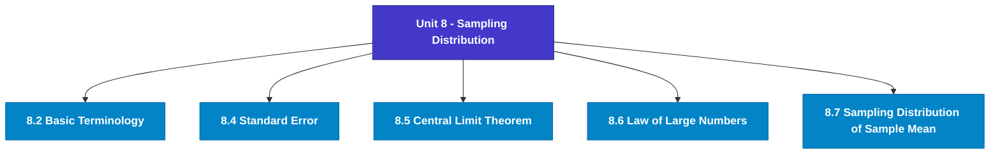

# MCS-066: Mathematical Foundations - II
## Unit 8: Sampling Distribution

> 📚 **Programme:** M.Sc. (Data Science and Analytics) | **Semester:** Semester 2  
> ⏱️ **Estimated Study Time:** ~61 mins | 📄 **Textbook Pages:** 26 Pages  
> 📥 **Original PDF:** [Download & View Textbook](../../../pdfs/Semester_2/MCS-066_Mathematical_Foundations_-_II/Unit-8_Sampling_Distribution.pdf)

---

### 🎯 Executive Concept & Data Science Relevance
In modern data systems, **Sampling Distribution** forms a vital conceptual pillar. Probability is the mathematical calculus of uncertainty. Every machine learning classification model outputs a conditional probability $P(Y=c \mid X=\mathbf{x})$, and Bayesian modeling updates prior beliefs based on empirical evidence.

> [!NOTE]
> **Why this matters for your career:** Mastering sampling distribution equips you with the foundational principles required to reason mathematically about high-dimensional datasets, evaluate algorithm performance, and avoid statistical pitfalls in production machine learning pipelines.

### 🗺️ Visual Knowledge Architecture
The following concept map illustrates the structural hierarchy and learning trajectory of this module:

### 📖 Core Definitions & Terminology Cards
| Term | Formal Mathematical / Technical Definition | Intuitive Analogy / Concrete Example |
| :--- | :--- | :--- |
| **Conditional Probability $P(A \mid B)$** | The probability of event $A$ occurring given that event $B$ has already occurred: $P(A \mid B) = \frac{P(A \cap B)}{P(B)}$, defined for $P(B) > 0$. | *Updating the likelihood of fraud given that a transaction occurred in an unusual country.* |
| **Independent Events** | Events $A$ and $B$ are independent if the occurrence of one does not affect the other: $P(A \cap B) = P(A)P(B)$, or equivalently $P(A \mid B) = P(A)$. | *Coin tosses: Getting heads on flip 1 gives zero information about flip 2.* |
| **Random Variable $X$** | A real-valued function $X: \Omega \to \mathbb{R}$ mapping outcomes of a random sample space $\Omega$ to real numbers. Can be discrete or continuous. | *Counting customer website visits per hour or measuring response latency in milliseconds.* |
| **Mathematical Expectation $E[X]$** | The probability-weighted average value of a random variable: $E[X] = \sum x_i P(X = x_i)$ for discrete, or $\int_{-\infty}^\infty x f(x)dx$ for continuous. | *Long-run average payout of a game of chance.* |

### ⚡ Governing Mathematical Laws & Formula Cheatsheet
#### 🔹 Bayes' Theorem

$$
P(B_i \mid A) = \frac{P(A \mid B_i) P(B_i)}{\sum_{j=1}^k P(A \mid B_j) P(B_j)} = \frac{P(A \mid B_i) P(B_i)}{P(A)}
$$

- **Explanation:** Calculates posterior probability by multiplying prior probability by likelihood, normalized by marginal evidence.

#### 🔹 Variance of a Random Variable

$$
\text{Var}(X) = E[X^2] - (E[X])^2
$$

- **Explanation:** Measures spread around the expected value. For constants: $\text{Var}(aX + b) = a^2 \text{Var}(X)$.

#### 🔹 Binomial Distribution PMF

$$
P(X = k) = \binom{n}{k} p^k (1 - p)^{n - k}, \quad E[X] = np, \; \text{Var}(X) = np(1 - p)
$$

- **Explanation:** Models $k$ successes in $n$ independent Bernoulli trials with success probability $p$.

#### 🔹 Poisson Distribution PMF

$$
P(X = k) = \frac{\lambda^k e^{-\lambda}}{k!}, \quad E[X] = \lambda, \; \text{Var}(X) = \lambda
$$

- **Explanation:** Models counts of rare independent events occurring in a fixed interval at constant average rate $\lambda$.

#### 🔹 Normal (Gaussian) Distribution PDF

$$
f(x) = \frac{1}{\sigma \sqrt{2\pi}} e^{-\frac{1}{2}\left(\frac{x - \mu}{\sigma}\right)^2}, \quad Z = \frac{X - \mu}{\sigma} \sim \mathcal{N}(0, 1)
$$

- **Explanation:** Symmetric bell-shaped curve governed entirely by mean $\mu$ and standard deviation $\sigma$.

### 📌 Detailed Section-by-Section Study Breakdown
#### `8.2` Basic Terminology
- **Core Concept:** Establishes rigorous theoretical formulations and computational bounds for basic terminology.
- **Core Concept:** Applies standard algorithmic procedures and mathematical invariants relevant to sampling distribution.
- **Core Concept:** Ensures deterministic performance guarantees across high-dimensional feature spaces.
- **Data Science Application:** Provides foundational structures used directly in statistical modeling, query execution, and machine learning pipelines.

> [!TIP]
> **Exam & Interview Tip:** Be prepared to state the formal definition of basic terminology and derive its primary equations step-by-step.

#### `8.4` Standard Error
- **Core Concept:** As we have seen in the previous section that the values of sample statistic may vary from sample to sample and all the sample values are not equal to the population parameter.
- **Core Concept:** Now, one can be interested to measure how much the values of sample statistic vary from the population parameter on average.
- **Core Concept:** You may use the standard deviation as a measure of variation.
- **Data Science Application:** Provides foundational structures used directly in statistical modeling, query execution, and machine learning pipelines.

> [!TIP]
> **Exam & Interview Tip:** Be prepared to state the formal definition of standard error and derive its primary equations step-by-step.

#### `8.5` Central Limit Theorem
- **Core Concept:** The central limit theorem is the most important theorem of Statistics.
- **Core Concept:** It was first introduced by De Movers in the early eighteenth century.
- **Core Concept:** Here, we will also try to show how large must the sample size be for which we can assume that the central limit theorem applies?
- **Data Science Application:** Provides foundational structures used directly in statistical modeling, query execution, and machine learning pipelines.

> [!TIP]
> **Exam & Interview Tip:** Be prepared to state the formal definition of central limit theorem and derive its primary equations step-by-step.

#### `8.6` Law of Large Numbers
- **Core Concept:** for all samples and with the help of these values we form sampling distribution of that statistic.
- **Core Concept:** Then we draw inference about the population parameters.
- **Core Concept:** But in real-world the sampling distributions are never really observed.
- **Data Science Application:** Provides foundational structures used directly in statistical modeling, query execution, and machine learning pipelines.

> [!TIP]
> **Exam & Interview Tip:** Be prepared to state the formal definition of law of large numbers and derive its primary equations step-by-step.

#### `8.7` Sampling Distribution of Sample Mean
- **Core Concept:** One of the most important sample statistics, which is used to draw a conclusion about the population mean, is the sample mean.
- **Core Concept:** In the above cases, an estimate of the population mean is required, and one may estimate this on the basis of a sample taken from that population.
- **Core Concept:** For this, the sampling distribution of sample mean is required.
- **Data Science Application:** Provides foundational structures used directly in statistical modeling, query execution, and machine learning pipelines.

> [!TIP]
> **Exam & Interview Tip:** Be prepared to state the formal definition of sampling distribution of sample mean and derive its primary equations step-by-step.

#### `8.8` Sampling Distribution of Difference of Two Sample Means
- **Core Concept:** There are so many problems where someone may be interested to draw the inference about the difference of two population means.
- **Core Concept:** Therefore, in such situations, to draw the inference we require the sampling distribution of difference of two sample means.
- **Core Concept:** Let the same characteristic measures from two populations be represented by X and Y variables and the variation in the values of these constitute two populations, say, population-I for variation in X and population-II for variation in Y.
- **Data Science Application:** Provides foundational structures used directly in statistical modeling, query execution, and machine learning pipelines.

> [!TIP]
> **Exam & Interview Tip:** Be prepared to state the formal definition of sampling distribution of difference of two sample means and derive its primary equations step-by-step.

### 💡 Interactive Self-Assessment Checkpoints
Test your comprehension before proceeding. Tap each question to reveal the comprehensive explanation:

<b>Checkpoint 1:</b> State Bayes' Theorem formula for event hypothesis $H$ given evidence $E$. <i>(Tap to reveal answer)</i>

> **Answer & Analysis:**  
> $P(H \mid E) = \frac{P(E \mid H)P(H)}{P(E)}$

<b>Checkpoint 2:</b> What is the expected value and variance of a Binomial distribution $B(n, p)$? <i>(Tap to reveal answer)</i>

> **Answer & Analysis:**  
> Mean $E[X] = np$, and Variance $\text{Var}(X) = np(1 - p)$.

<b>Checkpoint 3:</b> If $E[X] = 5$ and $E[X^2] = 34$, what is $\text{Var}(X)$? <i>(Tap to reveal answer)</i>

> **Answer & Analysis:**  
> $\text{Var}(X) = E[X^2] - (E[X])^2 = 34 - 5^2 = 34 - 25 = 9$.

<b>Checkpoint 4:</b> If the lives of 3 Televisions of a certain company are 8, 6 and 10 years then construct the sampling distribution of average life of Televisions by taking all samples of size <i>(Tap to reveal answer)</i>

> **Answer & Analysis:**  
> This question tests your conceptual mastery of Sampling Distribution. Review the governing formulas and section breakdowns above to formulate a complete, rigorous proof or derivation.

<b>Checkpoint 5:</b> 2) The average weight of a certain type of tyres is <i>(Tap to reveal answer)</i>

> **Answer & Analysis:**  
> This question tests your conceptual mastery of Sampling Distribution. Review the governing formulas and section breakdowns above to formulate a complete, rigorous proof or derivation.

<b>Checkpoint 6:</b> A machine produces a large number of items of which 15% are found to be defective. If a random sample of <i>(Tap to reveal answer)</i>

> **Answer & Analysis:**  
> This question tests your conceptual mastery of Sampling Distribution. Review the governing formulas and section breakdowns above to formulate a complete, rigorous proof or derivation.

### 🎯 Executive Module Wrap-Up
- **Central Idea:** Sampling Distribution provides essential mathematical and algorithmic tools directly utilized in Data Science.
- **Mathematical Rigor:** Formulas and laws must be memorized with attention to boundary conditions and assumptions.
- **Full Textbook Coverage:** For exhaustive multi-page derivations, proofs, and supplementary exercises, consult the [Authentic IGNOU Textbook](../../../pdfs/Semester_2/MCS-066_Mathematical_Foundations_-_II/Unit-8_Sampling_Distribution.pdf).

---
### 🧭 Navigation & Syllabus Index
[⬅ Previous: Unit 7](unit_07_Continuous_Probability_Distributions_and_Exact_Sam.md) | [📑 Course Index](README.md) | [Next: Unit 9 ➡](unit_09_Estimating_Parameters.md)
